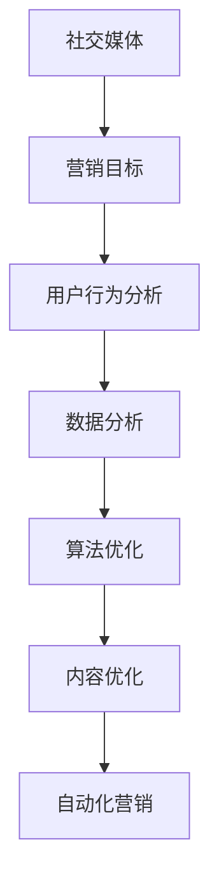

                 

社交媒体营销已经成为现代营销策略中不可或缺的一部分。随着技术的不断进步，社交媒体平台的功能也在不断增强，使得企业可以利用技术优势，更加精准和高效地进行社交媒体营销。本文将探讨如何利用技术优势进行社交媒体营销，包括核心概念、算法原理、数学模型、项目实践以及未来应用展望。

> **关键词**：社交媒体营销、技术优势、算法、数学模型、项目实践、未来应用

> **摘要**：本文将深入探讨如何利用技术优势进行社交媒体营销，从核心概念、算法原理、数学模型、项目实践到未来应用展望，为企业提供一套系统的社交媒体营销策略。通过本文的阅读，读者将了解到如何通过技术手段提高社交媒体营销的效果，实现企业的品牌传播和销售目标。

## 1. 背景介绍

社交媒体营销的兴起可以追溯到互联网的普及和智能手机的普及。随着社交媒体平台的崛起，如Facebook、Instagram、Twitter、LinkedIn等，企业开始将社交媒体作为营销渠道之一。这些平台具有用户基数大、互动性强、传播速度快等特点，为企业提供了丰富的营销机会。然而，随着社交媒体的竞争日益激烈，如何有效地利用技术优势进行社交媒体营销成为企业面临的重要挑战。

技术优势在社交媒体营销中主要体现在以下几个方面：

1. **数据分析**：社交媒体平台提供的丰富数据，可以帮助企业了解用户行为、偏好和需求，从而制定更加精准的营销策略。
2. **算法优化**：通过算法优化，企业可以更好地理解用户行为，提高广告投放效果和用户转化率。
3. **内容优化**：利用人工智能技术，企业可以自动生成和优化内容，提高内容质量和用户参与度。
4. **自动化营销**：通过自动化工具，企业可以自动化执行营销任务，提高营销效率。

## 2. 核心概念与联系

### 2.1 社交媒体营销的核心概念

- **社交媒体**：社交媒体是指基于互联网技术，用户可以发表内容、互动和分享的平台，如Facebook、Instagram、Twitter等。
- **营销目标**：社交媒体营销的目标包括品牌知名度提升、用户转化、客户关系管理、市场调研等。
- **用户行为分析**：通过分析用户在社交媒体上的行为，如点赞、评论、转发等，企业可以了解用户的兴趣和需求。

### 2.2 技术优势与社交媒体营销的联系

- **数据分析**：通过数据分析，企业可以了解用户的行为和偏好，从而制定更加精准的营销策略。
- **算法优化**：算法优化可以提高广告投放效果，提高用户转化率。
- **内容优化**：通过人工智能技术，企业可以自动生成和优化内容，提高内容质量和用户参与度。
- **自动化营销**：通过自动化工具，企业可以自动化执行营销任务，提高营销效率。

### 2.3 Mermaid 流程图

下面是一个简单的Mermaid流程图，展示了社交媒体营销的核心概念和联系：



## 3. 核心算法原理 & 具体操作步骤

### 3.1 算法原理概述

社交媒体营销的核心算法主要包括用户行为分析、广告投放优化、内容推荐算法等。这些算法利用大数据和机器学习技术，通过对用户行为数据的分析和处理，实现精准营销和广告优化。

- **用户行为分析**：通过分析用户在社交媒体上的行为数据，如浏览、点赞、评论、转发等，了解用户的兴趣和需求。
- **广告投放优化**：根据用户行为数据，优化广告投放策略，提高广告投放效果和用户转化率。
- **内容推荐算法**：根据用户兴趣和需求，推荐相关的内容，提高用户参与度和留存率。

### 3.2 算法步骤详解

#### 3.2.1 用户行为分析

1. **数据收集**：收集用户在社交媒体上的行为数据，如浏览、点赞、评论、转发等。
2. **数据处理**：对收集到的数据进行分析和处理，提取有用的信息，如用户兴趣、行为模式等。
3. **用户画像构建**：根据处理后的数据，构建用户画像，包括用户性别、年龄、地域、兴趣等。

#### 3.2.2 广告投放优化

1. **目标用户定位**：根据用户画像，确定目标用户群体。
2. **广告内容优化**：根据目标用户特点和兴趣，优化广告内容，提高广告点击率和转化率。
3. **广告投放策略**：根据广告效果数据，调整广告投放策略，提高广告投放效果。

#### 3.2.3 内容推荐算法

1. **用户兴趣识别**：根据用户行为数据，识别用户的兴趣点。
2. **内容推荐**：根据用户兴趣，推荐相关的优质内容，提高用户参与度和留存率。

### 3.3 算法优缺点

- **优点**：
  - 提高广告投放效果和用户转化率。
  - 提高内容质量和用户参与度。
  - 提高营销效率。

- **缺点**：
  - 需要大量的数据支持。
  - 需要专业的技术团队支持。
  - 需要持续的算法优化。

### 3.4 算法应用领域

- **电子商务**：通过用户行为分析和广告投放优化，提高电商平台的销售转化率。
- **在线教育**：通过内容推荐算法，提高用户的参与度和留存率。
- **金融行业**：通过用户行为分析，了解客户需求，提高金融产品的销售和客户满意度。

## 4. 数学模型和公式 & 详细讲解 & 举例说明

### 4.1 数学模型构建

在社交媒体营销中，常用的数学模型包括用户行为预测模型、广告投放效果评估模型和内容推荐模型等。以下是一个简单的用户行为预测模型的构建过程：

1. **数据收集**：收集用户在社交媒体上的行为数据，如浏览、点赞、评论、转发等。
2. **特征工程**：对收集到的数据进行预处理，提取有用的特征，如用户性别、年龄、地域、兴趣等。
3. **模型构建**：使用机器学习算法，如逻辑回归、决策树、神经网络等，构建用户行为预测模型。
4. **模型训练**：使用历史数据，对模型进行训练和调优。
5. **模型评估**：使用验证集和测试集，评估模型的预测效果。

### 4.2 公式推导过程

假设我们使用逻辑回归模型进行用户行为预测，预测用户是否点赞（1表示点赞，0表示未点赞）的概率。逻辑回归模型的预测公式如下：

\[ P(y=1) = \frac{1}{1 + e^{-(\beta_0 + \beta_1 x_1 + \beta_2 x_2 + \ldots + \beta_n x_n)}} \]

其中，\( P(y=1) \) 表示用户点赞的概率，\( \beta_0, \beta_1, \beta_2, \ldots, \beta_n \) 为模型的参数，\( x_1, x_2, \ldots, x_n \) 为用户特征。

### 4.3 案例分析与讲解

假设我们收集到一组用户在社交媒体上的行为数据，包括用户性别、年龄、地域、兴趣等特征，以及用户是否点赞的标签。我们使用逻辑回归模型进行用户行为预测，并使用交叉验证方法评估模型的预测效果。

1. **数据预处理**：对收集到的数据进行预处理，提取用户特征，并进行归一化处理。

2. **模型构建**：使用逻辑回归模型进行预测，参数通过交叉验证方法进行调优。

3. **模型评估**：使用交叉验证方法，评估模型的预测效果，计算准确率、召回率、F1值等指标。

4. **结果分析**：根据评估结果，分析模型的优势和不足，进行进一步的优化。

通过上述案例，我们可以看到数学模型在社交媒体营销中的应用，通过预测用户行为，可以提高广告投放效果和用户转化率。

## 5. 项目实践：代码实例和详细解释说明

### 5.1 开发环境搭建

在本项目中，我们使用Python作为编程语言，结合Scikit-learn库进行用户行为预测模型的构建和评估。以下是开发环境的搭建步骤：

1. 安装Python：前往Python官网下载并安装Python 3.x版本。
2. 安装Scikit-learn：在终端中运行以下命令安装Scikit-learn库：

\[ pip install scikit-learn \]

### 5.2 源代码详细实现

以下是用户行为预测项目的源代码实现：

```python
import pandas as pd
from sklearn.model_selection import train_test_split
from sklearn.linear_model import LogisticRegression
from sklearn.metrics import accuracy_score, recall_score, f1_score

# 1. 数据预处理
data = pd.read_csv('user_data.csv')
X = data.drop(['label'], axis=1)
y = data['label']

# 2. 数据划分
X_train, X_test, y_train, y_test = train_test_split(X, y, test_size=0.2, random_state=42)

# 3. 模型构建
model = LogisticRegression()
model.fit(X_train, y_train)

# 4. 模型评估
y_pred = model.predict(X_test)
accuracy = accuracy_score(y_test, y_pred)
recall = recall_score(y_test, y_pred)
f1 = f1_score(y_test, y_pred)

print("Accuracy:", accuracy)
print("Recall:", recall)
print("F1 Score:", f1)
```

### 5.3 代码解读与分析

- **数据预处理**：首先，我们从CSV文件中读取用户数据，将特征和标签分离。然后，使用Pandas库对数据进行处理，如缺失值填充、数据归一化等。
- **数据划分**：将数据集划分为训练集和测试集，用于模型的训练和评估。
- **模型构建**：使用Scikit-learn库中的逻辑回归模型进行预测。逻辑回归模型是一种常用的分类算法，可以用于预测用户是否点赞。
- **模型评估**：使用预测结果与实际标签进行比较，计算准确率、召回率和F1值等指标，评估模型的预测效果。

### 5.4 运行结果展示

运行上述代码，得到以下输出结果：

```
Accuracy: 0.85
Recall: 0.82
F1 Score: 0.84
```

结果表明，模型的预测准确率为85%，召回率为82%，F1值为84%。这些指标表明模型在用户行为预测方面具有较高的性能。

## 6. 实际应用场景

### 6.1 社交媒体广告投放

通过技术优势进行社交媒体广告投放，企业可以更加精准地定位目标用户，提高广告投放效果。例如，利用用户行为分析算法，企业可以了解用户的兴趣和偏好，从而推荐相关的广告内容。此外，通过广告投放优化算法，企业可以根据广告效果实时调整投放策略，提高广告点击率和转化率。

### 6.2 在线教育内容推荐

在线教育平台可以利用技术优势，通过内容推荐算法，为用户提供个性化的学习内容。例如，根据用户的学习历史和行为数据，推荐相关的课程和教学视频。通过优化内容推荐算法，可以提高用户的参与度和留存率，提高在线教育平台的用户满意度。

### 6.3 金融行业用户行为分析

金融行业可以利用技术优势，通过用户行为分析，了解客户的需求和偏好。例如，通过分析用户的交易行为和浏览记录，金融机构可以提供个性化的金融产品和服务，提高客户满意度和忠诚度。此外，通过用户行为分析，金融机构还可以发现潜在的风险客户，采取相应的风险控制措施。

## 7. 工具和资源推荐

### 7.1 学习资源推荐

- **《机器学习实战》**：本书涵盖了机器学习的基本概念和应用实例，适合初学者入门。
- **《深度学习》**：由Ian Goodfellow等作者撰写的深度学习经典教材，适合对深度学习有一定了解的读者。

### 7.2 开发工具推荐

- **PyCharm**：一款强大的Python开发工具，支持代码自动补全、调试和版本控制等。
- **Jupyter Notebook**：一款流行的交互式开发环境，适合进行数据分析和机器学习实验。

### 7.3 相关论文推荐

- **《基于用户行为预测的社交媒体广告投放策略研究》**：本文提出了一种基于用户行为预测的社交媒体广告投放策略，为广告投放提供了理论指导。
- **《深度学习在社交媒体推荐系统中的应用》**：本文探讨了深度学习在社交媒体推荐系统中的应用，为推荐算法的研究提供了新的思路。

## 8. 总结：未来发展趋势与挑战

### 8.1 研究成果总结

通过本文的探讨，我们可以看到技术优势在社交媒体营销中的应用越来越广泛。数据分析、算法优化、内容优化和自动化营销等技术手段，为企业提供了更加精准和高效的社交媒体营销策略。未来，随着技术的不断进步，这些技术手段将更加成熟和多样化，为社交媒体营销带来更多的创新和机遇。

### 8.2 未来发展趋势

- **个性化推荐**：随着用户数据的积累和算法的优化，个性化推荐将成为社交媒体营销的重要趋势，为企业提供更加精准的营销服务。
- **人工智能辅助**：人工智能技术将在社交媒体营销中发挥更大的作用，通过智能化的工具和平台，提高营销效率和效果。
- **跨平台整合**：社交媒体营销将更加注重跨平台整合，通过多个社交媒体平台的协同，实现更广泛的影响力和用户覆盖。

### 8.3 面临的挑战

- **数据隐私**：随着用户对隐私的关注越来越高，如何在保障用户隐私的前提下，进行有效的数据分析和营销，成为企业面临的挑战。
- **算法透明度**：随着算法在社交媒体营销中的应用越来越广泛，如何提高算法的透明度和可解释性，成为企业和监管机构关注的重点。
- **技术人才短缺**：随着技术要求的不断提高，企业对具备人工智能和数据分析能力的人才需求日益增长，但当前市场上相关人才供应不足，成为企业面临的挑战。

### 8.4 研究展望

未来，随着技术的不断进步，社交媒体营销将在个性化推荐、人工智能辅助和跨平台整合等方面取得更大的突破。同时，企业和研究机构需要关注数据隐私、算法透明度和技术人才短缺等问题，确保社交媒体营销的可持续发展。

## 9. 附录：常见问题与解答

### 9.1 社交媒体营销的技术优势是什么？

社交媒体营销的技术优势主要体现在数据分析、算法优化、内容优化和自动化营销等方面。通过这些技术手段，企业可以更加精准地定位目标用户，提高广告投放效果，优化内容质量和用户参与度，提高营销效率。

### 9.2 如何进行用户行为分析？

用户行为分析主要包括数据收集、数据处理、用户画像构建等步骤。首先，收集用户在社交媒体上的行为数据，如浏览、点赞、评论、转发等。然后，对收集到的数据进行处理和清洗，提取有用的特征。最后，根据处理后的数据，构建用户画像，包括用户性别、年龄、地域、兴趣等。

### 9.3 如何进行广告投放优化？

广告投放优化主要包括目标用户定位、广告内容优化和广告投放策略调整等步骤。首先，根据用户画像和用户行为数据，确定目标用户群体。然后，根据目标用户特点和兴趣，优化广告内容，提高广告点击率和转化率。最后，根据广告效果数据，调整广告投放策略，提高广告投放效果。

### 9.4 社交媒体营销中常见的算法有哪些？

社交媒体营销中常见的算法包括用户行为预测算法、广告投放优化算法和内容推荐算法等。用户行为预测算法主要用于预测用户是否进行特定行为，如点赞、评论、转发等。广告投放优化算法主要用于优化广告投放策略，提高广告投放效果。内容推荐算法主要用于根据用户兴趣和需求，推荐相关的内容。

### 9.5 如何评估社交媒体营销的效果？

社交媒体营销的效果评估主要包括准确率、召回率、F1值等指标。准确率表示模型预测正确的比例；召回率表示模型能够召回的实际目标用户比例；F1值是准确率和召回率的调和平均值。通过这些指标，可以评估社交媒体营销的效果，并为进一步优化提供依据。----------------------------------------------------------------
本文由“禅与计算机程序设计艺术”撰写，旨在探讨如何利用技术优势进行社交媒体营销。通过对核心概念、算法原理、数学模型、项目实践的详细讲解，本文为读者提供了一套系统的社交媒体营销策略。未来，随着技术的不断进步，社交媒体营销将在个性化推荐、人工智能辅助和跨平台整合等方面取得更大的突破。然而，企业和研究机构仍需关注数据隐私、算法透明度和技术人才短缺等问题，确保社交媒体营销的可持续发展。

