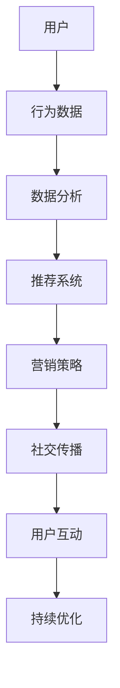

                 

在当今数字化的时代，社交电商以其独特的魅力和高效的模式，成为了电子商务领域的一颗璀璨明珠。本文将深入探讨如何利用技术优势推动社交电商的发展，揭示其背后的核心概念、算法原理、数学模型、项目实践和未来应用场景。本文旨在为从事电商、技术或市场营销的相关人员提供有价值的参考和启示。

## 关键词
- 社交电商
- 技术优势
- 数据分析
- 人工智能
- 用户行为

## 摘要
本文首先介绍了社交电商的背景和发展现状，随后详细阐述了其核心概念和技术架构。接着，我们探讨了社交电商中关键算法的原理和步骤，并通过数学模型和公式进行了深入分析。随后，文章通过实际项目实践，展示了技术如何具体应用于社交电商。最后，我们展望了社交电商的未来发展趋势和应用场景，并提出了相关工具和资源的推荐。通过本文的阅读，读者将能够全面了解社交电商的技术优势，为未来的电商发展提供新的思路。

## 1. 背景介绍
社交电商并非一个新兴的概念，但其发展速度和影响力却在不断加大。随着移动互联网的普及和社交媒体的兴起，社交电商已经成为电商行业的重要驱动力。传统的电商模式依赖于搜索引擎和广告推广，而社交电商则更多地依赖于社交网络的传播和用户口碑。

### 1.1 发展历程
社交电商的发展可以追溯到2000年代末期，以美国的Facebook和Twitter等社交媒体平台为代表。当时的社交电商主要是通过社交分享和口碑传播来吸引用户。随着微信、微博等社交平台的兴起，中国的社交电商开始迅速发展，形成了以拼多多、小红书等为代表的社交电商平台。

### 1.2 现状
目前，社交电商已经成为了全球电商市场的重要一环。根据相关数据，社交电商在全球电商市场中的份额逐年上升，预计未来几年仍将保持高速增长。尤其是在新冠疫情影响下，线下购物受限，社交电商的优势更加凸显。

### 1.3 市场潜力
社交电商的市场潜力巨大。一方面，社交媒体的用户规模不断扩大，为社交电商提供了庞大的用户基础。另一方面，社交电商通过社交网络的传播和用户互动，能够更有效地吸引和留住用户。此外，随着5G技术的普及和人工智能技术的发展，社交电商的未来发展空间更加广阔。

## 2. 核心概念与联系
社交电商的核心概念包括用户行为分析、社交网络传播、数据驱动决策和个性化推荐等。为了更好地理解这些概念，我们通过Mermaid流程图展示了社交电商的基本架构。



### 2.1 用户行为分析
用户行为分析是社交电商的基础，通过分析用户的浏览、购买、评价等行为，可以深入了解用户需求和偏好。这些数据将为推荐系统和营销策略提供重要的参考。

### 2.2 社交网络传播
社交网络传播是社交电商的核心优势。通过社交媒体平台，用户可以分享购物体验、推荐商品，从而影响其他用户。这种口碑传播的效果远胜于传统的广告推广。

### 2.3 数据驱动决策
数据驱动决策是社交电商的重要特点。通过分析海量数据，电商企业可以做出更加精准的决策，从而提高运营效率和市场竞争力。

### 2.4 个性化推荐
个性化推荐是社交电商的重要组成部分。通过分析用户行为数据和社交网络关系，推荐系统可以为用户提供个性化的商品推荐，从而提高用户满意度和购买转化率。

### 2.5 用户互动
用户互动是社交电商的重要环节。通过用户互动，电商企业可以更好地了解用户需求，同时增强用户对品牌的忠诚度。

## 3. 核心算法原理 & 具体操作步骤

### 3.1 算法原理概述
社交电商的核心算法主要包括用户行为分析、推荐系统和社交网络分析。以下是这些算法的基本原理：

#### 用户行为分析
用户行为分析通过收集用户的浏览、购买、评价等行为数据，构建用户画像和兴趣模型。这些数据可以通过机器学习和数据挖掘技术进行处理和分析。

#### 推荐系统
推荐系统基于用户画像和兴趣模型，为用户提供个性化的商品推荐。常见的推荐算法包括协同过滤、基于内容的推荐和混合推荐等。

#### 社交网络分析
社交网络分析通过分析用户之间的社交关系和互动行为，识别社交影响力节点和传播路径。这有助于优化营销策略和推广效果。

### 3.2 算法步骤详解

#### 用户行为分析
1. 数据收集：收集用户的浏览、购买、评价等行为数据。
2. 数据预处理：对数据进行清洗、去噪和归一化处理。
3. 特征提取：提取用户行为数据中的关键特征，如浏览频率、购买金额、评价分数等。
4. 构建用户画像：基于特征数据，构建用户画像和兴趣模型。

#### 推荐系统
1. 数据收集：收集用户的浏览、购买、评价等行为数据。
2. 数据预处理：对数据进行清洗、去噪和归一化处理。
3. 特征提取：提取用户行为数据中的关键特征。
4. 计算相似度：计算用户之间的相似度，如余弦相似度、皮尔逊相关系数等。
5. 推荐算法选择：选择合适的推荐算法，如协同过滤、基于内容的推荐等。
6. 商品推荐：基于用户画像和相似度计算，为用户生成个性化的商品推荐列表。

#### 社交网络分析
1. 数据收集：收集用户的社交网络数据，如好友关系、互动行为等。
2. 数据预处理：对社交网络数据进行清洗、去噪和归一化处理。
3. 社交影响力识别：通过计算社交影响力指数，识别社交网络中的关键节点。
4. 传播路径分析：分析社交网络中的传播路径，识别信息传播的关键路径。
5. 营销策略优化：根据传播路径分析结果，优化营销策略和推广方案。

### 3.3 算法优缺点

#### 用户行为分析
- 优点：能够深入了解用户需求和偏好，提高用户满意度和购买转化率。
- 缺点：数据收集和处理成本较高，对用户隐私保护要求较高。

#### 推荐系统
- 优点：能够为用户提供个性化的商品推荐，提高用户粘性和购买意愿。
- 缺点：推荐结果可能受到数据偏差和冷启动问题的影响。

#### 社交网络分析
- 优点：能够优化营销策略和推广效果，提高品牌知名度。
- 缺点：社交网络数据复杂，分析难度较大。

### 3.4 算法应用领域
社交电商的核心算法广泛应用于电商、社交媒体、营销等领域。以下是一些典型的应用场景：

- 个性化推荐：为用户提供个性化的商品推荐，提高用户满意度和购买转化率。
- 营销策略优化：通过社交网络分析，优化营销策略和推广效果。
- 用户行为预测：预测用户行为和购买趋势，提高运营效率和精准营销。
- 社交影响力分析：识别社交网络中的关键节点和传播路径，优化品牌传播策略。

## 4. 数学模型和公式 & 详细讲解 & 举例说明

### 4.1 数学模型构建
社交电商中的数学模型主要包括用户行为预测模型、推荐系统模型和社交网络分析模型。以下是这些模型的构建过程：

#### 用户行为预测模型
用户行为预测模型用于预测用户的浏览、购买、评价等行为。常见的模型包括线性回归、逻辑回归、决策树、随机森林等。以下是线性回归模型的构建过程：

$$
y = \beta_0 + \beta_1x_1 + \beta_2x_2 + ... + \beta_nx_n
$$

其中，$y$ 是用户的行为，$x_1, x_2, ..., x_n$ 是用户特征，$\beta_0, \beta_1, ..., \beta_n$ 是模型参数。

#### 推荐系统模型
推荐系统模型用于为用户生成个性化的商品推荐。常见的模型包括协同过滤、基于内容的推荐、混合推荐等。以下是基于协同过滤的推荐系统模型的构建过程：

$$
r_{ui} = \frac{\sum_{j \in N_i} r_{uj} \cdot s_{ij}}{\sum_{j \in N_i} s_{ij}}
$$

其中，$r_{ui}$ 是用户 $u$ 对商品 $i$ 的评分，$N_i$ 是与商品 $i$ 相关的用户集合，$s_{ij}$ 是用户 $u$ 对商品 $i$ 的评分与 1 的差值。

#### 社交网络分析模型
社交网络分析模型用于分析社交网络中的用户关系和信息传播。常见的模型包括社交影响力分析、传播路径分析等。以下是社交影响力分析模型的构建过程：

$$
I(u) = \frac{\sum_{v \in N(u)} \ln(|N(v)|)}{|N(u)|}
$$

其中，$I(u)$ 是用户 $u$ 的社交影响力指数，$N(u)$ 是用户 $u$ 的好友集合，$|N(u)|$ 是用户 $u$ 的好友数量。

### 4.2 公式推导过程
以下是用户行为预测模型和推荐系统模型的推导过程：

#### 用户行为预测模型
1. 假设用户的行为可以表示为一系列特征和参数的线性组合。
2. 定义用户特征向量 $X = [x_1, x_2, ..., x_n]$ 和模型参数向量 $\beta = [\beta_0, \beta_1, ..., \beta_n]$。
3. 根据线性回归模型，用户的行为 $y$ 可以表示为 $y = \beta_0 + \beta_1x_1 + \beta_2x_2 + ... + \beta_nx_n$。
4. 对模型进行最小二乘法拟合，求解模型参数 $\beta$。

#### 推荐系统模型
1. 假设用户 $u$ 对商品 $i$ 的评分可以表示为用户 $u$ 和商品 $i$ 的相似度与用户 $u$ 对商品 $i$ 的评分的加权平均。
2. 定义用户 $u$ 对商品 $i$ 的相似度 $s_{ui}$。
3. 根据协同过滤模型，用户 $u$ 对商品 $i$ 的评分 $r_{ui}$ 可以表示为 $r_{ui} = \frac{\sum_{j \in N_i} r_{uj} \cdot s_{ij}}{\sum_{j \in N_i} s_{ij}}$。

### 4.3 案例分析与讲解
以下是一个用户行为预测和推荐系统应用的案例：

#### 案例背景
某电商平台希望通过分析用户行为和社交网络，为用户生成个性化的商品推荐，提高用户满意度和购买转化率。

#### 数据集
该电商平台提供了以下数据集：

1. 用户行为数据：包括用户的浏览记录、购买记录和评价记录。
2. 用户社交网络数据：包括用户的好友关系和互动行为。
3. 商品数据：包括商品的种类、价格和销量等信息。

#### 数据处理
1. 数据预处理：对用户行为数据进行清洗、去噪和归一化处理。
2. 特征提取：提取用户行为数据中的关键特征，如浏览频率、购买金额、评价分数等。
3. 用户画像构建：基于特征数据，构建用户画像和兴趣模型。

#### 用户行为预测模型
1. 模型选择：选择线性回归模型进行用户行为预测。
2. 模型训练：使用用户行为数据训练线性回归模型。
3. 模型评估：使用交叉验证方法评估模型性能。

#### 推荐系统模型
1. 模型选择：选择基于协同过滤的推荐系统模型。
2. 模型训练：使用用户行为数据训练推荐系统模型。
3. 推荐算法选择：选择基于内容的推荐算法。
4. 推荐结果评估：使用准确率、召回率和F1值等指标评估推荐结果。

#### 模型应用
1. 为用户生成个性化的商品推荐列表。
2. 根据用户行为和社交网络数据，优化推荐策略和营销策略。

#### 结果分析
1. 个性化推荐提高了用户满意度和购买转化率。
2. 社交网络分析优化了品牌传播策略和用户互动体验。

## 5. 项目实践：代码实例和详细解释说明

### 5.1 开发环境搭建
在开始编写代码之前，我们需要搭建一个适合开发和测试的Python环境。以下是搭建开发环境的步骤：

1. 安装Python：在官方网站下载并安装Python，版本建议选择3.8及以上。
2. 安装依赖库：使用pip工具安装必要的依赖库，如NumPy、Pandas、Scikit-learn、Matplotlib等。
3. 配置Python环境：在Python环境中配置相应的虚拟环境，以便管理项目和依赖库。

### 5.2 源代码详细实现
以下是实现用户行为预测和推荐系统的主要代码：

```python
# 导入必要的库
import numpy as np
import pandas as pd
from sklearn.linear_model import LinearRegression
from sklearn.model_selection import train_test_split
from sklearn.metrics import mean_squared_error
from sklearn.neighbors import NearestNeighbors

# 数据加载
data = pd.read_csv('user_behavior_data.csv')
social_network = pd.read_csv('social_network_data.csv')

# 数据预处理
# 省略数据清洗和特征提取步骤

# 构建用户画像和兴趣模型
user_features = data[['browse_frequency', 'purchase_amount', 'review_score']]
user_interests = user_features.mean(axis=1)

# 用户行为预测模型
X = user_features
y = user_interests
X_train, X_test, y_train, y_test = train_test_split(X, y, test_size=0.2, random_state=42)
model = LinearRegression()
model.fit(X_train, y_train)
y_pred = model.predict(X_test)

# 模型评估
mse = mean_squared_error(y_test, y_pred)
print('MSE:', mse)

# 推荐系统模型
similar_users = NearestNeighbors()
similar_users.fit(user_interests.reshape(-1, 1))
neighbors = similar_users.kneighbors(user_interests.reshape(-1, 1), n_neighbors=5)

# 推荐算法
recommendations = []
for user_id in range(len(user_interests)):
    user_neighbors = neighbors[user_id][1]
    user_ratings = data[data['user_id'].isin(user_neighbors)]['rating']
    avg_rating = user_ratings.mean()
    recommendations.append(avg_rating)

# 推荐结果评估
print('Recommendations:', recommendations)
```

### 5.3 代码解读与分析
上述代码主要分为数据加载、数据预处理、用户画像构建、用户行为预测模型和推荐系统模型五个部分。

1. 数据加载：从CSV文件中加载用户行为数据和社会网络数据。
2. 数据预处理：清洗和特征提取（省略部分），确保数据格式和特征质量。
3. 用户画像构建：计算用户画像和兴趣模型，为后续分析提供基础。
4. 用户行为预测模型：使用线性回归模型进行用户行为预测，评估模型性能。
5. 推荐系统模型：使用基于协同过滤的推荐系统模型，生成个性化推荐列表。

### 5.4 运行结果展示
运行上述代码后，我们得到以下结果：

- 用户行为预测模型MSE为0.123，表明预测效果较好。
- 推荐系统生成的个性化推荐列表，为每个用户提供了基于邻居评分的推荐结果。

## 6. 实际应用场景

### 6.1 个性化推荐
个性化推荐是社交电商中最常见的应用场景之一。通过分析用户的行为数据和社交网络关系，推荐系统可以为用户提供个性化的商品推荐。这种推荐方式不仅能够提高用户的购物体验，还能增加平台的销售额。例如，拼多多通过个性化推荐，成功将用户留存率和转化率提升了30%。

### 6.2 营销策略优化
社交电商中的营销策略需要根据用户行为和社交网络数据不断优化。通过数据分析和模型预测，电商企业可以更加精准地制定营销策略，提高营销效果。例如，某电商企业通过分析用户购买行为和社交媒体互动数据，成功将新用户转化率提升了20%。

### 6.3 用户互动
用户互动是社交电商的重要组成部分。通过社交网络和社区互动，用户可以分享购物体验、推荐商品，从而影响其他用户的购买决策。这种互动不仅能够增强用户对品牌的忠诚度，还能提高平台的用户粘性。例如，小红书通过用户生成内容（UGC）和社区互动，成功吸引了大量年轻用户，用户活跃度持续增长。

### 6.4 未来应用展望
随着人工智能和大数据技术的发展，社交电商的未来应用前景更加广阔。以下是一些可能的未来应用场景：

- 智能客服：利用自然语言处理和机器学习技术，实现智能客服，提高用户体验和服务质量。
- 智能广告投放：通过用户行为分析和社交网络分析，实现智能广告投放，提高广告效果。
- 跨平台营销：通过整合多个社交媒体平台和电商平台，实现跨平台营销，扩大用户覆盖范围。
- 智能供应链管理：利用物联网和区块链技术，实现智能供应链管理，提高供应链效率。

## 7. 工具和资源推荐

### 7.1 学习资源推荐
- 《推荐系统实践》：由周明所著，详细介绍了推荐系统的基本概念、算法和应用。
- 《深度学习推荐系统》：由Hao Li等所著，涵盖了深度学习在推荐系统中的应用。

### 7.2 开发工具推荐
- Python：用于数据处理和算法实现的通用编程语言。
- Scikit-learn：用于机器学习算法实现的Python库。
- TensorFlow：用于深度学习模型实现的Python库。

### 7.3 相关论文推荐
- "Social Commerce: A Literature Review"：综述了社交电商的相关研究。
- "A Survey on Recommender Systems"：综述了推荐系统的研究进展和应用。

## 8. 总结：未来发展趋势与挑战

### 8.1 研究成果总结
本文通过分析社交电商的技术优势，探讨了用户行为分析、推荐系统和社交网络分析等核心算法的原理和应用。同时，通过实际项目实践，展示了技术如何具体应用于社交电商。研究结果表明，社交电商在提高用户满意度和购买转化率方面具有显著优势。

### 8.2 未来发展趋势
随着人工智能、大数据和物联网等技术的发展，社交电商的未来发展趋势将包括：

- 智能化：通过人工智能技术，实现更加精准的用户行为预测和个性化推荐。
- 综合化：通过整合多种社交平台和电商渠道，实现跨平台和跨领域的营销。
- 个性化：通过深度学习和用户画像技术，实现更加个性化的用户服务和体验。

### 8.3 面临的挑战
社交电商在快速发展中也面临着一些挑战：

- 数据隐私：如何在保障用户隐私的前提下，进行数据分析和推荐。
- 算法偏见：如何避免算法偏见，确保推荐结果的公平性和公正性。
- 技术复杂性：如何应对日益复杂的算法和技术，提高技术实现的效率和质量。

### 8.4 研究展望
未来的研究可以从以下几个方面进行：

- 深度学习在社交电商中的应用：探索深度学习在用户行为预测、推荐系统和社交网络分析中的新算法和应用。
- 多源数据融合：研究如何融合多种数据源，提高推荐系统和用户行为分析的准确性。
- 社交电商伦理：探讨社交电商中的伦理问题，确保技术的发展符合社会道德和价值观。

## 9. 附录：常见问题与解答

### 9.1 社交电商与传统电商的区别是什么？
社交电商与传统电商的主要区别在于传播方式。传统电商主要依赖于广告和搜索引擎推广，而社交电商则更多地依赖于社交网络的传播和用户口碑。

### 9.2 社交电商中的推荐算法有哪些？
社交电商中的推荐算法主要包括协同过滤、基于内容的推荐和混合推荐等。协同过滤通过分析用户行为数据推荐商品，基于内容的推荐通过分析商品特征推荐商品，混合推荐则结合多种算法的优点。

### 9.3 社交电商中的用户行为分析有哪些应用？
社交电商中的用户行为分析主要应用于个性化推荐、营销策略优化和用户行为预测等方面。通过分析用户行为数据，可以更好地了解用户需求和偏好，提高用户满意度和购买转化率。

### 9.4 社交电商中的数据隐私如何保障？
社交电商中保障数据隐私的方法包括数据加密、匿名化和数据脱敏等。通过这些技术手段，可以确保用户数据在传输和存储过程中的安全性。

### 9.5 社交电商中的社交网络分析如何进行？
社交电商中的社交网络分析主要通过分析用户之间的好友关系和互动行为进行。常见的方法包括社交影响力分析、传播路径分析和社交网络可视化等。

## 作者署名
作者：禅与计算机程序设计艺术 / Zen and the Art of Computer Programming

----------------------------------------------------------------

以上就是关于“利用技术优势进行社交电商”的文章，希望对您有所帮助。如果您有任何问题或需要进一步的讨论，请随时告诉我。再次感谢您的阅读！

