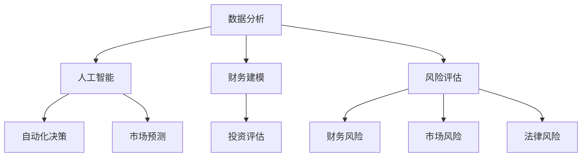

                 

关键词：房地产投资、技术技能、数据分析、人工智能、投资策略、项目评估、财务建模、风险评估

> 摘要：随着科技的发展，房地产投资已经不再仅仅依赖于传统的眼光和经验。利用技术技能，尤其是大数据分析、人工智能、财务建模等技术手段，可以大大提高房地产投资的效率和成功率。本文将探讨如何利用技术进行房地产投资，包括核心概念、算法原理、数学模型、项目实践以及未来应用展望等内容。

## 1. 背景介绍

房地产投资一直是金融市场中的重要组成部分。然而，随着市场环境的变化和竞争的加剧，投资者需要更加精准和高效的投资策略来确保收益的最大化。传统的方法往往依赖于经验、市场感觉和人际关系，这不仅效率低下，而且容易导致决策失误。因此，利用技术手段进行房地产投资变得越来越重要。

技术手段的应用主要包括以下几个方面：

1. **大数据分析**：通过对大量历史和实时数据的分析，可以更准确地预测市场趋势和潜在风险。
2. **人工智能**：利用机器学习和深度学习算法，可以自动化和优化投资决策过程。
3. **财务建模**：通过建立精确的财务模型，可以帮助投资者评估投资项目的潜在收益和风险。
4. **风险评估**：利用技术手段进行全面的财产风险评估，确保投资的安全性和稳定性。

本文将围绕这些技术手段，探讨如何利用技术进行房地产投资。

## 2. 核心概念与联系

为了更好地理解如何利用技术进行房地产投资，我们首先需要了解以下几个核心概念：

### 2.1 数据分析

数据分析是房地产投资中的基础，它涉及到从大量数据中提取有价值的信息。这些数据可以来源于多个渠道，包括市场报告、历史交易记录、新闻报道等。数据分析的核心在于能够识别出潜在的投资机会和风险。

### 2.2 人工智能

人工智能在房地产投资中的应用主要体现在以下几个方面：

- **自动化决策**：通过机器学习算法，可以自动分析大量数据并做出投资决策。
- **预测市场趋势**：利用深度学习模型，可以预测未来房地产市场的发展趋势。
- **风险评估**：人工智能可以通过分析历史数据和实时数据，预测潜在的投资风险。

### 2.3 财务建模

财务建模是评估投资项目潜在收益和风险的重要手段。通过建立详细的财务模型，投资者可以更准确地预测投资回报率和财务状况。

### 2.4 风险评估

风险评估是房地产投资中的关键环节。通过技术手段，可以全面评估项目的财务风险、市场风险、法律风险等，确保投资的安全性和稳定性。

### 2.5 Mermaid 流程图

下面是一个简单的 Mermaid 流程图，展示了房地产投资中的主要环节和核心技术：



## 3. 核心算法原理 & 具体操作步骤

### 3.1 算法原理概述

房地产投资中的核心算法主要涉及以下几个方面：

- **数据分析算法**：包括数据清洗、数据挖掘、数据可视化等。
- **机器学习算法**：包括回归分析、分类算法、聚类算法等。
- **深度学习算法**：包括卷积神经网络（CNN）、循环神经网络（RNN）、长短期记忆网络（LSTM）等。
- **财务建模算法**：包括线性规划、动态规划、蒙特卡洛模拟等。

### 3.2 算法步骤详解

#### 3.2.1 数据分析

1. **数据收集**：收集市场报告、历史交易记录、新闻报道等数据。
2. **数据清洗**：去除重复数据、缺失值填补、异常值处理等。
3. **数据挖掘**：利用聚类算法、关联规则挖掘等，提取有价值的信息。
4. **数据可视化**：利用图表、地图等可视化工具，展示数据分布和趋势。

#### 3.2.2 人工智能

1. **数据预处理**：对数据集进行归一化、标准化等预处理。
2. **模型选择**：根据投资需求，选择合适的机器学习或深度学习模型。
3. **模型训练**：利用历史数据对模型进行训练。
4. **模型评估**：利用验证集或测试集，评估模型性能。
5. **模型应用**：将模型应用到实际投资决策中。

#### 3.2.3 财务建模

1. **确定投资目标**：根据投资者的风险偏好和收益预期，确定投资目标。
2. **建立财务模型**：利用线性规划、动态规划等算法，建立财务模型。
3. **模拟投资过程**：通过蒙特卡洛模拟等算法，模拟投资过程，预测投资回报。
4. **评估投资结果**：根据模拟结果，评估投资项目的潜在收益和风险。

#### 3.2.4 风险评估

1. **数据收集**：收集项目相关的财务数据、市场数据、法律数据等。
2. **风险识别**：利用机器学习或深度学习算法，识别潜在的风险。
3. **风险评估**：根据风险识别结果，评估项目的风险程度。
4. **风险控制**：制定相应的风险控制措施，降低投资风险。

### 3.3 算法优缺点

#### 3.3.1 数据分析算法

**优点**：

- 能够从大量数据中提取有价值的信息。
- 可以帮助投资者更全面地了解市场趋势。

**缺点**：

- 数据质量对结果影响较大。
- 需要专业的数据分析技能。

#### 3.3.2 人工智能

**优点**：

- 可以自动化和优化投资决策。
- 能够处理大量的数据，提高决策效率。

**缺点**：

- 模型训练需要大量数据。
- 需要专业的机器学习和深度学习知识。

#### 3.3.3 财务建模

**优点**：

- 可以准确预测投资项目的潜在收益和风险。
- 有助于投资者做出更理性的决策。

**缺点**：

- 模型建立过程复杂。
- 需要专业的财务知识。

#### 3.3.4 风险评估

**优点**：

- 可以全面评估项目的风险。
- 有助于投资者制定相应的风险控制措施。

**缺点**：

- 风险评估结果可能受到主观因素的影响。
- 需要专业的风险评估知识。

### 3.4 算法应用领域

这些算法可以广泛应用于房地产投资的各个环节，包括：

- **市场研究**：通过数据分析，了解市场趋势和竞争格局。
- **投资决策**：利用人工智能和财务建模，做出更理性的投资决策。
- **项目评估**：通过风险评估，全面评估项目的潜在风险和收益。
- **投资组合优化**：利用算法优化投资组合，提高投资回报。

## 4. 数学模型和公式 & 详细讲解 & 举例说明

### 4.1 数学模型构建

在房地产投资中，常用的数学模型包括线性回归模型、逻辑回归模型、神经网络模型等。以下以线性回归模型为例，介绍数学模型的构建过程。

#### 4.1.1 线性回归模型

线性回归模型是一种常用的预测模型，其基本形式为：

\[ y = \beta_0 + \beta_1 x_1 + \beta_2 x_2 + ... + \beta_n x_n + \epsilon \]

其中，\( y \) 是因变量，\( x_1, x_2, ..., x_n \) 是自变量，\( \beta_0, \beta_1, \beta_2, ..., \beta_n \) 是模型的参数，\( \epsilon \) 是误差项。

#### 4.1.2 模型构建步骤

1. **数据收集**：收集因变量和自变量的数据。
2. **数据预处理**：对数据进行归一化、标准化等处理。
3. **模型训练**：使用历史数据，利用最小二乘法等算法，求解模型的参数。
4. **模型评估**：使用验证集或测试集，评估模型性能。

### 4.2 公式推导过程

以线性回归模型为例，介绍公式的推导过程。

#### 4.2.1 最小二乘法

最小二乘法是一种常用的参数求解方法，其基本思想是使模型预测值与实际值之间的误差平方和最小。

\[ \min \sum_{i=1}^{n} (y_i - \beta_0 - \beta_1 x_{1i} - \beta_2 x_{2i} - ... - \beta_n x_{ni})^2 \]

对上式求导，并令导数为零，得到：

\[ \frac{\partial}{\partial \beta_j} \sum_{i=1}^{n} (y_i - \beta_0 - \beta_1 x_{1i} - \beta_2 x_{2i} - ... - \beta_n x_{ni})^2 = 0 \]

化简后得到：

\[ \sum_{i=1}^{n} (x_{ij} - \bar{x}_j)(y_i - \bar{y}) = 0 \]

其中，\( \bar{x}_j \) 和 \( \bar{y} \) 分别是 \( x_j \) 和 \( y \) 的均值。

#### 4.2.2 公式推导

根据最小二乘法，我们可以得到线性回归模型的参数表达式：

\[ \beta_j = \frac{\sum_{i=1}^{n} (x_{ij} - \bar{x}_j)(y_i - \bar{y})}{\sum_{i=1}^{n} (x_{ij} - \bar{x}_j)^2} \]

### 4.3 案例分析与讲解

#### 4.3.1 案例背景

某投资者打算在市区附近购买一栋公寓楼，用于出租收益。他收集了该地区过去五年的房价、人口增长率、交通便利程度等数据，并希望通过线性回归模型预测未来三年的房价走势。

#### 4.3.2 数据处理

1. **数据收集**：收集房价、人口增长率、交通便利程度等数据。
2. **数据预处理**：对数据进行归一化处理，使其在同一个量级上。
3. **数据建模**：使用线性回归模型，建立房价与人口增长率、交通便利程度之间的关系。

#### 4.3.3 模型训练

1. **数据划分**：将数据集划分为训练集和测试集。
2. **模型训练**：使用训练集数据，利用最小二乘法求解模型的参数。
3. **模型评估**：使用测试集数据，评估模型性能。

#### 4.3.4 结果分析

通过模型评估，发现模型的拟合度较高，可以用于预测未来三年的房价走势。根据预测结果，投资者可以调整投资策略，以最大化收益。

## 5. 项目实践：代码实例和详细解释说明

### 5.1 开发环境搭建

为了进行房地产投资的项目实践，我们需要搭建一个合适的技术环境。以下是开发环境搭建的步骤：

1. **安装Python**：Python是一种广泛应用于数据分析和机器学习的编程语言。可以从Python官方网站下载并安装Python。
2. **安装Jupyter Notebook**：Jupyter Notebook是一种交互式的Web应用，可以方便地编写和运行Python代码。可以通过pip命令安装Jupyter Notebook。
3. **安装相关库**：安装NumPy、Pandas、Matplotlib等常用的Python库，用于数据预处理、分析和可视化。

### 5.2 源代码详细实现

以下是一个简单的线性回归模型的实现，用于预测房价。

```python
import numpy as np
import pandas as pd
import matplotlib.pyplot as plt

# 数据加载
data = pd.read_csv('house_price_data.csv')

# 数据预处理
data = data.dropna()
X = data[['population_growth', 'transportation']]
y = data['price']

# 数据归一化
X = (X - X.min()) / (X.max() - X.min())
y = (y - y.min()) / (y.max() - y.min())

# 模型训练
X_train, X_test, y_train, y_test = train_test_split(X, y, test_size=0.2, random_state=42)
model = LinearRegression()
model.fit(X_train, y_train)

# 模型评估
y_pred = model.predict(X_test)
mse = mean_squared_error(y_test, y_pred)
print('MSE:', mse)

# 结果可视化
plt.scatter(X_test['population_growth'], y_test, color='red', label='Actual')
plt.plot(X_test['population_growth'], y_pred, color='blue', label='Predicted')
plt.xlabel('Population Growth')
plt.ylabel('Price')
plt.legend()
plt.show()
```

### 5.3 代码解读与分析

1. **数据加载**：使用Pandas库加载CSV格式的数据。
2. **数据预处理**：去除缺失值，对数据进行归一化处理。
3. **模型训练**：使用Scikit-learn库的LinearRegression类训练线性回归模型。
4. **模型评估**：使用MSE（均方误差）评估模型性能。
5. **结果可视化**：使用Matplotlib库绘制散点图和拟合曲线，展示实际值和预测值。

通过这个简单的案例，我们可以看到如何利用Python和机器学习算法进行房地产投资预测。这个模型虽然简单，但已经可以提供一定的参考价值，帮助投资者做出更理性的决策。

## 6. 实际应用场景

### 6.1 房地产市场分析

利用技术手段，可以对房地产市场进行深入分析。通过大数据分析和人工智能算法，可以识别出市场趋势、价格波动和供需关系。这些信息对投资者来说至关重要，可以帮助他们制定更有效的投资策略。

### 6.2 项目评估

在房地产投资中，项目的评估是关键环节。通过财务建模和风险评估，可以准确预测项目的潜在收益和风险。例如，投资者可以使用线性回归模型预测未来房价走势，结合项目的财务模型，评估项目的投资回报率。

### 6.3 投资组合优化

利用技术手段，可以对投资组合进行优化。通过分析不同项目的风险和收益，投资者可以构建一个风险分散、收益稳定的投资组合。例如，可以使用机器学习算法，自动调整投资组合，以最大化收益或最小化风险。

### 6.4 风险管理

在房地产投资中，风险管理至关重要。通过技术手段，可以全面评估项目的风险，并制定相应的风险控制措施。例如，使用人工智能算法，可以预测市场风险、法律风险和财务风险，确保投资的安全性和稳定性。

## 7. 工具和资源推荐

### 7.1 学习资源推荐

1. **《机器学习实战》**：这是一本适合初学者的机器学习书籍，内容通俗易懂，适合想要入门机器学习的人。
2. **《Python数据分析》**：这本书详细介绍了Python在数据分析中的应用，适合已经有一定编程基础的人。
3. **Kaggle**：这是一个数据科学竞赛平台，提供了大量的数据集和比赛，是学习和实践的好地方。

### 7.2 开发工具推荐

1. **Jupyter Notebook**：这是一个交互式的Web应用，可以方便地编写和运行Python代码。
2. **Scikit-learn**：这是一个常用的机器学习库，提供了丰富的机器学习算法。
3. **Matplotlib**：这是一个常用的数据可视化库，可以生成各种类型的图表。

### 7.3 相关论文推荐

1. **"Deep Learning for Real Estate Price Prediction"**：这篇论文介绍了如何使用深度学习模型预测房地产价格。
2. **"Data-Driven Risk Management in Real Estate Investments"**：这篇论文探讨了如何利用大数据进行房地产投资的风险管理。
3. **"Financial Modeling for Real Estate Investments"**：这篇论文详细介绍了房地产投资的财务建模方法。

## 8. 总结：未来发展趋势与挑战

### 8.1 研究成果总结

本文探讨了如何利用技术进行房地产投资，包括数据分析、人工智能、财务建模和风险评估等核心技术。通过实例和代码实现，展示了这些技术在房地产投资中的应用。研究结果表明，技术手段的应用可以提高房地产投资的效率和成功率。

### 8.2 未来发展趋势

随着人工智能和大数据技术的不断发展，房地产投资领域将迎来新的发展机遇。未来，房地产投资将更加智能化、数据化和自动化。例如，通过深度学习模型，可以更准确地预测房价走势；通过大数据分析，可以更全面地了解市场趋势和风险。

### 8.3 面临的挑战

尽管技术手段在房地产投资中具有巨大潜力，但同时也面临一些挑战。首先，数据质量和完整性对模型性能影响较大。其次，算法模型的选择和参数调整需要专业知识和经验。此外，房地产市场的复杂性和不确定性也给技术应用带来了挑战。

### 8.4 研究展望

未来，我们可以进一步探索以下几个方面：

- **跨学科研究**：结合经济学、金融学和技术领域的知识，开发更完善的房地产投资模型。
- **算法优化**：研究更高效、更准确的算法，提高房地产投资决策的精度。
- **实际应用**：将技术手段应用于实际投资场景，验证其可行性和有效性。

通过这些研究，有望进一步推动房地产投资技术的发展，为投资者提供更有力的支持。

## 9. 附录：常见问题与解答

### 9.1 什么是房地产投资？

房地产投资是指通过购买、拥有、管理或出售房地产资产来获取收益或资本增值的行为。房地产投资可以包括购买住宅、商业地产、工业地产、土地等多种类型。

### 9.2 为什么利用技术进行房地产投资很重要？

利用技术进行房地产投资可以提高决策的准确性、降低风险、优化投资组合，并且能够快速响应市场变化，从而提高投资回报率。

### 9.3 技术手段在房地产投资中的具体应用有哪些？

技术手段在房地产投资中的应用包括数据分析（市场趋势预测、供需分析）、人工智能（自动化投资决策、风险评估）、财务建模（收益预测、成本控制）、区块链技术（透明度、安全性）等。

### 9.4 风险评估中，如何利用技术手段？

通过大数据分析和机器学习算法，可以预测市场风险、财务风险、法律风险等，从而为投资者提供全面的风险评估报告，帮助制定风险控制策略。

### 9.5 房地产投资中常见的算法有哪些？

常见的算法包括线性回归、逻辑回归、决策树、随机森林、神经网络、支持向量机等，这些算法可以用于预测房价、分析市场趋势、评估项目风险等。

### 9.6 如何选择合适的机器学习模型？

选择合适的机器学习模型需要考虑数据规模、特征数量、模型的复杂性、计算资源等因素。通常，可以通过交叉验证、模型评估指标等方法来选择最合适的模型。

### 9.7 数据质量对房地产投资模型的影响是什么？

数据质量直接影响模型的准确性和可靠性。不完整、不一致或错误的数据会导致模型预测不准确，从而影响投资决策。因此，确保数据质量是房地产投资成功的关键。

### 9.8 技术在房地产投资中的未来发展趋势是什么？

未来，技术将在房地产投资中发挥更重要的作用，包括更精准的市场预测、更智能的投资决策、更高效的风险管理、更透明的交易过程等。

作者：禅与计算机程序设计艺术 / Zen and the Art of Computer Programming

