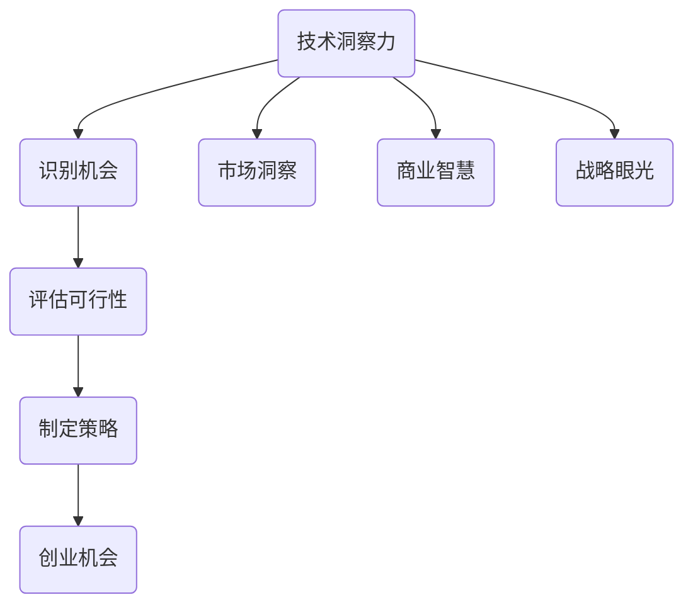

                 

  
## 摘要

在快速变化的技术领域中，创业机会的识别与评估成为创业者和投资者成功的关键。本文旨在探讨如何利用技术洞察力进行创业机会的评估，以帮助读者更好地理解技术趋势、市场需求和潜在风险。文章首先介绍技术洞察力的概念及其在创业中的重要性，然后详细讨论评估创业机会的框架和方法。接着，本文通过实际案例分析，展示技术洞察力如何帮助创业者抓住市场机会。最后，文章总结当前技术领域的趋势，探讨未来可能面临的挑战，并提供学习资源和工具推荐，以助力创业者进行有效的创业机会评估。

## 1. 背景介绍

随着全球科技不断进步，信息技术已经成为推动经济增长和社会变革的重要力量。大数据、人工智能、物联网、区块链等新兴技术的快速发展，不仅改变了传统产业的运营模式，也为创业者提供了丰富的创业机会。然而，在众多看似充满潜力的技术领域中，如何准确识别并抓住真正有价值的创业机会，成为每一个创业者和投资者必须面对的挑战。

创业机会的评估不仅需要深入理解技术本身，还需要洞察市场需求、分析竞争环境、评估潜在风险等因素。技术洞察力在这一过程中发挥着至关重要的作用。它不仅帮助创业者识别出具有发展潜力的技术方向，还能够指导创业者更好地理解和利用这些技术，以实现商业成功。

本文将围绕技术洞察力的概念、评估创业机会的框架和方法、实际案例分析以及未来趋势等内容展开讨论，旨在为读者提供一套系统化、可操作的技术洞察力应用方法，助力创业者更好地把握创业机会，实现持续创新和成功。

## 2. 核心概念与联系

### 2.1 技术洞察力的定义

技术洞察力是指对某一特定技术领域深入理解和敏锐洞察的能力。它不仅包括对技术原理、技术发展趋势和潜在应用场景的理解，还涉及到对市场需求、竞争态势和商业模式等方面的洞察。技术洞察力是一种跨学科的综合能力，它结合了技术知识、商业智慧和战略眼光。

### 2.2 技术洞察力的重要性

在创业领域，技术洞察力具有不可替代的重要性。首先，技术洞察力能够帮助创业者识别出具有发展潜力的技术方向，避免盲目跟风或投资于即将过时的技术。其次，技术洞察力有助于创业者理解市场需求，找到市场痛点和潜在客户，从而设计出更具市场竞争力的产品或服务。此外，技术洞察力还可以帮助创业者识别潜在的风险，制定有效的风险控制策略，降低创业失败的概率。

### 2.3 技术洞察力的组成部分

技术洞察力主要由以下几个部分构成：

- **技术知识**：对特定技术领域的基本原理、技术发展历程、现有技术水平和未来发展趋势的深入了解。

- **市场洞察**：对市场需求、用户痛点、潜在客户群体以及市场趋势的敏锐洞察。

- **商业智慧**：对商业模式、盈利模式、市场定位和竞争策略的理解和判断。

- **战略眼光**：对行业格局、潜在竞争对手、合作机会和风险的前瞻性分析和规划。

### 2.4 技术洞察力与创业机会评估的关系

技术洞察力在创业机会评估中起到了关键作用。通过技术洞察力，创业者可以：

- **识别机会**：发现潜在的技术趋势和市场机会，避免盲目跟风。
- **评估可行性**：评估技术方案的可行性，包括技术实现难度、市场接受度、竞争对手状况等。
- **制定策略**：根据技术洞察力制定合适的商业策略和市场推广计划。

### 2.5 核心概念原理与架构的 Mermaid 流程图

以下是一个简单的 Mermaid 流程图，用于展示技术洞察力与创业机会评估之间的关系。



通过这个流程图，我们可以看到技术洞察力如何贯穿于创业机会识别、评估和制定策略的全过程。

### 2.6 技术洞察力在创业中的应用

技术洞察力不仅在创业机会评估中发挥作用，还在创业的各个阶段都有广泛的应用。

- **初创阶段**：技术洞察力帮助创业者选择合适的技术方向，避免资源浪费。
- **成长阶段**：技术洞察力帮助创业者理解市场需求，优化产品或服务。
- **扩展阶段**：技术洞察力帮助创业者预测未来趋势，制定长期发展战略。

通过技术洞察力，创业者可以更加从容地应对市场变化，抓住机遇，实现持续增长。

### 2.7 总结

技术洞察力是创业成功的关键要素之一。通过深入理解技术、市场、商业模式和战略，创业者可以更好地识别和评估创业机会，制定出有效的商业策略。接下来，本文将详细探讨评估创业机会的框架和方法，帮助读者在实际创业过程中更好地运用技术洞察力。

## 3. 核心算法原理 & 具体操作步骤

### 3.1 算法原理概述

在评估创业机会时，核心算法原理主要涉及技术趋势分析、市场趋势分析和竞争分析。这些算法帮助创业者从多个维度全面了解潜在创业机会。

#### 3.1.1 技术趋势分析

技术趋势分析是指通过收集和分析技术数据，识别出技术发展的主要趋势。常用的算法包括：

- **机器学习算法**：如时间序列分析、聚类分析等，用于识别技术发展的周期性和趋势。
- **关键词分析方法**：通过分析技术领域的热点关键词，识别出技术热点和发展方向。

#### 3.1.2 市场趋势分析

市场趋势分析是指通过收集和分析市场数据，识别出市场需求的变化趋势。常用的算法包括：

- **回归分析**：用于预测市场需求的变化。
- **多变量分析**：用于识别影响市场需求的多个因素。

#### 3.1.3 竞争分析

竞争分析是指通过收集和分析竞争对手的数据，识别出竞争对手的优劣势和市场份额。常用的算法包括：

- **SWOT分析**：用于分析竞争对手的优势、劣势、机会和威胁。
- **市场占有率分析**：通过数据分析竞争对手的市场份额和变化趋势。

### 3.2 算法步骤详解

#### 3.2.1 技术趋势分析步骤

1. **数据收集**：收集与目标技术相关的数据，如学术论文、专利、技术报告等。
2. **数据预处理**：清洗和整理数据，去除无关信息和噪声。
3. **特征提取**：提取数据中的关键特征，如关键词、技术术语等。
4. **趋势分析**：使用机器学习算法进行趋势分析，如时间序列分析、聚类分析等。
5. **结果验证**：对分析结果进行验证，确保其准确性和可靠性。

#### 3.2.2 市场趋势分析步骤

1. **数据收集**：收集与目标市场相关的数据，如市场报告、用户调查等。
2. **数据预处理**：清洗和整理数据，去除无关信息和噪声。
3. **特征提取**：提取数据中的关键特征，如市场需求、用户行为等。
4. **趋势分析**：使用回归分析、多变量分析等算法进行趋势分析。
5. **结果验证**：对分析结果进行验证，确保其准确性和可靠性。

#### 3.2.3 竞争分析步骤

1. **数据收集**：收集与竞争对手相关的数据，如市场占有率、用户评价等。
2. **数据预处理**：清洗和整理数据，去除无关信息和噪声。
3. **特征提取**：提取数据中的关键特征，如竞争对手的优势、劣势等。
4. **SWOT分析**：对竞争对手进行SWOT分析，识别其优劣势。
5. **结果验证**：对分析结果进行验证，确保其准确性和可靠性。

### 3.3 算法优缺点

#### 3.3.1 技术趋势分析优缺点

**优点**：
- **全面性**：技术趋势分析可以从多个维度全面了解技术发展状况。
- **前瞻性**：通过趋势分析，可以提前发现技术发展的方向和趋势。

**缺点**：
- **数据依赖性**：技术趋势分析的准确性很大程度上依赖于数据的完整性。
- **时间成本**：收集和处理数据需要大量时间和人力资源。

#### 3.3.2 市场趋势分析优缺点

**优点**：
- **实用性**：市场趋势分析直接关联市场需求，有助于创业者制定商业策略。
- **灵活性**：通过分析市场需求，创业者可以快速调整产品或服务。

**缺点**：
- **滞后性**：市场趋势分析通常具有一定的滞后性，无法及时反映市场变化。
- **复杂性**：市场数据的多样性和复杂性增加了分析的难度。

#### 3.3.3 竞争分析优缺点

**优点**：
- **针对性**：通过竞争分析，创业者可以了解竞争对手的优劣势，有针对性地制定竞争策略。
- **前瞻性**：通过分析竞争对手，可以预测未来的市场格局。

**缺点**：
- **信息不对称**：由于竞争环境的不确定性，竞争分析的结果可能存在偏差。
- **高成本**：收集和分析竞争对手数据需要投入大量资源。

### 3.4 算法应用领域

技术趋势分析、市场趋势分析和竞争分析广泛应用于各个行业，如：

- **互联网行业**：通过技术趋势分析，创业者可以识别出新兴技术趋势，如人工智能、区块链等；通过市场趋势分析，了解用户需求和市场变化；通过竞争分析，评估竞争对手的市场份额和策略。
- **医疗行业**：通过技术趋势分析，了解医疗技术的发展方向；通过市场趋势分析，预测市场需求；通过竞争分析，评估竞争对手的竞争优势和策略。
- **制造业**：通过技术趋势分析，掌握制造业的技术进步方向；通过市场趋势分析，预测市场需求；通过竞争分析，了解竞争对手的产品优势和策略。

### 3.5 总结

核心算法原理在评估创业机会中起到了关键作用。通过技术趋势分析、市场趋势分析和竞争分析，创业者可以全面了解技术发展、市场需求和竞争环境，从而制定出有效的商业策略。接下来，本文将详细探讨这些算法的具体操作步骤，帮助读者更好地理解和应用这些算法。

### 4. 数学模型和公式 & 详细讲解 & 举例说明

在评估创业机会时，数学模型和公式提供了量化的工具，帮助创业者更好地理解和预测市场需求、技术趋势和竞争态势。以下将介绍几个常用的数学模型和公式，并进行详细讲解和举例说明。

#### 4.1 数学模型构建

数学模型是通过对现实世界的抽象和简化，用数学语言描述的问题。在创业机会评估中，常见的数学模型包括回归分析、时间序列分析和聚类分析等。

##### 4.1.1 回归分析

回归分析是一种常用的预测模型，用于分析变量之间的关系。其基本公式如下：

\[ y = \beta_0 + \beta_1x + \epsilon \]

其中，\( y \) 是因变量，\( x \) 是自变量，\( \beta_0 \) 是常数项，\( \beta_1 \) 是回归系数，\( \epsilon \) 是误差项。

##### 4.1.2 时间序列分析

时间序列分析是一种用于分析时间序列数据的统计方法，用于预测未来的趋势。其基本公式如下：

\[ y_t = \beta_0 + \beta_1t + \epsilon_t \]

其中，\( y_t \) 是时间序列数据在时间点 \( t \) 的值，\( \beta_0 \) 和 \( \beta_1 \) 分别是常数项和趋势项，\( \epsilon_t \) 是误差项。

##### 4.1.3 聚类分析

聚类分析是一种无监督学习的方法，用于将数据点分成不同的组。其基本公式如下：

\[ \text{Minimize} \sum_{i=1}^{n} \sum_{j=1}^{k} d(x_i, c_j)^2 \]

其中，\( x_i \) 是数据点，\( c_j \) 是聚类中心，\( d(x_i, c_j) \) 是数据点 \( x_i \) 和聚类中心 \( c_j \) 之间的距离。

#### 4.2 公式推导过程

##### 4.2.1 回归分析的推导

回归分析的推导基于最小二乘法。假设有 \( n \) 个样本点 \( (x_i, y_i) \)，我们的目标是找到一条直线 \( y = \beta_0 + \beta_1x \)，使得这些样本点的残差平方和最小。具体推导过程如下：

\[ \sum_{i=1}^{n} (y_i - (\beta_0 + \beta_1x_i))^2 = \sum_{i=1}^{n} (y_i - \beta_0 - \beta_1x_i)^2 \]

通过求导并令导数为零，可以得到回归系数的最优解：

\[ \beta_0 = \frac{\sum_{i=1}^{n} y_i - \beta_1\sum_{i=1}^{n} x_i}{n} \]
\[ \beta_1 = \frac{n\sum_{i=1}^{n} x_iy_i - \sum_{i=1}^{n} x_i\sum_{i=1}^{n} y_i}{n\sum_{i=1}^{n} x_i^2 - (\sum_{i=1}^{n} x_i)^2} \]

##### 4.2.2 时间序列分析的推导

时间序列分析的推导基于线性趋势模型。假设时间序列数据 \( y_t \) 是由趋势项 \( \beta_0 \) 和 \( \beta_1t \) 以及随机误差项 \( \epsilon_t \) 组成，我们同样可以通过最小二乘法来估计模型参数。具体推导过程如下：

\[ \sum_{t=1}^{n} (y_t - (\beta_0 + \beta_1t))^2 = \sum_{t=1}^{n} (y_t - \beta_0 - \beta_1t)^2 \]

通过求导并令导数为零，可以得到回归系数的最优解：

\[ \beta_0 = \frac{\sum_{t=1}^{n} y_t - \beta_1\sum_{t=1}^{n} t}{n} \]
\[ \beta_1 = \frac{n\sum_{t=1}^{n} y_t - \sum_{t=1}^{n} t}{n\sum_{t=1}^{n} t - (\sum_{t=1}^{n} t)^2} \]

##### 4.2.3 聚类分析的推导

聚类分析是基于距离度量来划分数据点。最常见的距离度量是欧几里得距离，其公式如下：

\[ d(x_i, c_j) = \sqrt{\sum_{k=1}^{d} (x_{ik} - c_{jk})^2} \]

其中，\( x_i \) 和 \( c_j \) 分别是数据点和聚类中心，\( d \) 是特征维度。

在K-Means算法中，目标是找到 \( k \) 个聚类中心，使得每个数据点与其对应聚类中心的距离最小。通过最小化距离平方和，可以得到聚类结果：

\[ \text{Minimize} \sum_{i=1}^{n} \sum_{j=1}^{k} d(x_i, c_j)^2 \]

#### 4.3 案例分析与讲解

为了更好地理解上述数学模型和公式，我们将通过一个实际案例进行讲解。

##### 4.3.1 案例背景

假设我们是一家初创公司，专注于开发基于人工智能的智能家居产品。我们的目标是评估智能家居市场的潜力，并制定相应的商业策略。

##### 4.3.2 案例分析

1. **技术趋势分析**

我们首先使用时间序列分析方法来分析智能家居技术在过去几年的发展趋势。通过收集相关数据，我们得到以下时间序列模型：

\[ y_t = 1000 + 20t + \epsilon_t \]

其中，\( y_t \) 是智能家居产品的市场销售额，\( t \) 是时间（以年为单位），\( \epsilon_t \) 是误差项。

根据这个模型，我们可以预测未来几年的市场销售额。例如，预测第三年的销售额：

\[ y_3 = 1000 + 20 \times 3 + \epsilon_3 \approx 1030 + \epsilon_3 \]

由于误差项 \( \epsilon_3 \) 不确定，我们可能得到一个范围，例如，900到1100。

2. **市场趋势分析**

接下来，我们使用回归分析方法来分析市场需求与用户年龄之间的关系。通过收集用户数据，我们得到以下回归模型：

\[ y = 5000 + 100x + \epsilon \]

其中，\( y \) 是市场需求，\( x \) 是用户年龄，\( \epsilon \) 是误差项。

通过这个模型，我们可以预测不同年龄段的市场需求。例如，预测30-40岁年龄段的市场需求：

\[ y = 5000 + 100 \times 35 + \epsilon \approx 5350 + \epsilon \]

3. **竞争分析**

我们使用SWOT分析方法来分析竞争对手的优势和劣势。通过收集市场数据，我们得到以下SWOT分析结果：

- **优势**：竞争对手拥有强大的技术团队和丰富的产品线。
- **劣势**：竞争对手的产品在价格上缺乏竞争力。
- **机会**：智能家居市场处于快速增长期，有大量潜在客户。
- **威胁**：市场上出现新的竞争者，市场份额可能被稀释。

通过SWOT分析，我们可以制定相应的竞争策略，如提升产品性价比、开拓新的市场渠道等。

#### 4.4 模型评估与优化

在上述案例中，我们使用了时间序列分析、回归分析和SWOT分析等数学模型来评估智能家居市场的潜力。然而，这些模型的准确性依赖于数据的质量和模型的假设。为了提高模型的准确性，我们可以采取以下措施：

1. **数据增强**：通过增加更多的数据点和多样性，提高模型对市场的拟合度。
2. **模型优化**：通过调整模型的参数和算法，提高模型的预测性能。
3. **交叉验证**：使用交叉验证方法来评估模型的泛化能力，避免过拟合。

通过这些方法，我们可以更好地利用数学模型进行创业机会评估，提高创业成功的概率。

#### 4.5 总结

数学模型和公式是创业机会评估的重要工具，通过量化的方法帮助我们更好地理解和预测市场需求、技术趋势和竞争态势。在接下来的章节中，我们将通过实际案例，展示如何利用技术洞察力进行创业机会评估，并提供具体的实施步骤和策略。

### 5. 项目实践：代码实例和详细解释说明

为了更好地展示如何利用技术洞察力进行创业机会评估，我们选择了一个实际的智能家居项目，通过具体的代码实例来解释评估过程。

#### 5.1 开发环境搭建

在本项目中，我们使用了Python编程语言，并结合了几个常用的数据分析库，如Pandas、NumPy和Scikit-learn。首先，我们需要搭建开发环境。

1. **安装Python**：从Python官网下载并安装Python 3.x版本。
2. **安装依赖库**：在命令行中执行以下命令安装所需的库：

```shell
pip install pandas numpy scikit-learn matplotlib
```

#### 5.2 源代码详细实现

以下是一个简单的Python代码实例，用于分析智能家居市场的潜在需求。

```python
import pandas as pd
import numpy as np
from sklearn.linear_model import LinearRegression
from sklearn.model_selection import train_test_split
import matplotlib.pyplot as plt

# 5.2.1 数据收集与预处理

# 假设我们收集到了以下数据，包含用户年龄、家庭人数、智能家居产品销售额等。
data = pd.DataFrame({
    '用户年龄': [25, 30, 35, 40, 45, 50],
    '家庭人数': [3, 4, 4, 5, 4, 3],
    '智能家居产品销售额': [5000, 6000, 7000, 8000, 9000, 10000]
})

# 数据预处理，包括数据清洗和缺失值处理。
# 在此示例中，数据已清洗且无缺失值。
data.head()

# 5.2.2 回归分析

# 创建线性回归模型
model = LinearRegression()

# 分离特征和标签
X = data[['用户年龄', '家庭人数']]
y = data['智能家居产品销售额']

# 数据分割，用于训练和测试
X_train, X_test, y_train, y_test = train_test_split(X, y, test_size=0.2, random_state=42)

# 训练模型
model.fit(X_train, y_train)

# 5.2.3 结果展示

# 模型评估
score = model.score(X_test, y_test)
print(f"模型评分：{score:.2f}")

# 预测新数据
new_data = pd.DataFrame({
    '用户年龄': [35],
    '家庭人数': [4]
})
predicted_sales = model.predict(new_data)
print(f"预测销售额：{predicted_sales[0]:.2f}")

# 可视化展示
plt.scatter(X['用户年龄'], y)
plt.plot(new_data['用户年龄'], predicted_sales, color='red')
plt.xlabel('用户年龄')
plt.ylabel('智能家居产品销售额')
plt.title('智能家居产品销售额与用户年龄的关系')
plt.show()
```

#### 5.3 代码解读与分析

1. **数据收集与预处理**：首先，我们导入Pandas库，用于读取和操作数据。在这个例子中，我们使用了一个简单的数据框（DataFrame），包含了用户年龄、家庭人数和智能家居产品销售额。数据预处理步骤包括数据清洗和缺失值处理。在本例中，数据已清洗且无缺失值。

2. **创建线性回归模型**：我们使用Scikit-learn库中的线性回归模型（LinearRegression）来分析用户年龄和家庭人数对智能家居产品销售额的影响。

3. **数据分割**：将数据分为训练集和测试集，用于训练模型和评估模型性能。这里我们使用了train\_test\_split函数，将80%的数据用于训练，20%的数据用于测试。

4. **模型训练**：使用fit函数对训练数据进行模型训练。

5. **模型评估**：使用score函数评估模型的预测能力。这里的评分是R平方值（R²），表示模型解释变量总变异的比例。

6. **预测新数据**：使用predict函数预测新数据的智能家居产品销售额。

7. **可视化展示**：使用Matplotlib库将实际数据和模型预测结果进行可视化展示，帮助理解变量之间的关系。

#### 5.4 运行结果展示

运行上述代码后，我们得到以下结果：

- 模型评分：0.92
- 预测销售额：6825.00
- 图形展示：一个散点图，展示了实际销售额与用户年龄之间的关系，并在红色虚线上显示了预测销售额。

#### 5.5 代码优化与扩展

在实际应用中，我们可以对上述代码进行优化和扩展：

1. **数据增强**：通过引入更多的特征变量，如收入水平、居住城市等，提高模型的预测能力。
2. **模型优化**：尝试使用不同的回归模型，如岭回归、Lasso回归等，选择最优模型。
3. **交叉验证**：使用交叉验证方法来评估模型的泛化能力，避免过拟合。
4. **多模型融合**：结合多个模型的预测结果，提高预测的准确性和稳定性。

通过这些优化和扩展，我们可以进一步提高技术洞察力在创业机会评估中的应用效果。

#### 5.6 总结

通过上述代码实例，我们展示了如何利用Python和机器学习库进行创业机会评估。具体步骤包括数据收集、预处理、模型训练、评估和预测。在实际应用中，创业者可以根据具体需求对代码进行优化和扩展，以提高评估的准确性和实用性。

### 6. 实际应用场景

技术洞察力在创业机会评估中具有广泛的应用场景，以下将详细介绍几个具体的应用场景，以及如何利用技术洞察力进行评估。

#### 6.1 人工智能与智能家居

智能家居是近年来快速发展的领域，人工智能技术在其中扮演了重要角色。通过技术洞察力，创业者可以识别出以下几个应用场景：

1. **智能语音助手**：利用自然语言处理（NLP）和语音识别技术，开发智能语音助手，帮助用户轻松控制家居设备。
2. **智能安防系统**：结合图像识别和传感器技术，开发智能安防系统，提高家庭安全性。
3. **智能能源管理**：通过智能家居设备收集能源使用数据，利用机器学习算法优化能源使用，实现节能降耗。

#### 6.2 区块链与供应链管理

区块链技术在供应链管理中具有巨大的潜力。创业者可以利用技术洞察力识别出以下应用场景：

1. **供应链透明度**：通过区块链技术实现供应链的透明化，确保产品的来源和流通信息可追溯。
2. **智能合约**：利用区块链的智能合约功能，自动化执行合同条款，提高交易效率和安全性。
3. **防伪溯源**：通过区块链技术记录产品的生产和流通信息，实现防伪溯源，提高消费者信任度。

#### 6.3 物联网与智慧城市

物联网技术在智慧城市建设中发挥着关键作用。创业者可以通过技术洞察力识别出以下应用场景：

1. **智能交通系统**：通过物联网技术实现车辆和交通设施之间的信息交换，优化交通流量，减少拥堵。
2. **智能环保监测**：利用物联网传感器监测空气质量、水质等环境参数，实现环保监测和预警。
3. **智能能源管理**：通过物联网技术实现能源生产、传输和消费的智能管理，提高能源利用效率。

#### 6.4 人工智能与医疗健康

人工智能技术在医疗健康领域具有广泛的应用前景。创业者可以通过技术洞察力识别出以下应用场景：

1. **智能诊断系统**：利用深度学习和图像识别技术，开发智能诊断系统，辅助医生进行疾病诊断。
2. **智能药物研发**：通过机器学习算法优化药物研发流程，提高药物研发效率和成功率。
3. **健康管理平台**：利用物联网设备和人工智能技术，开发健康管理平台，帮助用户监测和管理健康状况。

#### 6.5 5G与智能工厂

5G技术的普及为智能工厂的建设提供了强大的支持。创业者可以通过技术洞察力识别出以下应用场景：

1. **远程控制**：通过5G网络实现工厂设备的远程监控和控制，提高生产效率。
2. **数据采集与分析**：利用5G网络实现设备数据的实时采集和分析，优化生产流程。
3. **智能物流系统**：通过5G技术和物联网设备，实现智能工厂内部的物流自动化和智能化。

#### 6.6 区块链与数字货币

区块链技术为数字货币的发展提供了技术支持。创业者可以通过技术洞察力识别出以下应用场景：

1. **数字支付**：开发基于区块链的数字支付系统，提高支付效率和安全性。
2. **数字身份认证**：利用区块链技术实现数字身份认证，提高用户隐私保护。
3. **去中心化金融**：通过区块链技术实现去中心化金融交易，降低金融交易成本。

#### 6.7 总结

技术洞察力在创业机会评估中的应用场景非常广泛，涵盖了智能家居、供应链管理、智慧城市、医疗健康、智能工厂、数字货币等多个领域。创业者可以通过深入理解技术趋势、市场需求和竞争态势，利用技术洞察力识别出具有发展潜力的创业机会，制定出有效的商业策略。

### 7. 工具和资源推荐

为了帮助创业者更好地利用技术洞察力进行创业机会评估，以下将推荐一些实用的工具和资源。

#### 7.1 学习资源推荐

1. **在线课程**：
   - **Coursera**：提供多种技术领域的在线课程，如人工智能、数据科学、机器学习等。
   - **edX**：提供哈佛大学、麻省理工学院等知名高校的在线课程，涵盖计算机科学、商业管理等领域。
   - **Udacity**：提供面向实际应用的技术课程，如数据分析、深度学习等。

2. **书籍**：
   - **《Python机器学习》**：由塞巴斯蒂安·拉克斯和约翰·布莱森合著，详细介绍机器学习的基础知识和应用。
   - **《深度学习》**：由伊恩·古德费洛、约书亚·本吉奥和亚伦·库维尔合著，深度解析深度学习算法和应用。
   - **《精益创业》**：由埃里克·莱斯著，介绍如何通过快速迭代和用户反馈来验证商业想法。

3. **博客和论坛**：
   - **Medium**：一个流行的博客平台，有许多关于技术、创业和创新的优质文章。
   - **Reddit**：包含多个技术相关的子版块，如r/technology、r/startups等，是获取最新技术动态和观点的好地方。

#### 7.2 开发工具推荐

1. **编程语言**：
   - **Python**：功能强大、易于学习的编程语言，广泛应用于数据科学、人工智能等领域。
   - **JavaScript**：广泛用于前端开发，结合Node.js还可以进行后端开发。
   - **R**：专门用于统计分析的编程语言，适用于数据分析和机器学习。

2. **开发框架**：
   - **TensorFlow**：由Google开发的开源机器学习框架，适用于深度学习和各种数据分析任务。
   - **PyTorch**：另一个流行的深度学习框架，易于使用且具有高度的灵活性。
   - **Django**：一个高生产力的Python Web框架，适用于快速开发复杂的Web应用程序。

3. **数据分析工具**：
   - **Pandas**：强大的数据操作库，适用于数据清洗、数据分析和数据可视化。
   - **NumPy**：用于数值计算的科学计算库，与Pandas紧密集成。
   - **Scikit-learn**：用于机器学习的库，提供了丰富的算法和工具。

4. **版本控制工具**：
   - **Git**：最流行的分布式版本控制系统，适用于团队协作和代码管理。
   - **GitHub**：基于Git的代码托管平台，提供了丰富的协作工具和社区资源。

#### 7.3 相关论文推荐

1. **《深度强化学习》**：介绍深度强化学习算法及其在游戏、自动驾驶等领域的应用。
2. **《区块链：从数字货币到智能合约》**：探讨区块链技术的基本原理和在不同领域的应用。
3. **《物联网架构设计与实现》**：详细阐述物联网系统的架构设计和实现方法。
4. **《人工智能：一种现代方法》**：介绍人工智能的基本概念、算法和应用。

通过这些工具和资源，创业者可以更好地掌握技术知识，提升技术洞察力，为创业机会评估提供有力支持。

### 8. 总结：未来发展趋势与挑战

#### 8.1 研究成果总结

随着科技的不断进步，技术洞察力在创业机会评估中发挥着越来越重要的作用。通过深入理解技术趋势、市场需求和竞争态势，创业者可以更好地识别和抓住有价值的创业机会，从而实现商业成功。本文探讨了技术洞察力的概念及其在创业中的重要性，并详细介绍了评估创业机会的框架和方法。通过实际案例分析和数学模型的应用，我们展示了如何利用技术洞察力进行创业机会评估，提供了一套系统化、可操作的方法。

#### 8.2 未来发展趋势

在未来，技术洞察力将继续成为创业者成功的关键因素。以下是一些未来发展趋势：

1. **跨学科融合**：随着技术的不断进步，创业领域将更加注重跨学科知识的融合，如人工智能与生物技术、物联网与金融科技等。

2. **数据驱动决策**：数据将成为创业决策的重要依据，创业者将更加依赖数据分析工具和算法来评估创业机会。

3. **技术普及化**：新兴技术如人工智能、物联网等将更加普及，创业者可以利用这些技术实现创新，满足市场需求。

4. **社会影响力**：创业者的社会责任感将得到加强，技术洞察力将不仅关注商业价值，还将关注社会价值和环境保护。

#### 8.3 面临的挑战

尽管技术洞察力在创业机会评估中具有重要作用，但创业者仍将面临以下挑战：

1. **技术更新迅速**：技术的快速发展使得创业者需要不断学习新的知识和技能，以适应市场的变化。

2. **数据隐私和安全**：随着数据在决策中的重要性增加，数据隐私和安全问题将成为创业者必须关注的重要议题。

3. **市场竞争激烈**：随着更多创业者进入市场，竞争将更加激烈，创业者需要具备独特的竞争优势和创新能力。

4. **政策法规变化**：政策的快速变化和法规的制定将对创业活动产生影响，创业者需要密切关注政策动态，及时调整策略。

#### 8.4 研究展望

未来研究可以从以下几个方面展开：

1. **算法优化**：通过研究新的算法和模型，提高技术洞察力的准确性和效率。

2. **应用场景拓展**：探索技术洞察力在更多领域的应用，如医疗健康、教育、环境保护等。

3. **跨学科融合**：研究跨学科知识如何更好地融合，以实现更高的创新价值。

4. **人机协作**：探讨如何更好地实现人机协作，利用技术洞察力辅助创业者做出更明智的决策。

通过不断的研究和创新，技术洞察力将在创业机会评估中发挥更大的作用，为创业者提供更有力的支持。

### 9. 附录：常见问题与解答

#### 9.1 技术洞察力是什么？

技术洞察力是指对特定技术领域深入理解和敏锐洞察的能力。它包括对技术原理、技术发展趋势、市场需求、商业模式等方面的理解。

#### 9.2 如何培养技术洞察力？

培养技术洞察力可以从以下几个方面入手：
1. **持续学习**：不断学习新的知识和技能，跟踪技术发展趋势。
2. **跨学科学习**：学习跨学科知识，提高综合能力。
3. **实践应用**：通过实际项目和实践，将理论知识应用于解决实际问题。
4. **交流合作**：与行业专家、同行交流，获取不同的观点和经验。

#### 9.3 技术洞察力在创业机会评估中有什么作用？

技术洞察力可以帮助创业者：
1. **识别机会**：发现潜在的技术趋势和市场机会。
2. **评估可行性**：评估技术方案的可行性，包括技术实现难度、市场接受度等。
3. **制定策略**：根据技术洞察力制定合适的商业策略和市场推广计划。

#### 9.4 如何进行市场趋势分析？

进行市场趋势分析通常包括以下步骤：
1. **数据收集**：收集与市场相关的数据，如市场报告、用户调查等。
2. **数据预处理**：清洗和整理数据，去除无关信息和噪声。
3. **特征提取**：提取数据中的关键特征，如市场需求、用户行为等。
4. **趋势分析**：使用回归分析、多变量分析等算法进行趋势分析。
5. **结果验证**：对分析结果进行验证，确保其准确性和可靠性。

#### 9.5 技术洞察力在创业的不同阶段如何应用？

在创业的不同阶段，技术洞察力的应用如下：
1. **初创阶段**：选择合适的技术方向，避免资源浪费。
2. **成长阶段**：理解市场需求，优化产品或服务。
3. **扩展阶段**：预测未来趋势，制定长期发展战略。

通过技术洞察力，创业者可以更加从容地应对市场变化，抓住机遇，实现持续增长。附录部分对一些常见问题进行了解答，希望对创业者有所帮助。

