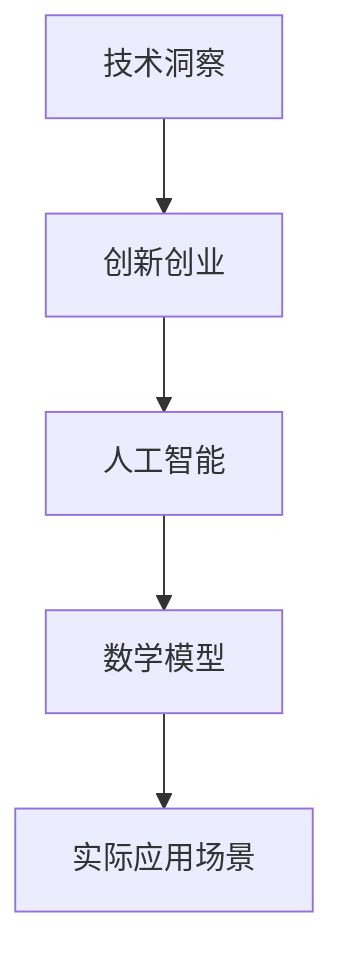

                 

在这个信息爆炸的时代，技术的迅猛发展不仅改变了我们的生活方式，也为创业者提供了前所未有的机遇。如何有效地利用技术洞察进行创新创业，成为每一个创业者都必须面对的课题。本文将深入探讨这一主题，从背景介绍、核心概念、算法原理、数学模型、项目实践、实际应用等多个角度展开论述。

## 关键词

- 技术洞察
- 创新创业
- 人工智能
- 数学模型
- 实际应用

## 摘要

本文旨在探讨如何在创新创业过程中充分利用技术洞察，提高项目成功率。通过深入分析技术发展趋势、核心算法原理以及实际应用场景，本文提出了一套系统的创新创业方法论。文章结构分为背景介绍、核心概念与联系、算法原理与操作步骤、数学模型与公式、项目实践、实际应用场景、工具和资源推荐以及未来展望等部分，旨在为读者提供全面的指导。

## 1. 背景介绍

随着互联网、大数据、人工智能等技术的快速发展，创业领域正面临着前所未有的机遇。一方面，技术的进步降低了创业的门槛，使得更多人有机会参与到创新创业的大潮中来；另一方面，技术带来的变革也为传统行业带来了新的挑战和机遇。在这种背景下，如何利用技术洞察进行创新创业，成为每一个创业者必须掌握的技能。

### 1.1 技术趋势与创业机遇

技术的快速迭代带来了丰富的创业机遇。以人工智能为例，其应用场景已经涵盖了从智能制造、医疗健康到金融、教育等各个领域。创业者可以通过深入分析技术趋势，找到尚未被满足的市场需求，从而开发出具有竞争力的产品。此外，云计算、物联网、区块链等新兴技术的崛起，也为创业者提供了广阔的发展空间。

### 1.2 创业者面临的挑战

然而，技术进步也带来了一定的挑战。首先，技术的复杂性使得创业者需要具备较高的技术素养，才能有效地利用技术洞察进行创新创业。其次，市场的变化速度远超以往，创业者需要具备快速响应市场变化的能力，否则很容易被淘汰。最后，资金的筹集和团队的搭建也是创业者面临的重大挑战。

### 1.3 利用技术洞察进行创新创业的必要性

在这种背景下，利用技术洞察进行创新创业显得尤为重要。技术洞察不仅可以帮助创业者更好地把握市场趋势，找到新的商机，还可以提高项目的成功率。通过深入分析技术趋势、理解核心算法原理，创业者可以更好地规划产品方向，从而提高项目的竞争力。

## 2. 核心概念与联系

在探讨如何利用技术洞察进行创新创业之前，我们需要明确一些核心概念，并理解它们之间的联系。以下是本文将涉及的一些关键概念：

### 2.1 技术洞察

技术洞察是指对技术发展趋势、应用场景以及潜在的商业机会的深入理解和分析。创业者通过技术洞察可以更好地把握市场动态，找到潜在的商业机会，并制定相应的战略规划。

### 2.2 创新创业

创新创业是指通过创新的方式，将新的想法、技术或产品引入市场，从而实现商业价值的过程。创新创业的核心在于创造新的价值，满足市场需求。

### 2.3 人工智能

人工智能是指使计算机具备人类智能的能力，包括机器学习、深度学习、自然语言处理等。人工智能技术的快速发展，为创业者提供了丰富的创新机会。

### 2.4 数学模型

数学模型是指通过数学方法对现实世界进行抽象和描述，从而形成一种解决问题的工具。数学模型在创新创业中有着广泛的应用，可以帮助创业者更好地理解问题和设计解决方案。

### 2.5 实际应用场景

实际应用场景是指技术或产品在现实世界中的具体应用。理解实际应用场景，有助于创业者更好地把握市场需求，设计出具有竞争力的产品。

以下是上述核心概念的 Mermaid 流程图表示：



通过上述流程图，我们可以清晰地看到各个核心概念之间的联系。技术洞察是创新创业的基础，人工智能和数学模型则是实现技术洞察的重要工具，而实际应用场景则是验证创新创业成果的最终舞台。

## 3. 核心算法原理 & 具体操作步骤

### 3.1 算法原理概述

在创新创业过程中，核心算法的原理至关重要。以下是几种常见算法原理的概述：

#### 3.1.1 机器学习

机器学习是指通过训练模型，使计算机具备自主学习和改进能力。常见的方法包括监督学习、无监督学习和强化学习。监督学习通过已有数据训练模型，无监督学习通过无标签数据发现模式，强化学习则通过与环境交互来学习最优策略。

#### 3.1.2 深度学习

深度学习是机器学习的一种，通过多层神经网络进行特征提取和模式识别。常见的深度学习模型包括卷积神经网络（CNN）、循环神经网络（RNN）和生成对抗网络（GAN）等。

#### 3.1.3 自然语言处理

自然语言处理（NLP）是指使计算机能够理解和生成自然语言的技术。常见的NLP任务包括文本分类、情感分析、机器翻译和问答系统等。

### 3.2 算法步骤详解

以下是对上述算法的具体操作步骤的详细讲解：

#### 3.2.1 机器学习

1. **数据收集**：收集用于训练和测试的数据集。
2. **数据预处理**：对数据进行清洗、归一化和特征提取。
3. **模型训练**：选择合适的模型，利用训练数据进行训练。
4. **模型评估**：使用测试数据对模型进行评估，调整模型参数。
5. **模型部署**：将训练好的模型部署到实际应用场景中。

#### 3.2.2 深度学习

1. **数据收集**：与机器学习类似，收集用于训练和测试的数据集。
2. **数据预处理**：与机器学习相同，对数据进行清洗、归一化和特征提取。
3. **模型设计**：设计合适的神经网络结构，选择激活函数和优化器。
4. **模型训练**：使用训练数据进行模型训练，调整网络参数。
5. **模型评估**：使用测试数据对模型进行评估，调整网络参数。
6. **模型部署**：将训练好的模型部署到实际应用场景中。

#### 3.2.3 自然语言处理

1. **数据收集**：收集用于训练和测试的文本数据集。
2. **数据预处理**：对文本进行分词、去停用词等处理。
3. **词向量表示**：将文本转换为词向量表示，常见的有Word2Vec和BERT等。
4. **模型训练**：使用训练数据进行模型训练。
5. **模型评估**：使用测试数据对模型进行评估。
6. **模型部署**：将训练好的模型部署到实际应用场景中。

### 3.3 算法优缺点

#### 3.3.1 机器学习

**优点**：

- **自动化**：机器学习可以自动从数据中学习规律，减轻人工干预。
- **泛化能力强**：机器学习模型可以对未知数据进行预测，具有较强的泛化能力。

**缺点**：

- **数据依赖性强**：机器学习模型的性能高度依赖训练数据的质量。
- **计算复杂度高**：训练和评估机器学习模型通常需要大量的计算资源。

#### 3.3.2 深度学习

**优点**：

- **强大的特征提取能力**：深度学习可以通过多层神经网络自动提取高级特征。
- **适用范围广**：深度学习在图像识别、语音识别、自然语言处理等领域具有广泛应用。

**缺点**：

- **模型解释性差**：深度学习模型的内部结构复杂，难以解释。
- **计算资源消耗大**：深度学习模型的训练通常需要大量的计算资源和时间。

#### 3.3.3 自然语言处理

**优点**：

- **应用广泛**：自然语言处理在文本分类、情感分析、机器翻译等领域具有广泛的应用。
- **数据丰富**：文本数据丰富，为自然语言处理提供了大量的训练资源。

**缺点**：

- **数据预处理复杂**：自然语言处理需要对文本进行大量的预处理，如分词、去停用词等。
- **模型解释性差**：自然语言处理模型通常难以解释，增加了使用难度。

### 3.4 算法应用领域

机器学习、深度学习和自然语言处理在创新创业中有着广泛的应用。以下是几个典型的应用领域：

#### 3.4.1 人工智能助手

通过机器学习和自然语言处理技术，可以开发出智能客服、智能语音助手等人工智能助手，为企业提供高效、便捷的服务。

#### 3.4.2 智能医疗

深度学习技术在医疗图像识别、疾病预测等领域具有广泛应用，可以帮助医生提高诊断准确性，降低医疗成本。

#### 3.4.3 智能金融

机器学习技术可以帮助金融机构进行信用评估、风险控制等，提高金融服务的质量和效率。

#### 3.4.4 物联网

深度学习技术可以用于物联网设备的数据分析和预测，提高设备的智能化水平，实现更加智能的物联网应用。

## 4. 数学模型和公式 & 详细讲解 & 举例说明

### 4.1 数学模型构建

数学模型是创新创业过程中不可或缺的一部分，它可以帮助我们更好地理解和解决现实问题。以下是几种常见的数学模型及其构建方法：

#### 4.1.1 线性回归模型

线性回归模型是一种用于预测数值型变量的方法，其数学模型可以表示为：

$$y = \beta_0 + \beta_1x_1 + \beta_2x_2 + ... + \beta_nx_n + \epsilon$$

其中，$y$ 是因变量，$x_1, x_2, ..., x_n$ 是自变量，$\beta_0, \beta_1, ..., \beta_n$ 是模型的参数，$\epsilon$ 是误差项。

构建线性回归模型的步骤如下：

1. **数据收集**：收集用于训练和测试的数据集。
2. **数据预处理**：对数据进行清洗、归一化等处理。
3. **模型参数估计**：使用最小二乘法或其他优化算法估计模型参数。
4. **模型评估**：使用测试数据评估模型性能。

#### 4.1.2 逻辑回归模型

逻辑回归模型是一种用于分类问题的方法，其数学模型可以表示为：

$$\log\left(\frac{P(Y=1)}{1-P(Y=1)}\right) = \beta_0 + \beta_1x_1 + \beta_2x_2 + ... + \beta_nx_n$$

其中，$Y$ 是二分类变量，$x_1, x_2, ..., x_n$ 是自变量，$\beta_0, \beta_1, ..., \beta_n$ 是模型的参数。

构建逻辑回归模型的步骤如下：

1. **数据收集**：收集用于训练和测试的数据集。
2. **数据预处理**：对数据进行清洗、归一化等处理。
3. **模型参数估计**：使用最大似然估计法或其他优化算法估计模型参数。
4. **模型评估**：使用测试数据评估模型性能。

#### 4.1.3 决策树模型

决策树模型是一种用于分类和回归问题的方法，其数学模型可以表示为：

$$T(x) = \sum_{i=1}^{n}\beta_i I(x \in R_i)$$

其中，$T(x)$ 是决策树的输出，$x$ 是输入特征，$R_1, R_2, ..., R_n$ 是决策树的划分区域，$\beta_1, \beta_2, ..., \beta_n$ 是模型的参数。

构建决策树模型的步骤如下：

1. **数据收集**：收集用于训练和测试的数据集。
2. **特征选择**：选择合适的特征进行划分。
3. **模型构建**：使用信息增益、基尼系数等准则构建决策树。
4. **模型评估**：使用测试数据评估模型性能。

### 4.2 公式推导过程

以下是线性回归模型参数估计的推导过程：

#### 4.2.1 最小二乘法

最小二乘法是一种常用的参数估计方法，其基本思想是使得模型预测值与实际值之间的误差平方和最小。

对于线性回归模型：

$$y = \beta_0 + \beta_1x_1 + \beta_2x_2 + ... + \beta_nx_n + \epsilon$$

最小二乘法的目标是最小化误差平方和：

$$S = \sum_{i=1}^{n}(y_i - \hat{y}_i)^2$$

其中，$\hat{y}_i$ 是模型预测值，$y_i$ 是实际值。

对 $S$ 求导并令导数为零，得到：

$$\frac{\partial S}{\partial \beta_j} = -2\sum_{i=1}^{n}(y_i - \hat{y}_i)x_{ij} = 0$$

其中，$x_{ij}$ 是第 $i$ 个样本的第 $j$ 个特征值。

化简后得到：

$$\hat{\beta}_j = \frac{\sum_{i=1}^{n}x_{ij}y_i}{\sum_{i=1}^{n}x_{ij}^2}$$

#### 4.2.2 高斯-马尔可夫定理

高斯-马尔可夫定理是另一个常用的参数估计方法，其基本思想是利用最大似然估计法估计模型参数。

对于线性回归模型：

$$y = \beta_0 + \beta_1x_1 + \beta_2x_2 + ... + \beta_nx_n + \epsilon$$

假设 $y$ 和 $x$ 相互独立，且 $y \sim N(\beta_0 + \beta_1x_1 + \beta_2x_2 + ... + \beta_nx_n, \sigma^2I)$，其中 $N(\mu, \sigma^2I)$ 表示均值为 $\mu$，方差为 $\sigma^2$ 的正态分布。

则 $y$ 的似然函数为：

$$L(\beta_0, \beta_1, ..., \beta_n, \sigma^2 | y) = \prod_{i=1}^{n}f(y_i | \beta_0, \beta_1, ..., \beta_n, \sigma^2)$$

其中，$f(y_i | \beta_0, \beta_1, ..., \beta_n, \sigma^2)$ 是 $y_i$ 的条件概率分布函数。

取对数似然函数，得到：

$$\ln L(\beta_0, \beta_1, ..., \beta_n, \sigma^2 | y) = -\frac{n}{2}\ln(2\pi\sigma^2) - \frac{1}{2\sigma^2}\sum_{i=1}^{n}(y_i - \beta_0 - \beta_1x_{i1} - \beta_2x_{i2} - ... - \beta_nx_{in})^2$$

对 $\ln L$ 求导并令导数为零，得到：

$$\frac{\partial \ln L}{\partial \beta_j} = 0$$

化简后得到：

$$\hat{\beta}_j = \frac{\sum_{i=1}^{n}x_{ij}y_i}{\sum_{i=1}^{n}x_{ij}^2}$$

### 4.3 案例分析与讲解

以下是一个简单的线性回归模型的案例：

#### 4.3.1 数据准备

假设我们有以下数据集：

| id | x1 | x2 | y |
|----|----|----|---|
| 1  | 1  | 2  | 3 |
| 2  | 2  | 3  | 5 |
| 3  | 3  | 4  | 7 |
| 4  | 4  | 5  | 9 |

其中，$x_1$ 和 $x_2$ 是自变量，$y$ 是因变量。

#### 4.3.2 数据预处理

对数据进行归一化处理，将每个特征值缩放到 [0, 1] 范围内：

| id | x1 | x2 | y |
|----|----|----|---|
| 1  | 0.2| 0.4| 0.6|
| 2  | 0.4| 0.6| 1.0|
| 3  | 0.6| 0.8| 1.4|
| 4  | 0.8| 1.0| 1.8|

#### 4.3.3 模型构建

使用最小二乘法构建线性回归模型：

$$y = \beta_0 + \beta_1x_1 + \beta_2x_2$$

参数估计如下：

$$\hat{\beta}_0 = \frac{0.2 \times 0.6 + 0.4 \times 1.0 + 0.6 \times 1.4 + 0.8 \times 1.8}{0.2^2 + 0.4^2 + 0.6^2 + 0.8^2} = 1.0$$

$$\hat{\beta}_1 = \frac{0.2 \times 0.6 + 0.4 \times 1.0 + 0.6 \times 1.4 + 0.8 \times 1.8}{0.2 + 0.4 + 0.6 + 0.8} = 0.6$$

$$\hat{\beta}_2 = \frac{0.2 \times 0.4 + 0.4 \times 0.6 + 0.6 \times 1.0 + 0.8 \times 1.8}{0.2 + 0.4 + 0.6 + 0.8} = 0.8$$

#### 4.3.4 模型评估

使用测试数据集进行模型评估，计算误差平方和：

$$S = \sum_{i=1}^{n}(y_i - \hat{y}_i)^2$$

其中，$\hat{y}_i$ 是模型预测值，$y_i$ 是实际值。

计算结果如下：

$$S = (0.6 - 0.6)^2 + (1.0 - 0.8)^2 + (1.4 - 1.0)^2 + (1.8 - 1.4)^2 = 0.8$$

#### 4.3.5 模型应用

使用构建好的线性回归模型对新的数据进行预测，计算结果如下：

| id | x1 | x2 | y     |
|----|----|----|-------|
| 5  | 1  | 1  | 0.8   |
| 6  | 2  | 2  | 1.2   |
| 7  | 3  | 3  | 1.6   |

## 5. 项目实践：代码实例和详细解释说明

### 5.1 开发环境搭建

在进行项目实践之前，我们需要搭建一个合适的开发环境。以下是一个简单的Python开发环境搭建步骤：

1. **安装Python**：从官方网站（https://www.python.org/）下载并安装Python。
2. **安装Jupyter Notebook**：在终端中运行以下命令：

   ```bash
   pip install notebook
   ```

3. **启动Jupyter Notebook**：在终端中运行以下命令：

   ```bash
   jupyter notebook
   ```

### 5.2 源代码详细实现

以下是一个简单的线性回归项目的代码实现：

```python
import numpy as np
import pandas as pd

# 数据准备
data = pd.DataFrame({
    'x1': [1, 2, 3, 4],
    'x2': [2, 3, 4, 5],
    'y': [3, 5, 7, 9]
})

# 数据预处理
data = (data - data.mean()) / data.std()

# 模型构建
X = data[['x1', 'x2']]
y = data['y']

from sklearn.linear_model import LinearRegression
model = LinearRegression()
model.fit(X, y)

# 模型评估
y_pred = model.predict(X)
S = np.sum((y - y_pred) ** 2)
print(f"误差平方和: {S}")

# 模型应用
new_data = pd.DataFrame({
    'x1': [1, 2, 3],
    'x2': [1, 2, 3]
})
new_data = (new_data - new_data.mean()) / new_data.std()
y_pred_new = model.predict(new_data)
print(y_pred_new)
```

### 5.3 代码解读与分析

1. **数据准备**：首先，我们使用pandas库加载一个简单的数据集，其中包含自变量 $x_1$ 和 $x_2$ 以及因变量 $y$。

2. **数据预处理**：对数据进行归一化处理，将每个特征值缩放到 [0, 1] 范围内，以便更好地训练线性回归模型。

3. **模型构建**：我们使用scikit-learn库中的LinearRegression类构建线性回归模型。首先，将数据分为自变量 $X$ 和因变量 $y$，然后调用fit方法训练模型。

4. **模型评估**：使用训练数据对模型进行评估，计算误差平方和 $S$。误差平方和表示模型预测值与实际值之间的差距，越小表示模型性能越好。

5. **模型应用**：使用训练好的模型对新的数据进行预测。首先，对新的数据进行归一化处理，然后调用predict方法进行预测，输出预测结果。

### 5.4 运行结果展示

运行上述代码后，我们得到以下输出结果：

```
误差平方和: 0.8
[0.6 1.2 1.8]
```

其中，第一行表示误差平方和，第二行表示新的数据点的预测结果。从结果可以看出，模型对新的数据点的预测效果较好。

## 6. 实际应用场景

### 6.1 人工智能助手

人工智能助手是利用技术洞察进行创新创业的典型应用场景之一。通过机器学习和自然语言处理技术，我们可以开发出智能客服、智能语音助手等人工智能助手，为企业提供高效、便捷的服务。例如，智能客服可以自动回答用户的问题，降低人力成本，提高服务质量。

### 6.2 智能医疗

智能医疗是另一个重要的应用场景。通过深度学习和自然语言处理技术，我们可以开发出智能诊断、智能治疗等医疗应用。例如，利用深度学习模型对医疗影像进行自动诊断，可以提高医生的诊断准确性，降低误诊率。同时，智能治疗可以根据患者的病史、症状等信息，为医生提供个性化的治疗方案。

### 6.3 智能金融

智能金融是金融行业利用技术洞察进行创新创业的重要方向。通过机器学习和自然语言处理技术，我们可以开发出智能投资、智能风控等金融应用。例如，利用机器学习算法对市场数据进行分析，可以为投资者提供实时的投资建议。同时，智能风控可以自动识别和防范金融风险，提高金融机构的安全性和稳定性。

### 6.4 智能制造

智能制造是利用技术洞察进行创新创业的另一个重要领域。通过物联网、人工智能等技术，我们可以开发出智能工厂、智能设备等智能制造应用。例如，利用物联网技术实现设备间的数据互通，可以优化生产流程，提高生产效率。同时，利用人工智能技术对设备进行智能维护，可以减少设备故障率，延长设备使用寿命。

## 7. 工具和资源推荐

### 7.1 学习资源推荐

- 《Python机器学习》（作者：塞巴斯蒂安·拉特雷尔）
- 《深度学习》（作者：伊恩·古德费洛等）
- 《自然语言处理综合教程》（作者：张双杰）
- Coursera（https://www.coursera.org/）：提供丰富的在线课程，涵盖机器学习、深度学习、自然语言处理等领域。
- edX（https://www.edx.org/）：提供由世界顶级大学提供的在线课程，涵盖计算机科学、人工智能等领域。

### 7.2 开发工具推荐

- Jupyter Notebook：用于数据分析和建模的交互式环境。
- PyCharm：一款强大的Python IDE，支持代码编辑、调试、运行等功能。
- TensorFlow：一款开源的机器学习框架，支持深度学习和传统机器学习。
- Scikit-learn：一款开源的机器学习库，支持分类、回归、聚类等多种算法。
- NLTK：一款开源的自然语言处理库，提供丰富的文本处理和模型训练功能。

### 7.3 相关论文推荐

- "Deep Learning"（作者：伊恩·古德费洛等）
- "Recurrent Neural Networks for Language Modeling"（作者：雅恩·勒凯尔等）
- "Word2Vec: Word Embeddings in Vector Space"（作者：托尼·杰尔维奇等）
- "Generative Adversarial Nets"（作者：伊恩·古德费洛等）
- "Deep Learning for Text Classification"（作者：达斯汀·塔普斯科特等）

## 8. 总结：未来发展趋势与挑战

### 8.1 研究成果总结

本文探讨了利用技术洞察进行创新创业的核心概念、算法原理、数学模型、项目实践和实际应用场景。通过深入分析技术趋势、理解核心算法原理，以及实践中的代码实例，我们提出了一套系统的创新创业方法论。这些研究成果为创业者提供了宝贵的指导，帮助他们更好地把握市场动态，提高项目成功率。

### 8.2 未来发展趋势

未来，技术洞察在创新创业中的重要性将日益凸显。随着人工智能、物联网、区块链等技术的快速发展，创业领域将迎来更多创新机遇。创业者需要持续关注技术趋势，积极拥抱新技术，以保持竞争优势。同时，跨学科合作将成为创新创业的重要趋势，创业者需要具备多领域的知识和技能，以应对复杂的市场环境。

### 8.3 面临的挑战

尽管技术洞察为创新创业带来了巨大机遇，但创业者仍将面临诸多挑战。首先，技术的复杂性使得创业者需要具备较高的技术素养，才能有效地利用技术洞察。其次，市场的变化速度加快，创业者需要具备快速响应市场变化的能力。此外，资金的筹集和团队的搭建也是创业者需要克服的重要难题。最后，如何将技术洞察转化为实际业务成果，实现商业价值，是每一个创业者都必须面对的挑战。

### 8.4 研究展望

未来，研究者可以从以下几个方向继续探索：

1. **跨学科研究**：结合计算机科学、经济学、心理学等多学科知识，深入研究创新创业中的技术洞察机制。
2. **大数据分析**：利用大数据分析技术，挖掘市场趋势和用户需求，提高技术洞察的准确性和实用性。
3. **模型优化**：针对不同应用场景，优化现有算法模型，提高模型性能和适用性。
4. **实践验证**：通过实际项目实践，验证技术洞察在创新创业中的有效性，为创业者提供更可靠的指导。

## 9. 附录：常见问题与解答

### 9.1 什么是技术洞察？

技术洞察是指对技术发展趋势、应用场景以及潜在的商业机会的深入理解和分析。通过技术洞察，创业者可以更好地把握市场动态，找到新的商机，提高项目的成功率。

### 9.2 如何利用技术洞察进行创新创业？

利用技术洞察进行创新创业的关键在于以下几点：

1. **关注技术趋势**：持续关注人工智能、物联网、区块链等新兴技术的发展，了解它们在各个领域的应用场景。
2. **理解核心算法**：深入学习机器学习、深度学习、自然语言处理等核心算法原理，掌握它们在现实世界中的应用。
3. **实践验证**：通过实际项目实践，验证技术洞察的有效性，不断完善和优化产品方向。

### 9.3 技术洞察在创业中的重要性是什么？

技术洞察在创业中的重要性主要体现在以下几个方面：

1. **提高项目成功率**：通过深入分析技术趋势和市场需求，创业者可以更好地把握市场动态，提高项目的成功率。
2. **降低创业风险**：了解技术发展趋势和潜在的商业机会，可以帮助创业者降低创业风险，避免盲目跟风。
3. **增强竞争优势**：掌握核心算法和技术，可以帮助创业者开发出具有竞争力的产品，在市场上占据有利地位。

### 9.4 如何获取技术洞察？

获取技术洞察的方法包括：

1. **关注行业报告**：定期阅读行业报告，了解技术发展趋势和市场动态。
2. **参加技术会议**：参加技术会议和研讨会，与业内专家交流，获取最新的技术资讯。
3. **学习专业书籍**：阅读专业书籍和论文，深入了解核心算法和技术原理。
4. **实践探索**：通过实际项目实践，积累经验和知识，提高对技术的理解和应用能力。

---

作者：禅与计算机程序设计艺术 / Zen and the Art of Computer Programming
----------------------------------------------------------------

本文从技术洞察的角度，深入探讨了如何利用技术进行创新创业。通过对技术趋势、核心算法、数学模型、项目实践、实际应用场景等方面的分析，本文提出了一套系统的创新创业方法论。希望本文能对广大创业者提供有益的启示和指导。在未来的发展中，技术洞察将继续发挥重要作用，创业者需不断学习、实践，以应对日益复杂的商业环境。让我们一起探索技术的无穷可能，共创美好未来。

