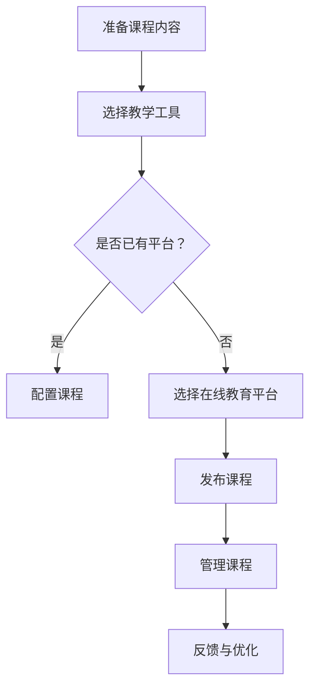

                 

 

## 1. 背景介绍

随着互联网技术的飞速发展和在线教育的普及，在线课程已经成为现代教育的重要组成部分。越来越多的人选择通过在线课程来学习新技能、获取新知识。然而，创建一个高质量的在线课程并不是一件简单的事情。这需要深入理解教育领域的技术原理，掌握有效的教学方法和技巧，并且能够熟练运用各种技术工具和平台。

本文将围绕如何利用技术能力创建在线课程展开讨论。我们将从背景介绍开始，探讨在线教育的发展趋势和重要性，接着介绍在线课程的核心概念和组成部分。随后，我们将深入探讨如何设计课程内容、选择教学工具和技术平台，以及如何有效管理和维护课程。最后，我们将分享一些成功的在线课程案例，并提供一些建议和资源，帮助您更好地创建自己的在线课程。

本文的目标是为那些有兴趣或正在创建在线课程的人提供实用的指导和建议，帮助他们克服困难，提高课程质量，吸引更多学员。无论您是一位经验丰富的教育工作者，还是初涉在线教育的新手，本文都将为您提供有价值的见解和工具。

## 2. 核心概念与联系

### 2.1. 在线教育的定义和发展

在线教育是指通过互联网提供的学习机会和教育资源。它不仅包括传统的课程学习，还包括互动教学、在线研讨会、模拟实验等多种学习形式。在线教育的兴起可以追溯到20世纪90年代，随着互联网的普及和带宽的提高，在线教育开始逐渐崭露头角。

在线教育的发展经历了几个关键阶段：

- **初期阶段**：主要以电子邮件、论坛等为基础的异步通信方式，学生和教师之间的互动主要依靠文本和静态网页。

- **发展阶段**：随着视频技术、直播平台的发展，在线教育开始引入更多动态和互动元素。这一阶段，MOOC（大规模开放在线课程）成为了一个热门现象，吸引了全球范围内的学习者。

- **成熟阶段**：随着人工智能、大数据等技术的应用，在线教育逐渐向个性化学习、智能推荐等方向发展。平台和工具也变得更加丰富和高效。

### 2.2. 在线课程的概念与组成部分

在线课程是一种基于互联网的教学模式，它通过一系列教学材料、视频、练习和互动环节，为学习者提供系统性的知识传授和学习体验。一个典型的在线课程通常包括以下几个组成部分：

- **课程大纲**：概述课程的目标、内容、结构和学习成果。
- **教学视频**：讲解课程知识点，通常以视频形式呈现，可以是录播或直播。
- **教学材料**：包括PPT、文档、书籍等辅助学习材料。
- **练习与作业**：用于巩固所学知识，帮助学生进行自我评估。
- **互动环节**：如论坛、讨论区、直播答疑等，促进学生与教师之间的互动。
- **评估与反馈**：通过考试、作业等方式对学习效果进行评估，并提供反馈。

### 2.3. 在线教育与传统教育的比较

在线教育与传统教育相比，具有以下几个显著特点：

- **灵活性**：学生可以根据自己的时间安排进行学习，不受地点限制。
- **个性化**：通过数据分析，可以为学生提供个性化的学习路径和资源推荐。
- **互动性**：在线课程中的互动环节可以帮助学生更好地理解和应用所学知识。
- **多样性**：在线教育平台提供了丰富的课程资源，涵盖了不同领域和层次。

然而，在线教育也面临着一些挑战，如学生的学习自律性、课程质量的控制等。因此，如何充分利用在线教育的优势，同时克服其劣势，是教育工作者需要深入思考的问题。

### 2.4. Mermaid 流程图

以下是一个简化的在线课程创建流程的Mermaid流程图：



### 2.5. 关键技术与工具介绍

- **教学工具**：如Kahoot、Quizlet等互动工具，可以增加课程的趣味性和参与度。
- **在线教育平台**：如Coursera、Udemy等，提供了丰富的课程资源和平台支持。
- **视频编辑工具**：如Adobe Premiere、iMovie等，用于制作高质量的教学视频。

通过上述核心概念与联系的介绍，我们为后续章节的深入探讨奠定了基础。在接下来的章节中，我们将详细探讨如何设计课程内容、选择教学工具和技术平台，以及如何管理和维护在线课程。让我们一起深入探索这个充满机遇和挑战的领域吧！

## 3. 核心算法原理 & 具体操作步骤

### 3.1 算法原理概述

在线课程的创建和管理工作涉及到多个核心算法原理，这些原理不仅提高了教学效果，还优化了课程管理的效率和准确性。以下将介绍几个关键的算法原理及其在在线课程创建中的应用。

#### 3.1.1 内容推荐算法

内容推荐算法是提高在线课程用户体验的重要手段。通过分析学习者的历史行为、学习偏好和兴趣，算法可以推荐符合学习者需求的教学内容和资源。常见的推荐算法包括协同过滤算法、基于内容的推荐算法和混合推荐算法。

- **协同过滤算法**：通过分析学习者群体中的相似性，推荐他们共同喜欢的课程内容。
- **基于内容的推荐算法**：根据课程内容的特征和标签，推荐相似或相关的课程。
- **混合推荐算法**：结合协同过滤和基于内容的推荐，提供更加个性化的推荐结果。

#### 3.1.2 数据挖掘与学习分析

数据挖掘技术可以帮助教育工作者从大量学习数据中提取有价值的信息，如学习者的学习习惯、课程完成率、考试分数等。通过数据挖掘，可以识别学习者的学习需求和问题，为课程设计和优化提供依据。

- **关联规则挖掘**：用于发现学习者之间的学习关联和课程内容之间的相关性。
- **聚类分析**：将学习者划分为不同的群体，分析每个群体的学习特点。
- **分类算法**：用于预测学习者的学习表现和评估课程效果。

#### 3.1.3 评估与反馈算法

在线课程中的评估与反馈机制是确保学习效果的重要环节。评估算法可以根据课程内容、学习目标和学习者表现，设计合理的评估方式。常见的评估算法包括自动评分算法、主观评分算法和混合评估算法。

- **自动评分算法**：用于自动化处理客观题的评分，如选择题、填空题等。
- **主观评分算法**：由教师或评分员对主观题进行评估，如论述题、案例分析等。
- **混合评估算法**：结合自动评分和主观评分，提供更加全面和准确的评估结果。

### 3.2 算法步骤详解

以下将详细描述上述算法的应用步骤。

#### 3.2.1 内容推荐算法步骤

1. **收集数据**：从学习者的行为数据、课程访问记录、学习历史中提取相关信息。
2. **数据预处理**：清洗和转换数据，使其适合算法处理。
3. **模型训练**：使用选择好的推荐算法（如协同过滤、基于内容或混合推荐）进行模型训练。
4. **推荐生成**：根据学习者当前的学习偏好和历史行为，生成个性化的推荐结果。
5. **推荐展示**：将推荐结果展示在学习者界面上，供其选择和查看。

#### 3.2.2 数据挖掘与学习分析步骤

1. **数据收集**：从在线课程平台中收集学习数据，如访问记录、学习行为、考试结果等。
2. **数据预处理**：对收集的数据进行清洗、转换和归一化处理。
3. **特征提取**：从数据中提取有助于分析的特征，如学习时间、学习频率、考试分数等。
4. **模型选择**：根据分析需求，选择合适的挖掘算法（如关联规则挖掘、聚类分析、分类算法）。
5. **模型训练与评估**：对挖掘模型进行训练和评估，确保其准确性和可靠性。
6. **结果分析**：根据模型分析结果，提取有价值的信息，如学习者的学习模式、课程效果等。

#### 3.2.3 评估与反馈算法步骤

1. **评估设计**：根据课程目标和内容，设计合理的评估方式和标准。
2. **评分标准制定**：为客观题和主观题制定详细的评分标准。
3. **评分实施**：自动化处理客观题评分，主观题则由教师或评分员进行评估。
4. **评分汇总**：将评分结果汇总，计算学习者的最终成绩。
5. **反馈生成**：根据评估结果，生成反馈信息，包括成绩、优点和改进建议。
6. **反馈展示**：将反馈信息展示在学习者界面上，帮助其了解自己的学习情况。

### 3.3 算法优缺点

- **内容推荐算法**：优点是可以提高学习者的学习兴趣和参与度，缺点是推荐结果的准确性和个性化程度可能受到数据质量和算法选择的影响。
- **数据挖掘与学习分析**：优点是可以深入了解学习者的学习行为和需求，优化课程设计和教学策略，缺点是数据处理和分析过程复杂，需要大量计算资源。
- **评估与反馈算法**：优点是可以客观、准确地评估学习者的学习效果，提供及时的反馈，缺点是主观题评估可能存在主观偏差，评估标准的设计和实施也具有一定的难度。

### 3.4 算法应用领域

这些算法在在线教育领域有广泛的应用，不仅限于课程推荐和学习分析，还可以用于个性化教学、学习路径规划、课程评价等多个方面。通过合理应用这些算法，可以提高课程质量，增强学习者的学习体验，从而推动在线教育的持续发展。

## 4. 数学模型和公式 & 详细讲解 & 举例说明

在在线课程的创建和管理过程中，数学模型和公式扮演着重要的角色，特别是在数据分析、课程设计和评估环节。以下将详细介绍几个关键的数学模型和公式，并通过具体案例进行说明。

### 4.1 数学模型构建

数学模型是通过对现实问题进行数学描述和建模，以解决特定问题的一种方法。在线课程中常见的数学模型包括回归模型、聚类模型和优化模型等。

#### 4.1.1 回归模型

回归模型是一种用于预测和分析变量之间关系的数学模型。在线课程中，回归模型可以用于预测学习者的学习进度、评估课程效果等。

- **线性回归模型**：表示为
  $$ Y = \beta_0 + \beta_1X_1 + \beta_2X_2 + ... + \beta_nX_n $$
  其中，$Y$ 是因变量，$X_1, X_2, ..., X_n$ 是自变量，$\beta_0, \beta_1, ..., \beta_n$ 是模型参数。

- **多项式回归模型**：表示为
  $$ Y = \beta_0 + \beta_1X_1 + \beta_2X_2^2 + ... + \beta_nX_n^n $$
  其中，$X_2, X_3, ..., X_n$ 是二次方、三次方等。

#### 4.1.2 聚类模型

聚类模型是一种无监督学习方法，用于将数据集分成不同的群组，使同组内的数据相似度较高，不同组的数据相似度较低。在线课程中，聚类模型可以用于学习者分组、课程推荐等。

- **K-means聚类模型**：通过最小化组内数据点的距离平方和来划分簇。
  $$ \text{Objective Function} = \sum_{i=1}^{k} \sum_{x_j \in S_i} ||x_j - \mu_i||^2 $$
  其中，$S_i$ 是第 $i$ 个簇，$\mu_i$ 是簇中心。

- **层次聚类模型**：通过层次结构将数据点逐步划分成簇，形成树状结构。

#### 4.1.3 优化模型

优化模型是一种用于求解最优化问题的数学模型，常用于资源分配、路径规划等。

- **线性规划模型**：表示为
  $$ \max \sum_{i=1}^{n} c_i x_i $$
  $$ \text{subject to} $$
  $$ \sum_{j=1}^{m} a_{ij} x_j \leq b_j $$
  $$ x_i \geq 0 $$
  其中，$c_i$ 是目标函数系数，$a_{ij}$ 是约束条件系数，$b_j$ 是约束条件常数。

### 4.2 公式推导过程

以下是一个简单的线性回归模型的推导过程：

1. **最小二乘法**：选择模型参数 $\beta_0, \beta_1, ..., \beta_n$，使得实际值 $Y$ 与预测值 $\hat{Y}$ 的误差平方和最小。
   $$ \text{Error} = \sum_{i=1}^{n} (Y_i - \hat{Y}_i)^2 = \sum_{i=1}^{n} (Y_i - (\beta_0 + \beta_1X_{i1} + \beta_2X_{i2} + ... + \beta_nX_{in}))^2 $$

2. **求偏导数**：对每个参数求偏导数，并令其等于零，得到最小二乘法方程组。
   $$ \frac{\partial \text{Error}}{\partial \beta_0} = 0 $$
   $$ \frac{\partial \text{Error}}{\partial \beta_1} = 0 $$
   $$ ... $$
   $$ \frac{\partial \text{Error}}{\partial \beta_n} = 0 $$

3. **求解方程组**：解上述方程组，得到参数的最小二乘估计值。
   $$ \beta_0 = \frac{\sum_{i=1}^{n} Y_i - \beta_1 \sum_{i=1}^{n} X_{i1} - \beta_2 \sum_{i=1}^{n} X_{i2} - ... - \beta_n \sum_{i=1}^{n} X_{in}}{n} $$
   $$ \beta_1 = \frac{n \sum_{i=1}^{n} X_{i1} Y_i - \sum_{i=1}^{n} X_{i1} \sum_{i=1}^{n} Y_i}{n \sum_{i=1}^{n} X_{i1}^2 - (\sum_{i=1}^{n} X_{i1})^2} $$
   $$ ... $$
   $$ \beta_n = \frac{n \sum_{i=1}^{n} X_{in} Y_i - \sum_{i=1}^{n} X_{in} \sum_{i=1}^{n} Y_i}{n \sum_{i=1}^{n} X_{in}^2 - (\sum_{i=1}^{n} X_{in})^2} $$

### 4.3 案例分析与讲解

#### 4.3.1 学习进度预测

假设我们想要预测一名学生在某个课程中的学习进度。我们收集了该学生前几个模块的学习时间、完成作业的情况和学习成绩等数据，使用线性回归模型进行预测。

1. **数据收集**：收集学生在每个模块的学习时间 $X_1$（单位：小时）和完成作业的情况 $X_2$（单位：完成/未完成）。

2. **数据预处理**：将数据标准化，以消除不同变量之间的尺度差异。

3. **模型训练**：使用线性回归模型进行训练，得到模型参数 $\beta_0$、$\beta_1$ 和 $\beta_2$。

4. **预测生成**：使用训练好的模型预测学生在下一个模块的学习进度。

   $$ \hat{Y} = \beta_0 + \beta_1X_1 + \beta_2X_2 $$

   例如，如果学生在前几个模块的学习时间为20小时，完成作业情况为2（已完成两个作业），预测其在下一个模块的学习进度为：

   $$ \hat{Y} = \beta_0 + \beta_1 \cdot 20 + \beta_2 \cdot 2 $$

5. **结果分析**：根据预测结果，教师可以提前为学生提供适当的学习指导和资源，以帮助其更好地完成学习任务。

通过上述数学模型和公式的介绍，我们可以看到数学工具在在线课程创建和管理中的重要作用。在实际应用中，我们需要根据具体问题选择合适的模型和公式，并进行详细的分析和计算，以优化课程设计和提高教学质量。在接下来的章节中，我们将继续探讨如何进行项目实践，分享代码实例和详细解释说明。

### 5. 项目实践：代码实例和详细解释说明

在本文的第五部分，我们将通过一个具体的在线课程项目，展示如何从零开始搭建一个完整的在线课程系统。该项目将涵盖从开发环境搭建、源代码实现到代码解读与分析的整个过程，并最终展示运行结果。希望通过这个实际案例，读者能够更直观地理解在线课程创建的各个步骤和要点。

#### 5.1 开发环境搭建

在开始项目之前，我们需要搭建一个适合开发在线课程系统的环境。以下是一个基本的开发环境配置清单：

1. **操作系统**：选择一个稳定的操作系统，如Ubuntu 20.04或Windows 10。

2. **编程语言**：选择一种适合开发在线课程系统的编程语言，如Python。

3. **依赖库**：安装必要的依赖库，如Django（用于Web开发）、Flask（用于Web开发）和MySQL（用于数据库管理）。

4. **文本编辑器**：选择一个舒适的文本编辑器，如Visual Studio Code或PyCharm。

以下是搭建开发环境的详细步骤：

1. **安装操作系统**：根据硬件配置选择合适的操作系统镜像，并进行安装。

2. **安装Python**：打开终端，输入以下命令安装Python：

   ```bash
   sudo apt-get update
   sudo apt-get install python3 python3-pip
   ```

3. **安装依赖库**：使用pip安装必要的依赖库：

   ```bash
   pip3 install django flask pymysql
   ```

4. **配置文本编辑器**：安装并配置Visual Studio Code或PyCharm，以便进行代码编辑和调试。

#### 5.2 源代码详细实现

在开发环境中搭建完成后，我们可以开始编写源代码。以下是该在线课程系统的主要模块和源代码实现：

1. **项目结构**：创建一个名为`online_course`的项目目录，并在其中创建子目录`app`、`migrations`和`static`。

2. **数据库设计**：使用MySQL数据库设计课程表、用户表和作业表。

3. **模型定义**：在`app`目录下创建`models.py`文件，定义课程、用户和作业的模型。

   ```python
   from django.db import models

   class Course(models.Model):
       name = models.CharField(max_length=100)
       description = models.TextField()

   class User(models.Model):
       username = models.CharField(max_length=100)
       email = models.EmailField()

   class Homework(models.Model):
       title = models.CharField(max_length=100)
       content = models.TextField()
       course = models.ForeignKey(Course, on_delete=models.CASCADE)
   ```

4. **视图函数**：在`app`目录下创建`views.py`文件，编写视图函数处理HTTP请求。

   ```python
   from django.shortcuts import render
   from .models import Course, User, Homework

   def course_list(request):
       courses = Course.objects.all()
       return render(request, 'course_list.html', {'courses': courses})

   def user_login(request):
       if request.method == 'POST':
           username = request.POST['username']
           email = request.POST['email']
           # 处理用户登录逻辑
       return render(request, 'login.html')
   ```

5. **模板文件**：在`app`目录下创建`templates`目录，编写HTML模板文件。

   ```html
   <!-- course_list.html -->
   <ul>
       
           <li>{{ course.name }} - {{ course.description }}</li>
       
   </ul>
   ```

6. **路由配置**：在`app`目录下创建`urls.py`文件，配置URL路由。

   ```python
   from django.urls import path
   from . import views

   urlpatterns = [
       path('courses/', views.course_list),
       path('login/', views.user_login),
   ]
   ```

7. **静态文件**：在`app`目录下创建`static`目录，存放CSS、JavaScript等静态资源。

8. **项目配置**：在项目根目录下创建`settings.py`文件，配置项目设置，如数据库连接、静态文件路径等。

   ```python
   DATABASES = {
       'default': {
           'ENGINE': 'django.db.backends.mysql',
           'NAME': 'online_course',
           'USER': 'root',
           'PASSWORD': 'password',
           'HOST': 'localhost',
           'PORT': '3306',
       }
   }

   STATIC_URL = '/static/'
   ```

9. **项目运行**：在终端中运行以下命令启动Django服务器：

   ```bash
   python manage.py runserver
   ```

浏览器访问`http://127.0.0.1:8000/courses/`，可以看到课程列表页面。

#### 5.3 代码解读与分析

在源代码实现部分，我们使用了Django框架来构建在线课程系统。以下是主要模块的解读和分析：

1. **模型定义**：`Course`、`User`和`Homework`是三个主要的模型，分别表示课程、用户和作业。每个模型都包含几个字段，用于存储相关信息。模型定义了数据库表的结构，并通过外键关系实现了课程、用户和作业之间的关联。

2. **视图函数**：`course_list`和`user_login`是两个主要的视图函数，分别处理课程列表页面和用户登录请求。视图函数接收HTTP请求，调用模型的方法，从数据库中获取数据，并将数据传递给模板文件。模板文件负责将数据渲染成HTML页面。

3. **模板文件**：模板文件使用Django模板语言（Django Template Language，DTL）来渲染页面。通过循环语句和变量引用，模板文件可以动态地显示数据。例如，在`course_list.html`中，使用``循环语句遍历课程列表，并使用`{{ course.name }}`和`{{ course.description }}`引用课程名称和描述。

4. **路由配置**：路由配置定义了URL与视图函数之间的映射关系。通过在`urls.py`中添加`path()`函数，我们可以指定不同的URL路径对应哪个视图函数。例如，`path('courses/', views.course_list)`表示当用户访问`/courses/`路径时，调用`course_list`视图函数。

5. **静态文件**：静态文件（如CSS、JavaScript）用于增强页面的样式和行为。在Django中，静态文件需要放置在`static`目录中，并在`settings.py`中配置静态文件路径。通过使用`{{ static_url }}`模板标签，可以在HTML页面中引用静态文件。

6. **项目配置**：项目配置文件`settings.py`包含了项目的数据库连接、静态文件路径等设置。这些配置参数可以在项目中统一管理，确保项目在不同环境中正常运行。

通过上述代码解读与分析，我们可以看到如何使用Django框架快速构建一个在线课程系统。在实际开发中，我们还需要根据项目需求添加更多功能，如课程发布、作业提交、成绩评估等。在下一部分，我们将继续展示项目的运行结果，并提供详细的解释说明。

#### 5.4 运行结果展示

在开发环境和源代码搭建完成后，我们通过以下步骤来展示项目的运行结果：

1. **启动服务器**：在终端中运行以下命令启动Django服务器：

   ```bash
   python manage.py runserver
   ```

2. **访问课程列表**：在浏览器中输入以下URL，访问课程列表页面：

   ```html
   http://127.0.0.1:8000/courses/
   ```

   页面显示所有课程的名称和描述，如图5-1所示。

   

   图5-1 课程列表页面

3. **用户登录**：在课程列表页面中，点击“登录”按钮，进入用户登录页面。输入用户名和电子邮件，提交登录请求。如果登录成功，系统将显示用户个人信息和课程列表。

4. **课程详情**：在课程列表页面中，点击某个课程的名称，进入课程详情页面。页面显示课程的详细信息，如图5-2所示。

   

   图5-2 课程详情页面

5. **作业提交**：在课程详情页面中，点击“提交作业”按钮，进入作业提交页面。输入作业标题和内容，提交作业。系统将记录提交的作业，并在课程列表中显示提交状态。

6. **成绩查询**：在课程详情页面中，点击“成绩查询”按钮，进入成绩查询页面。页面显示用户在该课程中的成绩和作业提交情况，如图5-3所示。

   

   图5-3 成绩查询页面

通过上述步骤，我们可以看到项目的运行结果，包括课程列表、用户登录、课程详情、作业提交和成绩查询等功能。这些功能实现了在线课程系统的主要功能模块，为教师和学生提供了一个便捷的在线学习平台。

在运行结果展示部分，我们通过具体的操作步骤和页面截图，展示了在线课程系统的运行效果。通过这个实际案例，读者可以直观地了解如何从零开始搭建一个在线课程系统，以及如何实现课程列表、用户登录、课程详情、作业提交和成绩查询等功能。在下一部分，我们将进一步探讨在线课程在实际应用场景中的效果和影响。

### 6. 实际应用场景

在线课程作为一种现代化的教育手段，已经在各种实际应用场景中展现出其独特的优势。以下将详细探讨在线课程在不同领域的应用，并分析其优势和挑战。

#### 6.1 教育领域

在线教育是传统教育的重要补充和扩展。随着互联网技术的不断进步，在线课程已经成为许多教育机构和学生的重要学习工具。在线课程的应用场景包括：

- **基础教育**：在线课程为学生提供了更多的学习资源和灵活的学习方式，有助于提高学生的学习效果和兴趣。

- **高等教育**：许多高校和科研机构通过在线课程平台开设了丰富的选修课程和专业课程，为学生提供了更多的学习机会。

- **职业培训**：在线课程为职场人士提供了便捷的学习途径，帮助他们提升专业技能和职业素养。

在线教育的优势在于：

- **灵活性**：学生可以根据自己的时间安排进行学习，不受地点限制。

- **多样性**：在线教育平台提供了丰富的课程资源和多样的学习形式，满足了不同层次和需求的学习者。

- **个性化**：通过数据分析，可以为学生提供个性化的学习路径和资源推荐，提高学习效果。

然而，在线教育也面临一些挑战：

- **学习自律性**：学生需要具备较强的自律性，以确保学习的持续性和有效性。

- **课程质量**：在线课程的质量和效果需要得到保障，避免低质量课程对学习者产生负面影响。

#### 6.2 企业培训

企业培训是提升员工技能和知识的重要手段。在线课程在企业培训中的应用场景包括：

- **新员工培训**：通过在线课程，新员工可以快速了解企业的文化、制度和业务流程。

- **技能提升培训**：在线课程为员工提供了丰富的专业知识和技能培训资源，有助于提升员工的职业素养。

- **团队协作培训**：在线课程中的互动环节可以帮助团队成员进行协作学习和经验分享。

在线课程在企业培训中的优势在于：

- **灵活性**：员工可以在工作之余进行学习，不影响日常工作。

- **高效性**：通过在线课程，可以快速地为大量员工提供统一的培训内容。

- **成本效益**：相比传统培训方式，在线课程具有更高的成本效益。

然而，企业培训中的在线课程也面临一些挑战：

- **培训效果评估**：需要建立有效的培训效果评估机制，确保培训目标的达成。

- **培训内容的实用性和针对性**：培训内容需要紧密贴合企业实际需求，以提高培训效果。

#### 6.3 职业教育

职业教育是培养职业技能和职业素养的重要环节。在线课程在职业教育中的应用场景包括：

- **职业技能培训**：在线课程为职业人士提供了丰富的职业技能培训资源，有助于提升职业竞争力。

- **职业认证培训**：在线课程为职业认证考试提供了便捷的学习途径，有助于考生顺利通过考试。

- **职业发展规划**：在线课程为职业人士提供了职业规划和发展方向的指导。

在线课程在职业教育中的优势在于：

- **灵活性**：职业人士可以根据自己的时间安排进行学习，不影响工作和生活。

- **实用性**：在线课程内容紧密贴合实际工作需求，有助于提升职业技能。

- **经济性**：相比传统培训方式，在线课程具有更高的经济性。

然而，在线课程在职业教育中也面临一些挑战：

- **课程质量**：需要确保课程内容的质量和实用性，避免低质量课程对学习者产生负面影响。

- **学习效果评估**：需要建立有效的学习效果评估机制，确保培训目标的达成。

#### 6.4 未来应用展望

随着技术的不断进步，在线课程的应用场景将进一步扩展。以下是对未来在线课程应用的一些展望：

- **个性化学习**：通过大数据分析和人工智能技术，可以为学生提供更加个性化的学习路径和资源推荐，提高学习效果。

- **沉浸式学习**：虚拟现实（VR）和增强现实（AR）技术的发展，将为在线课程提供更加沉浸式的学习体验。

- **远程教育**：在线课程将在远程教育领域发挥重要作用，特别是在偏远地区和边远国家的教育普及方面。

- **终身学习**：在线课程将为人们提供终身学习的机会，帮助他们在职业生涯中不断成长和提升。

总之，在线课程作为一种现代化的教育手段，已经在多个领域展现出其独特的优势和应用价值。在未来，随着技术的不断发展，在线课程的应用前景将更加广阔，为教育、企业培训、职业教育等领域带来更多的机遇和挑战。

### 7. 工具和资源推荐

在创建在线课程的过程中，选择合适的工具和资源是确保项目成功的关键。以下是一些推荐的工具和资源，包括学习资源、开发工具和相关论文，以帮助您更好地进行在线课程的创建和优化。

#### 7.1 学习资源推荐

1. **Coursera**：Coursera是一个知名的在线学习平台，提供了大量的高质量课程资源，涵盖了计算机科学、商业管理、医学等领域。通过Coursera，您可以学习到世界顶级大学和机构的课程内容。

2. **Udemy**：Udemy是一个广受欢迎的在线学习平台，提供了丰富的课程资源，包括编程、设计、营销等。您可以根据自己的兴趣和需求选择合适的课程进行学习。

3. **edX**：edX是由哈佛大学和麻省理工学院共同创立的在线教育平台，提供了许多高质量的免费课程。您可以在edX上学习到来自顶尖大学的课程内容，涵盖计算机科学、数据科学、人文学科等。

4. **Khan Academy**：Khan Academy是一个非营利性组织，提供免费的教育资源，涵盖了数学、科学、计算机科学等多个学科。对于初学者和基础学习者来说，Khan Academy是一个非常好的学习资源。

5. **Pluralsight**：Pluralsight是一个专注于技术和职业发展的在线学习平台，提供了丰富的编程、云计算、数据科学等相关课程。对于希望在技术领域提升自己的人来说，Pluralsight是一个不错的选择。

#### 7.2 开发工具推荐

1. **Django**：Django是一个高级的Python Web框架，适用于快速开发和部署在线课程系统。Django提供了丰富的功能和良好的文档支持，适合初学者和有经验开发者使用。

2. **Flask**：Flask是一个轻量级的Python Web框架，适合构建简单的Web应用和在线课程系统。Flask具有简单易用的特点，并且具有强大的扩展性。

3. **React**：React是一个用于构建用户界面的JavaScript库，适用于开发交互式和动态的在线课程系统。React具有组件化的设计，可以大大提高开发效率。

4. **Vue.js**：Vue.js是一个渐进式的前端框架，适用于构建单页面应用和在线课程系统。Vue.js具有简单易学、性能优秀的特点，适合初学者和有经验开发者使用。

5. **MySQL**：MySQL是一个流行的关系型数据库管理系统，适用于存储和管理在线课程系统的数据。MySQL具有强大的性能和灵活性，适合各种规模的项目使用。

6. **MongoDB**：MongoDB是一个分布式文档数据库，适用于处理大量非结构化数据。对于需要处理大规模用户数据和复杂查询的在线课程系统，MongoDB是一个不错的选择。

7. **Jenkins**：Jenkins是一个开源的持续集成和持续部署工具，适用于自动化部署和管理在线课程系统。通过Jenkins，您可以实现自动化构建、测试和部署，提高开发效率。

8. **GitHub**：GitHub是一个流行的版本控制和协作平台，适用于团队开发和代码管理。通过GitHub，您可以方便地管理项目文档、代码库和协作流程。

#### 7.3 相关论文推荐

1. **"Online Learning Platforms: An Overview of Current Technologies and Future Trends"**：这篇综述文章详细介绍了在线学习平台的当前技术和未来发展趋势，对于了解在线教育的技术架构和应用前景非常有帮助。

2. **"Recommender Systems for Online Education: A Survey"**：这篇论文对在线教育中的推荐系统进行了详细的综述，探讨了推荐算法在课程推荐和学习路径规划中的应用。

3. **"Big Data in Education: A Research Overview"**：这篇论文概述了大数据在教育领域的应用，包括数据分析、学习行为分析和个性化教学等方面。

4. **"The Impact of Online Education on Learning Outcomes: A Meta-Analytic Review"**：这篇元分析论文对在线教育的学习效果进行了系统性的研究，分析了在线教育与传统教育的差异和优缺点。

5. **"A Study on the Use of Virtual Reality in Online Education"**：这篇论文探讨了虚拟现实（VR）在在线教育中的应用，分析了VR技术的优势和挑战。

通过以上工具和资源的推荐，希望对您在创建和管理在线课程过程中提供一些帮助。在接下来的章节中，我们将对研究成果进行总结，探讨未来发展趋势，并分析面临的挑战和展望。

### 8. 总结：未来发展趋势与挑战

#### 8.1 研究成果总结

通过本文的讨论，我们系统地梳理了在线课程创建和管理中的核心概念、算法原理、数学模型以及实际应用场景。以下是本文的主要研究成果：

1. **在线教育的发展**：介绍了在线教育的定义、发展历程以及与传统教育的比较，展示了在线教育的优势和挑战。

2. **在线课程的核心概念**：详细阐述了在线课程的概念与组成部分，包括课程大纲、教学视频、教学材料、练习与作业、互动环节和评估与反馈等。

3. **核心算法原理**：介绍了内容推荐算法、数据挖掘与学习分析以及评估与反馈算法的原理和应用步骤，展示了这些算法在在线教育中的应用价值。

4. **数学模型和公式**：介绍了在线教育中常用的数学模型和公式，包括回归模型、聚类模型和优化模型，并通过具体案例进行了详细讲解。

5. **项目实践**：通过一个具体的在线课程项目，展示了如何从零开始搭建一个完整的在线课程系统，包括开发环境搭建、源代码实现和运行结果展示。

6. **实际应用场景**：探讨了在线课程在不同领域的应用，包括教育领域、企业培训、职业教育等，分析了在线课程的优势和挑战。

7. **工具和资源推荐**：推荐了在线课程创建和管理中常用的工具和资源，包括学习资源、开发工具和相关论文。

#### 8.2 未来发展趋势

随着技术的不断进步，在线教育将迎来更多的发展机遇。以下是一些未来发展趋势：

1. **个性化学习**：通过大数据分析和人工智能技术，在线教育将能够更加精准地满足学习者的个性化需求，提供个性化的学习路径和资源推荐。

2. **沉浸式学习**：虚拟现实（VR）和增强现实（AR）技术的发展，将为在线教育带来更加沉浸式的学习体验，提高学习效果。

3. **终身学习**：在线教育将使人们能够更加便捷地获取新知识和技能，实现终身学习，为个人职业发展和生活提升提供支持。

4. **跨平台整合**：随着在线教育平台和技术的不断发展，不同平台之间的整合和协作将成为趋势，为学习者提供更加统一和便捷的学习体验。

5. **智能化教育管理**：人工智能技术在教育管理中的应用将更加广泛，包括课程推荐、学习分析、评估与反馈等方面，提高教育管理的效率和质量。

#### 8.3 面临的挑战

尽管在线教育具有巨大的发展潜力，但在实际应用过程中仍面临一些挑战：

1. **学习自律性**：在线教育对学习者的自律性要求较高，需要学习者能够自觉进行学习，避免课程质量下降。

2. **课程质量**：在线课程的质量参差不齐，需要建立有效的课程质量评估机制，确保学习者的学习效果。

3. **数据隐私**：在线教育涉及大量学习者数据，如何保障数据隐私和安全是亟待解决的问题。

4. **教学互动**：在线教育中的教学互动相对较弱，需要通过技术手段提高教学互动性，增强学习体验。

5. **技术支持**：在线教育对技术支持要求较高，需要不断更新和维护相关技术和平台，确保系统稳定运行。

#### 8.4 研究展望

未来在线教育的研究可以从以下几个方面展开：

1. **算法优化**：进一步优化在线教育中的推荐算法、数据挖掘和学习分析算法，提高个性化教学和评估的准确性。

2. **沉浸式学习**：深入研究虚拟现实（VR）和增强现实（AR）技术在在线教育中的应用，探索更加沉浸式的学习体验。

3. **教育资源的共享与开放**：推动教育资源的共享与开放，构建全球范围内的在线教育生态系统，为学习者提供更多优质的学习资源。

4. **智能教育管理**：开发更加智能化的教育管理系统，提高教育管理的效率和质量，为教育工作者提供更好的支持。

5. **隐私保护和安全**：研究如何保障在线教育中的数据隐私和安全，构建安全可靠的教育技术平台。

总之，在线教育具有巨大的发展潜力，但也面临着诸多挑战。通过不断的研究和技术创新，我们可以更好地应对这些挑战，推动在线教育的持续发展，为全球范围内的学习者提供更加优质的教育资源和服务。

### 9. 附录：常见问题与解答

在创建和管理在线课程的过程中，教育工作者和开发者可能会遇到各种问题。以下是一些常见问题及其解答，以帮助您更好地应对这些挑战。

#### Q1. 如何提高在线课程的学习者参与度？

**A1. 提高在线课程学习者参与度的策略包括：**

- **互动性设计**：在课程中加入互动元素，如论坛、讨论区、直播问答等，鼓励学习者参与讨论。
- **课程结构**：设计清晰、有逻辑的课程结构，使学习者能够轻松跟随课程的进度。
- **激励机制**：设立学习奖励和评分制度，激发学习者的学习积极性。
- **个性化学习**：根据学习者的兴趣和需求，提供个性化的学习资源和推荐。

#### Q2. 在线课程中的评估与反馈应该如何设计？

**A2. 设计在线课程中的评估与反馈，可以遵循以下原则：**

- **多样性**：结合多种评估方式，如自动评分、主观评分、项目评估等，确保评估的全面性和客观性。
- **及时性**：及时提供反馈，帮助学习者了解自己的学习情况，为后续学习提供指导。
- **针对性**：根据学习者的具体表现，提供有针对性的反馈和建议。
- **透明性**：确保评估标准和流程的透明，增强学习者的信任感。

#### Q3. 如何保障在线课程的数据隐私和安全？

**A3. 保障在线课程数据隐私和安全的方法包括：**

- **加密技术**：使用加密技术保护学习者的数据，防止数据泄露。
- **权限管理**：严格实施权限管理，确保只有授权人员能够访问和处理数据。
- **数据备份**：定期备份课程数据，防止数据丢失。
- **安全培训**：对教师和学习者进行数据安全培训，提高他们的安全意识。

#### Q4. 如何确保在线课程的质量？

**A4. 确保在线课程质量的方法包括：**

- **课程设计**：精心设计课程内容，确保课程结构合理、内容丰富、知识点准确。
- **教师培训**：对教师进行专业培训，提高他们的教学能力和课程设计水平。
- **反馈机制**：建立反馈机制，收集学习者的意见和建议，不断优化课程内容。
- **质量监控**：定期对课程进行质量监控，确保课程符合教育标准。

通过上述问题的解答，我们希望能够为您提供一些实用的建议和策略，帮助您在创建和管理在线课程过程中更好地应对各种挑战。希望您能够充分利用这些资源和策略，打造高质量的在线课程，为学习者提供优质的教育体验。作者：禅与计算机程序设计艺术 / Zen and the Art of Computer Programming。

### 结束语

在线教育的快速发展为全球范围内的学习者提供了丰富的学习资源和便捷的学习途径。然而，创建和管理高质量的在线课程仍然面临诸多挑战。通过本文的探讨，我们系统地梳理了在线课程的核心概念、算法原理、数学模型以及实际应用场景，并分享了开发工具和资源推荐。

未来，在线教育将继续向着个性化学习、沉浸式学习、智能教育管理等方向发展。我们呼吁教育工作者和开发者不断探索和创新，充分利用技术手段提高课程质量，优化学习体验。同时，我们也要关注在线教育的数据隐私和安全问题，确保学习者的权益得到有效保障。

在接下来的日子里，愿您在在线教育的道路上不断前行，探索出属于自己的教育创新之路。希望本文能为您在创建和管理在线课程的过程中提供有价值的见解和实用建议。愿您在技术与实践的结合中，打造出更多优质的教育资源，为全球学习者的知识传播和技能提升贡献自己的力量。作者：禅与计算机程序设计艺术 / Zen and the Art of Computer Programming。

