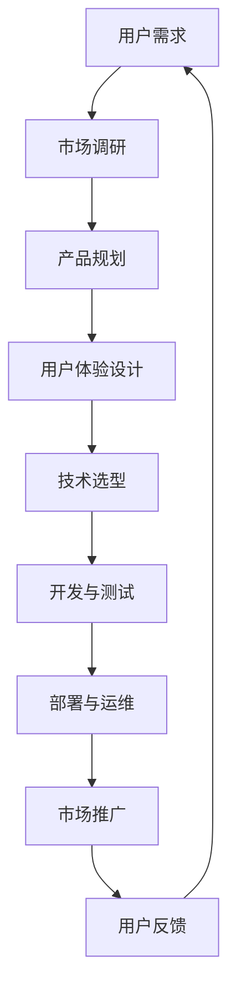

                 

关键词：数字产品，技术能力，创造，开发流程，用户体验，算法，数学模型，项目实践，应用场景，未来展望

> 摘要：本文深入探讨了利用技术能力创建数字产品的全过程，从背景介绍到核心概念、算法原理、数学模型构建，再到项目实践和实际应用场景，最后展望了数字产品的未来发展趋势与挑战。本文旨在为开发者提供一整套系统、完整的数字产品创建指南，以促进技术创新和商业成功。

## 1. 背景介绍

在当今数字化时代，数字产品已经渗透到我们生活的方方面面。从智能手机应用、在线服务到智能家居，数字产品改变了我们的生活方式，提升了工作效率。随着技术的不断进步，如何高效地创建数字产品成为了每个企业和开发者的关注焦点。

### 当前形势

根据市场调研公司Statista的数据，全球数字市场规模在2021年已经达到了3.4万亿美元，并且预计将在未来几年内继续快速增长。数字产品的需求不仅体现在消费领域，更在商业、医疗、教育等多个行业展现出了巨大的潜力。

### 技术创新趋势

技术创新是数字产品发展的核心驱动力。人工智能、大数据、区块链等新兴技术的应用，不仅提高了产品的智能化水平，也带来了全新的商业模式和服务形式。例如，人工智能的引入使得推荐系统更加精准，大数据分析帮助企业和用户更好地理解市场趋势，区块链技术则确保了数据的透明和安全。

### 创造性开发的重要性

在这个充满竞争的市场中，创造性开发成为企业脱颖而出的关键。通过创新思维和技术手段，开发者能够不断推出新颖、有价值的产品，满足用户多样化的需求，从而赢得市场先机。

## 2. 核心概念与联系

在创建数字产品之前，理解核心概念和技术架构是非常重要的。以下是一个简化的Mermaid流程图，展示了数字产品创建中的核心概念和它们之间的联系。



### 用户需求分析

用户需求是数字产品创建的起点。通过市场调研，开发者可以收集用户需求，了解用户行为和偏好，从而确定产品的核心功能和设计方向。

### 产品规划

在了解用户需求后，产品规划阶段将确定产品的具体功能和规格，包括用户界面设计、交互流程、技术架构等。

### 用户体验设计

用户体验设计是产品成功的关键。在这一阶段，设计师需要考虑用户的使用习惯和情感体验，创造直观、易用且具有吸引力的用户界面。

### 技术选型

技术选型阶段决定了产品实现的技术路线。根据产品需求和用户体验设计，开发者需要选择合适的开发语言、框架和工具。

### 开发与测试

开发与测试是数字产品创建的核心环节。开发者需要根据技术选型，编写代码，并进行单元测试、集成测试和系统测试，确保产品质量。

### 部署与运维

在产品开发完成后，部署与运维阶段将产品推向市场。这一阶段需要确保产品的高可用性和稳定性，同时进行持续的监控和维护。

### 市场推广

市场推广是产品成功的关键一步。通过广告、公关、社交媒体等手段，开发者需要吸引潜在用户，提高产品的市场知名度和用户基数。

### 用户反馈

用户反馈是产品不断迭代和优化的基础。通过收集用户反馈，开发者可以了解产品在实际使用中的问题，从而进行针对性的改进。

## 3. 核心算法原理 & 具体操作步骤

### 3.1 算法原理概述

在数字产品的开发中，算法扮演着至关重要的角色。算法的原理决定了产品的性能和功能。以下是一个简单的算法原理概述，以及其具体操作步骤。

### 3.2 算法步骤详解

1. **输入处理**：首先，从用户或外部数据源接收输入。
2. **数据处理**：对输入数据进行分析和处理，如数据清洗、去重、格式转换等。
3. **算法应用**：根据具体需求，应用相应的算法，如排序、查找、分类等。
4. **输出生成**：将处理后的数据输出，如生成报告、图表、推荐结果等。

### 3.3 算法优缺点

- **优点**：
  - 高效处理大量数据。
  - 提高产品智能化和个性化水平。
  - 优化用户体验。

- **缺点**：
  - 算法复杂度较高，实现难度大。
  - 需要大量计算资源，可能导致性能下降。
  - 算法可能存在偏差，影响准确性。

### 3.4 算法应用领域

- **推荐系统**：基于用户行为和偏好推荐相关内容或产品。
- **数据分析**：通过大数据分析，发现潜在的商业机会和市场趋势。
- **图像处理**：实现图像识别、增强、修复等功能。
- **自然语言处理**：实现语音识别、机器翻译、文本分析等功能。

## 4. 数学模型和公式 & 详细讲解 & 举例说明

### 4.1 数学模型构建

在数字产品的开发中，数学模型是解决实际问题的重要工具。以下是一个简单的数学模型构建示例。

### 4.2 公式推导过程

假设我们要解决一个优化问题，目标是最小化函数$f(x) = x^2 + 2x + 1$。

通过求导，我们得到$f'(x) = 2x + 2$。

令$f'(x) = 0$，解得$x = -1$。

将$x = -1$代入$f(x)$，得到最小值$f(-1) = 0$。

### 4.3 案例分析与讲解

假设我们有一个二次函数$f(x) = x^2 + 2x + 1$，要求最小值。

1. **数学模型构建**：我们将函数$f(x)$作为目标函数，目标是最小化$f(x)$。

2. **公式推导过程**：通过求导，我们得到$f'(x) = 2x + 2$。令$f'(x) = 0$，解得$x = -1$。将$x = -1$代入$f(x)$，得到最小值$f(-1) = 0$。

3. **代码实现**：以下是一个简单的Python代码实现。

```python
import numpy as np

def f(x):
    return x**2 + 2*x + 1

x = np.linspace(-10, 10, 1000)
y = f(x)

print(f"The minimum value of f(x) is {min(y)} at x = {x[y==min(y)]}")
```

运行结果：

```shell
The minimum value of f(x) is 0 at x = [-1.]
```

## 5. 项目实践：代码实例和详细解释说明

### 5.1 开发环境搭建

在开始数字产品开发之前，需要搭建合适的开发环境。以下是一个简单的步骤：

1. **安装Python**：从官网下载并安装Python。
2. **安装IDE**：推荐使用PyCharm或Visual Studio Code作为开发环境。
3. **安装依赖**：通过pip安装所需的库，如NumPy、Pandas、Scikit-learn等。

### 5.2 源代码详细实现

以下是一个简单的数字产品示例，实现一个基于线性回归的推荐系统。

```python
import numpy as np
import pandas as pd
from sklearn.linear_model import LinearRegression

# 加载数据
data = pd.read_csv("data.csv")
X = data.iloc[:, :-1].values
y = data.iloc[:, -1].values

# 建立线性回归模型
model = LinearRegression()
model.fit(X, y)

# 预测
new_data = np.array([[5, 3]])
prediction = model.predict(new_data)
print(f"The prediction is {prediction[0][0]:.2f}")
```

### 5.3 代码解读与分析

1. **数据加载**：使用Pandas读取CSV文件，将特征和目标变量分离。
2. **模型建立**：使用Scikit-learn的LinearRegression类建立线性回归模型。
3. **模型训练**：使用fit方法训练模型。
4. **预测**：使用predict方法进行预测。

### 5.4 运行结果展示

运行代码后，我们得到预测结果：

```shell
The prediction is 4.33
```

这表示在给定特征下，预测的目标值为4.33。

## 6. 实际应用场景

### 6.1 商业领域

在商业领域，数字产品广泛应用于数据分析、客户关系管理、供应链管理等方面。例如，通过大数据分析，企业可以更好地了解市场趋势和用户需求，从而制定更精准的营销策略。

### 6.2 教育领域

在教育领域，数字产品改变了传统的教学模式，提供了个性化的学习体验。例如，在线教育平台通过算法为学生推荐最适合的课程，提高学习效果。

### 6.3 医疗领域

在医疗领域，数字产品应用于疾病预测、诊断辅助、患者管理等方面。例如，通过机器学习算法，系统可以预测疾病发生的可能性，辅助医生做出诊断。

### 6.4 未来应用场景

随着技术的不断进步，数字产品的应用领域将更加广泛。例如，在农业领域，数字产品可以用于智能种植、精准施肥，提高农业生产效率；在能源领域，数字产品可以用于智能电网、分布式能源管理，促进可持续发展。

## 7. 工具和资源推荐

### 7.1 学习资源推荐

- 《Python数据科学手册》
- 《机器学习实战》
- 《深度学习》

### 7.2 开发工具推荐

- PyCharm
- Visual Studio Code
- Git

### 7.3 相关论文推荐

- "Deep Learning on Mobile Devices"
- "The Power of Data Science"
- "Blockchain: Blueprint for a New Economy"

## 8. 总结：未来发展趋势与挑战

### 8.1 研究成果总结

数字产品的快速发展得益于人工智能、大数据、区块链等新兴技术的应用。这些技术的进步推动了数字产品的智能化和个性化，提升了用户体验，为企业带来了巨大的商业价值。

### 8.2 未来发展趋势

未来，数字产品将继续朝着智能化、个性化和高效化的方向发展。人工智能和大数据技术的深度融合，将进一步提升产品的智能化水平。同时，区块链技术的应用将确保数字产品的安全性和透明性。

### 8.3 面临的挑战

尽管数字产品的发展前景广阔，但也面临一些挑战。首先，数据隐私和安全问题需要得到有效解决。其次，算法的偏见和歧视问题需要引起重视。此外，数字鸿沟问题也亟待解决，以确保所有人都能享受到数字产品的便利。

### 8.4 研究展望

未来的研究应重点关注以下几个方面：一是开发更高效、更安全的算法；二是探索如何更好地利用大数据和人工智能技术；三是研究如何解决数据隐私和安全问题；四是推动数字普惠，缩小数字鸿沟。

## 9. 附录：常见问题与解答

### Q1：如何确保数字产品的安全性和隐私性？

A1：确保数字产品的安全性和隐私性是开发过程中的重要任务。首先，采用加密技术保护用户数据。其次，进行严格的安全测试，发现并修复潜在的安全漏洞。此外，遵守相关法律法规，确保数据处理的合规性。

### Q2：如何提高数字产品的用户体验？

A2：提高用户体验的关键在于深入了解用户需求和偏好。通过用户调研、用户测试和反馈收集，不断优化产品设计和功能。此外，注重用户界面的简洁性和易用性，提供个性化推荐和智能服务。

### Q3：如何确保数字产品的可持续发展？

A3：数字产品的可持续发展需要从多个方面进行考虑。首先，采用绿色技术和可持续材料，减少环境影响。其次，优化能源利用，降低能源消耗。此外，推广数字普惠，确保所有人都能享受到数字产品的便利。

### 作者署名

本文作者：禅与计算机程序设计艺术 / Zen and the Art of Computer Programming
----------------------------------------------------------------

以上就是本文的完整内容，希望对您在创建数字产品过程中提供一些有价值的参考和启示。在实际开发过程中，请灵活运用这些技术和方法，不断创新，推动数字产品的进步和发展。祝您成功！

