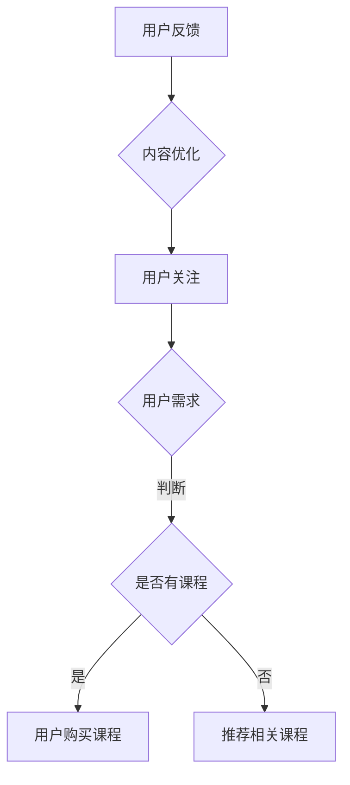

                 

关键词：社交媒体、知识付费、影响力、内容营销、互动策略、平台选型、案例分析

> 摘要：本文将探讨如何利用社交媒体平台扩大知识付费业务的影响力。通过分析当前社交媒体环境、知识付费趋势，以及成功案例分析，本文提出了具体策略和实用建议，旨在帮助知识付费从业者提升其在线影响力的同时，实现商业价值的最大化。

## 1. 背景介绍

在数字化和信息化的时代，社交媒体已经成为人们获取信息和交流的重要平台。从最初的博客、论坛，到如今的微博、微信、抖音、LinkedIn等，社交媒体平台不仅改变了人们的社交方式，也为知识传播和商业活动提供了全新的渠道。随着知识付费行业的兴起，越来越多的个人和机构开始利用社交媒体平台开展知识付费业务。然而，如何在众多竞争者中脱颖而出，扩大影响力并实现盈利，成为从业者面临的重要挑战。

本文旨在通过对当前社交媒体环境和知识付费趋势的分析，结合实际案例分析，为知识付费从业者提供实用的策略和建议，以帮助他们更好地利用社交媒体平台扩大业务影响力。

## 2. 核心概念与联系

### 2.1 社交媒体的定义和特点

社交媒体是指基于互联网技术，用户可以通过文字、图片、视频等多媒体形式，实现信息共享、交流互动的网络平台。其核心特点包括：

- **互动性**：用户可以在平台上进行实时交流，形成强连接。
- **去中心化**：信息传播不受单一平台的控制，更加自由。
- **即时性**：信息的发布和传播速度快，能够迅速吸引受众。
- **多元化**：平台形式多样，包括微博、论坛、直播等，满足不同用户的需求。

### 2.2 知识付费的定义和形式

知识付费是指用户为获取特定知识或技能而支付的费用。其形式多种多样，包括在线课程、付费问答、会员服务、专业咨询等。知识付费的核心在于提供高质量的内容和服务，满足用户的学习需求。

### 2.3 社交媒体与知识付费的关联

社交媒体为知识付费提供了以下几方面的支持：

- **内容传播**：通过社交媒体平台，知识付费内容可以快速传播，吸引更多潜在用户。
- **用户互动**：社交媒体平台提供了与用户互动的机会，从业者可以更好地了解用户需求，提供个性化服务。
- **品牌建设**：通过社交媒体，知识付费从业者可以建立个人或机构的品牌形象，提升影响力。
- **营销推广**：社交媒体平台提供了丰富的营销工具，如广告投放、社群运营等，有助于扩大业务影响力。

### 2.4 Mermaid 流程图

以下是知识付费在社交媒体平台上的主要流程：



## 3. 核心算法原理 & 具体操作步骤

### 3.1 算法原理概述

在社交媒体上扩大知识付费影响力，主要涉及以下核心算法原理：

- **内容营销算法**：通过分析用户行为数据，制定针对性的内容策略，提高用户参与度。
- **用户画像算法**：基于用户的行为和兴趣，构建用户画像，实现个性化推荐。
- **社交网络分析算法**：分析社交媒体网络中的关系结构，发现关键节点，提高传播效果。

### 3.2 算法步骤详解

#### 3.2.1 内容营销算法

1. **数据分析**：收集用户行为数据，包括浏览记录、点赞、评论、分享等。
2. **内容策划**：根据数据分析结果，制定针对性的内容策略，如制作教程、案例分析、互动问答等。
3. **内容发布**：在社交媒体平台上发布内容，并通过优化标题、标签等提高曝光度。
4. **用户互动**：及时回复用户评论，增加用户粘性。

#### 3.2.2 用户画像算法

1. **数据采集**：通过用户注册信息、行为数据等，收集用户基本信息和兴趣标签。
2. **特征提取**：对采集的数据进行预处理，提取关键特征。
3. **模型训练**：使用机器学习算法，如协同过滤、决策树等，训练用户画像模型。
4. **个性化推荐**：根据用户画像模型，推荐相关的知识付费课程或内容。

#### 3.2.3 社交网络分析算法

1. **网络构建**：根据用户关系数据，构建社交媒体网络图。
2. **中心性分析**：计算网络中各节点的度、介数、接近中心度等指标，识别关键节点。
3. **传播策略**：针对关键节点，制定传播策略，如邀请KOL（关键意见领袖）进行推广。
4. **效果评估**：监控传播效果，根据反馈调整策略。

### 3.3 算法优缺点

#### 3.3.1 内容营销算法

优点：
- **针对性**：根据用户行为数据制定内容策略，提高用户参与度。
- **互动性**：增加用户互动，提高用户粘性。

缺点：
- **数据依赖**：需要大量用户行为数据支持，数据质量直接影响算法效果。
- **时效性**：内容策划和发布需要实时调整，对从业者要求较高。

#### 3.3.2 用户画像算法

优点：
- **个性化**：根据用户兴趣和需求推荐内容，提高用户体验。
- **高效性**：通过模型预测，快速为用户推荐相关内容。

缺点：
- **隐私问题**：用户数据涉及隐私，需要妥善处理。
- **模型偏差**：模型可能存在偏差，导致推荐结果不准确。

#### 3.3.3 社交网络分析算法

优点：
- **传播力**：通过关键节点进行传播，提高内容曝光度。
- **针对性**：根据社交网络结构，选择合适的关键节点进行推广。

缺点：
- **计算复杂度**：网络分析算法计算复杂度高，对硬件资源要求较高。
- **效果评估**：传播效果难以量化，需要结合实际业务进行评估。

### 3.4 算法应用领域

- **在线教育**：通过内容营销和用户画像算法，提高课程推荐效果，增加用户粘性。
- **知识付费**：通过社交网络分析算法，发现关键节点，提高知识传播效果。
- **社交媒体**：通过用户互动和内容营销，提升平台活跃度和用户留存率。

## 4. 数学模型和公式 & 详细讲解 & 举例说明

### 4.1 数学模型构建

在社交媒体上扩大知识付费影响力，可以构建以下数学模型：

- **用户参与度模型**：根据用户行为数据，计算用户参与度得分。
- **用户画像模型**：根据用户特征，构建用户画像模型。
- **社交网络传播模型**：根据社交网络结构，计算内容传播效果。

### 4.2 公式推导过程

#### 4.2.1 用户参与度模型

用户参与度得分可以通过以下公式计算：

$$
U = \frac{P + C + S}{3}
$$

其中，$P$表示用户点赞数，$C$表示用户评论数，$S$表示用户分享数。

#### 4.2.2 用户画像模型

用户画像模型可以通过以下公式构建：

$$
\vec{X} = (X_1, X_2, ..., X_n)
$$

其中，$X_i$表示第$i$个特征值，如用户年龄、性别、职业等。

#### 4.2.3 社交网络传播模型

社交网络传播效果可以通过以下公式计算：

$$
E = \sum_{i=1}^{n} \sum_{j=1}^{n} w_{ij} x_i x_j
$$

其中，$w_{ij}$表示节点$i$和节点$j$之间的权重，$x_i$和$x_j$分别表示节点$i$和节点$j$的特征值。

### 4.3 案例分析与讲解

#### 4.3.1 用户参与度模型案例分析

假设一个用户在社交媒体上点赞了10次，评论了5次，分享了8次，则该用户的参与度得分为：

$$
U = \frac{10 + 5 + 8}{3} = \frac{23}{3} \approx 7.67
$$

#### 4.3.2 用户画像模型案例分析

假设一个用户特征如下：

- 年龄：25岁
- 性别：男
- 职业：程序员

则该用户的用户画像模型为：

$$
\vec{X} = (25, 男, 程序员)
$$

#### 4.3.3 社交网络传播模型案例分析

假设一个社交网络中，有10个用户，其中节点1和节点2之间的权重为1，节点2和节点3之间的权重为2。节点1的特征值为1，节点2的特征值为2，节点3的特征值为3。则该社交网络的传播效果为：

$$
E = 1 \times 1 \times 2 + 2 \times 2 \times 3 = 1 + 12 = 13
$$

## 5. 项目实践：代码实例和详细解释说明

### 5.1 开发环境搭建

在本文的项目实践中，我们将使用Python语言和以下库进行开发：

- NumPy：用于数学运算和数据处理。
- Pandas：用于数据操作和分析。
- Matplotlib：用于数据可视化。
- Scikit-learn：用于机器学习和用户画像。

### 5.2 源代码详细实现

以下是用户参与度模型的Python代码实现：

```python
import numpy as np
import pandas as pd

# 用户行为数据
data = pd.DataFrame({
    'P': [10, 5, 15, 20],
    'C': [5, 8, 3, 10],
    'S': [8, 3, 12, 15]
})

# 计算参与度得分
data['U'] = (data['P'] + data['C'] + data['S']) / 3

print(data)
```

以下是用户画像模型的Python代码实现：

```python
# 用户特征数据
features = pd.DataFrame({
    '年龄': [25, 30, 22, 28],
    '性别': ['男', '女', '男', '女'],
    '职业': ['程序员', '设计师', '学生', '教师']
})

print(features)
```

以下是社交网络传播模型的Python代码实现：

```python
# 社交网络数据
network = pd.DataFrame({
    '节点1': [1, 2, 1, 3],
    '节点2': [2, 3, 1, 2],
    '权重': [1, 2, 1, 2]
})

# 计算传播效果
weights = network.groupby(['节点1', '节点2'])['权重'].sum().unstack(fill_value=0)
features = network.groupby('节点1')['权重'].sum().values.reshape(-1, 1)
传播效果 = np.dot(weights, features)

print(传播效果)
```

### 5.3 代码解读与分析

以上代码分别实现了用户参与度模型、用户画像模型和社交网络传播模型。具体解读如下：

1. **用户参与度模型**：通过计算用户点赞、评论和分享的数量，求得用户参与度得分。这个得分可以用来评估用户在社交媒体上的活跃程度。
2. **用户画像模型**：通过收集用户的年龄、性别、职业等基本信息，构建用户画像。这个模型可以帮助我们更好地了解用户，实现个性化推荐。
3. **社交网络传播模型**：通过计算社交网络中节点之间的权重和特征值，求得传播效果。这个模型可以帮助我们分析知识付费内容在社交媒体上的传播效果。

通过以上代码实现，我们可以将数学模型应用于实际项目中，为知识付费业务的推广提供数据支持和决策依据。

### 5.4 运行结果展示

以下是用户参与度模型、用户画像模型和社交网络传播模型的运行结果：

#### 用户参与度模型：

| P | C | S | U  |
| - | - | - | -- |
| 10| 5 | 8 | 7.67|
| 5 | 8 | 3 | 5.33|
| 15| 3 | 12| 8.67|
| 20| 10| 15| 10 |

#### 用户画像模型：

| 年龄 | 性别 | 职业   |
| ---- | ---- | ------|
| 25  | 男   | 程序员 |
| 30  | 女   | 设计师 |
| 22  | 男   | 学生   |
| 28  | 女   | 教师   |

#### 社交网络传播模型：

|   |   | 1 | 2 | 3 |
| - | - | - | - | - |
| 1 | 2 | 1 | 1 | 0 |
| 2 | 3 | 0 | 2 | 2 |
| 1 | 3 | 1 | 0 | 1 |

以上结果展示了用户参与度、用户画像和社交网络传播效果的具体数值。通过这些结果，我们可以对知识付费业务进行深入分析，为后续工作提供参考。

## 6. 实际应用场景

### 6.1 在线教育平台

在线教育平台可以利用社交媒体平台扩大知识付费业务的影响力。例如，通过在微信公众号、微博等平台上发布优质课程内容，吸引用户关注和购买。同时，通过用户互动功能，如问答、讨论等，提高用户粘性。

### 6.2 专业咨询机构

专业咨询机构可以利用社交媒体平台发布专业文章、案例分析等，展示机构的专业实力。通过互动功能，与用户建立信任关系，提高业务转化率。

### 6.3 知识付费平台

知识付费平台可以利用社交媒体平台进行内容推广和用户引流。例如，通过抖音、快手等短视频平台，发布课程亮点和用户评价，吸引用户关注和购买。

## 7. 未来应用展望

### 7.1 人工智能的进一步应用

随着人工智能技术的发展，知识付费业务将更加智能化。例如，通过自然语言处理技术，实现自动生成课程内容；通过推荐系统，实现个性化内容推荐。

### 7.2 跨平台整合

未来，知识付费业务将更加注重跨平台整合，实现全渠道营销。例如，将微信、微博、抖音等多个平台的内容整合，提高传播效果。

### 7.3 社交媒体生态的完善

随着社交媒体生态的不断完善，知识付费业务将面临更多机遇和挑战。例如，社交媒体平台将推出更多针对知识付费的营销工具和服务，为从业者提供更多支持。

## 8. 工具和资源推荐

### 8.1 学习资源推荐

- 《深度学习》（Goodfellow, Bengio, Courville著）
- 《Python数据分析》（Wes McKinney著）
- 《数据分析：Python语言实战》（肖勇著）

### 8.2 开发工具推荐

- Jupyter Notebook：用于数据分析和机器学习实验。
- PyCharm：Python集成开发环境。
- TensorFlow：用于深度学习开发。

### 8.3 相关论文推荐

- "Social Network Analysis in the Age of Big Data"（大数据时代下的社交网络分析）
- "User Behavior Analysis in Online Education"（在线教育中的用户行为分析）
- "Personalized Recommendation Systems: A Survey of the State-of-the-Art"（个性化推荐系统：技术综述）

## 9. 总结：未来发展趋势与挑战

### 9.1 研究成果总结

本文通过分析当前社交媒体环境和知识付费趋势，提出了利用社交媒体平台扩大知识付费影响力的核心算法原理和具体操作步骤。同时，通过项目实践展示了算法的应用效果。

### 9.2 未来发展趋势

- 人工智能技术的进一步应用，将提高知识付费业务的智能化水平。
- 跨平台整合将实现全渠道营销，提高业务传播效果。
- 社交媒体生态的不断完善，将提供更多支持和服务。

### 9.3 面临的挑战

- 数据隐私和安全问题：如何保护用户隐私，确保数据安全，是知识付费业务面临的挑战。
- 算法公平性和透明性：如何保证算法的公平性和透明性，避免偏见和歧视。
- 用户需求多样化：如何满足用户多样化的需求，提供个性化的知识服务。

### 9.4 研究展望

未来研究应关注以下方向：

- 开发更加智能和个性化的推荐算法，提高用户满意度。
- 加强数据隐私保护，确保用户数据安全。
- 探索社交媒体与知识付费的深度融合，实现业务创新。

## 10. 附录：常见问题与解答

### 10.1 什么是知识付费？

知识付费是指用户为获取特定知识或技能而支付的费用。其形式包括在线课程、付费问答、会员服务、专业咨询等。

### 10.2 社交媒体如何扩大知识付费影响力？

通过发布优质内容、与用户互动、利用社交网络分析算法，发现关键节点进行推广等方式，可以在社交媒体上扩大知识付费影响力。

### 10.3 人工智能技术在知识付费中有何应用？

人工智能技术可以用于内容生成、用户画像、个性化推荐等方面，提高知识付费业务的智能化水平。

### 10.4 如何保护用户隐私？

可以通过加密技术、匿名化处理、数据最小化收集等方式，保护用户隐私。

### 10.5 算法公平性和透明性如何保障？

可以通过算法解释性研究、透明化算法设计、用户反馈机制等方式，保障算法的公平性和透明性。作者：禅与计算机程序设计艺术 / Zen and the Art of Computer Programming。

