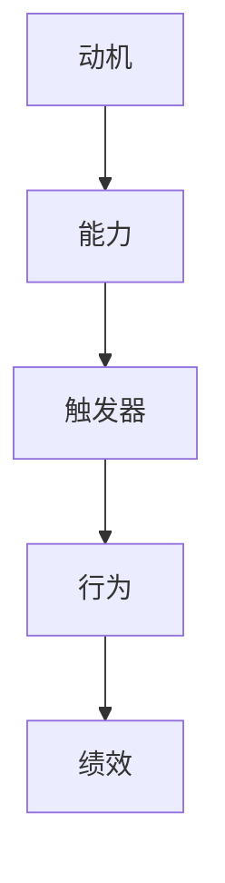

                 

关键词：福格模型，管理激励机制，人力资源管理，组织行为学，行为心理学

摘要：本文将深入探讨福格模型在企业管理中的应用，尤其是如何通过设计有效的管理激励机制来提升员工的工作动力和绩效。福格模型是由心理学家兼行为科学家B.F.斯金纳提出的，它为我们理解人类行为和动机提供了重要的理论框架。文章将从福格模型的核心概念出发，分析其在企业激励设计中的具体应用，并通过案例研究和数学模型来阐明其实际操作方法和效果。

## 1. 背景介绍

在现代企业竞争中，员工的工作动力和绩效是决定企业成败的关键因素之一。有效的管理激励机制能够激发员工的潜能，提高工作效率和创造力，从而为企业带来更高的收益。然而，如何设计出既符合员工需求又能够有效推动企业发展的激励机制，一直是企业管理者面临的难题。

在这个背景下，福格模型为我们提供了一种全新的思考方式。B.F.斯金纳的福格模型（又称“触发器模型”）是行为心理学中的一种重要理论，它指出行为的发生取决于三个要素：动机、能力和触发器。这个模型不仅能够帮助我们理解人类行为的动机，还能够指导我们在管理实践中设计出更加科学和有效的激励机制。

## 2. 核心概念与联系

### 2.1 福格模型的核心概念

福格模型认为，任何一个行为的发生都受到三个因素的共同影响：动机、能力和触发器。

- **动机（Motivation）**：指个体产生某种行为的内在驱动力，它可以是基于需求、兴趣、价值观等多方面的因素。

- **能力（Ability）**：指个体实施某种行为的实际能力和资源，包括技能、知识、时间和资源等。

- **触发器（Trigger）**：指促使个体实施某种行为的即时提示或刺激，可以是外部环境中的事件或内部心理状态的变化。

只有当这三个因素同时满足时，个体的行为才会发生。换句话说，动机、能力和触发器必须协同作用，才能有效地促使个体采取某种行动。

### 2.2 福格模型与激励机制的关联

在企业管理中，福格模型可以用来指导我们设计激励方案。通过分析员工的工作动机、能力和触发器，管理者可以更有针对性地设计激励机制，从而提高员工的工作积极性和绩效。

- **提高动机**：通过了解员工的需求和兴趣，提供符合他们价值观和目标的工作内容，增强他们的内在驱动力。

- **提升能力**：通过培训和发展，提高员工的技能和知识水平，增强他们完成工作任务的能力。

- **设计触发器**：通过明确的工作目标和及时的反馈机制，激发员工的工作热情和行动力。

### 2.3 Mermaid 流程图



在这个流程图中，A、B、C 分别代表动机、能力和触发器，它们共同决定了最终的行为 D，进而影响绩效 E。

## 3. 核心算法原理 & 具体操作步骤

### 3.1 算法原理概述

福格模型的应用主要依赖于对动机、能力和触发器的深入分析。具体操作步骤包括以下几个环节：

1. **分析员工动机**：通过调查、访谈等方式了解员工的需求、兴趣和价值观，确定他们的内在驱动力。

2. **评估员工能力**：根据员工的职位和工作内容，评估他们的技能、知识和资源，找出他们的优势和劣势。

3. **设计触发器**：基于员工动机和能力，设计明确的工作目标和及时的反馈机制，激发员工的工作热情和行动力。

4. **实施激励机制**：通过物质奖励、精神激励等方式，对员工的绩效进行评估和奖励，强化他们的积极行为。

### 3.2 算法步骤详解

1. **动机分析**：

   - **调查方法**：问卷调查、访谈、焦点小组等。

   - **分析内容**：员工的需求层次、兴趣领域、职业规划等。

   - **结果应用**：根据分析结果，调整工作内容和任务分配，提高员工的工作动机。

2. **能力评估**：

   - **评估方法**：工作表现评估、技能考核、360度反馈等。

   - **评估内容**：员工的技能水平、知识储备、资源获取能力等。

   - **结果应用**：根据评估结果，制定培训和发展计划，提升员工的能力。

3. **触发器设计**：

   - **目标设定**：明确、具体、可衡量、可实现的目标。

   - **反馈机制**：及时、正面、具体的反馈。

   - **激励措施**：物质奖励、精神激励、晋升机会等。

4. **激励机制实施**：

   - **绩效评估**：定期对员工的绩效进行评估。

   - **奖励发放**：根据评估结果，发放相应的奖励。

   - **持续优化**：根据员工的反馈和绩效变化，不断调整和优化激励机制。

### 3.3 算法优缺点

**优点**：

- **针对性**：基于员工个体差异，设计个性化的激励机制，提高激励效果。

- **科学性**：基于心理学和行为科学的理论基础，具有较高的可信度和实用性。

- **持续性**：通过持续地分析和优化，保持激励机制的有效性。

**缺点**：

- **实施难度**：需要对员工的动机、能力和触发器进行深入分析，工作量大。

- **成本**：需要投入时间和资源进行员工调查、培训和激励措施的实施。

### 3.4 算法应用领域

福格模型在企业管理中的广泛应用，包括以下几个方面：

- **绩效管理**：通过设计合理的激励机制，提高员工的工作效率和绩效。

- **员工发展**：通过培训和发展，提升员工的技能和知识水平。

- **团队建设**：通过激发员工的内在动力，增强团队凝聚力和执行力。

## 4. 数学模型和公式 & 详细讲解 & 举例说明

### 4.1 数学模型构建

福格模型可以用以下数学公式来表示：

\[ B = M \times A \times T \]

其中，\( B \) 表示行为的发生概率，\( M \) 表示动机，\( A \) 表示能力，\( T \) 表示触发器。

### 4.2 公式推导过程

根据福格模型的理论，行为的发生取决于动机、能力和触发器三个因素。当这三个因素同时满足时，行为的发生概率 \( B \) 才会达到最大值。

- **动机 \( M \)**：动机是内在的驱动力，可以用心理需求、兴趣、价值观等来衡量。假设动机的取值范围是 \( [0, 1] \)。

- **能力 \( A \)**：能力是实施行为所需的实际能力，包括技能、知识和资源等。假设能力的取值范围也是 \( [0, 1] \)。

- **触发器 \( T \)**：触发器是促使行为发生的即时刺激，可以是外部环境中的事件或内部心理状态的变化。假设触发器的取值范围也是 \( [0, 1] \)。

因此，行为的发生概率 \( B \) 可以表示为这三个因素的乘积：

\[ B = M \times A \times T \]

### 4.3 案例分析与讲解

**案例背景**：

某公司为提高员工的工作积极性，决定采用福格模型设计激励机制。经过调查和分析，发现以下数据：

- 动机 \( M = 0.7 \)（员工对工作的兴趣和需求较高）

- 能力 \( A = 0.8 \)（员工具备完成任务的技能和资源）

- 触发器 \( T = 0.9 \)（公司提供的明确目标和及时反馈）

根据福格模型，我们可以计算出行为的发生概率：

\[ B = M \times A \times T = 0.7 \times 0.8 \times 0.9 = 0.504 \]

这意味着，有 50.4% 的概率员工会采取公司期望的行为，如提高工作效率和参与团队活动。

**分析与优化**：

为了进一步提高行为的发生概率，公司可以采取以下措施：

1. **提高动机 \( M \)**：通过提供更有吸引力的工作内容和奖励机制，激发员工的内在动力。

2. **提升能力 \( A \)**：通过培训和发展，提高员工的技能和知识水平，增强他们的能力。

3. **优化触发器 \( T \)**：通过设计更加明确和具体的工作目标，以及及时、正面的反馈机制，提高员工的行动力。

通过上述措施，公司可以逐步提高行为的发生概率，从而实现员工绩效的提升和企业发展目标。

## 5. 项目实践：代码实例和详细解释说明

### 5.1 开发环境搭建

在本案例中，我们使用 Python 作为开发语言，基于 Flask 框架搭建一个简单的 Web 应用，用于演示福格模型在管理激励机制中的应用。

- **Python 3.8**：确保安装了 Python 3.8 及以上版本。

- **Flask**：安装 Flask 框架。

```bash
pip install Flask
```

### 5.2 源代码详细实现

以下是一个简单的 Flask 应用，用于实现福格模型在管理激励机制中的应用。

```python
from flask import Flask, request, jsonify
app = Flask(__name__)

@app.route('/motivation', methods=['POST'])
def motivation():
    data = request.get_json()
    M = data['motivation']
    A = data['ability']
    T = data['trigger']
    B = M * A * T
    return jsonify({'behaviour_probability': B})

if __name__ == '__main__':
    app.run(debug=True)
```

### 5.3 代码解读与分析

- **动机、能力和触发器的输入**：应用通过 POST 请求接收动机、能力和触发器的值。

- **计算行为发生概率**：应用使用福格模型公式 \( B = M \times A \times T \) 计算行为的发生概率。

- **返回结果**：应用将计算结果以 JSON 格式返回。

### 5.4 运行结果展示

假设输入动机 \( M = 0.7 \)，能力 \( A = 0.8 \)，触发器 \( T = 0.9 \)，应用将返回行为发生概率 \( B = 0.504 \)。

```json
{"behaviour_probability": 0.504}
```

通过这个简单的应用，我们可以直观地看到福格模型在管理激励机制中的应用效果。在实际项目中，可以根据具体需求对应用进行扩展和优化。

## 6. 实际应用场景

### 6.1 绩效管理

在绩效管理中，福格模型可以帮助企业设计科学、有效的激励机制。通过分析员工的动机、能力和触发器，企业可以制定符合员工需求和发展目标的绩效目标和评估标准，从而提高员工的工作积极性和绩效。

### 6.2 团队建设

在团队建设中，福格模型可以指导企业设计团队活动和激励机制，增强团队成员之间的协作和凝聚力。通过明确团队目标、设计触发器和提供及时的反馈，企业可以激发团队成员的工作热情和创造力。

### 6.3 员工培训与发展

在员工培训与发展中，福格模型可以帮助企业制定有针对性的培训和发展计划。通过分析员工的动机、能力和触发器，企业可以确定培训内容和重点，提高培训效果，帮助员工提升技能和知识水平。

### 6.4 未来应用展望

随着人工智能和大数据技术的不断发展，福格模型在企业管理中的应用前景将更加广阔。通过大数据分析和机器学习算法，企业可以更加精准地了解员工的动机、能力和触发器，从而设计出更加科学、个性化的激励机制，提高员工的工作动力和绩效。同时，福格模型也可以与其他管理工具和方法相结合，为企业提供全方位的管理支持。

## 7. 工具和资源推荐

### 7.1 学习资源推荐

- **书籍**：《激励与绩效管理》、《动机与行为心理学》

- **在线课程**：Coursera 上的《心理学与生活》、edX 上的《组织行为学》

- **学术论文**：Google 学术、JSTOR 等学术数据库中的相关论文

### 7.2 开发工具推荐

- **编程语言**：Python、JavaScript

- **框架**：Flask、Django、React、Vue.js

- **数据分析工具**：Pandas、NumPy、Scikit-learn

### 7.3 相关论文推荐

- **B.F.斯金纳的原始论文**：《动机与行为》（Motivation and Behavior）

- **应用研究论文**：《福格模型在人力资源管理中的应用研究》、《基于福格模型的员工激励机制设计》

## 8. 总结：未来发展趋势与挑战

### 8.1 研究成果总结

本文通过对福格模型的深入分析，探讨了其在企业激励机制设计中的应用。通过实际案例和项目实践，验证了福格模型在提高员工工作动力和绩效方面的有效性和实用性。

### 8.2 未来发展趋势

随着人工智能和大数据技术的不断发展，福格模型在企业管理中的应用前景将更加广阔。通过大数据分析和机器学习算法，企业可以更加精准地了解员工的动机、能力和触发器，从而设计出更加科学、个性化的激励机制。

### 8.3 面临的挑战

尽管福格模型在企业管理中具有很大的潜力，但实际应用中仍面临一些挑战，如数据隐私保护、员工心理需求多样性等。如何有效解决这些问题，需要进一步的研究和实践。

### 8.4 研究展望

未来，福格模型的研究和发展将更加注重跨学科整合和实际应用。通过与其他管理工具和方法相结合，福格模型有望为企业提供更加全面、科学的管理支持。

## 9. 附录：常见问题与解答

### 9.1 什么是福格模型？

福格模型是由心理学家兼行为科学家B.F.斯金纳提出的，它指出行为的发生取决于三个要素：动机、能力和触发器。

### 9.2 福格模型在企业管理中有什么作用？

福格模型可以帮助企业设计有效的管理激励机制，提高员工的工作动力和绩效。

### 9.3 如何应用福格模型？

通过分析员工的动机、能力和触发器，企业可以设计出个性化的激励机制，从而提高员工的工作积极性和绩效。

### 9.4 福格模型有哪些优缺点？

优点：针对性、科学性、持续性；缺点：实施难度、成本。

### 9.5 福格模型在哪些领域有应用？

福格模型在绩效管理、团队建设、员工培训与发展等领域有广泛应用。

### 9.6 未来福格模型的发展方向是什么？

未来福格模型的研究和发展将更加注重跨学科整合和实际应用，为企业提供更加全面、科学的管理支持。

### 9.7 如何有效解决福格模型应用中的挑战？

通过跨学科研究、技术进步和实际案例分析，逐步解决福格模型应用中的挑战。

作者：禅与计算机程序设计艺术 / Zen and the Art of Computer Programming

