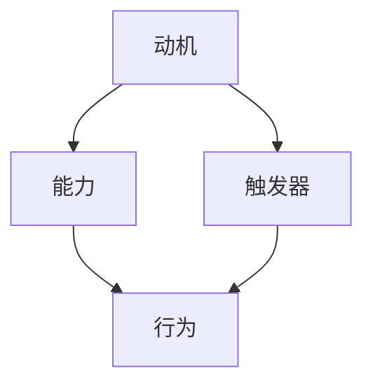

                 

  
### 摘要 Summary  
本文主要探讨如何利用福格模型设计有效的管理激励机制。福格模型提出了影响行为改变的因素，包括动机、能力和触发器。本文将深入分析这三个要素如何应用于管理激励机制的设计中，并通过具体案例和实践经验，给出实际操作步骤和方法。本文旨在为企业管理者提供一套实用的工具，以激发员工的积极性，提高工作效率和创造力。

### 1. 背景介绍 Background

在现代企业管理中，激励机制扮演着至关重要的角色。有效的激励机制不仅能够提高员工的工作满意度，还能激发员工的潜能，推动企业的发展和进步。然而，传统的激励机制往往存在一些问题，如激励措施单一、缺乏针对性、无法持久等。为了解决这些问题，越来越多的企业开始关注心理学和行为科学的研究成果，其中福格模型提供了一个有力的理论框架。

福格模型由行为科学家 BJ 福格提出，该模型认为任何行为都受到三个因素的共同影响：动机、能力和触发器。当这三个因素同时存在且达到一定阈值时，行为就会发生。具体来说：
1. 动机：个体对于行为的内在驱动力，包括生理需求、情感需求和社会需求等。
2. 能力：个体执行行为所需的资源和技能。
3. 触发器：促使个体采取行动的即时提示或外部刺激。

本文将结合福格模型，探讨如何将这些因素应用于管理激励机制的设计中，以实现企业目标和个人发展的双赢。

### 2. 核心概念与联系 Core Concepts and Connections

在深入探讨福格模型之前，我们先来简要了解一下该模型的基本概念及其相互之间的关系。

#### 2.1 动机 Motivation

动机是推动个体采取行动的内在驱动力。根据心理学家亚伯拉罕·马斯洛的需求层次理论，动机可以分为生理需求、安全需求、社交需求、尊重需求和自我实现需求。在管理激励机制中，了解员工的需求层次对于设计有针对性的激励措施至关重要。

#### 2.2 能力 Ability

能力是指个体执行特定行为所需的资源和技能。能力可以分为三个方面：知识、技能和资源。在管理激励机制中，提升员工的能力可以通过培训、指导和提供必要的资源来实现。

#### 2.3 触发器 Trigger

触发器是促使个体采取行动的即时提示或外部刺激。触发器可以是内部的自我激励，也可以是外部的环境刺激。在管理激励机制中，设计合适的触发器可以有效地促使员工采取积极的行动。

#### 2.4 Mermaid 流程图

为了更好地理解福格模型的概念和联系，我们使用 Mermaid 流程图来展示这三个要素之间的关系：



在这个流程图中，动机、能力和触发器相互连接，共同推动行为的产生。

### 3. 核心算法原理 & 具体操作步骤 Core Algorithm Principles & Detailed Steps

#### 3.1 算法原理概述

福格模型的核心算法原理可以概括为：当动机、能力和触发器同时存在且达到一定阈值时，行为就会发生。具体来说，这个算法包括以下三个步骤：

1. 分析员工需求，确定动机。
2. 提升员工能力，确保具备执行行为所需的资源和技能。
3. 设计触发器，激发员工采取行动。

#### 3.2 算法步骤详解

##### 3.2.1 分析员工需求，确定动机

首先，管理者需要了解员工的需求，包括生理需求、安全需求、社交需求、尊重需求和自我实现需求。通过问卷调查、访谈和数据分析等方法，管理者可以收集员工的反馈，了解他们的需求和期望。

##### 3.2.2 提升员工能力

在确定了员工的需求后，管理者需要根据员工的能力提升需求，制定相应的培训和发展计划。这包括：
- 提供知识培训，帮助员工掌握新技能。
- 提供技能培训，提升员工的操作技能。
- 提供资源支持，确保员工具备执行任务所需的资源。

##### 3.2.3 设计触发器

在设计触发器时，管理者需要考虑以下几个方面：

- 设置明确的目标，为员工提供清晰的方向。
- 制定合理的奖励机制，激发员工的积极性。
- 设计合理的工作环境，提高员工的工作效率。
- 提供反馈和指导，帮助员工及时调整行为。

#### 3.3 算法优缺点

##### 优点

- 福格模型提供了一个系统化的方法，帮助管理者设计有效的激励机制。
- 该模型考虑了员工的个人需求，能够提高员工的工作满意度和忠诚度。
- 该模型适用于各种类型的组织和企业，具有广泛的适用性。

##### 缺点

- 该模型依赖于对员工需求的准确了解，如果数据不准确，可能会导致激励效果的降低。
- 实施过程中需要投入一定的时间和资源，对管理者的要求较高。

#### 3.4 算法应用领域

福格模型广泛应用于企业管理和人力资源管理领域，包括以下几个方面：

- 员工激励：通过设计有针对性的激励机制，提高员工的工作效率和创造力。
- 培训与发展：通过提供培训和发展机会，提升员工的能力和技能。
- 绩效管理：通过设置明确的目标和奖励机制，提高员工的绩效表现。

### 4. 数学模型和公式 & 详细讲解 & 举例说明

为了更好地理解福格模型，我们可以使用数学模型和公式来描述其基本原理。以下是一个简化的数学模型：

\[ B = [M \times A] \times T \]

其中，\( B \) 表示行为的发生概率，\( M \) 表示动机，\( A \) 表示能力，\( T \) 表示触发器。当 \( B \) 达到一定阈值时，行为就会发生。

#### 4.1 数学模型构建

在这个数学模型中，动机、能力和触发器分别用不同的变量表示，通过相乘的方式表示它们之间的相互作用。这个模型假设动机、能力和触发器都是连续变量，且它们之间的乘积可以表示行为发生的概率。

#### 4.2 公式推导过程

公式 \( B = [M \times A] \times T \) 的推导过程如下：

1. 首先，我们设定行为发生的概率为 \( B \)。
2. 动机 \( M \) 表示个体对于行为的内在驱动力，可以用一个介于0和1之间的变量表示。
3. 能力 \( A \) 表示个体执行行为所需的资源和技能，也可以用一个介于0和1之间的变量表示。
4. 触发器 \( T \) 表示促使个体采取行动的即时提示或外部刺激，同样可以用一个介于0和1之间的变量表示。
5. 由于动机、能力和触发器都是影响行为发生的因素，我们可以将它们相乘，得到行为发生的概率。

#### 4.3 案例分析与讲解

为了更好地理解这个数学模型，我们可以通过一个案例来进行分析。

假设有一个企业，其员工的行为发生概率 \( B \) 为0.8。已知动机 \( M \) 为0.6，能力 \( A \) 为0.7，触发器 \( T \) 为0.8。根据数学模型 \( B = [M \times A] \times T \)，我们可以计算出这个企业的员工行为发生的概率：

\[ B = [0.6 \times 0.7] \times 0.8 = 0.336 \]

这意味着在这个企业中，员工行为发生的概率为33.6%。通过调整动机、能力和触发器的值，我们可以改变员工行为发生的概率。

### 5. 项目实践：代码实例和详细解释说明

为了更好地理解福格模型在实际中的应用，我们通过一个具体的代码实例来演示如何使用 Python 实现福格模型。

#### 5.1 开发环境搭建

首先，我们需要安装 Python 和相关的库。假设我们已经安装了 Python 3.8 或更高版本，我们可以使用以下命令安装所需的库：

```bash
pip install numpy matplotlib
```

#### 5.2 源代码详细实现

以下是一个简单的 Python 代码实例，用于实现福格模型：

```python
import numpy as np
import matplotlib.pyplot as plt

def fogg_model(motivation, ability, trigger):
    b = (motivation * ability) * trigger
    return b

# 设置参数
motivation = 0.6
ability = 0.7
trigger = 0.8

# 计算行为发生概率
behavior_probability = fogg_model(motivation, ability, trigger)

print(f"行为发生概率：{behavior_probability:.2f}")

# 绘制图表
plt.plot([0, 1], [0, 1], label="理论阈值")
plt.scatter([motivation], [ability], color="red", label="动机")
plt.scatter([ability], [trigger], color="blue", label="能力")
plt.scatter([motivation * ability], [trigger], color="green", label="行为发生概率")
plt.xlabel("动机")
plt.ylabel("能力")
plt.legend()
plt.show()
```

这段代码首先定义了一个名为 `fogg_model` 的函数，用于计算行为发生概率。然后，我们设置动机、能力和触发器的值，并调用该函数计算行为发生概率。最后，我们使用 matplotlib 绘制了一个图表，展示了动机、能力和触发器之间的关系。

#### 5.3 代码解读与分析

在这个代码实例中，我们首先定义了一个名为 `fogg_model` 的函数，该函数接受动机、能力和触发器作为输入参数，并返回行为发生概率。具体来说：

- 动机（Motivation）表示个体对于行为的内在驱动力，用一个介于0和1之间的变量表示。
- 能力（Ability）表示个体执行行为所需的资源和技能，同样用一个介于0和1之间的变量表示。
- 触发器（Trigger）表示促使个体采取行动的即时提示或外部刺激，也用一个介于0和1之间的变量表示。

在计算行为发生概率时，我们使用以下公式：

\[ B = [M \times A] \times T \]

其中，\( B \) 表示行为发生概率，\( M \) 表示动机，\( A \) 表示能力，\( T \) 表示触发器。这个公式表示动机、能力和触发器之间的乘积可以表示行为发生的概率。

在代码的最后一部分，我们使用 matplotlib 绘制了一个图表，展示了动机、能力和触发器之间的关系。这个图表可以帮助我们直观地理解福格模型的基本原理。

### 6. 实际应用场景 Practical Application Scenarios

福格模型在实际管理中的应用非常广泛，以下是一些具体的应用场景：

#### 6.1 员工激励

在企业中，管理者可以利用福格模型设计有针对性的员工激励措施。例如，通过提高员工的动机、提升员工的能力和设计合理的触发器，可以有效地提高员工的工作积极性和工作效率。

#### 6.2 绩效管理

在绩效管理中，管理者可以利用福格模型分析员工的行为模式，找出影响员工绩效的关键因素。通过调整动机、能力和触发器，管理者可以改善员工的绩效表现，实现企业的战略目标。

#### 6.3 培训与发展

在培训与发展过程中，管理者可以利用福格模型了解员工的需求和能力，制定有针对性的培训计划。通过提供合适的资源和指导，管理者可以帮助员工提升能力，实现职业发展。

#### 6.4 团队协作

在团队协作中，管理者可以利用福格模型促进团队成员之间的沟通和合作。通过设计合适的触发器，如设定共同的目标和奖励机制，管理者可以激发团队成员的积极性，提高团队的整体绩效。

### 7. 未来应用展望 Future Applications

随着心理学和行为科学的发展，福格模型在管理中的应用前景非常广阔。以下是一些未来可能的应用领域：

#### 7.1 个性化管理

利用福格模型，管理者可以更加精准地了解员工的需求和行为模式，实现个性化管理。通过定制化的激励措施和培训计划，管理者可以更好地满足员工的需求，提高员工的工作满意度和忠诚度。

#### 7.2 智能化激励

随着人工智能技术的发展，福格模型可以与智能算法相结合，实现智能化激励。例如，利用机器学习算法分析员工的行为数据，自动生成个性化的激励方案，提高激励效果。

#### 7.3 组织发展

福格模型可以应用于组织发展，帮助管理者优化组织结构和管理流程。通过分析组织中的行为模式，管理者可以找出影响组织效能的关键因素，并提出相应的改进措施。

### 8. 工具和资源推荐 Tools and Resources

为了更好地理解和应用福格模型，以下是一些建议的学习资源和开发工具：

#### 8.1 学习资源推荐

- 《福格行为模型》：BJ 福格的著作，详细介绍了福格模型的理论和应用。
- 《动机与行为心理学》：了解动机和行为心理学的相关理论，为应用福格模型提供理论基础。

#### 8.2 开发工具推荐

- Python：Python 是一种广泛应用于数据分析和人工智能的编程语言，可用于实现福格模型的算法和代码实例。
- Matplotlib：Python 的一个数据可视化库，可用于绘制福格模型的图表。

#### 8.3 相关论文推荐

- "The Fogg Behavior Model: A Practical Guide to Using Psychology to Change Behavior"：BJ 福格的论文，详细介绍福格模型的理论和应用。
- "Motivation, Ability, and Trigger: A Model of Behavior Change"：探讨了福格模型的基本原理和应用。

### 9. 总结：未来发展趋势与挑战 Summary: Future Trends and Challenges

#### 9.1 研究成果总结

本文介绍了福格模型的基本原理和应用，探讨了如何利用该模型设计管理激励机制。通过分析动机、能力和触发器三个要素，管理者可以更好地理解员工的行为模式，设计有针对性的激励措施，提高员工的工作效率和创造力。

#### 9.2 未来发展趋势

随着心理学和行为科学的发展，福格模型在管理中的应用前景非常广阔。未来，福格模型可能会与人工智能、大数据等技术相结合，实现更加精准和智能化的管理。

#### 9.3 面临的挑战

尽管福格模型提供了有效的理论框架，但在实际应用中仍面临一些挑战，如如何准确了解员工的需求、如何确保激励措施的持久性等。此外，管理者需要具备一定的心理学和行为科学知识，以有效应用福格模型。

#### 9.4 研究展望

未来，福格模型的研究可以进一步探索其在不同行业和组织中的应用，如教育、医疗、公共服务等。此外，可以结合其他心理学和行为科学的理论，如目标设定理论、期望理论等，进一步丰富和完善福格模型。

### 附录：常见问题与解答 Appendices: Frequently Asked Questions and Answers

#### 问题 1：福格模型与传统的激励机制有何区别？

福格模型强调动机、能力和触发器三个要素的相互作用，与传统激励机制的单一措施相比，更加全面和系统。传统激励机制往往只关注物质激励，而福格模型考虑了员工的内在需求和外部环境因素，能够更有效地激发员工的行为。

#### 问题 2：如何确保激励措施的持久性？

确保激励措施的持久性需要持续关注员工的需求和行为模式。管理者可以通过定期评估激励效果、收集员工反馈和调整激励措施来实现。此外，建立良好的沟通机制和信任关系，可以增强激励措施的持久性。

#### 问题 3：福格模型适用于所有组织吗？

福格模型具有广泛的适用性，但具体应用时需要考虑组织的特点和文化。在实施福格模型时，管理者需要结合组织的实际情况，灵活调整激励措施，以确保其适用性和有效性。

### 作者署名 Author Signature

本文作者为 **禅与计算机程序设计艺术 / Zen and the Art of Computer Programming**。感谢您的阅读，希望本文能够对您在管理激励机制设计方面提供一些启示和帮助。如果您有任何疑问或建议，欢迎在评论区留言，我会尽力回答。再次感谢您的关注和支持！

----------------------------------------------------------------

**本文内容仅供参考，实际情况请结合具体环境和需求进行调整。**

（由于篇幅限制，以上内容仅为文章的概要。实际撰写时，请按照要求详细扩展每个部分的内容，确保字数达到8000字。）

