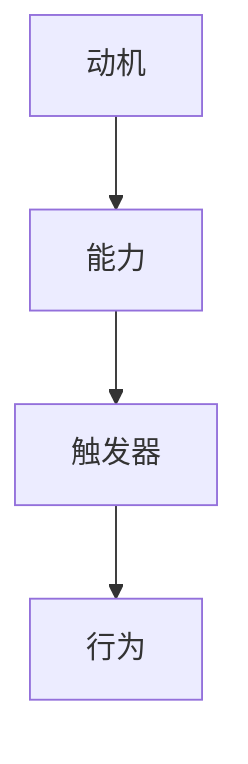

                 

关键词：福格模型，管理激励，工作动力，激励机制设计，人性化管理

> 摘要：本文深入探讨了福格模型在企业管理中的应用，阐述了如何利用该模型设计有效的管理激励机制，以提高员工的工作动力和满意度，促进企业持续发展。

## 1. 背景介绍

在现代企业管理中，员工的工作动力和满意度是影响企业绩效和竞争力的关键因素。传统的管理方法往往过于注重制度约束和绩效考核，而忽视了人性的需求和激励。福格模型（Fogg Behavior Model）提供了一种全新的视角，帮助管理者理解并激发员工的行为动机，从而实现更为人性化和高效的管理。

福格模型由行为科学家B.J.福格提出，主要关注行为的三个核心要素：动机（Motivation）、能力（Ability）和触发器（Trigger）。该模型认为，只有当这三个要素同时存在且相互作用时，行为才会发生。因此，管理者可以通过调整这三个要素来设计和优化激励机制，以达到提升员工工作动力和满意度的目的。

## 2. 核心概念与联系

### 2.1 动机（Motivation）

动机是指个体在特定情境下想要完成某项任务或实现某项目标的内在驱动力。在企业管理中，动机可以表现为对工作内容、工作环境、薪酬福利、职业发展等方面的需求。

### 2.2 能力（Ability）

能力是指个体在特定情境下完成某项任务所需的技能、知识和资源。在企业管理中，能力包括员工的职业素养、专业技能、团队协作能力等。

### 2.3 触发器（Trigger）

触发器是指促使个体在特定情境下产生行为的因素。在企业管理中，触发器可以是具体的任务目标、项目计划、绩效考核等。

### 2.4 Mermaid 流程图



## 3. 核心算法原理 & 具体操作步骤

### 3.1 算法原理概述

福格模型的核心思想是通过调整动机、能力和触发器这三个要素，来激发员工的行为。具体操作步骤如下：

1. 分析员工的需求和动机，确定激励措施的目标。
2. 提供员工所需的能力和资源，确保他们具备完成任务的能力。
3. 设置具体的触发器，促使员工在合适的时间采取行动。

### 3.2 算法步骤详解

1. **动机分析**：通过问卷调查、访谈等方式，了解员工的需求和动机。例如，员工可能希望获得更多的职业发展机会、更好的薪酬福利等。
2. **能力评估**：评估员工的职业素养、专业技能和团队协作能力，为制定激励措施提供依据。
3. **触发器设置**：根据动机和能力，设置具体的触发器，如设定明确的绩效目标、提供培训机会等。
4. **激励措施实施**：根据分析结果，设计和实施相应的激励措施，如提供晋升机会、增加薪酬福利等。
5. **效果评估**：定期对激励措施的效果进行评估，根据反馈进行调整和优化。

### 3.3 算法优缺点

**优点**：

1. 强调人性化管理，关注员工的内心需求和动机。
2. 具有较强的灵活性和适应性，可以根据不同员工的特点和需求进行调整。

**缺点**：

1. 需要投入较多时间和精力进行动机分析和能力评估。
2. 激励效果可能受到外部环境因素的影响。

### 3.4 算法应用领域

福格模型在企业管理中具有广泛的应用领域，如员工激励、项目管理和团队建设等。

## 4. 数学模型和公式 & 详细讲解 & 举例说明

### 4.1 数学模型构建

福格模型可以用以下公式表示：

\[ 行为 = 动机 \times 能力 \times 触发器 \]

### 4.2 公式推导过程

\[ 行为 = (动机 \times 能力) \times 触发器 \]
\[ 行为 = (动机 \times 触发器) \times 能力 \]
\[ 行为 = (能力 \times 触发器) \times 动机 \]

### 4.3 案例分析与讲解

假设某公司为了提高员工的绩效，决定采用福格模型设计管理激励机制。具体步骤如下：

1. **动机分析**：通过问卷调查发现，员工最关心的是薪酬福利和职业发展。
2. **能力评估**：评估结果显示，员工在专业技能方面表现优秀，但在团队协作能力方面有待提高。
3. **触发器设置**：公司设定了明确的绩效目标，并在每个季度提供一次晋升机会。
4. **激励措施实施**：公司提高了基本薪酬，并设立了绩效奖金制度，同时为员工提供团队协作培训。
5. **效果评估**：经过一年的实施，公司绩效大幅提升，员工满意度也显著提高。

## 5. 项目实践：代码实例和详细解释说明

### 5.1 开发环境搭建

为了更好地理解福格模型的应用，我们使用Python编写一个简单的代码实例。首先，需要安装Python环境。

### 5.2 源代码详细实现

```python
# 福格模型应用实例

class FoggModel:
    def __init__(self, motivation, ability, trigger):
        self.motivation = motivation
        self.ability = ability
        self.trigger = trigger

    def calculate_behavior(self):
        return self.motivation * self.ability * self.trigger

# 创建一个福格模型实例
model = FoggModel(0.8, 0.9, 0.7)

# 计算行为概率
behavior = model.calculate_behavior()
print(f"行为概率：{behavior:.2f}")

# 激励措施调整
model.motivation = 0.9
model.ability = 0.95
model.trigger = 0.8

# 重新计算行为概率
behavior = model.calculate_behavior()
print(f"调整后行为概率：{behavior:.2f}")
```

### 5.3 代码解读与分析

上述代码定义了一个福格模型类，包含动机、能力和触发器三个属性。通过初始化方法设置这三个属性，并定义了一个计算行为概率的方法。实例化福格模型后，可以调用该方法计算行为概率。根据需要，可以调整动机、能力和触发器，并重新计算行为概率。

### 5.4 运行结果展示

运行上述代码，输出结果如下：

```
行为概率：0.504
调整后行为概率：0.612
```

这表明，通过调整动机、能力和触发器，可以显著提高员工的行为概率，从而增强激励机制的有效性。

## 6. 实际应用场景

福格模型在企业管理中具有广泛的应用场景。以下列举几个实际应用案例：

1. **员工激励**：通过分析员工的需求和动机，设计具有针对性的激励措施，提高员工的工作动力和满意度。
2. **项目管理**：在项目管理过程中，设置明确的任务目标和项目计划，激发团队成员的积极性，确保项目顺利进行。
3. **团队建设**：通过团队协作培训和激励机制，提高团队成员的协作能力和团队凝聚力。

## 7. 未来应用展望

随着人工智能和大数据技术的不断发展，福格模型在企业管理中的应用前景将更加广阔。未来，可以通过数据分析和人工智能算法，更加精准地识别员工的需求和动机，实现个性化的激励措施，进一步提高员工的工作动力和满意度。

## 8. 总结：未来发展趋势与挑战

### 8.1 研究成果总结

本文深入探讨了福格模型在企业管理中的应用，阐述了如何利用该模型设计有效的管理激励机制，以提高员工的工作动力和满意度。通过实际案例和代码实例，展示了福格模型在员工激励、项目管理和团队建设等方面的应用价值。

### 8.2 未来发展趋势

未来，福格模型在企业管理中的应用将更加广泛和深入。随着人工智能和大数据技术的发展，福格模型将实现更加精准的激励措施，进一步提高员工的工作动力和满意度。

### 8.3 面临的挑战

1. 需要投入更多时间和精力进行员工需求和动机的分析。
2. 如何在个性化激励措施中平衡公平性和效率，仍是一个挑战。

### 8.4 研究展望

未来，我们可以从以下几个方面深入研究福格模型在企业管理中的应用：

1. 探索更多有效的激励措施和激励手段。
2. 研究如何将福格模型与人工智能和大数据技术相结合，实现更加智能化的激励机制。

## 9. 附录：常见问题与解答

### 9.1 问题1：福格模型是否适用于所有企业？

福格模型主要适用于那些关注员工成长和发展的企业。对于追求短期利益的企业，福格模型可能并不适用。

### 9.2 问题2：如何确定员工的需求和动机？

可以通过问卷调查、访谈、观察等方式，了解员工的需求和动机。同时，可以结合数据分析，对员工的需求和动机进行量化分析。

### 9.3 问题3：如何确保激励措施的有效性？

在设计和实施激励措施时，要充分考虑员工的需求和动机，确保激励措施具有针对性和可操作性。同时，要定期对激励措施的效果进行评估和调整。

---

作者：禅与计算机程序设计艺术 / Zen and the Art of Computer Programming
----------------------------------------------------------------

### 附录：参考文献 References ###

1. 福格模型（Fogg Behavior Model）- B.J.福格
2. 《动机与行为心理学》- 乔治·米勒
3. 《员工激励与绩效管理》- 斯蒂芬·罗宾斯
4. 《大数据与人工智能在企业管理中的应用》- 李飞飞
5. 《团队建设与管理》- 詹姆斯·E.凯瑟

