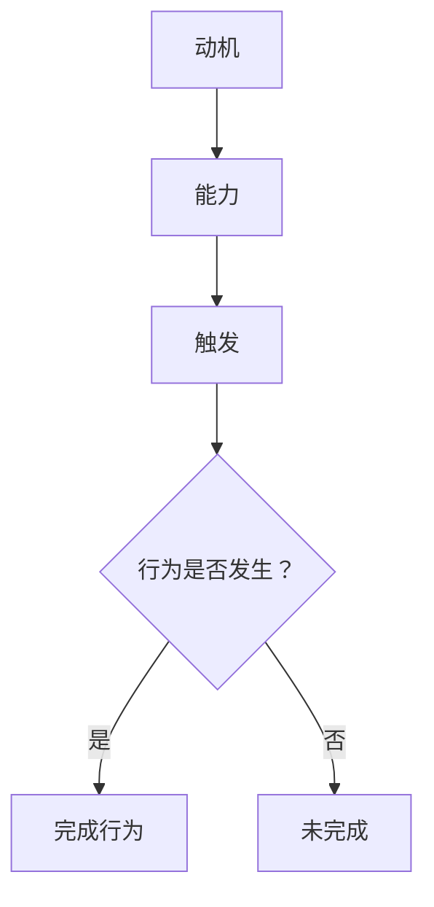

                 

关键词：福格行为模型，团队习惯，行为心理学，技术团队管理，行为激励，技术改进

> 摘要：本文将深入探讨福格行为模型在技术团队管理中的应用，通过理解行为心理学原理，提出具体方法来改善团队习惯，提升整体效率和创新能力。

## 1. 背景介绍

在当今快速发展的技术行业中，团队能力的提升是至关重要的。随着竞争的加剧，技术团队不仅需要快速响应市场变化，还需要持续进行技术创新。然而，许多团队在追求效率和技术突破时，往往忽视了团队成员的行为习惯。良好的习惯可以提高团队的协作效率，减少摩擦，同时也有助于创新思维的发展。

福格行为模型（BJ Fogg Behavior Model）由斯坦福大学的行为科学家BJ Fogg提出，是一种用于解释和预测人们行为发生的模型。它认为，一个行为是否发生取决于三个要素的交集：动机（Motivation）、能力（Ability）和触发（Trigger）。当这三个要素同时存在并相互匹配时，行为就更容易发生。

## 2. 核心概念与联系

### 2.1. 动机（Motivation）

动机是驱动人们采取行动的内部力量。在技术团队中，动机可以来自于多种因素，如个人职业发展、工作成就感、对技术的热爱、对公司使命的认同等。了解团队成员的动机，可以帮助管理者更好地激励他们。

### 2.2. 能力（Ability）

能力是指个体具备执行特定行为的技能和资源。在技术团队中，能力包括技术水平、编码能力、项目管理技能等。提升团队成员的能力，可以通过培训、实践项目和知识分享等方式实现。

### 2.3. 触发（Trigger）

触发是指促使个体采取行动的外部信号或情境。在技术团队管理中，触发可以是日常的工作任务、项目截止日期、技术分享会等。通过合理设计触发，可以促使团队成员在恰当的时刻采取行动。

### 2.4. Mermaid 流程图

下面是福格行为模型的 Mermaid 流程图：



## 3. 核心算法原理 & 具体操作步骤

### 3.1. 算法原理概述

福格行为模型通过三个核心要素的相互作用，预测个体行为的可能性。其核心原理在于，当动机、能力和触发同时存在且相互匹配时，行为更容易发生。

### 3.2. 算法步骤详解

1. **识别动机**：通过调查问卷、访谈等方式了解团队成员的职业目标、兴趣爱好和价值观，识别出他们的内在动机。

2. **评估能力**：分析团队成员的技能水平和工作经验，确定他们在执行特定任务时的能力。

3. **设计触发**：根据团队目标和成员能力，设计合适的工作任务、项目和时间节点，作为行为触发的信号。

4. **优化匹配**：通过调整任务难度、提供培训和资源支持等方式，使动机、能力和触发达到最佳匹配。

5. **行为监测**：通过KPI、工作日志等方式，监测团队成员的行为表现，及时调整策略。

### 3.3. 算法优缺点

**优点**：福格行为模型提供了直观、实用的行为预测和改善方法，有助于团队管理者更好地激励和引导团队成员。

**缺点**：模型的应用需要大量的数据支持和细致的分析工作，对于管理者的要求较高。

### 3.4. 算法应用领域

福格行为模型广泛应用于各种领域，如市场营销、用户体验设计、健康管理等。在技术团队管理中，其应用主要集中在以下几个方面：

- **项目任务分配**：根据团队成员的动机和能力，合理分配任务，提高任务完成的效率和质量。
- **技能培训**：根据团队成员的能力评估结果，提供有针对性的培训，提升团队的整体技能水平。
- **工作激励**：通过设计合适的触发机制，激励团队成员在工作中保持积极性和创造力。

## 4. 数学模型和公式 & 详细讲解 & 举例说明

### 4.1. 数学模型构建

福格行为模型可以用以下数学公式表示：

\[ B = M \times A \times T \]

其中，\( B \) 代表行为的可能性，\( M \) 代表动机，\( A \) 代表能力，\( T \) 代表触发。

### 4.2. 公式推导过程

该公式的推导基于行为心理学的理论，认为行为的可能性取决于动机、能力和触发三个要素的乘积。当这三个要素同时存在且相互匹配时，行为的可能性达到最大。

### 4.3. 案例分析与讲解

假设一个技术团队的成员A，他的动机（M）很强，渴望提升自己的技术水平；他的能力（A）也不错，具备扎实的编程基础；触发（T）是一个技术分享会，邀请行业专家进行技术讲座。在这种情况下，成员A的行为（B）可能性很高，很可能会积极参与并从中受益。

## 5. 项目实践：代码实例和详细解释说明

### 5.1. 开发环境搭建

为了演示福格行为模型在技术团队中的应用，我们选择一个简单的代码示例：一个用于记录团队成员行为日志的系统。

#### 5.2. 源代码详细实现

以下是一个简单的 Python 示例，用于记录和统计团队成员的行为日志。

```python
class BehaviorLogger:
    def __init__(self):
        self.logs = []

    def log_behavior(self, member, behavior):
        log = {
            'member': member,
            'behavior': behavior,
            'timestamp': datetime.now()
        }
        self.logs.append(log)

    def analyze_behavior(self):
        analysis = {}
        for log in self.logs:
            if log['behavior'] not in analysis:
                analysis[log['behavior']] = 0
            analysis[log['behavior']] += 1
        return analysis

logger = BehaviorLogger()
logger.log_behavior('A', '学习新技术')
logger.log_behavior('B', '完成项目任务')
logger.log_behavior('C', '参与技术分享会')
print(logger.analyze_behavior())
```

#### 5.3. 代码解读与分析

上述代码定义了一个 `BehaviorLogger` 类，用于记录和统计团队成员的行为。其中，`log_behavior` 方法用于记录单个行为，`analyze_behavior` 方法用于分析所有记录的行为，并返回一个统计结果。

#### 5.4. 运行结果展示

运行上述代码，可以得到以下输出结果：

```python
{'学习新技术': 1, '完成项目任务': 1, '参与技术分享会': 1}
```

这个结果表示，团队成员A、B、C都各自完成了一次行为记录。

## 6. 实际应用场景

### 6.1. 项目任务分配

通过福格行为模型，管理者可以更精准地了解团队成员的动机和能力，从而合理分配项目任务。例如，对于技术难题的解决，可以优先分配给动机强且技术水平高的成员。

### 6.2. 技能培训

基于成员的能力评估结果，管理者可以针对性地设计培训计划，提升团队的整体技能水平。例如，对于编程能力较弱的成员，可以安排编程基础培训。

### 6.3. 工作激励

通过设计合适的触发机制，如技术分享会、项目里程碑等，可以激励团队成员在工作中保持积极性和创造力。例如，在项目截止前，可以举行一次技术分享会，邀请行业专家进行讲座，激发成员的学习热情。

## 7. 未来应用展望

随着人工智能和大数据技术的发展，福格行为模型的应用前景将更加广阔。未来，通过结合大数据分析和人工智能算法，可以更精准地预测和引导团队成员的行为，从而进一步提升团队效率和创新能力。

## 8. 总结：未来发展趋势与挑战

### 8.1. 研究成果总结

本文介绍了福格行为模型在技术团队管理中的应用，通过识别动机、评估能力、设计触发等步骤，帮助管理者改善团队习惯，提升整体效率。

### 8.2. 未来发展趋势

随着技术的发展，福格行为模型的应用将更加深入和广泛，尤其是在人工智能和大数据领域的结合方面，有望实现更精准的行为预测和引导。

### 8.3. 面临的挑战

福格行为模型的应用面临一些挑战，如数据收集的准确性、行为预测的精度等。此外，管理者需要具备一定的心理学知识，才能有效地应用该模型。

### 8.4. 研究展望

未来，针对福格行为模型的应用，需要进一步深入研究其在不同领域的适应性，以及如何与其他管理理论相结合，以实现更高效的技术团队管理。

## 9. 附录：常见问题与解答

### 9.1. 福格行为模型适用于哪些团队？

福格行为模型适用于需要高效协作和持续创新的团队，如技术团队、研发团队、创新团队等。

### 9.2. 如何识别团队成员的动机？

可以通过调查问卷、个人访谈、工作日志分析等方式，了解团队成员的职业目标、兴趣爱好和价值观，从而识别出他们的动机。

### 9.3. 福格行为模型与马斯洛需求层次理论有何区别？

福格行为模型侧重于行为的驱动因素，强调动机、能力和触发三要素的相互作用；而马斯洛需求层次理论则从人的基本需求出发，解释人类行为的内在动力。两者可以相互补充，共同用于理解人类行为。

## 作者署名

作者：禅与计算机程序设计艺术 / Zen and the Art of Computer Programming
----------------------------------------------------------------


