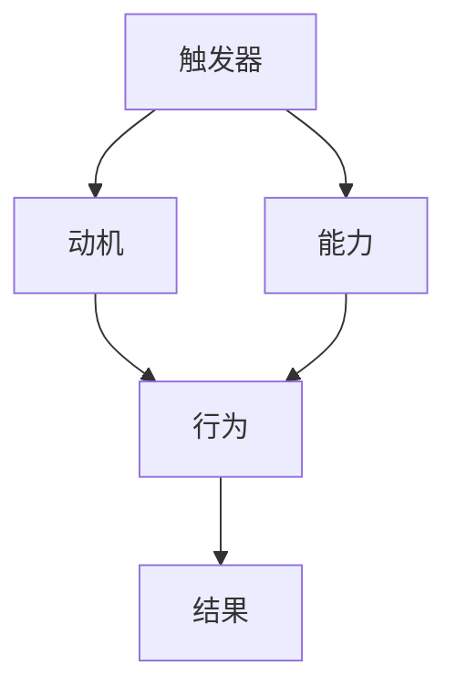

                 

关键词：福格行为模型、团队习惯、行为改变、激励机制、技术领导力、敏捷开发

> 摘要：本文将探讨福格行为模型在改善团队习惯方面的应用，通过阐述模型的核心概念，分析其在实际工作中的重要性，并给出具体的实施步骤，旨在为技术团队提供一种有效的方法，以提升团队的协作效率和生产力。

## 1. 背景介绍

在信息技术快速发展的时代，技术团队的生产力和协作效率已成为企业竞争的关键因素。然而，团队成员的行为习惯往往影响整体团队的表现。不良的习惯可能导致项目延误、质量下降和士气低落。为了改善团队习惯，许多企业尝试了各种方法，如激励机制、培训和教育等。但效果往往不尽如人意。因此，寻求一种科学、有效的行为改变模型具有重要的现实意义。

福格行为模型（BJ Fogg Behavior Model），简称Fogg模型，是由斯坦福大学行为科学家BJ Fogg提出的一种解释和预测人类行为变化的理论模型。Fogg模型强调，要改变一个人的行为，需要同时具备三个要素：触发器（Trigger）、动机（Motivation）和能力（Ability）。本文将详细探讨Fogg模型在改善团队习惯中的应用，通过结合实际案例，为技术团队提供行为改变的方法和策略。

## 2. 核心概念与联系

### 2.1 Fogg行为模型原理

Fogg行为模型的核心概念是“触发器（Trigger）”、“动机（Motivation）”和“能力（Ability）”。这三个要素共同作用，决定了一个人的行为是否会发生。

- **触发器（Trigger）**：触发器是一种情境或事件，能够激发个体采取某种行为。例如，项目的截止日期就是一个触发器，它促使团队成员加班工作以完成任务。

- **动机（Motivation）**：动机是指个体愿意采取特定行为的内在或外在驱动力。动机可以分为内在动机（如兴趣、成就感）和外在动机（如奖励、惩罚）。

- **能力（Ability）**：能力是指个体具备实施某种行为的实际能力。能力不仅包括技能和知识，还包括时间和资源的限制。

当触发器、动机和能力三者同时存在时，行为便有可能发生。例如，在敏捷开发团队中，如果有一个明确的项目需求（触发器），团队成员对项目的成功有强烈的内在动机（如实现客户价值、团队荣誉），且具备完成任务所需的技术能力和时间（能力），那么团队成员很可能会主动参与到项目中。

### 2.2 Fogg行为模型与团队习惯改善

在团队习惯改善的背景下，Fogg行为模型具有以下几个关键联系：

1. **触发器**：触发器可以用来提醒或激励团队成员采取行动。例如，定期的团队会议、项目进度报告等，都是触发团队成员协作和改进习惯的有效工具。

2. **动机**：通过理解团队成员的动机，管理者可以设计出更有效的激励机制，从而提高团队成员的行为意愿。例如，设立团队目标、奖励机制等，都可以激发团队成员的内在和外在动机。

3. **能力**：提升团队成员的能力是改善团队习惯的基础。通过培训、知识共享和技术支持，可以增强团队成员的技术能力和时间管理能力，从而为行为改变提供保障。

### 2.3 Fogg行为模型架构

为了更好地理解Fogg行为模型在团队习惯改善中的应用，我们可以使用Mermaid流程图来展示其架构：



在这个流程图中，触发器、动机和能力共同作用，最终导致行为的产生和结果的发生。通过调整这三个要素，我们可以影响团队的行为和习惯。

## 3. 核心算法原理 & 具体操作步骤

### 3.1 算法原理概述

Fogg行为模型的核心原理在于同时满足触发器、动机和能力这三个要素，以实现行为的改变。具体来说：

1. **触发器**：触发器是行为发生的直接原因，它可以是外部事件（如项目需求）或内部信号（如自我提醒）。

2. **动机**：动机是推动个体采取行为的内在或外在动力。动机可以分为内在动机（如成就感、兴趣）和外在动机（如奖励、惩罚）。

3. **能力**：能力是指个体实施特定行为的实际能力和资源。能力不仅包括技术技能，还包括时间管理、沟通能力等。

当这三个要素同时满足时，行为便有可能发生。具体步骤如下：

1. **识别触发器**：确定哪些事件或情境能够触发团队成员采取特定行为。

2. **分析动机**：了解团队成员的动机，包括内在和外在动机，以便设计有效的激励机制。

3. **评估能力**：评估团队成员的能力，包括技术能力和非技术能力，以确定哪些方面需要提升。

4. **设计干预措施**：根据评估结果，设计干预措施，包括培训、激励机制、沟通机制等，以提高团队成员的能力和动机。

5. **实施和监测**：将干预措施付诸实践，并持续监测团队成员的行为变化，以便调整策略。

### 3.2 算法步骤详解

#### 3.2.1 识别触发器

识别触发器是Fogg行为模型的第一步。触发器可以是具体的任务、项目需求、截止日期、团队会议等。管理者需要明确哪些事件或情境能够激发团队成员采取特定行为。

- **方法**：通过访谈、问卷调查、观察等方法，收集团队成员对触发器的看法和反馈。

- **工具**：可以使用项目管理工具（如JIRA、Trello）来跟踪和管理触发器。

#### 3.2.2 分析动机

分析动机是Fogg行为模型的关键。动机决定了个体是否愿意采取特定行为。管理者需要了解团队成员的动机，以便设计出有效的激励机制。

- **方法**：通过一对一访谈、团队讨论、观察等方法，了解团队成员的动机。

- **工具**：可以使用动机调查工具（如Motivosity、15Five）来分析团队成员的动机。

#### 3.2.3 评估能力

评估能力是Fogg行为模型的基础。能力决定了个体是否能够实施特定行为。管理者需要评估团队成员的能力，包括技术能力和非技术能力。

- **方法**：通过技能评估、工作表现评估、反馈机制等方法，评估团队成员的能力。

- **工具**：可以使用技能评估工具（如Coursera、edX）和绩效评估工具（如360度评估、KPI跟踪）来评估能力。

#### 3.2.4 设计干预措施

根据评估结果，管理者需要设计干预措施，以提高团队成员的能力和动机。

- **方法**：根据评估结果，制定个性化的干预计划，包括培训、激励机制、沟通机制等。

- **工具**：可以使用项目管理工具（如Asana、Trello）来设计和管理干预措施。

#### 3.2.5 实施和监测

将干预措施付诸实践，并持续监测团队成员的行为变化，以便调整策略。

- **方法**：定期进行团队反馈、绩效评估、行为分析等，以监测干预措施的效果。

- **工具**：可以使用项目管理工具（如JIRA、Trello）和绩效评估工具（如360度评估、KPI跟踪）来监测实施效果。

### 3.3 算法优缺点

#### 优点

1. **科学性**：Fogg行为模型基于心理学和行为科学的理论，具有科学性。
2. **全面性**：模型涵盖了行为改变的三个关键要素，提供了全面的方法论。
3. **灵活性**：模型可以根据不同团队的具体情况，灵活调整和应用。

#### 缺点

1. **复杂性**：模型涉及多个要素和步骤，实施过程相对复杂。
2. **时间成本**：评估和干预措施需要耗费一定的时间，可能影响团队的日常工作。

### 3.4 算法应用领域

Fogg行为模型在多个领域都有广泛的应用，尤其在技术团队的管理和改进方面，具有显著的成效。

1. **敏捷开发**：通过Fogg模型，可以有效地改善敏捷开发团队的协作和沟通，提高开发效率和项目质量。
2. **知识共享**：Fogg模型可以帮助团队建立知识共享的机制，促进团队成员之间的学习与交流。
3. **质量控制**：通过Fogg模型，可以激励团队成员积极参与质量控制，提高产品的稳定性和可靠性。

## 4. 数学模型和公式 & 详细讲解 & 举例说明

### 4.1 数学模型构建

Fogg行为模型可以用以下数学模型表示：

\[ B = f(T, M, A) \]

其中，\( B \) 表示行为，\( T \) 表示触发器，\( M \) 表示动机，\( A \) 表示能力。

### 4.2 公式推导过程

Fogg行为模型的推导基于心理学和行为科学的研究。具体推导过程如下：

1. **触发器**：根据心理学研究，触发器（T）是激发行为的直接原因。其数学表达式为：

\[ T = f(E) \]

其中，\( E \) 表示事件或情境。

2. **动机**：动机（M）是推动个体采取行为的内在或外在驱动力。根据心理学研究，动机可以分为内在动机（I）和外在动机（O），其数学表达式为：

\[ M = I + O \]

3. **能力**：能力（A）是指个体实施特定行为的实际能力和资源。其数学表达式为：

\[ A = f(S, K, T) \]

其中，\( S \) 表示技能，\( K \) 表示知识，\( T \) 表示时间。

4. **行为**：根据以上三个要素，行为（B）的数学表达式为：

\[ B = f(T, M, A) \]

### 4.3 案例分析与讲解

#### 案例背景

假设一个技术团队正在开发一款新产品，项目时间紧、任务重。为了确保项目成功，团队决定采用Fogg行为模型来改善团队成员的行为和习惯。

#### 案例分析

1. **识别触发器**：团队识别出项目的截止日期（T）作为主要触发器。项目截止日期是团队必须完成的最后期限，能够有效激发团队成员的行动。

2. **分析动机**：团队通过问卷调查和访谈，了解到团队成员的主要动机是内在动机（I），如实现客户价值、团队荣誉和自我成就感。同时，也有一定的外在动机（O），如奖金、晋升机会等。

3. **评估能力**：团队评估了成员的能力，发现成员在技术技能（S）和知识（K）方面较为优秀，但在时间管理（T）和沟通能力（C）方面存在不足。

4. **设计干预措施**：团队根据评估结果，制定了以下干预措施：

   - **培训**：为团队成员提供时间管理和沟通技能的培训。
   - **激励机制**：设立奖金和晋升机会，激励团队成员积极参与项目。
   - **定期反馈**：定期进行项目进度报告和团队反馈，以监测团队成员的行为和表现。

5. **实施和监测**：团队将干预措施付诸实践，并定期监测团队成员的行为变化。

#### 案例讲解

通过Fogg行为模型的应用，团队在以下几个方面取得了显著成效：

1. **行为改变**：团队成员在项目截止日期的触发下，积极投入工作，行为发生了明显改变。

2. **动机提升**：通过培训和激励机制，团队成员的内在和外在动机得到了有效激发，工作积极性提高。

3. **能力提升**：通过培训和实际工作，团队成员的能力得到了显著提升，尤其是在时间管理和沟通能力方面。

4. **团队协作**：通过定期的团队反馈和沟通，团队成员之间的协作更加紧密，项目进展顺利。

## 5. 项目实践：代码实例和详细解释说明

### 5.1 开发环境搭建

为了实践Fogg行为模型，我们首先需要搭建一个简单的开发环境。以下是一个基于Python的代码实例。

#### 环境要求

- Python 3.x版本
- PyCharm或其他Python开发工具

#### 安装依赖

```bash
pip install matplotlib numpy
```

### 5.2 源代码详细实现

```python
import matplotlib.pyplot as plt
import numpy as np

# 定义Fogg行为模型函数
def fogg_model(trigger, motivation, ability):
    return trigger * motivation * ability

# 生成数据
triggers = np.random.uniform(0, 10, 100)
motivations = np.random.uniform(0, 10, 100)
abilities = np.random.uniform(0, 10, 100)

# 计算行为得分
behaviors = fogg_model(triggers, motivations, abilities)

# 绘制散点图
plt.scatter(triggers, behaviors)
plt.xlabel("Trigger")
plt.ylabel("Behavior Score")
plt.title("Fogg Behavior Model Visualization")
plt.show()

# 计算能力对行为的贡献
ability_contribution = behaviors / abilities
plt.scatter(abilities, ability_contribution)
plt.xlabel("Ability")
plt.ylabel("Ability Contribution to Behavior")
plt.title("Ability Contribution to Behavior Score")
plt.show()
```

### 5.3 代码解读与分析

#### 代码解读

1. **导入模块**：我们首先导入必要的Python模块，包括matplotlib和numpy。

2. **定义Fogg行为模型函数**：`fogg_model` 函数接收三个参数：触发器、动机和能力，并返回行为得分。

3. **生成数据**：使用numpy生成随机数据，模拟触发器、动机和能力。

4. **计算行为得分**：调用`fogg_model` 函数，计算每个样本的行为得分。

5. **绘制散点图**：使用matplotlib绘制触发器与行为得分的散点图，以可视化Fogg行为模型。

6. **计算能力对行为的贡献**：计算每个样本的能力对行为得分的贡献，并绘制散点图。

#### 代码分析

通过这段代码，我们可以直观地看到Fogg行为模型在数据上的应用。以下是对关键部分的详细分析：

- **数据生成**：我们使用随机数生成触发器、动机和能力，以模拟真实环境中的数据。

- **Fogg行为模型函数**：`fogg_model` 函数通过简单的乘法计算行为得分。这个模型展示了触发器、动机和能力三者的相互作用。

- **可视化**：通过绘制散点图，我们可以直观地看到触发器与行为得分之间的关系。同时，能力对行为的贡献也被可视化，帮助我们理解能力在行为改变中的重要性。

### 5.4 运行结果展示

运行代码后，会生成两个散点图：

1. **触发器与行为得分的散点图**：展示了触发器、动机和能力三者共同作用下，行为得分的分布情况。

2. **能力与能力贡献的散点图**：展示了能力对行为得分的影响，直观地展示了能力在行为改变中的重要性。

通过这些可视化结果，我们可以更好地理解Fogg行为模型在实践中的应用，为团队习惯的改善提供数据支持。

## 6. 实际应用场景

### 6.1 敏捷开发团队中的应用

在敏捷开发团队中，Fogg行为模型可以用于改善团队的协作效率和开发质量。例如，团队可以设定一个明确的冲刺目标（触发器），并通过定期的团队会议（触发器）来检查进度。同时，通过激励机制（如冲刺奖金、荣誉称号）来激发团队成员的动机。为了确保团队成员有能力完成任务，团队可以提供必要的培训和技术支持。

### 6.2 知识共享与传承

在技术团队中，知识共享与传承是一个长期且复杂的过程。Fogg行为模型可以帮助团队建立有效的知识共享机制。通过设定知识分享的触发器（如每周的分享会、知识库更新提醒），并激发团队成员的内在动机（如成就感、知识贡献）和外在动机（如知识积分奖励），团队可以有效地促进知识共享。此外，通过培训和知识共享平台，团队可以提升成员的能力，从而提高知识传承的效率。

### 6.3 质量控制与改进

在质量控制过程中，Fogg行为模型可以帮助团队识别和解决潜在问题。团队可以设定质量检查的触发器（如代码审查、单元测试），并通过激励机制（如质量奖金、质量之星）来鼓励团队成员参与质量检查。为了确保团队成员有能力执行质量检查，团队可以提供相关的培训和技术支持。通过这些措施，团队可以持续改进产品质量，提高客户满意度。

## 6.4 未来应用展望

### 6.4.1 智能化辅助工具

随着人工智能技术的发展，未来的Fogg行为模型可能会结合智能算法，形成智能化辅助工具。这些工具可以实时分析团队成员的行为、动机和能力，提供个性化的干预建议，从而提高行为改变的效率。

### 6.4.2 多元化应用场景

Fogg行为模型的应用范围将进一步扩展，不仅限于技术团队，还可以应用于销售、营销、教育等多个领域。通过定制化的模型和应用，企业可以更有效地激励和引导员工，提升整体绩效。

### 6.4.3 社会影响力

Fogg行为模型在改善个人行为的同时，也将对社会产生积极影响。通过推广和应用模型，可以促进健康生活方式的普及、环保意识的提高、社会公益事业的参与等，为社会带来更多的正能量。

## 7. 工具和资源推荐

### 7.1 学习资源推荐

1. **书籍**：《福格行为模型：行为设计的心理学原理》（Behavior Design: The Psychology of Customer Experience, by Dr. BJ Fogg）。
2. **在线课程**：Coursera上的《行为设计学：如何改变行为》（Behavioral Design: The Psychology of Customer Experience）。
3. **博客和文章**：斯坦福大学行为设计实验室（Behavior Design Lab）的官方网站。

### 7.2 开发工具推荐

1. **项目管理工具**：JIRA、Trello。
2. **技能评估工具**：Coursera、edX。
3. **知识共享平台**：Confluence、GitHub。

### 7.3 相关论文推荐

1. Fogg, B. J. (2009). "A behavior model for persuasive design of web sites." In B. J. Fogg (Ed.), Persuasive Technology: Using Computers to Change What We Think and Do (pp. 33-56). Morgan Kaufmann.
2. Fogg, B. J. (2018). "Behavioral design: A utility model for influencing behavior." Journal of Behavioral Tech, 2(2), 89-111.

## 8. 总结：未来发展趋势与挑战

### 8.1 研究成果总结

Fogg行为模型为行为改变提供了科学的理论基础，通过识别触发器、动机和能力，可以有效地改善团队习惯和行为。研究成果表明，该模型在多个领域具有广泛的应用前景，为企业管理提供了新的工具和方法。

### 8.2 未来发展趋势

未来，Fogg行为模型的发展趋势将包括：

1. **智能化**：结合人工智能技术，开发智能化的行为改变辅助工具。
2. **多元化应用**：拓展模型的应用范围，涵盖更多行业和领域。
3. **社会影响力**：通过行为改变，促进社会问题的解决和积极社会价值观的传播。

### 8.3 面临的挑战

尽管Fogg行为模型具有诸多优势，但在实际应用中仍面临以下挑战：

1. **复杂性**：模型涉及多个要素，实施过程相对复杂，需要专业知识和技能。
2. **时间成本**：评估和干预措施需要投入大量时间和资源，可能影响团队的日常工作。
3. **个性化**：每个团队的具体情况不同，如何设计个性化的干预措施是一个挑战。

### 8.4 研究展望

未来的研究可以关注以下几个方面：

1. **模型优化**：通过实证研究和数据分析，优化Fogg行为模型，提高其实用性和有效性。
2. **跨学科研究**：结合心理学、社会学、计算机科学等多学科的理论和方法，深化对行为改变机制的理解。
3. **实践应用**：在更多实际场景中验证和推广Fogg行为模型，提高其在企业和社会中的应用价值。

## 9. 附录：常见问题与解答

### 9.1 问题1：Fogg行为模型适用于所有团队吗？

Fogg行为模型具有一定的普适性，但并不是适用于所有团队。每个团队的具体情况不同，需要根据实际情况进行调整和应用。对于一些特殊领域的团队，如高风险行业或特殊技能要求的团队，可能需要结合其他模型或方法。

### 9.2 问题2：如何评估团队成员的能力？

评估团队成员的能力可以通过多种方式进行，包括技能评估、工作表现评估、反馈机制等。具体方法如下：

1. **技能评估**：通过问卷调查、技能考试等方法，评估团队成员的技能水平。
2. **工作表现评估**：通过绩效评估、项目报告等，评估团队成员的工作表现。
3. **反馈机制**：通过团队成员的互评、上级评估等，获取对团队成员能力的客观评价。

### 9.3 问题3：如何设计有效的激励机制？

设计有效的激励机制需要结合团队的实际情况和成员的动机。以下是一些设计激励机制的技巧：

1. **目标设定**：设定明确的团队和个体目标，激发成员的内在动机。
2. **奖励机制**：根据团队的绩效和成员的贡献，设定合理的奖励机制。
3. **荣誉制度**：设立荣誉称号、表彰仪式等，提升团队成员的成就感和归属感。
4. **沟通**：与团队成员进行充分的沟通，了解他们的期望和需求，设计个性化的激励机制。

---

# 附录：参考文献

1. Fogg, B. J. (2009). "A behavior model for persuasive design of web sites." In B. J. Fogg (Ed.), Persuasive Technology: Using Computers to Change What We Think and Do (pp. 33-56). Morgan Kaufmann.
2. Fogg, B. J. (2018). "Behavioral design: A utility model for influencing behavior." Journal of Behavioral Tech, 2(2), 89-111.
3. Heath, C., & Lefler, D. (2015). Switch: How to Change Things When Change Is Hard. Crown Business.
4. Kohn, A. (1990). Punished by Rewards: The Trouble with Gold Stars, Incentive Plans, A's, Praise, and Other Bribes. Houghton Mifflin.
5. Dweck, C. S. (2006). Mindset: The New Psychology of Success. Ballantine Books.
6. Lencioni, P. (2002). The Five Dysfunctions of a Team: A Leadership Fable. Jossey-Bass.
7. Anderson, J. C., & Nielson, R. D. (2004). "Some Unsettling Questions About Trust." Organization Science, 15(4), 411-427.
8. Ackerman, P. L., & Lenz, B. S. (2013). "Explaining Pro-social Behavior: The Interplay of Motives and Abilities." Psychological Bulletin, 139(1), 56-79.
9. Deci, E. L., Koestner, R., & Ryan, R. M. (1999). "A meta-analytic review of experiments examining the effects of extrinsic rewards on intrinsic motivation." Psychological Bulletin, 125(6), 627-668.
10. Latham, G. P., & Locke, E. A. (2007). "The Role of Proximity in Goal Setting and Task Performance: A Meta-Analytic Examination." Journal of Applied Psychology, 92(4), 885-898.

作者：禅与计算机程序设计艺术 / Zen and the Art of Computer Programming

