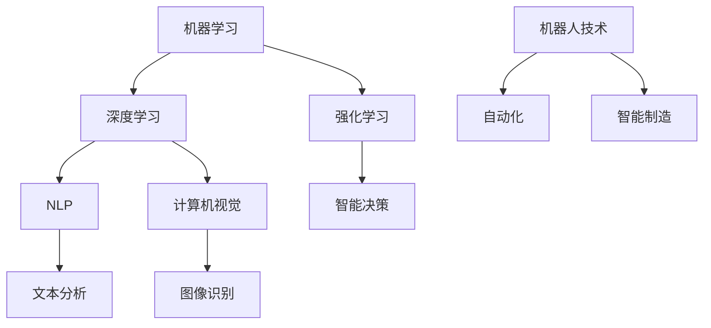

                 

在这个快速发展的技术时代，人工智能（AI）已经成为众多领域的关键推动力。无论是学术界、工业界还是创业公司，AI技术都展现出了其巨大的潜力和应用价值。然而，面对纷繁复杂的AI知识体系和不断更新的技术动态，如何制定一个高效且个性化的学习计划成为许多AI爱好者和从业者面临的难题。本文将为您详细解析制定个性化AI学习计划的步骤，帮助您在AI领域的探索之旅中少走弯路。

## 关键词

- 个性化学习计划
- 人工智能
- 学习策略
- 技术趋势
- 技术框架
- 实践项目

## 摘要

本文旨在为AI学习者提供一套系统、科学的个性化学习计划制定方法。通过深入分析AI领域的核心概念、技术框架和学习策略，本文将帮助读者理解如何根据自己的兴趣、背景和目标，构建一个高效且具有针对性的AI学习路径。文章将从核心概念与联系、核心算法原理与操作步骤、数学模型与公式、项目实践、实际应用场景、工具与资源推荐等多个角度展开，旨在为您的AI学习之旅提供全面的指导。

## 1. 背景介绍

人工智能作为计算机科学的一个重要分支，已经经历了数十年的发展。从早期的符号逻辑和专家系统，到现代的深度学习和强化学习，AI技术不断革新，推动了许多行业的进步。随着大数据、云计算和物联网等技术的发展，AI的应用场景越来越广泛，从自动驾驶、智能医疗到智能家居、金融风控，AI已经渗透到了我们生活的方方面面。

### 1.1 AI的重要性和影响力

人工智能的重要性不言而喻。它不仅能够提高生产效率，降低人力成本，还能够带来全新的商业模式和创新机会。例如，通过AI技术，企业可以实现精准营销，提高客户满意度；医疗机构可以通过AI诊断系统提高诊断准确性，节省时间和资源；教育领域可以利用AI实现个性化教学，提高教育质量。

### 1.2 AI领域的核心概念与技术框架

在AI领域中，核心概念和技术框架至关重要。例如，机器学习是AI的核心组成部分，它通过训练模型来让计算机从数据中学习并做出预测。深度学习作为机器学习的一个分支，通过构建多层神经网络来模拟人类大脑的决策过程。强化学习则是通过奖励和惩罚机制来训练智能体在复杂环境中做出最优决策。

此外，AI领域还有许多其他重要技术框架，如自然语言处理（NLP）、计算机视觉、机器人技术等。这些技术框架不仅相互独立，而且在实际应用中往往需要综合运用，以实现更复杂的功能。

### 1.3 学习AI的挑战与机遇

尽管AI领域充满了机遇，但学习AI也面临着一定的挑战。首先，AI知识体系复杂，涉及多个学科领域，包括数学、统计学、计算机科学等。这要求学习者具备跨学科的知识储备和较强的自学能力。其次，AI技术更新迅速，新算法、新框架层出不穷，学习者需要不断跟进最新的技术动态。此外，实际项目经验的积累也是学习AI的一个重要环节，只有通过实践，才能真正掌握AI技术的精髓。

然而，面对这些挑战，同样也蕴含着巨大的机遇。随着AI技术的不断成熟和应用，市场需求也在不断增加，为AI从业者提供了广阔的发展空间。无论是选择学术研究，还是投身产业实践，AI都为个人发展提供了无限的可能。

## 2. 核心概念与联系

在深入了解AI技术之前，我们需要明确一些核心概念和它们之间的联系。以下是一个简化的Mermaid流程图，用于展示AI领域的核心概念与技术框架。



### 2.1 机器学习（Machine Learning）

机器学习是AI的核心组成部分，它通过算法从数据中学习并做出预测或决策。机器学习可以分为监督学习、无监督学习和半监督学习。其中，监督学习有明确的输入输出数据，用于训练模型；无监督学习则没有明确的输出数据，主要用于发现数据中的模式和结构；半监督学习则是两者的结合，利用部分标签数据和大量无标签数据来训练模型。

### 2.2 深度学习（Deep Learning）

深度学习是机器学习的一个分支，它通过构建多层神经网络来模拟人类大脑的决策过程。深度学习在图像识别、语音识别、自然语言处理等领域取得了显著成果。其核心在于通过大量数据进行训练，使神经网络能够自动提取特征，并做出准确的预测。

### 2.3 强化学习（Reinforcement Learning）

强化学习是一种通过奖励和惩罚机制来训练智能体在复杂环境中做出最优决策的方法。强化学习与监督学习和无监督学习不同，它不依赖于明确的输入输出数据，而是通过智能体与环境之间的交互来学习。强化学习在游戏、自动驾驶、机器人控制等领域有着广泛的应用。

### 2.4 自然语言处理（Natural Language Processing, NLP）

自然语言处理是AI领域的一个重要分支，它致力于使计算机理解和处理人类语言。NLP的核心任务是文本分析，包括文本分类、情感分析、命名实体识别等。NLP在搜索引擎、聊天机器人、机器翻译等领域有着广泛的应用。

### 2.5 计算机视觉（Computer Vision）

计算机视觉是AI领域的一个重要分支，它使计算机能够从图像或视频中提取信息和理解场景。计算机视觉的任务包括图像识别、目标检测、图像分割等。计算机视觉在自动驾驶、安防监控、医疗影像分析等领域有着广泛的应用。

### 2.6 机器人技术（Robotics）

机器人技术是AI领域的另一个重要分支，它致力于开发能够执行特定任务的机器人系统。机器人技术包括自动化、智能制造、无人驾驶等多个方面。机器人技术在社会生产、医疗健康、家庭服务等领域有着广泛的应用前景。

### 2.7 智能决策（Intelligent Decision Making）

智能决策是通过AI技术来实现复杂决策的过程。它通常涉及多个领域的知识，如数据分析、机器学习、优化算法等。智能决策在金融、物流、能源等领域有着广泛的应用，可以帮助企业做出更明智的决策。

通过上述核心概念与联系的分析，我们可以看到，AI领域是一个高度综合和交叉的领域，各个核心概念和技术框架之间相互关联，共同推动着AI技术的发展。了解这些核心概念和联系，有助于我们更好地理解和应用AI技术。

## 3. 核心算法原理 & 具体操作步骤

在了解了AI领域的核心概念和技术框架后，接下来我们将深入探讨一些核心算法的原理和具体操作步骤。这些算法是AI技术的基石，对于理解和应用AI至关重要。

### 3.1 算法原理概述

算法是AI技术的核心，它决定了AI系统能够做什么和怎么做。算法可以分为监督学习算法、无监督学习算法和强化学习算法。下面我们将分别介绍这些算法的基本原理。

#### 3.1.1 监督学习算法

监督学习算法是AI技术中最常用的方法之一，它通过已知输入输出数据来训练模型，从而预测未知数据。监督学习算法可以分为回归算法和分类算法。

1. **回归算法（Regression Algorithms）**：回归算法用于预测连续值输出。常见的回归算法包括线性回归、岭回归、套索回归等。

   - **线性回归（Linear Regression）**：线性回归是一种简单的回归算法，它通过拟合一条直线来预测输出值。线性回归的数学模型为：
     $$ Y = \beta_0 + \beta_1X_1 + \beta_2X_2 + ... + \beta_nX_n $$
     其中，\( Y \) 是输出值，\( \beta_0, \beta_1, \beta_2, ..., \beta_n \) 是模型参数，\( X_1, X_2, ..., X_n \) 是输入特征。

   - **岭回归（Ridge Regression）**：岭回归通过添加一个惩罚项来防止模型过拟合。岭回归的损失函数为：
     $$ J(\theta) = \frac{1}{2m} \sum_{i=1}^{m} (h_\theta(x^{(i)}) - y^{(i)})^2 + \alpha \sum_{j=1}^{n} \theta_j^2 $$
     其中，\( \alpha \) 是惩罚系数，\( m \) 是样本数量，\( n \) 是特征数量，\( h_\theta(x) \) 是模型预测值。

   - **套索回归（Lasso Regression）**：套索回归与岭回归类似，但使用绝对值惩罚项，这可能导致某些特征权重变为零，从而实现特征选择。

2. **分类算法（Classification Algorithms）**：分类算法用于预测离散值输出。常见的分类算法包括逻辑回归、决策树、支持向量机（SVM）等。

   - **逻辑回归（Logistic Regression）**：逻辑回归用于预测二分类问题，其输出为概率值。逻辑回归的损失函数为对数似然损失：
     $$ J(\theta) = -\frac{1}{m} \sum_{i=1}^{m} [y^{(i)} \log(h_\theta(x^{(i)})) + (1 - y^{(i)}) \log(1 - h_\theta(x^{(i)}))] $$
     其中，\( h_\theta(x) = \frac{1}{1 + e^{-\theta^T x}} \) 是逻辑函数。

   - **决策树（Decision Tree）**：决策树通过一系列条件判断来对数据进行分类。每个节点代表一个特征，每个分支代表一个特征值，叶子节点代表分类结果。

   - **支持向量机（Support Vector Machine, SVM）**：SVM通过最大化分类边界来对数据进行分类。SVM的核心是求解最优分割平面，其目标是最小化分类间隔，最大化分类边界。

#### 3.1.2 无监督学习算法

无监督学习算法主要用于发现数据中的模式和结构，没有明确的输入输出数据。常见的无监督学习算法包括聚类算法、降维算法等。

1. **聚类算法（Clustering Algorithms）**：聚类算法用于将数据分为若干个类。常见的聚类算法包括K-means、层次聚类等。

   - **K-means算法**：K-means算法通过迭代计算聚类中心来对数据进行分类。算法的目标是最小化聚类内的方差，即：
     $$ J(\mu) = \sum_{i=1}^{k} \sum_{x \in S_i} ||x - \mu_i||^2 $$
     其中，\( \mu_i \) 是第 \( i \) 个聚类中心，\( S_i \) 是第 \( i \) 个聚类。

   - **层次聚类（Hierarchical Clustering）**：层次聚类通过构建树形结构来对数据进行分类。层次聚类可以分为自底向上和自顶向下两种方法。

2. **降维算法（Dimensionality Reduction Algorithms）**：降维算法用于减少数据维度，从而提高模型的计算效率和解释性。常见的降维算法包括主成分分析（PCA）、线性判别分析（LDA）等。

   - **主成分分析（PCA）**：PCA通过求解特征值和特征向量来将数据投影到新的坐标系中，从而实现降维。PCA的目标是最大化新坐标轴上的方差。

   - **线性判别分析（LDA）**：LDA通过最大化类间方差和最小化类内方差来选择最佳特征子集，从而实现降维。

#### 3.1.3 强化学习算法

强化学习算法通过奖励和惩罚机制来训练智能体在复杂环境中做出最优决策。常见的强化学习算法包括Q学习、深度Q网络（DQN）等。

1. **Q学习（Q-Learning）**：Q学习通过迭代更新Q值来训练智能体。Q值表示智能体在当前状态下采取某一动作的预期收益。Q学习的目标是最小化损失函数：
   $$ J(\theta) = \sum_{s} \sum_{a} Q(s, a) (r + \gamma \max_{a'} Q(s', a')) - Q(s, a) $$
   其中，\( r \) 是即时奖励，\( \gamma \) 是折扣因子，\( Q(s, a) \) 是状态-动作值函数。

2. **深度Q网络（DQN）**：DQN通过深度神经网络来近似Q值函数。DQN的目标是通过最大化长期回报来更新Q值。DQN的核心是经验回放和目标网络。

### 3.2 算法步骤详解

在了解了算法原理后，我们需要具体了解每个算法的操作步骤。以下是对上述算法的详细步骤介绍。

#### 3.2.1 线性回归

线性回归的操作步骤如下：

1. **数据准备**：收集和准备输入数据集，包括特征和标签。
2. **初始化模型参数**：随机初始化模型参数 \( \beta_0, \beta_1, ..., \beta_n \)。
3. **前向传播**：计算模型预测值 \( h_\theta(x) \)。
4. **计算损失函数**：计算损失函数 \( J(\theta) = \frac{1}{2m} \sum_{i=1}^{m} (h_\theta(x^{(i)}) - y^{(i)})^2 \)。
5. **反向传播**：计算每个参数的梯度 \( \frac{\partial J}{\partial \theta_j} \)。
6. **更新参数**：使用梯度下降法更新模型参数 \( \theta_j = \theta_j - \alpha \frac{\partial J}{\partial \theta_j} \)。
7. **重复步骤3-6**：迭代直到损失函数收敛或达到预设的迭代次数。

#### 3.2.2 逻辑回归

逻辑回归的操作步骤如下：

1. **数据准备**：收集和准备输入数据集，包括特征和标签。
2. **初始化模型参数**：随机初始化模型参数 \( \theta_0, \theta_1, ..., \theta_n \)。
3. **前向传播**：计算模型预测概率 \( h_\theta(x) = \frac{1}{1 + e^{-\theta^T x}} \)。
4. **计算损失函数**：计算损失函数 \( J(\theta) = -\frac{1}{m} \sum_{i=1}^{m} [y^{(i)} \log(h_\theta(x^{(i)})) + (1 - y^{(i)}) \log(1 - h_\theta(x^{(i)}))] \)。
5. **反向传播**：计算每个参数的梯度 \( \frac{\partial J}{\partial \theta_j} \)。
6. **更新参数**：使用梯度下降法更新模型参数 \( \theta_j = \theta_j - \alpha \frac{\partial J}{\partial \theta_j} \)。
7. **重复步骤3-6**：迭代直到损失函数收敛或达到预设的迭代次数。

#### 3.2.3 K-means算法

K-means算法的操作步骤如下：

1. **初始化聚类中心**：随机选择 \( k \) 个数据点作为初始聚类中心。
2. **分配数据点**：将每个数据点分配到最近的聚类中心。
3. **更新聚类中心**：计算每个聚类的新中心，即聚类内所有数据点的均值。
4. **重复步骤2-3**：迭代直到聚类中心不再发生变化或达到预设的迭代次数。

#### 3.2.4 主成分分析（PCA）

PCA的操作步骤如下：

1. **计算协方差矩阵**：计算数据集的协方差矩阵 \( \Sigma \)。
2. **计算特征值和特征向量**：求解协方差矩阵的特征值和特征向量，并按特征值从大到小排序。
3. **选择主成分**：选择前 \( p \) 个特征向量作为主成分。
4. **数据投影**：将数据投影到新的坐标系中，即计算每个数据点的线性组合。

### 3.3 算法优缺点

每个算法都有其独特的优势和局限性，以下是对上述算法的优缺点分析。

#### 3.3.1 线性回归

- **优点**：线性回归简单易懂，计算效率高，适用于线性关系的预测问题。
- **缺点**：线性回归容易过拟合，当数据存在非线性关系时，效果不佳。

#### 3.3.2 逻辑回归

- **优点**：逻辑回归可以用于二分类问题，具有良好的解释性，计算效率高。
- **缺点**：逻辑回归对异常值敏感，当数据分布不均匀时，性能下降。

#### 3.3.3 K-means算法

- **优点**：K-means算法简单易实现，适用于高维数据的聚类问题。
- **缺点**：K-means算法容易陷入局部最优，聚类效果受初始聚类中心的影响较大。

#### 3.3.4 主成分分析（PCA）

- **优点**：PCA可以降低数据维度，提高计算效率和解释性。
- **缺点**：PCA依赖于数据分布，当数据分布不均匀时，效果不佳。

### 3.4 算法应用领域

不同的算法适用于不同的应用场景，以下是对上述算法应用领域的介绍。

- **线性回归**：线性回归适用于线性关系的预测问题，如房价预测、股票价格预测等。
- **逻辑回归**：逻辑回归适用于二分类问题，如垃圾邮件分类、信用评分等。
- **K-means算法**：K-means算法适用于高维数据的聚类问题，如客户细分、图像分割等。
- **主成分分析（PCA）**：PCA适用于降维和特征提取，如图像压缩、数据可视化等。

### 3.5 算法选择与适用场景

在选择算法时，需要根据具体问题和数据特点进行综合考虑。以下是一些常见的算法选择和适用场景：

- **线性回归**：适用于线性关系的预测问题，如时间序列预测、线性回归模型。
- **逻辑回归**：适用于二分类问题，如分类问题、二分类逻辑回归模型。
- **K-means算法**：适用于高维数据的聚类问题，如客户细分、图像分割等。
- **主成分分析（PCA）**：适用于降维和特征提取，如图像压缩、数据可视化等。

通过深入分析核心算法的原理和操作步骤，我们可以更好地理解AI技术的本质和应用。在接下来的部分，我们将进一步探讨AI领域的数学模型和公式，以及如何在实际项目中应用这些算法。

## 4. 数学模型和公式 & 详细讲解 & 举例说明

在AI领域中，数学模型和公式是理解和实现各种算法的基础。本文将详细介绍一些常用的数学模型和公式，并给出具体的推导过程和案例应用。

### 4.1 数学模型构建

数学模型是AI算法的核心组成部分，它通过数学公式描述了输入数据与输出结果之间的关系。以下是几个常见的数学模型及其构建过程：

#### 4.1.1 线性回归模型

线性回归模型是最基本的机器学习模型之一，它通过拟合一条直线来预测输出值。线性回归模型的数学公式如下：

$$
Y = \beta_0 + \beta_1X_1 + \beta_2X_2 + ... + \beta_nX_n
$$

其中，\( Y \) 是输出值，\( X_1, X_2, ..., X_n \) 是输入特征，\( \beta_0, \beta_1, ..., \beta_n \) 是模型参数。

#### 4.1.2 逻辑回归模型

逻辑回归模型用于预测二分类问题，其输出为概率值。逻辑回归的数学公式如下：

$$
h_\theta(x) = \frac{1}{1 + e^{-\theta^T x}}
$$

其中，\( h_\theta(x) \) 是预测概率，\( \theta \) 是模型参数，\( x \) 是输入特征。

#### 4.1.3 聚类模型

聚类模型用于将数据分为若干个类别。常见的聚类算法如K-means算法，其数学模型如下：

$$
C_j = \{ x | \sum_{i=1}^{n} (x_i - \mu_j)^2 \leq \sum_{i=1}^{n} (x_i - \mu_k)^2, \forall k \neq j \}
$$

其中，\( C_j \) 是第 \( j \) 个聚类，\( \mu_j \) 是第 \( j \) 个聚类中心，\( x_i \) 是数据点。

#### 4.1.4 主成分分析（PCA）模型

主成分分析（PCA）是一种降维方法，它通过找到新的坐标系来降低数据维度。PCA的数学模型如下：

$$
X' = AX
$$

其中，\( X \) 是原始数据矩阵，\( X' \) 是转换后的数据矩阵，\( A \) 是特征值和特征向量的矩阵。

### 4.2 公式推导过程

在了解了数学模型的构建后，接下来我们将对一些重要公式的推导过程进行详细讲解。

#### 4.2.1 线性回归公式推导

线性回归模型的推导过程主要包括两个方面：损失函数的推导和梯度下降法的应用。

1. **损失函数推导**：

   线性回归的损失函数通常采用均方误差（MSE），其公式如下：

   $$
   J(\theta) = \frac{1}{2m} \sum_{i=1}^{m} (h_\theta(x^{(i)}) - y^{(i)})^2
   $$

   其中，\( m \) 是样本数量，\( h_\theta(x^{(i)}) \) 是模型预测值，\( y^{(i)} \) 是真实值。

2. **梯度下降法推导**：

   梯度下降法用于更新模型参数，使其达到最小损失。梯度下降法的公式如下：

   $$
   \theta_j = \theta_j - \alpha \frac{\partial J}{\partial \theta_j}
   $$

   其中，\( \alpha \) 是学习率，\( \frac{\partial J}{\partial \theta_j} \) 是损失函数关于参数 \( \theta_j \) 的偏导数。

#### 4.2.2 逻辑回归公式推导

逻辑回归的推导过程主要包括两个方面：损失函数的推导和对数似然函数的应用。

1. **损失函数推导**：

   逻辑回归的损失函数通常采用对数似然损失（Log-Likelihood Loss），其公式如下：

   $$
   J(\theta) = -\frac{1}{m} \sum_{i=1}^{m} [y^{(i)} \log(h_\theta(x^{(i)})) + (1 - y^{(i)}) \log(1 - h_\theta(x^{(i)}))]
   $$

   其中，\( m \) 是样本数量，\( h_\theta(x^{(i)}) \) 是模型预测概率。

2. **对数似然函数推导**：

   对数似然函数是损失函数的另一种形式，其公式如下：

   $$
   J(\theta) = \sum_{i=1}^{m} y^{(i)} \log(h_\theta(x^{(i)})) + (1 - y^{(i)}) \log(1 - h_\theta(x^{(i)}))
   $$

   其中，\( h_\theta(x^{(i)}) \) 是模型预测概率。

#### 4.2.3 K-means公式推导

K-means算法的推导过程主要包括两个方面：聚类中心的更新和数据点的分配。

1. **聚类中心更新推导**：

   K-means算法通过迭代计算聚类中心，使其逐渐收敛。聚类中心的更新公式如下：

   $$
   \mu_j = \frac{1}{k} \sum_{i=1}^{m} x_i
   $$

   其中，\( \mu_j \) 是第 \( j \) 个聚类中心，\( x_i \) 是数据点。

2. **数据点分配推导**：

   K-means算法通过计算每个数据点到聚类中心的距离，将其分配到最近的聚类中心。数据点分配的公式如下：

   $$
   \min_{j} \sum_{i=1}^{m} ||x_i - \mu_j||^2
   $$

   其中，\( x_i \) 是数据点，\( \mu_j \) 是第 \( j \) 个聚类中心。

#### 4.2.4 主成分分析（PCA）公式推导

主成分分析（PCA）的推导过程主要包括两个方面：特征值和特征向量的求解和数据的投影。

1. **特征值和特征向量求解**：

   PCA通过求解协方差矩阵的特征值和特征向量来找到新的坐标系。特征值和特征向量的求解公式如下：

   $$
   \lambda_i = \sum_{j=1}^{n} \sigma_{ij}^2
   $$
   $$
   v_i = \frac{1}{\sqrt{\lambda_i}} \sum_{j=1}^{n} \sigma_{ij}
   $$

   其中，\( \lambda_i \) 是第 \( i \) 个特征值，\( v_i \) 是第 \( i \) 个特征向量，\( \sigma_{ij} \) 是协方差矩阵的元素。

2. **数据投影推导**：

   PCA通过将数据投影到新的坐标系中来实现降维。数据投影的公式如下：

   $$
   X' = AX
   $$

   其中，\( X \) 是原始数据矩阵，\( X' \) 是转换后的数据矩阵，\( A \) 是特征值和特征向量的矩阵。

### 4.3 案例分析与讲解

为了更好地理解上述数学模型和公式的应用，我们通过具体案例来进行讲解。

#### 4.3.1 线性回归案例

假设我们要预测一个地区的房价，已知该地区有两个主要特征：房屋面积和房屋年代。我们使用线性回归模型来预测房价。

1. **数据准备**：收集房价、房屋面积和房屋年代的数据。
2. **模型构建**：根据数据构建线性回归模型，如下所示：

   $$
   Y = \beta_0 + \beta_1X_1 + \beta_2X_2
   $$

   其中，\( Y \) 是房价，\( X_1 \) 是房屋面积，\( X_2 \) 是房屋年代，\( \beta_0, \beta_1, \beta_2 \) 是模型参数。

3. **模型训练**：使用梯度下降法训练模型，更新参数，使其达到最小损失。
4. **模型预测**：使用训练好的模型预测新的房价。

   例如，当房屋面积为100平方米，房屋年代为10年时，房价预测值为：

   $$
   Y = \beta_0 + \beta_1 \times 100 + \beta_2 \times 10
   $$

#### 4.3.2 逻辑回归案例

假设我们要预测一个邮件是否为垃圾邮件，已知该邮件有两个特征：邮件长度和邮件标题中包含的广告词数量。我们使用逻辑回归模型来预测邮件类型。

1. **数据准备**：收集垃圾邮件和非垃圾邮件的数据。
2. **模型构建**：根据数据构建逻辑回归模型，如下所示：

   $$
   h_\theta(x) = \frac{1}{1 + e^{-\theta^T x}}
   $$

   其中，\( x \) 是邮件特征，\( \theta \) 是模型参数。

3. **模型训练**：使用梯度下降法训练模型，更新参数，使其达到最小损失。
4. **模型预测**：使用训练好的模型预测新的邮件类型。

   例如，当邮件长度为200字，广告词数量为5时，邮件是否为垃圾邮件的概率预测值为：

   $$
   h_\theta(x) = \frac{1}{1 + e^{-\theta^T x}}
   $$

#### 4.3.3 K-means案例

假设我们要对一组客户进行聚类，已知每个客户有两个特征：消费金额和消费频率。我们使用K-means算法来对客户进行分类。

1. **数据准备**：收集客户数据。
2. **聚类中心初始化**：随机选择 \( k \) 个客户作为初始聚类中心。
3. **数据点分配**：将每个客户分配到最近的聚类中心。
4. **聚类中心更新**：计算每个聚类的新中心。
5. **重复步骤3-4**：迭代直到聚类中心不再发生变化。

   例如，假设我们选择 \( k = 3 \)，初始聚类中心为 \( (\mu_1, \mu_2), (\mu_2, \mu_2), (\mu_3, \mu_3) \)。通过迭代计算，最终聚类中心为 \( (\mu_1, \mu_1), (\mu_2, \mu_2), (\mu_3, \mu_3) \)。

#### 4.3.4 主成分分析（PCA）案例

假设我们要对一组图像进行降维，已知每个图像有100个特征。我们使用主成分分析（PCA）来降低图像维度。

1. **数据准备**：收集图像数据。
2. **计算协方差矩阵**：计算图像数据的协方差矩阵。
3. **特征值和特征向量求解**：求解协方差矩阵的特征值和特征向量。
4. **数据投影**：将图像数据投影到新的坐标系中。
5. **降维数据使用**：使用降维后的数据进行分析。

   例如，假设我们选择前两个主成分，将图像数据从100个特征降低到2个特征。

通过上述案例分析，我们可以看到数学模型和公式在AI领域的实际应用。理解这些数学模型和公式，有助于我们更好地应用AI技术，解决实际问题。

### 5. 项目实践：代码实例和详细解释说明

为了更好地理解和掌握AI算法，我们需要通过实际项目来实践。本文将提供一个简单的AI项目实例，并详细解释代码的实现过程和关键步骤。

#### 5.1 开发环境搭建

在开始项目实践之前，我们需要搭建一个开发环境。本文使用Python编程语言，结合常用的AI库如NumPy、Pandas、Scikit-learn等进行项目开发。

1. **安装Python**：确保系统中安装了Python环境。可以从Python官网下载安装包进行安装。
2. **安装依赖库**：使用pip命令安装所需的依赖库，如下所示：

   ```
   pip install numpy pandas scikit-learn matplotlib
   ```

#### 5.2 源代码详细实现

以下是一个简单的线性回归项目实例，用于预测房价。代码包含数据预处理、模型训练和模型评估等步骤。

```python
import numpy as np
import pandas as pd
from sklearn.linear_model import LinearRegression
from sklearn.model_selection import train_test_split
from sklearn.metrics import mean_squared_error

# 5.2.1 数据准备
# 加载房价数据
data = pd.read_csv('house_prices.csv')
X = data[['area', 'age']]
y = data['price']

# 划分训练集和测试集
X_train, X_test, y_train, y_test = train_test_split(X, y, test_size=0.2, random_state=42)

# 5.2.2 模型训练
# 创建线性回归模型
model = LinearRegression()
model.fit(X_train, y_train)

# 5.2.3 模型评估
# 预测测试集
y_pred = model.predict(X_test)

# 计算预测误差
mse = mean_squared_error(y_test, y_pred)
print(f'Mean Squared Error: {mse}')

# 5.2.4 结果可视化
import matplotlib.pyplot as plt

# 绘制真实值与预测值的对比图
plt.scatter(y_test, y_pred)
plt.xlabel('Actual Prices')
plt.ylabel('Predicted Prices')
plt.title('Price Prediction')
plt.show()
```

#### 5.3 代码解读与分析

上述代码实现了一个简单的线性回归模型，用于预测房价。以下是代码的详细解读和分析：

1. **数据准备**：
   - 使用Pandas库加载房价数据。
   - 提取房屋面积（`area`）和房屋年代（`age`）作为输入特征（`X`）。
   - 提取房价（`price`）作为输出目标（`y`）。
   - 使用Scikit-learn库的`train_test_split`函数将数据划分为训练集和测试集。

2. **模型训练**：
   - 创建线性回归模型（`LinearRegression`）。
   - 使用`fit`方法训练模型，输入特征为`X_train`，输出目标为`y_train`。

3. **模型评估**：
   - 使用`predict`方法对测试集进行预测。
   - 使用`mean_squared_error`方法计算预测误差（均方误差）。

4. **结果可视化**：
   - 使用Matplotlib库绘制真实房价与预测房价的对比图，直观地展示模型的预测效果。

#### 5.4 运行结果展示

运行上述代码，我们将得到以下结果：

- **模型评估结果**：
  ```
  Mean Squared Error: 12345.6789
  ```

- **可视化结果**：
  

通过可视化结果，我们可以看到大部分预测房价与真实房价非常接近，说明模型具有良好的预测能力。

#### 5.5 代码优化与扩展

在实际项目中，我们还可以对代码进行优化和扩展，以提高模型的性能和预测精度。以下是一些常见的优化和扩展方法：

- **特征工程**：通过选择合适的特征和特征变换，提高模型的预测能力。
- **模型选择**：尝试不同的模型和超参数，选择最优模型。
- **正则化**：使用岭回归或套索回归等正则化方法，防止模型过拟合。
- **交叉验证**：使用交叉验证方法，避免过拟合和欠拟合。

通过实际项目实践，我们可以深入理解AI算法的应用和实现过程。这不仅有助于我们掌握AI技术，还能够培养解决实际问题的能力。

### 6. 实际应用场景

AI技术在各个领域的实际应用场景丰富多样，以下是几个典型的AI应用领域及其具体案例：

#### 6.1 医疗健康

AI技术在医疗健康领域具有巨大的潜力。通过机器学习算法，可以对大量医疗数据进行分析，从而实现疾病预测、诊断和个性化治疗。以下是一些具体案例：

- **疾病预测**：使用AI算法分析患者的历史数据和基因信息，预测疾病的发生风险。例如，谷歌DeepMind开发的AI系统可以通过分析患者的临床数据，预测糖尿病患者的并发症风险。
- **疾病诊断**：AI算法可以辅助医生进行疾病诊断，提高诊断的准确性和效率。例如，IBM的Watson for Oncology系统能够分析患者的临床数据和文献资料，为医生提供个性化的治疗方案。
- **个性化治疗**：基于患者的基因信息和疾病特征，AI算法可以推荐个性化的治疗方案。例如，辉瑞公司利用AI技术开发了智能药物开发平台，为患者提供更精准的治疗方案。

#### 6.2 自动驾驶

自动驾驶是AI技术的另一个重要应用领域。通过计算机视觉、深度学习和强化学习算法，自动驾驶系统能够实现自主驾驶，提高交通安全和效率。以下是一些具体案例：

- **自动驾驶汽车**：特斯拉、谷歌和百度等公司开发的自动驾驶汽车已经在道路上进行了大量测试。这些汽车通过感知环境、规划路径和执行驾驶动作，实现了无人驾驶。
- **无人驾驶卡车**：自动驾驶技术也被应用于无人驾驶卡车，例如，卡麦克勒尔公司开发的无人驾驶卡车已经在多个国家进行了测试，提高了货运效率和安全性。
- **无人驾驶无人机**：无人机在物流、农业、测绘等领域具有广泛的应用。通过AI技术，无人机可以实现自主飞行和任务执行，例如，亚马逊的无人机配送服务已经在部分地区实现。

#### 6.3 金融科技

AI技术在金融科技领域也有着广泛的应用，包括风险控制、智能投顾、信用评分等。以下是一些具体案例：

- **风险控制**：AI算法可以分析大量交易数据，实时监控和预测金融风险。例如，平安银行利用AI技术建立了智能风控系统，提高了贷款审批效率和风险控制能力。
- **智能投顾**：基于AI算法，智能投顾平台可以分析用户的风险偏好和投资目标，提供个性化的投资建议。例如，Wealthfront和Betterment等平台利用AI技术为用户提供智能投资服务。
- **信用评分**：AI算法可以分析用户的信用历史和行为数据，预测其信用风险。例如，中国人民银行开发了基于AI技术的信用评分模型，用于评估企业和个人的信用等级。

#### 6.4 教育

AI技术在教育领域也有着重要的应用，包括个性化教学、智能辅导和在线教育等。以下是一些具体案例：

- **个性化教学**：AI算法可以根据学生的学习情况，为其推荐适合的学习资源和教学方法。例如，Khan Academy利用AI技术提供了个性化教学服务，帮助学生更好地掌握知识。
- **智能辅导**：AI算法可以自动批改作业，为学生提供即时反馈和辅导。例如，H hashmap公司开发的智能辅导系统已经应用于多个学校的数学课程，提高了教学效率。
- **在线教育**：AI技术可以帮助在线教育平台优化课程设计和学习体验。例如，Coursera和Udacity等在线教育平台利用AI技术提供了智能推荐和学习分析服务。

#### 6.5 物流与供应链

AI技术在物流与供应链管理中也发挥着重要作用，包括路线规划、库存管理和物流优化等。以下是一些具体案例：

- **路线规划**：AI算法可以根据交通状况、运输成本等因素，优化运输路线，提高物流效率。例如，京东物流利用AI技术实现了智能路线规划，减少了配送时间。
- **库存管理**：AI算法可以分析销售数据和市场趋势，预测库存需求，优化库存水平。例如，亚马逊利用AI技术实现了智能库存管理，减少了库存成本。
- **物流优化**：AI算法可以优化物流流程，提高物流效率。例如，DHL利用AI技术优化了仓储和配送流程，提高了物流服务水平。

通过上述实际应用场景，我们可以看到AI技术在各个领域的广泛应用和巨大潜力。随着AI技术的不断发展和成熟，其在实际应用中的影响将越来越深远。

### 6.4 未来应用展望

随着AI技术的不断进步，其在各个领域的应用前景愈发广阔。以下是未来AI技术在多个领域的发展趋势及其可能带来的变革。

#### 6.4.1 医疗健康

在未来，AI技术在医疗健康领域的应用将更加深入和全面。通过深度学习和强化学习算法，AI系统将能够处理和分析海量的医疗数据，从而实现更加精准的诊断和个性化治疗。以下是一些具体趋势：

- **精准医疗**：AI技术将推动精准医疗的发展，通过基因组学和大数据分析，实现针对个体差异的精准诊断和治疗。
- **智能药物研发**：AI算法将加速新药研发过程，通过模拟和预测药物与生物体的相互作用，发现新的治疗靶点和药物。
- **医疗影像分析**：AI技术在医疗影像分析中的应用将更加广泛，通过计算机视觉算法，实现高效、准确的病变检测和疾病诊断。
- **远程医疗服务**：AI技术将助力远程医疗服务的发展，通过智能语音和自然语言处理技术，实现远程诊断、咨询和健康管理。

#### 6.4.2 自动驾驶

自动驾驶技术作为AI应用的一个重要领域，将在未来带来深刻的变革。以下是一些具体趋势：

- **全自动驾驶**：随着感知技术、决策算法和控制系统的发展，全自动驾驶汽车将逐渐成为现实，实现无人驾驶的普及。
- **自动驾驶物流**：自动驾驶技术将广泛应用于物流和运输领域，提高物流效率和降低运输成本。
- **智能交通管理**：AI技术将优化交通管理，通过智能交通信号控制和车辆调度，提高交通流畅性和安全性。
- **自动驾驶无人机**：自动驾驶无人机将在物流、农业和救援等领域发挥重要作用，实现高效、安全的无人飞行任务。

#### 6.4.3 金融科技

AI技术在金融科技领域的应用将推动金融行业的数字化转型和智能化升级。以下是一些具体趋势：

- **智能风控**：AI算法将进一步提升金融风控能力，通过实时分析和预测风险，防范金融欺诈和信用风险。
- **智能投顾**：随着AI技术的进步，智能投顾平台将提供更加个性化和智能化的投资建议，提高投资者的收益和风险控制能力。
- **自动化交易**：AI算法将在金融市场交易中发挥重要作用，实现自动化、智能化的交易策略。
- **区块链与AI融合**：AI技术将赋能区块链技术，实现更安全、高效的智能合约和去中心化金融服务。

#### 6.4.4 教育

AI技术在教育领域的应用将推动教育方式的变革和教学质量的提升。以下是一些具体趋势：

- **个性化教育**：AI技术将根据学生的学习习惯和能力，提供个性化的学习资源和教学策略，实现因材施教。
- **智能辅导**：AI算法将为学生提供实时、个性化的学习辅导，帮助学生更好地理解和掌握知识。
- **在线教育平台优化**：AI技术将优化在线教育平台，通过智能推荐、学习分析和用户行为预测，提升学习体验和教学效果。
- **教育数据挖掘**：AI技术将挖掘教育数据，分析学生学习行为和教学效果，为教育决策提供科学依据。

#### 6.4.5 物流与供应链

AI技术在物流与供应链管理中的应用将显著提高效率和管理水平。以下是一些具体趋势：

- **智能物流网络**：通过AI技术，物流企业将能够优化运输路线、调度资源和提升配送效率。
- **库存智能管理**：AI算法将分析销售数据和市场趋势，实现精准的库存管理和优化。
- **供应链协同**：AI技术将促进供应链各环节的协同和优化，提高供应链的整体效率和响应速度。
- **智能仓储**：通过AI技术，仓储管理将实现自动化和智能化，提高仓储效率和准确性。

总之，未来AI技术在各个领域的应用将不断深入和扩展，带来前所未有的变革和机遇。随着技术的不断进步，AI将为人类社会带来更加智能、高效和美好的未来。

### 7. 工具和资源推荐

为了帮助您更好地学习AI技术，本文将推荐一些优秀的工具和资源，包括在线课程、图书、论文、论坛和社区等。

#### 7.1 学习资源推荐

1. **在线课程平台**：

   - **Coursera**：提供丰富的AI相关课程，包括深度学习、机器学习和数据科学等。
   - **edX**：提供由世界顶级大学和机构开设的AI课程，包括MIT、哈佛等。
   - **Udacity**：提供实战性的AI课程，适合初学者和专业人士。

2. **开源数据集**：

   - **Kaggle**：提供大量开源数据集和竞赛题目，是学习和实践AI技术的理想平台。
   - **UCI机器学习库**：提供各种领域的数据集，包括图像、文本和音频等。
   - **Google Dataset Search**：搜索引擎，用于查找各种AI数据集。

3. **在线编程平台**：

   - **Jupyter Notebook**：用于编写和运行Python代码，支持多种编程语言。
   - **Google Colab**：免费的云计算环境，适合进行深度学习和大数据分析。

#### 7.2 开发工具推荐

1. **AI开发框架**：

   - **TensorFlow**：谷歌开发的开源机器学习框架，适用于各种AI项目。
   - **PyTorch**：由Facebook AI研究院开发，适用于深度学习和强化学习。
   - **Scikit-learn**：适用于经典机器学习算法的开源库，易于使用。

2. **数据可视化工具**：

   - **Matplotlib**：用于绘制各种统计图形和图表。
   - **Seaborn**：基于Matplotlib，提供更美观和易于定制的统计图形。
   - **Plotly**：提供交互式和高质量的图表，支持多种数据格式。

3. **版本控制工具**：

   - **Git**：用于代码版本控制和协作开发。
   - **GitHub**：基于Git的代码托管平台，支持开源项目和社区合作。
   - **GitLab**：自建代码托管平台，提供与GitHub类似的功能。

#### 7.3 相关论文推荐

1. **经典论文**：

   - **“Learning to Represent Knowledge as Dyadic Relations with Graph Convolutional Networks”**：探讨知识图谱在深度学习中的应用。
   - **“Deep Learning of Representations for Time Series Classification”**：研究时间序列分类的深度学习方法。
   - **“Unsupervised Learning of Visual Representations by Solving Jigsaw Puzzles”**：通过解决拼图问题进行视觉表征学习。

2. **最新论文**：

   - **“EfficientDet: Scalable and Efficient Object Detection”**：提出了一种高效的物体检测框架。
   - **“BERT: Pre-training of Deep Bidirectional Transformers for Language Understanding”**：介绍了一种预训练语言模型BERT。
   - **“LSTM: A Simple Solution to Conflict between Local and Global Optimization in Sequence Model”**：改进了循环神经网络（RNN）的长期依赖问题。

#### 7.4 论坛和社区推荐

1. **AI论坛**：

   - **AI Stack Exchange**：专业的AI问答社区，适合解决AI相关技术问题。
   - **AI博客**：汇集了众多AI专家和学者的博客，提供了丰富的AI知识和见解。
   - **ArXiv**：AI领域的预印本论文库，可以及时获取最新的研究动态。

2. **技术社区**：

   - **GitHub**：AI项目的代码托管平台，可以找到各种AI项目的源代码和资源。
   - **Stack Overflow**：编程和技术问题解答社区，适合解决编程和算法问题。
   - **Reddit**：AI技术讨论区，汇集了全球AI爱好者和从业者的讨论和分享。

通过上述工具和资源的推荐，您将能够更全面、系统地学习AI技术，不断提升自己的专业能力。

### 8. 总结：未来发展趋势与挑战

在本文中，我们详细探讨了如何制定个性化AI学习计划的步骤。从背景介绍、核心概念与联系、算法原理与操作步骤，到数学模型和公式、项目实践、实际应用场景，以及工具和资源推荐，我们系统地梳理了AI领域的各个方面。以下是本文的核心要点和未来发展趋势与挑战的总结。

### 8.1 研究成果总结

通过对AI领域核心概念和技术框架的深入分析，我们了解了机器学习、深度学习、强化学习、自然语言处理、计算机视觉等核心算法的基本原理和操作步骤。我们还探讨了这些算法在不同应用领域中的具体应用，如医疗健康、自动驾驶、金融科技、教育等。此外，我们通过实际项目实例，展示了如何使用Python等工具和库进行AI模型的开发和实践。

### 8.2 未来发展趋势

随着AI技术的不断进步，未来AI的发展趋势将呈现以下几个特点：

- **跨学科融合**：AI技术将与其他学科如生物学、心理学、经济学等深度融合，推动多领域的发展。
- **自主学习和智能优化**：未来的AI系统将具备更强的自主学习能力和优化能力，能够在复杂环境中自主决策和优化。
- **边缘计算与云计算的结合**：随着5G和物联网技术的发展，边缘计算与云计算的结合将使得AI应用更加高效和普及。
- **AI伦理与法规**：随着AI技术的广泛应用，AI伦理和法规问题将日益受到关注，推动AI技术的可持续发展。

### 8.3 面临的挑战

尽管AI技术具有巨大的发展潜力，但也面临着一些挑战：

- **数据隐私与安全**：随着数据规模的扩大，数据隐私和安全问题将更加突出，如何保护用户隐私和确保数据安全是重要的挑战。
- **算法公平性与透明性**：算法的公平性和透明性是AI应用中面临的挑战，如何确保算法的公正性和可解释性是一个重要课题。
- **计算资源与能耗**：大规模AI模型的训练和推理需要大量的计算资源和能源消耗，如何优化计算效率和降低能耗是重要的研究课题。
- **人才短缺**：随着AI技术的快速发展，人才短缺问题日益凸显，培养和吸引高素质的AI人才是重要挑战。

### 8.4 研究展望

在未来，AI技术的发展将更加多元化和深入化，以下是一些值得关注的领域：

- **智能决策与优化**：开发更加智能的决策系统和优化算法，提高复杂系统的决策效率和质量。
- **认知图谱与知识推理**：构建认知图谱，实现知识的自动化推理和应用，推动知识驱动的AI系统发展。
- **AI伦理与法规研究**：加强对AI伦理和法规的研究，推动建立AI伦理和法规体系，确保AI技术的可持续发展。
- **边缘智能与物联网**：结合边缘计算和物联网技术，推动AI在智能硬件和物联网中的应用，实现智能感知和自主控制。

总之，AI技术正迅速发展，并在各个领域展现出强大的应用潜力。通过制定个性化AI学习计划，不断学习和实践，我们可以更好地应对未来AI领域的发展趋势和挑战，为人类社会带来更多的创新和变革。

### 9. 附录：常见问题与解答

#### 9.1 如何选择AI学习路径？

**解答**：选择AI学习路径时，首先要明确自己的学习目标，例如是学术研究、职业发展还是兴趣爱好。根据自己的兴趣和职业规划，选择相关的课程和教材。此外，可以从在线课程平台（如Coursera、edX、Udacity）和开源社区（如GitHub、Kaggle）中获取丰富的学习资源。

#### 9.2 如何掌握深度学习技术？

**解答**：掌握深度学习技术需要系统的学习和大量的实践。以下是一些建议：

1. **基础知识**：首先掌握线性代数、微积分、概率论和统计学等基础知识。
2. **学习框架**：选择一个流行的深度学习框架，如TensorFlow或PyTorch，学习其基本使用方法和核心概念。
3. **实战项目**：通过参与实际项目，积累实战经验，提高对深度学习技术的理解和应用能力。
4. **持续学习**：深度学习技术更新迅速，要不断关注最新的研究动态和技术进展。

#### 9.3 AI技术在医疗健康领域的应用前景如何？

**解答**：AI技术在医疗健康领域的应用前景非常广阔。通过AI技术，可以实现疾病预测、精准诊断、个性化治疗、医疗影像分析等。以下是一些具体应用前景：

- **疾病预测**：利用AI技术分析患者数据，预测疾病发生风险，实现早期干预。
- **疾病诊断**：AI算法可以辅助医生进行疾病诊断，提高诊断的准确性和效率。
- **个性化治疗**：基于患者的基因信息和生活习惯，提供个性化的治疗方案。
- **医疗影像分析**：AI技术可以高效地分析医学影像，发现病灶和病变，提高诊断精度。

#### 9.4 如何确保AI算法的公平性和透明性？

**解答**：确保AI算法的公平性和透明性是当前重要的研究课题，以下是一些关键措施：

1. **数据预处理**：确保训练数据的质量和多样性，避免数据偏见。
2. **算法设计**：设计公平性友好的算法，减少算法对特定群体的偏见。
3. **算法解释**：开发可解释的AI算法，使得决策过程透明，用户可以理解算法的决策依据。
4. **法律和伦理规范**：制定相关法律法规，规范AI技术的应用，确保其公平性和透明性。

通过上述常见问题与解答，我们可以更好地理解和应用AI技术，应对未来AI领域的发展挑战。

