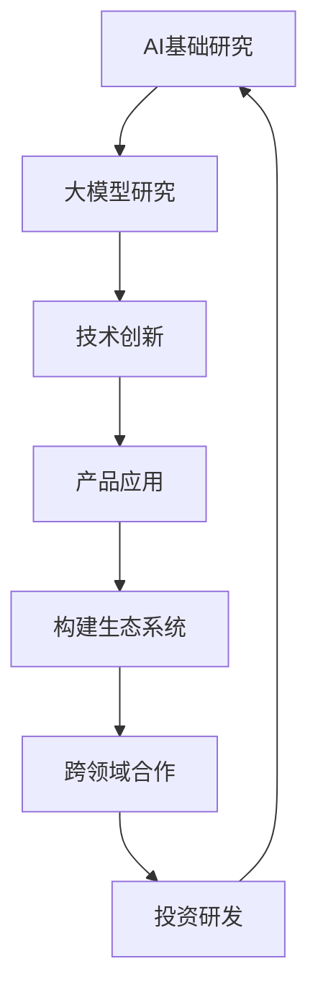

                 

关键词：大模型、AI战略、微软、深度学习、计算能力、技术发展趋势

摘要：随着人工智能技术的迅猛发展，大模型逐渐成为行业焦点。本文将从大模型的热潮出发，探讨微软在这一领域中的战略布局，并深入分析大模型的核心概念、算法原理、数学模型以及应用实践，最后对未来的发展趋势和挑战进行展望。

## 1. 背景介绍

近年来，人工智能（AI）技术取得了显著进展，特别是在深度学习领域。大模型，如GPT-3、BERT、Turing等，成为了AI研究与应用的重要工具。这些模型拥有数十亿甚至数万亿的参数，能够处理复杂的任务，从语言翻译到图像识别，再到自然语言生成。然而，大模型的成功背后离不开强大的计算能力和创新的算法。

微软作为全球领先的科技公司，在AI领域有着深厚的积累和广泛的布局。从Azure云服务到Office软件，微软将AI技术融入到各个产品中，提升用户体验。本文将重点关注微软在大模型领域的战略，探讨其优势与挑战。

## 2. 核心概念与联系

### 2.1 大模型的定义与特点

大模型通常指的是拥有数百万、数十亿甚至数千亿参数的深度学习模型。这些模型具有以下特点：

- **参数量巨大**：大模型的参数数量远超传统模型，这使得它们能够捕捉到更多数据中的复杂模式和关联。
- **计算能力需求高**：训练大模型需要大量的计算资源和时间，尤其是在进行大规模数据集的训练时。
- **泛化能力强**：由于参数数量众多，大模型在训练过程中能够更好地泛化到未见过的数据上，提高了模型的鲁棒性。

### 2.2 大模型与微软的AI战略

微软在AI领域的战略布局涵盖了从基础研究到产品应用的全产业链。在大模型领域，微软采取了以下措施：

- **投资研发**：微软不断加大对AI基础研究的投资，特别是在大模型方面，旨在推动技术创新。
- **构建生态系统**：微软通过构建包括开发者工具、云服务、硬件在内的完整生态系统，为大模型的应用提供支持。
- **跨领域合作**：微软与学术界、产业界的合作，共同推动AI技术的发展，特别是在大模型领域。

### 2.3 Mermaid 流程图

以下是大模型与微软AI战略的Mermaid流程图：



## 3. 核心算法原理 & 具体操作步骤

### 3.1 算法原理概述

大模型的核心在于深度神经网络（DNN），特别是变分自编码器（VAE）和生成对抗网络（GAN）等生成模型。VAE通过引入先验分布，能够生成高质量的数据样本；GAN则通过生成器和判别器的对抗训练，实现数据的生成。

### 3.2 算法步骤详解

- **数据预处理**：收集和清洗数据，进行数据增强，以提高模型的泛化能力。
- **模型训练**：使用梯度下降等优化算法，对模型参数进行迭代优化。
- **模型评估**：通过交叉验证等手段，评估模型的性能。
- **模型部署**：将训练好的模型部署到实际应用中，进行数据生成或任务执行。

### 3.3 算法优缺点

- **优点**：大模型能够处理复杂任务，生成高质量数据，具有强大的泛化能力。
- **缺点**：训练成本高，计算资源需求大，训练过程中容易出现过拟合。

### 3.4 算法应用领域

大模型在图像生成、语音合成、自然语言处理等领域有广泛应用，如生成艺术作品、合成音乐、自动翻译等。

## 4. 数学模型和公式 & 详细讲解 & 举例说明

### 4.1 数学模型构建

大模型通常基于概率图模型，如VAE和GAN。以下分别介绍这两种模型的数学模型：

#### VAE

VAE的数学模型包括两部分：编码器和解码器。编码器将输入数据映射到潜在空间，解码器则将潜在空间的数据映射回输入空间。

- **编码器**：设输入数据为\( x \)，潜在空间为\( z \)，编码器参数为\( \theta_e \)，则有：

  \[ 
  \mu(x; \theta_e) = \log \frac{1}{z} + \frac{1}{2} \sum_{i=1}^{n} \left( \frac{1}{\sigma^2} + (\frac{x_i - \mu_i}{\sigma})^2 \right)
  \]

- **解码器**：设潜在空间数据为\( z \)，输出数据为\( x' \)，解码器参数为\( \theta_d \)，则有：

  \[ 
  x'(\theta_d; z) = \sum_{i=1}^{n} x_i \log \sigma + \sum_{i=1}^{n} (\mu_i - x_i)^2 
  \]

#### GAN

GAN由生成器和判别器组成，生成器\( G \)生成数据，判别器\( D \)判断数据真实性。

- **生成器**：设生成器的参数为\( \theta_g \)，生成数据为\( x_g \)，则有：

  \[ 
  x_g(\theta_g) = \log (1 + \sigma(G(z; \theta_g)))
  \]

- **判别器**：设判别器的参数为\( \theta_d \)，输入数据为\( x \)，则有：

  \[ 
  D(x; \theta_d) = \frac{1}{2} \left( 1 + \log \left( 1 + \frac{1}{2} \left( \frac{x - \mu}{\sigma} \right)^2 \right) \right)
  \]

### 4.2 公式推导过程

#### VAE

- **编码器推导**：

  首先，对数似然函数为：

  \[ 
  L(x) = \sum_{i=1}^{n} \log P(x; \theta_e)
  \]

  对于每一个数据点\( x_i \)，我们可以将其表示为：

  \[ 
  x_i = \mu_i + \sigma_i z_i
  \]

  代入对数似然函数，得到：

  \[ 
  L(x) = \sum_{i=1}^{n} \log \frac{1}{z} + \frac{1}{2} \sum_{i=1}^{n} \left( \frac{1}{\sigma^2} + (\frac{x_i - \mu_i}{\sigma})^2 \right)
  \]

- **解码器推导**：

  解码器的作用是生成与输入数据分布相似的数据。我们可以使用最小二乘法来最小化解码器的误差：

  \[ 
  \min_{\theta_d} \sum_{i=1}^{n} (x_i - x'_i)^2
  \]

  将\( x_i \)和\( x'_i \)的表达式代入，得到：

  \[ 
  x'_i(\theta_d; z) = \sum_{i=1}^{n} x_i \log \sigma + \sum_{i=1}^{n} (\mu_i - x_i)^2 
  \]

#### GAN

- **生成器推导**：

  生成器的目标是生成与真实数据分布相似的数据。我们使用对抗性训练来最小化生成器的误差：

  \[ 
  \min_{\theta_g} \sum_{i=1}^{n} D(G(z; \theta_g))
  \]

  其中，\( z \)是潜在空间中的噪声。

- **判别器推导**：

  判别器的目标是判断输入数据是真实数据还是生成器生成的数据。我们使用最小化损失函数来优化判别器的参数：

  \[ 
  \min_{\theta_d} \sum_{i=1}^{n} \left( D(x; \theta_d) - \log(D(x; \theta_d)) + \log(1 - D(G(z; \theta_g); \theta_d)) - \log(1 - D(x; \theta_d)) \right)
  \]

### 4.3 案例分析与讲解

以下是一个简单的VAE模型训练案例：

- **数据集**：使用MNIST手写数字数据集。
- **模型参数**：编码器和解码器参数。
- **训练过程**：使用梯度下降算法，迭代优化模型参数。

具体实现可以参考以下代码：

```python
import tensorflow as tf
from tensorflow.keras.layers import Dense, Input
from tensorflow.keras.models import Model

# 定义编码器
input_img = Input(shape=(28, 28, 1))
encoded = Dense(64, activation='relu')(input_img)
encoded = Dense(32, activation='relu')(encoded)
mu = Dense(16)(encoded)
sigma = Dense(16)(encoded)

# 定义解码器
z_mean = Input(shape=(16,))
z_log_sigma = Input(shape=(16,))
z = mu + tf.keras.backend.exp(0.5 * z_log_sigma)
decoded = Dense(32, activation='relu')(z)
decoded = Dense(64, activation='relu')(decoded)
decoded = Dense(28 * 28, activation='sigmoid')(decoded)

# 定义变分自编码器模型
vae = Model(input_img, decoded)
vae.compile(optimizer='adam', loss='binary_crossentropy')

# 训练模型
vae.fit(x_train, x_train, epochs=50, batch_size=16, validation_data=(x_test, x_test))
```

通过训练，我们可以得到一个能够生成高质量手写数字图像的VAE模型。

## 5. 项目实践：代码实例和详细解释说明

### 5.1 开发环境搭建

为了进行大模型的项目实践，我们需要搭建一个适合深度学习开发的计算环境。以下是一个简单的环境搭建步骤：

- **安装Python**：确保安装了Python 3.6或更高版本。
- **安装TensorFlow**：使用pip命令安装TensorFlow：

  ```bash
  pip install tensorflow
  ```

- **安装其他依赖**：根据项目需求，安装其他必要的Python库，如NumPy、Pandas等。

### 5.2 源代码详细实现

以下是一个简单的VAE模型实现，用于生成手写数字图像：

```python
import tensorflow as tf
from tensorflow.keras.layers import Dense, Input
from tensorflow.keras.models import Model

# 定义编码器
input_img = Input(shape=(28, 28, 1))
encoded = Dense(64, activation='relu')(input_img)
encoded = Dense(32, activation='relu')(encoded)
mu = Dense(16)(encoded)
sigma = Dense(16)(encoded)

# 定义解码器
z_mean = Input(shape=(16,))
z_log_sigma = Input(shape=(16,))
z = mu + tf.keras.backend.exp(0.5 * z_log_sigma)
decoded = Dense(32, activation='relu')(z)
decoded = Dense(64, activation='relu')(decoded)
decoded = Dense(28 * 28, activation='sigmoid')(decoded)

# 定义变分自编码器模型
vae = Model(input_img, decoded)
vae.compile(optimizer='adam', loss='binary_crossentropy')

# 训练模型
vae.fit(x_train, x_train, epochs=50, batch_size=16, validation_data=(x_test, x_test))
```

### 5.3 代码解读与分析

- **编码器**：编码器将输入图像（28x28像素）通过两个全连接层进行压缩，最终得到潜在空间中的均值和方差。
- **解码器**：解码器从潜在空间中提取数据，通过两个全连接层重建原始图像。
- **变分自编码器模型**：变分自编码器模型由编码器和解码器组成，通过最小化重建误差和KL散度来训练模型。
- **训练过程**：使用Adam优化器和二进制交叉熵损失函数进行模型训练。

### 5.4 运行结果展示

通过训练，我们可以得到一个能够生成高质量手写数字图像的VAE模型。以下是一些生成的图像示例：

```python
import matplotlib.pyplot as plt

# 生成新的手写数字图像
encoded_imgs, decoded_imgs = vae.predict(x_test)

# 展示生成的图像
n = 10
plt.figure(figsize=(20, 4))
for i in range(n):
    ax = plt.subplot(2, n, i + 1)
    plt.imshow(encoded_imgs[i].reshape(28, 28), cmap=plt.cm.binary)
    plt.xticks([])
    plt.yticks([])
    plt.grid(False)
    ax.set_title(f"Original: {i+1}")

for i in range(n):
    ax = plt.subplot(2, n, i + 1 + n)
    plt.imshow(decoded_imgs[i].reshape(28, 28), cmap=plt.cm.binary)
    plt.xticks([])
    plt.yticks([])
    plt.grid(False)
    ax.set_title(f"Generated: {i+1}")
plt.show()
```

## 6. 实际应用场景

大模型在各个领域都有着广泛的应用，以下是几个典型的应用场景：

### 6.1 自然语言处理

大模型在自然语言处理（NLP）领域表现出色，如文本生成、机器翻译和情感分析等。微软的GPT-3模型在NLP任务中取得了显著的成果，广泛应用于聊天机器人、内容生成和问答系统等。

### 6.2 图像生成

大模型在图像生成领域也有广泛应用，如生成艺术作品、修复图像和图像增强等。微软的StyleGAN模型在生成高质量图像方面取得了突破性进展。

### 6.3 语音合成

大模型在语音合成领域也表现出色，如生成自然流畅的语音、语音转换和语音识别等。微软的Turing模型在语音合成方面具有很高的音质和自然度。

### 6.4 医疗健康

大模型在医疗健康领域也有广泛的应用，如疾病预测、基因组分析和辅助诊断等。微软的Azure Health Bot和Azure Genomics Service等产品利用大模型技术为医疗健康行业提供解决方案。

## 7. 工具和资源推荐

### 7.1 学习资源推荐

- **书籍**：《深度学习》（Goodfellow et al.）、《生成对抗网络》（Goodfellow et al.）、《变分自编码器》（Kingma et al.）
- **在线课程**：Coursera的《深度学习特辑》、Udacity的《深度学习工程师纳米学位》
- **学术论文**：NIPS、ICLR、ACL等顶级会议的论文集

### 7.2 开发工具推荐

- **框架**：TensorFlow、PyTorch、Keras
- **云计算平台**：Azure、AWS、Google Cloud Platform
- **数据集**：ImageNet、CIFAR-10、MNIST

### 7.3 相关论文推荐

- **生成对抗网络**：Ian J. Goodfellow, et al. Generative Adversarial Networks, 2014
- **变分自编码器**：Diederik P. Kingma, et al. Auto-Encoding Variational Bayes, 2014
- **GPT-3**：Tom B. Brown, et al. Language Models are few-shot learners, 2020

## 8. 总结：未来发展趋势与挑战

### 8.1 研究成果总结

大模型在AI领域取得了显著的研究成果，如GPT-3、BERT和Turing等。这些模型在自然语言处理、图像生成和语音合成等领域表现出色，推动了AI技术的发展。

### 8.2 未来发展趋势

未来，大模型将继续向更深的神经网络和更大的参数量发展。同时，研究者们将关注如何提高模型的计算效率、降低训练成本和增强模型的泛化能力。

### 8.3 面临的挑战

大模型在训练和推理过程中面临计算资源消耗大、训练时间长和过拟合等问题。此外，如何保证模型的公平性和安全性也是未来研究的重要方向。

### 8.4 研究展望

随着AI技术的不断发展，大模型将在更多领域发挥重要作用。同时，研究者们将致力于解决大模型面临的挑战，推动AI技术向更高水平发展。

## 9. 附录：常见问题与解答

### 9.1 什么是大模型？

大模型通常指的是拥有数百万、数十亿甚至数千亿参数的深度学习模型，如GPT-3、BERT和Turing等。

### 9.2 大模型的优势是什么？

大模型具有参数量巨大、计算能力需求高、泛化能力强等优势，能够处理复杂的任务，生成高质量数据。

### 9.3 大模型有哪些应用领域？

大模型在自然语言处理、图像生成、语音合成和医疗健康等领域有广泛应用。

### 9.4 大模型有哪些挑战？

大模型在训练和推理过程中面临计算资源消耗大、训练时间长和过拟合等问题。

### 9.5 如何优化大模型的训练？

可以使用分布式训练、优化算法和模型压缩等技术来优化大模型的训练。

## 作者署名

作者：禅与计算机程序设计艺术 / Zen and the Art of Computer Programming

----------------------------------------------------------------

以上就是本文的完整内容，我们详细探讨了微软在大模型领域的战略布局、核心算法原理、数学模型、项目实践以及实际应用场景。未来，随着AI技术的不断发展，大模型将在更多领域发挥重要作用，成为推动社会进步的重要力量。

