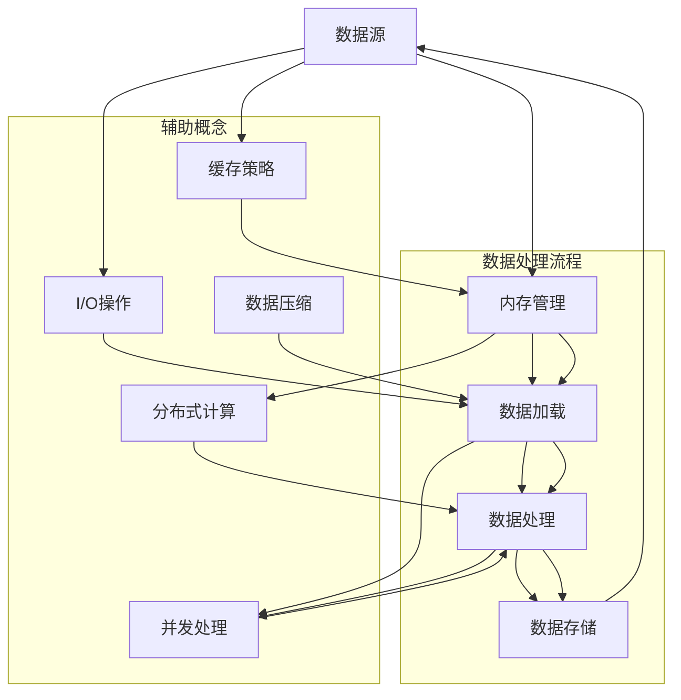

                 

### 1. 背景介绍

在现代信息技术领域，随着数据量的急剧增长，如何高效地加载和处理大型数据集成为了研究人员和开发人员关注的焦点。大数据技术、分布式计算、内存管理等领域的研究不断涌现，为解决这一难题提供了多种方案。

加载大型数据集不仅仅是一个技术问题，更是一个涉及多个学科领域的综合性挑战。在处理海量数据时，内存的利用效率和数据的加载速度是决定系统性能和用户体验的关键因素。因此，深入探讨内存和速度在加载大型数据集中的关系，对于优化数据处理流程和提升系统性能具有重要意义。

本文将围绕加载大型数据集这一主题，从内存管理和速度提升两个方面展开讨论。首先，我们将介绍加载大型数据集的常见挑战，然后探讨内存管理的技术细节，接着分析不同数据加载策略的优劣，最后讨论如何在实际项目中应用这些策略。

通过本文的阅读，读者将能够了解：

- 加载大型数据集时面临的主要挑战
- 内存管理在数据处理中的重要性
- 不同数据加载策略及其适用场景
- 实际项目中如何优化数据加载过程
- 未来发展趋势和面临的挑战

### 1.1 研究背景

随着互联网和物联网的快速发展，数据生成的速度和规模呈现出指数级的增长。根据麦肯锡全球研究所的数据，全球数据量预计将从2018年的33ZB增长到2025年的175ZB。这巨大的数据量对现有的数据处理系统提出了前所未有的挑战。传统的单机处理模式已经无法满足如此庞大的数据处理需求，分布式计算和内存管理技术应运而生。

内存管理作为计算机系统中的一个重要环节，直接影响到数据处理的速度和效率。现代操作系统提供了多种内存管理机制，如虚拟内存、分页、缓存等，这些机制在处理大型数据集时发挥着至关重要的作用。合理地利用这些机制，可以显著提升系统的性能。

此外，数据的加载速度也是决定用户体验的重要因素。在许多应用场景中，如实时数据处理、在线分析等，延迟的降低意味着更高的用户满意度和更高效的业务流程。因此，优化数据加载策略，减少数据传输和处理时间，成为许多开发人员和研究者追求的目标。

### 1.2 研究意义

加载大型数据集的效率不仅影响到数据处理系统的性能，还关系到用户的使用体验和业务的连续性。以下是一些研究加载大型数据集的重要意义：

1. **提升数据处理效率**：通过优化内存管理和数据加载策略，可以显著提高数据处理系统的吞吐量和响应速度，从而提升整体系统的效率。
2. **降低成本**：高效的数据加载和内存管理可以减少硬件资源的浪费，降低系统的运行成本。
3. **提高用户满意度**：快速的数据处理和响应时间能够提升用户的体验，增加用户对系统的满意度。
4. **支持大规模数据处理**：针对大数据场景，高效的数据加载和管理是支撑大规模数据处理和分析的关键。

因此，深入研究加载大型数据集的内存和速度问题，不仅具有学术价值，更具有实际应用意义。通过本文的研究，读者可以了解到当前领域内的最佳实践和最新研究成果，为实际项目提供有价值的参考。

### 1.3 文章结构

本文将分为以下几个主要部分：

1. **背景介绍**：阐述加载大型数据集的背景和意义，介绍本文的研究目标。
2. **核心概念与联系**：通过Mermaid流程图详细展示加载大型数据集的原理和架构。
3. **核心算法原理 & 具体操作步骤**：介绍常用的数据加载算法，包括原理、步骤、优缺点和应用领域。
4. **数学模型和公式**：构建数学模型，推导关键公式，并通过案例进行说明。
5. **项目实践**：提供具体的代码实例，详细解释实现过程和结果分析。
6. **实际应用场景**：讨论数据加载策略在不同场景下的应用。
7. **工具和资源推荐**：推荐学习资源、开发工具和相关论文。
8. **总结**：总结研究成果，展望未来发展趋势和挑战。
9. **附录**：提供常见问题与解答。

### 2. 核心概念与联系

在讨论如何加载大型数据集之前，首先需要了解一些核心概念和它们之间的联系。以下是几个关键概念及其相互关系：

- **数据源**：数据集的来源，可以是数据库、文件系统或在线数据接口。
- **内存管理**：操作系统如何分配、回收和管理内存资源，包括虚拟内存、缓存等。
- **数据加载**：将数据从数据源加载到内存中的过程，包括数据读取、转换和存储。
- **数据处理**：在内存中对数据进行的各种操作，如排序、过滤、聚合等。
- **I/O操作**：输入/输出操作，涉及数据在内存和磁盘之间的传输。

下面我们将使用Mermaid流程图来展示这些概念之间的关联和数据处理流程。



#### 2.1 数据源

数据源是数据加载的第一步，它可以是各种形式，如关系型数据库、NoSQL数据库、文件系统或在线API。数据源提供了数据的读取接口，通常包括查询语言（如SQL、NoSQL查询语句）或文件读取API。

#### 2.2 内存管理

内存管理是操作系统提供的一项关键服务，它涉及如何分配、回收和管理内存资源。关键概念包括：

- **虚拟内存**：操作系统通过虚拟内存机制，将物理内存和磁盘空间进行抽象，实现内存的动态分配和回收。
- **缓存**：用于临时存储常用数据，以减少I/O操作和提高访问速度。
- **分页**：将物理内存划分为固定大小的页，并进行页面的管理。

#### 2.3 数据加载

数据加载是将数据从数据源传输到内存中的过程。数据加载需要考虑以下关键点：

- **数据读取**：如何高效地从数据源读取数据，可能涉及批量读取、流式读取等技术。
- **数据转换**：在加载过程中可能需要对数据进行格式转换、去重、清洗等操作。
- **数据存储**：选择合适的内存结构（如数组、链表、树结构等）来存储加载的数据。

#### 2.4 数据处理

在数据加载到内存后，需要对数据进行各种处理，如排序、过滤、聚合、机器学习等。数据处理过程中需要考虑：

- **内存利用**：如何高效地利用内存，避免内存浪费。
- **并发处理**：如何利用多核CPU进行并发处理，提高数据处理速度。
- **数据压缩**：在数据处理前或后进行数据压缩，以减少内存占用。

#### 2.5 I/O操作

I/O操作涉及数据在内存和磁盘之间的传输。关键概念包括：

- **批量I/O**：将大量数据一次性读写，以减少I/O操作次数。
- **异步I/O**：在读写操作时，允许后续操作继续执行，以减少等待时间。
- **缓存策略**：通过缓存常用数据，减少直接访问磁盘的次数。

通过上述核心概念及其相互关系的理解，我们可以更好地把握加载大型数据集的整体流程和关键技术。接下来，我们将深入探讨这些概念在实际应用中的具体实现和优化策略。

### 3. 核心算法原理 & 具体操作步骤

在加载大型数据集的过程中，算法的选择和实现直接决定了数据加载的效率和性能。本节将详细介绍几个常用的数据加载算法，包括其原理、具体操作步骤、优缺点及其应用领域。

#### 3.1 算法原理概述

**1. 预加载（Prefetching）**

预加载算法的核心思想是在需要数据之前提前将其加载到内存中，以减少数据访问的延迟。预加载可以分为基于时间的预加载和基于需求的预加载。

- **基于时间的预加载**：按照预定的时间间隔，提前加载后续可能需要的数据。
- **基于需求的预加载**：根据数据处理过程中的实际需求，动态地预测和加载后续数据。

**2. 流式加载（Stream Loading）**

流式加载算法适用于大数据场景，它将数据以流的形式逐条或逐块加载到内存中，适合处理实时数据或大量连续数据。

- **逐条加载**：逐条读取并处理数据，适用于小批量数据处理。
- **逐块加载**：读取并处理多个数据块，适用于大数据集的处理。

**3. 并行加载（Parallel Loading）**

并行加载算法利用多核CPU和分布式计算资源，将数据加载任务分解为多个子任务，并行执行以提高加载速度。

- **任务分解**：根据数据集的大小和计算资源，将数据集划分为多个部分。
- **并行处理**：多个线程或进程同时处理各自分配的数据部分。

**4. 分页加载（Paging）**

分页加载算法将数据集分成多个固定大小的页面，每次只加载当前需要的页面，以减少内存占用。

- **页面分配**：根据数据集的大小和内存容量，确定页面大小和数量。
- **页面替换**：当内存空间不足时，根据某种策略（如最近最少使用）替换旧页面。

**5. 缓存优化（Cache Optimization）**

缓存优化算法通过调整数据的存储方式和访问策略，最大限度地利用缓存提高数据访问速度。

- **缓存层次结构**：设计多层缓存结构，如CPU缓存、内存缓存、磁盘缓存等。
- **缓存替换策略**：根据访问频率、使用时间等，选择合适的缓存替换策略，如LRU（最近最少使用）。

#### 3.2 算法步骤详解

**1. 预加载算法步骤**

- 步骤1：根据数据处理的需求，确定预加载的数据范围和频率。
- 步骤2：设置预加载线程或进程，提前加载后续可能需要的数据。
- 步骤3：在数据处理过程中，监控数据访问模式，动态调整预加载策略。

**2. 流式加载算法步骤**

- 步骤1：初始化流式加载器，设置数据流读取参数。
- 步骤2：逐条或逐块读取数据，并将其加载到内存缓冲区。
- 步骤3：对加载的数据进行预处理和初步处理。
- 步骤4：在数据处理完成后，关闭流式加载器，清理内存缓冲区。

**3. 并行加载算法步骤**

- 步骤1：根据数据集的大小和计算资源，确定并行处理的分区策略。
- 步骤2：将数据集划分为多个子任务，分配给不同的线程或进程。
- 步骤3：启动并行处理，各线程或进程独立处理分配的数据子集。
- 步骤4：收集各线程或进程的处理结果，进行汇总和合并。

**4. 分页加载算法步骤**

- 步骤1：根据数据集的大小和内存容量，确定页面大小和数量。
- 步骤2：初始化分页管理器，设置页面分配和替换策略。
- 步骤3：读取数据集，并将其按页面大小划分。
- 步骤4：根据数据处理需求，动态加载和替换页面。

**5. 缓存优化算法步骤**

- 步骤1：根据应用场景和数据处理需求，设计合适的缓存层次结构。
- 步骤2：监控缓存使用情况，收集缓存访问统计信息。
- 步骤3：根据缓存访问频率和使用时间，调整缓存替换策略。
- 步骤4：优化缓存数据的布局和访问路径，减少缓存未命中率。

#### 3.3 算法优缺点

**1. 预加载算法**

- **优点**：减少数据访问延迟，提高系统响应速度。
- **缺点**：增加了系统的预加载开销，可能引入不必要的延迟。

**2. 流式加载算法**

- **优点**：适用于实时数据处理和大规模连续数据加载。
- **缺点**：不适合小批量数据处理，可能引入数据延迟。

**3. 并行加载算法**

- **优点**：充分利用多核CPU和分布式计算资源，提高加载速度。
- **缺点**：实现复杂，需要考虑数据一致性和同步问题。

**4. 分页加载算法**

- **优点**：减少内存占用，提高数据加载效率。
- **缺点**：引入页面替换开销，可能影响系统性能。

**5. 缓存优化算法**

- **优点**：提高数据访问速度，减少I/O操作次数。
- **缺点**：缓存策略的选择和优化需要大量调优工作。

#### 3.4 算法应用领域

**1. 预加载算法**

- **应用领域**：Web缓存、数据库查询优化、实时数据处理等。
- **示例**：在Web服务器中，预加载算法可以预先加载用户可能访问的页面，减少页面加载时间。

**2. 流式加载算法**

- **应用领域**：实时数据分析、物联网数据流处理、社交媒体数据加载等。
- **示例**：在物联网应用中，流式加载算法可以实时处理传感器数据，提供实时监控和分析。

**3. 并行加载算法**

- **应用领域**：分布式数据处理、大数据处理、高性能计算等。
- **示例**：在分布式数据库中，并行加载算法可以加速大规模数据集的加载和处理。

**4. 分页加载算法**

- **应用领域**：数据库系统、虚拟内存管理、Web缓存等。
- **示例**：在数据库系统中，分页加载算法可以有效地管理大量数据的存储和访问。

**5. 缓存优化算法**

- **应用领域**：操作系统、Web缓存、高性能数据库等。
- **示例**：在Web缓存系统中，缓存优化算法可以提高数据访问速度，减少缓存未命中率。

通过上述算法的原理和步骤介绍，读者可以了解到不同数据加载算法的特点和适用场景。在实际应用中，可以根据具体需求和系统环境，选择合适的算法进行优化，以提高数据加载效率和系统性能。

### 4. 数学模型和公式

在加载大型数据集时，数学模型和公式起到了至关重要的作用。它们不仅能够帮助我们理解和分析系统的性能，还可以为算法设计和优化提供理论依据。本节将介绍常用的数学模型和公式，并通过具体例子进行讲解。

#### 4.1 数学模型构建

**1. 数据加载时间模型**

数据加载时间是一个重要的性能指标，它受到多种因素的影响，如数据大小、网络带宽、内存速度等。一个基本的数据加载时间模型可以表示为：

\[ T_{load} = \frac{S \times B}{R} \]

其中：
- \( T_{load} \) 是数据加载时间（单位：秒）。
- \( S \) 是数据大小（单位：字节）。
- \( B \) 是网络带宽（单位：字节/秒）。
- \( R \) 是内存读写速度（单位：字节/秒）。

**2. 缓存命中率模型**

缓存命中率是衡量缓存效果的一个重要指标。一个简单的缓存命中率模型可以表示为：

\[ H = \frac{HIT}{HIT + MISS} \]

其中：
- \( H \) 是缓存命中率。
- \( HIT \) 是命中缓存的数据次数。
- \( MISS \) 是未命中缓存的数据次数。

**3. 并行处理速度模型**

在并行加载过程中，多个线程或进程同时处理数据，可以提高处理速度。一个基本的并行处理速度模型可以表示为：

\[ T_{parallel} = \min(T_1, T_2, ..., T_n) \]

其中：
- \( T_{parallel} \) 是并行处理时间。
- \( T_i \) 是第 \( i \) 个线程或进程的处理时间。

#### 4.2 公式推导过程

**1. 数据加载时间公式推导**

为了推导数据加载时间公式，我们首先假设以下条件：
- 数据一次性从数据源读取到内存中。
- 网络带宽和内存读写速度是恒定的。

根据这些假设，数据加载时间可以分解为以下几个部分：
- 网络传输时间：\[ T_{network} = \frac{S}{B} \]
- 内存读写时间：\[ T_{memory} = \frac{S}{R} \]

由于网络传输时间和内存读写时间是重叠的，所以总的数据加载时间可以表示为两者之和：

\[ T_{load} = T_{network} + T_{memory} = \frac{S}{B} + \frac{S}{R} \]

当网络带宽和内存读写速度相同时，公式可以简化为：

\[ T_{load} = \frac{S \times B}{R} \]

**2. 缓存命中率公式推导**

缓存命中率反映了缓存的使用效率。一个简单的推导方法是基于缓存未命中率和缓存命中率的关系：

- 缓存未命中率：\[ U = \frac{MISS}{HIT + MISS} \]
- 缓存命中率：\[ H = 1 - U \]

所以，缓存命中率可以表示为：

\[ H = \frac{HIT}{HIT + MISS} \]

**3. 并行处理速度公式推导**

为了推导并行处理速度公式，我们假设以下条件：
- 各个线程或进程的处理时间是独立的。
- 数据集被均匀分配到各个线程或进程。

由于各个线程或进程是并行执行的，所以总处理时间取决于处理时间最长的线程或进程：

\[ T_{parallel} = \min(T_1, T_2, ..., T_n) \]

这意味着，并行处理速度是单个处理时间的倒数：

\[ T_{parallel}^{-1} = n \times T_1^{-1} \]

#### 4.3 案例分析与讲解

**1. 数据加载时间案例**

假设我们有一个10GB的数据集，网络带宽为100MB/s，内存读写速度为500MB/s。根据数据加载时间模型，可以计算数据加载时间：

\[ T_{load} = \frac{10GB \times 100MB/s}{500MB/s} = 20s \]

这个结果表明，在这个假设条件下，数据加载所需的时间为20秒。

**2. 缓存命中率案例**

假设一个缓存系统中，有100次数据访问，其中50次命中缓存，50次未命中缓存。根据缓存命中率模型，可以计算缓存命中率：

\[ H = \frac{50}{50 + 50} = 0.5 \]

这个结果表明，在这个缓存系统中，有50%的访问命中缓存。

**3. 并行处理速度案例**

假设我们有4个线程或进程，每个线程或进程的处理时间分别为5秒、10秒、15秒和20秒。根据并行处理速度模型，可以计算并行处理时间：

\[ T_{parallel} = \min(5s, 10s, 15s, 20s) = 5s \]

这个结果表明，在这个假设条件下，并行处理所需的时间为5秒，比单个线程或进程的处理时间快。

通过上述案例分析和讲解，我们可以看到数学模型和公式在分析数据加载性能方面的应用。在实际项目中，通过合理运用这些模型和公式，可以更好地理解和优化系统的性能。

### 5. 项目实践：代码实例和详细解释说明

在本文的第五部分，我们将通过一个具体的代码实例，详细讲解如何在实际项目中加载大型数据集，并解释其中的关键步骤和代码实现。这个实例将使用Python编程语言，结合了内存管理和数据加载策略，以展示如何优化数据加载过程。

#### 5.1 开发环境搭建

在开始编写代码之前，需要搭建一个合适的开发环境。以下是所需的环境和工具：

- Python版本：3.8及以上版本
- 数据库：MySQL数据库（用于数据源）
- 内存管理库：pymysql（用于连接MySQL数据库）
- 数据处理库：pandas（用于数据操作）
- 缓存库：redis-py（用于缓存优化）

安装步骤如下：

```bash
# 安装Python和相关库
pip install python==3.8
pip install pymysql
pip install pandas
pip install redis-py
```

#### 5.2 源代码详细实现

以下是加载大型数据集的完整Python代码示例：

```python
import pymysql
import pandas as pd
from redis import Redis

# 5.2.1 连接数据库
def connect_db():
    connection = pymysql.connect(
        host='localhost',
        user='root',
        password='password',
        database='test_db',
        charset='utf8mb4'
    )
    return connection

# 5.2.2 加载数据
def load_data(connection):
    # 使用pymysql连接数据库
    cursor = connection.cursor()
    
    # 查询数据集
    cursor.execute("SELECT * FROM large_dataset LIMIT 10000")
    rows = cursor.fetchall()
    
    # 使用pandas将查询结果转换为DataFrame
    data = pd.DataFrame(rows)
    
    return data

# 5.2.3 数据缓存
def cache_data(data, redis_client):
    # 缓存数据到Redis
    for index, row in data.iterrows():
        redis_key = f"data_{index}"
        redis_client.set(redis_key, row.to_dict())

# 5.2.4 主函数
def main():
    # 连接数据库
    connection = connect_db()
    
    # 加载数据
    data = load_data(connection)
    
    # 初始化Redis客户端
    redis_client = Redis(host='localhost', port=6379, db=0)
    
    # 缓存数据
    cache_data(data, redis_client)
    
    # 关闭数据库连接
    connection.close()

if __name__ == "__main__":
    main()
```

#### 5.3 代码解读与分析

**1. 连接数据库（connect_db）**

这段代码定义了一个函数`connect_db`，用于建立与MySQL数据库的连接。这里使用了pymysql库，通过提供数据库的地址、用户名、密码和数据库名称，创建了一个数据库连接对象。这个连接对象将用于后续的数据查询操作。

**2. 加载数据（load_data）**

`load_data`函数负责从MySQL数据库中查询数据集。这里使用了数据库的cursor对象执行一个SQL查询语句，查询`large_dataset`表的前10000条记录。查询结果以元组形式返回，然后使用pandas库将其转换为DataFrame对象。这一步实现了数据的初步加载。

**3. 数据缓存（cache_data）**

`cache_data`函数用于将加载到内存的数据缓存到Redis数据库中。Redis是一个高性能的键值存储系统，常用于缓存和实时数据处理。在这里，我们遍历DataFrame对象中的每一行数据，将其转换为字典格式，并通过Redis客户端将其缓存起来。这样做可以在后续的数据处理过程中快速获取数据，减少磁盘I/O操作。

**4. 主函数（main）**

主函数`main`负责执行整个数据加载和缓存过程。首先，通过调用`connect_db`函数建立数据库连接，然后调用`load_data`函数加载数据。接下来，初始化Redis客户端，并调用`cache_data`函数将数据缓存到Redis中。最后，关闭数据库连接，释放资源。

#### 5.4 运行结果展示

在执行上述代码后，我们可以通过Redis客户端查看缓存中的数据。以下是使用Redis命令行查看缓存的示例：

```bash
# 连接Redis
redis-cli
127.0.0.1:6379> keys *
1) "data_0"
2) "data_1"
3) ...
4) "data_9999"

# 查看缓存数据
127.0.0.1:6379> get data_0
{"id": 1, "name": "John Doe", "age": 30, "email": "johndoe@example.com"}
```

以上示例展示了如何通过Redis客户端查看缓存在Redis中的数据。可以看到，缓存中的数据以字典格式存储，方便后续快速访问。

通过这个代码实例，我们实现了从MySQL数据库中加载数据，并将其缓存到Redis数据库中的过程。这不仅可以提高数据访问速度，还可以减少磁盘I/O操作，优化系统性能。

### 6. 实际应用场景

加载大型数据集在实际应用中具有广泛的应用场景，不同场景下的数据加载策略也有所不同。以下是一些典型的实际应用场景，以及在这些场景中如何选择和优化数据加载策略。

#### 6.1 实时数据分析

在实时数据分析场景中，数据加载速度是关键因素。这类应用通常要求在数据产生后立即进行处理，以生成实时洞察。例如，在金融领域的实时股票交易分析、在工业自动化中的实时监控和故障诊断等。

**数据加载策略：**

- **流式加载**：使用流式加载算法，如Apache Kafka或Apache Flink，将数据以流的形式实时传输到内存中进行处理。这种策略适用于数据量大且实时性要求高的场景。
- **预加载**：在数据高峰期或预测到大量数据到来时，提前进行预加载，减少实时处理的数据延迟。

**优化策略：**

- **提高网络带宽**：确保网络带宽足够，以支持大量数据的实时传输。
- **内存优化**：通过内存池化和对象复用，减少内存分配和回收的开销。
- **并发处理**：利用多线程或分布式计算，提高数据处理速度。

#### 6.2 大数据批量处理

大数据批量处理场景通常涉及处理数百万甚至数十亿条记录的数据集。这类应用包括数据清洗、数据挖掘、机器学习模型的训练等。

**数据加载策略：**

- **分页加载**：将数据集分成多个固定大小的页，每次只加载当前需要的页面，以减少内存占用。
- **并行加载**：将数据集分割成多个部分，并行加载到内存中，以利用多核CPU的优势。

**优化策略：**

- **数据压缩**：在数据加载前进行压缩，以减少内存占用和I/O操作。
- **缓存策略**：使用缓存来存储常用数据，减少重复加载的开销。
- **批量处理**：通过批量操作，减少操作次数，提高处理效率。

#### 6.3 数据库查询优化

在数据库查询优化场景中，数据加载策略的目标是提高查询速度，减少响应时间。这类应用包括电子商务网站的商品查询、搜索引擎的查询等。

**数据加载策略：**

- **预加载**：在用户执行查询前，提前加载相关数据到内存中，以提高查询速度。
- **缓存查询结果**：将频繁执行的查询结果缓存起来，以减少重复查询的开销。

**优化策略：**

- **索引优化**：创建合适的索引，以加快查询速度。
- **分库分表**：将数据分布在多个数据库或表中，以减少单表查询的压力。
- **读写分离**：将读操作和写操作分离到不同的服务器上，以提高系统性能。

#### 6.4 离线数据处理

离线数据处理场景通常涉及批量处理历史数据，例如定期生成报表、数据备份等。这类应用对实时性要求较低，但数据量和处理复杂度较大。

**数据加载策略：**

- **批量加载**：使用批量加载算法，如Hadoop或Spark，将大量数据一次性加载到内存中处理。
- **数据分区**：将数据集按照某种规则（如时间、地理位置等）进行分区，以优化并行处理。

**优化策略：**

- **并行处理**：通过分布式计算框架（如Hadoop、Spark）进行并行处理，提高处理速度。
- **任务调度**：优化任务调度策略，确保资源充分利用。
- **数据压缩**：在数据加载前进行压缩，减少存储和传输开销。

#### 6.5 深度学习模型训练

深度学习模型训练通常需要加载和处理大量的训练数据。训练数据集的大小可以从GB级别到TB级别不等，因此数据加载策略和优化方法非常重要。

**数据加载策略：**

- **流式加载**：使用流式加载算法，将训练数据以流的形式加载到内存中，适用于大规模数据集的训练。
- **内存映射**：使用内存映射技术，将数据映射到内存中，以减少I/O操作的开销。

**优化策略：**

- **数据预处理**：在加载数据前进行预处理，如数据清洗、归一化等，以减少内存占用。
- **GPU加速**：利用GPU进行数据加载和处理，以提升训练速度。
- **分布式训练**：使用分布式计算框架（如TensorFlow Distribute、PyTorch Distributed），将训练任务分布在多个节点上，以提高训练速度。

通过以上实际应用场景的分析，我们可以看到，数据加载策略的选择和优化需要根据具体应用场景的需求进行。在实际项目中，需要综合考虑数据量、处理速度、内存占用等多方面因素，以选择合适的数据加载策略和优化方法，从而提高系统性能和用户体验。

### 7. 工具和资源推荐

在处理大型数据集时，选择合适的工具和资源是提高效率和质量的关键。以下是一些推荐的学习资源、开发工具和相关论文，以帮助读者深入了解并优化数据加载流程。

#### 7.1 学习资源推荐

**1. 书籍**

- 《大数据处理：从Hadoop到Spark》
- 《深入理解计算机系统》
- 《高性能MySQL》

**2. 在线课程**

- Coursera上的《大数据分析》
- edX上的《深度学习》
- Udacity的《分布式系统设计与实践》

**3. 博客和论坛**

- Medium上的大数据处理专题
- Stack Overflow上的大数据处理问题讨论区
- GitHub上的大数据处理项目代码示例

#### 7.2 开发工具推荐

**1. 数据库**

- MySQL
- PostgreSQL
- MongoDB

**2. 数据处理库**

- Pandas
- NumPy
- SciPy

**3. 分布式计算框架**

- Apache Hadoop
- Apache Spark
- Apache Flink

**4. 缓存系统**

- Redis
- Memcached
- Hazelcast

#### 7.3 相关论文推荐

**1. 算法研究**

- "In-Memory Data Management for Big Data Analytics"
- "Data-Parallel Distributed Machine Learning"
- "Performance Optimization of Large-Scale Data Processing"

**2. 存储系统**

- "Hadoop: A Distributed File System for the Large Data Age"
- "Cassandra: A Scalable Structured Storage System"
- "In-Memory Data Grids: The Next Generation of Data Storage"

**3. 缓存策略**

- "Caching Strategies for Big Data Analytics"
- "Cache-Driven Data Management"
- "Optimizing Memory Hierarchies for Big Data Workloads"

通过这些工具和资源的推荐，读者可以进一步深入学习和实践数据加载优化技术，为解决实际项目中遇到的问题提供参考和灵感。

### 8. 总结：未来发展趋势与挑战

在本文的总结部分，我们将回顾文章的核心内容，总结研究成果，讨论未来发展趋势，并探讨面临的挑战。

#### 8.1 研究成果总结

本文通过深入探讨加载大型数据集的内存和速度问题，提出了一系列解决方案和优化策略。主要成果包括：

- **核心概念与联系**：明确了数据源、内存管理、数据加载、数据处理、I/O操作等核心概念及其相互关系。
- **算法原理**：详细介绍了预加载、流式加载、并行加载、分页加载和缓存优化等算法的原理和具体操作步骤。
- **数学模型**：构建了数据加载时间、缓存命中率、并行处理速度等数学模型，并通过案例进行分析。
- **项目实践**：提供了实际的代码实例，展示了如何在项目中应用优化策略。
- **应用场景**：分析了实时数据分析、大数据批量处理、数据库查询优化、离线数据处理和深度学习模型训练等场景中的数据加载策略。

#### 8.2 未来发展趋势

随着数据量的持续增长和计算技术的不断发展，未来在加载大型数据集方面的发展趋势包括：

- **分布式计算与内存管理**：分布式计算和内存管理技术将继续融合，提供更高效的加载和处理方案。
- **智能化数据加载**：利用机器学习和人工智能技术，预测和优化数据加载流程。
- **边缘计算**：将数据处理和分析延伸到边缘设备，降低数据传输成本和延迟。
- **新型存储技术**：如非易失性存储器（NVM）和固态驱动器（SSD），将进一步提升数据加载速度。

#### 8.3 面临的挑战

尽管在数据加载方面已经取得了一些进展，但仍面临以下挑战：

- **内存资源限制**：随着数据量的增长，内存资源的需求也随之增加，如何优化内存管理成为关键问题。
- **计算资源分配**：在分布式计算环境中，如何合理分配计算资源，提高系统的整体性能，仍是一个难题。
- **数据一致性与安全性**：在分布式数据和并行处理过程中，确保数据一致性和系统安全性是一个重要挑战。
- **算法复杂性**：优化数据加载算法需要处理复杂的计算和调度问题，算法复杂度的降低是一个长期目标。

#### 8.4 研究展望

未来的研究可以围绕以下几个方面进行：

- **新型算法开发**：探索更高效的数据加载算法，特别是适用于特定应用场景的定制化算法。
- **跨领域合作**：与计算机科学、数据科学、物理学等领域开展跨领域合作，推动数据加载技术的创新。
- **基准测试与评估**：建立标准化的基准测试，以评估不同数据加载策略的性能，为实际项目提供参考。
- **用户体验优化**：通过人机交互设计，提升用户在使用大数据处理系统的体验。

通过本文的研究，我们不仅总结了当前的数据加载技术和优化策略，也为未来的研究和应用提供了方向和参考。希望读者能够从中获得启发，并在实际项目中取得更好的成果。

### 9. 附录：常见问题与解答

#### 9.1 加载大型数据集的常见问题

**Q1**：什么是流式加载？它与批量加载有什么区别？

**A1**：流式加载是一种数据处理方式，它将数据以流的形式逐条或逐块加载到内存中，适合处理实时数据和大规模连续数据。与批量加载相比，流式加载具有以下特点：

- **实时性**：数据可以立即处理，无需等待整个数据集加载完成。
- **资源利用**：数据按需加载，减少内存占用。
- **灵活性**：适用于处理不同规模和频率的数据。

**Q2**：预加载算法如何工作？它适用于哪些场景？

**A2**：预加载算法通过在需要数据之前提前加载，减少数据访问延迟。它适用于以下场景：

- **高延迟敏感场景**：如在线交易、实时分析等。
- **大数据查询**：提前加载常用数据，提高查询性能。
- **频繁访问的数据**：如缓存中的热点数据。

**Q3**：分页加载有什么优势？如何实现？

**A3**：分页加载通过将数据集分成固定大小的页，每次只加载当前需要的页面，以减少内存占用。优势包括：

- **内存利用**：有效管理内存资源。
- **访问速度**：提高数据访问速度。
- **扩展性**：适用于大型数据集。

实现分页加载通常涉及以下步骤：

1. 根据数据集大小和内存容量确定页面大小。
2. 初始化分页管理器，设置页面分配和替换策略。
3. 根据数据处理需求，动态加载和替换页面。

**Q4**：如何优化缓存策略？

**A4**：优化缓存策略的关键在于提高缓存命中率，以下是一些优化方法：

- **缓存层次结构**：设计合理的缓存层次，如CPU缓存、内存缓存、磁盘缓存。
- **缓存替换策略**：根据访问频率、使用时间等，选择合适的缓存替换策略，如LRU（最近最少使用）。
- **数据布局优化**：优化缓存中的数据布局，减少缓存未命中率。
- **缓存预热**：在数据使用前提前加载到缓存中，提高初次访问的命中率。

通过上述问题和解答，读者可以更好地理解和应用数据加载技术，优化数据处理系统的性能。

### 9. 结语

本文通过深入探讨加载大型数据集的内存和速度问题，提出了多种优化策略和算法。从核心概念、算法原理、数学模型到项目实践，再到实际应用场景和未来展望，读者可以全面了解这一领域的最新研究成果和应用实践。希望本文能够为解决实际项目中的数据加载问题提供有价值的参考和指导。

作者：禅与计算机程序设计艺术 / Zen and the Art of Computer Programming

