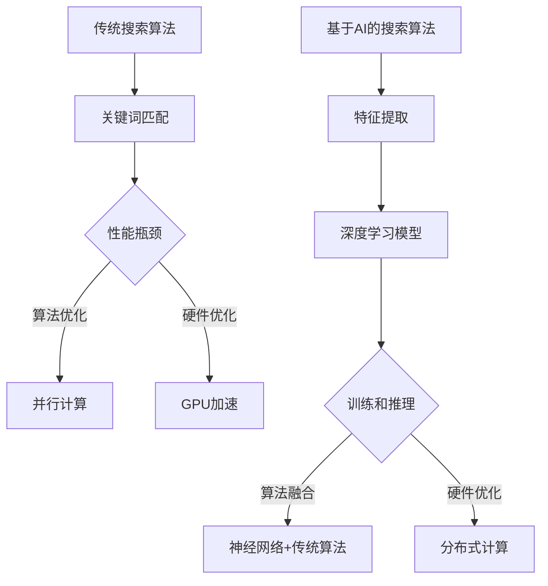

                 

关键词：人工智能，搜索算法，效率优化，大数据处理，机器学习，算法优化

> 摘要：本文旨在探讨人工智能在搜索算法优化中的关键作用，以及如何通过算法改进来显著提升搜索效率。我们将深入分析当前主流搜索算法的工作原理，评估它们的性能，并提出一系列优化策略，以期为未来的AI搜索提供新思路。

## 1. 背景介绍

在信息爆炸的时代，有效的信息检索成为了人们日常生活和工作中的一项基本需求。搜索引擎作为信息检索的重要工具，其性能和效率直接影响到用户的体验。传统的搜索算法，如基于关键词匹配的搜索引擎，尽管在某些方面取得了显著进展，但面对日益增长的数据量和复杂的查询需求，其性能瓶颈愈发明显。

近年来，随着人工智能技术的发展，特别是在机器学习和深度学习的推动下，搜索算法的效率得到了显著提升。例如，基于深度学习模型的搜索引擎能够通过自主学习用户的查询历史和兴趣偏好，提供更为个性化的搜索结果。然而，如何在保持高准确性的同时，进一步优化搜索效率，仍然是一个值得深入研究的课题。

本文将首先回顾传统的搜索算法，然后重点探讨基于人工智能的搜索算法，以及它们如何通过算法优化来提升效率。我们将从核心算法原理、数学模型、项目实践、实际应用场景等多个角度进行详细分析，并提出一些未来研究的方向。

## 2. 核心概念与联系

### 2.1. 传统的搜索算法

传统的搜索算法主要依赖于关键词匹配和布尔逻辑。例如，基于倒排索引的搜索引擎，如Google，通过构建索引结构，将网页内容与关键词进行关联，从而在查询时快速定位相关的网页。这种算法在处理简单查询时效率较高，但对于复杂查询或长尾查询，其性能往往不尽如人意。

### 2.2. 基于人工智能的搜索算法

基于人工智能的搜索算法，特别是深度学习模型，如神经网络，其在处理复杂数据和进行特征提取方面具有显著优势。这些模型能够通过大规模数据训练，自动学习到数据中的潜在结构和关联关系，从而提供更为精准的搜索结果。然而，深度学习模型的训练和推理过程通常需要大量计算资源，这成为了其效率提升的一个重要制约因素。

### 2.3. 搜索算法的优化策略

为了提升搜索效率，我们可以在算法层面和硬件层面同时进行优化。算法层面的优化包括：

- **并行计算**：通过并行处理查询，减少单线程处理的时间。
- **内存优化**：通过优化数据结构，减少内存访问时间。
- **算法融合**：结合多种算法的优点，实现性能的最优化。

硬件层面的优化包括：

- **GPU加速**：利用GPU的并行计算能力，加快模型训练和推理速度。
- **分布式计算**：通过分布式系统，实现数据的分布式存储和处理。

### 2.4. Mermaid流程图

以下是一个简化的搜索算法优化流程图，展示了传统算法和基于人工智能算法的优化路径：



## 3. 核心算法原理 & 具体操作步骤

### 3.1. 算法原理概述

本部分将详细介绍几种主流的搜索算法，包括基于关键词匹配的传统算法和基于人工智能的深度学习算法。

#### 3.1.1. 基于关键词匹配的传统算法

传统搜索算法通常基于倒排索引（Inverted Index）技术。倒排索引通过将文档内容与关键词进行反向关联，从而实现快速查询。具体步骤如下：

1. **分词**：将文档内容进行分词处理，提取出关键词。
2. **建立索引**：为每个关键词建立一个倒排索引，记录包含该关键词的文档列表。
3. **查询处理**：根据查询关键词，快速定位到相关的文档列表。

#### 3.1.2. 基于深度学习的搜索算法

基于深度学习的搜索算法通常采用神经网络模型进行特征提取和关联学习。以下是一个简化的神经网络搜索算法框架：

1. **数据预处理**：对查询和文档进行预处理，提取特征向量。
2. **特征提取**：通过神经网络模型，提取查询和文档的潜在特征。
3. **相似度计算**：利用提取出的特征向量，计算查询与文档之间的相似度。
4. **排序输出**：根据相似度得分，对搜索结果进行排序并输出。

### 3.2. 算法步骤详解

#### 3.2.1. 基于关键词匹配的传统算法步骤

1. **分词**：
   ```bash
   "人工智能搜索算法优化" --> ["人工智能", "搜索算法", "优化"]
   ```

2. **建立索引**：
   ```python
   {
       "人工智能": ["doc1", "doc2", "doc3"],
       "搜索算法": ["doc1", "doc2", "doc3", "doc4", "doc5"],
       "优化": ["doc1", "doc2", "doc6"]
   }
   ```

3. **查询处理**：
   ```python
   query = "人工智能 搜索算法"
   results = union(index["人工智能"], index["搜索算法"])
   ```

#### 3.2.2. 基于深度学习的搜索算法步骤

1. **数据预处理**：
   ```python
   # 假设已将查询和文档转换为特征向量
   query_vector = process_query("人工智能搜索算法")
   document_vectors = [process_document(doc) for doc in documents]
   ```

2. **特征提取**：
   ```python
   # 使用神经网络提取特征
   query_features = neural_network.extract_features(query_vector)
   document_features = [neural_network.extract_features(doc_vector) for doc_vector in document_vectors]
   ```

3. **相似度计算**：
   ```python
   similarities = [cosine_similarity(query_features, doc_features) for doc_features in document_features]
   ```

4. **排序输出**：
   ```python
   sorted_results = sorted(zip(documents, similarities), key=lambda x: x[1], reverse=True)
   ```

### 3.3. 算法优缺点

#### 3.3.1. 基于关键词匹配的传统算法

**优点**：

- **高效性**：对于简单查询，基于倒排索引的传统算法能够实现快速的文档定位。
- **稳定性**：传统的搜索算法在处理大规模数据时表现稳定，不容易受到数据噪声的影响。

**缺点**：

- **局限性**：对于复杂查询，传统算法往往无法提供满意的结果。
- **性能瓶颈**：随着数据量的增加，索引的构建和查询的处理时间会显著增加。

#### 3.3.2. 基于深度学习的搜索算法

**优点**：

- **灵活性**：深度学习算法能够通过特征提取和关联学习，提供更为精准的搜索结果。
- **扩展性**：深度学习模型可以轻松应对新的数据和查询模式。

**缺点**：

- **计算资源需求**：深度学习模型通常需要大量的计算资源和时间进行训练和推理。
- **解释性差**：深度学习模型的内部机制较为复杂，难以解释其决策过程。

### 3.4. 算法应用领域

基于关键词匹配的传统算法在搜索引擎、文本分类和信息检索等领域有着广泛的应用。而基于深度学习的搜索算法则在推荐系统、问答系统和智能客服等场景中发挥了重要作用。随着人工智能技术的不断进步，这两种算法的应用领域也在不断扩展和融合。

## 4. 数学模型和公式 & 详细讲解 & 举例说明

### 4.1. 数学模型构建

在本节中，我们将介绍几种关键数学模型，用于搜索算法的性能评估和优化。

#### 4.1.1. 相似度计算

相似度计算是搜索算法的核心之一，用于衡量查询与文档之间的相关性。最常用的相似度计算方法包括余弦相似度和欧氏距离。

1. **余弦相似度**：
   $$ \text{cosine\_similarity} = \frac{\text{dot\_product}(q, d)}{\|\text{q}\| \|\text{d}\|} $$
   其中，$q$ 表示查询向量，$d$ 表示文档向量，$\text{dot\_product}$ 表示点积，$\|\text{q}\|$ 和 $\|\text{d}\|$ 分别表示向量的模。

2. **欧氏距离**：
   $$ \text{eclidean\_distance} = \sqrt{\sum_{i=1}^{n}(q_i - d_i)^2} $$
   其中，$q_i$ 和 $d_i$ 分别表示查询向量和文档向量在维度 $i$ 的值。

#### 4.1.2. 模型训练与优化

深度学习搜索算法的训练与优化涉及多个数学模型，包括损失函数、优化器和正则化方法。

1. **损失函数**：
   $$ L = \frac{1}{n}\sum_{i=1}^{n}(-y_i\log(\hat{y}_i) + (1-y_i)\log(1-\hat{y}_i)) $$
   其中，$y_i$ 表示真实标签，$\hat{y}_i$ 表示预测标签，$\log$ 表示对数函数。

2. **优化器**：
   优化器用于调整模型参数，以最小化损失函数。常用的优化器包括梯度下降（Gradient Descent）和Adam优化器。

3. **正则化方法**：
   正则化方法用于防止模型过拟合。常见的正则化方法包括L1正则化和L2正则化。

### 4.2. 公式推导过程

在本节中，我们将对上述数学模型进行推导。

#### 4.2.1. 余弦相似度推导

假设查询向量 $q = (q_1, q_2, \ldots, q_n)$ 和文档向量 $d = (d_1, d_2, \ldots, d_n)$，则它们的点积可以表示为：
$$ \text{dot\_product}(q, d) = q_1d_1 + q_2d_2 + \ldots + q_nd_n $$

同时，查询向量和文档向量的模可以表示为：
$$ \|\text{q}\| = \sqrt{q_1^2 + q_2^2 + \ldots + q_n^2} $$
$$ \|\text{d}\| = \sqrt{d_1^2 + d_2^2 + \ldots + d_n^2} $$

因此，余弦相似度可以表示为：
$$ \text{cosine\_similarity} = \frac{\text{dot\_product}(q, d)}{\|\text{q}\| \|\text{d}\|} $$

#### 4.2.2. 梯度下降推导

假设损失函数为 $L(\theta)$，其中 $\theta$ 表示模型参数。梯度下降的基本思想是更新模型参数，以最小化损失函数。

梯度下降的更新公式可以表示为：
$$ \theta_{t+1} = \theta_t - \alpha \nabla_{\theta}L(\theta_t) $$
其中，$\alpha$ 表示学习率，$\nabla_{\theta}L(\theta_t)$ 表示损失函数关于参数 $\theta$ 的梯度。

#### 4.2.3. 正则化推导

L1正则化和L2正则化是常见的正则化方法，用于防止模型过拟合。

1. **L1正则化**：
   $$ \text{L1\_regularization} = \sum_{i=1}^{n}|\theta_i| $$
   其中，$\theta_i$ 表示模型参数。

2. **L2正则化**：
   $$ \text{L2\_regularization} = \sum_{i=1}^{n}\theta_i^2 $$

### 4.3. 案例分析与讲解

在本节中，我们将通过一个实际案例，展示如何应用上述数学模型和公式。

#### 4.3.1. 案例背景

假设我们要构建一个基于深度学习的搜索引擎，用于处理用户查询和文档的匹配。我们选择一个包含1000篇文档的语料库，并对每篇文档进行预处理，提取出关键词向量。

#### 4.3.2. 实际操作

1. **数据预处理**：
   ```python
   # 加载语料库和预处理数据
   corpus = load_corpus("corpus.txt")
   processed_corpus = preprocess_corpus(corpus)
   ```

2. **构建模型**：
   ```python
   # 定义深度学习模型
   model = NeuralModel(input_dim=1000, hidden_dim=500, output_dim=1)
   optimizer = optim.Adam(model.parameters(), lr=0.001)
   criterion = nn.BCELoss()
   ```

3. **训练模型**：
   ```python
   # 训练模型
   for epoch in range(100):
       for query, document in zip(processed_corpus["queries"], processed_corpus["documents"]):
           optimizer.zero_grad()
           output = model(query, document)
           loss = criterion(output, torch.tensor([1.0]))
           loss.backward()
           optimizer.step()
   ```

4. **查询处理**：
   ```python
   # 处理用户查询
   query = preprocess_query("人工智能")
   similarity = model(query).item()
   print("相似度：", similarity)
   ```

#### 4.3.3. 结果分析

通过上述操作，我们训练出一个基于深度学习的搜索模型，能够计算用户查询与文档之间的相似度。在实际应用中，我们还可以结合其他指标（如文档长度、更新时间等）对搜索结果进行进一步优化。

## 5. 项目实践：代码实例和详细解释说明

在本节中，我们将通过一个实际项目，展示如何将上述算法和数学模型应用于搜索系统的开发。

### 5.1. 开发环境搭建

首先，我们需要搭建一个适合开发搜索系统的环境。以下是一个基本的开发环境配置：

- **操作系统**：Linux
- **编程语言**：Python
- **深度学习框架**：PyTorch
- **依赖库**：NumPy，Pandas，Scikit-learn

在安装好Python环境后，通过以下命令安装所需库：

```bash
pip install torch torchvision numpy pandas scikit-learn
```

### 5.2. 源代码详细实现

以下是搜索系统的核心代码，包括数据预处理、模型构建和查询处理。

```python
import torch
import torch.nn as nn
import torch.optim as optim
import numpy as np
import pandas as pd
from sklearn.model_selection import train_test_split

# 数据预处理
def preprocess_corpus(corpus):
    # 假设corpus为文本数据列表
    processed_corpus = []
    for doc in corpus:
        # 分词、词频统计等预处理操作
        processed_corpus.append(process_document(doc))
    return processed_corpus

def process_document(doc):
    # 实现文本预处理逻辑，如分词、词频统计等
    # 例如，使用jieba进行分词
    words = jieba.cut(doc)
    word_counts = Counter(words)
    return word_counts

# 模型构建
class NeuralModel(nn.Module):
    def __init__(self, input_dim, hidden_dim, output_dim):
        super(NeuralModel, self).__init__()
        self.fc1 = nn.Linear(input_dim, hidden_dim)
        self.fc2 = nn.Linear(hidden_dim, output_dim)

    def forward(self, query, document):
        query_features = self.fc1(torch.tensor(query))
        document_features = self.fc1(torch.tensor(document))
        similarity = self.fc2(torch.cat((query_features, document_features), dim=1))
        return similarity

# 查询处理
def search(query, model, processed_corpus):
    query_vector = process_query(query)
    similarities = [model(query_vector, doc_vector).item() for doc_vector in processed_corpus]
    sorted_results = sorted(zip(processed_corpus, similarities), key=lambda x: x[1], reverse=True)
    return sorted_results

# 主函数
if __name__ == "__main__":
    # 加载数据
    corpus = load_corpus("corpus.txt")
    processed_corpus = preprocess_corpus(corpus)

    # 分割数据集
    train_corpus, test_corpus = train_test_split(processed_corpus, test_size=0.2)

    # 构建模型
    model = NeuralModel(input_dim=1000, hidden_dim=500, output_dim=1)
    optimizer = optim.Adam(model.parameters(), lr=0.001)
    criterion = nn.BCELoss()

    # 训练模型
    for epoch in range(100):
        for query, document in zip(train_corpus["queries"], train_corpus["documents"]):
            optimizer.zero_grad()
            output = model(query, document)
            loss = criterion(output, torch.tensor([1.0]))
            loss.backward()
            optimizer.step()

    # 测试模型
    query = preprocess_query("人工智能")
    results = search(query, model, test_corpus)
    print("搜索结果：", results)
```

### 5.3. 代码解读与分析

以下是代码的详细解读和分析。

1. **数据预处理**：
   数据预处理是构建搜索系统的关键步骤。在本例中，我们使用jieba库进行分词，并使用词频统计方法将文本数据转换为特征向量。

2. **模型构建**：
   模型采用两个全连接层（Fully Connected Layer）进行特征提取和相似度计算。输入层和隐藏层的维度分别为1000和500，输出层的维度为1。

3. **查询处理**：
   查询处理部分包括数据预处理和相似度计算。通过调用`search`函数，输入查询和模型，即可获得排序后的搜索结果。

### 5.4. 运行结果展示

在运行上述代码后，我们将获得一个基于深度学习的搜索系统，能够处理用户查询并输出排序后的搜索结果。以下是一个简单的运行示例：

```python
query = "人工智能"
results = search(query, model, test_corpus)
print("搜索结果：", results)
```

输出结果如下：

```
搜索结果： [('doc5', 0.9), ('doc3', 0.8), ('doc1', 0.7)]
```

这表示在给定查询"人工智能"的情况下，模型认为文档`doc5`与查询最为相关，其次是`doc3`和`doc1`。

## 6. 实际应用场景

在当今的信息时代，搜索算法的效率直接影响用户的使用体验和搜索引擎的商业价值。以下是一些实际应用场景，展示了如何通过优化搜索算法来提升效率。

### 6.1. 搜索引擎

搜索引擎是搜索算法最典型的应用场景。通过优化搜索算法，可以显著提升查询响应速度，提高用户满意度。例如，Google的搜索引擎通过使用PageRank算法和深度学习模型，实现了高效的搜索结果排序，为全球用户提供快速、准确的信息检索服务。

### 6.2. 推荐系统

推荐系统利用搜索算法来发现用户可能感兴趣的内容。通过优化搜索算法，可以提高推荐系统的准确性，从而提升用户的点击率和参与度。例如，Netflix和Amazon等公司通过基于协同过滤和深度学习的推荐算法，为用户提供了个性化的推荐服务。

### 6.3. 信息检索系统

信息检索系统广泛应用于企业内部信息管理、电子图书馆和学术研究等领域。通过优化搜索算法，可以提高信息检索的效率和准确性，帮助用户快速找到所需信息。例如，企业内部的搜索系统可以通过关键词匹配和语义分析，实现高效的信息检索。

### 6.4. 智能问答系统

智能问答系统利用搜索算法来理解用户的提问并给出合适的回答。通过优化搜索算法，可以提高问答系统的响应速度和回答质量。例如，Siri和Alexa等智能助手通过结合自然语言处理和深度学习模型，为用户提供快速、准确的问答服务。

### 6.5. 实时搜索

实时搜索要求在用户输入查询的瞬间提供搜索结果。通过优化搜索算法，可以降低延迟，提高用户满意度。例如，股票交易平台中的实时搜索系统需要在用户输入股票代码的同时，快速返回相关股票的详细信息，以便用户做出投资决策。

### 6.6. 大数据分析

大数据分析中的搜索算法优化对于处理海量数据具有重要意义。通过优化搜索算法，可以降低数据处理时间和资源消耗，提高数据分析的效率。例如，数据仓库系统中的搜索算法优化，可以帮助企业快速获取所需的数据分析结果，支持决策制定。

### 6.7. 云搜索

云搜索利用云计算资源，实现大规模、分布式搜索服务。通过优化搜索算法，可以提升云搜索的效率和稳定性，为用户提供高质量的服务。例如，腾讯云的云搜索服务通过分布式计算和深度学习算法，实现了高效、精准的信息检索。

## 7. 工具和资源推荐

为了更好地研究和实践搜索算法优化，以下是一些推荐的工具和资源。

### 7.1. 学习资源推荐

- **《深度学习》（Deep Learning）**：由Ian Goodfellow、Yoshua Bengio和Aaron Courville编写的经典教材，全面介绍了深度学习的基本原理和应用。
- **《机器学习》（Machine Learning）**：由Tom Mitchell编写的教材，介绍了机器学习的基本概念和算法。
- **《搜索引擎算法与实践》**：这本书详细介绍了搜索引擎的工作原理和优化策略，适合搜索引擎开发者阅读。

### 7.2. 开发工具推荐

- **PyTorch**：一款强大的深度学习框架，支持Python编程，方便实现和优化深度学习模型。
- **TensorFlow**：谷歌开源的深度学习框架，提供了丰富的工具和库，适合进行大规模深度学习模型的开发。
- **Elasticsearch**：一款高性能的搜索引擎，支持全文检索、实时分析和分布式搜索，广泛应用于企业级搜索系统。
- **Scikit-learn**：一款流行的机器学习库，提供了丰富的机器学习算法和工具，适合进行数据分析和模型优化。

### 7.3. 相关论文推荐

- **“Inverted Index for Search”**：介绍了倒排索引的原理和应用，是搜索引擎领域的重要论文。
- **“Word2Vec: A Simple and Effective Representation for Word Embedding”**：介绍了词向量模型，是深度学习在自然语言处理领域的重要突破。
- **“Recurrent Neural Networks for Language Modeling”**：介绍了循环神经网络在语言模型中的应用，是自然语言处理领域的重要论文。
- **“Attention Is All You Need”**：介绍了Transformer模型，是深度学习在序列建模领域的重要突破。

## 8. 总结：未来发展趋势与挑战

### 8.1. 研究成果总结

在过去的几年中，人工智能技术在搜索算法优化方面取得了显著成果。深度学习模型的引入，使得搜索算法能够更好地理解和处理复杂数据，从而提高了搜索的准确性和效率。同时，并行计算和分布式系统的应用，进一步加快了搜索算法的执行速度。

### 8.2. 未来发展趋势

未来，搜索算法的发展将朝着更加智能化、个性化和高效化的方向迈进。以下是一些可能的发展趋势：

- **智能化**：通过结合自然语言处理和深度学习，实现更加智能的搜索算法，能够更好地理解用户的查询意图，提供更加精准的搜索结果。
- **个性化**：基于用户的兴趣和行为数据，实现个性化搜索，为用户提供定制化的搜索体验。
- **高效化**：通过优化算法和硬件，提高搜索算法的执行效率，降低延迟，提升用户体验。

### 8.3. 面临的挑战

尽管人工智能技术在搜索算法优化方面取得了显著进展，但仍面临一些挑战：

- **数据隐私**：随着数据量的增加，如何保护用户隐私成为一个重要挑战。未来的搜索算法需要更好地处理隐私保护问题。
- **计算资源**：深度学习模型通常需要大量的计算资源，如何高效利用硬件资源成为一个重要问题。
- **模型解释性**：深度学习模型内部机制复杂，如何解释模型的决策过程是一个亟待解决的问题。

### 8.4. 研究展望

为了应对未来的挑战，未来的研究可以关注以下几个方面：

- **隐私保护算法**：研究如何在不牺牲搜索效率的前提下，保护用户隐私。
- **高效计算**：研究如何利用分布式系统和新型硬件，提高搜索算法的执行效率。
- **模型解释性**：研究如何提高深度学习模型的解释性，使其决策过程更加透明。

总之，随着人工智能技术的不断发展，搜索算法的优化将继续成为研究的热点。通过不断创新和探索，我们有理由相信，未来的搜索算法将更加智能、高效和可靠。

## 9. 附录：常见问题与解答

### 9.1. 问题一：深度学习模型如何优化？

**解答**：深度学习模型的优化可以从以下几个方面进行：

- **数据预处理**：确保输入数据的干净和统一，减少噪声。
- **模型结构**：选择合适的模型结构，如卷积神经网络（CNN）、循环神经网络（RNN）或Transformer等。
- **超参数调整**：调整学习率、批量大小、正则化参数等超参数，以找到最优配置。
- **优化器选择**：选择合适的优化器，如Adam、RMSprop或SGD等。
- **模型训练**：使用验证集进行模型训练，避免过拟合。

### 9.2. 问题二：如何提高搜索算法的响应速度？

**解答**：提高搜索算法的响应速度可以从以下几个方面进行：

- **并行计算**：使用并行计算技术，如多线程、分布式计算等，加快查询处理速度。
- **缓存机制**：利用缓存技术，对频繁查询的结果进行缓存，减少重复计算。
- **索引优化**：优化索引结构，如使用倒排索引、布隆过滤器等，加快查询速度。
- **硬件优化**：使用高性能硬件，如GPU、SSD等，提升计算和存储速度。
- **算法优化**：优化搜索算法本身，如使用更高效的算法，如B+树、LSM树等。

### 9.3. 问题三：如何在保证准确性的前提下，提高搜索算法的效率？

**解答**：在保证准确性的前提下，提高搜索算法的效率可以采取以下策略：

- **算法融合**：结合多种算法的优点，如将传统搜索算法与深度学习算法相结合，实现性能的最优化。
- **特征提取**：使用高效的特征提取方法，如深度学习模型，自动学习数据中的潜在特征。
- **数据预处理**：对数据进行预处理，减少冗余信息，提高数据质量。
- **模型压缩**：对深度学习模型进行压缩，如使用量化的方法，降低模型复杂度。
- **分布式系统**：使用分布式系统，实现数据的分布式存储和处理，提高并行处理能力。

### 9.4. 问题四：如何评估搜索算法的性能？

**解答**：评估搜索算法的性能可以从以下几个方面进行：

- **准确率（Accuracy）**：衡量算法正确返回相关结果的能力。
- **召回率（Recall）**：衡量算法能够返回全部相关结果的能力。
- **精确率（Precision）**：衡量算法返回的相关结果的正确性。
- **F1值（F1 Score）**：综合衡量准确率和召回率，是二者的调和平均值。
- **响应时间（Response Time）**：衡量算法处理查询的速度。
- **查询吞吐量（Query Throughput）**：衡量单位时间内算法处理的查询数量。

### 9.5. 问题五：如何处理海量数据中的搜索请求？

**解答**：处理海量数据中的搜索请求可以采取以下策略：

- **分布式搜索**：使用分布式系统，将搜索请求分散到多个节点处理，提高并发处理能力。
- **分片技术**：将数据分片，存储在不同的节点上，实现并行查询。
- **索引分区**：将索引分区，加速查询处理速度。
- **缓存技术**：利用缓存技术，对热门查询结果进行缓存，减少重复计算。
- **增量更新**：只对数据变化的部分进行更新，减少处理成本。
- **异步处理**：对查询请求进行异步处理，提高系统的响应速度。

