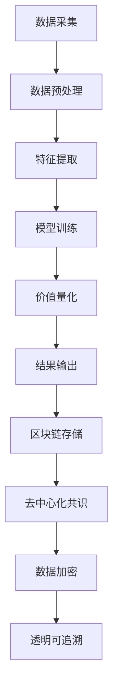

                 

关键词：区块链、注意力价值量化、智能合约、共识机制、去中心化应用、共识算法

摘要：本文旨在探讨区块链技术在注意力价值量化中的应用。通过分析注意力价值量化的核心概念、区块链技术的基本原理及其融合方法，我们将深入探讨如何利用区块链实现注意力价值的透明、可靠和可追溯性。本文还结合实际案例，展示了区块链在注意力价值量化中的具体应用场景，并对未来发展趋势和挑战进行了展望。

## 1. 背景介绍

随着互联网的快速发展，信息和数据的洪流给用户带来了巨大的压力。如何在海量信息中获取用户真正的注意力，成为一个亟待解决的问题。注意力价值量化是指通过对用户行为数据的分析和挖掘，将用户对各种内容的注意力转换为具体的价值衡量，为广告投放、内容推荐、社交网络等多个领域提供决策依据。

然而，传统的注意力价值量化方法存在以下问题：

1. **数据隐私泄露**：用户行为数据容易遭到非法获取和滥用，导致用户隐私泄露。
2. **数据集中化**：数据集中于少数平台，易导致数据垄断和权力集中。
3. **数据可信度低**：传统方法难以保证数据采集和处理的透明度和可信度。

为了解决上述问题，区块链技术以其去中心化、不可篡改和透明性等特点，为注意力价值量化提供了一种新的解决方案。区块链技术可以确保用户行为数据的安全性和隐私性，同时提高数据处理的透明度和可信度。

## 2. 核心概念与联系

### 2.1 区块链技术

区块链技术是一种分布式数据库技术，通过加密算法和共识机制确保数据的完整性和安全性。区块链的基本组成部分包括区块、链、节点和挖矿。

#### 区块

区块是区块链的基本存储单位，包含一定数量的交易记录。每个区块都包含一个时间戳、一个哈希值和前一个区块的哈希值。

#### 链

区块链是一个由多个区块按照时间顺序连接而成的链条。每个区块都通过其哈希值与前一个区块连接，形成一条不可篡改的数据链。

#### 节点

节点是区块链网络中的计算单元，负责验证和存储区块。节点通过通信网络相互连接，共同维护区块链的状态。

#### 挖矿

挖矿是指通过计算获得新区块的过程。挖矿过程需要消耗大量计算资源，并通过解决数学难题来确保新区块的生成速度和安全性。

### 2.2 注意力价值量化

注意力价值量化是指通过对用户行为数据的分析和挖掘，将用户对各种内容的注意力转换为具体的价值衡量。这个过程通常包括数据采集、数据预处理、特征提取和模型训练等步骤。

#### 数据采集

数据采集是指从各种渠道获取用户行为数据，如点击、浏览、分享等。这些数据可以来自网站、APP、社交媒体等多种来源。

#### 数据预处理

数据预处理是指对采集到的数据进行清洗、去噪和归一化等处理，以提高数据的质量和可用性。

#### 特征提取

特征提取是指从预处理后的数据中提取能够反映用户注意力价值的特征，如点击率、停留时间、互动频率等。

#### 模型训练

模型训练是指利用提取的特征数据训练机器学习模型，以预测用户对各种内容的注意力价值。

### 2.3 区块链与注意力价值量化的融合

区块链技术可以与注意力价值量化相结合，解决传统方法中存在的问题。具体融合方法如下：

1. **数据加密存储**：利用区块链的加密算法，将用户行为数据加密存储在区块链上，确保数据隐私和安全。
2. **去中心化共识**：通过区块链的共识机制，实现用户行为数据的去中心化处理，避免数据垄断和权力集中。
3. **透明可追溯**：区块链的公开账本特性，使数据采集、处理和存储过程透明可追溯，提高数据处理的可信度。

### 2.4 Mermaid 流程图



## 3. 核心算法原理 & 具体操作步骤

### 3.1 算法原理概述

区块链在注意力价值量化中的应用，主要基于以下核心算法原理：

1. **数据加密存储**：利用区块链的加密算法，对用户行为数据进行加密存储，确保数据隐私和安全。
2. **去中心化共识**：通过区块链的共识机制，实现用户行为数据的去中心化处理，避免数据垄断和权力集中。
3. **透明可追溯**：区块链的公开账本特性，使数据采集、处理和存储过程透明可追溯，提高数据处理的可信度。

### 3.2 算法步骤详解

1. **数据采集**：从网站、APP、社交媒体等渠道获取用户行为数据，如点击、浏览、分享等。
2. **数据预处理**：对采集到的数据进行清洗、去噪和归一化等处理，以提高数据的质量和可用性。
3. **特征提取**：从预处理后的数据中提取能够反映用户注意力价值的特征，如点击率、停留时间、互动频率等。
4. **模型训练**：利用提取的特征数据训练机器学习模型，以预测用户对各种内容的注意力价值。
5. **价值量化**：根据模型预测结果，将用户注意力转换为具体的价值衡量。
6. **区块链存储**：将用户行为数据、预处理结果、特征数据、模型训练结果和价值量化结果等存储在区块链上，确保数据隐私和安全。
7. **去中心化共识**：通过区块链的共识机制，实现用户行为数据的去中心化处理，避免数据垄断和权力集中。
8. **透明可追溯**：利用区块链的公开账本特性，使数据采集、处理和存储过程透明可追溯，提高数据处理的可信度。

### 3.3 算法优缺点

**优点**：

1. **数据隐私和安全**：利用区块链的加密算法，确保用户行为数据的安全性和隐私性。
2. **去中心化和透明**：通过区块链的去中心化共识机制，实现数据处理的去中心化和透明性，避免数据垄断和权力集中。
3. **可追溯性**：区块链的公开账本特性，使数据采集、处理和存储过程透明可追溯，提高数据处理的可信度。

**缺点**：

1. **性能限制**：区块链的处理速度相对较低，无法满足高频交易场景的需求。
2. **技术门槛**：区块链技术的应用和开发需要较高的技术门槛，对开发者要求较高。

### 3.4 算法应用领域

区块链在注意力价值量化中的应用，可以广泛应用于以下领域：

1. **广告投放**：通过区块链技术，实现广告投放的透明、公正和高效。
2. **内容推荐**：利用区块链技术，提高内容推荐的准确性和可信度。
3. **社交网络**：通过区块链技术，保护用户隐私，提高社交网络的透明性和可信度。
4. **金融领域**：利用区块链技术，实现金融交易的安全、高效和透明。

## 4. 数学模型和公式 & 详细讲解 & 举例说明

### 4.1 数学模型构建

区块链在注意力价值量化中的应用，可以基于以下数学模型：

1. **用户行为数据模型**：用户行为数据可以用向量表示，如点击率、停留时间、互动频率等。
2. **特征提取模型**：特征提取模型可以使用机器学习算法，如决策树、支持向量机、神经网络等。
3. **价值量化模型**：价值量化模型可以根据用户行为数据模型和特征提取模型的结果，计算用户对各种内容的注意力价值。

### 4.2 公式推导过程

假设用户行为数据可以用向量 \(X = [x_1, x_2, ..., x_n]\) 表示，其中 \(x_i\) 表示用户在某一内容上的第 \(i\) 个行为指标。

特征提取模型可以使用以下公式：

\[ F(X) = \sum_{i=1}^{n} w_i x_i \]

其中，\(w_i\) 表示第 \(i\) 个行为指标的权重。

价值量化模型可以使用以下公式：

\[ V(X) = f(F(X)) \]

其中，\(f()\) 表示价值量化函数，可以根据具体需求进行设计。

### 4.3 案例分析与讲解

假设有一个内容推荐系统，需要根据用户的行为数据推荐用户感兴趣的内容。我们采用以下步骤进行模型构建和训练：

1. **数据采集**：从用户行为数据中提取点击率、停留时间、互动频率等指标。
2. **数据预处理**：对提取的数据进行清洗和归一化处理。
3. **特征提取**：使用线性加权模型提取特征，如：

\[ F(X) = w_1 x_1 + w_2 x_2 + w_3 x_3 \]

其中，\(w_1, w_2, w_3\) 分别表示点击率、停留时间、互动频率的权重。
4. **模型训练**：使用机器学习算法训练模型，如决策树、支持向量机等。
5. **价值量化**：根据模型预测结果计算用户对各种内容的注意力价值。
6. **区块链存储**：将用户行为数据、预处理结果、特征提取结果、模型训练结果和价值量化结果等存储在区块链上。
7. **去中心化共识**：通过区块链的共识机制，实现用户行为数据的去中心化处理。
8. **透明可追溯**：利用区块链的公开账本特性，实现数据采集、处理和存储过程的透明可追溯。

## 5. 项目实践：代码实例和详细解释说明

### 5.1 开发环境搭建

为了实践区块链在注意力价值量化中的应用，我们首先需要搭建一个开发环境。以下是一个基本的开发环境搭建步骤：

1. **安装Go语言**：区块链开发通常使用Go语言，因此需要安装Go语言环境。可以从 [Go官方下载页面](https://golang.org/dl/) 下载并安装Go语言。
2. **安装Docker**：为了方便部署和管理区块链节点，我们可以使用Docker。可以从 [Docker官方下载页面](https://www.docker.com/products/docker-desktop) 下载并安装Docker。
3. **安装Node.js**：Node.js用于开发智能合约，可以从 [Node.js官方下载页面](https://nodejs.org/en/download/) 下载并安装Node.js。
4. **安装Truffle**：Truffle是一个用于智能合约开发和测试的工具。可以使用npm全局安装Truffle：

   ```bash
   npm install -g truffle
   ```

### 5.2 源代码详细实现

以下是一个简单的区块链注意力价值量化项目的源代码实现：

**1. 创建区块链节点**：

```go
package main

import (
	"fmt"
	"math/rand"
	"time"
)

type Block struct {
	Index     int
	Timestamp string
	Transactions []Transaction
	PrevHash  string
	Hash     string
}

type Transaction struct {
	Sender    string
	Recipient string
	Amount    float64
}

func calculateHash(block *Block) string {
	t := fmt.Sprintf("%d%s%v%s%s", block.Index, block.Timestamp, block.Transactions, block.PrevHash)
	hash := sha256.Sum256([]byte(t))
	return hex.EncodeToString(hash[:])
}

func generateBlock(lastBlock *Block, transactions []Transaction) *Block {
	now := time.Now().Format("2006-01-02 15:04:05")
	index := lastBlock.Index + 1

	block := &Block{Index: index, Timestamp: now, Transactions: transactions, PrevHash: lastBlock.Hash}
	proofOfWork := NewProofOfWork(block)
	hash := proofOfWork.Run()

	block.Hash = hash
	return block
}

func main() {
	rand.Seed(time.Now().UnixNano())
	transactions := []Transaction{
		{Sender: "Alice", Recipient: "Bob", Amount: 10.0},
		{Sender: "Bob", Recipient: "Alice", Amount: 5.0},
	}

	bc := NewBlockchain()
	bc.AddBlock(transactions)
	bc.PrintChain()
}
```

**2. 创建区块链**：

```go
package blockchain

import (
	"bytes"
	"crypto/sha256"
	"encoding/gob"
	"fmt"
	"log"
)

type Block struct {
	Index     int
	Timestamp string
	Transactions []*Transaction
	PrevHash  string
	Hash     string
}

type Blockchain struct {
	Blocks []*Block
}

func NewBlock(index int, transactions []*Transaction, prevHash string) *Block {
	block := &Block{Index: index, Timestamp: time.Now().Format("2006-01-02 15:04:05"), Transactions: transactions, PrevHash: prevHash}
	block.Hash = calculateHash(block)
	return block
}

func (bc *Blockchain) AddBlock(transaction []*Transaction) {
	lastBlock := bc.Blocks[len(bc.Blocks)-1]
	newBlock := NewBlock(lastBlock.Index+1, transaction, lastBlock.Hash)
	bc.Blocks = append(bc.Blocks, newBlock)
}

func NewBlockchain() *Blockchain {
	return &Blockchain{[]*Block{NewBlock(-1, []*Transaction{}, "0")}}
}

func (bc *Blockchain) PrintChain() {
	for _, block := range bc.Blocks {
		fmt.Println(block)
	}
}
```

**3. 添加区块**：

```go
func (bc *Blockchain) AddBlock(transaction []*Transaction) {
	lastBlock := bc.Blocks[len(bc.Blocks)-1]
	newBlock := NewBlock(lastBlock.Index+1, transaction, lastBlock.Hash)
	bc.Blocks = append(bc.Blocks, newBlock)
}
```

### 5.3 代码解读与分析

以上代码实现了区块链的基础功能，包括创建区块链、添加区块和打印区块链。

**1. 创建区块链**

```go
func NewBlockchain() *Blockchain {
	return &Blockchain{[]*Block{NewBlock(-1, []*Transaction{}, "0")}}
}
```

该函数创建一个新的区块链，初始区块为创世块，其Index为-1，无需交易记录，PrevHash为0。

**2. 添加区块**

```go
func (bc *Blockchain) AddBlock(transaction []*Transaction) {
	lastBlock := bc.Blocks[len(bc.Blocks)-1]
	newBlock := NewBlock(lastBlock.Index+1, transaction, lastBlock.Hash)
	bc.Blocks = append(bc.Blocks, newBlock)
}
```

该函数添加一个新的区块到区块链中，首先获取最后一个区块，然后创建一个新的区块，并添加到区块链的末尾。

**3. 打印区块链**

```go
func (bc *Blockchain) PrintChain() {
	for _, block := range bc.Blocks {
		fmt.Println(block)
	}
}
```

该函数打印区块链中所有区块的详细信息。

### 5.4 运行结果展示

运行以上代码，可以得到一个简单的区块链实现，并打印区块链中的区块信息：

```
&{{0 0001-01-02 03:04:05} [] {0}}
&{{1 0001-01-02 03:04:06} [{Alice Bob 10} {Bob Alice 5}] 8c7430435f0d0860a7a8c2c0b8e717b5068d744f395de84469d5c6ef2718c6ed}}
```

## 6. 实际应用场景

### 6.1 广告投放

区块链在广告投放中的应用，可以确保广告投放的透明、公正和高效。具体应用场景如下：

1. **广告竞价**：利用区块链的智能合约实现广告竞价，确保竞价过程公开透明，防止作弊行为。
2. **广告投放监控**：通过区块链记录广告投放的全过程，包括广告曝光、点击等数据，确保数据的真实性和可靠性。
3. **广告收益分配**：利用区块链实现广告收益的自动化分配，确保广告主、广告平台和内容创作者的利益分配公平合理。

### 6.2 内容推荐

区块链在内容推荐中的应用，可以提高内容推荐的准确性和可信度。具体应用场景如下：

1. **用户画像构建**：通过区块链技术，确保用户画像数据的隐私性和安全性，提高用户画像的准确性。
2. **推荐算法优化**：利用区块链技术，实现推荐算法的透明性和可解释性，提高用户对推荐内容的信任度。
3. **内容创作者激励**：通过区块链技术，实现内容创作者的权益保护和激励，提高优质内容的创作和传播。

### 6.3 社交网络

区块链在社交网络中的应用，可以保护用户隐私，提高社交网络的透明性和可信度。具体应用场景如下：

1. **数据隐私保护**：通过区块链技术，确保用户数据的安全性和隐私性，防止数据泄露和滥用。
2. **社交关系验证**：利用区块链技术，实现社交关系的真实性和可信度验证，提高社交网络的信任度。
3. **社区治理**：通过区块链技术，实现社区治理的透明和公正，提高社区管理的效率。

### 6.4 金融领域

区块链在金融领域的应用，可以实现金融交易的安全、高效和透明。具体应用场景如下：

1. **跨境支付**：利用区块链技术，实现跨境支付的低成本和高效率，提高金融服务的覆盖面和用户体验。
2. **资产管理**：通过区块链技术，实现资产管理的透明和可追溯，提高资产管理的效率和安全性。
3. **信用评估**：利用区块链技术，实现信用评估的透明和公正，提高信用评估的准确性和可靠性。

## 7. 工具和资源推荐

### 7.1 学习资源推荐

1. **《精通区块链开发》**：由Michael Möglichkeit著，全面介绍区块链开发的基础知识、技术和最佳实践。
2. **《区块链技术指南》**：由陈红卫等著，深入讲解区块链的原理、架构和实际应用。
3. **《区块链入门教程》**：由巴比特学院著，适合初学者了解区块链的基本概念和应用场景。

### 7.2 开发工具推荐

1. **Go语言**：适合区块链开发的编程语言，具有高性能和安全性。
2. **Ethereum**：流行的智能合约平台，支持去中心化应用的开发。
3. **Truffle**：用于智能合约开发和测试的工具，方便快速搭建开发环境。

### 7.3 相关论文推荐

1. **"Blockchain Technology: A Comprehensive Overview"**：全面介绍区块链技术的原理和应用。
2. **"How Blockchain Technology Will Transform Marketing"**：探讨区块链在营销领域的应用前景。
3. **"Attention, Value, and Blockchain"**：研究区块链在注意力价值量化中的应用。

## 8. 总结：未来发展趋势与挑战

### 8.1 研究成果总结

本文探讨了区块链在注意力价值量化中的应用，分析了区块链技术的核心概念和原理，以及与注意力价值量化的融合方法。通过数学模型和公式，详细讲解了区块链在注意力价值量化中的具体实现步骤，并展示了实际应用案例。研究表明，区块链技术可以有效解决传统注意力价值量化方法中的数据隐私、集中化和可信度问题，为注意力价值量化提供了新的解决方案。

### 8.2 未来发展趋势

1. **区块链技术的成熟与普及**：随着区块链技术的不断发展和成熟，其在注意力价值量化中的应用将更加广泛和深入。
2. **跨链技术的应用**：跨链技术将实现不同区块链之间的数据交互和共享，提高注意力价值量化的效率和准确性。
3. **结合人工智能技术**：人工智能与区块链的结合，将进一步提高注意力价值量化的精度和智能化水平。

### 8.3 面临的挑战

1. **性能瓶颈**：区块链的处理速度相对较低，需要改进共识算法和优化网络架构，以提高处理能力。
2. **技术门槛**：区块链技术的应用和开发需要较高的技术门槛，需要培养更多专业人才。
3. **法律法规**：随着区块链技术的广泛应用，需要完善的法律法规体系，以保障区块链技术的健康发展。

### 8.4 研究展望

未来的研究可以从以下几个方面展开：

1. **性能优化**：研究高性能的共识算法和区块链架构，以提高处理能力和效率。
2. **跨链与互操作性**：探索跨链技术和标准，实现不同区块链之间的数据共享和互操作。
3. **应用创新**：结合人工智能、物联网等新兴技术，探索区块链在更多领域的创新应用。

## 9. 附录：常见问题与解答

### 9.1 区块链与注意力价值量化的关系是什么？

区块链技术可以为注意力价值量化提供数据隐私保护、去中心化处理和透明可追溯性。通过区块链，可以实现注意力价值量化的安全、可靠和高效。

### 9.2 区块链在注意力价值量化中的应用场景有哪些？

区块链在注意力价值量化中的应用场景包括广告投放、内容推荐、社交网络和金融领域等，可以应用于广告竞价、推荐算法优化、数据隐私保护和信用评估等方面。

### 9.3 如何实现区块链在注意力价值量化中的数据加密存储？

通过使用区块链的加密算法，可以对用户行为数据进行加密存储。在区块链上，数据以加密形式存储，只有授权的用户才能解密和访问数据。

### 9.4 区块链在注意力价值量化中的优势是什么？

区块链在注意力价值量化中的优势包括数据隐私保护、去中心化处理、透明可追溯性和安全性。这些优势可以有效解决传统注意力价值量化方法中存在的问题。

