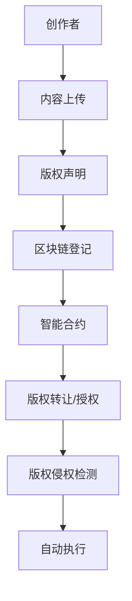

                 

关键词：区块链、版权保护、数字内容、智能合约、分布式账本、版权认证、数据隐私、透明性、安全性、智能合约执行。

> 摘要：本文旨在探讨区块链技术在版权保护中的应用，分析其在数字内容管理中的独特优势，阐述其如何通过去中心化、透明性和安全性的特点，改变传统版权保护模式，为数字内容的创作、分发和使用带来新的范式。

## 1. 背景介绍

随着互联网和数字技术的快速发展，数字内容的创作和传播变得日益便捷。然而，这一趋势也带来了版权保护的挑战。传统的版权保护手段，如版权声明、合同管理和法律诉讼，虽然在一定程度上能够保护创作者的权益，但仍然存在一些不足：

- **版权归属不清**：在复杂的数字内容创作过程中，多个创作者和参与者共同贡献，使得版权归属变得复杂。
- **维权成本高**：当版权被侵犯时，进行法律维权通常需要大量的时间和金钱，尤其是对于小型创作者和独立制作人。
- **透明性不足**：传统的版权管理系统缺乏透明性，难以追踪内容的版权流转历史。
- **中心化风险**：集中式的版权管理系统容易成为攻击目标，一旦系统被攻破，后果不堪设想。

为解决这些挑战，区块链技术应运而生。区块链以其去中心化、不可篡改和透明性的特点，为版权保护提供了新的思路。通过区块链，创作者和版权方可以更加便捷地管理、追踪和验证其版权信息，从而提高版权保护的效果和效率。

## 2. 核心概念与联系

### 2.1 区块链技术概述

区块链技术是一种分布式数据库技术，通过去中心化的方式实现了数据的存储和传输。区块链的核心特点包括：

- **去中心化**：区块链不是由单一机构或个人控制，而是通过分布式网络共同维护。
- **不可篡改**：一旦数据被记录在区块链上，就难以被篡改。
- **透明性**：区块链上的所有交易都是公开透明的，参与者可以实时查看。

### 2.2 智能合约

智能合约是基于区块链的自动化协议，其运行在区块链上，可以自动执行预先设定的规则和条款。智能合约的出现，使得版权管理更加高效和自动化。

### 2.3 核心概念原理与架构

为了更好地理解区块链在版权保护中的应用，以下是一个简化的 Mermaid 流程图：



### 2.4 区块链在版权保护中的优势

- **去中心化**：区块链的去中心化特点，使得版权信息不会被单一机构控制，从而降低了版权管理的风险。
- **不可篡改**：区块链上的信息一旦记录，就难以被篡改，从而确保了版权信息的真实性和完整性。
- **透明性**：所有版权信息都记录在区块链上，参与者可以实时查看，提高了版权管理的透明度。

## 3. 核心算法原理 & 具体操作步骤

### 3.1 算法原理概述

区块链在版权保护中的应用，主要是通过分布式账本技术，将版权信息记录在区块链上。具体操作步骤如下：

1. **内容上传**：创作者将数字内容上传至区块链。
2. **版权声明**：创作者在区块链上声明其版权信息。
3. **区块链登记**：版权信息被记录在区块链上，形成一条不可篡改的版权历史记录。
4. **智能合约**：创作者通过智能合约，设定版权转让或授权的规则。
5. **版权转让/授权**：当版权需要转让或授权时，智能合约自动执行相关操作。
6. **版权侵权检测**：系统定期检查区块链上的版权信息，发现侵权行为时，自动执行惩罚措施。

### 3.2 算法步骤详解

1. **内容上传**：创作者将数字内容上传至区块链。这一步骤可以使用哈希函数，将内容转换为一个唯一的数字指纹，以便于后续的版权管理。
2. **版权声明**：创作者在区块链上声明其版权信息，包括作品名称、创作者姓名、创作时间等。
3. **区块链登记**：版权信息被记录在区块链上，形成一条不可篡改的版权历史记录。
4. **智能合约**：创作者通过智能合约，设定版权转让或授权的规则。智能合约可以自动执行版权转让或授权操作，提高效率。
5. **版权转让/授权**：当版权需要转让或授权时，智能合约自动执行相关操作，例如将版权转移至新的所有者或授予他人使用权限。
6. **版权侵权检测**：系统定期检查区块链上的版权信息，发现侵权行为时，自动执行惩罚措施，例如禁止侵权者的访问权限或收取罚款。

### 3.3 算法优缺点

- **优点**：
  - **去中心化**：去中心化的特点，使得版权信息不会被单一机构控制，降低了风险。
  - **不可篡改**：区块链上的信息一旦记录，就难以被篡改，确保了版权信息的真实性和完整性。
  - **透明性**：所有版权信息都记录在区块链上，参与者可以实时查看，提高了透明度。

- **缺点**：
  - **复杂度**：区块链技术的复杂度较高，对于非技术人士来说，理解和应用具有一定的难度。
  - **性能瓶颈**：当前的区块链技术，如比特币和以太坊，在处理大量交易时，存在性能瓶颈。

### 3.4 算法应用领域

- **数字内容创作与分发**：创作者可以通过区块链技术，轻松地管理和追踪其数字内容的版权信息。
- **数字版权交易平台**：区块链可以提供一个去中心化的数字版权交易平台，方便创作者和版权方进行交易。
- **数字媒体行业**：区块链技术可以用于数字媒体行业的版权管理，提高版权保护的效率和透明度。

## 4. 数学模型和公式 & 详细讲解 & 举例说明

### 4.1 数学模型构建

在区块链版权保护中，一个关键的数学模型是哈希函数。哈希函数是一种将任意长度的输入转换成固定长度的输出的函数，其特点是输出值具有唯一性。例如，SHA-256 是一种常用的哈希函数，可以将输入的任意长度的数据转换为一个 256 位的输出值。

### 4.2 公式推导过程

假设我们有一个输入值 `x`，通过 SHA-256 哈希函数，我们可以得到一个输出值 `y`：

\[ y = SHA-256(x) \]

其中，`SHA-256` 是一个哈希函数，`x` 是输入值，`y` 是输出值。

### 4.3 案例分析与讲解

例如，假设一位创作者创作了一篇名为“区块链与版权保护”的文章，我们可以使用 SHA-256 哈希函数，得到这篇文章的哈希值：

```plaintext
输入值：区块链与版权保护
输出值：4f4b078889a9303e1f6e86a536c0c58a6a5a551d
```

这个哈希值可以作为这篇文章的唯一标识符，用于版权管理。每当这篇文章的内容被修改时，其哈希值也会发生变化，从而确保版权信息的真实性和完整性。

## 5. 项目实践：代码实例和详细解释说明

### 5.1 开发环境搭建

为了实践区块链在版权保护中的应用，我们需要搭建一个区块链开发环境。这里，我们可以使用以太坊平台，其上的智能合约开发工具 Solidity，可以方便地实现版权管理的功能。

### 5.2 源代码详细实现

以下是一个简单的以太坊智能合约，用于实现版权声明和版权转让的功能：

```solidity
pragma solidity ^0.8.0;

contract CopyrightManagement {
    // 存储版权信息
    mapping(bytes32 => string) public copyrights;

    // 声明版权
    function declareCopyright(bytes32 contentHash, string memory title) public {
        require(copyrights[contentHash] == "", "版权已声明");
        copyrights[contentHash] = title;
    }

    // 转让版权
    function transferCopyright(bytes32 contentHash, address newOwner) public {
        require(copyrights[contentHash] != "", "版权未声明");
        address oldOwner = ownerOf(contentHash);
        require(msg.sender == oldOwner, "无权转让");
        copyrights[contentHash] = newOwner;
    }

    // 查询版权
    function queryCopyright(bytes32 contentHash) public view returns (address owner) {
        require(copyrights[contentHash] != "", "版权未声明");
        return copyrights[contentHash];
    }
}
```

### 5.3 代码解读与分析

这个智能合约实现了版权声明、版权转让和查询版权的功能。其中：

- `declareCopyright` 函数用于声明版权，输入参数包括内容的哈希值和作品标题。函数通过 `require` 语句，确保版权未被声明，并记录版权信息。
- `transferCopyright` 函数用于转让版权，输入参数包括内容的哈希值和新所有者的地址。函数通过 `require` 语句，确保版权已被声明，且当前发送者有权转让。
- `queryCopyright` 函数用于查询版权，输入参数为内容的哈希值，输出参数为所有者的地址。

通过这个智能合约，创作者可以轻松地管理其数字内容的版权，提高版权保护的效率和透明度。

### 5.4 运行结果展示

在以太坊区块链上部署这个智能合约后，我们可以通过区块链浏览器，查看版权声明、版权转让和查询版权的运行结果。例如：

- **版权声明**：创作者通过调用 `declareCopyright` 函数，将版权信息记录在区块链上。
- **版权转让**：创作者通过调用 `transferCopyright` 函数，将版权转让给新的所有者。
- **查询版权**：任何人通过调用 `queryCopyright` 函数，可以查询版权信息。

## 6. 实际应用场景

### 6.1 数字内容创作与分发

区块链技术可以用于数字内容创作与分发的版权保护。创作者可以通过区块链，声明其作品的版权信息，确保版权归属明确，减少版权纠纷。

### 6.2 数字版权交易平台

区块链可以构建一个去中心化的数字版权交易平台，创作者和版权方可以直接在平台上进行交易，降低交易成本，提高交易效率。

### 6.3 数字媒体行业

区块链技术可以用于数字媒体行业的版权管理，提高版权保护的透明度和效率，减少侵权行为的发生。

### 6.4 未来应用展望

随着区块链技术的不断发展，其在版权保护中的应用将更加广泛和深入。未来，区块链可以与人工智能、大数据等技术结合，为版权保护提供更加智能和高效的解决方案。

## 7. 工具和资源推荐

### 7.1 学习资源推荐

- 《区块链技术指南》
- 《智能合约设计与开发》
- 《以太坊从入门到精通》

### 7.2 开发工具推荐

- Ethereum Studio
- Remix Online
- Truffle Framework

### 7.3 相关论文推荐

- "Blockchain Technology: A Comprehensive Overview"
- "Smart Contracts: The New Interface to the Blockchain"
- "Blockchain for Copyright Management: Opportunities and Challenges"

## 8. 总结：未来发展趋势与挑战

### 8.1 研究成果总结

区块链技术在版权保护中展示出其独特的优势，包括去中心化、透明性和安全性。通过智能合约，版权管理变得更加高效和自动化。然而，区块链技术仍面临一些挑战，如性能瓶颈和用户门槛。

### 8.2 未来发展趋势

未来，区块链技术在版权保护中的应用将更加广泛，结合人工智能、大数据等技术，提供更加智能和高效的解决方案。

### 8.3 面临的挑战

区块链技术需要解决性能瓶颈、隐私保护和用户友好性等问题，以更好地服务于版权保护的需求。

### 8.4 研究展望

未来，区块链技术在版权保护中的应用将不断深化，为数字内容的创作、分发和使用带来新的范式。

## 9. 附录：常见问题与解答

### Q：区块链在版权保护中的优势是什么？

A：区块链在版权保护中的优势主要包括去中心化、透明性和安全性。去中心化使得版权信息不会被单一机构控制，降低了风险。透明性提高了版权管理的透明度，所有版权信息都记录在区块链上，参与者可以实时查看。安全性确保了版权信息的真实性和完整性，一旦记录在区块链上，信息就难以被篡改。

### Q：区块链在版权保护中的应用有哪些？

A：区块链在版权保护中的应用包括数字内容创作与分发的版权保护、数字版权交易平台和数字媒体行业的版权管理。通过区块链，创作者可以轻松地管理和追踪其数字内容的版权信息，降低版权纠纷的风险。

### Q：区块链技术如何提高版权保护的效率？

A：区块链技术通过去中心化、透明性和安全性的特点，提高了版权保护的效率。去中心化使得版权信息不会被单一机构控制，降低了管理成本。透明性提高了版权管理的透明度，参与者可以实时查看版权信息，减少了纠纷。安全性确保了版权信息的真实性和完整性，一旦记录在区块链上，信息就难以被篡改，提高了维权效率。

### 作者署名：禅与计算机程序设计艺术 / Zen and the Art of Computer Programming
----------------------------------------------------------------

