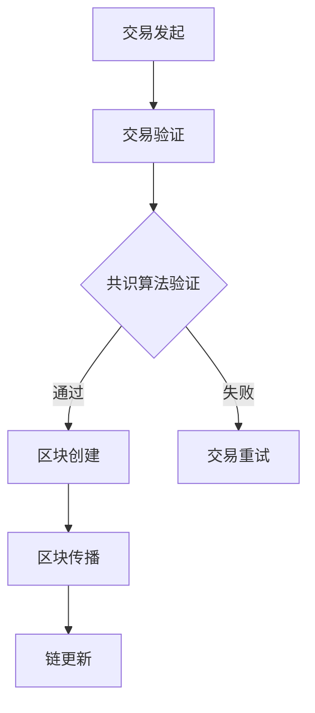
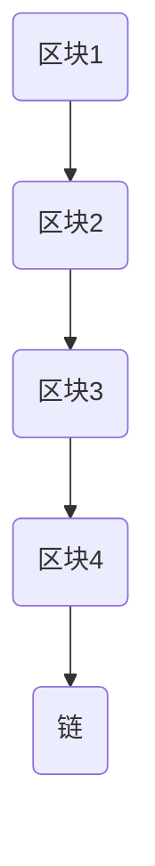

                 

关键词：区块链、去中心化、智能合约、共识算法、分布式账本、加密技术、安全性、去中心化应用（DApp）

> 摘要：本文将深入探讨区块链技术的核心概念、原理和应用，特别是去中心化应用（DApp）的开发。我们将了解区块链如何实现数据的安全存储和传输，以及如何通过智能合约自动化执行合同条款。通过具体的实例和分析，我们将展示区块链技术的实际应用场景，并展望其未来发展的趋势和挑战。

## 1. 背景介绍

区块链技术是一种分布式数据库技术，其特点是不可篡改、透明性和去中心化。区块链由一系列按时间顺序排列的区块组成，每个区块包含一定数量的交易记录，并通过加密技术保证数据的完整性和安全性。自2008年比特币的提出以来，区块链技术受到了广泛关注，并在金融、供应链、医疗、艺术等多个领域得到应用。

去中心化应用（DApp）是基于区块链技术开发的去中心化应用程序。与传统的中心化应用程序不同，DApp不需要中心化的服务器或单一点来管理数据，因此具有较高的安全性和透明度。去中心化应用通过智能合约来实现应用程序的逻辑，智能合约是自动执行合同条款的计算机程序。

## 2. 核心概念与联系

### 2.1 区块链的工作原理

区块链的工作原理可以通过以下 Mermaid 流程图来解释：



### 2.2 区块与链的关系

区块链由一系列按时间顺序排列的区块组成，每个区块包含一定数量的交易记录。区块与链的关系可以用下图表示：



## 3. 核心算法原理 & 具体操作步骤

### 3.1 算法原理概述

区块链技术中最重要的算法之一是共识算法。共识算法是区块链网络中的节点如何就账本的状态达成一致的方法。常见的共识算法包括工作量证明（PoW）、权益证明（PoS）和委托权益证明（DPoS）。

### 3.2 算法步骤详解

1. **交易发起**：用户在区块链网络中发起交易。
2. **交易验证**：交易需要通过网络中的节点进行验证，验证过程包括确认交易的有效性和交易的余额。
3. **共识算法验证**：验证交易后，节点通过共识算法就交易是否应被添加到区块链进行投票。
4. **区块创建**：如果交易被大多数节点验证通过，节点将创建一个新的区块，并将交易添加到区块中。
5. **区块传播**：新的区块在网络中传播，其他节点验证区块的有效性。
6. **链更新**：一旦区块被网络确认，区块链将更新，新的交易记录将被永久保存。

### 3.3 算法优缺点

- **工作量证明（PoW）**：优点是去中心化，缺点是能源消耗大，效率低。
- **权益证明（PoS）**：优点是能源消耗低，效率高，缺点是可能导致富者恒富。
- **委托权益证明（DPoS）**：优点是交易速度快，缺点是可能导致集中化风险。

### 3.4 算法应用领域

共识算法在区块链技术中具有广泛的应用，从数字货币如比特币到智能合约平台如以太坊，共识算法都是不可或缺的一部分。

## 4. 数学模型和公式 & 详细讲解 & 举例说明

### 4.1 数学模型构建

区块链中的数学模型主要涉及加密技术和哈希函数。加密技术用于确保数据传输的安全性和隐私性，而哈希函数则用于确保数据的完整性和不可篡改性。

### 4.2 公式推导过程

- **加密技术**：加密过程可以通过以下公式表示：
  $$ C = E(K, P) $$
  其中，$C$ 是加密后的文本，$K$ 是密钥，$E$ 是加密函数，$P$ 是原始文本。
- **哈希函数**：哈希函数可以将任意长度的输入映射为固定长度的输出，例如：
  $$ H = Hash(P) $$
  其中，$H$ 是哈希值，$P$ 是输入文本。

### 4.3 案例分析与讲解

以比特币的挖矿过程为例，矿工需要找到一个满足特定条件的哈希值。挖矿过程可以通过以下步骤进行：

1. 矿工选择一个随机数作为输入。
2. 对随机数进行哈希运算，得到哈希值。
3. 检查哈希值是否满足特定条件（例如，哈希值必须小于目标值）。
4. 如果哈希值不满足条件，矿工将增加随机数并重复步骤2和3。

## 5. 项目实践：代码实例和详细解释说明

### 5.1 开发环境搭建

在开始编写区块链代码之前，我们需要搭建一个开发环境。我们可以使用Go语言和Hyperledger Fabric框架来构建一个简单的区块链网络。

### 5.2 源代码详细实现

以下是使用Hyperledger Fabric框架创建区块链网络的基本步骤：

```go
package main

import (
    "fmt"
    "github.com/hyperledger/fabric-chaincode-go/fabcomm"
    "github.com/hyperledger/fabric-chaincode-go/shim"
)

// 定义智能合约
type MyChaincode struct {
}

// 初始化智能合约
func (t *MyChaincode) Init(ctx shim.ChaincodeContext) (string, error) {
    // 初始化区块链
    return "OK", nil
}

// 处理交易
func (t *MyChaincode) Invoke(ctx shim.ChaincodeContext) (string, error) {
    // 获取交易参数
    args := ctx.Args()
    // 处理交易
    return "OK", nil
}

// 查询账本
func (t *MyChaincode) Query(ctx shim.ChaincodeContext) (string, error) {
    // 查询账本数据
    return "OK", nil
}

func main() {
    // 启动区块链网络
    err := fabcomm.StartChaincode(&MyChaincode{})
    if err != nil {
        fmt.Println("Error starting chaincode:", err)
        return
    }
}
```

### 5.3 代码解读与分析

上述代码定义了一个简单的智能合约，它包含三个主要方法：`Init`、`Invoke` 和 `Query`。`Init` 方法用于初始化区块链，`Invoke` 方法用于处理交易，`Query` 方法用于查询账本数据。

### 5.4 运行结果展示

运行上述代码后，我们将启动一个简单的区块链网络。在这个网络中，我们可以执行交易并查询账本数据。

## 6. 实际应用场景

区块链技术已经在多个领域得到应用，以下是一些实际应用场景：

- **金融**：数字货币如比特币和以太坊是区块链技术的典型应用。
- **供应链**：区块链可以确保供应链的透明性和可信度。
- **医疗**：区块链可以用于记录和管理医疗数据，确保数据的安全性和隐私性。
- **艺术**：区块链可以用于数字艺术作品的认证和版权管理。

## 7. 工具和资源推荐

### 7.1 学习资源推荐

- 《精通区块链》
- 《区块链原理、设计与应用》
- 《区块链：从数字货币到智能合约》

### 7.2 开发工具推荐

- Hyperledger Fabric
- Ethereum
- Bitcoin

### 7.3 相关论文推荐

- 《区块链：一个分布式账本的共识机制》
- 《比特币：一种点对点的电子现金系统》
- 《智能合约：设计与实现》

## 8. 总结：未来发展趋势与挑战

### 8.1 研究成果总结

区块链技术已经在多个领域取得显著成果，如数字货币、供应链和医疗等。然而，区块链技术仍然面临一些挑战，如性能优化、安全性提升和隐私保护等。

### 8.2 未来发展趋势

区块链技术在未来有望在更多领域得到应用，如物联网、智能城市和金融科技等。此外，混合型区块链（结合中心化和去中心化特性）也将成为研究热点。

### 8.3 面临的挑战

区块链技术面临的挑战包括性能瓶颈、隐私保护、共识算法优化和跨链互操作性等。

### 8.4 研究展望

随着技术的不断发展，区块链技术将在未来发挥更大的作用。研究者需要关注性能优化、安全性提升和隐私保护等关键问题，以推动区块链技术的广泛应用。

## 9. 附录：常见问题与解答

### 9.1 区块链与数据库有什么区别？

区块链与数据库的主要区别在于数据存储方式、数据一致性和去中心化程度。区块链是一种分布式数据库，每个节点都存储完整的数据副本，而数据库通常由中心化的服务器管理。

### 9.2 智能合约会存在漏洞吗？

智能合约是计算机程序，同样可能存在漏洞。研究者已经发现并修复了许多智能合约漏洞，但新的漏洞仍然可能出现。因此，智能合约开发需要严格的测试和审查。

### 9.3 区块链技术能否彻底解决隐私问题？

区块链技术可以提供一定的隐私保护，但无法彻底解决隐私问题。区块链中的数据是公开可查的，因此对于需要高度隐私保护的应用场景，仍需采用额外的隐私保护技术。

作者：禅与计算机程序设计艺术 / Zen and the Art of Computer Programming
----------------------------------------------------------------

