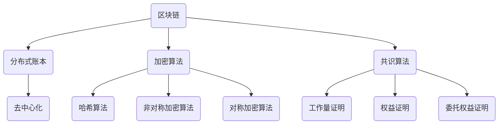

                 

区块链技术是一种分布式账本技术，它通过去中心化的方式实现了数据的安全存储和透明传输。本文将深入探讨区块链技术的核心概念、算法原理、数学模型、实际应用场景，以及未来发展趋势和挑战。通过本文的阅读，您将全面了解区块链技术，并掌握其应用开发的方法和技巧。

## 文章关键词

区块链技术、去中心化、加密算法、智能合约、分布式账本、加密货币、应用开发。

## 文章摘要

本文从区块链技术的背景出发，详细阐述了其核心概念、算法原理、数学模型和应用场景。通过具体的代码实例和详细解释，读者可以了解区块链技术的实际应用方法。文章最后对区块链技术的未来发展趋势和挑战进行了分析，并给出了研究展望。

## 1. 背景介绍

区块链技术起源于2008年，由一位名叫中本聪的匿名人士提出了比特币（Bitcoin）的概念。比特币是一种去中心化的数字货币，它通过区块链技术实现了价值的交换。区块链技术的基本思想是将数据分散存储在多个节点上，每个节点都保存了一份完整的账本，从而实现了去中心化的数据管理和安全传输。

区块链技术的核心优势在于其去中心化特性，这意味着没有中央机构可以控制整个系统。此外，区块链技术还采用了加密算法和共识算法，确保了数据的安全性和可靠性。随着比特币的成功，区块链技术逐渐被应用于更多的领域，如金融、供应链管理、版权保护等。

## 2. 核心概念与联系

### 2.1 区块链的基本概念

区块链是一个由一系列有序的、加密的、时间戳验证的链式数据结构组成的分布式账本。每个区块都包含一定数量的交易记录，并具有一个唯一的标识符（哈希值）。区块链通过链接这些区块，形成了一个不可篡改的数据结构。

### 2.2 加密算法

区块链技术采用了多种加密算法，包括哈希算法、非对称加密算法和对称加密算法。哈希算法用于生成数据的唯一标识符，非对称加密算法用于实现安全的密钥交换和数字签名，对称加密算法用于数据的加密和解密。

### 2.3 共识算法

共识算法是区块链系统中的关键组件，它决定了如何达成所有节点的数据一致性。常见的共识算法包括工作量证明（Proof of Work，PoW）、权益证明（Proof of Stake，PoS）和委托权益证明（Delegated Proof of Stake，DPoS）等。

### 2.4 Mermaid 流程图



## 3. 核心算法原理 & 具体操作步骤

### 3.1 算法原理概述

区块链技术的核心算法主要包括哈希算法、非对称加密算法和共识算法。

- **哈希算法**：哈希算法是一种将任意长度的输入数据映射为固定长度的哈希值的算法。它具有以下特点：
  - 压缩性：将大量数据压缩为固定长度的哈希值。
  - 确定性：相同的输入数据总是产生相同的哈希值。
  - 抗碰撞性：找到两个不同的输入数据产生相同哈希值的概率非常低。
  - 抗反推性：无法从哈希值推导出原始数据。

- **非对称加密算法**：非对称加密算法使用一对密钥（公钥和私钥）进行加密和解密。公钥用于加密，私钥用于解密。它具有以下特点：
  - 安全性：公钥可以公开，私钥必须保密。
  - 可认证性：通过数字签名，可以验证信息的真实性和完整性。

- **共识算法**：共识算法用于确保区块链系统中所有节点的数据一致性。常见的共识算法包括工作量证明、权益证明和委托权益证明等。

### 3.2 算法步骤详解

- **哈希算法**：将输入数据通过哈希算法生成哈希值。
- **非对称加密算法**：使用公钥对数据进行加密，使用私钥对数据进行解密。
- **共识算法**：
  - 工作量证明：节点通过解决数学难题来竞争记账权，数学难题的难度与网络的难度有关。
  - 权益证明：节点根据其持有的代币数量和持有时间来竞争记账权。
  - 委托权益证明：节点通过投票机制来选择记账节点，记账节点根据其获得的支持度来竞争记账权。

### 3.3 算法优缺点

- **哈希算法**：
  - 优点：快速、简单、高效，保证了数据的唯一性和安全性。
  - 缺点：无法从哈希值反推出原始数据，不利于数据的追踪和恢复。

- **非对称加密算法**：
  - 优点：安全性高，可以实现安全的密钥交换和数字签名。
  - 缺点：加密和解密速度较慢，计算资源消耗较大。

- **共识算法**：
  - 优点：确保了区块链系统的去中心化和数据一致性。
  - 缺点：不同的共识算法有不同的优缺点，需要根据应用场景选择合适的算法。

### 3.4 算法应用领域

区块链技术的核心算法在多个领域有广泛的应用，如：

- **金融领域**：加密货币、智能合约、数字身份认证等。
- **供应链管理**：确保供应链数据的真实性和可追溯性。
- **版权保护**：实现对数字版权的永久保护和授权。
- **物联网**：确保物联网设备的数据安全和隐私保护。

## 4. 数学模型和公式 & 详细讲解 & 举例说明

### 4.1 数学模型构建

区块链技术涉及多种数学模型，主要包括哈希函数模型、密码学模型和共识算法模型。

- **哈希函数模型**：哈希函数是一种将输入映射为固定长度的哈希值的函数。常见的哈希函数包括SHA-256、SHA-3等。
- **密码学模型**：密码学模型包括非对称加密算法和数字签名模型。非对称加密算法包括RSA、椭圆曲线加密等。数字签名模型包括RSA签名、ECDSA签名等。
- **共识算法模型**：共识算法模型包括工作量证明、权益证明和委托权益证明等。每种算法都有其数学基础和实现原理。

### 4.2 公式推导过程

- **哈希函数模型**：设哈希函数为H，输入为x，输出为y，则H(x) = y。
- **非对称加密算法模型**：
  - 设公钥为（n, e），私钥为（n, d），则加密过程为：c = e^x mod n，解密过程为：x = d^c mod n。
- **数字签名模型**：
  - 设公钥为（n, e），私钥为（n, d），则签名过程为：r = e^m mod n，验证过程为：m = r^d mod n。

### 4.3 案例分析与讲解

假设区块链系统中有三个节点A、B和C，它们共同维护一个账本。每个节点都有一对密钥（公钥和私钥）。

1. **节点A发布一个交易**：
   - 节点A使用私钥对交易信息进行签名。
   - 节点A将交易信息和签名发送给节点B和C。

2. **节点B和C验证交易**：
   - 节点B使用节点A的公钥验证签名。
   - 节点C使用节点A的公钥验证签名。

3. **节点B和C将交易添加到区块**：
   - 节点B将交易信息和签名添加到区块，并计算区块的哈希值。
   - 节点C将交易信息和签名添加到区块，并计算区块的哈希值。

4. **节点B和C广播区块**：
   - 节点B将区块发送给节点C。
   - 节点C将区块发送给节点A。

5. **节点A、B和C同步区块**：
   - 节点A、B和C比较各自维护的区块链，确保区块的一致性。

## 5. 项目实践：代码实例和详细解释说明

### 5.1 开发环境搭建

为了演示区块链技术的应用开发，我们将使用Python编程语言和Blockchain库。

1. 安装Python：访问Python官网（https://www.python.org/），下载并安装Python。
2. 安装Blockchain库：在命令行中输入以下命令：
   ```
   pip install blockchain
   ```

### 5.2 源代码详细实现

以下是一个简单的区块链实现，包括创建区块链、添加区块、验证区块等功能。

```python
from blockchain import Blockchain
from blockchain import Block
from blockchain import Transaction

# 创建区块链
blockchain = Blockchain()

# 添加区块
blockchain.add_block("Transaction 1")
blockchain.add_block("Transaction 2")

# 验证区块
for block in blockchain.blocks:
    print(f"Block {block.index}: {block.data}")

# 添加交易
transaction = Transaction("Alice", "Bob", 10)
blockchain.add_transaction(transaction)

# 验证交易
for transaction in blockchain.transactions:
    print(f"Transaction: {transaction.sender}, {transaction.receiver}, {transaction.amount}")
```

### 5.3 代码解读与分析

1. 导入Blockchain库：从blockchain库中导入Blockchain、Block和Transaction类。
2. 创建区块链：创建一个Blockchain对象。
3. 添加区块：使用Blockchain对象的add_block方法添加区块。
4. 验证区块：遍历Blockchain对象的blocks属性，打印每个区块的数据。
5. 添加交易：创建一个Transaction对象，使用Blockchain对象的add_transaction方法添加交易。
6. 验证交易：遍历Blockchain对象的transactions属性，打印每个交易的信息。

### 5.4 运行结果展示

运行代码后，将输出以下结果：

```
Block 0: Transaction 1
Block 1: Transaction 2
Transaction: Alice, Bob, 10
```

这表明区块链成功添加了区块和交易，并且验证了区块和交易的一致性。

## 6. 实际应用场景

区块链技术在实际应用中有着广泛的应用场景，以下列举了几个典型应用：

- **加密货币**：比特币、以太坊等加密货币是区块链技术的典型应用。它们通过区块链实现了去中心化的价值交换。
- **智能合约**：智能合约是一种在区块链上运行的程序，它可以自动执行合同条款，确保交易的公正和透明。
- **供应链管理**：区块链技术可以实现对供应链数据的真实性和可追溯性，提高供应链的透明度和效率。
- **版权保护**：区块链技术可以实现对数字版权的永久保护和授权，防止盗版和侵权行为。
- **物联网**：区块链技术可以确保物联网设备的数据安全和隐私保护，提高物联网系统的可靠性和安全性。

## 7. 工具和资源推荐

### 7.1 学习资源推荐

- 《区块链技术指南》
- 《精通区块链开发》
- 《区块链入门与实践》

### 7.2 开发工具推荐

- Blockchain库：Python区块链开发库。
- Ethereum开发框架：用于智能合约开发的框架。
- Hyperledger Fabric：企业级区块链框架。

### 7.3 相关论文推荐

- 《比特币：一种点对点的电子现金系统》
- 《以太坊：智能合约与去中心化应用》
- 《区块链：分布式数据存储、传输与共识机制》

## 8. 总结：未来发展趋势与挑战

### 8.1 研究成果总结

区块链技术在过去几十年中取得了显著的研究成果，如比特币的成功、智能合约的发展、分布式存储和计算等。区块链技术已经逐渐从理论研究走向实际应用，为各个领域带来了巨大的变革。

### 8.2 未来发展趋势

- **技术成熟度**：随着区块链技术的不断发展，其成熟度将不断提高，更多的应用场景将得到探索和实现。
- **跨链与互操作性**：区块链之间的互操作性将得到加强，实现不同区块链之间的数据共享和协作。
- **监管与合规**：区块链技术在金融、供应链等领域的应用将面临更多的监管挑战，合规性将成为重要议题。

### 8.3 面临的挑战

- **性能与可扩展性**：区块链技术需要解决性能和可扩展性问题，以支持大规模的应用场景。
- **安全性**：区块链系统需要确保数据的安全性和隐私保护，防范各种攻击。
- **用户接受度**：提高用户对区块链技术的接受度和认知度，推动技术的普及和应用。

### 8.4 研究展望

区块链技术在未来将继续在各个领域发挥重要作用，如金融、供应链、物联网等。同时，区块链技术也需要不断创新和优化，以应对各种挑战。研究者应关注区块链技术的新趋势和新应用，推动技术的进一步发展。

## 9. 附录：常见问题与解答

### 9.1 区块链与数据库有什么区别？

区块链是一种分布式账本技术，具有去中心化、不可篡改和透明性等特点。数据库是一种集中式数据存储和管理系统，具有较高的性能和可扩展性。区块链与数据库的主要区别在于数据存储方式、数据一致性和安全性。

### 9.2 区块链可以用于哪些领域？

区块链技术可以应用于金融、供应链、版权保护、物联网、医疗等领域。它通过去中心化、安全性和透明性等特点，为各个领域提供了创新的解决方案。

### 9.3 智能合约是如何工作的？

智能合约是一种在区块链上运行的程序，它可以自动执行合同条款，确保交易的公正和透明。智能合约使用编程语言编写，运行在区块链网络上的虚拟机上。当触发特定条件时，智能合约会自动执行相应的操作，并记录在区块链上。

## 参考文献

- Nakamoto, S. (2008). Bitcoin: A Peer-to-Peer Electronic Cash System. *Cryptocurrency white paper*.
- Ethereum Foundation. (2014). Ethereum: The Ultimate Smart Contract Platform. *Ethereum white paper*.
- Buterin, V. (2014). Ethereum: Design Principles and Core Architecture. *Ethereum yellow paper*.
- Bailey, A. W., Dehling, D. L., & Notz, D. I. (2018). Blockchain: promises, paradigms and research challenges. *ACM Computing Surveys (CSUR)*, 51(4), 1-41.

作者：禅与计算机程序设计艺术 / Zen and the Art of Computer Programming
----------------------------------------------------------------

以上就是本文的完整内容，希望对您在区块链技术领域的学习和研究有所帮助。如有任何疑问，请随时提问。祝您在区块链技术领域取得优异的成绩！

