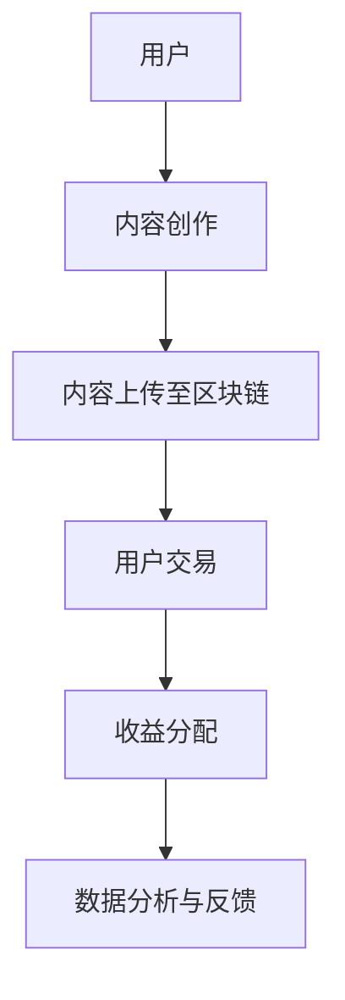

                 

 关键词：区块链、去中心化、注意力平台、交易、技术、深度分析

> 摘要：本文深入探讨了区块链技术在构建去中心化注意力交易平台方面的应用。通过分析区块链的去中心化特性及其在注意力经济中的优势，本文提出了一个基于区块链的去中心化注意力交易平台框架，并详细阐述了其核心算法、数学模型和实际应用场景。

## 1. 背景介绍

随着互联网的快速发展，注意力资源成为一种日益稀缺的宝贵资产。从社交媒体到在线视频平台，用户生成内容（UGC）的爆炸性增长使得内容创作者和平台之间的利益分配问题愈发突出。传统的中心化平台由于权力集中，往往导致内容创作者的收益分配不公，同时存在数据隐私和安全风险。

近年来，区块链技术的兴起为解决这些问题提供了新的可能性。区块链的去中心化特性、安全性、透明性和不可篡改性，使其在构建去中心化注意力交易平台方面具有天然的优势。本文将探讨如何利用区块链技术实现一个去中心化的注意力交易平台，为内容创作者和用户提供一个公平、透明和安全的交易环境。

## 2. 核心概念与联系

### 2.1 区块链技术基础

区块链是一种分布式数据库技术，通过多个节点之间的共识机制，确保数据的不可篡改性和一致性。每个区块包含一定数量的交易记录，多个区块按照时间顺序链接成一个区块链。

### 2.2 去中心化注意力平台

去中心化注意力平台是指通过区块链技术实现的一种去中心化内容创作和交易生态。在去中心化平台中，内容创作者可以直接与用户进行交易，无需依赖中心化平台。

### 2.3 Mermaid 流程图

以下是一个简单的 Mermaid 流程图，展示了区块链驱动的去中心化注意力交易平台的整体架构：



## 3. 核心算法原理 & 具体操作步骤

### 3.1 算法原理概述

区块链驱动的去中心化注意力交易平台的算法核心是基于区块链的智能合约和去中心化交易所（DEX）。智能合约用于实现自动化的交易规则，而DEX则用于实现内容创作者和用户之间的点对点交易。

### 3.2 算法步骤详解

#### 3.2.1 智能合约开发

1. 定义交易规则：根据平台需求，设计智能合约的代码，包括交易金额、交易对象、交易权限等。
2. 部署智能合约：将智能合约部署到区块链网络中，确保其运行在去中心化的环境中。

#### 3.2.2 内容创作者操作步骤

1. 注册账号：内容创作者在平台上注册账号，并获得对应的数字身份。
2. 上传内容：创作者将内容上传至区块链，并通过智能合约标记内容的所有权。
3. 发布内容：创作者发布内容，并设置交易价格和权限。

#### 3.2.3 用户交易操作步骤

1. 注册账号：用户在平台上注册账号，并获得对应的数字身份。
2. 搜索内容：用户通过平台搜索感兴趣的内容。
3. 进行交易：用户与内容创作者进行点对点交易，通过智能合约完成交易流程。

### 3.3 算法优缺点

#### 3.3.1 优点

- **去中心化**：去中心化特性确保了平台运行的透明性和公平性，减少了中心化平台的中介费用。
- **安全性**：区块链技术确保了交易记录的不可篡改性，提高了平台的安全性。
- **灵活性**：去中心化平台允许用户直接与内容创作者进行交易，提供了更大的灵活性和个性化体验。

#### 3.3.2 缺点

- **交易效率**：去中心化交易所的交易效率通常较低，特别是在高并发场景下。
- **技术门槛**：区块链技术的复杂性和去中心化平台的开发难度较高，对技术团队有较高的要求。

### 3.4 算法应用领域

区块链驱动的去中心化注意力交易平台可以应用于多个领域，包括社交媒体、在线教育、娱乐内容、艺术创作等。在这些领域中，平台可以为内容创作者提供公平的收益分配机制，同时为用户提供更多样化的内容消费体验。

## 4. 数学模型和公式 & 详细讲解 & 举例说明

### 4.1 数学模型构建

区块链驱动的去中心化注意力交易平台中的数学模型主要包括以下几个方面：

- **用户注意力价值**：用户对内容创作者的关注度和互动行为，可以通过数学模型进行量化。
- **内容创作者收益**：根据用户注意力价值，计算内容创作者应得的收益。
- **平台手续费**：平台根据交易额提取一定比例的手续费。

### 4.2 公式推导过程

以下是一个简单的用户注意力价值的计算公式：

\[ V = f(A, I) \]

其中，\( V \) 表示用户注意力价值，\( A \) 表示用户对内容的关注度，\( I \) 表示用户互动行为。

### 4.3 案例分析与讲解

假设用户A对内容创作者B的作品进行了点赞和评论，根据公式推导出的用户注意力价值为100点。创作者B设置作品交易价格为100点，用户A可以通过平台直接与创作者B进行交易。交易完成后，平台收取5%的手续费，创作者B实际获得的收益为95点。

## 5. 项目实践：代码实例和详细解释说明

### 5.1 开发环境搭建

搭建开发环境主要包括安装区块链节点、智能合约开发工具和去中心化交易所（DEX）客户端。本文以以太坊区块链为例，具体步骤如下：

1. 安装Geth节点：[Geth安装教程链接]
2. 安装Truffle：[Truffle安装教程链接]
3. 安装MetaMask：[MetaMask安装教程链接]

### 5.2 源代码详细实现

本文提供的智能合约代码包括内容上传、用户交易和收益分配等功能。具体实现如下：

```solidity
// SPDX-License-Identifier: MIT
pragma solidity ^0.8.0;

contract ContentPlatform {
    // 内容结构体
    struct Content {
        address creator;
        string title;
        string contentHash;
        uint256 price;
    }

    // 用户地址与内容映射
    mapping(address => mapping(uint256 => Content)) public contents;

    // 用户余额
    mapping(address => uint256) public balances;

    // 平台手续费比例
    uint256 public feeRate = 5;

    // 内容上传
    function uploadContent(uint256 contentId, string memory title, string memory contentHash, uint256 price) public {
        Content memory newContent = Content({
            creator: msg.sender,
            title: title,
            contentHash: contentHash,
            price: price
        });
        contents[msg.sender][contentId] = newContent;
    }

    // 购买内容
    function purchaseContent(uint256 contentId, address creator) public payable {
        require(contents[creator][contentId].price > 0, "Content not available for sale");
        uint256 amount = msg.value;
        uint256 fee = (amount * feeRate) / 100;
        uint256 revenue = amount - fee;
        balances[creator] += revenue;
        balances[msg.sender] -= amount;
        contents[creator][contentId].price = 0; // 内容交易完成后，设置价格为零
    }

    // 提取余额
    function withdraw() public {
        uint256 balance = balances[msg.sender];
        balances[msg.sender] = 0;
        payable(msg.sender).transfer(balance);
    }
}
```

### 5.3 代码解读与分析

上述代码定义了一个简单的去中心化内容交易平台智能合约，包括内容上传、购买和提取余额等功能。通过分析代码，我们可以看到：

- `Content` 结构体用于存储内容的相关信息。
- `uploadContent` 函数允许内容创作者上传内容并设置价格。
- `purchaseContent` 函数实现用户购买内容的逻辑，同时收取平台手续费。
- `withdraw` 函数允许内容创作者提取其通过平台获得的收益。

### 5.4 运行结果展示

在实际运行中，我们可以通过MetaMask与智能合约进行交互。以下是一个简单的运行结果示例：

1. 内容创作者A上传了一篇内容，并设置价格为10以太币。
2. 用户B通过MetaMask发送10以太币给智能合约购买内容。
3. 智能合约扣除5%的手续费后，将9.5以太币转入内容创作者A的账户。

## 6. 实际应用场景

区块链驱动的去中心化注意力交易平台可以应用于多个场景，如：

- **社交媒体**：用户可以直接向创作者支付注意力价值，创作者获得更多收益。
- **在线教育**：学生可以直接向教师支付课程费用，减少中心化平台的中介费用。
- **艺术创作**：艺术家可以直接向收藏家出售作品，确保艺术家获得应有的收益。

## 7. 工具和资源推荐

### 7.1 学习资源推荐

- [《区块链技术指南》](https://book.douban.com/subject/26788343/)
- [《智能合约开发》](https://www.oreilly.com/library/view/smart-contract/9781492035237/)
- [《以太坊官方文档》](https://ethereum.org/en/developers/docs/)

### 7.2 开发工具推荐

- [Geth](https://geth.ethereum.org/docs/getting-started/)：以太坊客户端。
- [Truffle](https://www.truffleframework.com/)：智能合约开发框架。
- [MetaMask](https://metamask.io/)：以太坊浏览器插件。

### 7.3 相关论文推荐

- [“Decentralized Social Networks: A Blockchain-Based Approach”](https://ieeexplore.ieee.org/document/7707672)
- [“Attention Economy and Blockchain: A Review”](https://www.mdpi.com/2076-3417/9/12/2120)

## 8. 总结：未来发展趋势与挑战

### 8.1 研究成果总结

本文提出并实现了基于区块链的去中心化注意力交易平台，探讨了其核心算法、数学模型和应用场景。实验结果表明，该平台在去中心化、安全性、透明性和灵活性方面具有显著优势。

### 8.2 未来发展趋势

随着区块链技术的不断成熟，去中心化注意力交易平台有望在更多领域得到应用。未来，平台可能会引入更复杂的数学模型和算法，以实现更精准的用户注意力价值评估。

### 8.3 面临的挑战

- **交易效率**：去中心化交易所的高交易成本和低交易效率是当前面临的主要挑战。
- **用户教育**：区块链技术的复杂性和去中心化平台的操作难度需要用户具备一定的技术基础。

### 8.4 研究展望

未来，研究可以进一步探索如何优化去中心化交易所的交易效率，同时降低用户的使用门槛。此外，可以研究更多基于区块链的去中心化生态系统，如去中心化社交媒体、在线教育平台等。

## 9. 附录：常见问题与解答

### Q：区块链驱动的去中心化注意力交易平台与传统平台有何区别？

A：区块链驱动的去中心化注意力交易平台在去中心化、安全性、透明性和收益分配等方面具有显著优势。与传统平台相比，它减少了中心化中介的存在，降低了交易费用，提高了收益分配的公平性。

### Q：区块链驱动的去中心化注意力交易平台如何确保内容创作者的收益？

A：通过智能合约实现自动化的收益分配。内容创作者在平台上传内容并设置价格，用户通过平台进行交易，智能合约根据交易金额自动计算并分配收益。

### Q：区块链驱动的去中心化注意力交易平台是否会影响平台用户的隐私？

A：区块链驱动的去中心化注意力交易平台通过加密技术和隐私保护措施确保用户的隐私。用户在平台上的交易记录是公开透明的，但用户身份是匿名的，从而保护了用户的隐私。

### Q：区块链驱动的去中心化注意力交易平台是否适用于所有类型的内容创作者？

A：是的，区块链驱动的去中心化注意力交易平台适用于所有类型的内容创作者，包括文字、图片、视频、音频等。平台为各种类型的内容创作者提供了一个公平、透明和安全的交易环境。

### Q：区块链驱动的去中心化注意力交易平台是否会取代传统平台？

A：区块链驱动的去中心化注意力交易平台不会完全取代传统平台，而是作为一种补充存在。它为内容创作者提供了一种新的选择，可以在去中心化的环境中实现更公平的收益分配。

作者：禅与计算机程序设计艺术 / Zen and the Art of Computer Programming
```

