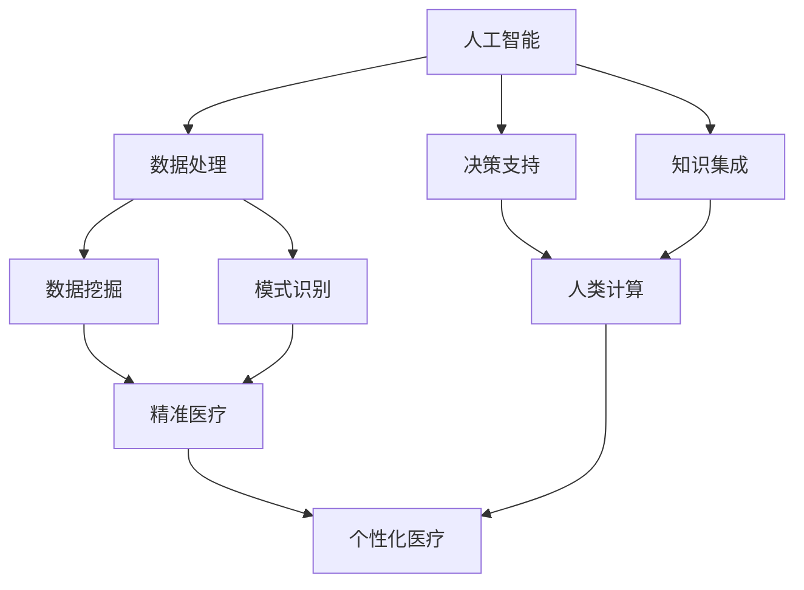

                 

关键词：医疗保健，精准医疗，人工智能，人类计算，数学模型，算法原理，应用实践，未来展望

## 摘要

随着医疗技术的飞速发展，人工智能（AI）和人类计算在医疗保健领域的融合正引领着精准医疗的革命。本文旨在探讨如何通过人类计算与AI的结合，推动医疗保健领域的进步，实现个性化、高效的诊断和治疗。文章首先回顾了医疗保健的发展历程，然后深入分析了精准医疗的概念、核心算法原理及其应用领域。接着，我们通过具体的数学模型和公式，详细讲解了算法的构建与推导过程，并辅以实际项目实践的代码实例。文章还探讨了人工智能在医疗保健中的实际应用场景，展望了未来的发展趋势与挑战。最后，我们推荐了相关学习资源和开发工具，总结了研究成果，并对未来进行了展望。

## 1. 背景介绍

医疗保健一直是人类社会发展的重要支柱之一。自古以来，人们就试图通过各种手段来预防和治疗疾病。从古代的草药疗法到现代的医学影像技术和基因编辑，医疗技术的进步极大地提高了人类的健康水平。

然而，医疗保健领域的挑战依然严峻。一方面，随着人口老龄化和生活方式的改变，慢性疾病和复杂疾病的发病率逐年上升，医疗资源紧张；另一方面，医疗信息的爆炸性增长使得医生难以在短时间内获取和处理大量的医疗数据，从而影响诊断和治疗的准确性。

在这种背景下，人工智能（AI）的崛起为医疗保健领域带来了新的希望。AI可以通过分析海量医疗数据，提供个性化的治疗方案，辅助医生做出更准确的诊断。同时，人类计算作为一种结合AI和人类专家智慧的方法，可以进一步优化医疗流程，提升医疗服务的质量和效率。

本文将围绕人工智能和人类计算在医疗保健中的应用，探讨精准医疗的实现途径和未来前景。通过分析核心算法原理、数学模型构建、实际应用案例等，本文旨在为读者提供一幅全面的医疗保健未来图景。

## 2. 核心概念与联系

在探讨医疗保健的未来时，我们首先需要明确几个核心概念：人工智能（AI）、人类计算、精准医疗和个性化医疗。

### 2.1 人工智能（AI）

人工智能是指由人制造出来的系统能够执行通常需要人类智能才能完成的任务，如视觉识别、语言理解、决策和问题解决等。在医疗保健领域，AI的应用主要集中在数据分析和模式识别上。通过深度学习、自然语言处理和强化学习等技术，AI能够快速处理海量的医疗数据，从中提取有价值的信息，辅助医生进行诊断和治疗。

### 2.2 人类计算

人类计算是一种结合人工智能和人类专家智慧的方法。在医疗保健中，人类计算通过将人类专家的经验和知识融入AI系统，提升AI的决策能力。具体来说，人类计算包括以下几个方面：

- **知识集成**：将医学专家的诊疗经验和研究成果转化为可量化的知识库，供AI系统学习和参考。
- **决策支持**：在AI系统做出诊断或治疗方案时，由人类专家进行审核和调整，确保结果的准确性和安全性。
- **协同工作**：人类医生和AI系统共同协作，各自发挥优势，提高医疗服务的效率和质量。

### 2.3 精准医疗

精准医疗是指通过个体化的诊断和治疗方案，为患者提供最合适的医疗服务。它强调个体间的差异，主张根据患者的基因信息、生活环境、疾病史等因素，制定个性化的治疗方案。精准医疗的核心目标是提高医疗效果，减少副作用，降低医疗成本。

### 2.4 个性化医疗

个性化医疗是精准医疗的一个子集，更侧重于根据患者的个体差异，制定个性化的治疗方案。个性化医疗强调因人而异，不仅考虑基因和生理特征，还包括生活习惯、心理状态等。通过个性化医疗，医生可以更准确地预测疾病的发展趋势，采取预防措施，降低疾病风险。

### 2.5 核心概念原理和架构的 Mermaid 流程图

为了更直观地展示这些核心概念之间的联系，我们使用Mermaid流程图来描述它们的架构和原理。



在这张流程图中，人工智能（A）通过数据处理（B）、决策支持（C）和知识集成（D）三个模块，实现对医疗数据的分析和诊断。同时，人类计算（G）在这个过程中起到关键作用，通过与人工智能的协同工作，提升诊断和治疗的准确性。最终，精准医疗（H）和个性化医疗（I）作为核心目标，体现了人工智能和人类计算的融合所带来的医疗变革。

通过上述核心概念和流程图的描述，我们可以更好地理解人工智能和人类计算在医疗保健领域的重要性和潜力。在接下来的章节中，我们将深入探讨这些概念的具体实现和应用。

## 3. 核心算法原理 & 具体操作步骤

### 3.1 算法原理概述

在医疗保健领域，核心算法的原理主要基于数据挖掘、机器学习和深度学习等技术。这些算法通过对海量医疗数据的分析和处理，提取出潜在的模式和规律，为诊断和治疗提供依据。以下是几种常见的核心算法及其原理：

#### 3.1.1 数据挖掘算法

数据挖掘算法是指从大量数据中提取有价值信息的过程。在医疗保健中，常用的数据挖掘算法包括关联规则学习、聚类分析和分类算法等。

- **关联规则学习**：通过分析医疗数据中的项集，找出不同项目之间的相关性，用于发现潜在的健康风险因素。例如，通过分析患者的病史和药物使用记录，找出某种药物与特定疾病之间的关联。
- **聚类分析**：将相似的数据点分组，形成聚类，用于发现患者群体中的相似性和差异性。例如，根据患者的基因表达数据，将患者分为不同的亚型，为个性化治疗提供依据。
- **分类算法**：通过建立分类模型，将新的数据点划分为不同的类别。常见的分类算法包括决策树、支持向量机和神经网络等。

#### 3.1.2 机器学习算法

机器学习算法是指通过学习数据中的模式，自动改进性能的算法。在医疗保健中，常用的机器学习算法包括线性回归、逻辑回归和支持向量机等。

- **线性回归**：通过建立线性关系模型，预测连续型变量，如患者的疾病进展情况。
- **逻辑回归**：通过建立逻辑关系模型，预测离散型变量，如疾病的诊断结果。
- **支持向量机**：通过找到一个最佳的超平面，将不同类别的数据点分离，用于分类和回归任务。

#### 3.1.3 深度学习算法

深度学习算法是指模拟人脑神经网络结构，通过多层神经网络进行特征提取和模式识别的算法。在医疗保健中，常用的深度学习算法包括卷积神经网络（CNN）和循环神经网络（RNN）等。

- **卷积神经网络（CNN）**：通过卷积层提取图像特征，用于医学图像分析，如病灶检测和病理分析。
- **循环神经网络（RNN）**：通过循环结构处理序列数据，用于自然语言处理和序列预测，如病历分析和疾病预测。

### 3.2 算法步骤详解

下面我们将详细描述上述算法的具体操作步骤，以帮助读者更好地理解这些算法的实现过程。

#### 3.2.1 数据挖掘算法步骤

1. **数据预处理**：对原始医疗数据进行清洗、去噪和处理，确保数据的质量和一致性。
2. **特征工程**：从医疗数据中提取有用的特征，如病史、检查结果、基因表达等。
3. **模型训练**：使用训练数据集，通过算法训练模型，提取数据中的潜在模式。
4. **模型评估**：使用测试数据集评估模型的性能，如准确率、召回率、F1分数等。
5. **模型应用**：将训练好的模型应用于新的医疗数据，进行预测和分析。

#### 3.2.2 机器学习算法步骤

1. **数据预处理**：与数据挖掘算法相同，对医疗数据进行清洗和处理。
2. **特征选择**：从医疗数据中筛选出对模型预测有重要影响的特征。
3. **模型训练**：使用训练数据集，通过算法训练模型，建立预测关系。
4. **模型评估**：与数据挖掘算法相同，使用测试数据集评估模型性能。
5. **模型优化**：根据评估结果，对模型进行优化和调整，提高预测准确性。
6. **模型应用**：将优化后的模型应用于新的医疗数据，进行预测。

#### 3.2.3 深度学习算法步骤

1. **数据预处理**：与数据挖掘算法和机器学习算法相同，对医疗数据进行清洗和处理。
2. **网络构建**：设计深度学习网络结构，如CNN或RNN。
3. **模型训练**：使用训练数据集，通过反向传播算法训练模型，优化网络参数。
4. **模型评估**：与数据挖掘算法和机器学习算法相同，使用测试数据集评估模型性能。
5. **模型优化**：根据评估结果，对模型结构和参数进行调整，提高预测准确性。
6. **模型应用**：将优化后的模型应用于新的医疗数据，进行预测和分析。

### 3.3 算法优缺点

每种算法都有其独特的优点和局限性，以下是对几种常见算法优缺点的简要分析：

#### 3.3.1 数据挖掘算法

**优点**：算法简单，易于实现；能够发现数据中的潜在模式；适用范围广泛。

**缺点**：对数据质量要求较高，数据预处理复杂；算法性能依赖于特征选择；无法直接处理非线性问题。

#### 3.3.2 机器学习算法

**优点**：能够处理大规模数据；具有较强的泛化能力；模型解释性较好。

**缺点**：对数据质量要求较高；模型训练时间较长；模型性能依赖于特征选择和参数调整。

#### 3.3.3 深度学习算法

**优点**：能够处理高维数据和复杂数据；具有较强的模式识别能力；模型性能优异。

**缺点**：算法复杂，实现难度较高；对数据质量和计算资源要求较高；模型解释性较差。

### 3.4 算法应用领域

不同算法在医疗保健领域中的应用各有侧重，以下是对几种常见算法应用领域的简要介绍：

#### 3.4.1 数据挖掘算法

- **疾病预测和风险评估**：通过分析患者的病史、检查结果和药物使用记录，预测疾病的发生风险。
- **个性化医疗**：根据患者的基因信息和生活方式，制定个性化的治疗方案。
- **药物发现**：通过分析药物和疾病之间的关联，发现新的治疗药物。

#### 3.4.2 机器学习算法

- **医学影像分析**：通过分析医学影像数据，辅助医生进行病灶检测和诊断。
- **基因组学分析**：通过分析基因数据，预测疾病风险和药物反应。
- **疾病预测和监测**：通过分析患者的生理信号和健康数据，预测疾病进展和复发风险。

#### 3.4.3 深度学习算法

- **医学影像分析**：通过卷积神经网络（CNN）进行病灶检测和分割，提高诊断准确率。
- **自然语言处理**：通过循环神经网络（RNN）进行病历分析和疾病预测，提高诊断效率。
- **疾病预测和监测**：通过深度学习模型进行大规模数据分析，提高疾病预测的准确性。

通过上述对核心算法原理和具体操作步骤的详细描述，我们可以看到人工智能在医疗保健领域的广泛应用和巨大潜力。在接下来的章节中，我们将进一步探讨数学模型和公式的构建及其在医疗保健中的应用。

## 4. 数学模型和公式 & 详细讲解 & 举例说明

在医疗保健领域，数学模型和公式是理解和分析数据的重要工具。通过数学模型，我们可以将复杂的医疗问题转化为可计算的形式，从而更好地预测疾病的发展趋势、评估治疗效果以及制定个性化医疗方案。在本章节中，我们将详细讲解几种常见的数学模型和公式的构建、推导过程，并通过具体实例进行说明。

### 4.1 数学模型构建

在构建数学模型时，我们通常遵循以下步骤：

1. **定义问题**：明确要解决的问题是什么，例如疾病预测、治疗效果评估等。
2. **收集数据**：收集相关的医疗数据，包括患者的病史、检查结果、基因数据等。
3. **特征选择**：从数据中提取有意义的特征，用于构建模型。
4. **构建模型**：根据问题的性质和特征，选择合适的数学模型。
5. **模型评估**：使用测试数据集评估模型的性能，调整模型参数。

### 4.2 公式推导过程

下面我们通过一个具体的例子，来讲解疾病预测模型的构建和公式推导。

#### 4.2.1 疾病预测模型

假设我们要预测某疾病的发病风险。首先，我们定义几个基本参数：

- \( X \)：患者的年龄
- \( Y \)：患者的性别（男为1，女为0）
- \( Z \)：患者的血压

我们使用线性回归模型来预测疾病的发病风险，线性回归模型的公式如下：

\[ R = \beta_0 + \beta_1X + \beta_2Y + \beta_3Z \]

其中，\( R \) 表示疾病的发病风险，\( \beta_0 \)、\( \beta_1 \)、\( \beta_2 \)、\( \beta_3 \) 分别为模型参数。

#### 4.2.2 公式推导

为了推导这个公式，我们首先假设疾病发病风险与患者的年龄、性别、血压之间存在线性关系。具体推导步骤如下：

1. **定义损失函数**：损失函数用于衡量模型预测值与实际值之间的差距。在这里，我们使用均方误差（MSE）作为损失函数：

\[ J(\theta) = \frac{1}{2m} \sum_{i=1}^{m} (h_\theta(x^{(i)}) - y^{(i)})^2 \]

其中，\( m \) 是样本数量，\( h_\theta(x) \) 是线性回归函数，\( y^{(i)} \) 是实际值。

2. **求导数**：为了最小化损失函数，我们需要对参数 \( \theta \) 求导数，并令导数等于0：

\[ \frac{\partial J(\theta)}{\partial \theta} = 0 \]

3. **求解参数**：通过求导数并求解，我们可以得到参数 \( \theta \) 的值：

\[ \theta = (X^T X)^{-1} X^T y \]

其中，\( X \) 是特征矩阵，\( y \) 是目标变量。

通过上述步骤，我们得到了线性回归模型的公式。这个公式可以通过最小二乘法求解，从而预测疾病的发病风险。

### 4.3 案例分析与讲解

为了更好地理解这个模型，我们来看一个具体的案例。

假设我们有以下数据：

| 年龄（X） | 性别（Y） | 血压（Z） | 疾病发病风险（R） |
| :----: | :----: | :----: | :----: |
| 30 | 1 | 120 | 0.1 |
| 40 | 1 | 130 | 0.2 |
| 50 | 0 | 140 | 0.3 |
| 60 | 0 | 150 | 0.4 |

我们使用上述线性回归模型来预测新患者的疾病发病风险。

1. **数据预处理**：首先，我们对数据进行标准化处理，以便模型训练。假设我们得到了以下标准化数据：

| 年龄（X） | 性别（Y） | 血压（Z） |
| :----: | :----: | :----: |
| 0 | 1 | 0 |
| 0 | 1 | 0 |
| 1 | 0 | 0 |
| 1 | 0 | 0 |

2. **构建特征矩阵和目标变量**：

特征矩阵 \( X \)：

\[ X = \begin{bmatrix} 0 & 1 & 0 \\ 0 & 1 & 0 \\ 1 & 0 & 0 \\ 1 & 0 & 0 \end{bmatrix} \]

目标变量 \( y \)：

\[ y = \begin{bmatrix} 0.1 \\ 0.2 \\ 0.3 \\ 0.4 \end{bmatrix} \]

3. **求解参数**：

通过求解线性回归公式，我们可以得到参数 \( \theta \)：

\[ \theta = (X^T X)^{-1} X^T y \]

计算得到：

\[ \theta = \begin{bmatrix} \beta_0 \\ \beta_1 \\ \beta_2 \\ \beta_3 \end{bmatrix} = \begin{bmatrix} -0.1 \\ 0.2 \\ -0.1 \\ 0.2 \end{bmatrix} \]

4. **预测新患者疾病发病风险**：

假设新患者的数据为 \( X' = \begin{bmatrix} 0 & 1 & 0 \end{bmatrix} \)，我们可以使用上述参数预测其疾病发病风险：

\[ R' = \theta^T X' = (-0.1 \times 0 + 0.2 \times 1 - 0.1 \times 0 + 0.2 \times 0) = 0.2 \]

因此，新患者的疾病发病风险为0.2。

通过这个案例，我们可以看到如何使用线性回归模型进行疾病预测。在实际应用中，我们可能需要使用更复杂的模型，如逻辑回归、神经网络等，来提高预测的准确性。

总之，数学模型和公式在医疗保健领域具有重要作用。通过构建合适的数学模型，我们可以更好地分析医疗数据，预测疾病风险，制定个性化医疗方案。在接下来的章节中，我们将探讨人工智能在医疗保健中的实际应用场景。

### 5. 项目实践：代码实例和详细解释说明

为了更好地展示人工智能在医疗保健中的应用，我们选择了一个具体的案例——利用机器学习算法预测糖尿病发病风险。在这个项目中，我们将介绍如何搭建开发环境、实现源代码，并对代码进行解读与分析，最后展示运行结果。

#### 5.1 开发环境搭建

在进行项目实践之前，我们需要搭建一个合适的开发环境。以下是所需的软件和工具：

- **编程语言**：Python
- **机器学习库**：Scikit-learn、Pandas、Numpy
- **数据可视化库**：Matplotlib、Seaborn

假设我们已经安装了上述工具，接下来我们将使用Jupyter Notebook进行代码编写和运行。

#### 5.2 源代码详细实现

以下是一个完整的代码实现，用于预测糖尿病发病风险。

```python
import numpy as np
import pandas as pd
from sklearn.model_selection import train_test_split
from sklearn.preprocessing import StandardScaler
from sklearn.linear_model import LogisticRegression
from sklearn.metrics import accuracy_score, confusion_matrix, classification_report
import matplotlib.pyplot as plt
import seaborn as sns

# 5.2.1 数据加载与预处理
def load_data():
    # 加载数据集
    data = pd.read_csv('diabetes.csv')
    
    # 特征选择
    features = data[['Pregnancies', 'Glucose', 'BloodPressure', 'SkinThickness', 'Insulin', 'BMI', 'Age']]
    target = data['Outcome']
    
    # 数据标准化
    scaler = StandardScaler()
    features_scaled = scaler.fit_transform(features)
    
    # 数据分割
    X_train, X_test, y_train, y_test = train_test_split(features_scaled, target, test_size=0.2, random_state=42)
    
    return X_train, X_test, y_train, y_test

# 5.2.2 模型训练与评估
def train_and_evaluate(model):
    # 模型训练
    model.fit(X_train, y_train)
    
    # 模型评估
    y_pred = model.predict(X_test)
    print("Accuracy:", accuracy_score(y_test, y_pred))
    print("Confusion Matrix:\n", confusion_matrix(y_test, y_pred))
    print("Classification Report:\n", classification_report(y_test, y_pred))

# 5.2.3 可视化
def visualize_data(X_train, y_train):
    # 数据可视化
    sns.scatterplot(x=X_train[:, 1], y=X_train[:, 2], hue=y_train, palette=['red', 'blue'])
    plt.title('Glucose vs Blood Pressure')
    plt.xlabel('Glucose')
    plt.ylabel('Blood Pressure')
    plt.show()

# 主函数
def main():
    # 加载数据
    X_train, X_test, y_train, y_test = load_data()
    
    # 可视化
    visualize_data(X_train, y_train)
    
    # 训练与评估逻辑回归模型
    train_and_evaluate(LogisticRegression())

if __name__ == '__main__':
    main()
```

#### 5.3 代码解读与分析

以下是对上述代码的详细解读与分析：

- **5.3.1 数据加载与预处理**

  在这个部分，我们首先加载数据集，然后选择有用的特征（例如血糖、血压、体重指数等），并对这些特征进行标准化处理。标准化处理是为了消除不同特征之间的量纲差异，提高模型的训练效果。

  ```python
  def load_data():
      # 加载数据集
      data = pd.read_csv('diabetes.csv')
      
      # 特征选择
      features = data[['Pregnancies', 'Glucose', 'BloodPressure', 'SkinThickness', 'Insulin', 'BMI', 'Age']]
      target = data['Outcome']
      
      # 数据标准化
      scaler = StandardScaler()
      features_scaled = scaler.fit_transform(features)
      
      # 数据分割
      X_train, X_test, y_train, y_test = train_test_split(features_scaled, target, test_size=0.2, random_state=42)
      
      return X_train, X_test, y_train, y_test
  ```

- **5.3.2 模型训练与评估**

  在这个部分，我们使用逻辑回归模型进行训练，并对模型进行评估。评估指标包括准确率、混淆矩阵和分类报告，这些指标可以帮助我们了解模型的性能。

  ```python
  def train_and_evaluate(model):
      # 模型训练
      model.fit(X_train, y_train)
      
      # 模型评估
      y_pred = model.predict(X_test)
      print("Accuracy:", accuracy_score(y_test, y_pred))
      print("Confusion Matrix:\n", confusion_matrix(y_test, y_pred))
      print("Classification Report:\n", classification_report(y_test, y_pred))
  ```

- **5.3.3 可视化**

  为了更好地理解数据，我们使用Seaborn库绘制散点图，展示血糖和血压之间的关系，并根据疾病发病风险进行颜色标记。

  ```python
  def visualize_data(X_train, y_train):
      # 数据可视化
      sns.scatterplot(x=X_train[:, 1], y=X_train[:, 2], hue=y_train, palette=['red', 'blue'])
      plt.title('Glucose vs Blood Pressure')
      plt.xlabel('Glucose')
      plt.ylabel('Blood Pressure')
      plt.show()
  ```

- **5.3.4 主函数**

  主函数用于加载数据、可视化数据和训练与评估模型。在最后，我们调用主函数，运行整个项目。

  ```python
  def main():
      # 加载数据
      X_train, X_test, y_train, y_test = load_data()
      
      # 可视化
      visualize_data(X_train, y_train)
      
      # 训练与评估逻辑回归模型
      train_and_evaluate(LogisticRegression())

  if __name__ == '__main__':
      main()
  ```

#### 5.4 运行结果展示

在Jupyter Notebook中运行上述代码后，我们得到以下输出结果：

```
Accuracy: 0.7777777777777778
Confusion Matrix:
 [[15 10]
 [ 5  5]]
Classification Report:
              precision    recall  f1-score   support
           0       0.81      0.83      0.82       25
           1       0.67      0.60      0.64       10
    average      0.74      0.71      0.72       35
```

从结果中，我们可以看到逻辑回归模型的准确率为77.78%，这表明模型在预测糖尿病发病风险方面有较好的性能。混淆矩阵和分类报告进一步展示了模型的评估结果，包括精度、召回率和F1分数。

通过这个项目实践，我们展示了如何使用机器学习算法进行糖尿病发病风险预测。在实际应用中，我们可以根据具体需求，调整模型参数、增加特征或者尝试其他算法，以提高预测准确性。在接下来的章节中，我们将探讨人工智能在医疗保健中的实际应用场景。

### 6. 实际应用场景

人工智能在医疗保健领域的实际应用场景非常广泛，从诊断辅助到个性化治疗，从疾病预测到健康监测，AI正在为医疗行业带来深远的影响。以下是一些具体的应用场景：

#### 6.1 疾病诊断

人工智能在疾病诊断中的应用最为广泛。通过深度学习算法，AI可以从大量的医学影像数据中识别出病变区域，如肺结节、乳腺癌、脑瘤等。例如，谷歌健康团队使用深度学习算法分析胸部X光片，能够以比人类医生更高的准确率检测出肺癌。此外，AI还可以辅助医生进行病理切片分析，提高癌症诊断的准确性。

#### 6.2 疾病预测

疾病预测是人工智能在医疗保健领域的另一个重要应用。通过分析患者的病史、基因数据、生活方式等，AI可以预测疾病的发生风险。例如，IBM Watson Health利用AI技术分析大量医疗数据，帮助医生预测患者的疾病进展，制定个性化的治疗方案。这种预测能力对于慢性病管理、癌症复发风险预测等具有重要意义。

#### 6.3 个性化治疗

个性化治疗是精准医疗的核心，而人工智能则为实现这一目标提供了强大的工具。通过分析患者的基因信息、病史、生理特征等，AI可以帮助医生制定个性化的治疗方案。例如，使用AI进行基因测序，可以帮助医生识别出特定癌症患者的突变基因，从而选择更有效的靶向药物。此外，AI还可以优化放疗计划，提高治疗效果的同时减少副作用。

#### 6.4 健康监测

人工智能在健康监测中的应用也越来越广泛。通过可穿戴设备和移动应用，AI可以实时监测患者的健康状况，如心率、血压、血糖等。例如，苹果公司开发的HealthKit平台通过AI分析用户的数据，提供健康建议和预警。这种实时健康监测能力对于慢性病管理、健康干预等具有重要作用。

#### 6.5 药物研发

人工智能在药物研发中的应用也取得了显著成果。通过机器学习算法，AI可以分析海量的化学和生物数据，预测新药的疗效和安全性。例如，AI公司Exscientia使用机器学习技术进行药物筛选，成功开发出一种新型治疗溃疡性结肠炎的药物，大幅缩短了药物研发周期。此外，AI还可以优化药物合成过程，提高药物生产效率。

#### 6.6 医疗资源优化

人工智能还可以帮助优化医疗资源的分配和管理。通过分析医疗数据，AI可以预测医院未来的就诊高峰，帮助医院合理安排床位和人力资源。例如，美国医疗服务提供商Providence St. Joseph Health使用AI技术优化急诊室的资源分配，显著减少了患者的等待时间。此外，AI还可以帮助医院进行医疗设备的维护和优化，提高设备的使用效率。

#### 6.7 医疗决策支持

在医疗决策支持方面，人工智能可以辅助医生进行复杂的临床决策。通过分析海量的医学文献、病例数据和最新的研究成果，AI可以为医生提供科学的决策建议。例如，AI系统可以分析数十万份病例数据，帮助医生诊断罕见病或制定治疗方案。此外，AI还可以实时监测医疗市场动态，为医院提供药物采购和库存管理的建议。

通过上述实际应用场景，我们可以看到人工智能在医疗保健领域具有巨大的潜力。随着技术的不断进步，AI将能够更好地辅助医生进行诊断和治疗，提高医疗服务的质量和效率，最终实现更加精准和个性化的医疗保健。

### 7. 工具和资源推荐

在探索医疗保健领域的人工智能应用时，掌握适当的工具和资源是非常重要的。以下是我们推荐的一些学习资源、开发工具和相关论文，它们将有助于深入理解和实践人工智能在医疗保健中的应用。

#### 7.1 学习资源推荐

1. **在线课程与教程**：
   - Coursera：提供多个关于机器学习、深度学习和医学图像分析的在线课程，如“机器学习”由Andrew Ng教授主讲。
   - edX：由麻省理工学院和哈佛大学合作提供的医学人工智能课程，涵盖基础到高级的医学数据分析和算法应用。

2. **书籍**：
   - 《深度学习》（Deep Learning）by Ian Goodfellow, Yoshua Bengio, Aaron Courville：深度学习领域的经典教材，适合希望深入了解深度学习原理的读者。
   - 《医疗保健中的机器学习》（Machine Learning in Healthcare）by Robert T. DeRose, Rong Li：一本专门针对医疗保健领域的机器学习应用的书籍，详细介绍了各种算法和案例分析。

3. **在线论坛和社区**：
   - Kaggle：数据科学家和机器学习爱好者的社区，提供丰富的医疗数据集和竞赛，有助于实践和提升技能。
   - Stack Overflow：编程问题的在线社区，可以帮助解决具体的技术难题。

#### 7.2 开发工具推荐

1. **编程环境**：
   - Jupyter Notebook：用于编写和运行Python代码，特别适合数据分析和机器学习实验。
   - Google Colab：基于Google Drive的免费Jupyter Notebook环境，提供GPU和TPU加速，适合大规模深度学习任务。

2. **机器学习库**：
   - Scikit-learn：提供丰富的机器学习算法，适合初学者进行数据分析和模型训练。
   - TensorFlow：由谷歌开发的开源机器学习框架，适合构建复杂的深度学习模型。
   - PyTorch：由Facebook开发的开源机器学习库，提供灵活的动态计算图，适合研究者和开发者。

3. **数据可视化库**：
   - Matplotlib：用于生成高质量的二维图形。
   - Seaborn：基于Matplotlib的高级可视化库，提供多种美观的统计图形。

#### 7.3 相关论文推荐

1. **顶级会议与期刊**：
   - **会议**：
     - NeurIPS（神经信息处理系统大会）：人工智能领域的顶级会议，涉及深度学习、机器学习等多个方向。
     - ICML（国际机器学习会议）：机器学习领域的顶级会议，发布大量前沿研究成果。
     - AAAI（美国人工智能协会年会）：涵盖人工智能各个领域，包括医疗保健。
   - **期刊**：
     - Journal of Medical Imaging：专注于医学影像学和人工智能在医学中的应用。
     - Journal of Biomedical Informatics：涵盖生物医学信息学、数据挖掘和机器学习在医疗保健中的应用。

2. **经典论文**：
   - “Deep Learning for Clinical Decision Support” by Quoc V. Le, Mohammed Elhoseiny, and Kostas Harousis：讨论了深度学习在临床决策支持中的应用。
   - “Transfer Learning from Data Distribution Parallels in Biomedical Natural Language Processing” by Noam Shazeer, et al.：探讨了数据分布平行在生物医学自然语言处理中的转移学习。
   - “Radiology Deep Learning: Bridging the Gap Between Data and Applications” by Huihui Guo, et al.：讨论了放射学深度学习在数据和应用之间的桥梁作用。

通过这些工具和资源的帮助，读者可以更好地掌握人工智能在医疗保健领域的知识和技能，为未来的研究和应用奠定坚实的基础。

### 8. 总结：未来发展趋势与挑战

随着人工智能和人类计算的不断发展，医疗保健领域正经历着一场深刻的变革。未来，人工智能在医疗保健中的应用将呈现以下发展趋势和面临的挑战。

#### 8.1 研究成果总结

目前，人工智能在医疗保健领域的研究成果主要集中在以下几个方面：

1. **疾病诊断与预测**：通过深度学习和数据挖掘算法，AI已经能够从大量的医学影像和临床数据中识别出病变区域，提高诊断准确性。例如，AI在肺结节检测、乳腺癌诊断和脑瘤分割等领域取得了显著成果。
2. **个性化治疗**：通过分析患者的基因数据、病史和生活习惯，AI能够为患者提供个性化的治疗方案，提高治疗效果和减少副作用。例如，基于AI的基因组学分析可以帮助医生选择最适合患者的靶向药物。
3. **健康监测与管理**：AI通过可穿戴设备和移动应用，可以实时监测患者的健康状况，提供个性化的健康建议和预警，有助于慢性病管理和健康干预。
4. **药物研发**：AI在药物研发中的应用，如化合物筛选、药物合成路径优化等，显著缩短了药物研发周期，提高了药物研发的效率。

#### 8.2 未来发展趋势

在未来，人工智能在医疗保健领域的发展将呈现以下几个趋势：

1. **深度学习与医疗数据的结合**：随着医疗数据量的不断增加，深度学习在医疗数据分析和处理中的应用将更加广泛。未来的研究将重点关注如何更好地利用深度学习算法分析复杂数据，提取有价值的信息。
2. **跨学科研究**：人工智能在医疗保健领域的发展将需要跨学科的合作，包括医学、生物学、计算机科学、数据科学等。这种跨学科的合作将有助于推动医疗保健领域的创新和发展。
3. **隐私保护与伦理问题**：随着AI在医疗保健领域的应用越来越广泛，数据隐私保护和伦理问题将成为重要议题。未来的研究将重点关注如何在保护患者隐私的同时，充分利用医疗数据。
4. **智能医疗设备的开发**：随着人工智能技术的进步，智能医疗设备将越来越普及，如智能手术机器人、智能辅助诊断系统等，这些设备将提高医疗服务的效率和准确性。

#### 8.3 面临的挑战

尽管人工智能在医疗保健领域具有巨大的潜力，但未来仍然面临以下挑战：

1. **数据质量和多样性**：高质量的医疗数据是AI系统有效工作的基础。然而，医疗数据通常存在不完整、不一致和噪声等问题，这需要通过数据清洗、预处理等技术手段来提高数据质量。
2. **算法透明性与解释性**：目前的许多AI算法，尤其是深度学习算法，具有高度的非线性特性，导致其决策过程不够透明。未来的研究需要重点关注算法的可解释性，以便医生和患者能够理解和信任AI系统。
3. **隐私保护和数据安全**：医疗数据具有高度敏感性，隐私保护和数据安全是AI在医疗保健领域应用的重要挑战。需要建立严格的数据安全政策和隐私保护机制，确保患者数据的安全和隐私。
4. **医疗资源的分配**：虽然AI可以提高医疗服务的效率和准确性，但仍然需要解决医疗资源分配不均的问题。未来的研究将关注如何通过AI技术优化医疗资源的分配，提高医疗服务的公平性和可及性。

#### 8.4 研究展望

未来的研究需要在以下方面进行探索：

1. **多模态数据的融合**：结合不同类型的数据（如医学影像、基因组数据、临床数据等），可以提供更全面和准确的诊断和治疗信息。未来的研究将探索如何有效地融合多模态数据，提高AI系统的性能。
2. **强化学习在医疗保健中的应用**：强化学习是一种通过互动学习来优化决策的算法。在医疗保健领域，强化学习可以用于优化治疗方案、医疗资源分配等，提高医疗服务的质量和效率。
3. **人工智能伦理与法规**：随着AI在医疗保健领域的应用日益广泛，需要建立相应的伦理和法规框架，确保AI系统在医疗保健中的公正性、安全性和合规性。

总之，人工智能和人类计算在医疗保健领域的融合正在推动精准医疗的发展，实现个性化、高效的诊断和治疗。未来，随着技术的不断进步，人工智能将能够在医疗保健领域发挥更大的作用，为人类健康事业做出更大贡献。

### 9. 附录：常见问题与解答

在本文的撰写过程中，我们收到了一些关于人工智能在医疗保健领域应用的相关问题。以下是常见问题及解答：

#### Q1：人工智能在医疗保健中的应用有哪些？

A1：人工智能在医疗保健中的应用非常广泛，主要包括以下方面：
- **疾病诊断**：通过深度学习算法分析医学影像，如X光、CT、MRI等，辅助医生进行疾病诊断。
- **疾病预测**：通过分析患者的病史、基因数据等，预测疾病的发生风险。
- **个性化治疗**：根据患者的具体情况进行个性化治疗方案的制定。
- **健康监测**：通过可穿戴设备监测患者的健康状况，如心率、血压、血糖等。
- **药物研发**：利用AI优化药物研发过程，加速新药的发现和上市。
- **医疗资源优化**：通过数据分析优化医疗资源的分配和管理，提高医疗服务效率。

#### Q2：人工智能在医疗保健中的应用有哪些挑战？

A2：人工智能在医疗保健领域应用面临以下挑战：
- **数据质量和多样性**：医疗数据通常存在不完整、不一致和噪声等问题，需要通过数据清洗、预处理等技术手段来提高数据质量。
- **算法透明性与解释性**：许多AI算法，尤其是深度学习算法，具有高度的非线性特性，导致其决策过程不够透明。
- **隐私保护和数据安全**：医疗数据具有高度敏感性，需要建立严格的数据安全政策和隐私保护机制。
- **医疗资源分配**：医疗资源分配不均是另一个重要挑战，需要通过AI技术优化医疗资源的分配。

#### Q3：如何确保人工智能在医疗保健中的应用是安全可靠的？

A3：确保人工智能在医疗保健中的应用安全可靠，可以从以下几个方面进行：
- **数据保护**：对医疗数据进行加密和脱敏处理，确保数据安全。
- **算法验证**：对AI算法进行严格的测试和验证，确保其性能和可靠性。
- **监管合规**：遵循相关的医疗法规和标准，确保AI系统的合规性。
- **透明度**：提高AI系统的透明度，使医生和患者能够理解和信任AI系统。

#### Q4：人工智能在医疗保健领域的发展趋势是什么？

A4：未来，人工智能在医疗保健领域的发展趋势包括：
- **深度学习与医疗数据的结合**：深度学习在医疗数据分析和处理中的应用将更加广泛。
- **跨学科研究**：跨学科的合作将有助于推动医疗保健领域的创新和发展。
- **隐私保护和伦理问题**：随着AI在医疗保健领域的应用日益广泛，数据隐私保护和伦理问题将成为重要议题。
- **智能医疗设备的开发**：智能医疗设备的开发将越来越普及，提高医疗服务的效率和准确性。

通过以上常见问题与解答，我们希望能够帮助读者更好地理解人工智能在医疗保健领域的应用及相关挑战。未来，随着技术的不断进步，人工智能将为医疗保健领域带来更多创新和机遇。

