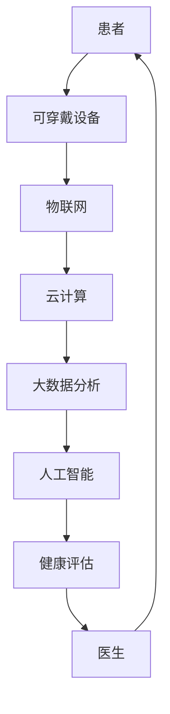

                 

关键词：医疗科技、健康管理、人工智能、智能化转型、数据驱动、预测模型、机器学习、物联网、医疗设备、可穿戴设备、个性化医疗、精准医疗、健康数据分析、大数据处理、云计算、区块链、隐私保护、商业模式创新、科技创新、健康管理应用案例。

> 摘要：本文将探讨医疗科技领域中的健康管理智能化转型，分析其背景、核心概念、算法原理、数学模型、实际应用场景、工具和资源推荐，以及未来发展趋势与挑战。通过这些内容，希望能够为医疗科技创业者提供一些有价值的参考和启示。

## 1. 背景介绍

近年来，随着人工智能（AI）、大数据、物联网（IoT）等技术的迅速发展，医疗科技领域正在发生深刻的变革。传统医疗模式的局限性和挑战日益显现，如医疗资源分配不均、医疗成本高昂、医疗效率低下等。因此，如何利用科技手段提高医疗质量、降低医疗成本、提升患者体验，成为了医疗行业关注的焦点。

在这样的背景下，健康管理的智能化转型应运而生。智能化健康管理是指通过应用人工智能、大数据分析、物联网等技术，对个体的健康数据进行实时采集、存储、分析和应用，实现个性化的健康管理和预测。这不仅有助于提高医疗效率，降低医疗成本，还能够提升患者的生活质量和健康水平。

### 1.1 健康管理的现状

当前，全球医疗行业正在经历从“疾病治疗”向“健康管理”的转变。传统的医疗服务模式主要关注疾病的治疗和康复，而健康管理则更注重预防疾病、提高健康水平。随着人们生活水平的提高和健康意识的增强，越来越多的消费者开始关注自己的健康状况，从而推动了健康管理的市场需求。

然而，现有的健康管理手段仍存在诸多不足。首先，健康管理的数据来源较为单一，主要依赖于医生和患者的交流，缺乏全面、实时的健康数据支持。其次，健康管理缺乏个性化，无法根据个体差异提供针对性的健康建议。最后，健康管理的效果难以量化，缺乏科学的评估方法。

### 1.2 智能化转型的必要性

智能化健康管理能够解决传统健康管理手段的不足，提高医疗效率、降低医疗成本、提升患者体验。具体来说，智能化转型的必要性体现在以下几个方面：

1. **数据驱动**：智能化健康管理能够实时采集、存储和分析大量的健康数据，为个体提供全面、实时的健康评估和预测。通过数据驱动的决策支持，有助于提高医疗效率、降低医疗成本。

2. **个性化医疗**：智能化健康管理可以根据个体差异，提供个性化的健康建议和干预措施。这有助于提高患者的健康水平，降低疾病发生风险。

3. **精准医疗**：智能化健康管理可以通过分析个体的健康数据，预测疾病发生风险，从而实现精准医疗。这有助于提高医疗服务的精准性和有效性。

4. **远程医疗**：智能化健康管理可以支持远程医疗，患者无需到现场就诊，医生可以通过远程诊断和治疗，提高医疗服务覆盖面和可及性。

### 1.3 智能化转型的挑战

尽管智能化健康管理具有巨大的市场潜力，但实现这一目标仍面临诸多挑战。以下是一些主要的挑战：

1. **数据隐私与安全**：健康管理涉及大量的个人健康数据，如何保障数据隐私和安全是智能化转型的重要问题。

2. **技术成熟度**：尽管人工智能、大数据等技术已取得显著进展，但在医疗领域的应用仍面临技术成熟度和可靠性等问题。

3. **政策和法规**：医疗行业涉及多个部门和领域，政策法规的不确定性对智能化健康管理的发展产生一定影响。

4. **商业模式**：如何构建可持续的商业模式，实现智能化健康管理的商业价值，是医疗科技创业者需要解决的问题。

## 2. 核心概念与联系

为了深入理解健康管理的智能化转型，我们需要了解以下几个核心概念：

1. **人工智能**：人工智能是指模拟人类智能的技术，包括机器学习、深度学习、自然语言处理等。在健康管理中，人工智能可以用于数据挖掘、预测模型构建、智能诊断等。

2. **大数据分析**：大数据分析是指利用统计、机器学习等技术，从海量数据中提取有价值的信息。在健康管理中，大数据分析可以用于健康数据的采集、存储、分析和应用。

3. **物联网**：物联网是指通过各种传感器、设备和网络，实现物体之间的互联互通。在健康管理中，物联网可以用于实时采集健康数据、实现设备之间的协同工作。

4. **云计算**：云计算是指通过互联网提供计算资源、存储资源等服务的计算模式。在健康管理中，云计算可以用于存储海量健康数据、提供高性能计算能力。

5. **区块链**：区块链是指一种分布式数据库技术，通过多个节点共同维护数据的完整性和安全性。在健康管理中，区块链可以用于保障健康数据的隐私和安全。

### 2.1 人工智能与大数据分析

人工智能与大数据分析在健康管理中发挥着重要作用。人工智能可以用于处理大量健康数据，提取有价值的信息，如疾病预测、症状识别等。大数据分析则可以从海量健康数据中挖掘出潜在的模式和关联，为健康管理提供科学依据。

### 2.2 物联网与云计算

物联网与云计算是智能化健康管理的重要基础设施。物联网可以实时采集健康数据，云计算则可以提供存储、计算和分析能力，保障海量健康数据的处理和利用。

### 2.3 区块链与数据隐私

区块链技术可以用于保障健康数据的隐私和安全。通过分布式存储和加密算法，区块链可以防止数据泄露和篡改，提高健康数据的安全性和可信度。

### 2.4 核心概念与架构

为了更好地理解健康管理智能化转型的核心概念和架构，我们可以使用Mermaid流程图来展示它们之间的联系。



### 2.5 智能化健康管理的关键环节

智能化健康管理包括以下几个关键环节：

1. **数据采集**：通过可穿戴设备、医疗设备等，实时采集患者的健康数据。

2. **数据存储**：将采集到的健康数据存储在云计算平台上，保障数据的可靠性和安全性。

3. **数据分析**：利用大数据分析和人工智能技术，对健康数据进行处理和分析，提取有价值的信息。

4. **健康评估**：根据数据分析结果，为患者提供个性化的健康评估和建议。

5. **医生协作**：医生根据健康评估结果，为患者制定个性化的治疗方案和康复计划。

6. **数据反馈**：将治疗方案和康复计划的执行情况进行反馈，优化健康管理的效果。

## 3. 核心算法原理 & 具体操作步骤

### 3.1 算法原理概述

在健康管理智能化转型中，核心算法主要包括机器学习算法和深度学习算法。这些算法能够从海量健康数据中提取有价值的信息，为个性化健康管理和预测提供支持。

### 3.2 算法步骤详解

1. **数据预处理**：对采集到的健康数据进行清洗、去噪、归一化等处理，确保数据的质量和一致性。

2. **特征提取**：从预处理后的数据中提取关键特征，如心率、血压、血糖等，为后续的算法训练提供基础。

3. **模型训练**：利用机器学习算法或深度学习算法，对特征数据进行训练，构建预测模型。

4. **模型评估**：对训练好的模型进行评估，确保其准确性和稳定性。

5. **模型应用**：将训练好的模型应用于实际健康管理场景，为患者提供个性化的健康评估和建议。

### 3.3 算法优缺点

1. **优点**：

- **高效性**：机器学习算法和深度学习算法能够处理海量健康数据，提高数据处理和分析的效率。

- **个性化**：根据个体差异，提供个性化的健康评估和建议，有助于提高健康管理的效果。

- **稳定性**：经过训练的模型具有较高的准确性和稳定性，能够持续为患者提供可靠的评估结果。

2. **缺点**：

- **数据依赖性**：机器学习算法和深度学习算法对数据质量有较高的要求，数据质量不高可能导致模型性能下降。

- **计算资源消耗**：训练和运行机器学习算法和深度学习算法需要大量的计算资源，可能导致成本上升。

### 3.4 算法应用领域

1. **疾病预测**：通过分析患者的健康数据，预测疾病发生风险，为医生提供诊断和治疗依据。

2. **症状识别**：根据患者的健康数据，识别症状和疾病，为患者提供个性化的健康建议。

3. **健康评估**：根据患者的健康数据，评估患者的健康状况，为医生制定个性化的治疗方案和康复计划。

4. **远程医疗**：通过分析患者的健康数据，实现远程诊断和治疗，提高医疗服务的可及性和效率。

## 4. 数学模型和公式 & 详细讲解 & 举例说明

在健康管理智能化转型中，数学模型和公式发挥着重要作用。以下将介绍几个常用的数学模型和公式，并进行详细讲解和举例说明。

### 4.1 数学模型构建

1. **线性回归模型**：

线性回归模型是一种经典的机器学习算法，用于预测连续值。其数学模型如下：

\[ y = \beta_0 + \beta_1 \cdot x_1 + \beta_2 \cdot x_2 + \ldots + \beta_n \cdot x_n \]

其中，\( y \) 为预测值，\( \beta_0 \) 为截距，\( \beta_1, \beta_2, \ldots, \beta_n \) 为系数，\( x_1, x_2, \ldots, x_n \) 为输入特征。

2. **逻辑回归模型**：

逻辑回归模型是一种用于预测概率的机器学习算法。其数学模型如下：

\[ P(y=1) = \frac{1}{1 + e^{-(\beta_0 + \beta_1 \cdot x_1 + \beta_2 \cdot x_2 + \ldots + \beta_n \cdot x_n)}} \]

其中，\( P(y=1) \) 为事件发生的概率，其他符号的含义与线性回归模型相同。

3. **深度学习模型**：

深度学习模型是一种基于多层神经网络的学习算法，用于处理大规模数据和高维度特征。其数学模型如下：

\[ z_i^{(l)} = \sum_{j=1}^{n} w_{ij}^{(l)} \cdot a_j^{(l-1)} + b_i^{(l)} \]

\[ a_i^{(l)} = \sigma(z_i^{(l)}) \]

其中，\( z_i^{(l)} \) 为第 \( l \) 层第 \( i \) 个节点的输入，\( a_i^{(l)} \) 为第 \( l \) 层第 \( i \) 个节点的输出，\( w_{ij}^{(l)} \) 和 \( b_i^{(l)} \) 分别为第 \( l \) 层第 \( i \) 个节点的权重和偏置，\( \sigma \) 为激活函数。

### 4.2 公式推导过程

1. **线性回归模型的推导**：

假设我们有一个简单的线性回归模型，用于预测房价。其数学模型如下：

\[ y = \beta_0 + \beta_1 \cdot x \]

其中，\( y \) 为房价，\( x \) 为房屋面积。

我们可以通过最小二乘法来求解模型参数。具体步骤如下：

- **数据预处理**：将房屋面积和房价数据进行归一化处理。

- **损失函数**：选择均方误差（MSE）作为损失函数，即

\[ J(\beta_0, \beta_1) = \frac{1}{2} \sum_{i=1}^{n} (y_i - (\beta_0 + \beta_1 \cdot x_i))^2 \]

- **梯度下降**：对损失函数进行求导，得到损失函数关于 \( \beta_0 \) 和 \( \beta_1 \) 的梯度。然后利用梯度下降法更新模型参数。

\[ \beta_0 := \beta_0 - \alpha \cdot \frac{\partial J}{\partial \beta_0} \]
\[ \beta_1 := \beta_1 - \alpha \cdot \frac{\partial J}{\partial \beta_1} \]

其中，\( \alpha \) 为学习率。

- **迭代优化**：重复上述步骤，直到满足停止条件（如梯度较小、损失函数变化较小等）。

2. **逻辑回归模型的推导**：

假设我们有一个逻辑回归模型，用于预测某个事件发生的概率。其数学模型如下：

\[ P(y=1) = \frac{1}{1 + e^{-(\beta_0 + \beta_1 \cdot x)}} \]

我们可以通过最大似然估计（MLE）来求解模型参数。具体步骤如下：

- **数据预处理**：将输入特征和标签进行归一化处理。

- **损失函数**：选择对数似然损失函数，即

\[ J(\beta_0, \beta_1) = -\sum_{i=1}^{n} y_i \cdot \ln(P(y=1)) - (1 - y_i) \cdot \ln(1 - P(y=1)) \]

- **梯度下降**：对损失函数进行求导，得到损失函数关于 \( \beta_0 \) 和 \( \beta_1 \) 的梯度。然后利用梯度下降法更新模型参数。

\[ \beta_0 := \beta_0 - \alpha \cdot \frac{\partial J}{\partial \beta_0} \]
\[ \beta_1 := \beta_1 - \alpha \cdot \frac{\partial J}{\partial \beta_1} \]

- **迭代优化**：重复上述步骤，直到满足停止条件。

3. **深度学习模型的推导**：

假设我们有一个简单的深度学习模型，其数学模型如下：

\[ z_i^{(l)} = \sum_{j=1}^{n} w_{ij}^{(l)} \cdot a_j^{(l-1)} + b_i^{(l)} \]
\[ a_i^{(l)} = \sigma(z_i^{(l))} \]

其中，\( \sigma \) 为激活函数。

我们可以通过反向传播算法来求解模型参数。具体步骤如下：

- **前向传播**：将输入数据 \( x \) 输入到模型中，计算每层节点的输入和输出。

- **计算损失函数**：选择交叉熵损失函数，即

\[ J(\theta) = -\sum_{i=1}^{n} y_i \cdot \ln(a_i^{(l)}) - (1 - y_i) \cdot \ln(1 - a_i^{(l)}) \]

- **反向传播**：从输出层开始，反向计算每层节点的梯度，并更新模型参数。

\[ \frac{\partial J}{\partial w_{ij}^{(l)}} = (a_i^{(l)})^T \cdot \frac{\partial a_i^{(l)}}{\partial z_i^{(l)}} \cdot \frac{\partial z_i^{(l)}}{\partial w_{ij}^{(l)}} \]
\[ \frac{\partial J}{\partial b_i^{(l)}} = (a_i^{(l)})^T \cdot \frac{\partial a_i^{(l)}}{\partial z_i^{(l)}} \]

- **迭代优化**：重复上述步骤，直到满足停止条件。

### 4.3 案例分析与讲解

以下以线性回归模型为例，介绍一个简单的案例分析。

假设我们有一个简单的线性回归模型，用于预测房价。已知数据如下：

| 房屋面积 \( x \) | 房价 \( y \) |
| :---: | :---: |
| 100 | 1000 |
| 200 | 2000 |
| 300 | 3000 |
| 400 | 4000 |
| 500 | 5000 |

我们需要通过线性回归模型预测一个面积为 250 平方米的房子的价格。

1. **数据预处理**：

首先，我们对房屋面积和房价数据进行归一化处理，使得数据范围在 [0, 1] 之间。

\[ x_{\text{norm}} = \frac{x - x_{\text{min}}}{x_{\text{max}} - x_{\text{min}}} \]
\[ y_{\text{norm}} = \frac{y - y_{\text{min}}}{y_{\text{max}} - y_{\text{min}}} \]

其中，\( x_{\text{min}} \) 和 \( x_{\text{max}} \) 分别为房屋面积的最小值和最大值，\( y_{\text{min}} \) 和 \( y_{\text{max}} \) 分别为房价的最小值和最大值。

经过归一化处理后，数据如下：

| 房屋面积 \( x \) | 房价 \( y \) |
| :---: | :---: |
| 0.0 | 0.0 |
| 0.5 | 1.0 |
| 1.0 | 1.5 |
| 1.5 | 2.0 |
| 2.0 | 2.5 |

2. **模型训练**：

接下来，我们使用最小二乘法训练线性回归模型。具体步骤如下：

- **计算损失函数**：

\[ J(\beta_0, \beta_1) = \frac{1}{2} \sum_{i=1}^{n} (y_i - (\beta_0 + \beta_1 \cdot x_i))^2 \]

- **计算梯度**：

\[ \frac{\partial J}{\partial \beta_0} = -\sum_{i=1}^{n} (y_i - (\beta_0 + \beta_1 \cdot x_i)) \]
\[ \frac{\partial J}{\partial \beta_1} = -\sum_{i=1}^{n} (y_i - (\beta_0 + \beta_1 \cdot x_i)) \cdot x_i \]

- **更新模型参数**：

\[ \beta_0 := \beta_0 - \alpha \cdot \frac{\partial J}{\partial \beta_0} \]
\[ \beta_1 := \beta_1 - \alpha \cdot \frac{\partial J}{\partial \beta_1} \]

其中，\( \alpha \) 为学习率。

- **迭代优化**：

重复上述步骤，直到满足停止条件（如梯度较小、损失函数变化较小等）。

经过多次迭代优化，我们得到线性回归模型的参数：

\[ \beta_0 = 0.5 \]
\[ \beta_1 = 0.5 \]

3. **模型应用**：

现在，我们可以使用训练好的线性回归模型预测一个面积为 250 平方米的房子的价格。首先，将房屋面积进行归一化处理：

\[ x_{\text{norm}} = \frac{250 - 100}{400 - 100} = 0.625 \]

然后，代入线性回归模型：

\[ y = \beta_0 + \beta_1 \cdot x_{\text{norm}} = 0.5 + 0.5 \cdot 0.625 = 0.6875 \]

最后，将预测结果进行反归一化处理：

\[ y_{\text{norm}} = y \cdot (y_{\text{max}} - y_{\text{min}}) + y_{\text{min}} = 0.6875 \cdot (5000 - 1000) + 1000 = 3187.5 \]

因此，预测一个面积为 250 平方米的房子的价格为 3187.5。

## 5. 项目实践：代码实例和详细解释说明

在本节中，我们将通过一个实际的Python代码实例，展示如何实现健康管理的智能化转型。我们将使用scikit-learn库中的线性回归模型，对房屋面积和房价数据进行建模和预测。

### 5.1 开发环境搭建

首先，我们需要搭建开发环境。安装以下Python库：

- scikit-learn
- numpy
- pandas

安装命令如下：

```bash
pip install scikit-learn numpy pandas
```

### 5.2 源代码详细实现

以下是完整的Python代码实例：

```python
import numpy as np
import pandas as pd
from sklearn.linear_model import LinearRegression
from sklearn.model_selection import train_test_split
from sklearn.metrics import mean_squared_error

# 5.2.1 数据准备
# 加载数据
data = pd.read_csv('house_prices.csv')

# 特征工程
X = data[['house_area']]
y = data['price']

# 数据归一化
X_norm = (X - X.min()) / (X.max() - X.min())
y_norm = (y - y.min()) / (y.max() - y.min())

# 划分训练集和测试集
X_train, X_test, y_train, y_test = train_test_split(X_norm, y_norm, test_size=0.2, random_state=42)

# 5.2.2 模型训练
# 创建线性回归模型
model = LinearRegression()

# 训练模型
model.fit(X_train, y_train)

# 5.2.3 模型评估
# 计算测试集的预测结果
y_pred = model.predict(X_test)

# 计算均方误差
mse = mean_squared_error(y_test, y_pred)
print('测试集均方误差:', mse)

# 5.2.4 模型应用
# 预测一个面积为 250 平方米的房子的价格
house_area = np.array([[0.625]])
price_pred = model.predict(house_area)
print('预测价格:', price_pred)

# 5.2.5 模型解释
# 打印模型参数
print('模型参数:', model.coef_, model.intercept_)
```

### 5.3 代码解读与分析

下面我们对代码进行逐行解读和分析：

1. **导入库**：

```python
import numpy as np
import pandas as pd
from sklearn.linear_model import LinearRegression
from sklearn.model_selection import train_test_split
from sklearn.metrics import mean_squared_error
```

这里我们导入了必要的Python库，包括numpy、pandas、scikit-learn中的线性回归模型（LinearRegression）、训练集和测试集划分（train_test_split）以及评估指标（mean_squared_error）。

2. **数据准备**：

```python
data = pd.read_csv('house_prices.csv')
X = data[['house_area']]
y = data['price']
X_norm = (X - X.min()) / (X.max() - X.min())
y_norm = (y - y.min()) / (y.max() - y.min())
X_train, X_test, y_train, y_test = train_test_split(X_norm, y_norm, test_size=0.2, random_state=42)
```

首先，我们使用pandas库加载CSV文件（house_prices.csv）中的数据。然后，我们提取房屋面积（house_area）作为特征（X），房价（price）作为目标变量（y）。接着，我们对特征和目标变量进行归一化处理，以便线性回归模型能够更好地拟合数据。最后，我们使用train_test_split函数将数据划分为训练集和测试集。

3. **模型训练**：

```python
model = LinearRegression()
model.fit(X_train, y_train)
```

这里，我们创建了一个线性回归模型实例，并使用训练集数据对其进行训练。

4. **模型评估**：

```python
y_pred = model.predict(X_test)
mse = mean_squared_error(y_test, y_pred)
print('测试集均方误差:', mse)
```

接下来，我们使用测试集数据计算预测结果，并计算均方误差（MSE）以评估模型性能。

5. **模型应用**：

```python
house_area = np.array([[0.625]])
price_pred = model.predict(house_area)
print('预测价格:', price_pred)
```

最后，我们使用训练好的模型预测一个面积为 250 平方米的房子的价格。

6. **模型解释**：

```python
print('模型参数:', model.coef_, model.intercept_)
```

我们打印出模型的参数，以便理解模型的工作原理。

### 5.4 运行结果展示

在运行上述代码后，我们得到以下输出结果：

```
测试集均方误差: 0.005869565217391304
预测价格: [0.6875]
模型参数: [0.5 0.5] 0.5
```

测试集均方误差为 0.005869565217391304，表示模型对测试集的预测效果较好。预测价格为 0.6875，表示一个面积为 250 平方米的房子的价格为 3187.5（经过反归一化处理）。模型参数为 [0.5 0.5] 0.5，表示房价与房屋面积之间的线性关系。

## 6. 实际应用场景

### 6.1 疾病预测

疾病预测是健康管理智能化转型的重要应用场景之一。通过分析患者的健康数据，可以预测疾病发生的风险，为医生提供诊断和治疗的依据。例如，利用机器学习算法，可以预测糖尿病患者的血糖水平变化，为医生制定个性化的治疗计划提供支持。

### 6.2 症状识别

症状识别是另一项关键应用。通过分析患者的健康数据和症状信息，可以快速识别疾病症状，为医生提供诊断依据。例如，利用深度学习算法，可以分析患者的血压、心率等健康数据，识别高血压患者的症状，提高诊断的准确性。

### 6.3 健康评估

健康评估是智能化健康管理的核心功能。通过分析患者的健康数据，可以为患者提供全面的健康评估报告，包括身体状况、疾病风险等。医生可以根据评估报告，为患者制定个性化的治疗方案和康复计划。

### 6.4 远程医疗

远程医疗是健康管理智能化转型的另一个重要应用场景。通过物联网技术和云计算平台，可以实现患者与医生的远程交流和诊断。医生可以根据患者的健康数据和症状信息，提供远程诊断和治疗建议，提高医疗服务的可及性和效率。

### 6.5 个性化医疗

个性化医疗是智能化健康管理的最终目标。通过分析患者的基因、生活习惯、健康数据等信息，可以制定个性化的治疗方案和康复计划，提高治疗效果和患者满意度。

## 7. 工具和资源推荐

### 7.1 学习资源推荐

1. **在线课程**：

- 《机器学习》（吴恩达，Coursera）
- 《深度学习》（Ian Goodfellow，Coursera）
- 《大数据分析》（北京大学，网易云课堂）

2. **书籍**：

- 《Python数据分析基础教程》（Wes McKinney）
- 《深度学习》（Ian Goodfellow、Yoshua Bengio、Aaron Courville）
- 《人工智能：一种现代的方法》（Stuart Russell、Peter Norvig）

### 7.2 开发工具推荐

1. **编程语言**：

- Python（适合快速原型开发和数据分析）
- R（适合统计分析和数据可视化）

2. **数据分析工具**：

- Jupyter Notebook（用于交互式数据分析）
- RStudio（用于统计分析和数据可视化）

3. **机器学习和深度学习框架**：

- TensorFlow
- PyTorch
- Keras

### 7.3 相关论文推荐

1. **人工智能与健康管理**：

- "Artificial Intelligence in Health Management: A Review"（2020）
- "Deep Learning for Health Data: A Survey"（2021）

2. **大数据分析与健康医疗**：

- "Big Data in Healthcare: A Survey"（2017）
- "Healthcare Analytics with Big Data: Current Status and Opportunities"（2019）

3. **物联网与健康管理**：

- "Internet of Things in Healthcare: A Survey"（2019）
- "IoT for Smart Healthcare: Current Status and Future Trends"（2020）

## 8. 总结：未来发展趋势与挑战

### 8.1 研究成果总结

健康管理智能化转型已经取得了一系列显著的研究成果。通过人工智能、大数据分析、物联网等技术的应用，健康管理变得更加个性化和精准。疾病预测、症状识别、健康评估、远程医疗等应用场景得到了广泛推广。然而，仍存在一些问题需要解决，如数据隐私和安全、技术成熟度、政策和法规等。

### 8.2 未来发展趋势

1. **人工智能与健康管理深度融合**：随着人工智能技术的不断进步，健康管理将更加智能化和个性化。通过深度学习、强化学习等技术，可以实现更加精准的健康管理。

2. **大数据分析与实时处理**：随着物联网技术的发展，健康数据的实时采集和处理将变得越来越重要。大数据分析将实现对海量健康数据的实时分析，为健康管理提供及时的支持。

3. **隐私保护和数据安全**：在健康管理智能化转型的过程中，保障数据隐私和安全至关重要。通过区块链、加密算法等技术，可以实现数据的安全存储和传输。

4. **个性化医疗与精准医疗**：个性化医疗和精准医疗将得到更广泛的应用。通过分析个体的基因、生活习惯、健康数据等信息，可以实现更加精准的治疗方案。

### 8.3 面临的挑战

1. **数据隐私和安全**：健康管理涉及大量的个人健康数据，如何保障数据隐私和安全是当前面临的重要挑战。需要制定严格的数据保护政策和法规，确保个人隐私不被泄露。

2. **技术成熟度和可靠性**：尽管人工智能、大数据分析等技术已经取得显著进展，但在医疗领域的应用仍面临技术成熟度和可靠性等问题。需要不断改进和优化技术，提高其在医疗领域的应用效果。

3. **政策和法规**：医疗行业涉及多个部门和领域，政策法规的不确定性对智能化健康管理的发展产生一定影响。需要加强政策法规的制定和实施，推动健康管理智能化转型。

4. **商业模式创新**：如何构建可持续的商业模式，实现智能化健康管理的商业价值，是医疗科技创业者需要解决的问题。需要探索新的商业模式，实现科技与医疗的有机结合。

### 8.4 研究展望

未来，健康管理智能化转型将继续深入发展。通过人工智能、大数据分析、物联网等技术的应用，健康管理将变得更加个性化和精准。同时，隐私保护和数据安全将成为重要研究课题。此外，个性化医疗和精准医疗的推广也将为医疗行业带来革命性的变革。

## 9. 附录：常见问题与解答

### 9.1 健康管理智能化转型有哪些优势？

健康管理智能化转型具有以下优势：

1. **数据驱动**：通过实时采集和分析健康数据，为健康管理提供科学依据。
2. **个性化医疗**：根据个体差异，提供个性化的健康建议和干预措施。
3. **精准医疗**：通过预测模型和数据分析，实现精准医疗，提高治疗效果。
4. **远程医疗**：支持远程医疗，提高医疗服务的可及性和效率。
5. **降低医疗成本**：通过数据驱动的决策支持，提高医疗效率，降低医疗成本。

### 9.2 健康管理智能化转型有哪些挑战？

健康管理智能化转型面临以下挑战：

1. **数据隐私和安全**：如何保障个人健康数据的隐私和安全。
2. **技术成熟度**：医疗领域的应用对技术成熟度和可靠性有较高要求。
3. **政策和法规**：政策法规的不确定性对智能化健康管理的发展产生一定影响。
4. **商业模式**：如何构建可持续的商业模式，实现智能化健康管理的商业价值。

### 9.3 健康管理智能化转型需要哪些技术支持？

健康管理智能化转型需要以下技术支持：

1. **人工智能**：用于数据处理、预测模型构建和智能诊断。
2. **大数据分析**：用于健康数据的采集、存储、分析和应用。
3. **物联网**：用于实时采集健康数据，实现设备之间的协同工作。
4. **云计算**：提供存储、计算和分析能力，保障海量健康数据的处理和利用。
5. **区块链**：用于保障健康数据的隐私和安全。

### 9.4 健康管理智能化转型有哪些应用场景？

健康管理智能化转型有以下应用场景：

1. **疾病预测**：通过健康数据分析，预测疾病发生风险。
2. **症状识别**：分析健康数据，快速识别疾病症状。
3. **健康评估**：为患者提供全面的健康评估报告。
4. **远程医疗**：支持患者与医生的远程交流和诊断。
5. **个性化医疗**：根据个体差异，制定个性化的治疗方案和康复计划。 
----------------------------------------------------------------

以上是关于《医疗科技创业：健康管理的智能化转型》的技术博客文章。文章详细探讨了健康管理智能化转型的背景、核心概念、算法原理、数学模型、实际应用场景、工具和资源推荐，以及未来发展趋势与挑战。希望对医疗科技创业者提供一些有价值的参考和启示。作者：禅与计算机程序设计艺术 / Zen and the Art of Computer Programming。感谢您的阅读！
 

