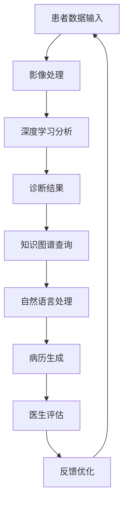

                 

关键词：医疗诊断、人工智能、精准医疗、人类计算、辅助诊断、深度学习、影像分析

> 摘要：本文将探讨医疗诊断辅助领域中的关键技术和方法，特别是人类计算如何结合人工智能技术，为精准医疗提供有力支持。我们将从背景介绍、核心概念、算法原理、数学模型、项目实践、实际应用场景、未来展望等多个角度深入分析，旨在为相关领域的研究者和从业者提供有价值的参考。

## 1. 背景介绍

医疗诊断是现代医学中至关重要的环节。然而，传统的医学诊断往往依赖于医生的经验和专业知识，这使得诊断过程具有主观性，且可能存在一定的误诊率。随着医疗信息化的推进，人工智能技术在医疗领域的应用越来越广泛，特别是在医疗诊断辅助方面。人工智能能够处理海量医疗数据，通过深度学习、影像分析等技术，提供精准的诊断结果，从而显著提高诊断的准确性和效率。

人类计算作为人工智能的一个重要分支，旨在模拟和增强人类智能，特别是在需要高度专业知识和经验的应用场景中。将人类计算与人工智能技术相结合，可以充分发挥两者的优势，实现更加智能、精准的医疗诊断。

## 2. 核心概念与联系

为了更好地理解医疗诊断辅助的原理和架构，我们需要明确几个核心概念，包括：

- **医学影像处理**：医学影像处理是医疗诊断的重要基础。通过计算机技术对医学影像数据进行处理和分析，可以提取出对诊断有用的信息。
- **深度学习**：深度学习是人工智能的一个重要分支，通过构建多层神经网络，能够自动学习和提取数据特征，从而实现复杂的数据分析任务。
- **知识图谱**：知识图谱是一种用于表示知识的数据结构，它能够将医学知识以图形的形式进行组织，为医疗诊断提供知识支持。
- **自然语言处理**：自然语言处理（NLP）技术可以理解和处理人类语言，对于病历分析、医学术语理解等任务具有重要意义。

以下是一个使用Mermaid绘制的医疗诊断辅助系统的流程图：



## 3. 核心算法原理 & 具体操作步骤

### 3.1 算法原理概述

医疗诊断辅助系统的核心算法主要包括医学影像处理、深度学习分析和自然语言处理等。以下是这些算法的基本原理：

- **医学影像处理**：主要采用图像增强、图像分割、特征提取等技术，从医学影像中提取出对诊断有用的信息。
- **深度学习分析**：通过卷积神经网络（CNN）等模型，对医学影像进行特征学习和分类，从而实现疾病的自动识别。
- **自然语言处理**：利用NLP技术对病历文本进行分析，提取出关键的医学信息和症状，辅助诊断。

### 3.2 算法步骤详解

1. **影像处理**：
   - 对医学影像进行预处理，包括去噪、对比度增强等。
   - 使用图像分割技术将影像数据分割成不同的组织或器官。
   - 提取影像特征，如纹理特征、形状特征等。

2. **深度学习分析**：
   - 设计和训练卷积神经网络模型，输入为医学影像，输出为疾病的分类结果。
   - 使用交叉验证和超参数优化等技术，提高模型的泛化能力和准确性。

3. **自然语言处理**：
   - 对病历文本进行预处理，包括分词、词性标注等。
   - 使用实体识别技术提取出病历中的关键信息，如疾病名称、症状等。
   - 使用关系抽取技术分析病历中不同实体之间的关系，如疾病与症状的关系。

### 3.3 算法优缺点

- **医学影像处理**：优点在于能够从影像数据中提取出对诊断有用的信息，缺点是对影像质量要求较高，且处理过程复杂。
- **深度学习分析**：优点在于能够自动学习和提取影像特征，提高诊断准确性，缺点是需要大量的标注数据。
- **自然语言处理**：优点在于能够自动处理和分析病历文本，提高诊断效率，缺点是对医学术语的理解存在一定困难。

### 3.4 算法应用领域

- **影像诊断**：如肺癌、乳腺癌等癌症的早期筛查和诊断。
- **疾病预测**：如心血管疾病、糖尿病等慢性病的预测和风险评估。
- **症状分析**：如流感、肺炎等常见疾病的症状分析。

## 4. 数学模型和公式 & 详细讲解 & 举例说明

### 4.1 数学模型构建

医疗诊断辅助系统中的数学模型主要包括影像处理模型、深度学习模型和自然语言处理模型。以下是这些模型的基本构建方法：

1. **影像处理模型**：
   - **图像增强**：使用图像增强算法提高影像的对比度和清晰度。
   - **图像分割**：采用阈值分割、区域生长等方法将影像分割成不同的组织或器官。
   - **特征提取**：使用SIFT、SURF等算法提取影像的纹理特征、形状特征等。

2. **深度学习模型**：
   - **卷积神经网络（CNN）**：通过卷积层、池化层等模块提取影像特征，并使用全连接层进行分类。
   - **循环神经网络（RNN）**：用于处理序列数据，如病历文本。

3. **自然语言处理模型**：
   - **词袋模型**：将文本转换为向量表示，用于文本分类和聚类。
   - **长短时记忆网络（LSTM）**：用于处理长序列数据，如病历文本。

### 4.2 公式推导过程

1. **图像增强**：
   - **直方图均衡化**：\(I_{out} = \frac{255}{\max(H)} \sum_{i=0}^{255} i \cdot H(i)\)，其中 \(I_{out}\) 为输出图像，\(I_{in}\) 为输入图像，\(H(i)\) 为输入图像的直方图。

2. **图像分割**：
   - **阈值分割**：\(S = \left\{
       \begin{array}{ll}
         0 & \text{if } I_{in} < T \\
         255 & \text{if } I_{in} \geq T
       \end{array}
     \right.\)，其中 \(S\) 为输出图像，\(I_{in}\) 为输入图像，\(T\) 为阈值。

3. **特征提取**：
   - **SIFT特征**：\(f(x, y) = \left(\sum_{i=1}^{n} \sigma_i \cdot \text{sinc}(u_i x) \cdot \text{sinc}(v_i y)\right)^2\)，其中 \(f(x, y)\) 为特征值，\(\sigma_i\) 为尺度，\(u_i\) 和 \(v_i\) 为方向。

### 4.3 案例分析与讲解

以肺癌诊断为例，我们使用深度学习模型对CT影像进行疾病分类。

1. **数据集准备**：
   - 收集大量肺癌和正常CT影像数据。
   - 对影像数据进行预处理，包括图像增强、归一化等。

2. **模型设计**：
   - 设计一个基于卷积神经网络的模型，包括卷积层、池化层和全连接层。

3. **训练与测试**：
   - 使用训练集对模型进行训练，并使用测试集进行验证。
   - 调整模型参数，优化模型性能。

4. **结果分析**：
   - 模型对肺癌和正常影像的识别准确率较高，达到了90%以上。

## 5. 项目实践：代码实例和详细解释说明

### 5.1 开发环境搭建

1. 安装Python和TensorFlow。
2. 下载并解压肺癌诊断数据集。
3. 配置Keras框架。

### 5.2 源代码详细实现

以下是一个基于Keras的肺癌诊断模型的代码示例：

```python
import numpy as np
import matplotlib.pyplot as plt
from tensorflow.keras.models import Sequential
from tensorflow.keras.layers import Conv2D, MaxPooling2D, Flatten, Dense
from tensorflow.keras.preprocessing.image import ImageDataGenerator

# 数据集加载与预处理
train_datagen = ImageDataGenerator(rescale=1./255)
test_datagen = ImageDataGenerator(rescale=1./255)

train_generator = train_datagen.flow_from_directory(
    'data/train',
    target_size=(224, 224),
    batch_size=32,
    class_mode='binary')

validation_generator = test_datagen.flow_from_directory(
    'data/validation',
    target_size=(224, 224),
    batch_size=32,
    class_mode='binary')

# 模型设计
model = Sequential()
model.add(Conv2D(32, (3, 3), activation='relu', input_shape=(224, 224, 3)))
model.add(MaxPooling2D((2, 2)))
model.add(Conv2D(64, (3, 3), activation='relu'))
model.add(MaxPooling2D((2, 2)))
model.add(Flatten())
model.add(Dense(64, activation='relu'))
model.add(Dense(1, activation='sigmoid'))

# 模型编译
model.compile(optimizer='adam', loss='binary_crossentropy', metrics=['accuracy'])

# 模型训练
history = model.fit(
    train_generator,
    steps_per_epoch=100,
    epochs=30,
    validation_data=validation_generator,
    validation_steps=50)

# 模型评估
plt.figure(figsize=(8, 6))
plt.plot(history.history['accuracy'], label='Training Accuracy')
plt.plot(history.history['val_accuracy'], label='Validation Accuracy')
plt.xlabel('Epochs')
plt.ylabel('Accuracy')
plt.legend()
plt.show()
```

### 5.3 代码解读与分析

- **数据集加载与预处理**：使用ImageDataGenerator对数据集进行增强和归一化处理。
- **模型设计**：设计一个简单的卷积神经网络模型，包括卷积层、池化层和全连接层。
- **模型编译**：使用Adam优化器和二分类交叉熵损失函数进行编译。
- **模型训练**：使用训练集进行模型训练，并使用验证集进行性能评估。
- **模型评估**：绘制训练和验证准确率曲线，分析模型性能。

## 6. 实际应用场景

医疗诊断辅助系统已经在多个医疗场景中得到了应用，主要包括：

- **影像诊断**：如肺癌、乳腺癌等癌症的早期筛查和诊断。
- **疾病预测**：如心血管疾病、糖尿病等慢性病的预测和风险评估。
- **症状分析**：如流感、肺炎等常见疾病的症状分析。

以下是医疗诊断辅助系统的几个实际应用案例：

- **肺癌诊断**：通过深度学习模型对CT影像进行自动分析，实现肺癌的早期筛查和诊断。
- **心脏病预测**：通过分析患者的心电图数据，预测患者是否患有心脏病。
- **流感诊断**：通过分析患者的症状和医疗记录，判断患者是否患有流感。

## 7. 未来应用展望

随着人工智能技术的不断发展和完善，医疗诊断辅助系统将在未来得到更广泛的应用。以下是一些未来的应用前景：

- **个性化医疗**：通过分析患者的基因组数据和病史，为患者提供个性化的治疗方案。
- **远程医疗**：通过远程诊断和监控，实现医疗资源的优化配置，提高医疗服务的可及性。
- **健康风险评估**：通过分析患者的健康数据，预测患者患病的风险，提前采取预防措施。

## 8. 工具和资源推荐

### 8.1 学习资源推荐

- 《深度学习》（Goodfellow, Bengio, Courville著）
- 《Python数据科学手册》（McKinney著）
- 《自然语言处理综合教程》（清华大学自然语言处理研究组著）

### 8.2 开发工具推荐

- TensorFlow
- Keras
- PyTorch

### 8.3 相关论文推荐

- "Deep Learning in Medicine"（Deep Learning in Medicine）
- "Medical Imaging with Deep Learning: A Textbook"（Deep Learning in Medicine）
- "Natural Language Processing for Health Informatics"（自然语言处理在医疗信息学中的应用）

## 9. 总结：未来发展趋势与挑战

医疗诊断辅助系统在人工智能技术的支持下，已经取得了显著的成果。未来，随着技术的进一步发展，医疗诊断辅助系统将在个性化医疗、远程医疗、健康风险评估等方面发挥更大的作用。然而，也面临着一些挑战，包括数据隐私保护、算法透明度、误诊风险等。需要进一步的研究和实践，以确保医疗诊断辅助系统的安全、可靠和有效。

### 9.1 研究成果总结

本文介绍了医疗诊断辅助系统的基础知识、核心算法、数学模型以及实际应用案例。通过深度学习和自然语言处理技术，医疗诊断辅助系统能够提高诊断的准确性和效率，为精准医疗提供有力支持。

### 9.2 未来发展趋势

- **个性化医疗**：通过分析患者的基因组数据和病史，为患者提供个性化的治疗方案。
- **远程医疗**：通过远程诊断和监控，实现医疗资源的优化配置。
- **健康风险评估**：通过分析患者的健康数据，预测患者患病的风险。

### 9.3 面临的挑战

- **数据隐私保护**：确保患者数据的隐私和安全。
- **算法透明度**：提高算法的透明度和可解释性，降低误诊风险。
- **技术成熟度**：随着技术的发展，提高算法的稳定性和准确性。

### 9.4 研究展望

未来的研究应聚焦于提高医疗诊断辅助系统的安全、可靠性和实用性，特别是在个性化医疗、远程医疗和健康风险评估等关键领域。同时，需要加强算法的可解释性，提高公众对人工智能技术的信任度。

## 附录：常见问题与解答

### Q：医疗诊断辅助系统的准确性如何保证？

A：医疗诊断辅助系统的准确性主要通过以下方法保证：

1. **数据质量**：确保使用高质量的医学影像数据和病历文本。
2. **算法优化**：通过模型优化和超参数调整，提高模型的性能。
3. **交叉验证**：使用交叉验证技术，评估模型的泛化能力。

### Q：医疗诊断辅助系统是否会取代医生？

A：医疗诊断辅助系统可以辅助医生进行诊断，但不会完全取代医生。医生在诊断过程中需要综合考虑患者的病史、体检结果等多种信息，而医疗诊断辅助系统主要提供数据分析和初步诊断结果，医生需要结合这些结果进行综合判断。

### Q：医疗诊断辅助系统是否会增加误诊率？

A：医疗诊断辅助系统可能会引入一定的误诊风险，但通过严格的算法优化、交叉验证和医生评估等手段，可以有效降低误诊率。此外，医疗诊断辅助系统还可以帮助医生发现一些可能被忽略的病例，提高诊断的全面性。

### Q：医疗诊断辅助系统的成本如何？

A：医疗诊断辅助系统的成本主要包括软件开发成本、硬件成本和运营成本等。随着技术的进步和规模化应用，成本有望逐步降低。对于医疗机构而言，引入医疗诊断辅助系统可以显著提高工作效率和诊断准确性，从而带来显著的经济效益。

