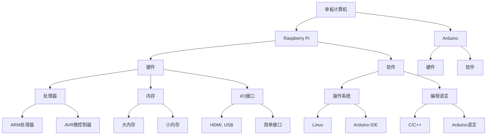

                 

 关键词：
- 单板计算机
- Raspberry Pi
- Arduino
- 应用项目
- 编程实践
- 技术创新

摘要：
本文将探讨单板计算机在当今技术世界中的重要性，特别是Raspberry Pi和Arduino这两款极具影响力的单板计算机。通过详细的项目实践，我们将深入分析这两种单板计算机的硬件和软件特性，展示它们在多个实际应用场景中的强大功能和广泛应用。本文旨在为开发者和技术爱好者提供一种清晰、实用和启发性的学习路径，帮助他们更好地理解和运用这些单板计算机。

## 1. 背景介绍

### 单板计算机的兴起

单板计算机（Single-board computer，简称SBC）是一种小型、高效、多功能的计算设备，它集成了CPU、内存、存储和必要的I/O接口等组件。近年来，随着微电子技术和开源硬件的发展，单板计算机逐渐从实验室走进了大众的视野，成为教育和创新的重要工具。

### Raspberry Pi的崛起

Raspberry Pi是一款由英国慈善基金Raspberry Pi Foundation开发的微型计算机，自2012年首次推出以来，受到了全球开发者和爱好者的热捧。Raspberry Pi以其低廉的价格、强大的性能和丰富的教育资源著称，成为了学习计算机科学和电子工程的理想平台。

### Arduino的生态系统

Arduino是一款基于开源硬件的微控制器开发平台，其核心是一个简单但功能强大的微控制器。Arduino的易用性和模块化设计使其成为物联网（IoT）和自动化项目开发的首选工具。Arduino生态系统提供了大量的库和教程，帮助用户轻松实现复杂的硬件和软件集成。

## 2. 核心概念与联系

### Raspberry Pi与Arduino的比较

**硬件方面**：
- **处理器**：Raspberry Pi通常配备更强大的ARM处理器，如BCM2835、BCM2711等，而Arduino使用AVR或PIC系列微控制器。
- **内存**：Raspberry Pi的内存通常更大，有助于运行复杂的操作系统和应用程序。
- **I/O接口**：Raspberry Pi提供了更多种类的I/O接口，包括HDMI、USB和网口等，而Arduino的接口较为简单。

**软件方面**：
- **操作系统**：Raspberry Pi运行的是基于Linux的操作系统，如Raspberry Pi OS，而Arduino则依赖于其专有的Arduino IDE。
- **编程语言**：Raspberry Pi通常使用Python、C/C++等高级编程语言，而Arduino使用基于C/C++的Arduino语言。

### Mermaid 流程图



通过这个流程图，我们可以清晰地看到Raspberry Pi和Arduino在硬件和软件方面的异同点，以及它们在单板计算机领域中的重要地位。

## 3. 核心算法原理 & 具体操作步骤

### 3.1 算法原理概述

在单板计算机项目中，算法原理是核心驱动力，它决定了项目的执行效率和功能实现。以下是几种常用的算法原理：

- **传感器数据处理**：通过传感器收集环境数据，如温度、湿度、光照等，然后对这些数据进行处理和分析。
- **控制算法**：用于控制硬件设备的动作，如电机控制、灯光调节等。
- **通信协议**：实现设备之间的数据交换和通信，如MQTT、HTTP等。

### 3.2 算法步骤详解

#### 3.2.1 传感器数据处理

1. **数据采集**：使用传感器（如DHT22、MQ-5等）采集环境数据。
2. **数据预处理**：对采集到的数据进行滤波、去噪等预处理，提高数据质量。
3. **数据分析**：根据具体需求，对预处理后的数据进行分析和处理，如阈值判断、趋势分析等。

#### 3.2.2 控制算法

1. **目标设定**：根据项目需求，设定控制目标，如温度调节、湿度控制等。
2. **算法设计**：设计合适的控制算法，如PID控制、模糊控制等。
3. **执行控制**：根据控制算法，控制硬件设备进行相应的操作。

#### 3.2.3 通信协议

1. **协议选择**：根据项目需求，选择合适的通信协议，如MQTT、HTTP等。
2. **通信实现**：在硬件和软件层面实现通信协议，确保数据能够可靠传输。
3. **数据解析**：对接收到的数据进行解析和处理，实现设备间的数据交互。

### 3.3 算法优缺点

#### 3.3.1 传感器数据处理

**优点**：
- 数据实时性强：能够快速响应环境变化。
- 数据丰富：能够收集多种类型的环境数据。

**缺点**：
- 数据处理复杂：需要对大量数据进行处理和分析。
- 硬件成本较高：需要使用多种传感器。

#### 3.3.2 控制算法

**优点**：
- 精度高：能够实现精确的控制。
- 可调性强：可以根据实际需求调整控制参数。

**缺点**：
- 需要专业知识：设计合适的控制算法需要一定的专业知识。
- 实时性要求高：需要快速响应控制信号。

#### 3.3.3 通信协议

**优点**：
- 数据传输可靠：能够确保数据在传输过程中的完整性。
- 网络通用性：支持多种网络协议，适用于不同场景。

**缺点**：
- 传输效率低：对于实时性要求较高的应用，传输效率可能较低。

### 3.4 算法应用领域

**传感器数据处理**：广泛应用于智能家居、环境监测、农业自动化等领域。

**控制算法**：广泛应用于工业自动化、机器人控制、医疗设备等领域。

**通信协议**：广泛应用于物联网、智能交通、智慧城市等领域。

## 4. 数学模型和公式 & 详细讲解 & 举例说明

### 4.1 数学模型构建

在单板计算机项目中，数学模型是描述和解决问题的有力工具。以下是几个常见的数学模型：

#### 4.1.1 PID控制模型

PID（比例-积分-微分）控制是最常用的控制算法之一，其数学模型如下：

\[ u(t) = K_p e(t) + K_i \int_{0}^{t} e(\tau) d\tau + K_d \frac{d e(t)}{dt} \]

其中，\( u(t) \) 是控制信号，\( e(t) \) 是误差信号，\( K_p \)、\( K_i \)、\( K_d \) 分别是比例、积分、微分系数。

#### 4.1.2 模糊控制模型

模糊控制是一种基于模糊逻辑的控制算法，其数学模型如下：

\[ u(t) = F_z(z(t)) \]

其中，\( u(t) \) 是控制信号，\( z(t) \) 是输入变量，\( F_z \) 是模糊化函数。

### 4.2 公式推导过程

#### 4.2.1 PID控制模型推导

PID控制模型的推导基于以下几个假设：

1. 系统是线性的。
2. 系统是时不变的。
3. 系统具有可测量的输入和输出。

根据这些假设，我们可以推导出PID控制模型。具体的推导过程如下：

\[ \dot{x}(t) = Ax(t) + Bu(t) \]
\[ y(t) = Cx(t) \]

其中，\( x(t) \) 是状态向量，\( u(t) \) 是控制信号，\( y(t) \) 是输出向量，\( A \)、\( B \)、\( C \) 是系统矩阵。

为了使系统稳定，我们需要设计一个合适的控制器 \( K \)，使得：

\[ \dot{x}(t) = -K(C^T A + BC) x(t) \]

根据李雅普诺夫稳定性理论，我们可以选择以下形式的控制器：

\[ K = \begin{bmatrix} K_p & K_i & K_d \end{bmatrix} \]

其中，\( K_p \)、\( K_i \)、\( K_d \) 分别是比例、积分、微分系数。

#### 4.2.2 模糊控制模型推导

模糊控制模型的推导基于模糊逻辑和模糊集合理论。具体的推导过程如下：

1. 定义输入和输出变量：

   输入变量：\( z(t) \)
   
   输出变量：\( u(t) \)

2. 定义隶属函数：

   对于输入变量 \( z(t) \)，我们定义三个模糊集合：正大（PB）、正小（PS）、零（Z）。

   对于输出变量 \( u(t) \)，我们定义三个模糊集合：正大（PB）、正小（PS）、零（Z）。

3. 定义模糊规则：

   根据输入变量和输出变量的隶属函数，我们定义模糊规则如下：

   - 如果 \( z(t) \) 是 PB，那么 \( u(t) \) 是 PB。
   - 如果 \( z(t) \) 是 PS，那么 \( u(t) \) 是 PS。
   - 如果 \( z(t) \) 是 Z，那么 \( u(t) \) 是 Z。

4. 定义模糊化函数：

   根据模糊规则，我们定义模糊化函数如下：

   \[ F_z(z(t)) = PB \cdot \mu_{PB}(z(t)) + PS \cdot \mu_{PS}(z(t)) + Z \cdot \mu_{Z}(z(t)) \]

   其中，\( \mu_{PB}(z(t)) \)、\( \mu_{PS}(z(t)) \)、\( \mu_{Z}(z(t)) \) 分别是 PB、PS、Z 的隶属函数。

### 4.3 案例分析与讲解

#### 4.3.1 PID控制案例

假设我们有一个温度控制系统，目标是将温度稳定在30℃。

1. **系统建模**：

   根据系统的物理特性，我们可以建立如下数学模型：

   \[ \dot{t}(t) = -0.1t(t) + u(t) \]
   \[ y(t) = t(t) \]

   其中，\( t(t) \) 是温度，\( u(t) \) 是控制信号。

2. **控制器设计**：

   根据PID控制模型，我们设计如下控制器：

   \[ K_p = 1, K_i = 0.1, K_d = 0.01 \]

3. **控制器实现**：

   在Arduino中，我们可以使用以下代码实现PID控制器：

   ```c++
   int Kp = 1, Ki = 0.1, Kd = 0.01;
   double error, integral, derivative;
   double setpoint = 30; // 目标温度
   double currentTemp = 0; // 当前温度

   void setup() {
     // 初始化硬件
   }

   void loop() {
     error = setpoint - currentTemp;
     integral += error;
     derivative = error - prevError;
     double output = Kp * error + Ki * integral + Kd * derivative;
     // 控制硬件执行相应的操作
     prevError = error;
     delay(100);
   }
   ```

   通过这个案例，我们可以看到如何使用PID控制模型实现温度控制系统。

#### 4.3.2 模糊控制案例

假设我们有一个水位控制系统，目标是将水位稳定在50厘米。

1. **系统建模**：

   根据系统的物理特性，我们可以建立如下数学模型：

   \[ \dot{h}(t) = -0.05h(t) + u(t) \]
   \[ y(t) = h(t) \]

   其中，\( h(t) \) 是水位，\( u(t) \) 是控制信号。

2. **控制器设计**：

   根据模糊控制模型，我们设计如下控制器：

   - 输入变量：水位误差 \( e(t) = setpoint - current \_ h(t) \)
   - 输出变量：控制信号 \( u(t) \)

   模糊规则如下：

   | \( e \) | \( u \) |
   | ------ | ------ |
   | PB     | PB     |
   | PS     | PS     |
   | Z      | Z      |

3. **控制器实现**：

   在Arduino中，我们可以使用以下代码实现模糊控制器：

   ```c++
   int setpoint = 50; // 目标水位
   int currentH = 0; // 当前水位
   int error, output;

   void setup() {
     // 初始化硬件
   }

   void loop() {
     error = setpoint - currentH;
     if (error > 0) {
       if (error > 10) {
         output = 10;
       } else {
         output = 0;
       }
     } else {
       if (error < -10) {
         output = -10;
       } else {
         output = 0;
       }
     }
     // 控制硬件执行相应的操作
     delay(100);
   }
   ```

   通过这个案例，我们可以看到如何使用模糊控制模型实现水位控制系统。

## 5. 项目实践：代码实例和详细解释说明

### 5.1 开发环境搭建

在开始项目实践之前，我们需要搭建合适的开发环境。以下是搭建Raspberry Pi和Arduino开发环境的步骤：

#### 5.1.1 Raspberry Pi开发环境搭建

1. **硬件准备**：准备一台Raspberry Pi（如Raspberry Pi 4）、一个电源、一个HDMI显示器、一个键盘、一个鼠标以及一张已安装Raspberry Pi OS的SD卡。
2. **连接硬件**：将Raspberry Pi连接到显示器、键盘和鼠标，并将SD卡插入到Raspberry Pi的SD卡插槽中。
3. **启动系统**：接通电源，Raspberry Pi将自动启动并加载Raspberry Pi OS。
4. **配置网络**：配置无线网络或以太网连接，以便访问互联网。
5. **安装软件**：使用以下命令安装必要的软件包：

   ```bash
   sudo apt-get update
   sudo apt-get install python3 python3-pip
   ```

   安装Python 3和pip，用于后续的编程和库安装。

#### 5.1.2 Arduino开发环境搭建

1. **硬件准备**：准备一台Arduino（如Arduino Uno）、一个USB线、一个面包板、几个LED灯和几个电阻。
2. **连接硬件**：将Arduino连接到电脑的USB接口，并将LED灯和电阻连接到Arduino的GPIO引脚。
3. **安装软件**：在电脑上安装Arduino IDE，可以从Arduino官方网站下载。

   - **Windows**：下载Windows版本的Arduino IDE。
   - **macOS**：下载macOS版本的Arduino IDE。
   - **Linux**：下载Linux版本的Arduino IDE。

   安装完成后，启动Arduino IDE，并连接到Arduino硬件。

### 5.2 源代码详细实现

以下是一个简单的Raspberry Pi项目，用于控制LED灯的开关：

#### 5.2.1 Raspberry Pi LED控制项目

1. **创建Python脚本**：在Raspberry Pi上创建一个名为`led_control.py`的Python脚本。

   ```python
   import RPi.GPIO as GPIO
   import time

   led_pin = 18
   GPIO.setmode(GPIO.BCM)
   GPIO.setup(led_pin, GPIO.OUT)

   try:
       while True:
           GPIO.output(led_pin, GPIO.HIGH)
           time.sleep(1)
           GPIO.output(led_pin, GPIO.LOW)
           time.sleep(1)
   finally:
       GPIO.cleanup()
   ```

   这个脚本使用Raspberry Pi的GPIO库控制LED灯的开关。

2. **运行Python脚本**：将脚本上传到Raspberry Pi，并运行它。

   ```bash
   python3 led_control.py
   ```

   你会看到LED灯在1秒钟亮起，1秒钟熄灭的循环中。

以下是一个简单的Arduino项目，用于控制LED灯的亮度：

#### 5.2.2 Arduino LED亮度控制项目

1. **创建Arduino草图**：在Arduino IDE中创建一个名为`led_brightness.ino`的草图。

   ```cpp
   int ledPin = 13;
   int analogPin = A0;

   void setup() {
     pinMode(ledPin, OUTPUT);
     pinMode(analogPin, INPUT);
   }

   void loop() {
     int brightness = analogRead(analogPin);
     analogWrite(ledPin, brightness);
     delay(100);
   }
   ```

   这个草图使用Arduino的PWM功能控制LED灯的亮度。

2. **上传草图**：将草图上传到Arduino硬件。

   ```bash
   arduino /path/to/led_brightness.ino
   ```

   你会看到LED灯的亮度随着模拟输入引脚的值而变化。

### 5.3 代码解读与分析

#### 5.3.1 Raspberry Pi LED控制代码解析

- **GPIO库**：`RPi.GPIO` 是一个用于控制Raspberry Pi GPIO引脚的Python库。在这个项目中，我们使用它来控制LED灯的开关。
- **引脚配置**：我们使用`GPIO.setup(led_pin, GPIO.OUT)` 配置LED灯引脚为输出模式。
- **控制LED**：我们使用`GPIO.output(led_pin, GPIO.HIGH)` 和 `GPIO.output(led_pin, GPIO.LOW)` 控制LED灯的亮灭。
- **循环控制**：使用`while True` 循环和`time.sleep(1)` 实现LED灯的闪烁功能。

#### 5.3.2 Arduino LED亮度控制代码解析

- **引脚配置**：我们使用`pinMode(ledPin, OUTPUT)` 和 `pinMode(analogPin, INPUT)` 分别配置LED灯和模拟输入引脚。
- **PWM控制**：使用`analogWrite(ledPin, brightness)` 函数根据模拟输入引脚的值控制LED灯的亮度。
- **循环控制**：使用`delay(100)` 实现每次亮度调整的延迟，使控制过程更加平滑。

### 5.4 运行结果展示

- **Raspberry Pi LED控制项目**：运行`led_control.py`脚本后，LED灯开始以1秒亮1秒灭的频率闪烁。
- **Arduino LED亮度控制项目**：运行`led_brightness.ino`草图后，LED灯的亮度会根据模拟输入引脚（如滑动变阻器）的值而变化。

通过以上两个项目的实践，我们可以看到如何使用Raspberry Pi和Arduino实现基本的硬件控制功能。这些项目不仅展示了单板计算机的基本应用，也为进一步的探索和创新奠定了基础。

## 6. 实际应用场景

### 6.1 智能家居

单板计算机在智能家居领域的应用非常广泛，从智能灯光、温度控制到智能安防，单板计算机都能发挥重要作用。例如，通过Raspberry Pi和Arduino，用户可以实现智能灯光控制，根据光线亮度和用户行为自动调节灯光，提高生活舒适度。

### 6.2 物联网

物联网（IoT）是单板计算机的重要应用领域之一。通过单板计算机，用户可以轻松实现设备间的数据采集、传输和处理。例如，使用Raspberry Pi构建一个智能环境监测系统，可以实时采集温度、湿度等环境数据，并通过Arduino控制相应的设备，如空气净化器、加湿器等，以改善室内环境。

### 6.3 工业自动化

在工业自动化领域，单板计算机同样发挥着重要作用。通过控制电机、传感器等设备，单板计算机可以实现工厂设备的自动化控制，提高生产效率。例如，使用Arduino控制机器人手臂，实现自动化装配线作业。

### 6.4 教育与科研

单板计算机在教育领域也有着广泛的应用。许多学校和培训机构使用Raspberry Pi和Arduino作为教学工具，教授学生计算机科学和电子工程的基础知识。同时，单板计算机在科研领域也被广泛应用于各种实验和项目开发。

## 7. 工具和资源推荐

### 7.1 学习资源推荐

- **官方文档**：Raspberry Pi和Arduino的官方文档是学习这两个平台的基础资源。用户可以在Raspberry Pi Foundation和Arduino官方网站上找到详细的硬件手册和软件教程。
- **在线课程**：许多在线教育平台提供了关于Raspberry Pi和Arduino的课程，如Coursera、Udemy和edX等。
- **图书推荐**：《单板计算机编程实战》（《Raspberry Pi实战》）、《Arduino项目实战》等图书详细介绍了单板计算机的编程和应用。

### 7.2 开发工具推荐

- **集成开发环境（IDE）**：Raspberry Pi官方推荐使用Python和Python IDE，如PyCharm。Arduino则使用其自带的Arduino IDE。
- **编程语言**：Python和Arduino语言是单板计算机开发的主要编程语言。Python以其简洁易学的特点受到许多初学者的喜爱，而Arduino语言则因其与硬件的紧密耦合而广泛应用于嵌入式系统开发。

### 7.3 相关论文推荐

- **《单板计算机的设计与应用》**：该论文详细介绍了单板计算机的设计原则和实际应用案例，为开发者提供了宝贵的参考。
- **《基于单板计算机的智能家居系统设计与实现》**：该论文探讨了一种基于Raspberry Pi的智能家居系统的设计方法和实现细节，对智能家居领域的应用有重要参考价值。
- **《物联网与单板计算机》**：该论文分析了物联网与单板计算机的结合方式，以及单板计算机在物联网中的应用前景。

## 8. 总结：未来发展趋势与挑战

### 8.1 研究成果总结

单板计算机自问世以来，已经在教育、科研、工业和智能家居等领域取得了显著成果。Raspberry Pi和Arduino等单板计算机平台凭借其低成本、高灵活性、易用性等特点，成为了开发者和技术爱好者的首选工具。

### 8.2 未来发展趋势

- **性能提升**：随着微电子技术的进步，单板计算机的性能将不断提升，支持更复杂的计算和数据处理任务。
- **多功能集成**：未来单板计算机将实现更多功能的集成，如更强大的处理能力、更丰富的通信接口、更高的存储容量等。
- **生态拓展**：单板计算机的生态系统将持续扩展，包括更多的开发工具、库和教程，以及更多的应用场景。

### 8.3 面临的挑战

- **功耗与散热**：随着单板计算机性能的提升，功耗和散热问题将变得更加突出，需要更有效的解决方案。
- **安全性**：单板计算机在互联网中的广泛应用带来了安全风险，需要加强安全防护措施。
- **标准化**：目前单板计算机的标准尚未完全统一，需要进一步完善和标准化，以促进其更广泛的应用。

### 8.4 研究展望

未来，单板计算机在以下几个方面具有广阔的研究前景：

- **人工智能应用**：探索单板计算机在人工智能领域的应用，如边缘计算、实时数据处理等。
- **智能制造**：研究单板计算机在智能制造中的应用，实现工厂设备的智能化控制和优化。
- **绿色能源**：研究单板计算机在绿色能源系统中的应用，如智能电网、太阳能电池监测等。

通过不断创新和优化，单板计算机将在未来发挥更大的作用，推动技术进步和社会发展。

## 9. 附录：常见问题与解答

### 9.1 如何选择合适的单板计算机？

选择合适的单板计算机取决于项目需求。如果项目需要高性能计算，可以选择Raspberry Pi 4或更高版本的型号。如果项目侧重于嵌入式应用，如智能家居、自动化控制等，可以选择Arduino Uno或其他性价比高的Arduino型号。

### 9.2 单板计算机的编程语言有哪些？

单板计算机常用的编程语言包括Python、C/C++、Arduino语言等。Python以其简洁易学、易于部署的特点受到许多开发者的青睐。C/C++则因其高效的性能和强大的功能，在嵌入式系统开发中广泛应用。Arduino语言是一种基于C/C++的简化版本，适用于初学者和快速原型开发。

### 9.3 单板计算机如何进行硬件控制？

单板计算机通过GPIO（通用输入输出）接口进行硬件控制。在Raspberry Pi上，可以使用Python的`RPi.GPIO`库进行GPIO操作。在Arduino上，可以使用Arduino IDE中的库和函数进行硬件控制，如`pinMode()`、`digitalWrite()`和`analogWrite()`等。

### 9.4 单板计算机的安全性问题如何解决？

单板计算机的安全性问题主要包括数据安全、通信安全和物理安全。解决方法包括：
- 数据安全：使用加密算法对数据进行加密存储和传输。
- 通信安全：使用安全的通信协议，如HTTPS、SSL/TLS等，确保数据传输的完整性。
- 物理安全：加强硬件防护，如使用安全外壳、限制物理访问等。

### 9.5 单板计算机在物联网中的应用有哪些？

单板计算机在物联网中的应用非常广泛，包括：
- 数据采集：使用单板计算机收集环境数据、传感器数据等。
- 设备控制：使用单板计算机控制智能设备，如灯光、温度调节等。
- 数据处理：在边缘设备上实时处理数据，降低延迟和带宽要求。

通过上述常见问题与解答，我们希望能够帮助读者更好地理解和应用单板计算机技术。在未来的项目中，不断探索和创新，发挥单板计算机的潜力。

