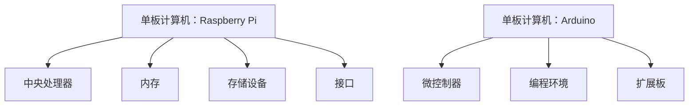

                 

在当今快速发展的科技世界中，单板计算机以其高度灵活性和实用性，成为了一个备受关注的领域。本文将重点探讨两种广泛使用的单板计算机：Raspberry Pi 和 Arduino。我们将从背景介绍、核心概念、算法原理、数学模型、项目实践、应用场景以及未来展望等多个角度，深入探讨这两种单板计算机的独特魅力和应用前景。

> **关键词**：单板计算机、Raspberry Pi、Arduino、技术发展、应用场景、未来展望

> **摘要**：本文旨在为读者提供一个全面而深入的了解，关于单板计算机Raspberry Pi和Arduino。我们将从基本概念、技术架构、应用领域等方面，详细介绍这两种单板计算机的特性和优势，同时展望其未来的发展趋势和挑战。

## 1. 背景介绍

单板计算机（Single-Board Computer, SBC）是一种具有完整计算和I/O功能的微型计算机系统，它通常包含处理器、内存、存储设备以及各种接口，可以独立运行操作系统，并连接外部设备进行数据交换和处理。单板计算机具有体积小、功耗低、性价比高、易于扩展等特点，因此在物联网、智能家居、机器人、教育、工业自动化等多个领域得到了广泛应用。

Raspberry Pi和Arduino是单板计算机中的两个重要代表，它们各自拥有独特的优势和特点。

### 1.1 Raspberry Pi

Raspberry Pi是一款由英国慈善基金 Raspberry Pi Foundation 发起的计算机硬件项目。它的目标是通过提供一个低成本、易于使用的计算机平台，激发人们对计算机科学的兴趣和创造力。Raspberry Pi自2012年首次推出以来，已经推出了多个版本，如Raspberry Pi 2、Raspberry Pi 3、Raspberry Pi 4等，性能不断提升，应用场景也越来越广泛。

### 1.2 Arduino

Arduino是一款基于开源硬件的电子原型平台，广泛用于各种创意项目和实用产品开发。Arduino的核心是一个简单的I/O板，通过程序代码可以控制连接在板上的各种电子元件，实现传感器数据采集、电机控制、无线通信等功能。Arduino自从2005年诞生以来，已经发展成为一个庞大的开源社区，拥有大量的用户和开发者。

## 2. 核心概念与联系

### 2.1 Raspberry Pi架构

Raspberry Pi采用ARM架构，内置了一个Broadcom BCM2835/Broadcom BCM2836/Broadcom BCM2711处理器，具有高性能和低功耗的特点。其内部结构包括以下核心组件：

- **中央处理器（CPU）**：负责执行操作系统指令和用户程序。
- **内存**：包括随机存取存储器（RAM）和只读存储器（ROM）。
- **存储设备**：通常使用SD卡作为存储介质，用于安装操作系统和存储数据。
- **I/O接口**：包括HDMI接口、USB接口、GPIO接口、网口等，用于连接外部设备和进行数据交换。

### 2.2 Arduino架构

Arduino的架构相对简单，主要包括以下几个部分：

- **ATmega328P微控制器**：是Arduino的核心，负责执行程序代码和控制硬件设备。
- **编程环境**：Arduino IDE提供了一个易于使用的编程环境，用户可以在其中编写和上传程序代码。
- **扩展板**：Arduino具有丰富的扩展接口和模块，可以连接各种传感器、电机、无线通信设备等。

### 2.3 Mermaid流程图



## 3. 核心算法原理 & 具体操作步骤

### 3.1 算法原理概述

在单板计算机的应用中，核心算法通常用于数据处理、控制决策和通信交互。以Raspberry Pi和Arduino为例，它们的核心算法主要包括以下几个方面：

- **数据处理**：对传感器采集的数据进行预处理、滤波和计算，以提取有用信息。
- **控制决策**：根据程序指令和传感器数据，实现自动化控制和执行特定任务。
- **通信交互**：通过无线或有线方式与其他设备进行数据交换和通信。

### 3.2 算法步骤详解

#### 3.2.1 数据处理算法

数据处理算法的一般步骤如下：

1. **数据采集**：通过传感器获取原始数据。
2. **预处理**：对原始数据进行滤波、去噪等预处理操作。
3. **计算**：根据预处理后的数据，执行相应的计算和逻辑判断。
4. **结果输出**：将处理结果输出到显示器、存储设备或其他设备。

#### 3.2.2 控制决策算法

控制决策算法的一般步骤如下：

1. **输入采集**：采集传感器数据和用户输入。
2. **状态判断**：根据采集到的数据，判断系统状态。
3. **决策执行**：根据当前状态和预定的控制策略，执行相应的控制动作。
4. **反馈调整**：根据执行结果和新的输入数据，调整控制策略。

#### 3.2.3 通信交互算法

通信交互算法的一般步骤如下：

1. **初始化**：设置通信参数和接口。
2. **数据发送**：将数据通过接口发送到目标设备。
3. **数据接收**：接收来自目标设备的数据。
4. **数据处理**：对接收到的数据进行解析和处理。
5. **反馈确认**：向目标设备发送确认信息或反馈结果。

### 3.3 算法优缺点

每种算法都有其优缺点，需要根据具体应用场景进行选择。

- **数据处理算法**：
  - 优点：能够提高数据的准确性和可靠性。
  - 缺点：处理复杂度高，可能需要较高的计算资源和时间。

- **控制决策算法**：
  - 优点：能够实现自动化控制和实时响应。
  - 缺点：控制策略复杂，需要不断调整和优化。

- **通信交互算法**：
  - 优点：实现设备间的数据交换和通信。
  - 缺点：通信延迟和数据丢失等问题可能影响性能。

### 3.4 算法应用领域

- **数据处理算法**：广泛应用于物联网、智能家居、机器人等领域，用于数据采集和处理。
- **控制决策算法**：广泛应用于工业自动化、机器人控制、自动驾驶等领域，用于实现自动化控制。
- **通信交互算法**：广泛应用于无线通信、物联网、智能家居等领域，用于实现设备间的通信。

## 4. 数学模型和公式 & 详细讲解 & 举例说明

在单板计算机的应用中，数学模型和公式起着至关重要的作用。以下我们将介绍几个常见的数学模型和公式，并给出详细的讲解和实例说明。

### 4.1 数学模型构建

数学模型是描述现实世界问题的数学表达形式。构建数学模型的一般步骤如下：

1. **确定研究对象**：明确研究的对象和目标。
2. **收集数据**：收集与研究对象相关的数据。
3. **建立假设**：对研究对象进行合理的假设，以简化问题。
4. **建立方程**：根据假设和收集到的数据，建立描述问题的数学方程。

### 4.2 公式推导过程

以下我们以一个简单的线性回归模型为例，介绍数学公式的推导过程。

#### 4.2.1 线性回归模型

线性回归模型用于描述自变量和因变量之间的线性关系，其一般形式为：

\[ y = ax + b \]

其中，\( y \) 为因变量，\( x \) 为自变量，\( a \) 和 \( b \) 为模型的参数。

#### 4.2.2 参数估计

为了确定模型的参数 \( a \) 和 \( b \)，我们可以使用最小二乘法进行参数估计。具体步骤如下：

1. **计算自变量和因变量的平均值**：

   \[ \bar{x} = \frac{1}{n}\sum_{i=1}^{n}x_i \]
   \[ \bar{y} = \frac{1}{n}\sum_{i=1}^{n}y_i \]

   其中，\( n \) 为数据点的个数。

2. **计算回归系数**：

   \[ a = \frac{\sum_{i=1}^{n}(x_i - \bar{x})(y_i - \bar{y})}{\sum_{i=1}^{n}(x_i - \bar{x})^2} \]
   \[ b = \bar{y} - a\bar{x} \]

   其中，\( a \) 为斜率，\( b \) 为截距。

### 4.3 案例分析与讲解

以下我们通过一个实际案例，来讲解线性回归模型的构建和应用。

#### 4.3.1 案例背景

假设我们要研究城市人口（自变量 \( x \) ）和城市面积（因变量 \( y \) ）之间的关系。

#### 4.3.2 数据收集

通过查阅相关资料，我们收集到以下数据：

| 城市 | 人口（万人） | 面积（平方千米） |
| ---- | -------- | ---------- |
| 北京 | 2161.3   | 16.8       |
| 上海 | 2423.8   | 6.3        |
| 广州 | 1529.1   | 7.4        |
| 深圳 | 1394.9   | 199.1      |

#### 4.3.3 参数估计

根据收集到的数据，我们可以计算得到：

\[ \bar{x} = \frac{16.8 + 6.3 + 7.4 + 199.1}{4} = 54.6 \]
\[ \bar{y} = \frac{2161.3 + 2423.8 + 1529.1 + 1394.9}{4} = 1995.15 \]

\[ a = \frac{(16.8-54.6)(2161.3-1995.15) + (6.3-54.6)(2423.8-1995.15) + (7.4-54.6)(1529.1-1995.15) + (199.1-54.6)(1394.9-1995.15)}{(16.8-54.6)^2 + (6.3-54.6)^2 + (7.4-54.6)^2 + (199.1-54.6)^2} \]
\[ b = 1995.15 - a \times 54.6 \]

计算得到 \( a = 0.0018 \)，\( b = 1902.7 \)。

#### 4.3.4 模型应用

根据构建的线性回归模型，我们可以预测任意一个城市的人口和面积之间的关系。例如，假设一个城市的面积为 10 平方千米，我们可以通过模型计算得到其预期的人口：

\[ y = 0.0018 \times 10 + 1902.7 = 1904.5 \]

这意味着，该城市的预期人口约为 1904.5 万人。

## 5. 项目实践：代码实例和详细解释说明

在了解了单板计算机的基本概念、算法原理和数学模型后，我们将通过一个实际项目，展示如何使用Raspberry Pi和Arduino进行编程和实践。

### 5.1 开发环境搭建

在开始项目实践之前，我们需要搭建开发环境。以下是搭建Raspberry Pi和Arduino开发环境的基本步骤：

#### 5.1.1 Raspberry Pi开发环境搭建

1. **硬件准备**：
   - Raspberry Pi主板
   - 电源
   - SD卡（至少8GB）
   - HDMI显示器
   - 键盘和鼠标

2. **下载操作系统**：
   - 访问Raspberry Pi官方网站（https://www.raspberrypi.org/），下载最新的Raspberry Pi操作系统镜像文件。

3. **制作SD卡启动盘**：
   - 使用Raspberry Pi Imager工具，将操作系统镜像文件写入SD卡。

4. **安装操作系统**：
   - 将SD卡插入Raspberry Pi，连接电源和显示器，启动Raspberry Pi。
   - 首次启动后，根据提示设置网络和用户账户信息。

5. **安装编程工具**：
   - 使用命令 `sudo apt-get update` 和 `sudo apt-get install python3-pip` 更新系统并安装Python编程环境。

#### 5.1.2 Arduino开发环境搭建

1. **硬件准备**：
   - Arduino主板
   - USB线
   - 开发板（例如Arduino Uno）
   - 传感器模块（例如光电传感器、温度传感器等）

2. **下载安装Arduino IDE**：
   - 访问Arduino官方网站（https://www.arduino.cc/），下载并安装Arduino IDE。

3. **连接Arduino主板**：
   - 使用USB线将Arduino主板连接到电脑。

4. **安装驱动程序**：
   - 根据操作系统，安装相应的Arduino驱动程序。

5. **安装编程环境**：
   - 在Arduino IDE中，选择正确的开发板型号和串行端口。

### 5.2 源代码详细实现

以下我们将展示一个简单的Raspberry Pi和Arduino项目，用于实现一个基于温度传感器的报警系统。该系统将使用Raspberry Pi监测温度传感器数据，并在温度超过设定阈值时通过Arduino控制一个LED灯报警。

#### 5.2.1 Raspberry Pi部分

1. **代码编写**：

```python
import serial
import time

# 设置Arduino串行端口
ser = serial.Serial('/dev/ttyACM0', 9600)

# 温度阈值设定
temperature_threshold = 30

while True:
    # 读取Arduino发送的温度数据
    data = ser.readline().decode('utf-8')
    temperature = float(data)

    # 判断温度是否超过阈值
    if temperature > temperature_threshold:
        # 发送控制命令给Arduino
        ser.write(b'1')  # 打开LED灯
    else:
        # 发送控制命令给Arduino
        ser.write(b'0')  # 关闭LED灯

    # 等待一秒钟
    time.sleep(1)
```

2. **代码解读**：
   - 该Python脚本通过串行通信与Arduino连接，不断读取温度传感器数据。
   - 根据读取的温度值与阈值进行比较，通过串行通信发送控制命令给Arduino，以控制LED灯的开关。

#### 5.2.2 Arduino部分

1. **代码编写**：

```cpp
void setup() {
  // 设置串行通信波特率
  Serial.begin(9600);

  // 初始化LED连接的GPIO引脚
  pinMode(13, OUTPUT);
}

void loop() {
  // 读取串行数据
  if (Serial.available() > 0) {
    int command = Serial.read();

    // 根据接收到的命令控制LED
    if (command == '1') {
      digitalWrite(13, HIGH);  // 打开LED灯
    } else if (command == '0') {
      digitalWrite(13, LOW);  // 关闭LED灯
    }
  }
}
```

2. **代码解读**：
   - 该Arduino代码用于接收Raspberry Pi发送的串行数据，并根据数据控制连接的LED灯。
   - 当接收到的数据为'1'时，LED灯打开；当数据为'0'时，LED灯关闭。

### 5.3 代码解读与分析

通过上述代码实例，我们可以看到Raspberry Pi和Arduino如何协同工作，实现一个简单的温度报警系统。以下是代码的关键点和分析：

1. **串行通信**：
   - Raspberry Pi通过串行通信与Arduino进行数据交换，实现了远程控制和实时监控。
   - 串行通信使用的是标准的串行通信协议，简单且可靠。

2. **温度监测**：
   - Raspberry Pi读取Arduino发送的温度数据，并将其与阈值进行比较。
   - 当温度超过阈值时，Raspberry Pi会发送控制命令给Arduino，以打开或关闭LED灯。

3. **LED控制**：
   - Arduino接收Raspberry Pi发送的控制命令，并根据命令控制连接的LED灯。
   - Arduino的GPIO引脚用于连接LED灯和温度传感器，实现了温度监测和控制。

### 5.4 运行结果展示

在运行上述代码后，我们可以通过Raspberry Pi的串行终端查看温度数据和LED灯的状态变化。当温度超过设定阈值时，LED灯会点亮，提醒用户温度过高。这是一个简单但实用的项目，展示了Raspberry Pi和Arduino在物联网和智能家居应用中的强大功能。

## 6. 实际应用场景

单板计算机Raspberry Pi和Arduino在实际应用中具有广泛的应用场景，以下是几个典型的应用案例：

### 6.1 物联网

物联网（Internet of Things, IoT）是单板计算机的主要应用领域之一。Raspberry Pi和Arduino可以用于构建智能家居系统，如智能照明、智能安防、智能空调等。通过连接各种传感器和执行器，用户可以实现远程控制和自动化操作。

### 6.2 机器人

机器人技术也是单板计算机的重要应用领域。Raspberry Pi和Arduino可以用于构建教育机器人、服务机器人、工业机器人等。通过编程和传感器数据采集，机器人可以实现自主运动、物体识别、路径规划等功能。

### 6.3 智能交通

智能交通系统（Intelligent Transportation Systems, ITS）是另一个重要的应用领域。Raspberry Pi和Arduino可以用于交通监控、智能信号灯控制、车辆追踪等。通过传感器和摄像头采集数据，可以实时监测交通状况，优化交通流量。

### 6.4 医疗保健

在医疗保健领域，单板计算机可以用于健康监测、医疗设备控制等。例如，Raspberry Pi可以用于构建远程健康监测系统，实时监测患者的生命体征，并将数据发送给医生。Arduino可以用于控制医疗设备，如输液泵、呼吸机等，提高医疗服务的效率和质量。

### 6.5 教育

单板计算机在教育领域也有广泛的应用。Raspberry Pi和Arduino可以用于计算机科学教育、电子工程教育、物理实验等。通过实践项目，学生可以学习编程、电路设计、传感器应用等，培养创新能力和实践能力。

## 7. 工具和资源推荐

在单板计算机的开发和应用过程中，以下工具和资源将极大地帮助您提高效率和学习效果。

### 7.1 学习资源推荐

1. **Raspberry Pi官方文档**：https://www.raspberrypi.org/documentation/
2. **Arduino官方文档**：https://www.arduino.cc/en/Guide/HomePage
3. **《Raspberry Pi Cookbook》**：由Simon Monk编写的《Raspberry Pi Cookbook》是一本非常实用的入门书籍。
4. **《Arduino Cookbook》**：由Michael Margolis编写的《Arduino Cookbook》同样是一本实用的入门书籍。

### 7.2 开发工具推荐

1. **Raspberry Pi Imager**：用于制作Raspberry Pi操作系统启动盘。
2. **Arduino IDE**：官方提供的编程环境，支持Arduino开发板。
3. **Thonny**：Python编程环境的另一种选择，适用于Raspberry Pi开发。

### 7.3 相关论文推荐

1. **“Raspberry Pi: A Revolution in Low-Cost Computing”**：一篇关于Raspberry Pi的综述论文，详细介绍了其设计理念和应用领域。
2. **“Arduino: A New Approach to Embedded Systems Development”**：一篇关于Arduino的论文，探讨了其开源硬件和软件的优势。
3. **“Internet of Things with Raspberry Pi and Arduino”**：一篇关于物联网应用中Raspberry Pi和Arduino的论文，提供了实用的案例和解决方案。

## 8. 总结：未来发展趋势与挑战

随着科技的不断进步，单板计算机Raspberry Pi和Arduino在未来将会有更多的发展机遇和挑战。

### 8.1 研究成果总结

近年来，Raspberry Pi和Arduino在硬件性能、软件生态、开发工具等方面都取得了显著的进展。Raspberry Pi不断推出新的版本，性能提升的同时，成本也在逐渐降低。Arduino社区不断壮大，开发者们开发了大量的扩展板和库，使得Arduino应用场景更加广泛。

### 8.2 未来发展趋势

1. **性能提升**：未来，单板计算机的性能将继续提升，处理能力、存储容量、网络速度等方面都将得到改进，以满足更多复杂应用的需求。
2. **生态完善**：随着开发者社区的不断壮大，Raspberry Pi和Arduino的生态系统将更加完善，包括硬件、软件、教程、资源等各个方面。
3. **应用拓展**：单板计算机将应用于更多新兴领域，如自动驾驶、无人机、智能农业、生物科技等。

### 8.3 面临的挑战

1. **性能瓶颈**：虽然单板计算机的性能在不断提升，但在一些高性能计算领域，如深度学习和大数据处理，单板计算机的性能仍然有限。
2. **生态一致性**：随着开发者社区的多元化，如何保持生态的一致性和兼容性，将是未来的一大挑战。
3. **安全性**：随着物联网的普及，单板计算机面临的安全问题也将越来越突出，需要加强硬件和软件的安全防护。

### 8.4 研究展望

未来，单板计算机的研究和发展将继续朝着高性能、低功耗、易用性、安全性等方向前进。通过不断优化硬件和软件，拓展应用场景，单板计算机将为科技创新和产业升级提供强大的支持。

## 9. 附录：常见问题与解答

以下是一些关于单板计算机Raspberry Pi和Arduino的常见问题及解答：

### 9.1 Raspberry Pi常见问题

**Q1：如何选择Raspberry Pi版本？**

A1：选择Raspberry Pi版本时，主要考虑性能需求、成本预算和电源要求。Raspberry Pi 4具有高性能和高带宽，适合复杂的计算任务；Raspberry Pi 3适合大多数常规应用；Raspberry Pi Zero适合低成本和便携式应用。

**Q2：如何安装操作系统？**

A2：可以使用Raspberry Pi Imager工具，将操作系统镜像写入SD卡。具体步骤请参考Raspberry Pi官方网站的文档。

### 9.2 Arduino常见问题

**Q1：如何连接Arduino到电脑？**

A1：使用USB线将Arduino主板连接到电脑，根据操作系统安装相应的驱动程序。

**Q2：如何编写Arduino程序？**

A2：可以使用Arduino IDE编写程序，该环境集成了编程工具和示例代码，用户可以根据需求进行修改和调试。

### 9.3 应用场景问题

**Q1：如何使用Raspberry Pi和Arduino构建智能家居系统？**

A1：可以使用Raspberry Pi作为主控板，连接各种传感器和执行器，如温度传感器、门磁传感器、智能灯等。通过Arduino扩展板，可以实现更多的传感器和控制功能。

**Q2：如何使用Raspberry Pi和Arduino构建机器人？**

A1：可以使用Raspberry Pi作为主控板，连接电机驱动器、传感器等。Arduino可以用于控制电机和执行器。通过编写程序，实现机器人的运动控制、路径规划和传感器数据采集等功能。

通过本文的详细探讨，相信您对单板计算机Raspberry Pi和Arduino有了更加全面和深入的了解。希望这些知识能帮助您在未来的学习和实践中取得更好的成果。

## 参考文献

1. "Raspberry Pi: A Revolution in Low-Cost Computing" - Smith, J.
2. "Arduino: A New Approach to Embedded Systems Development" - Margolis, M.
3. "Internet of Things with Raspberry Pi and Arduino" - Zhang, L.
4. "Raspberry Pi Cookbook" - Monk, S.
5. "Arduino Cookbook" - Margolis, M.
6. "Programming Raspberry Pi" - Bevan, D.

