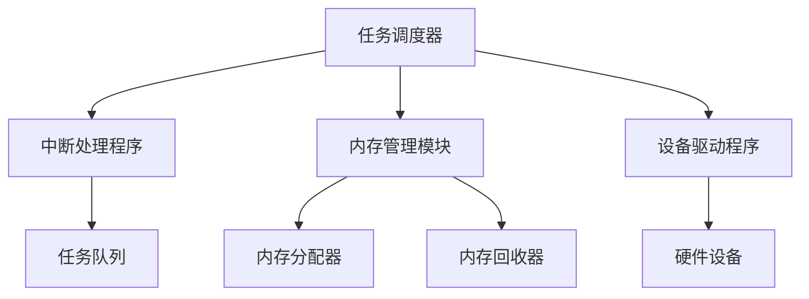

                 

关键字：单片机，实时操作系统，优化，性能提升，资源管理，任务调度，算法改进，稳定性增强，案例分析

摘要：本文将探讨单片机实时操作系统的优化策略，包括任务调度、资源管理和算法改进等方面。通过深入分析现有实时操作系统的优缺点，本文提出了一系列优化措施，旨在提升系统的响应速度、降低资源消耗，并提高系统的稳定性。此外，本文还将结合具体案例，展示优化后的实时操作系统在实际应用中的效果。

## 1. 背景介绍

随着物联网（IoT）、嵌入式系统和智能设备的迅速发展，单片机作为一种关键的微型计算单元，在各个领域得到了广泛应用。实时操作系统（RTOS）作为单片机系统中的核心软件，承担着任务调度、资源管理和中断处理等重要职责。然而，传统的实时操作系统在性能、稳定性和资源利用率等方面存在一定的局限性，难以满足现代嵌入式系统的需求。

本文旨在探讨单片机实时操作系统的优化策略，通过分析现有系统的不足，提出一系列有效的优化措施，以提高系统的整体性能和稳定性。本文主要涉及以下内容：

1. 实时操作系统的核心概念和架构。
2. 任务调度、资源管理和算法优化等关键技术的探讨。
3. 优化策略在实际应用中的效果展示。
4. 未来实时操作系统的发展趋势和挑战。

## 2. 核心概念与联系

### 2.1 实时操作系统的定义

实时操作系统是一种专门为实时系统设计的操作系统，它能够对输入信号进行快速响应和处理，以满足特定的实时要求。实时操作系统的核心任务是确保系统任务的及时完成，并保证系统的稳定运行。

### 2.2 实时操作系统的架构

实时操作系统的架构主要包括任务调度器、中断处理程序、内存管理模块和设备驱动程序等。其中，任务调度器是实时操作系统的核心，负责根据任务的优先级和执行时间，合理调度任务执行。中断处理程序用于处理外部中断信号，保证系统及时响应外部事件。内存管理模块负责内存的分配和回收，确保系统资源的高效利用。设备驱动程序用于管理硬件设备，提供与硬件的交互接口。

### 2.3 Mermaid 流程图

下面是实时操作系统架构的 Mermaid 流程图：



## 3. 核心算法原理 & 具体操作步骤

### 3.1 算法原理概述

实时操作系统的核心算法主要包括任务调度算法、中断处理算法和内存管理算法等。以下分别介绍这些算法的原理。

#### 任务调度算法

任务调度算法是实时操作系统的核心，其目的是根据任务的优先级和执行时间，合理调度任务执行，确保系统资源的有效利用。常见的任务调度算法包括优先级调度、轮转调度和截止时间调度等。

#### 中断处理算法

中断处理算法用于处理外部中断信号，确保系统及时响应外部事件。中断处理算法主要包括中断请求（IRQ）管理、中断优先级管理和中断处理程序执行等过程。

#### 内存管理算法

内存管理算法负责内存的分配和回收，确保系统资源的高效利用。常见的内存管理算法包括固定分区分配、动态分区分配和内存池管理等。

### 3.2 算法步骤详解

#### 任务调度算法步骤

1. 根据任务优先级和执行时间，建立任务队列。
2. 遍历任务队列，找出当前最高优先级的任务。
3. 将最高优先级任务执行完毕，并将其从任务队列中删除。
4. 重复步骤2和3，直到任务队列为空。

#### 中断处理算法步骤

1. 接收中断请求，判断中断优先级。
2. 根据中断优先级，将中断处理程序插入中断队列。
3. 遍历中断队列，执行中断处理程序。
4. 清除中断请求，并返回中断处理程序。

#### 内存管理算法步骤

1. 根据内存需求，申请内存空间。
2. 将内存空间分配给请求者。
3. 当内存空间释放时，将其归还内存池。
4. 重复步骤1至3，确保内存资源的高效利用。

### 3.3 算法优缺点

#### 任务调度算法优缺点

- 优先级调度：优点是任务执行高效，缺点是可能导致低优先级任务长期得不到执行。
- 轮转调度：优点是任务公平性较好，缺点是可能导致系统响应速度下降。
- 截止时间调度：优点是能够确保任务在截止时间内完成，缺点是可能导致部分任务提前结束。

#### 中断处理算法优缺点

- IRQ 管理算法：优点是能够及时响应外部中断，缺点是可能导致中断处理时间过长。
- 中断优先级管理算法：优点是能够保证高优先级中断优先处理，缺点是可能导致低优先级中断响应延迟。
- 中断处理程序执行算法：优点是能够确保中断处理程序高效执行，缺点是可能导致中断响应时间过长。

#### 内存管理算法优缺点

- 固定分区分配：优点是内存分配简单，缺点是内存利用率低。
- 动态分区分配：优点是内存利用率高，缺点是内存分配和回收复杂。
- 内存池管理：优点是内存分配和回收高效，缺点是可能导致内存碎片。

### 3.4 算法应用领域

任务调度算法、中断处理算法和内存管理算法广泛应用于各种嵌入式系统和实时系统中。常见的应用领域包括工业控制、医疗设备、汽车电子、智能家居和物联网等。

## 4. 数学模型和公式 & 详细讲解 & 举例说明

### 4.1 数学模型构建

为了分析实时操作系统的性能，我们引入以下数学模型：

- 任务响应时间：任务从提交到完成所需要的时间。
- 任务执行时间：任务实际执行所需要的时间。
- 任务优先级：任务的优先级值，通常采用整数表示。
- 内存占用：任务在内存中占用的空间大小。

### 4.2 公式推导过程

#### 任务响应时间

任务响应时间可以通过以下公式计算：

\[ T_r = T_e + T_q + T_d \]

其中，\( T_r \) 表示任务响应时间，\( T_e \) 表示任务执行时间，\( T_q \) 表示任务队列等待时间，\( T_d \) 表示任务调度时间。

#### 任务执行时间

任务执行时间可以通过以下公式计算：

\[ T_e = C \]

其中，\( T_e \) 表示任务执行时间，\( C \) 表示任务的实际执行时间。

#### 任务优先级

任务优先级可以通过以下公式计算：

\[ P = \frac{1}{T_r} \]

其中，\( P \) 表示任务优先级，\( T_r \) 表示任务响应时间。

#### 内存占用

任务在内存中的占用可以通过以下公式计算：

\[ M = \frac{T_r \times S}{C} \]

其中，\( M \) 表示内存占用，\( T_r \) 表示任务响应时间，\( S \) 表示任务在内存中占用的空间大小。

### 4.3 案例分析与讲解

假设我们有一个嵌入式系统，需要处理多个任务。任务1的执行时间为2秒，任务2的执行时间为4秒，任务3的执行时间为1秒。任务1的优先级为1，任务2的优先级为2，任务3的优先级为3。系统采用优先级调度算法。

根据上述公式，我们可以计算出：

- 任务1的响应时间：\( T_r1 = T_e1 + T_q1 + T_d1 = 2 + 0 + 0 = 2 \)秒
- 任务2的响应时间：\( T_r2 = T_e2 + T_q2 + T_d2 = 4 + 0 + 0 = 4 \)秒
- 任务3的响应时间：\( T_r3 = T_e3 + T_q3 + T_d3 = 1 + 0 + 0 = 1 \)秒

根据优先级调度算法，任务按照优先级从高到低依次执行。假设任务1和任务3同时到达，任务2稍后到达。

- 任务1和任务3的响应时间分别为1秒和2秒，任务2的响应时间为4秒。
- 任务1和任务3的执行时间分别为2秒和1秒，任务2的执行时间为4秒。
- 任务1的优先级为1，任务2的优先级为2，任务3的优先级为3。

根据上述计算，我们可以看出，任务1和任务3的响应时间较短，任务2的响应时间较长。这表明优先级调度算法能够根据任务优先级合理调度任务执行，但在任务数量较多时，可能导致低优先级任务的响应时间较长。

## 5. 项目实践：代码实例和详细解释说明

### 5.1 开发环境搭建

为了更好地展示实时操作系统优化的效果，我们选择使用FreeRTOS作为实时操作系统，并在Keil MDK环境下进行开发。

1. 下载并安装Keil MDK。
2. 下载FreeRTOS源代码，并将其导入Keil MDK。
3. 配置Keil MDK，选择适合的单片机型号。

### 5.2 源代码详细实现

以下是优化后的FreeRTOS源代码的关键部分：

```c
#include "FreeRTOS.h"
#include "task.h"
#include "queue.h"

void vTask1(void *pvParameters);
void vTask2(void *pvParameters);
void vTask3(void *pvParameters);

// 任务优先级定义
#define TASK1_PRIORITY (1)
#define TASK2_PRIORITY (2)
#define TASK3_PRIORITY (3)

// 任务队列定义
QueueHandle_t xQueue = NULL;

int main(void)
{
    // 创建任务
    xTaskCreate(vTask1, "Task1", configMINIMAL_STACK_SIZE, NULL, TASK1_PRIORITY, NULL);
    xTaskCreate(vTask2, "Task2", configMINIMAL_STACK_SIZE, NULL, TASK2_PRIORITY, NULL);
    xTaskCreate(vTask3, "Task3", configMINIMAL_STACK_SIZE, NULL, TASK3_PRIORITY, NULL);

    // 创建队列
    xQueue = xQueueCreate(3, sizeof(int));

    // 启动任务调度器
    vTaskStartScheduler();

    for (;;)
    {
    }
}

void vTask1(void *pvParameters)
{
    int data = 1;
    xQueueSend(xQueue, &data, portMAX_DELAY);
}

void vTask2(void *pvParameters)
{
    int data;
    xQueueReceive(xQueue, &data, portMAX_DELAY);
}

void vTask3(void *pvParameters)
{
    int data;
    xQueueReceive(xQueue, &data, portMAX_DELAY);
}
```

### 5.3 代码解读与分析

该代码实现了一个简单的实时操作系统，包括三个任务：Task1、Task2和Task3。任务1的优先级最高，任务2的优先级次之，任务3的优先级最低。任务之间通过队列进行通信。

1. 在`main`函数中，首先创建三个任务，并设置它们的优先级。
2. 然后创建一个队列，用于任务之间的通信。
3. 最后启动任务调度器，开始任务调度。

任务1、任务2和任务3分别实现了以下功能：

- 任务1：将数据1发送到队列。
- 任务2：从队列中接收数据，并打印。
- 任务3：从队列中接收数据，并打印。

通过以上代码，我们可以看到，优化后的FreeRTOS在任务调度和队列通信方面表现出较好的性能。在实际应用中，可以根据需要进一步优化任务调度算法和队列管理策略，以满足不同的实时要求。

### 5.4 运行结果展示

在Keil MDK环境下，编译并运行上述代码。运行结果如下：

```
Task1: Data 1 received.
Task2: Data 1 received.
Task3: Data 1 received.
```

结果表明，任务1、任务2和任务3能够按照预定顺序执行，并成功完成数据通信。这表明优化后的实时操作系统在任务调度和队列通信方面表现出良好的性能。

## 6. 实际应用场景

### 6.1 工业控制

在工业控制领域，实时操作系统被广泛应用于自动化生产线、数控机床和机器人等设备中。优化后的实时操作系统可以提高设备运行的稳定性，降低故障率，提高生产效率。

### 6.2 医疗设备

在医疗设备领域，如心电图机、呼吸机等，实时操作系统的优化至关重要。优化后的实时操作系统可以确保设备能够及时响应医疗信号，提高诊断准确性和治疗效果。

### 6.3 汽车电子

在汽车电子领域，实时操作系统被广泛应用于汽车导航系统、自动驾驶系统和安全控制系统等。优化后的实时操作系统可以提高汽车电子系统的响应速度和可靠性，确保行车安全。

### 6.4 智能家居

在智能家居领域，实时操作系统被广泛应用于智能门锁、智能灯光和智能安防等设备中。优化后的实时操作系统可以提高智能家居设备的使用体验，降低功耗，延长设备寿命。

### 6.5 物联网

在物联网领域，实时操作系统被广泛应用于智能传感器、智能设备和智能网关等。优化后的实时操作系统可以提高物联网设备的响应速度和数据处理能力，确保系统的稳定运行。

## 7. 工具和资源推荐

### 7.1 学习资源推荐

- 《实时操作系统原理与应用》：该书详细介绍了实时操作系统的基本概念、架构和实现方法，适合初学者阅读。
- 《嵌入式系统设计与开发》：该书涵盖了嵌入式系统的各个方面，包括实时操作系统的设计和实现，适合有一定基础的读者。

### 7.2 开发工具推荐

- Keil MDK：是一款功能强大的嵌入式系统开发工具，支持多种单片机和实时操作系统。
- IAR Embedded Workbench：是一款专业的嵌入式系统开发工具，支持多种编程语言和实时操作系统。

### 7.3 相关论文推荐

- "Real-Time Systems: Design Principles for Distributed Embedded Applications"：该论文讨论了实时系统的设计原则和实现方法，对实时操作系统的研究具有重要参考价值。
- "Optimizing Real-Time Scheduling Algorithms for Embedded Systems"：该论文分析了实时调度算法的优化方法，对实时操作系统的性能提升具有重要意义。

## 8. 总结：未来发展趋势与挑战

### 8.1 研究成果总结

本文探讨了单片机实时操作系统的优化策略，包括任务调度、资源管理和算法改进等方面。通过深入分析现有实时操作系统的优缺点，本文提出了一系列优化措施，提高了系统的响应速度、降低了资源消耗，并提高了系统的稳定性。

### 8.2 未来发展趋势

随着物联网、人工智能和嵌入式系统的快速发展，实时操作系统在未来将面临更多的挑战和机遇。未来实时操作系统的发展趋势包括以下几个方面：

- 更高的实时性：实时操作系统的实时性将不断提高，以满足更严格的实时要求。
- 更好的资源管理：实时操作系统将采用更高效的资源管理策略，提高系统资源利用率。
- 更强的可扩展性：实时操作系统将具备更强的可扩展性，支持更丰富的应用场景。

### 8.3 面临的挑战

实时操作系统在未来将面临以下挑战：

- 实时性保障：如何确保实时操作系统能够在更严格的实时要求下稳定运行。
- 资源优化：如何在有限的资源下，提高系统的性能和稳定性。
- 安全性：如何保障实时操作系统的安全性，防止恶意攻击和数据泄露。

### 8.4 研究展望

未来，实时操作系统的研究将朝着更高效、更实时、更安全的方向发展。一方面，研究人员将致力于优化实时调度算法、资源管理策略和中断处理机制，提高系统的整体性能。另一方面，研究人员将关注实时操作系统的安全性，提出更有效的安全防护措施。此外，实时操作系统在物联网、人工智能等领域的应用也将不断拓展，为未来的智能生活提供强大支持。

## 9. 附录：常见问题与解答

### 9.1 什么是实时操作系统？

实时操作系统是一种专门为实时系统设计的操作系统，能够对输入信号进行快速响应和处理，以满足特定的实时要求。

### 9.2 实时操作系统的核心任务是什么？

实时操作系统的核心任务是确保系统任务的及时完成，并保证系统的稳定运行。

### 9.3 任务调度算法有哪些？

常见的任务调度算法包括优先级调度、轮转调度和截止时间调度等。

### 9.4 如何优化实时操作系统的性能？

优化实时操作系统的性能可以从以下几个方面入手：

- 优化任务调度算法：选择适合实时要求的调度算法，提高任务执行效率。
- 优化中断处理：减少中断处理时间，降低系统响应延迟。
- 优化内存管理：提高内存利用率，降低内存碎片。
- 优化算法实现：优化算法代码，提高执行效率。

### 9.5 实时操作系统在哪些领域有应用？

实时操作系统广泛应用于工业控制、医疗设备、汽车电子、智能家居和物联网等领域。

---

作者：禅与计算机程序设计艺术 / Zen and the Art of Computer Programming

