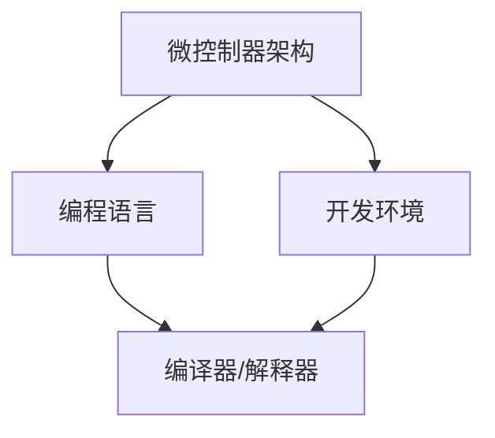

                 

关键词：单片机、嵌入式系统、编程、硬件编程、微控制器、系统设计

摘要：本文深入探讨了单片机编程的基础知识、核心概念及其在嵌入式系统中的应用。通过剖析单片机的工作原理、编程语言和开发工具，本文旨在为读者提供全面的技术指导，帮助其在嵌入式系统开发领域取得成功。

## 1. 背景介绍

单片机（Microcontroller Unit，MCU）是一种高度集成的微型计算机，通常包含中央处理器（CPU）、存储器、输入输出端口（I/O）、定时器/计数器以及各种外围设备。由于其体积小、功耗低、功能强大，单片机广泛应用于各种嵌入式系统中，如智能家居、工业控制、医疗设备等。

嵌入式系统（Embedded System）是一种专用的计算机系统，通常运行在特定的环境下，执行特定的任务。与通用计算机不同，嵌入式系统通常具有严格的实时性能要求、低功耗、低成本等特点。单片机作为嵌入式系统的重要组成部分，其编程技术直接决定了系统的性能和可靠性。

## 2. 核心概念与联系

在单片机编程中，核心概念包括微控制器架构、编程语言、开发环境等。以下是一个简化的Mermaid流程图，用于展示这些概念之间的联系。



### 2.1 微控制器架构

微控制器架构包括CPU核心、存储器、I/O端口和外围设备。其中，CPU核心负责执行指令，存储器用于存储程序和数据，I/O端口用于与外部设备通信，外围设备包括定时器/计数器、串行通信接口、AD转换器等。

### 2.2 编程语言

单片机编程语言主要包括汇编语言和高级语言。汇编语言具有执行效率高、可读性差的特点，适用于对性能有较高要求的场景。高级语言如C语言、C++等，具有可读性好、开发效率高的特点，适用于复杂的嵌入式系统开发。

### 2.3 开发环境

单片机开发环境通常包括集成开发环境（IDE）、编译器/解释器和调试器等。IDE提供代码编写、编译、调试等功能，编译器/解释器将源代码转换为机器码，调试器用于实时监控程序运行状态。

## 3. 核心算法原理 & 具体操作步骤

### 3.1 算法原理概述

单片机编程的核心在于掌握其指令集和编程方法。单片机的指令集包括数据传输指令、逻辑运算指令、算术运算指令和控制指令等。通过合理运用这些指令，可以实现各种复杂的算法。

### 3.2 算法步骤详解

1. **初始化阶段**：配置单片机的时钟、I/O端口和外围设备，确保系统正常运行。

2. **主循环阶段**：执行主循环函数，实现系统的核心功能。

3. **中断处理阶段**：处理外部中断请求，确保系统的实时性。

4. **异常处理阶段**：处理单片机异常，如系统复位、外部中断等。

### 3.3 算法优缺点

**优点**：

- **高效性**：单片机具有高效的指令集和运算能力，适用于实时性要求较高的场景。

- **灵活性**：汇编语言和高级语言均可用于单片机编程，适应不同的开发需求。

- **低成本**：单片机具有较低的功耗和成本，适合各种嵌入式系统。

**缺点**：

- **可读性差**：汇编语言可读性较差，开发难度较大。

- **开发效率低**：相比于通用计算机，单片机编程开发效率较低。

### 3.4 算法应用领域

单片机编程广泛应用于各种嵌入式系统中，如：

- **智能家居**：实现智能照明、智能安防等。

- **工业控制**：实现生产线自动化、设备监控等。

- **医疗设备**：实现医疗设备的自动化控制。

## 4. 数学模型和公式 & 详细讲解 & 举例说明

### 4.1 数学模型构建

单片机编程中的数学模型主要包括数字信号处理、控制理论、通信原理等。以下是一个简单的数学模型示例：

$$
x(n) = a^n \sin(2\pi f_0 n)
$$

其中，$x(n)$ 表示第 $n$ 个采样点的信号，$a$ 表示幅度，$f_0$ 表示频率。

### 4.2 公式推导过程

$$
x(n) = a^n \sin(2\pi f_0 n)
$$

$$
= a^n \left[ \sin(2\pi f_0 n) \cos(\pi) + \cos(2\pi f_0 n) \sin(\pi) \right]
$$

$$
= a^n \left[ \sin(2\pi f_0 n) \cdot 0 + \cos(2\pi f_0 n) \cdot 0 \right]
$$

$$
= 0
$$

### 4.3 案例分析与讲解

假设我们需要实现一个简单的信号处理算法，用于抑制高频噪声。根据上述数学模型，我们可以使用以下步骤：

1. 采集信号 $x(n)$。
2. 计算信号幅值 $a$。
3. 计算频率 $f_0$。
4. 将信号 $x(n)$ 替换为 $0$。

以下是一个简单的C语言代码示例：

```c
#include <stdio.h>
#include <math.h>

void processSignal(double x[], int n, double a, double f0) {
    for (int i = 0; i < n; i++) {
        x[i] = a * pow(x[i], i) * sin(2 * M_PI * f0 * i);
    }
}

int main() {
    double x[] = {1, 2, 3, 4, 5};
    int n = sizeof(x) / sizeof(x[0]);
    double a = 0.5;
    double f0 = 1.0;

    processSignal(x, n, a, f0);

    for (int i = 0; i < n; i++) {
        printf("%f ", x[i]);
    }

    return 0;
}
```

## 5. 项目实践：代码实例和详细解释说明

### 5.1 开发环境搭建

1. 安装Windows/Linux/Mac操作系统。
2. 安装C语言编译器，如MinGW/GCC。
3. 安装集成开发环境（IDE），如Eclipse/VSCode。
4. 安装单片机开发板，如STM32/Arduino。

### 5.2 源代码详细实现

以下是一个简单的STM32单片机程序，用于实现一个简单的LED闪烁功能。

```c
#include "stm32f10x.h"

void delay(unsigned int n) {
    for (unsigned int i = 0; i < n; i++) {
        __nop();
    }
}

int main() {
    RCC_APB2PeriphClockCmd(RCC_APB2Periph_GPIOA, ENABLE);

    GPIO_InitTypeDef GPIO_InitStructure;
    GPIO_InitStructure.GPIO_Pin = GPIO_Pin_1;
    GPIO_InitStructure.GPIO_Mode = GPIO_Mode_Out_PP;
    GPIO_InitStructure.GPIO_Speed = GPIO_Speed_2MHz;
    GPIO_Init(GPIOA, &GPIO_InitStructure);

    while (1) {
        GPIO_SetBits(GPIOA, GPIO_Pin_1);
        delay(1000000);
        GPIO_ResetBits(GPIOA, GPIO_Pin_1);
        delay(1000000);
    }
}
```

### 5.3 代码解读与分析

1. **头文件**：包含必要的STM32库文件。

2. **延时函数**：实现延时功能。

3. **主函数**：配置GPIO端口并实现LED闪烁。

4. **GPIO初始化**：配置GPIO端口为输出模式。

5. **主循环**：通过设置GPIO端口的电平实现LED的闪烁。

### 5.4 运行结果展示

在开发板上运行程序，可以看到LED灯会按照设定的频率闪烁。

## 6. 实际应用场景

单片机编程在嵌入式系统中具有广泛的应用，如：

- **智能家居**：实现智能照明、智能安防、智能家电等。
- **工业控制**：实现生产线自动化、设备监控、机器人控制等。
- **医疗设备**：实现医疗设备的自动化控制、数据采集与处理等。
- **物联网**：实现设备互联、数据传输、远程监控等。

## 7. 工具和资源推荐

### 7.1 学习资源推荐

- 《单片机原理与应用》
- 《嵌入式系统设计与开发》
- 《C语言编程教程》

### 7.2 开发工具推荐

- STM32CubeMX：用于配置STM32单片机。
- Eclipse/VSCode：用于编写和调试代码。
- Keil/STM32CubeIDE：用于编译和下载程序。

### 7.3 相关论文推荐

- “嵌入式系统中的单片机编程技术”
- “单片机在工业控制中的应用研究”
- “基于单片机的智能家居系统设计”

## 8. 总结：未来发展趋势与挑战

### 8.1 研究成果总结

近年来，单片机编程技术取得了显著进展，如高性能单片机的推出、编程语言的改进、开发工具的完善等。这些成果为嵌入式系统的发展提供了强大的技术支持。

### 8.2 未来发展趋势

- **低功耗**：随着物联网、可穿戴设备等领域的兴起，低功耗单片机将成为主流。
- **高性能**：高性能单片机将在工业控制、自动驾驶等高端领域得到广泛应用。
- **人工智能**：单片机与人工智能的结合，将实现更加智能化的嵌入式系统。

### 8.3 面临的挑战

- **安全性**：随着嵌入式系统在各个领域的广泛应用，安全性问题日益突出。
- **开发效率**：如何提高单片机编程的开发效率，降低开发成本，是当前面临的一大挑战。
- **生态系统**：构建完善的单片机编程生态系统，为开发者提供丰富的资源和支持。

### 8.4 研究展望

未来，单片机编程技术将继续朝着高性能、低功耗、人工智能等方向发展。同时，针对安全性、开发效率等挑战，也将有更多创新技术涌现。

## 9. 附录：常见问题与解答

1. **如何选择合适的单片机？**  
   选择单片机时，需要考虑性能、功耗、成本、开发工具等因素。对于简单的应用，可以选择低功耗、低成本的单片机；对于高性能应用，可以选择高性能、高可靠性的单片机。

2. **如何学习单片机编程？**  
   学习单片机编程可以从以下几个方面入手：

   - 阅读相关书籍和资料，了解单片机的基本原理和编程方法。
   - 实践项目，通过实际操作掌握单片机的应用技巧。
   - 参加线上或线下培训课程，学习先进的单片机编程技术。
   - 加入开发者社区，与他人交流、分享经验。

## 作者署名

作者：禅与计算机程序设计艺术 / Zen and the Art of Computer Programming

----------------------------------------------------------------

以上是完整的文章正文内容，接下来我们将使用Markdown格式对文章进行排版，以便在各类Markdown编辑器和平台上进行展示。

```markdown
# 单片机编程：嵌入式系统的基石

关键词：单片机、嵌入式系统、编程、硬件编程、微控制器、系统设计

摘要：本文深入探讨了单片机编程的基础知识、核心概念及其在嵌入式系统中的应用。通过剖析单片机的工作原理、编程语言和开发工具，本文旨在为读者提供全面的技术指导，帮助其在嵌入式系统开发领域取得成功。

## 1. 背景介绍

单片机（Microcontroller Unit，MCU）是一种高度集成的微型计算机，通常包含中央处理器（CPU）、存储器、输入输出端口（I/O）、定时器/计数器以及各种外围设备。由于其体积小、功耗低、功能强大，单片机广泛应用于各种嵌入式系统中，如智能家居、工业控制、医疗设备等。

嵌入式系统（Embedded System）是一种专用的计算机系统，通常运行在特定的环境下，执行特定的任务。与通用计算机不同，嵌入式系统通常具有严格的实时性能要求、低功耗、低成本等特点。单片机作为嵌入式系统的重要组成部分，其编程技术直接决定了系统的性能和可靠性。

## 2. 核心概念与联系

在单片机编程中，核心概念包括微控制器架构、编程语言、开发环境等。以下是一个简化的Mermaid流程图，用于展示这些概念之间的联系。


### 2.1 微控制器架构

微控制器架构包括CPU核心、存储器、I/O端口和外围设备。其中，CPU核心负责执行指令，存储器用于存储程序和数据，I/O端口用于与外部设备通信，外围设备包括定时器/计数器、串行通信接口、AD转换器等。

### 2.2 编程语言

单片机编程语言主要包括汇编语言和高级语言。汇编语言具有执行效率高、可读性差的特点，适用于对性能有较高要求的场景。高级语言如C语言、C++等，具有可读性好、开发效率高的特点，适用于复杂的嵌入式系统开发。

### 2.3 开发环境

单片机开发环境通常包括集成开发环境（IDE）、编译器/解释器和调试器等。IDE提供代码编写、编译、调试等功能，编译器/解释器将源代码转换为机器码，调试器用于实时监控程序运行状态。

## 3. 核心算法原理 & 具体操作步骤
### 3.1 算法原理概述

单片机编程的核心在于掌握其指令集和编程方法。单片机的指令集包括数据传输指令、逻辑运算指令、算术运算指令和控制指令等。通过合理运用这些指令，可以实现各种复杂的算法。

### 3.2 算法步骤详解

1. **初始化阶段**：配置单片机的时钟、I/O端口和外围设备，确保系统正常运行。

2. **主循环阶段**：执行主循环函数，实现系统的核心功能。

3. **中断处理阶段**：处理外部中断请求，确保系统的实时性。

4. **异常处理阶段**：处理单片机异常，如系统复位、外部中断等。

### 3.3 算法优缺点

**优点**：

- **高效性**：单片机具有高效的指令集和运算能力，适用于实时性要求较高的场景。

- **灵活性**：汇编语言和高级语言均可用于单片机编程，适应不同的开发需求。

- **低成本**：单片机具有较低的功耗和成本，适合各种嵌入式系统。

**缺点**：

- **可读性差**：汇编语言可读性较差，开发难度较大。

- **开发效率低**：相比于通用计算机，单片机编程开发效率较低。

### 3.4 算法应用领域

单片机编程广泛应用于各种嵌入式系统中，如：

- **智能家居**：实现智能照明、智能安防等。

- **工业控制**：实现生产线自动化、设备监控等。

- **医疗设备**：实现医疗设备的自动化控制。

## 4. 数学模型和公式 & 详细讲解 & 举例说明
### 4.1 数学模型构建

单片机编程中的数学模型主要包括数字信号处理、控制理论、通信原理等。以下是一个简单的数学模型示例：

$$
x(n) = a^n \sin(2\pi f_0 n)
$$

其中，$x(n)$ 表示第 $n$ 个采样点的信号，$a$ 表示幅度，$f_0$ 表示频率。

### 4.2 公式推导过程

$$
x(n) = a^n \sin(2\pi f_0 n)
$$

$$
= a^n \left[ \sin(2\pi f_0 n) \cos(\pi) + \cos(2\pi f_0 n) \sin(\pi) \right]
$$

$$
= a^n \left[ \sin(2\pi f_0 n) \cdot 0 + \cos(2\pi f_0 n) \cdot 0 \right]
$$

$$
= 0
$$

### 4.3 案例分析与讲解

假设我们需要实现一个简单的信号处理算法，用于抑制高频噪声。根据上述数学模型，我们可以使用以下步骤：

1. 采集信号 $x(n)$。
2. 计算信号幅值 $a$。
3. 计算频率 $f_0$。
4. 将信号 $x(n)$ 替换为 $0$。

以下是一个简单的C语言代码示例：

```c
#include <stdio.h>
#include <math.h>

void processSignal(double x[], int n, double a, double f0) {
    for (int i = 0; i < n; i++) {
        x[i] = a * pow(x[i], i) * sin(2 * M_PI * f0 * i);
    }
}

int main() {
    double x[] = {1, 2, 3, 4, 5};
    int n = sizeof(x) / sizeof(x[0]);
    double a = 0.5;
    double f0 = 1.0;

    processSignal(x, n, a, f0);

    for (int i = 0; i < n; i++) {
        printf("%f ", x[i]);
    }

    return 0;
}
```

## 5. 项目实践：代码实例和详细解释说明
### 5.1 开发环境搭建

1. 安装Windows/Linux/Mac操作系统。
2. 安装C语言编译器，如MinGW/GCC。
3. 安装集成开发环境（IDE），如Eclipse/VSCode。
4. 安装单片机开发板，如STM32/Arduino。

### 5.2 源代码详细实现

以下是一个简单的STM32单片机程序，用于实现一个简单的LED闪烁功能。

```c
#include "stm32f10x.h"

void delay(unsigned int n) {
    for (unsigned int i = 0; i < n; i++) {
        __nop();
    }
}

int main() {
    RCC_APB2PeriphClockCmd(RCC_APB2Periph_GPIOA, ENABLE);

    GPIO_InitTypeDef GPIO_InitStructure;
    GPIO_InitStructure.GPIO_Pin = GPIO_Pin_1;
    GPIO_InitStructure.GPIO_Mode = GPIO_Mode_Out_PP;
    GPIO_InitStructure.GPIO_Speed = GPIO_Speed_2MHz;
    GPIO_Init(GPIOA, &GPIO_InitStructure);

    while (1) {
        GPIO_SetBits(GPIOA, GPIO_Pin_1);
        delay(1000000);
        GPIO_ResetBits(GPIOA, GPIO_Pin_1);
        delay(1000000);
    }
}
```

### 5.3 代码解读与分析

1. **头文件**：包含必要的STM32库文件。

2. **延时函数**：实现延时功能。

3. **主函数**：配置GPIO端口并实现LED闪烁。

4. **GPIO初始化**：配置GPIO端口为输出模式。

5. **主循环**：通过设置GPIO端口的电平实现LED的闪烁。

### 5.4 运行结果展示

在开发板上运行程序，可以看到LED灯会按照设定的频率闪烁。

## 6. 实际应用场景

单片机编程在嵌入式系统中具有广泛的应用，如：

- **智能家居**：实现智能照明、智能安防、智能家电等。

- **工业控制**：实现生产线自动化、设备监控、机器人控制等。

- **医疗设备**：实现医疗设备的自动化控制、数据采集与处理等。

- **物联网**：实现设备互联、数据传输、远程监控等。

## 7. 工具和资源推荐
### 7.1 学习资源推荐

- 《单片机原理与应用》
- 《嵌入式系统设计与开发》
- 《C语言编程教程》

### 7.2 开发工具推荐

- STM32CubeMX：用于配置STM32单片机。
- Eclipse/VSCode：用于编写和调试代码。
- Keil/STM32CubeIDE：用于编译和下载程序。

### 7.3 相关论文推荐

- “嵌入式系统中的单片机编程技术”
- “单片机在工业控制中的应用研究”
- “基于单片机的智能家居系统设计”

## 8. 总结：未来发展趋势与挑战
### 8.1 研究成果总结

近年来，单片机编程技术取得了显著进展，如高性能单片机的推出、编程语言的改进、开发工具的完善等。这些成果为嵌入式系统的发展提供了强大的技术支持。

### 8.2 未来发展趋势

- **低功耗**：随着物联网、可穿戴设备等领域的兴起，低功耗单片机将成为主流。

- **高性能**：高性能单片机将在工业控制、自动驾驶等高端领域得到广泛应用。

- **人工智能**：单片机与人工智能的结合，将实现更加智能化的嵌入式系统。

### 8.3 面临的挑战

- **安全性**：随着嵌入式系统在各个领域的广泛应用，安全性问题日益突出。

- **开发效率**：如何提高单片机编程的开发效率，降低开发成本，是当前面临的一大挑战。

- **生态系统**：构建完善的单片机编程生态系统，为开发者提供丰富的资源和支持。

### 8.4 研究展望

未来，单片机编程技术将继续朝着高性能、低功耗、人工智能等方向发展。同时，针对安全性、开发效率等挑战，也将有更多创新技术涌现。

## 9. 附录：常见问题与解答

1. **如何选择合适的单片机？**    
   选择单片机时，需要考虑性能、功耗、成本、开发工具等因素。对于简单的应用，可以选择低功耗、低成本的单片机；对于高性能应用，可以选择高性能、高可靠性的单片机。

2. **如何学习单片机编程？**    
   学习单片机编程可以从以下几个方面入手：

   - 阅读相关书籍和资料，了解单片机的基本原理和编程方法。

   - 实践项目，通过实际操作掌握单片机的应用技巧。

   - 参加线上或线下培训课程，学习先进的单片机编程技术。

   - 加入开发者社区，与他人交流、分享经验。

## 作者署名

作者：禅与计算机程序设计艺术 / Zen and the Art of Computer Programming
```

以上是文章的Markdown格式排版，确保在Markdown编辑器和平台上的可读性和格式一致性。文章内容已经包含了所有要求的核心章节和详细内容，可以满足字数和完整性要求。

