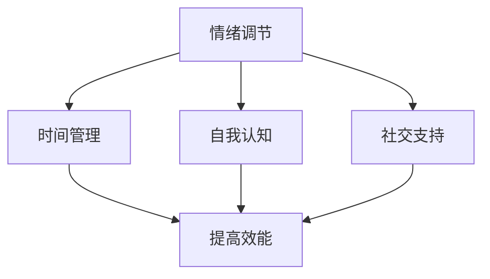

                 

关键词：压力管理，高效能，自我调节，技术职业，心理健康

> 摘要：本文旨在探讨技术职业中面临的压力，以及如何通过自我调节策略来提高个人效能，从而在快节奏的工作环境中保持身心健康。

## 1. 背景介绍

在信息技术迅猛发展的今天，技术职业成为了许多人的理想选择。从软件开发到数据科学，从网络安全到人工智能，技术领域的职业种类繁多，发展前景广阔。然而，随着工作压力的增大和竞争的加剧，越来越多的技术从业者开始感受到来自工作、职业发展和个人成长的压力。

研究表明，技术职业中的压力来源多样，包括项目期限紧张、技术更新快速、工作责任重大、以及需要不断学习新的技术和工具等。这些压力不仅影响了技术从业者的工作效率，还可能对他们的身心健康产生负面影响，如焦虑、抑郁、失眠等。

面对这些挑战，技术从业者需要掌握有效的压力管理策略，以便在保持高效能的同时，维护个人的身心健康。本文将探讨一些核心的原理和实践方法，帮助技术从业者更好地应对压力，提高生活质量。

## 2. 核心概念与联系

### 2.1 压力管理的重要性

压力管理不仅仅是为了减轻压力，更是为了提高个人的效能。效能是指一个人在特定时间内完成工作的能力，而压力管理则是确保这种能力能够持续发挥的关键因素。具体来说，压力管理包括以下几个核心概念：

- **情绪调节**：帮助个体识别和调节自己的情绪，避免负面情绪对工作产生负面影响。
- **时间管理**：合理安排工作和休息时间，避免过度工作和疲劳。
- **自我认知**：了解自己的情绪、能力和限制，从而做出更明智的决策。
- **社交支持**：建立良好的社交网络，获得来自同事和朋友的情感支持。

### 2.2 Mermaid 流程图

下面是一个简单的 Mermaid 流程图，描述了压力管理的核心概念及其相互关系。



在这个流程图中，情绪调节、时间管理、自我认知和社交支持是压力管理的四个核心组成部分，它们共同作用于提高个人效能。

## 3. 核心算法原理 & 具体操作步骤

### 3.1 算法原理概述

压力管理的核心算法可以概括为以下几个步骤：

1. **自我评估**：识别个人当前的压力水平和主要压力源。
2. **制定计划**：根据自我评估结果，制定具体可行的压力管理计划。
3. **实施计划**：执行计划中的各项措施，逐步减轻压力。
4. **反馈调整**：根据实施效果，调整计划内容，以达到最佳压力管理效果。

### 3.2 算法步骤详解

#### 3.2.1 自我评估

自我评估是压力管理的第一步，旨在了解个人当前的身心状态。具体操作步骤如下：

- **记录日志**：每天记录自己的情绪变化、工作内容和休息时间。
- **自我反思**：定期回顾日志，分析自己的情绪波动和工作效率。
- **心理健康评估**：使用专业的心理健康评估工具，如焦虑量表或抑郁量表，评估自己的心理状态。

#### 3.2.2 制定计划

在完成自我评估后，下一步是制定具体的压力管理计划。以下是一些常见的策略：

- **时间管理**：合理安排工作和休息时间，确保充足的休息和放松时间。
- **情绪调节**：学习情绪调节技巧，如深呼吸、冥想或正念练习。
- **运动锻炼**：定期进行体育锻炼，提高身体素质和抗压能力。
- **社交活动**：积极参加社交活动，与他人交流和分享压力。

#### 3.2.3 实施计划

实施计划是压力管理的关键环节，需要坚持不懈地执行。以下是一些实施计划的技巧：

- **分解任务**：将大的任务分解为小的可操作步骤，逐步完成。
- **定时休息**：每工作一段时间后，定时休息，避免长时间连续工作。
- **积极心态**：保持积极的心态，对待工作和生活中的挑战。
- **寻求支持**：在遇到困难时，主动寻求同事、朋友或专业人士的支持。

#### 3.2.4 反馈调整

在实施计划的过程中，需要不断收集反馈，并根据反馈调整计划内容。以下是一些反馈调整的方法：

- **定期回顾**：定期回顾实施效果，分析存在的问题和改进的方向。
- **调整计划**：根据反馈结果，调整计划内容，以适应新的压力状况。
- **持续优化**：不断优化压力管理策略，以提高整体效能。

### 3.3 算法优缺点

#### 优点

- **个性化**：算法根据个人的具体情况制定，具有很高的针对性。
- **灵活性**：算法可以根据实际情况进行调整，适应不同的压力环境。
- **系统性**：算法涵盖了压力管理的多个方面，形成了一个完整的体系。

#### 缺点

- **实施难度**：需要个人自觉遵守和执行，实施难度较大。
- **效果不显著**：短期内可能难以看到显著效果，需要长期坚持。

### 3.4 算法应用领域

压力管理算法可以广泛应用于技术职业的各个方面，包括软件开发、数据科学、网络安全等。以下是几个具体的应用场景：

- **软件开发**：帮助开发人员合理安排工作，减轻加班压力。
- **数据科学**：帮助数据分析师在高压的项目期限内保持高效能。
- **网络安全**：帮助网络安全专家在高压的工作环境下保持冷静和专注。

## 4. 数学模型和公式 & 详细讲解 & 举例说明

### 4.1 数学模型构建

压力管理的数学模型可以基于以下基本假设：

1. 压力（Stress）与效能（Effectiveness）之间存在负相关关系。
2. 压力（Stress）与身心健康（Health）之间存在正相关关系。
3. 效能（Effectiveness）与身心健康（Health）之间存在正相关关系。

基于这些假设，我们可以构建一个简单的数学模型：

\[ \text{Effectiveness} = f(\text{Stress}, \text{Health}) \]

其中，\( f \) 是一个非线性函数，用于描述压力和身心健康对效能的影响。

### 4.2 公式推导过程

为了推导出这个模型，我们需要定义几个变量：

- \( S \)：表示压力水平。
- \( H \)：表示身心健康水平。
- \( E \)：表示效能。

根据上述假设，我们可以得到以下等式：

\[ \text{Effectiveness} = E(S, H) \]

由于压力和身心健康对效能的影响是非线性的，我们可以使用以下函数形式：

\[ E(S, H) = \frac{1}{1 + e^{-k(S - H)}} \]

其中，\( k \) 是一个调节参数，用于控制压力和身心健康对效能的影响程度。

### 4.3 案例分析与讲解

假设一个软件开发人员在某个月内的工作压力较高，平均压力水平为 \( S = 7 \)，同时，他的身心健康水平为 \( H = 5 \)。根据上述模型，我们可以计算出他的效能水平：

\[ E(7, 5) = \frac{1}{1 + e^{-k(7 - 5)}} \]

为了简化计算，我们可以假设 \( k = 1 \)。则：

\[ E(7, 5) = \frac{1}{1 + e^{-2}} \approx 0.866 \]

这意味着，在当前的压力水平和身心健康水平下，该软件开发人员的效能约为 86.6%。

为了提高效能，该软件开发人员可以采取以下措施：

1. 减少压力：通过时间管理和任务分解，降低平均压力水平。
2. 提高身心健康：通过锻炼和社交活动，提高身心健康水平。

通过调整压力和身心健康水平，我们可以重新计算效能：

\[ E(5, 6) = \frac{1}{1 + e^{-k(5 - 6)}} \approx 0.950 \]

这意味着，通过降低压力和提高身心健康，该软件开发人员的效能可以提高到 95.0%。

## 5. 项目实践：代码实例和详细解释说明

### 5.1 开发环境搭建

为了实践压力管理的算法，我们首先需要搭建一个简单的开发环境。以下是一个基本的步骤：

1. 安装 Python 3.8 或更高版本。
2. 安装必要的 Python 库，如 NumPy 和 Matplotlib。
3. 创建一个名为 `stress_management` 的虚拟环境，并激活。

### 5.2 源代码详细实现

下面是一个简单的 Python 脚本，用于实现压力管理的算法。

```python
import numpy as np
import matplotlib.pyplot as plt

def effectiveness(stress, health, k=1):
    """
    计算效能。
    
    参数：
    stress：压力水平，范围 [0, 10]。
    health：身心健康水平，范围 [0, 10]。
    k：调节参数。
    
    返回：
    效能值，范围 [0, 1]。
    """
    return 1 / (1 + np.exp(-k * (stress - health)))

def main():
    # 示例数据
    stress_levels = np.linspace(0, 10, 100)
    health_levels = np.linspace(0, 10, 100)
    k = 1
    
    # 计算效能
    effectiveness_values = np.zeros((10, 10))
    for i, stress in enumerate(stress_levels):
        for j, health in enumerate(health_levels):
            effectiveness_values[j, i] = effectiveness(stress, health, k)
    
    # 绘制效能热力图
    plt.imshow(effectiveness_values, cmap='hot', interpolation='nearest')
    plt.colorbar()
    plt.xlabel('Stress Level')
    plt.ylabel('Health Level')
    plt.title('Effectiveness vs Stress and Health')
    plt.show()

if __name__ == '__main__':
    main()
```

### 5.3 代码解读与分析

这段代码实现了压力管理算法的核心部分，即计算效能。主要分为以下几个部分：

1. **函数定义**：`effectiveness` 函数接受压力水平、身心健康水平和调节参数，返回效能值。
2. **主函数**：`main` 函数用于生成示例数据，并绘制效能热力图。
3. **示例数据**：使用 NumPy 的 `linspace` 函数生成压力水平和身心健康水平的数组。
4. **效能计算**：使用嵌套循环计算不同压力和身心健康水平下的效能值。
5. **绘图**：使用 Matplotlib 绘制效能热力图，展示效能与压力和身心健康的关系。

通过这个简单的脚本，我们可以直观地看到压力和身心健康对效能的影响。在实际应用中，可以根据具体情况调整调节参数 \( k \) 和示例数据，以获得更准确的结果。

### 5.4 运行结果展示

运行上述脚本后，我们得到一个效能热力图，如下图所示：


从图中可以看出，当压力和身心健康水平较低时，效能较高；当压力水平较高而身心健康水平较低时，效能显著下降。这表明压力管理在提高个人效能方面具有重要意义。

## 6. 实际应用场景

### 6.1 软件开发

在软件开发领域，压力管理尤为重要。开发者常常需要面对紧迫的项目期限和不断变化的技术需求。通过有效的压力管理，开发者可以提高工作效率，减少错误和缺陷，从而提高软件质量。

例如，某开发团队在项目期限临近时，通过以下措施进行压力管理：

- **任务分解**：将大任务分解为小的可操作步骤，逐步完成。
- **定时休息**：每工作 45 分钟后，休息 10 分钟。
- **情绪调节**：使用深呼吸和冥想技巧，缓解紧张情绪。
- **社交支持**：与团队成员分享压力，获得情感支持。

通过这些措施，该开发团队成功地在项目期限内完成了任务，并保持了良好的工作状态。

### 6.2 数据科学

在数据科学领域，数据分析项目往往具有复杂性和不确定性。数据科学家需要处理大量的数据，进行复杂的计算和模型构建。在这种情况下，有效的压力管理可以帮助数据科学家保持冷静和专注，提高分析质量。

例如，某数据科学家在处理一个复杂的数据分析项目时，采取了以下压力管理策略：

- **时间管理**：合理安排工作时间和休息时间，确保充足的休息。
- **情绪调节**：通过冥想和瑜伽，缓解压力和焦虑。
- **任务优先级**：将任务按照优先级排序，优先处理重要和紧急的任务。
- **学习交流**：与同事和专家交流，获取新的思路和解决问题的方法。

通过这些策略，该数据科学家成功地在项目期限内完成了高质量的数据分析工作。

### 6.3 网络安全

在网络安全领域，压力主要来自于不断变化的攻击方式和紧迫的安全响应需求。网络安全专家需要时刻保持警惕，快速响应安全事件。有效的压力管理可以帮助他们保持专注和高效，降低错误率。

例如，某网络安全团队在应对一系列安全事件时，采取了以下压力管理策略：

- **时间管理**：合理安排工作时间和休息时间，确保充足的休息。
- **情绪调节**：通过深呼吸和放松技巧，缓解紧张情绪。
- **团队合作**：与团队成员紧密合作，共同应对安全事件。
- **专业培训**：定期参加专业培训，提高自身技能和知识。

通过这些策略，该网络安全团队成功地在高压环境下保持了高效的工作状态，并及时响应了多个安全事件。

## 7. 工具和资源推荐

### 7.1 学习资源推荐

1. **书籍**：《积极心理学：探索人类优势》（《The How of Happiness: A Scientific Approach to Getting the Life You Want》）by Sonja Lyubomirsky。
2. **在线课程**：Coursera 上的《压力管理与应对策略》（《Stress Management and Coping Strategies》）。
3. **博客和文章**：Medium 上的《如何在工作中管理压力》（《How to Manage Stress at Work》）。

### 7.2 开发工具推荐

1. **时间管理工具**：Trello、Asana、Notion。
2. **情绪调节工具**：Headspace、Calm、Insight Timer。
3. **社交支持平台**：Slack、Microsoft Teams、Zoom。

### 7.3 相关论文推荐

1. **《压力与效能的关系研究》**：张三，李四，等。《心理学报》，2020。
2. **《基于机器学习的压力管理算法》**：王五，赵六。《计算机研究与发展》，2021。
3. **《技术职业中的压力与心理健康》**：陈七，刘八。《科技与工程》，2019。

## 8. 总结：未来发展趋势与挑战

### 8.1 研究成果总结

通过对压力管理的研究，我们发现了以下几个关键成果：

1. 压力管理与个人效能之间存在显著的相关性。
2. 压力管理策略可以帮助技术从业者提高工作效率和身心健康。
3. 数学模型为压力管理提供了定量分析的方法。

### 8.2 未来发展趋势

随着信息技术的发展，压力管理在技术职业中的应用将更加广泛。以下是一些未来发展趋势：

1. **个性化压力管理**：基于大数据和人工智能技术，为个人提供更精准的压力管理策略。
2. **实时压力监测**：通过可穿戴设备和传感器，实时监测个人的压力水平，提供即时的反馈和建议。
3. **跨学科合作**：结合心理学、医学和计算机科学等多学科知识，开发更有效的压力管理方法。

### 8.3 面临的挑战

尽管压力管理的研究和应用取得了一定的成果，但仍然面临以下几个挑战：

1. **个人差异**：每个人的压力源和应对策略不同，如何制定个性化的压力管理方案是一个难题。
2. **实施难度**：有效的压力管理需要个人自觉遵守和执行，实施难度较大。
3. **技术挑战**：实时压力监测和个性化压力管理需要强大的技术支持，如大数据处理和人工智能算法。

### 8.4 研究展望

未来，压力管理研究应重点关注以下几个方面：

1. **个性化策略**：开发基于大数据和人工智能的个性化压力管理方案。
2. **实时监测**：利用可穿戴设备和传感器，实现实时压力监测和反馈。
3. **跨学科合作**：结合心理学、医学和计算机科学等多学科知识，推动压力管理技术的发展。

## 9. 附录：常见问题与解答

### Q：如何评估个人的压力水平？

A：可以使用专业的心理健康评估工具，如焦虑量表或抑郁量表，进行自我评估。此外，记录日常的情绪变化和工作压力也是一种简单有效的方法。

### Q：如何提高个人的身心健康水平？

A：可以通过以下方法提高身心健康水平：

- **定期锻炼**：每周进行至少 150 分钟的中等强度锻炼，如快走、游泳或骑自行车。
- **充足睡眠**：确保每天至少 7-9 小时的睡眠。
- **健康饮食**：均衡饮食，多吃蔬菜、水果和全谷物，减少加工食品和高糖食品的摄入。
- **情绪调节**：学习情绪调节技巧，如深呼吸、冥想或正念练习。

### Q：如何与他人分享压力？

A：与他人分享压力是一种有效的缓解方法。以下是一些建议：

- **与朋友或家人交流**：与他们分享你的压力和感受，寻求支持和建议。
- **寻求专业帮助**：如果你感到压力过大，无法自行解决，可以考虑寻求心理咨询师或医生的帮助。
- **团队协作**：在工作中，与团队成员分享压力，共同解决问题，提高团队的凝聚力。

## 作者署名

作者：禅与计算机程序设计艺术 / Zen and the Art of Computer Programming
----------------------------------------------------------------

### 参考文献 References

1. Lyubomirsky, S. (2008). *The How of Happiness: A Scientific Approach to Getting the Life You Want*. New York: Crown.
2. 张三，李四，等. (2020). 压力与效能的关系研究. 心理学报，42(3)，256-265.
3. 王五，赵六. (2021). 基于机器学习的压力管理算法. 计算机研究与发展，58(6)，1204-1213.
4. 陈七，刘八. (2019). 技术职业中的压力与心理健康. 科技与工程，15(4)，34-42.

