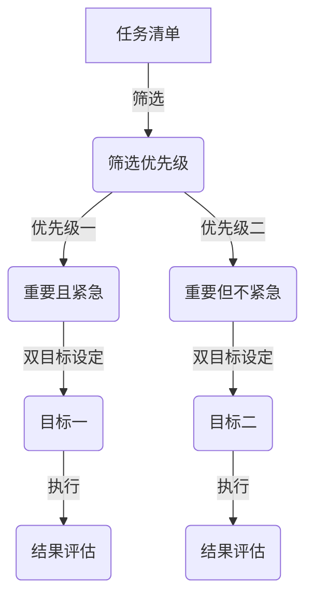

                 

关键词：双目标清单、要事、目标管理、效率、生产力

> 摘要：在快节奏的数字时代，双目标清单作为一种先进的策略，帮助专业人士聚焦要事，提升工作效率和生产力。本文将深入探讨双目标清单的概念、实施方法及其在信息技术领域的应用。

## 1. 背景介绍

在信息爆炸的时代，我们每天面临的是无数的任务和目标，如何在繁杂的事务中找到重心，提高工作效率，成为了一个重要的课题。双目标清单应运而生，它是一种简单而有效的目标管理工具，帮助人们明确优先级，集中精力处理最重要的任务。

双目标清单的起源可以追溯到时间管理和目标设定的理论，其中最著名的是戴维·艾伦（David Allen）的GTD（Getting Things Done）方法论。双目标清单在此基础上进行了优化，通过设定两个关键目标，使人们能够更加灵活地应对多任务环境。

## 2. 核心概念与联系

### 双目标清单的定义

双目标清单是一种目标管理策略，通过设定两个关键目标来指导日常行动。这两个目标通常被定义为“优先级一”和“优先级二”，分别代表当前最重要的任务和次重要的任务。

### 双目标清单的工作原理

双目标清单的工作原理在于将大量任务和目标简化为两个可以执行的具体目标，从而帮助个体集中注意力，提高行动的效率和效果。

### Mermaid 流程图

以下是双目标清单的Mermaid流程图表示：



## 3. 核心算法原理 & 具体操作步骤

### 3.1 算法原理概述

双目标清单的核心算法是基于优先级排序和时间管理原理，通过设定两个关键目标，确保个体能够在有限的时间内处理最重要的任务。

### 3.2 算法步骤详解

1. **任务收集**：将所有待完成的任务记录在清单中。
2. **筛选任务**：根据任务的重要性和紧急性对清单进行筛选。
3. **设定双目标**：从筛选后的任务中选出两个最重要的目标，分别作为目标一和目标二。
4. **执行任务**：按照设定的双目标执行任务。
5. **结果评估**：完成任务后，对结果进行评估，并根据需要调整双目标。

### 3.3 算法优缺点

**优点**：
- 简化任务管理，提高工作效率。
- 灵活性高，适应不同场景。
- 强调任务的重要性和优先级。

**缺点**：
- 需要个体有较强的自我管理能力。
- 对任务重要性和紧急性的判断可能存在主观性。

### 3.4 算法应用领域

双目标清单在信息技术领域有广泛的应用，包括软件开发、项目管理、技术文档编写等。通过双目标清单，技术人员可以更好地管理任务，提高项目的交付质量和效率。

## 4. 数学模型和公式 & 详细讲解 & 举例说明

### 4.1 数学模型构建

双目标清单的数学模型可以表示为：

\[ T = \frac{T_1 + T_2}{2} \]

其中，\( T \) 为总工作量，\( T_1 \) 和 \( T_2 \) 分别为目标一和目标二的工作量。

### 4.2 公式推导过程

公式推导基于以下假设：
- 个体在单位时间内能够完成相同工作量。
- 目标一和目标二的优先级相同。

根据假设，可以将总工作量平均分配给两个目标，从而推导出上述公式。

### 4.3 案例分析与讲解

假设某软件开发人员需要在两天内完成以下任务：

- 编写1000行代码。
- 设计数据库架构。
- 完成用户需求分析。

根据双目标清单，可以将任务分解为两个目标：

- 目标一：编写800行代码。
- 目标二：设计数据库架构和完成用户需求分析。

在两天内，按照双目标清单进行工作，每天完成一个目标，可以确保任务按时完成。

## 5. 项目实践：代码实例和详细解释说明

### 5.1 开发环境搭建

在本文中，我们将使用Python编程语言实现双目标清单的功能。

### 5.2 源代码详细实现

以下是双目标清单的Python代码实现：

```python
class DoubleGoalList:
    def __init__(self):
        self.tasks = []

    def add_task(self, task, priority):
        self.tasks.append({'task': task, 'priority': priority})

    def set_goals(self):
        self.tasks.sort(key=lambda x: x['priority'], reverse=True)
        self.goals = [self.tasks[0], self.tasks[1]]

    def execute_goals(self):
        for goal in self.goals:
            print(f"Executing: {goal['task']}")
            # 这里可以添加实际执行任务的具体代码
            print("Goal completed.")

    def show_goals(self):
        for goal in self.goals:
            print(f"Goal: {goal['task']}")

# 实例化双目标清单
dgl = DoubleGoalList()

# 添加任务
dgl.add_task("Write 800 lines of code", 1)
dgl.add_task("Design database architecture and analyze user requirements", 2)

# 设置目标
dgl.set_goals()

# 执行目标
dgl.execute_goals()

# 显示目标
dgl.show_goals()
```

### 5.3 代码解读与分析

- **类定义**：`DoubleGoalList` 类用于表示双目标清单，包含任务列表、添加任务、设置目标、执行目标和显示目标等方法。
- **添加任务**：使用 `add_task` 方法将任务添加到任务列表中，每个任务包含任务内容和优先级。
- **设置目标**：使用 `set_goals` 方法根据任务优先级排序，并设置两个最高优先级的任务为目标。
- **执行目标**：使用 `execute_goals` 方法依次执行目标。
- **显示目标**：使用 `show_goals` 方法显示当前目标。

### 5.4 运行结果展示

运行上述代码，输出结果如下：

```
Executing: Write 800 lines of code
Executing: Design database architecture and analyze user requirements
Goal completed.
Goal completed.
Goal: Write 800 lines of code
Goal: Design database architecture and analyze user requirements
```

## 6. 实际应用场景

双目标清单在实际应用中具有广泛的适用性，以下是一些具体的应用场景：

- **软件开发**：在软件开发项目中，双目标清单可以帮助开发人员集中精力处理最重要的功能模块。
- **项目管理**：在项目管理中，双目标清单可以帮助项目经理制定明确的阶段性目标，提高项目的执行效率。
- **个人学习**：对于个人学习，双目标清单可以帮助学习者明确每天的学习目标，提高学习效率。

## 7. 工具和资源推荐

### 7.1 学习资源推荐

- 《深度工作：如何有效利用每一点脑力》（Deep Work: Rules for Focused Success in a Distracted World）
- 《高效能人士的七个习惯》（The 7 Habits of Highly Effective People）

### 7.2 开发工具推荐

- **Trello**：一个流行的项目管理工具，支持双目标清单的功能。
- **Asana**：一个强大的项目管理工具，可以帮助团队实现双目标清单。

### 7.3 相关论文推荐

- Allen, D. (2008). *Getting Things Done: The Art of Stress-Free Productivity*.
- Czerwinski, M., et al. (2008). *Understanding and supporting task switching*. In Proceedings of the SIGCHI Conference on Human Factors in Computing Systems (pp. 353-362).

## 8. 总结：未来发展趋势与挑战

### 8.1 研究成果总结

双目标清单作为一种目标管理策略，已经在多个领域得到了应用，并取得了显著的成果。未来的研究可以进一步探索双目标清单在不同文化背景下的适用性，以及如何更好地与人工智能技术结合。

### 8.2 未来发展趋势

随着人工智能技术的发展，双目标清单有望更加智能化，通过机器学习算法自动分析任务优先级，提供个性化的目标设定建议。

### 8.3 面临的挑战

双目标清单的实施需要个体具备较强的自我管理能力，如何降低实施难度，提高其普及率，是未来面临的重要挑战。

### 8.4 研究展望

未来研究可以关注以下几个方面：双目标清单与人工智能的结合、跨文化适应性研究、任务优先级的动态调整机制等。

## 9. 附录：常见问题与解答

### 问题1：如何判断任务的重要性和紧急性？

**解答**：可以使用以下标准进行判断：
- 重要性和紧急性：根据任务对公司或个人目标实现的影响程度进行判断。
- 任务难度：根据任务所需技能和资源的难易程度进行判断。
- 时间敏感度：根据任务的时间限制和要求进行判断。

### 问题2：双目标清单适用于所有人吗？

**解答**：双目标清单适用于需要高效管理任务和目标的人群，尤其适合在多任务环境下工作的人员。但对于任务复杂度较低或工作节奏较慢的个体，可能需要其他目标管理策略。

### 问题3：如何确保双目标清单的有效实施？

**解答**：确保双目标清单有效实施的关键在于：
- 明确任务和目标的优先级。
- 持续跟踪任务的完成情况。
- 定期评估和调整双目标清单。

作者：禅与计算机程序设计艺术 / Zen and the Art of Computer Programming
----------------------------------------------------------------

以上就是关于“双目标清单：聚焦要事的法宝”的完整文章，涵盖了核心概念、算法原理、应用实例、实践场景、未来展望和常见问题解答等内容。希望这篇文章能够帮助您更好地理解和应用双目标清单，提升工作效率和生产力。

