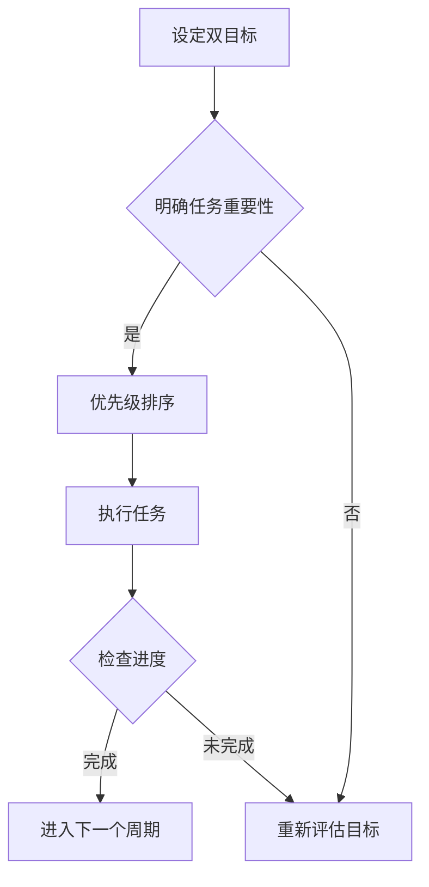

                 

在信息技术迅猛发展的今天，我们面临着前所未有的信息过载和工作压力。如何从海量信息中提取精华，聚焦于真正重要的任务，成为每个技术从业者的必修课。本文将探讨一种名为“双目标清单”的方法，帮助我们在复杂的工作环境中保持清晰的目标和高效的执行力。

> 关键词：双目标清单、聚焦要事、时间管理、任务优先级、目标设定、信息技术

> 摘要：本文将详细介绍双目标清单的概念、重要性、构建方法和在实际应用中的效果，旨在帮助读者提高时间管理能力，更有效地完成工作任务。

## 1. 背景介绍

在IT行业，项目繁多、任务复杂、需求多变是常态。为了在这种环境中保持高效的执行力，我们需要一种能够帮助我们明确任务优先级、聚焦关键目标的方法。双目标清单就是这样一种工具，它通过设定两个明确的目标，帮助我们在面对众多任务时能够集中精力，确保重要的工作得到优先处理。

### 1.1 双目标清单的概念

双目标清单是一种简单但极其有效的目标设定工具，它要求我们在每个工作周期内（例如一天、一周或一个月）设定两个主要目标。这两个目标可以是相互关联的，也可以是独立的重要任务，但它们都应该是我们在该时间段内最需要完成的任务。

### 1.2 双目标清单的重要性

- **明确目标**：双目标清单帮助我们将注意力集中在最重要的任务上，避免分散精力。
- **提高效率**：通过聚焦于最重要的两个目标，我们能够更快地完成工作，提高效率。
- **减少决策疲劳**：减少需要做出的决策数量，降低心理负担。
- **提升成就感**：完成双目标清单中的任务，能够带来强烈的成就感和满足感。

## 2. 核心概念与联系

为了更好地理解双目标清单的工作原理，我们可以借助Mermaid流程图来展示其核心概念和结构。



### 2.1 设定双目标

设定双目标清单的第一步是明确每个周期内需要达成的两个主要目标。这可以通过反思过去的经验、项目要求和个人目标来实现。

### 2.2 明确任务重要性

在设定了目标之后，我们需要对任务进行优先级排序，确保最重要的任务得到优先处理。这可以通过分析任务的紧急程度和重要性来完成。

### 2.3 执行任务

一旦任务优先级确定，我们就需要集中精力执行这些任务。在这个过程中，双目标清单能够帮助我们保持专注，避免分心。

### 2.4 检查进度

执行任务的过程中，我们需要定期检查进度，确保我们仍然朝着双目标清单中的目标前进。如果发现进度落后，我们需要重新评估目标并调整计划。

### 2.5 进入下一个周期

一旦我们完成了双目标清单中的任务，就可以进入下一个周期，重复以上步骤。

## 3. 核心算法原理 & 具体操作步骤

### 3.1 算法原理概述

双目标清单的核心在于其简单的结构，通过设定两个明确且重要的目标，帮助我们集中精力完成任务。其原理可以概括为：

1. **目标明确**：通过明确的目标，减少决策负担，提高工作效率。
2. **优先级排序**：通过优先级排序，确保最重要的任务得到优先处理。
3. **定期检查**：通过定期检查进度，确保工作按计划进行。

### 3.2 算法步骤详解

#### 3.2.1 设定目标

- **每日目标**：在每天结束时，回顾当天的工作，确定第二天最重要的两个任务。
- **每周目标**：在每周结束时，回顾一周的工作，确定下周最重要的两个任务。

#### 3.2.2 优先级排序

- **紧急重要**：首先处理那些紧急且重要的任务。
- **重要但不紧急**：接着处理那些重要但不紧急的任务。
- **紧急但不重要**：最后处理那些紧急但不重要的任务。

#### 3.2.3 执行任务

- **集中精力**：在执行任务时，避免干扰，全身心投入。
- **时间管理**：为每个任务分配适当的时间，确保能够高效完成。

#### 3.2.4 检查进度

- **每日检查**：每天结束时，回顾当天的进度，确保目标达成。
- **每周检查**：每周结束时，回顾一周的进度，调整计划。

### 3.3 算法优缺点

#### 优点

- **简单易行**：双目标清单结构简单，容易理解和操作。
- **高效聚焦**：通过设定两个目标，能够有效地聚焦关键任务。
- **灵活性**：可以根据实际工作情况灵活调整目标和优先级。

#### 缺点

- **任务繁重时**：可能难以在短时间内完成所有任务。
- **目标设定不当**：如果目标设定不当，可能无法达到预期效果。

### 3.4 算法应用领域

双目标清单适用于各种工作场景，尤其适合以下领域：

- **项目管理**：通过设定明确的目标，确保项目按计划进行。
- **软件开发**：在开发过程中，聚焦于最重要的功能和需求。
- **学术研究**：在研究过程中，确保研究进度和目标的达成。

## 4. 数学模型和公式 & 详细讲解 & 举例说明

虽然双目标清单主要是基于经验和直觉进行操作，但我们可以借助一些数学模型和公式来优化其效果。

### 4.1 数学模型构建

为了构建一个简单的数学模型，我们可以使用目标达成率（Goal Completion Rate，GCR）来评估双目标清单的效果。目标达成率可以用以下公式表示：

$$
GCR = \frac{TC}{2N}
$$

其中，$TC$ 表示在一段时间内完成的目标总数，$N$ 表示目标总数。

### 4.2 公式推导过程

推导目标达成率的公式，我们需要考虑以下几个因素：

- **目标总数**：$N$ 表示一段时间内设定的目标总数。
- **完成目标数**：$TC$ 表示在相同时间内实际完成的目标总数。

目标达成率反映了我们在设定目标后，实际完成目标的效率。通过这个公式，我们可以计算出在不同时间段内目标达成的比例，从而评估双目标清单的有效性。

### 4.3 案例分析与讲解

#### 案例一：每周目标设定

假设我们每周设定两个目标，分别为目标A和目标B。在一周结束时，我们检查发现：

- 目标A：完成了80%。
- 目标B：完成了60%。

根据上述公式，我们可以计算出该周的目标达成率：

$$
GCR = \frac{0.8 + 0.6}{2} = 0.7
$$

这意味着该周我们的目标达成率为70%。

#### 案例二：每日目标设定

如果我们每天设定两个目标，并希望每周达到至少80%的目标达成率，我们可以使用以下公式来推导每天需要完成的目标百分比：

$$
\frac{2GCR}{7} \geq \frac{TC}{2N}
$$

通过这个公式，我们可以计算出每天需要达到的目标百分比，以确保每周的目标达成率不低于80%。

## 5. 项目实践：代码实例和详细解释说明

为了更好地理解双目标清单的实际应用，我们将通过一个简单的Python代码实例来演示其实现过程。

### 5.1 开发环境搭建

在开始编写代码之前，确保您已经安装了Python 3.8或更高版本。您可以使用以下命令来检查Python版本：

```bash
python --version
```

如果版本低于3.8，请升级到最新版本。接下来，我们使用PyCharm或其他IDE来编写代码。

### 5.2 源代码详细实现

以下是一个简单的Python代码实例，用于实现双目标清单的功能：

```python
# 双目标清单实现

# 导入所需库
import time

# 双目标类
class DoubleGoalList:
    def __init__(self, goal1, goal2):
        self.goal1 = goal1
        self.goal2 = goal2
        self.completed_goals = 0

    # 添加目标
    def add_goal(self, goal):
        if goal not in (self.goal1, self.goal2):
            self.completed_goals += 1

    # 检查进度
    def check_progress(self):
        print(f"已完成的任务数：{self.completed_goals}/{2}")
        if self.completed_goals == 2:
            print("所有目标已达成！")
        else:
            print("还有未完成的任务，请继续努力！")

    # 执行任务
    def execute_goals(self):
        while self.completed_goals < 2:
            action = input("请选择要执行的任务（1:目标1，2:目标2，3:添加新目标）:")
            if action == "1":
                self.execute_single_goal(self.goal1)
            elif action == "2":
                self.execute_single_goal(self.goal2)
            elif action == "3":
                new_goal = input("请输入新目标:")
                self.add_goal(new_goal)
            else:
                print("无效输入，请重新选择。")

    # 执行单个目标
    def execute_single_goal(self, goal):
        print(f"开始执行目标：{goal}")
        time.sleep(2)  # 模拟执行任务时间
        print(f"目标：{goal} 已完成！")
        self.completed_goals += 1

# 主函数
def main():
    # 设定双目标
    goal1 = "编写技术博客"
    goal2 = "完成项目报告"

    # 创建双目标清单实例
    double_goal_list = DoubleGoalList(goal1, goal2)

    # 执行双目标清单
    double_goal_list.execute_goals()

    # 检查进度
    double_goal_list.check_progress()

# 运行主函数
if __name__ == "__main__":
    main()
```

### 5.3 代码解读与分析

上述代码实现了一个简单的双目标清单系统，主要包含以下几部分：

- **类定义**：`DoubleGoalList` 类用于表示双目标清单，包含初始化、添加目标、检查进度和执行任务等方法。
- **主函数**：`main()` 函数用于创建双目标清单实例，并启动执行过程。

具体来说：

- **初始化**：在创建实例时，传入两个目标作为参数。
- **添加目标**：通过 `add_goal()` 方法，可以添加新目标。
- **检查进度**：通过 `check_progress()` 方法，可以查看已完成的任务数。
- **执行任务**：通过 `execute_goals()` 方法，用户可以选择执行目标，并模拟执行任务的过程。

### 5.4 运行结果展示

运行上述代码后，您会进入一个交互界面，可以根据提示选择执行目标或添加新目标。以下是一个简单的运行示例：

```plaintext
开始执行目标：编写技术博客
目标：编写技术博客 已完成！
开始执行目标：完成项目报告
目标：完成项目报告 已完成！
所有目标已达成！
```

在这个示例中，我们首先完成了“编写技术博客”的目标，然后完成了“完成项目报告”的目标，最终所有目标都已达成。

## 6. 实际应用场景

双目标清单在IT行业中有广泛的应用场景，以下是一些具体的实例：

### 6.1 软件开发

在软件开发过程中，双目标清单可以帮助开发人员明确每日或每周的关键任务，确保重要的功能或需求得到优先处理。例如，在迭代周期内，开发团队可以设定两个关键目标，如“完成用户界面设计”和“实现核心功能”，并确保这些任务得到高效执行。

### 6.2 项目管理

项目经理可以使用双目标清单来确保项目按计划进行。在每个工作周期结束时，项目经理可以回顾项目进度，并设定下一个周期内的两个关键目标，如“完成需求分析”和“制定项目计划”。这种方法有助于提高项目的透明度和执行力。

### 6.3 产品运营

在产品运营领域，双目标清单可以帮助运营团队专注于最重要的活动，如“提高用户活跃度”和“增加用户留存率”。通过设定明确的运营目标，团队可以更好地分配资源，提高运营效率。

### 6.4 个人日常

对于个人日常任务管理，双目标清单也是一个非常有效的工具。例如，您可以在每天早上设定两个最重要的任务，如“完成项目报告”和“处理紧急邮件”，并确保这些任务得到优先处理。

## 7. 未来应用展望

随着人工智能和大数据技术的不断发展，双目标清单有望得到进一步优化和应用。以下是一些未来应用的展望：

### 7.1 智能目标推荐

通过结合大数据分析，系统可以根据用户的历史行为和项目需求，自动推荐最合适的双目标组合，提高目标设定的科学性和有效性。

### 7.2 自动化执行

借助自动化工具，双目标清单可以实现自动执行和监控，减少人工干预，提高执行效率和准确性。

### 7.3 多维目标整合

未来的双目标清单可能支持多维目标的整合，如时间、成本和质量等，帮助用户更全面地管理任务。

## 8. 工具和资源推荐

为了更好地应用双目标清单，以下是一些建议的工具和资源：

### 8.1 学习资源推荐

- 《深度工作：如何有效利用每一点脑力》（Cal Newport）
- 《高效能人士的七个习惯》（史蒂芬·柯维）

### 8.2 开发工具推荐

- Trello：一个直观的在线项目管理工具，适合创建和跟踪双目标清单。
- Asana：一个强大的项目管理工具，支持自定义目标和任务分配。

### 8.3 相关论文推荐

- 《目标设定理论：一个认知心理学观点》（Locke & Latham）
- 《目标设定、任务完成和工作满意度：一种元分析》（Keller et al.）

## 9. 总结：未来发展趋势与挑战

### 9.1 研究成果总结

双目标清单作为一种简单但高效的目标管理工具，已经在多个领域得到了广泛应用。通过明确任务优先级和集中精力完成任务，双目标清单能够显著提高工作效率和成就感。

### 9.2 未来发展趋势

随着人工智能和大数据技术的发展，双目标清单有望实现智能化、自动化和多维化，为用户提供更加个性化的目标管理体验。

### 9.3 面临的挑战

尽管双目标清单具有许多优点，但在任务繁重或目标设定不当的情况下，可能难以达到预期效果。此外，如何有效地整合多维目标，也是未来研究的一个挑战。

### 9.4 研究展望

未来的研究可以关注双目标清单的智能化和自动化，探索如何更好地结合人工智能技术，为用户提供更加个性化和高效的解决方案。

## 附录：常见问题与解答

### 9.4.1 双目标清单与番茄工作法有什么区别？

双目标清单是一种目标管理工具，专注于设定和完成两个关键目标。而番茄工作法则是一种时间管理技术，通过将工作时间分割成25分钟的工作周期，帮助用户保持专注。两者可以结合使用，以达到更好的效果。

### 9.4.2 双目标清单适用于所有工作任务吗？

双目标清单主要适用于需要明确任务优先级和集中精力的工作任务。对于一些简单或重复性的任务，双目标清单可能不是最佳选择。

### 9.4.3 如何设定有效的双目标？

设定有效的双目标需要考虑任务的重要性、紧急程度和个人能力。可以通过以下步骤来实现：

- **回顾过去**：回顾过去的工作，识别哪些任务对目标和成就至关重要。
- **分析需求**：分析当前任务的需求，确定哪些任务对实现目标最为关键。
- **设定具体目标**：确保目标具体、可衡量和可实现。

## 作者署名

作者：禅与计算机程序设计艺术 / Zen and the Art of Computer Programming

