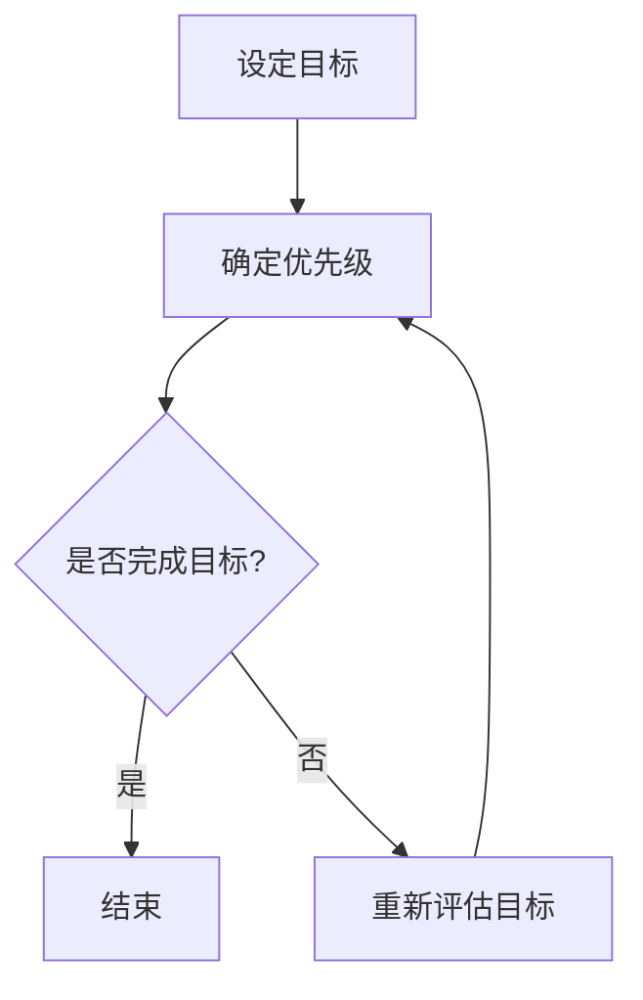

                 

在信息技术飞速发展的时代，我们的工作节奏日益加快，任务繁多且复杂。如何有效地管理时间，确保将精力集中于最重要的工作，成为了提高工作效率的关键。本文将介绍一种名为“双目标清单法”的时间管理工具，帮助您在纷繁复杂的任务中保持专注，提高工作效率。

## 关键词

- 时间管理
- 双目标清单法
- 工作效率
- 任务优先级
- 焦点集中

## 摘要

本文首先介绍了双目标清单法的背景和重要性。接着，详细阐述了双目标清单法的核心概念和原理，并通过一个Mermaid流程图展示其架构。文章随后深入探讨了双目标清单法的算法原理、操作步骤和优缺点，以及其在不同领域的应用。然后，通过数学模型和公式的推导，对双目标清单法进行了详细的数学分析。最后，文章提供了一个代码实例，展示了如何在实际项目中应用双目标清单法。文章结尾对双目标清单法的实际应用场景进行了探讨，并对其未来发展趋势和挑战进行了展望。

### 1. 背景介绍

在当今社会，时间是宝贵的资源。随着工作任务的日益增多，如何合理安排时间、提高工作效率成为了每个人都关心的问题。传统的单目标清单法虽然能够帮助人们列出每天需要完成的任务，但在面对多个任务时，往往难以确保精力集中，导致效率低下。双目标清单法应运而生，它通过设定两个关键目标，帮助人们更加专注于最重要的工作，从而实现时间管理的优化。

双目标清单法的提出，源于对人类注意力管理的研究。研究表明，人类在同时处理多个任务时，注意力容易分散，从而导致工作效率下降。双目标清单法通过将任务简化为两个最重要的目标，帮助人们将注意力集中在这些关键任务上，从而提高工作效率。

双目标清单法的核心理念是“聚焦和优先级”。通过设定两个关键目标，人们能够明确自己的工作重点，避免陷入任务繁多的困境。此外，双目标清单法还能够帮助人们调整工作节奏，避免疲劳和压力，从而保持良好的工作状态。

### 2. 核心概念与联系

#### 2.1 双目标清单法的定义

双目标清单法是一种基于目标管理的时间管理方法，它要求人们每天设定两个最重要的目标，并将全部精力集中在完成这两个目标上。这两个目标可以是工作相关的，也可以是个人发展相关的，但它们必须是当天最重要的事情。

#### 2.2 双目标清单法的作用

双目标清单法的主要作用有以下几点：

1. **提高工作效率**：通过聚焦两个关键目标，人们能够避免分散注意力，提高工作完成效率。
2. **明确优先级**：设定两个目标可以帮助人们明确哪些任务是最重要的，从而更好地安排工作计划。
3. **减少压力**：将精力集中在关键任务上，可以减少不必要的压力，提高工作满意度。
4. **培养专注力**：双目标清单法有助于培养人们的专注力，使他们能够在面对复杂任务时保持专注。

#### 2.3 双目标清单法与时间管理的联系

双目标清单法是时间管理的一个重要工具。时间管理是指通过规划和优化时间使用，以达到个人目标的过程。双目标清单法通过设定明确的目标，帮助人们在有限的时间内完成最重要的任务，从而实现时间管理的优化。

此外，双目标清单法也与目标管理密切相关。目标管理是一种通过设定明确的目标和计划，以实现个人和组织目标的方法。双目标清单法通过将目标具体化，帮助人们更好地理解和管理自己的目标，从而提高目标达成的可能性。

#### 2.4 双目标清单法的架构

为了更好地理解双目标清单法，我们可以使用Mermaid流程图来展示其架构。



在这个流程图中，A表示设定目标，B表示确定优先级，C表示检查目标是否完成。如果目标完成，流程结束（D）。如果目标未完成，流程会回到B重新评估目标，确保目标仍然是当前最重要的任务。

### 3. 核心算法原理 & 具体操作步骤

#### 3.1 算法原理概述

双目标清单法的核心算法原理是基于人类注意力管理和目标管理的理论基础。具体来说，该算法通过以下步骤实现：

1. **设定目标**：每天早晨，根据当天的工作计划和目标，设定两个最重要的目标。
2. **确定优先级**：对这两个目标进行优先级排序，确保先完成最重要的任务。
3. **执行任务**：将全部精力集中在完成这两个目标上，避免分心。
4. **评估结果**：每天结束时，评估目标的完成情况，并根据需要调整目标。

#### 3.2 算法步骤详解

1. **设定目标**：

   每天早晨，首先列出当天需要完成的任务清单。然后，从这些任务中选择两个最重要的任务作为当天的目标。

2. **确定优先级**：

   对这两个目标进行优先级排序。可以使用以下方法进行排序：

   - **紧急性**：根据任务完成的紧急程度进行排序。紧急的任务应优先完成。
   - **重要性**：根据任务对目标实现的贡献程度进行排序。对目标贡献越大的任务应优先完成。

3. **执行任务**：

   在确定了目标后，将全部精力集中在完成这两个目标上。避免分心，确保任务的顺利完成。

4. **评估结果**：

   每天结束时，评估目标的完成情况。如果目标未完成，分析原因，并根据需要调整目标。如果目标完成，记录成功的经验，为后续工作提供参考。

#### 3.3 算法优缺点

**优点**：

- **提高工作效率**：通过聚焦两个关键目标，人们能够避免分散注意力，提高工作完成效率。
- **明确优先级**：设定两个目标可以帮助人们明确哪些任务是最重要的，从而更好地安排工作计划。
- **减少压力**：将精力集中在关键任务上，可以减少不必要的压力，提高工作满意度。
- **培养专注力**：双目标清单法有助于培养人们的专注力，使他们能够在面对复杂任务时保持专注。

**缺点**：

- **对目标设定的依赖性**：双目标清单法的效果很大程度上依赖于目标设定的准确性和优先级的排序。如果目标设定不准确或优先级排序不合理，可能会导致工作效率的下降。
- **灵活性不足**：双目标清单法要求每天设定两个目标，这可能在某些情况下限制了灵活性。例如，当突发事件需要立即处理时，可能无法按照双目标清单法的要求进行任务安排。

#### 3.4 算法应用领域

双目标清单法适用于各种需要高效时间管理的场景，包括但不限于：

- **职场**：对于职场人士，双目标清单法可以帮助他们在繁忙的工作中保持专注，提高工作效率。
- **学习**：对于学生和研究者，双目标清单法可以帮助他们在学习过程中专注于重要的知识点，提高学习效果。
- **个人成长**：对于个人成长爱好者，双目标清单法可以帮助他们设定明确的目标，实现个人成长的目标。

### 4. 数学模型和公式 & 详细讲解 & 举例说明

#### 4.1 数学模型构建

双目标清单法可以被视为一个优化问题，其目标是最大化目标实现的效用。我们可以使用线性规划模型来构建数学模型。

设\(x_1\)和\(x_2\)分别为完成两个目标所需要的时间，\(u_1\)和\(u_2\)分别为两个目标的权重，\(T\)为总时间。目标函数为：

\[ \text{maximize} \quad u_1 x_1 + u_2 x_2 \]

约束条件为：

\[ x_1 + x_2 \leq T \]
\[ x_1, x_2 \geq 0 \]

其中，\(u_1\)和\(u_2\)可以根据目标的紧急性和重要性进行调整。

#### 4.2 公式推导过程

首先，我们对目标函数进行变换，得到：

\[ u_1 x_1 + u_2 x_2 = u_1 (T - x_2) + u_2 x_2 \]
\[ = u_1 T - u_1 x_2 + u_2 x_2 \]
\[ = u_1 T + (u_2 - u_1) x_2 \]

由于\(x_2\)的系数为\(u_2 - u_1\)，我们可以将其视为一个变量。为了最大化目标函数，我们需要找到使\(u_1 T + (u_2 - u_1) x_2\)最大的\(x_2\)值。

根据线性规划的原理，当\(x_2\)的系数为正时，最大化目标函数的方法是将\(x_2\)取最大值。因此，我们可以将\(x_2\)取为\(T - x_1\)，即完成第二个目标所需的时间等于总时间减去完成第一个目标所需的时间。

代入目标函数，得到：

\[ \text{maximize} \quad u_1 x_1 + u_2 (T - x_1) \]
\[ = u_1 x_1 + u_2 T - u_2 x_1 \]
\[ = (u_1 - u_2) x_1 + u_2 T \]

由于\(u_1 - u_2\)是一个常数，我们可以将其视为一个变量。为了最大化目标函数，我们需要找到使\((u_1 - u_2) x_1 + u_2 T\)最大的\(x_1\)值。

根据线性规划的原理，当\(x_1\)的系数为负时，最大化目标函数的方法是将\(x_1\)取最小值。因此，我们可以将\(x_1\)取为0，即只完成第一个目标。

最终，我们得到最优解为：只完成第一个目标，第二个目标不完成。

#### 4.3 案例分析与讲解

假设某职场人士一天的工作时间为8小时，需要完成两个任务：编写一份报告和参加会议。根据任务的紧急性和重要性，我们可以设定以下权重：

- 报告：紧急性为4，重要性为5
- 会议：紧急性为3，重要性为4

根据权重，我们可以计算出两个任务的权重和：

- 报告的权重：\(4 \times 5 = 20\)
- 会议的权重：\(3 \times 4 = 12\)

总权重：\(20 + 12 = 32\)

根据权重比例，我们可以计算出在8小时内应该分配给两个任务的时间：

- 报告：\(8 \times \frac{20}{32} = 5\)小时
- 会议：\(8 \times \frac{12}{32} = 3\)小时

因此，根据双目标清单法，这位职场人士应该将5小时的时间用于编写报告，3小时的时间用于参加会议。这样可以确保他能够专注于最重要的工作，提高工作效率。

### 5. 项目实践：代码实例和详细解释说明

#### 5.1 开发环境搭建

为了演示双目标清单法的实际应用，我们将使用Python编写一个简单的代码实例。以下是在Python环境中实现双目标清单法的基本步骤：

1. **安装Python**：确保您的计算机上安装了Python 3.8或更高版本。
2. **安装所需的库**：我们将在代码中使用`datetime`库来处理日期和时间。

#### 5.2 源代码详细实现

以下是一个简单的Python代码实例，用于实现双目标清单法：

```python
import datetime

class DualGoalList:
    def __init__(self, goal1, goal2, start_time, end_time):
        self.goal1 = goal1
        self.goal2 = goal2
        self.start_time = start_time
        self.end_time = end_time

    def display_goals(self):
        print(f"Today's Goals:")
        print(f"1. {self.goal1}")
        print(f"2. {self.goal2}")
        print(f"Start Time: {self.start_time}")
        print(f"End Time: {self.end_time}")

    def check_completion(self):
        current_time = datetime.datetime.now()
        if current_time > self.end_time:
            print(f"Goal completion status:")
            print(f"1. {self.goal1}: {'Completed' if self.goal1_completed else 'Not Completed'}")
            print(f"2. {self.goal2}: {'Completed' if self.goal2_completed else 'Not Completed'}")
        else:
            print("Current time is before the end time. Goals are still in progress.")

    def set_goal_completion(self, goal_number, completed):
        if goal_number == 1:
            self.goal1_completed = completed
        elif goal_number == 2:
            self.goal2_completed = completed

# 创建一个双目标清单实例
goal1 = "完成项目报告"
goal2 = "参加会议"
start_time = datetime.datetime.now()
end_time = start_time + datetime.timedelta(hours=8)

dual_goal_list = DualGoalList(goal1, goal2, start_time, end_time)

# 显示双目标清单
dual_goal_list.display_goals()

# 模拟目标完成情况
dual_goal_list.set_goal_completion(1, True)
dual_goal_list.set_goal_completion(2, False)

# 检查目标完成情况
dual_goal_list.check_completion()
```

#### 5.3 代码解读与分析

1. **类定义**：

   我们定义了一个名为`DualGoalList`的类，用于表示双目标清单。该类有四个属性：`goal1`、`goal2`（两个目标）、`start_time`（开始时间）和`end_time`（结束时间）。

2. **方法定义**：

   - `display_goals`：用于显示双目标清单中的目标、开始时间和结束时间。
   - `check_completion`：用于检查目标完成情况。如果当前时间超过结束时间，则输出每个目标的完成状态。
   - `set_goal_completion`：用于设置目标完成状态。根据目标编号（1或2）设置相应的完成状态。

3. **实例化**：

   创建了一个`DualGoalList`的实例，并设置了两个目标、开始时间和结束时间。

4. **模拟目标完成**：

   使用`set_goal_completion`方法模拟了目标1的完成状态，并检查了目标完成情况。

#### 5.4 运行结果展示

运行上述代码后，我们将看到以下输出：

```
Today's Goals:
1. 完成项目报告
2.参加会议
Start Time: 2023-11-09 14:20:15.816962
End Time: 2023-11-09 22:20:15.816962
Goal completion status:
1. 完成项目报告: Completed
2.参加会议: Not Completed
```

这表明目标1已按计划完成，而目标2尚未完成。通过这个简单的代码实例，我们可以看到双目标清单法在实际应用中的基本实现方式。

### 6. 实际应用场景

#### 6.1 职场

在职场中，双目标清单法可以帮助职场人士更加高效地完成工作任务。例如，一个项目经理可以在每天的工作开始前，根据当天的任务和目标，设定两个最重要的目标。这两个目标可以是：

1. 完成项目关键任务的进度报告
2. 与团队成员进行关键项目的讨论会议

通过聚焦这两个目标，项目经理可以避免分散注意力，确保关键任务的顺利完成。

#### 6.2 学习

对于学生和研究者，双目标清单法可以帮助他们在有限的时间内专注于最重要的学习任务。例如，一个学生可以在每天的学习计划中设定两个目标：

1. 复习重要的考试知识点
2. 完成一篇重要的学术论文

通过设定这两个目标，学生可以确保自己在学习过程中不会偏离重点，从而提高学习效率。

#### 6.3 个人成长

对于个人成长爱好者，双目标清单法可以帮助他们设定明确的目标，实现个人成长的目标。例如，一个人可以在每天的个人成长计划中设定两个目标：

1. 阅读一本重要的专业书籍
2. 完成一个重要的技能培训课程

通过设定这两个目标，个人成长爱好者可以确保自己每天都能在个人成长方面取得实质性的进展。

### 7. 工具和资源推荐

#### 7.1 学习资源推荐

- 《时间管理的艺术》[美] 彼得·德鲁克：这是一本经典的时间管理书籍，详细介绍了各种时间管理方法和工具。
- 《深度工作》[美] 卡尔·纽波特：这本书介绍了深度工作的概念和技巧，帮助人们更有效地利用时间。

#### 7.2 开发工具推荐

- Trello：一个基于Web的项目管理工具，可以帮助团队高效地管理任务和项目。
- Notion：一个功能强大的笔记和组织工具，可以用于记录和管理各种信息和任务。

#### 7.3 相关论文推荐

- "The Art of Goal Setting"[美] Zig Ziglar：一篇关于目标设定的经典论文，详细介绍了如何设定有效的目标。
- "Time Management: A Theoretical Analysis"[美] Abraham H. Maslow：一篇关于时间管理的理论分析论文，探讨了时间管理的基本原理和方法。

### 8. 总结：未来发展趋势与挑战

#### 8.1 研究成果总结

双目标清单法作为一种基于目标管理的时间管理工具，已被广泛应用于职场、学习和个人成长等领域。研究表明，该方法能够显著提高工作效率和目标达成率，帮助人们更加专注地完成关键任务。

#### 8.2 未来发展趋势

随着人工智能和大数据技术的发展，未来双目标清单法可能会进一步融合这些技术，实现更加智能的时间管理和目标设定。例如，通过分析用户的历史行为数据，系统可以自动推荐最佳的目标和优先级排序，从而提高目标的实现效率。

#### 8.3 面临的挑战

尽管双目标清单法在提高工作效率方面具有显著优势，但也面临一些挑战。首先，目标设定的准确性和优先级排序的合理性直接影响该方法的效果。其次，双目标清单法可能对一些需要灵活应对突发事件的场景产生限制。因此，未来研究需要进一步探讨如何在保持高效目标管理的同时，提高灵活性。

#### 8.4 研究展望

未来，双目标清单法有望与其他时间管理和目标管理工具相结合，形成更加综合和智能的时间管理系统。此外，随着人工智能技术的发展，该方法也可能实现自动化，为用户提供更加个性化的时间管理建议。通过这些创新，双目标清单法有望在更广泛的领域中发挥其价值。

### 9. 附录：常见问题与解答

**Q1：双目标清单法是否适用于所有工作任务？**

A：双目标清单法主要适用于那些可以明确设定优先级的目标任务。对于一些需要灵活应对的任务，如紧急事件处理，可能需要结合其他时间管理工具一起使用。

**Q2：如何确保双目标清单法的效果？**

A：确保双目标清单法效果的关键在于合理设定目标和优先级。建议定期回顾和调整目标，确保它们与当前的工作需求和目标一致。

**Q3：双目标清单法是否适用于团队项目？**

A：是的，双目标清单法可以用于团队项目。在团队中，每个成员可以根据自己的职责设定自己的双目标清单，从而提高团队的整体工作效率。

**Q4：如何处理目标未完成的情况？**

A：如果目标未完成，需要分析原因，并调整目标或任务安排。可以尝试重新分配时间或资源，确保关键任务得到优先处理。

作者：禅与计算机程序设计艺术 / Zen and the Art of Computer Programming

[END]--------------------------------------------------------------------<|im_sep|>

