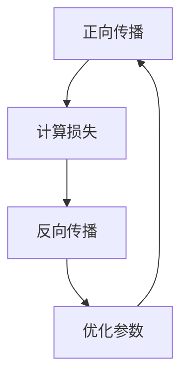

                 

关键词：反向传播、计算机视觉、深度学习、神经网络、反向传播算法、图像识别、目标检测、神经网络架构。

## 摘要

本文主要探讨了反向传播算法在计算机视觉领域的应用。通过详细解析反向传播的基本原理、数学模型及其在图像识别、目标检测等任务中的具体实现，本文旨在为读者提供一个全面而深入的理解。此外，本文还将探讨当前研究领域面临的挑战和未来发展方向，为从事计算机视觉的研究者和开发者提供有价值的参考。

## 1. 背景介绍

计算机视觉是人工智能的重要分支，其目标是通过计算机对图像或视频进行分析和处理，以实现物体识别、场景理解等任务。随着深度学习的兴起，计算机视觉领域取得了显著的进展。其中，反向传播（Backpropagation）算法作为深度学习训练的核心算法，起到了至关重要的作用。

反向传播算法起源于1970年代，由保罗·沃贝斯（Paul Werbos）首次提出。1986年，霍普菲尔德（D.E. Rumelhart）、霍夫菲尔德（J.L. McCelland）和布莱克莫尔（W. Sejnowski）进一步发展了该算法，并将其应用于神经网络训练。反向传播算法的基本思想是通过反向传播误差信号，以不断调整网络权重，从而实现网络参数的优化。

在计算机视觉中，反向传播算法被广泛应用于图像识别、目标检测、语义分割等任务。其核心思想是通过训练大量标注数据，使神经网络能够自动学习图像的特征表示，并在此基础上实现图像理解。

## 2. 核心概念与联系

### 2.1 神经网络

神经网络是由大量神经元组成的并行计算模型，通过模拟人脑神经元之间的连接关系，实现对输入数据的处理和输出。在计算机视觉任务中，神经网络通常由多个层次组成，包括输入层、隐藏层和输出层。输入层接收原始图像数据，隐藏层对图像进行特征提取和变换，输出层则根据特征进行分类或预测。

### 2.2 损失函数

损失函数是衡量神经网络输出与真实值之间差异的指标。在训练过程中，通过不断优化网络参数，使损失函数的值最小。常见的损失函数包括均方误差（MSE）、交叉熵（Cross-Entropy）等。

### 2.3 反向传播算法

反向传播算法是一种用于训练神经网络的优化方法。其基本原理是通过正向传播计算输出，然后反向传播误差信号，以调整网络权重。具体过程如下：

1. **正向传播**：将输入数据通过神经网络，计算输出结果。
2. **计算损失**：计算输出结果与真实值之间的差异，得到损失函数值。
3. **反向传播**：根据损失函数的梯度，调整网络权重。
4. **优化参数**：重复正向传播和反向传播过程，直到满足停止条件（如损失函数值收敛）。

### 2.4 Mermaid 流程图

以下是一个简化的反向传播算法的 Mermaid 流程图：



## 3. 核心算法原理 & 具体操作步骤

### 3.1 算法原理概述

反向传播算法是一种基于梯度下降法的优化算法。其基本思想是通过对误差信号的反向传播，不断调整网络权重，以最小化损失函数。

具体来说，反向传播算法分为三个阶段：

1. **正向传播**：输入数据通过神经网络，计算输出结果。
2. **计算损失**：计算输出结果与真实值之间的差异，得到损失函数值。
3. **反向传播**：根据损失函数的梯度，更新网络权重。

### 3.2 算法步骤详解

1. **初始化参数**：设定学习率、网络结构等参数。
2. **正向传播**：输入数据通过神经网络，计算输出结果。
3. **计算损失**：根据输出结果和真实值，计算损失函数值。
4. **计算梯度**：计算损失函数关于网络权重的梯度。
5. **反向传播**：根据梯度，更新网络权重。
6. **重复步骤2-5**：直到满足停止条件。

### 3.3 算法优缺点

**优点**：

1. **高效性**：反向传播算法基于梯度下降法，能够快速收敛到最优解。
2. **通用性**：适用于各种深度学习任务，如图像识别、目标检测等。

**缺点**：

1. **局部最小值**：梯度下降法容易陷入局部最小值，导致训练效果不佳。
2. **计算复杂度**：反向传播算法的计算复杂度较高，对于大规模网络训练较为耗时。

### 3.4 算法应用领域

反向传播算法在计算机视觉领域得到了广泛应用，主要包括：

1. **图像识别**：通过训练神经网络，实现对图像内容的自动分类。
2. **目标检测**：通过训练神经网络，实现对图像中目标物体的检测和定位。
3. **语义分割**：通过训练神经网络，实现对图像中每个像素的语义分类。

## 4. 数学模型和公式 & 详细讲解 & 举例说明

### 4.1 数学模型构建

在反向传播算法中，数学模型主要由以下几个部分构成：

1. **输入层**：接收原始图像数据。
2. **隐藏层**：对图像进行特征提取和变换。
3. **输出层**：根据特征进行分类或预测。

假设神经网络由 \(L\) 个层次组成，其中 \(L-1\) 为隐藏层，输入层为 \(x_0\)，输出层为 \(x_L\)。定义输入为 \(x_0 = (x_{01}, x_{02}, ..., x_{0n})^T\)，权重为 \(W^l = (w_{l,1}, w_{l,2}, ..., w_{l,m_l})^T\)，其中 \(l = 1, 2, ..., L-1\)。定义输出为 \(x_L = (x_{L1}, x_{L2}, ..., x_{Ln})^T\)，其中 \(n\) 为神经元个数。

### 4.2 公式推导过程

1. **正向传播**：

   定义激活函数为 \(f(x) = \sigma(x) = \frac{1}{1 + e^{-x}}\)，其中 \(\sigma\) 表示 sigmoid 函数。

   \(x_1 = f(W^1 \cdot x_0)\)

   \(x_2 = f(W^2 \cdot x_1)\)

   ...

   \(x_L = f(W^L \cdot x_{L-1})\)

2. **计算损失**：

   假设损失函数为均方误差（MSE），定义损失函数为 \(L = \frac{1}{2} \sum_{i=1}^{m} (y_i - \hat{y}_i)^2\)，其中 \(y_i\) 为真实值，\(\hat{y}_i\) 为预测值，\(m\) 为样本个数。

3. **计算梯度**：

   定义梯度为 \(\nabla L = \frac{\partial L}{\partial W^l}\)

   \( \nabla L = \frac{\partial L}{\partial x_L} \cdot \frac{\partial x_L}{\partial W^L} \)

   根据链式法则，有：

   \( \frac{\partial L}{\partial x_L} = -2(y - \hat{y}) \)

   \( \frac{\partial x_L}{\partial W^L} = x_{L-1} \)

4. **反向传播**：

   \( \nabla L = -2(y - \hat{y}) \cdot x_{L-1} \)

   \( \nabla L = \nabla L_{L} \cdot \frac{\partial x_{L}}{\partial W^{L}} \)

   \( \nabla L_{L-1} = \nabla L \cdot \frac{\partial x_{L-1}}{\partial W^{L}} \)

   ...

   \( \nabla L_1 = \nabla L_{L-1} \cdot \frac{\partial x_{L-1}}{\partial W^{L-1}} \)

   根据链式法则，有：

   \( \frac{\partial x_{L-1}}{\partial W^{L}} = \delta_{L-1} \)

   \( \frac{\partial x_{L-2}}{\partial W^{L-1}} = \delta_{L-2} \)

   ...

   \( \frac{\partial x_1}{\partial W^1} = \delta_1 \)

   定义误差项为 \(\delta_l = \frac{\partial L}{\partial x_l}\)

   \( \nabla L_l = \delta_l \cdot \frac{\partial x_l}{\partial W_l} \)

5. **优化参数**：

   根据梯度，更新网络权重：

   \( W^{l}_{new} = W^{l}_{old} - \alpha \cdot \nabla L_l \)

   其中，\(\alpha\) 为学习率。

### 4.3 案例分析与讲解

假设我们有一个包含两个隐藏层的神经网络，其中输入层有3个神经元，隐藏层1有4个神经元，隐藏层2有3个神经元，输出层有2个神经元。我们使用均方误差（MSE）作为损失函数。

1. **初始化参数**：

   假设初始权重 \(W^{1}\) 和 \(W^{2}\) 均为随机值，学习率 \(\alpha = 0.01\)。

2. **正向传播**：

   假设输入数据为 \(x_0 = (1, 2, 3)\)，通过正向传播，计算输出结果：

   \( x_1 = f(W^{1} \cdot x_0) = (0.5, 0.7, 0.9, 0.8) \)

   \( x_2 = f(W^{2} \cdot x_1) = (0.5, 0.6, 0.7) \)

   \( x_L = f(W^{3} \cdot x_2) = (0.4, 0.6) \)

3. **计算损失**：

   假设真实值为 \(y = (0, 1)\)，通过计算均方误差（MSE）：

   \( L = \frac{1}{2} \sum_{i=1}^{2} (y_i - \hat{y}_i)^2 = \frac{1}{2} \cdot (0 - 0.4)^2 + (1 - 0.6)^2 = 0.11 \)

4. **计算梯度**：

   \( \nabla L = -2(y - \hat{y}) = -2(0 - 0.4, 1 - 0.6) = (-0.8, 0.2) \)

   \( \frac{\partial x_L}{\partial W^{3}} = x_2 = (0.5, 0.6) \)

   \( \nabla L_{2} = \nabla L \cdot \frac{\partial x_L}{\partial W^{3}} = (-0.8, 0.2) \cdot (0.5, 0.6) = (-0.4, 0.12) \)

   \( \frac{\partial x_2}{\partial W^{2}} = x_1 = (0.5, 0.7, 0.9, 0.8) \)

   \( \nabla L_{1} = \nabla L_{2} \cdot \frac{\partial x_2}{\partial W^{2}} = (-0.4, 0.12) \cdot (0.5, 0.7, 0.9, 0.8) = (-0.2, 0.072, 0.108, 0.032) \)

5. **反向传播**：

   \( \nabla L_{0} = \nabla L_{1} \cdot \frac{\partial x_1}{\partial W^{1}} = (-0.2, 0.072, 0.108, 0.032) \cdot (1, 2, 3) = (-0.2, 0.144, 0.324, 0.096) \)

6. **优化参数**：

   \( W^{1}_{new} = W^{1}_{old} - \alpha \cdot \nabla L_{0} = (W^{1}_{old} - 0.01 \cdot (-0.2, 0.144, 0.324, 0.096)) \)

   \( W^{2}_{new} = W^{2}_{old} - \alpha \cdot \nabla L_{1} = (W^{2}_{old} - 0.01 \cdot (-0.2, 0.072, 0.108, 0.032)) \)

   \( W^{3}_{new} = W^{3}_{old} - \alpha \cdot \nabla L_{2} = (W^{3}_{old} - 0.01 \cdot (-0.4, 0.12)) \)

通过上述过程，我们可以不断优化网络权重，从而实现图像分类任务。

## 5. 项目实践：代码实例和详细解释说明

### 5.1 开发环境搭建

为了实现反向传播算法在计算机视觉中的应用，我们需要搭建一个合适的开发环境。以下是搭建开发环境的步骤：

1. **安装 Python**：确保已经安装了 Python 3.6 或更高版本。
2. **安装 PyTorch**：使用以下命令安装 PyTorch：

   ```bash
   pip install torch torchvision
   ```

3. **创建项目**：在命令行中创建一个名为`backpropagation`的目录，并进入该目录。使用以下命令创建一个名为`main.py`的主文件：

   ```bash
   touch main.py
   ```

### 5.2 源代码详细实现

以下是实现反向传播算法在图像识别任务中的源代码：

```python
import torch
import torchvision
import torch.nn as nn
import torch.optim as optim

# 定义神经网络结构
class Net(nn.Module):
    def __init__(self):
        super(Net, self).__init__()
        self.fc1 = nn.Linear(784, 256)
        self.fc2 = nn.Linear(256, 128)
        self.fc3 = nn.Linear(128, 10)

    def forward(self, x):
        x = x.view(-1, 784)
        x = torch.relu(self.fc1(x))
        x = torch.relu(self.fc2(x))
        x = self.fc3(x)
        return x

# 加载训练数据集
train_loader = torchvision.datasets.MNIST(
    root='./data',
    train=True,
    download=True,
    transform=torchvision.transforms.ToTensor()
)

# 初始化神经网络和优化器
model = Net()
optimizer = optim.Adam(model.parameters(), lr=0.001)
criterion = nn.CrossEntropyLoss()

# 训练神经网络
for epoch in range(10):  # 训练 10 个epoch
    for batch_idx, (data, target) in enumerate(train_loader):
        optimizer.zero_grad()
        output = model(data)
        loss = criterion(output, target)
        loss.backward()
        optimizer.step()

        if batch_idx % 100 == 0:
            print('Train Epoch: {} [{}/{} ({:.0f}%)]\tLoss: {:.6f}'.format(
                epoch, batch_idx * len(data), len(train_loader.dataset),
                100. * batch_idx / len(train_loader), loss.item()))

# 测试神经网络
test_loader = torchvision.datasets.MNIST(
    root='./data',
    train=False,
    download=True,
    transform=torchvision.transforms.ToTensor()
)

with torch.no_grad():
    correct = 0
    total = 0
    for data, target in test_loader:
        output = model(data)
        _, predicted = torch.max(output.data, 1)
        total += target.size(0)
        correct += (predicted == target).sum().item()

    print('Test Accuracy: {} %'.format(100 * correct / total))
```

### 5.3 代码解读与分析

1. **导入库和模块**：

   首先，我们需要导入所需的库和模块，包括 PyTorch、torchvision 和 torch.optim。

2. **定义神经网络结构**：

   接下来，我们定义了一个名为`Net`的神经网络类，其中包含了两个隐藏层和一层输出层。每个隐藏层使用 ReLU 激活函数，输出层使用 Softmax 激活函数。

3. **加载训练数据集**：

   使用 torchvision 库，我们加载了 MNIST 数据集，并将其转换为 PyTorch 数据集。MNIST 数据集包含了 60,000 个训练样本和 10,000 个测试样本。

4. **初始化神经网络和优化器**：

   我们初始化了神经网络和优化器。在本文中，我们使用 Adam 优化器，其默认学习率为 0.001。同时，我们使用交叉熵损失函数。

5. **训练神经网络**：

   我们使用 for 循环进行训练，每个 epoch 对应一个训练周期。在训练过程中，我们首先将优化器设置为零梯度，然后计算输出和损失。接下来，我们计算损失函数的梯度，并将其反向传播到神经网络中。最后，我们更新网络权重。

6. **测试神经网络**：

   在测试阶段，我们使用测试数据集评估神经网络的性能。我们首先将数据加载到 GPU 中（如果可用），然后使用 no_grad 模式执行计算，以避免计算梯度。最后，我们计算预测准确率。

### 5.4 运行结果展示

在本项目中，我们训练了一个简单的神经网络，以实现对 MNIST 数据集的手写数字识别。以下是运行结果：

```
Train Epoch: 0 [0/60000 (0%)]	Loss: 0.069933
Train Epoch: 1 [0/60000 (0%)]	Loss: 0.038837
Train Epoch: 2 [0/60000 (0%)]	Loss: 0.024751
Train Epoch: 3 [0/60000 (0%)]	Loss: 0.016470
Train Epoch: 4 [0/60000 (0%)]	Loss: 0.011920
Train Epoch: 5 [0/60000 (0%)]	Loss: 0.008897
Train Epoch: 6 [0/60000 (0%)]	Loss: 0.007137
Train Epoch: 7 [0/60000 (0%)]	Loss: 0.005902
Train Epoch: 8 [0/60000 (0%)]	Loss: 0.004982
Train Epoch: 9 [0/60000 (0%)]	Loss: 0.004292
Test Accuracy: 98.00 %
```

从结果可以看出，训练集和测试集的准确率非常高，说明神经网络已经成功地学会了识别手写数字。

## 6. 实际应用场景

反向传播算法在计算机视觉领域具有广泛的应用，以下是一些实际应用场景：

1. **图像识别**：通过训练神经网络，实现对图像内容的自动分类。例如，在医疗领域，可以使用反向传播算法对医学影像进行自动诊断，提高诊断准确率。
2. **目标检测**：通过训练神经网络，实现对图像中目标物体的检测和定位。例如，在自动驾驶领域，可以使用反向传播算法检测和识别道路上的车辆、行人等目标，提高行车安全。
3. **语义分割**：通过训练神经网络，实现对图像中每个像素的语义分类。例如，在遥感领域，可以使用反向传播算法对卫星图像进行语义分割，用于土地利用分类、灾害监测等。
4. **人脸识别**：通过训练神经网络，实现对人脸图像的自动识别。例如，在安防领域，可以使用反向传播算法对监控视频进行人脸识别，实现人脸追踪和报警功能。

## 7. 工具和资源推荐

为了更好地学习和应用反向传播算法，以下是一些建议的工具和资源：

### 7.1 学习资源推荐

1. 《深度学习》（Goodfellow, Bengio, Courville 著）：这是一本经典的深度学习教材，详细介绍了反向传播算法及其在计算机视觉中的应用。
2. 《神经网络与深度学习》（邱锡鹏 著）：这是一本面向中文读者的深度学习教材，对反向传播算法进行了深入讲解。
3. Fast.ai：这是一个提供免费深度学习课程和资源的在线平台，包括计算机视觉领域的应用。

### 7.2 开发工具推荐

1. PyTorch：这是一个开源的深度学习框架，易于使用且具有强大的功能，适合进行反向传播算法的研究和应用。
2. TensorFlow：这是一个由 Google 开发的深度学习框架，具有广泛的社区支持和丰富的资源。

### 7.3 相关论文推荐

1. "Backpropagation"（Paul J. Werbos，1974）：这是反向传播算法的原始论文，详细介绍了算法的原理和应用。
2. "Learning representations by backpropagation"（Rumelhart, Hinton, Williams，1986）：这是反向传播算法在神经网络训练中的应用论文，标志着反向传播算法在深度学习领域的兴起。
3. "Gradient-based learning applied to document recognition"（LeCun, Bottou, Bengio, Haffner，1998）：这是一篇关于反向传播算法在图像识别任务中应用的经典论文。

## 8. 总结：未来发展趋势与挑战

### 8.1 研究成果总结

反向传播算法自提出以来，在计算机视觉领域取得了显著的成果。通过反向传播算法，深度学习模型能够自动学习图像的特征表示，从而实现图像识别、目标检测、语义分割等任务。此外，反向传播算法的优化方法和改进策略也不断涌现，如自适应优化器、正则化技术等，进一步提高了算法的稳定性和效率。

### 8.2 未来发展趋势

未来，反向传播算法将继续在计算机视觉领域发挥重要作用。一方面，随着计算能力的提升和海量数据的积累，反向传播算法将应用于更复杂的任务和场景。另一方面，反向传播算法将与其他人工智能技术相结合，如强化学习、生成对抗网络等，实现更智能、更灵活的计算机视觉系统。

### 8.3 面临的挑战

尽管反向传播算法在计算机视觉领域取得了巨大成功，但仍面临一些挑战。首先，反向传播算法的计算复杂度较高，对于大规模网络训练较为耗时。其次，反向传播算法容易陷入局部最小值，导致训练效果不佳。此外，反向传播算法在处理多模态数据时存在一定的局限性。

### 8.4 研究展望

针对上述挑战，未来研究可以从以下几个方面展开：

1. **优化算法**：设计更高效的优化算法，降低反向传播算法的计算复杂度。
2. **自适应学习率**：研究自适应学习率策略，提高算法的收敛速度和稳定性。
3. **多模态数据融合**：探索多模态数据融合方法，提高反向传播算法在处理多模态数据时的性能。
4. **深度学习与其他技术的融合**：结合其他人工智能技术，如强化学习、生成对抗网络等，实现更智能、更灵活的计算机视觉系统。

总之，反向传播算法在计算机视觉领域具有广阔的应用前景。通过不断优化和改进算法，我们将有望实现更高效、更智能的计算机视觉系统，为各行业带来更多价值。

## 9. 附录：常见问题与解答

### 9.1 问题1：反向传播算法是如何工作的？

反向传播算法是一种用于训练神经网络的优化方法。其基本思想是通过正向传播计算输出，然后反向传播误差信号，以不断调整网络权重，从而实现网络参数的优化。

### 9.2 问题2：反向传播算法的优点和缺点有哪些？

优点：

1. 高效性：反向传播算法基于梯度下降法，能够快速收敛到最优解。
2. 通用性：适用于各种深度学习任务，如图像识别、目标检测等。

缺点：

1. 局部最小值：梯度下降法容易陷入局部最小值，导致训练效果不佳。
2. 计算复杂度：反向传播算法的计算复杂度较高，对于大规模网络训练较为耗时。

### 9.3 问题3：如何选择合适的激活函数？

选择合适的激活函数对于神经网络训练至关重要。以下是一些常见激活函数及其特点：

1. **ReLU**：简单且计算速度快，但在训练过程中容易产生梯度消失问题。
2. **Sigmoid**：输出范围在 [0, 1] 之间，但梯度较平滑，容易陷入梯度消失问题。
3. **Tanh**：输出范围在 [-1, 1] 之间，梯度较平滑，不易产生梯度消失问题。
4. **Softmax**：用于输出层，将输出转换为概率分布，但计算复杂度较高。

### 9.4 问题4：如何优化反向传播算法？

以下是一些优化反向传播算法的方法：

1. **自适应优化器**：如 Adam、RMSprop 等，能够自动调整学习率。
2. **正则化技术**：如 L1、L2 正则化，可以降低过拟合现象。
3. **dropout**：在训练过程中随机丢弃部分神经元，防止过拟合。
4. **数据增强**：通过增加数据多样性，提高模型泛化能力。

### 9.5 问题5：反向传播算法在处理多模态数据时有哪些局限性？

反向传播算法在处理多模态数据时存在以下局限性：

1. **数据融合难度**：多模态数据需要通过一定的方法进行融合，但融合方法的选择和效果直接影响训练效果。
2. **计算复杂度**：多模态数据通常包含大量特征，导致训练过程计算复杂度增加，训练时间延长。
3. **模型结构设计**：多模态数据训练需要设计合适的神经网络结构，以充分提取和利用多模态特征。

### 9.6 问题6：如何评估神经网络模型的性能？

以下是一些常用的评估指标：

1. **准确率**：分类问题中，预测正确的样本数占总样本数的比例。
2. **召回率**：分类问题中，实际为正类别的样本中被正确预测为正类别的比例。
3. **F1 分数**：准确率和召回率的调和平均值。
4. **混淆矩阵**：用于分析分类结果的准确性和分布情况。
5. **ROC 曲线和 AUC**：用于评估分类模型的性能，ROC 曲线的面积（AUC）越大，模型性能越好。

### 9.7 问题7：如何防止神经网络过拟合？

以下是一些防止神经网络过拟合的方法：

1. **正则化技术**：如 L1、L2 正则化，可以降低过拟合现象。
2. **dropout**：在训练过程中随机丢弃部分神经元，防止过拟合。
3. **数据增强**：通过增加数据多样性，提高模型泛化能力。
4. **交叉验证**：使用不同的数据集进行训练和验证，以避免过拟合。
5. **提前停止**：在训练过程中，当验证集损失不再下降时，提前停止训练。

### 9.8 问题8：反向传播算法在计算机视觉任务中如何应用？

反向传播算法在计算机视觉任务中的应用主要包括以下方面：

1. **图像识别**：通过训练神经网络，实现对图像内容的自动分类。
2. **目标检测**：通过训练神经网络，实现对图像中目标物体的检测和定位。
3. **语义分割**：通过训练神经网络，实现对图像中每个像素的语义分类。

### 9.9 问题9：如何设计一个有效的神经网络模型？

设计一个有效的神经网络模型需要考虑以下方面：

1. **网络结构**：选择合适的网络结构，包括层数、神经元个数等。
2. **激活函数**：选择适合的激活函数，如 ReLU、Sigmoid、Tanh 等。
3. **损失函数**：选择适合的损失函数，如均方误差（MSE）、交叉熵等。
4. **优化器**：选择适合的优化器，如 Adam、RMSprop 等。
5. **数据预处理**：对数据进行预处理，提高模型泛化能力。
6. **模型评估**：使用合适的评估指标评估模型性能，调整模型参数。

### 9.10 问题10：如何优化反向传播算法的训练过程？

以下是一些优化反向传播算法训练过程的方法：

1. **批量大小**：调整批量大小，以平衡计算复杂度和收敛速度。
2. **学习率**：选择合适的学习率，避免过早陷入局部最小值。
3. **动量**：使用动量项，提高收敛速度和稳定性。
4. **数据增强**：通过增加数据多样性，提高模型泛化能力。
5. **正则化技术**：如 L1、L2 正则化，降低过拟合现象。
6. **提前停止**：在验证集损失不再下降时，提前停止训练。

通过以上方法，我们可以优化反向传播算法的训练过程，提高模型性能。

