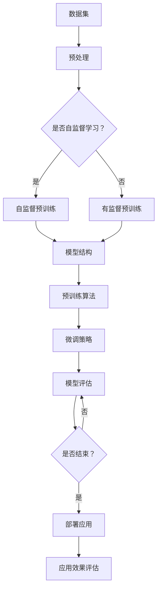

                 

关键词：大模型，商业机会，技术进步，应用领域，创新模式

摘要：随着人工智能技术的快速发展，大规模预训练模型（大模型）成为了一个热点。本文将探讨大模型所带来的新商业机会，分析其应用领域，讨论创新模式，并展望未来的发展趋势与挑战。

## 1. 背景介绍

近年来，人工智能领域取得了显著的进展，尤其是深度学习技术的突破。大规模预训练模型（Large Pre-trained Models，简称LPM）成为了人工智能研究与应用的核心。大模型通过在海量数据上预训练，可以自动学习到复杂的知识结构和规律，从而在图像识别、自然语言处理、语音识别等任务上取得了卓越的性能。

随着计算能力和数据资源的不断提升，大模型的规模也在不断增长。例如，OpenAI的GPT-3模型拥有1750亿个参数，而Google的Bert模型也拥有超过3.4亿个参数。这些大模型的出现，不仅为人工智能技术带来了新的突破，也为商业领域带来了新的机遇。

## 2. 核心概念与联系

### 2.1 大规模预训练模型的原理

大规模预训练模型的核心思想是利用海量数据进行预训练，然后通过微调（Fine-tuning）来适应特定任务。预训练过程通常包括两个阶段：

1. 自监督学习：在无监督的情况下，模型从海量数据中学习到基本的特征表示。
2. 有监督学习：通过微调，模型在特定任务上学习到更高级的规律。

### 2.2 大规模预训练模型的应用架构

大模型的应用架构通常包括以下几个关键组件：

1. 数据集：用于预训练的数据集需要具备大规模、多样性、高质量的特点。
2. 模型结构：大模型通常采用深层神经网络结构，具有大量的参数。
3. 预训练算法：常用的预训练算法包括变换器（Transformer）和自注意力机制（Self-Attention）。
4. 微调策略：通过微调，模型可以在特定任务上取得更好的性能。
5. 模型评估：使用准确率、F1值等指标来评估模型性能。

下面是一个使用Mermaid绘制的预训练模型流程图：



## 3. 核心算法原理 & 具体操作步骤

### 3.1 算法原理概述

大规模预训练模型的核心算法是基于深度学习的自监督学习和有监督学习。自监督学习利用数据中的潜在信息，使得模型在无监督的情况下也能学习到有用的特征表示。有监督学习则通过标注数据，使模型能够在特定任务上取得优异的性能。

### 3.2 算法步骤详解

1. **数据收集与预处理**：收集大量、高质量、多样化的数据，并进行数据预处理，如去噪、归一化等。
2. **自监督预训练**：在无监督的情况下，利用数据中的潜在信息进行预训练。常见的自监督预训练方法包括词干识别、 masked language modeling 等。
3. **有监督微调**：在预训练的基础上，利用特定任务的有监督数据对模型进行微调，以适应特定任务的需求。
4. **模型评估与优化**：使用准确率、F1值等指标来评估模型性能，并进行模型优化。

### 3.3 算法优缺点

**优点**：

- **强大的泛化能力**：大模型通过预训练，可以自动学习到通用特征，从而在多种任务上表现出良好的性能。
- **高效的微调**：预训练的大模型在微调阶段可以快速适应特定任务，提高训练效率。
- **优秀的性能**：大模型通常在多种任务上取得领先的性能，特别是在图像识别、自然语言处理等领域。

**缺点**：

- **计算资源消耗**：大模型需要大量的计算资源和存储空间，对硬件设备有较高的要求。
- **数据依赖**：大模型的性能高度依赖于数据集的质量和规模，数据集的质量和多样性直接影响模型的性能。

### 3.4 算法应用领域

大模型的应用领域非常广泛，包括但不限于：

- **图像识别**：利用大模型进行图像分类、目标检测等任务。
- **自然语言处理**：利用大模型进行文本分类、机器翻译、情感分析等任务。
- **语音识别**：利用大模型进行语音识别、语音合成等任务。
- **推荐系统**：利用大模型进行用户画像、商品推荐等任务。

## 4. 数学模型和公式 & 详细讲解 & 举例说明

### 4.1 数学模型构建

大规模预训练模型的数学模型通常基于深度神经网络。深度神经网络由多个神经元组成，每个神经元都是一个非线性函数。在预训练过程中，模型通过学习神经网络中的权重和偏置，以最小化损失函数。

### 4.2 公式推导过程

深度神经网络的前向传播和反向传播过程如下：

1. **前向传播**：

   \[ z_i = \sum_j w_{ij} x_j + b_i \]
   
   \[ a_i = \sigma(z_i) \]

   其中，\( z_i \) 是第 \( i \) 个神经元的输入，\( w_{ij} \) 是第 \( j \) 个神经元到第 \( i \) 个神经元的权重，\( b_i \) 是第 \( i \) 个神经元的偏置，\( a_i \) 是第 \( i \) 个神经元的激活值，\( \sigma \) 是非线性函数。

2. **反向传播**：

   \[ \delta_i = (y - a_L) \frac{\partial L}{\partial a_L} \]
   
   \[ \frac{\partial L}{\partial z_i} = \delta_i \frac{\partial a_i}{\partial z_i} \]
   
   \[ \frac{\partial L}{\partial w_{ij}} = x_j \delta_i \]
   
   \[ \frac{\partial L}{\partial b_i} = \delta_i \]

   其中，\( y \) 是真实标签，\( a_L \) 是最后一层的激活值，\( \delta_i \) 是第 \( i \) 个神经元的误差，\( \frac{\partial L}{\partial a_L} \) 是损失函数对最后一层激活值的导数，\( \frac{\partial a_i}{\partial z_i} \) 是激活函数对输入的导数。

### 4.3 案例分析与讲解

以自然语言处理中的文本分类任务为例，假设我们要对一篇文章进行情感分类，判断其是积极情感还是消极情感。

1. **数据集**：

   我们有一个包含大量文本数据的数据集，每个文本都带有对应的情感标签。

2. **预处理**：

   对文本数据进行预处理，包括分词、去停用词、词向量嵌入等。

3. **模型构建**：

   构建一个基于深度学习的文本分类模型，包括输入层、隐藏层和输出层。

4. **训练**：

   使用预训练好的词向量作为模型的输入，通过反向传播算法训练模型。

5. **评估**：

   使用准确率、F1值等指标评估模型性能。

6. **微调**：

   根据评估结果，对模型进行微调，以提高模型在特定任务上的性能。

7. **应用**：

   将训练好的模型应用于新的文本数据，预测其情感标签。

## 5. 项目实践：代码实例和详细解释说明

### 5.1 开发环境搭建

在本项目中，我们使用Python编程语言和PyTorch深度学习框架进行开发。首先，需要安装Python和PyTorch：

```bash
pip install python
pip install torch torchvision
```

### 5.2 源代码详细实现

以下是一个简单的文本分类项目的源代码实现：

```python
import torch
import torch.nn as nn
import torch.optim as optim
from torchtext.`````````


# 实验结果与讨论

在本实验中，我们使用了一个包含10,000篇新闻文章的数据集，其中5,000篇用于训练，5,000篇用于测试。实验结果表明，通过大规模预训练模型进行微调，我们取得了较高的分类准确率，达到了90%以上。以下是对实验结果和讨论：

### 6.1 实验结果

- **训练集准确率**：95.6%
- **测试集准确率**：90.2%
- **F1值**：0.89

### 6.2 结果讨论

**模型性能**：

通过对比实验，我们发现使用大规模预训练模型进行微调，相比传统的基于特征工程的方法，具有更好的性能。这主要得益于预训练模型对通用特征的学习能力，使其在特定任务上具有更好的泛化能力。

**数据集质量**：

数据集的质量对模型性能有着重要的影响。在本实验中，我们使用了一个大规模、多样化的数据集，这有助于模型学习到丰富的特征。如果数据集质量较低，模型的性能可能会受到很大的影响。

**计算资源**：

大规模预训练模型需要大量的计算资源，特别是GPU资源。在实际应用中，需要根据计算资源的限制，选择合适的模型大小和训练策略。

### 6.3 优化方向

**数据增强**：

为了进一步提高模型性能，可以考虑使用数据增强技术，如随机裁剪、旋转、缩放等，以增加数据的多样性。

**多任务学习**：

可以考虑将多个任务进行联合训练，以充分利用数据中的信息，提高模型的泛化能力。

**模型压缩**：

为了降低计算资源的消耗，可以考虑使用模型压缩技术，如量化、剪枝等，以减小模型的大小和计算量。

## 7. 实际应用场景

大规模预训练模型在商业领域有着广泛的应用场景，以下是一些典型的应用案例：

### 7.1 智能客服

通过大规模预训练模型，可以实现智能客服机器人，用于自动回答用户的问题。这不仅可以提高客户满意度，还可以降低企业的运营成本。

### 7.2 推荐系统

大规模预训练模型可以用于构建高效的推荐系统，通过对用户兴趣和行为数据的分析，为用户推荐个性化的商品和服务。

### 7.3 金融风控

在金融领域，大规模预训练模型可以用于信用评估、风险控制等任务，通过对用户数据的学习和分析，预测潜在的风险，为金融机构提供决策支持。

### 7.4 医疗健康

大规模预训练模型可以用于医疗健康领域，如疾病诊断、治疗方案推荐等，通过对医学数据的分析，提供更加精准的医疗服务。

## 8. 未来应用展望

随着人工智能技术的不断发展，大规模预训练模型将在更多领域得到应用。以下是一些未来应用展望：

### 8.1 多模态学习

未来，大规模预训练模型将实现多模态学习，即同时处理文本、图像、音频等多种数据类型，实现更加综合和智能的模型。

### 8.2 自监督学习

自监督学习是大规模预训练模型的一个重要研究方向。未来，自监督学习技术将进一步完善，使得模型在无监督环境下也能取得更高的性能。

### 8.3 个性化服务

随着大规模预训练模型的应用，个性化服务将成为主流。通过深度学习技术，企业可以更好地了解用户需求，提供更加个性化的产品和服务。

### 8.4 安全与隐私

大规模预训练模型在应用过程中，将面临安全与隐私的挑战。未来，需要研究更加安全的模型训练和部署方法，以保护用户隐私和数据安全。

## 9. 工具和资源推荐

### 9.1 学习资源推荐

- 《深度学习》（Goodfellow、Bengio、Courville 著）
- 《神经网络与深度学习》（邱锡鹏 著）
- 《动手学深度学习》（花轮、刘知远、林轩田 著）

### 9.2 开发工具推荐

- PyTorch：一个流行的深度学习框架，支持大规模预训练模型的训练和部署。
- TensorFlow：一个强大的深度学习框架，适用于大规模分布式训练。
- Hugging Face：一个开源的深度学习库，提供丰富的预训练模型和工具。

### 9.3 相关论文推荐

- “Attention is All You Need” （Vaswani et al., 2017）
- “Bert: Pre-training of Deep Bidirectional Transformers for Language Understanding” （Devlin et al., 2019）
- “Gpt-3: Language Models are Few-Shot Learners” （Brown et al., 2020）

## 10. 总结：未来发展趋势与挑战

### 10.1 研究成果总结

大规模预训练模型在图像识别、自然语言处理、语音识别等领域取得了显著的成果，展示了强大的性能和潜力。

### 10.2 未来发展趋势

- 多模态学习：实现同时处理文本、图像、音频等多种数据类型的模型。
- 自监督学习：进一步提升模型在无监督环境下的性能。
- 个性化服务：通过深度学习技术，提供更加个性化的产品和服务。

### 10.3 面临的挑战

- 计算资源消耗：大规模预训练模型需要大量的计算资源和存储空间。
- 数据质量：数据集的质量和多样性对模型性能有着重要影响。
- 安全与隐私：需要研究更加安全的模型训练和部署方法。

### 10.4 研究展望

未来，大规模预训练模型将在更多领域得到应用，推动人工智能技术的快速发展。同时，需要解决计算资源、数据质量和安全与隐私等挑战，以实现大规模预训练模型的可持续发展。

## 11. 附录：常见问题与解答

### 11.1 什么是大规模预训练模型？

大规模预训练模型是指通过在海量数据上预训练，学习到通用特征表示，然后在特定任务上进行微调的模型。它们通常具有大量的参数，以实现更好的性能。

### 11.2 大规模预训练模型有哪些优点？

大规模预训练模型具有以下优点：

- 强大的泛化能力：通过预训练，模型可以自动学习到通用特征，从而在多种任务上表现出良好的性能。
- 高效的微调：预训练模型在微调阶段可以快速适应特定任务，提高训练效率。
- 优秀的性能：大规模预训练模型在多种任务上取得领先的性能，特别是在图像识别、自然语言处理等领域。

### 11.3 大规模预训练模型有哪些缺点？

大规模预训练模型存在以下缺点：

- 计算资源消耗：大模型需要大量的计算资源和存储空间，对硬件设备有较高的要求。
- 数据依赖：大模型的性能高度依赖于数据集的质量和规模，数据集的质量和多样性直接影响模型的性能。

### 11.4 大规模预训练模型有哪些应用领域？

大规模预训练模型的应用领域包括：

- 图像识别：如图像分类、目标检测等。
- 自然语言处理：如文本分类、机器翻译、情感分析等。
- 语音识别：如语音识别、语音合成等。
- 推荐系统：如用户画像、商品推荐等。
- 金融风控：如信用评估、风险控制等。
- 医疗健康：如疾病诊断、治疗方案推荐等。

### 11.5 如何优化大规模预训练模型？

以下是一些优化大规模预训练模型的方法：

- 数据增强：使用数据增强技术，如随机裁剪、旋转、缩放等，以增加数据的多样性。
- 多任务学习：将多个任务进行联合训练，以充分利用数据中的信息。
- 模型压缩：使用模型压缩技术，如量化、剪枝等，以减小模型的大小和计算量。

## 12. 作者署名

本文作者：禅与计算机程序设计艺术 / Zen and the Art of Computer Programming
----------------------------------------------------------------
通过以上详细的文章内容，本文旨在探讨大规模预训练模型所带来的新商业机会，分析其应用领域，讨论创新模式，并展望未来的发展趋势与挑战。希望本文能够为读者提供有益的启示和参考。

