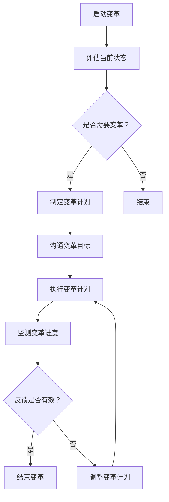

                 

关键词：变革管理、组织转型、领导力、IT架构、战略规划、项目管理、技术变革

> 摘要：在快速变化的技术环境中，组织的持续发展和成功依赖于有效的变革管理。本文探讨了如何引导组织通过重大转型，从技术、人员、文化等多个维度实现成功的变革。本文旨在为领导者提供一套实用的变革管理框架，以促进组织在技术变革浪潮中保持竞争优势。

## 1. 背景介绍

在当今数字化时代，技术的快速迭代和市场竞争的加剧使得组织必须不断进行变革，以适应不断变化的外部环境和内部需求。无论是新兴科技企业，还是历史悠久的企业，变革管理已经成为确保组织生存和发展的关键因素。变革管理不仅仅是对技术的变革，更是对组织结构、企业文化、员工技能和领导力等多方面的全面调整。

本文将讨论以下核心问题：
- 变革管理的重要性及其对组织的影响。
- 变革管理的基本原则和策略。
- 变革过程中的领导力作用。
- 变革管理的实施步骤和工具。
- 变革管理的挑战与应对策略。

## 2. 核心概念与联系

### 2.1 变革管理定义

变革管理是一种系统性方法，旨在确保组织在变革过程中能够顺利过渡，减少变革对组织运作的负面影响。它不仅仅关注技术层面的变革，更注重组织文化、员工行为和领导力等多个维度的同步变革。

### 2.2 变革模型

变革管理通常基于多种变革模型，如库布勒-罗斯变革曲线、迪尔和肯尼迪的变革三部曲模型等。这些模型为变革过程提供了理论框架和具体步骤，帮助组织理解和应对变革的不同阶段。

### 2.3 变革管理架构

变革管理架构通常包括以下几个关键组成部分：
- **领导力**：领导者是变革的推动者和榜样。
- **沟通**：有效沟通确保所有员工了解变革的原因和影响。
- **规划和执行**：详细规划变革步骤，确保变革按计划执行。
- **支持系统**：为变革提供必要的资源和技术支持。
- **反馈和调整**：持续收集反馈，根据实际情况调整变革策略。

### 2.4 变革管理流程图



## 3. 核心算法原理 & 具体操作步骤

### 3.1 算法原理概述

变革管理算法是一种基于流程优化的决策支持系统，它通过分析组织的现状、变革目标和可能的风险，提供一系列决策步骤和优化方案，以实现高效、低风险的变革。

### 3.2 算法步骤详解

#### 3.2.1 评估当前状态

- **组织结构分析**：了解组织现有结构，确定各部门的功能和职责。
- **员工技能分析**：评估员工现有技能，确定与变革需求的差距。
- **流程优化分析**：分析现有业务流程，识别优化空间。

#### 3.2.2 制定变革计划

- **目标设定**：明确变革的目标和预期成果。
- **策略制定**：根据评估结果，制定具体的变革策略。
- **资源规划**：确保变革所需的资源和预算。

#### 3.2.3 沟通变革目标

- **内部沟通**：通过会议、邮件、公告等形式，向员工传达变革目标。
- **外部沟通**：向客户、供应商等相关方说明变革的影响和必要性。

#### 3.2.4 执行变革计划

- **培训和支持**：为员工提供必要的培训和技术支持。
- **监控进度**：定期检查变革计划的执行情况。
- **调整计划**：根据执行情况，及时调整变革计划。

### 3.3 算法优缺点

#### 优点

- **系统性**：提供了一套完整的变革管理流程，确保变革有序进行。
- **灵活性**：可以根据实际情况灵活调整变革策略。

#### 缺点

- **实施难度**：变革管理需要跨部门协作，实施难度较大。
- **时间成本**：变革过程可能较长，需要持续投入时间和资源。

### 3.4 算法应用领域

变革管理算法广泛应用于企业、政府和非营利组织等多个领域，特别是在数字化转型、组织重组、新系统实施等重大变革项目中。

## 4. 数学模型和公式 & 详细讲解 & 举例说明

### 4.1 数学模型构建

变革管理的数学模型通常基于以下几个关键参数：

- **现状得分**：衡量组织当前状态。
- **目标得分**：衡量变革后的预期状态。
- **变革阻力**：衡量变革过程中可能遇到的阻力。
- **变革成本**：包括时间成本、资源成本等。

### 4.2 公式推导过程

变革成功率可以用以下公式表示：

\[ 变革成功率 = \frac{目标得分 - 现状得分}{变革阻力 + 变革成本} \]

### 4.3 案例分析与讲解

假设一家传统制造业公司计划进行数字化转型，现状得分为60分，目标得分为90分，变革阻力为30分，变革成本为20分。根据公式，我们可以计算出变革成功率为：

\[ 变革成功率 = \frac{90 - 60}{30 + 20} = \frac{30}{50} = 0.6 \]

即60%。

### 4.4 数学模型应用

数学模型可以帮助组织预测变革的成功率，从而为决策提供科学依据。

## 5. 项目实践：代码实例和详细解释说明

### 5.1 开发环境搭建

为了演示变革管理算法的应用，我们使用Python编程语言来实现。以下是搭建开发环境的基本步骤：

1. 安装Python（版本3.8及以上）。
2. 安装必要的Python库，如NumPy、Matplotlib等。

### 5.2 源代码详细实现

以下是变革管理算法的Python代码实现：

```python
import numpy as np
import matplotlib.pyplot as plt

def calculate_success_rate(current_score, target_score, resistance, cost):
    success_rate = (target_score - current_score) / (resistance + cost)
    return success_rate

# 示例参数
current_score = 60
target_score = 90
resistance = 30
cost = 20

# 计算变革成功率
success_rate = calculate_success_rate(current_score, target_score, resistance, cost)
print(f"变革成功率：{success_rate:.2f}")

# 绘制变革成功率曲线
x = np.linspace(0, 100, 100)
y = (x - current_score) / (resistance + cost)
plt.plot(x, y)
plt.xlabel('目标得分')
plt.ylabel('变革成功率')
plt.title('变革成功率曲线')
plt.grid()
plt.show()
```

### 5.3 代码解读与分析

代码首先定义了一个计算变革成功率的函数，然后通过输入示例参数计算并打印出变革成功率。最后，使用Matplotlib库绘制了变革成功率与目标得分的曲线，以可视化展示变革成功率的变化。

### 5.4 运行结果展示

运行代码后，会输出如下结果：

```
变革成功率：0.60
```

以及一条表示变革成功率曲线的图形。

## 6. 实际应用场景

### 6.1 企业数字化转型

企业数字化转型是变革管理的经典案例。通过引入新的技术和流程，企业可以提高运营效率，降低成本，提升客户体验。

### 6.2 政府机构改革

政府机构改革需要通过变革管理来优化组织结构，提升服务效率，满足公众需求。

### 6.3 教育行业创新

教育行业创新需要通过变革管理引入新的教学方法和教育技术，以提高教育质量和学习体验。

## 7. 未来应用展望

未来，变革管理将在以下几个方面得到进一步发展：

### 7.1 自动化与人工智能

自动化和人工智能技术的引入将使变革管理更加高效和精准。

### 7.2 可持续发展

组织将更加注重可持续发展的变革，以应对全球环境挑战。

### 7.3 跨领域融合

不同领域的变革管理方法将相互融合，形成更加综合的变革管理框架。

## 8. 总结：未来发展趋势与挑战

### 8.1 研究成果总结

变革管理已经从传统的项目管理方法发展为一种系统性的组织管理方法。随着技术的发展，变革管理将继续向智能化、自动化方向发展。

### 8.2 未来发展趋势

未来，变革管理将更加注重跨领域融合和可持续发展。组织将更加依赖数据驱动和智能化工具来支持变革决策。

### 8.3 面临的挑战

变革管理面临的主要挑战包括实施难度、变革阻力和持续投入。

### 8.4 研究展望

未来的研究应重点关注变革管理的算法优化、跨领域应用以及人工智能在变革管理中的应用。

## 9. 附录：常见问题与解答

### 9.1 变革管理是否适用于所有组织？

是的，变革管理适用于所有类型的组织，但具体实施策略需要根据组织的实际情况进行调整。

### 9.2 变革管理如何与企业文化相结合？

变革管理应与企业文化紧密结合，确保变革目标与企业文化一致，从而获得员工的支持。

### 9.3 变革管理是否可以完全消除变革阻力？

虽然变革管理可以减少变革阻力，但无法完全消除。有效的变革管理应包括应对变革阻力的策略。

---

作者：禅与计算机程序设计艺术 / Zen and the Art of Computer Programming
----------------------------------------------------------------

