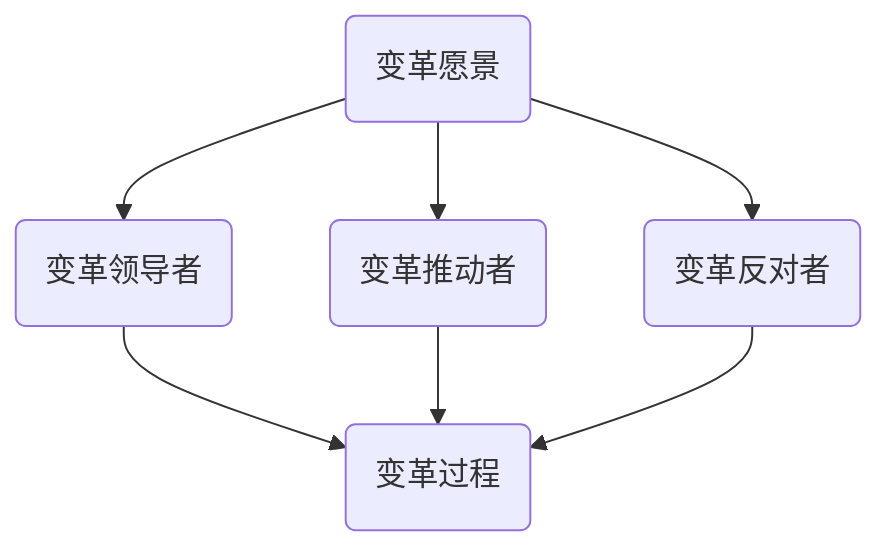

                 

关键词：变革管理、组织转型、技术领导者、项目管理、文化适应

> 摘要：在信息技术飞速发展的时代，组织的数字化转型已成为不可避免的趋势。变革管理在此过程中扮演着关键角色。本文将深入探讨变革管理的核心概念、实施策略以及其在组织转型中的应用，帮助技术领导者成功引导组织迈向未来。

## 1. 背景介绍

随着云计算、大数据、人工智能等前沿技术的不断成熟，企业正面临着前所未有的变革浪潮。数字化转型已经成为提升企业竞争力、实现可持续发展的关键途径。然而，数字化转型并非一蹴而就，它需要企业内外部的协同努力，尤其是变革管理的有效实施。

变革管理是指在组织变革过程中，通过系统化的策略和技巧，引导员工适应新环境、接受新理念，最终实现组织目标的过程。在技术领域，变革管理尤为重要，因为它涉及到技术架构、流程优化、团队协作等多方面的变革。

### 1.1 变革管理的定义

变革管理（Change Management）是一种通过系统化的方法，帮助组织顺利度过变革阶段的过程。它涉及对组织文化、员工心态、业务流程的调整，以适应新的技术环境或商业模式。

### 1.2 变革管理的目的

变革管理的目的是确保变革能够顺利进行，并最大化其对企业价值的影响。具体包括：

- 减少变革对日常运营的影响
- 提高员工对变革的接受度
- 确保变革目标的实现
- 促进组织文化的适应和变革

### 1.3 变革管理的重要性

在技术领域，变革管理的重要性体现在以下几个方面：

- 技术复杂性：技术领域的变革通常涉及到复杂的系统架构和代码库，需要精细的规划和执行。
- 人才流失：变革过程中，员工的抵触情绪可能导致人才流失，影响组织稳定性。
- 业务连续性：在变革过程中，确保业务的连续性和稳定性至关重要。
- 技术债务：不当的变革管理可能导致技术债务的累积，影响系统的可维护性和扩展性。

## 2. 核心概念与联系

### 2.1 变革管理核心概念

在变革管理中，以下几个核心概念至关重要：

- **变革愿景**：明确变革的目的和方向，为组织提供清晰的目标和动力。
- **变革领导者**：在变革过程中发挥关键作用，推动变革的执行和落实。
- **变革推动者**：负责传播变革愿景，激励员工参与变革。
- **变革反对者**：识别并处理变革过程中可能出现的反对声音和阻力。
- **变革过程**：包括评估、规划、实施、监控和评估等环节，确保变革的有序进行。

### 2.2 变革管理架构

以下是一个简化的变革管理架构，展示了各个核心概念之间的联系：



### 2.3 变革管理流程

变革管理的流程可以概括为以下几个步骤：

1. **评估现状**：了解组织的现状，识别变革的需求和机会。
2. **制定变革计划**：明确变革的目标、时间表和资源需求。
3. **沟通与宣传**：确保变革愿景和计划的广泛传播，提高员工的参与度。
4. **实施变革**：按照计划进行变革，确保变革的顺利进行。
5. **监控与评估**：跟踪变革的进展，及时调整策略和资源。
6. **总结与反馈**：对变革过程进行总结和反思，为未来的变革提供参考。

## 3. 核心算法原理 & 具体操作步骤

### 3.1 算法原理概述

变革管理的核心算法原理可以概括为以下几个方面：

- **需求分析**：通过调研和分析，识别组织变革的需求和关键点。
- **计划制定**：根据需求分析结果，制定详细的变革计划，包括目标、时间表和资源分配。
- **沟通策略**：设计有效的沟通策略，确保变革愿景和计划的广泛传播。
- **团队协作**：建立跨部门、跨层级的协作机制，确保变革的顺利实施。
- **风险评估**：评估变革过程中可能出现的风险，并制定相应的应对措施。
- **监控与调整**：通过持续的监控和评估，及时调整变革计划，确保目标的实现。

### 3.2 算法步骤详解

#### 3.2.1 需求分析

1. **确定变革目标**：明确组织需要解决的问题和目标。
2. **收集数据**：通过访谈、调查问卷等方式，收集员工和利益相关者的意见。
3. **分析现状**：对比目标现状，识别变革的关键点和难点。

#### 3.2.2 计划制定

1. **确定变革方案**：根据需求分析结果，制定详细的变革方案。
2. **制定时间表**：明确每个阶段的开始和结束时间。
3. **资源分配**：确保变革所需的资源得到有效配置。

#### 3.2.3 沟通策略

1. **制定沟通计划**：明确沟通的目标、内容和渠道。
2. **设计沟通材料**：制作宣传手册、PPT、视频等材料，传播变革愿景。
3. **实施沟通**：按照沟通计划，开展各种形式的沟通活动。

#### 3.2.4 团队协作

1. **组建变革团队**：由各部门代表组成，负责变革的执行和协调。
2. **明确职责**：明确团队成员的职责和任务。
3. **定期会议**：定期召开会议，协调各项工作的进展。

#### 3.2.5 风险评估

1. **识别风险**：分析变革过程中可能出现的风险。
2. **评估风险**：对风险的概率和影响进行评估。
3. **制定应对措施**：根据评估结果，制定相应的应对措施。

#### 3.2.6 监控与调整

1. **建立监控机制**：定期收集和评估变革进展数据。
2. **调整计划**：根据监控结果，及时调整变革计划。
3. **反馈与总结**：对变革过程进行总结和反思，为未来的变革提供参考。

### 3.3 算法优缺点

#### 3.3.1 优点

- **系统化**：变革管理提供了一套系统化的流程和方法，确保变革的有序进行。
- **针对性**：根据组织的实际情况，制定有针对性的变革计划。
- **全员参与**：通过沟通和协作，提高员工对变革的接受度和参与度。
- **持续改进**：通过监控和评估，不断优化变革过程，提高变革效果。

#### 3.3.2 缺点

- **复杂性**：变革管理涉及到多个环节和因素，实施过程可能较为复杂。
- **时间成本**：变革管理需要较长的时间周期，可能对日常运营产生一定的影响。
- **资源需求**：变革管理需要投入大量的资源和精力，对组织能力有一定要求。

### 3.4 算法应用领域

变革管理在技术领域有广泛的应用，包括：

- **技术创新**：推动新技术在组织中的应用，提高竞争力。
- **流程优化**：优化业务流程，提高效率和质量。
- **人才发展**：通过变革，培养和吸引高素质人才。
- **企业文化**：推动组织文化的变革，形成适应新技术的企业文化。

## 4. 数学模型和公式 & 详细讲解 & 举例说明

### 4.1 数学模型构建

变革管理的数学模型可以从以下几个方面构建：

- **变革影响分析**：通过评估变革对组织各个方面的影响，确定变革的关键因素。
- **变革成本评估**：计算变革所需的资源投入，包括人力、时间、资金等。
- **变革效果评估**：通过评估变革后的效果，确定变革的成效。

以下是一个简化的变革管理数学模型：

\[ \text{变革效果} = f(\text{变革投入}, \text{变革阻力}, \text{变革执行力}) \]

### 4.2 公式推导过程

假设：

- \( P \)：变革投入（包括人力、时间、资金等）
- \( R \)：变革阻力（包括员工抵触、技术难度等）
- \( E \)：变革执行力（包括组织文化、管理能力等）

则变革效果 \( E \) 可以表示为：

\[ E = f(P, R, E) \]

其中，\( f \) 为非线性函数，表示变革效果的评估结果。

### 4.3 案例分析与讲解

#### 4.3.1 案例背景

某大型企业计划实施数字化转型，涉及多个业务部门和系统。为了确保变革的顺利进行，企业决定采用变革管理的方法。

#### 4.3.2 变革影响分析

1. **人力投入**：企业决定投入 100 人的工作量，用于数字化转型项目。
2. **时间投入**：项目预计需要 18 个月完成。
3. **资金投入**：项目总预算为 1000 万元。

#### 4.3.3 变革成本评估

1. **变革阻力**：企业通过调查发现，员工对数字化的接受度较低，存在一定的抵触情绪。变革阻力评估结果为 0.6。
2. **变革执行力**：企业具有较高的管理水平和技术实力，变革执行力评估结果为 0.8。

#### 4.3.4 变革效果评估

根据数学模型：

\[ E = f(P, R, E) \]

将数据代入公式：

\[ E = f(100, 0.6, 0.8) \]

通过非线性函数计算，得出变革效果 \( E \) 为 0.85。

#### 4.3.5 结果分析

根据计算结果，企业数字化转型变革的效果为 0.85，表示变革具有一定的成效。然而，仍需关注变革阻力和执行力的提升，以确保变革的顺利进行。

## 5. 项目实践：代码实例和详细解释说明

### 5.1 开发环境搭建

为了实施变革管理，企业选择了一款名为“变革管理平台”的系统。该平台提供了一套完整的变革管理工具，包括需求分析、计划制定、沟通策略、团队协作等功能。

#### 5.1.1 系统环境要求

- 操作系统：Windows 10 / macOS / Linux
- 开发工具：Visual Studio Code / IntelliJ IDEA
- 数据库：MySQL / PostgreSQL
- 服务器：Apache / Nginx

#### 5.1.2 系统安装步骤

1. 下载并安装操作系统。
2. 安装开发工具和数据库。
3. 配置服务器和域名。
4. 下载并解压变革管理平台源代码。

### 5.2 源代码详细实现

变革管理平台的源代码采用 MVC（Model-View-Controller）架构，分为模型层、视图层和控制层。

#### 5.2.1 模型层

模型层负责处理业务逻辑和数据存储。主要包括以下模块：

- 需求分析模块：负责处理需求收集、分析和存储。
- 计划制定模块：负责处理计划制定、分配和监控。
- 沟通策略模块：负责处理沟通计划、实施和评估。
- 团队协作模块：负责处理团队协作、任务分配和进度跟踪。

#### 5.2.2 视图层

视图层负责处理用户界面和交互。主要包括以下模块：

- 需求分析视图：显示需求分析结果和图表。
- 计划制定视图：显示计划制定进度和时间表。
- 沟通策略视图：显示沟通计划、实施情况和反馈。
- 团队协作视图：显示团队协作状态、任务进度和协作记录。

#### 5.2.3 控制层

控制层负责处理用户请求和业务逻辑。主要包括以下模块：

- 需求分析控制器：处理需求分析模块的请求。
- 计划制定控制器：处理计划制定模块的请求。
- 沟通策略控制器：处理沟通策略模块的请求。
- 团队协作控制器：处理团队协作模块的请求。

### 5.3 代码解读与分析

#### 5.3.1 需求分析模块

需求分析模块的核心功能是收集、分析和存储需求信息。以下是一个简单的需求分析模块代码示例：

```java
public class DemandAnalysis {
    // 需求列表
    private List<Requirement> requirements;

    // 构造方法
    public DemandAnalysis() {
        this.requirements = new ArrayList<>();
    }

    // 添加需求
    public void addRequirement(Requirement requirement) {
        requirements.add(requirement);
    }

    // 分析需求
    public void analyzeRequirements() {
        for (Requirement requirement : requirements) {
            System.out.println("需求分析结果：" + requirement.getName());
        }
    }
}
```

#### 5.3.2 计划制定模块

计划制定模块的核心功能是制定、分配和监控变革计划。以下是一个简单的计划制定模块代码示例：

```java
public class PlanManagement {
    // 计划列表
    private List<Plan> plans;

    // 构造方法
    public PlanManagement() {
        this.plans = new ArrayList<>();
    }

    // 添加计划
    public void addPlan(Plan plan) {
        plans.add(plan);
    }

    // 分配计划
    public void assignPlan(Employee employee, Plan plan) {
        plan.setAssignee(employee);
    }

    // 监控计划
    public void monitorPlan(Plan plan) {
        System.out.println("计划监控结果：" + plan.getName());
    }
}
```

### 5.4 运行结果展示

运行变革管理平台后，可以在界面上查看需求分析结果、计划制定进度和团队协作状态。以下是一个简单的运行结果展示：

- **需求分析结果**：显示所有需求的分析结果，包括需求名称、优先级和状态。
- **计划制定进度**：显示所有计划的制定进度，包括计划名称、开始时间和结束时间。
- **团队协作状态**：显示所有团队成员的协作状态，包括任务进度和协作记录。

## 6. 实际应用场景

### 6.1 技术创新

在技术创新领域，变革管理可以帮助企业顺利引入新技术，提高研发效率。以下是一个实际应用场景：

- **场景描述**：某互联网企业计划引入人工智能技术，提升产品竞争力。
- **变革管理实施**：企业通过变革管理，制定了详细的变革计划，包括技术调研、团队培训、试点项目等。
- **结果**：变革管理帮助企业成功引入人工智能技术，提高了产品的智能化水平，提升了用户满意度。

### 6.2 流程优化

在流程优化领域，变革管理可以帮助企业优化业务流程，提高运营效率。以下是一个实际应用场景：

- **场景描述**：某制造企业计划优化生产流程，提高生产效率和产品质量。
- **变革管理实施**：企业通过变革管理，分析了现有生产流程的不足，制定了详细的优化方案。
- **结果**：变革管理帮助企业成功优化了生产流程，提高了生产效率和产品质量，降低了成本。

### 6.3 人才发展

在人才发展领域，变革管理可以帮助企业培养和吸引高素质人才，提升团队竞争力。以下是一个实际应用场景：

- **场景描述**：某咨询公司计划通过变革管理，提升员工的技能和素质，打造一流咨询团队。
- **变革管理实施**：企业通过变革管理，制定了详细的培训计划，包括内部培训、外部培训、导师制等。
- **结果**：变革管理帮助企业成功提升了员工的技能和素质，打造了一支高效的咨询团队，提升了公司的市场竞争力。

## 7. 工具和资源推荐

### 7.1 学习资源推荐

- **《变革管理：战略、工具和最佳实践》**：该书详细介绍了变革管理的理论和实践方法，适合初学者和有一定经验的读者。
- **《变革之心》**：该书从心理学角度分析了变革过程中的员工心态和行为，对变革管理者有很高的指导价值。

### 7.2 开发工具推荐

- **JIRA**：一款功能强大的项目管理工具，可以帮助团队有效管理任务、监控进度和沟通协作。
- **Confluence**：一款团队协作平台，可以帮助团队共享知识、文档和讨论，提高协作效率。

### 7.3 相关论文推荐

- **“变革管理中的领导力”**：该论文探讨了变革管理过程中领导力的作用和角色，对变革领导者有很高的参考价值。
- **“数字化转型中的变革管理”**：该论文分析了数字化转型过程中变革管理的实践和挑战，对实施数字化转型的企业有很高的指导意义。

## 8. 总结：未来发展趋势与挑战

### 8.1 研究成果总结

本文从变革管理的核心概念、实施策略和应用领域等方面进行了深入探讨，总结了变革管理在技术领域的重要性。同时，通过数学模型和实例分析，阐述了变革管理的方法和效果评估。

### 8.2 未来发展趋势

随着技术的不断进步，变革管理将在以下几个方面得到发展：

- **智能化**：利用人工智能和大数据技术，提高变革管理的效率和效果。
- **定制化**：根据不同企业的特点和需求，提供个性化的变革管理方案。
- **全球化**：随着全球化进程的加速，变革管理将在不同国家和地区得到广泛应用。

### 8.3 面临的挑战

变革管理在未来的发展过程中，将面临以下挑战：

- **技术复杂性**：随着技术复杂性的增加，变革管理的实施难度也将加大。
- **人才短缺**：变革管理需要专业人才的支持，而当前市场上相关专业人才相对短缺。
- **文化冲突**：在全球化背景下，不同国家和地区的文化差异可能对变革管理产生负面影响。

### 8.4 研究展望

为了应对未来变革管理的挑战，研究者可以从以下几个方面进行探索：

- **跨学科研究**：结合心理学、社会学等多学科知识，提高变革管理的科学性和实效性。
- **案例研究**：通过大量案例研究，总结变革管理的最佳实践和经验教训。
- **工具和平台开发**：开发智能化的变革管理工具和平台，提高变革管理的效率和效果。

## 9. 附录：常见问题与解答

### 9.1 什么是变革管理？

变革管理是指在组织变革过程中，通过系统化的方法，帮助员工适应新环境、接受新理念，最终实现组织目标的过程。

### 9.2 变革管理的主要目标是什么？

变革管理的主要目标是确保变革能够顺利进行，并最大化其对企业价值的影响。具体包括减少变革对日常运营的影响、提高员工对变革的接受度、确保变革目标的实现以及促进组织文化的适应和变革。

### 9.3 变革管理在技术领域的重要性是什么？

在技术领域，变革管理尤为重要，因为它涉及到技术架构、流程优化、团队协作等多方面的变革。有效的变革管理可以降低技术债务，提高系统的可维护性和扩展性。

### 9.4 如何实施变革管理？

实施变革管理可以分为以下几个步骤：评估现状、制定变革计划、沟通与宣传、实施变革、监控与评估和总结与反馈。

### 9.5 变革管理中的关键因素有哪些？

变革管理中的关键因素包括变革愿景、变革领导者、变革推动者、变革反对者和变革过程。

### 9.6 变革管理在技术创新中的应用有哪些？

变革管理在技术创新中的应用包括推动新技术在组织中的应用、优化研发流程、提升团队协作效率等。

### 9.7 变革管理在流程优化中的应用有哪些？

变革管理在流程优化中的应用包括优化业务流程、提高效率和质量、降低成本等。

### 9.8 变革管理在人才发展中的应用有哪些？

变革管理在人才发展中的应用包括培养和吸引高素质人才、提升员工技能和素质、优化人才结构等。

### 9.9 变革管理在企业文化变革中的应用有哪些？

变革管理在企业文化变革中的应用包括推动组织文化的变革、形成适应新技术的企业文化、提升组织凝聚力等。

---

# 变革管理：引导组织转型的技巧

> 关键词：变革管理、组织转型、技术领导者、项目管理、文化适应

> 摘要：在信息技术飞速发展的时代，组织的数字化转型已成为不可避免的趋势。变革管理在此过程中扮演着关键角色。本文将深入探讨变革管理的核心概念、实施策略以及其在组织转型中的应用，帮助技术领导者成功引导组织迈向未来。

## 1. 引言

在当今数字化时代，企业面临着前所未有的变革压力。云计算、大数据、人工智能等前沿技术的不断涌现，使得企业的运营模式、业务流程、组织架构等方方面面都在发生深刻变化。数字化转型已经成为提升企业竞争力、实现可持续发展的关键途径。然而，数字化转型并非一蹴而就，它需要企业内外部的协同努力，尤其是变革管理的有效实施。

变革管理是指在组织变革过程中，通过系统化的方法，帮助员工适应新环境、接受新理念，最终实现组织目标的过程。在技术领域，变革管理尤为重要，因为它涉及到技术架构、流程优化、团队协作等多方面的变革。本文将从以下几个部分深入探讨变革管理的核心概念、实施策略及其应用。

## 2. 变革管理的核心概念

### 2.1 变革管理的定义

变革管理（Change Management）是一种通过系统化的方法，帮助组织顺利度过变革阶段的过程。它涉及对组织文化、员工心态、业务流程的调整，以适应新的技术环境或商业模式。

### 2.2 变革管理的目的

变革管理的目的主要有以下几个方面：

- 减少变革对日常运营的影响：通过合理的规划和执行，尽量减少变革对业务连续性的影响。
- 提高员工对变革的接受度：通过沟通和培训，让员工了解变革的必要性和好处，从而提高参与度和积极性。
- 确保变革目标的实现：通过制定明确的目标和计划，确保变革的顺利实施和目标达成。
- 促进组织文化的适应和变革：通过变革，推动组织文化从传统向现代化转型，形成适应新环境的组织文化。

### 2.3 变革管理的重要性

在技术领域，变革管理的重要性体现在以下几个方面：

- 技术复杂性：技术领域的变革通常涉及到复杂的系统架构和代码库，需要精细的规划和执行。
- 人才流失：变革过程中，员工的抵触情绪可能导致人才流失，影响组织稳定性。
- 业务连续性：在变革过程中，确保业务的连续性和稳定性至关重要。
- 技术债务：不当的变革管理可能导致技术债务的累积，影响系统的可维护性和扩展性。

## 3. 变革管理的实施策略

### 3.1 明确变革愿景

明确变革愿景是变革管理的第一步。变革愿景应该清晰、具体，能够激发员工的热情和动力。通常，变革愿景包括以下内容：

- 变革的必要性：解释为什么需要进行变革，以及变革带来的潜在好处。
- 变革的目标：明确变革的具体目标，如提升竞争力、降低成本、提高效率等。
- 变革的路线图：制定变革的时间表和计划，明确每个阶段的任务和目标。

### 3.2 建立变革团队

建立一支高效的变革团队是确保变革成功的关键。变革团队通常包括以下角色：

- 变革领导者：负责制定变革策略、监督变革进程和解决变革过程中遇到的问题。
- 变革推动者：负责传播变革愿景、激励员工参与变革、协调内外部资源。
- 变革反对者：负责识别和应对变革过程中的反对声音和阻力。
- 项目经理：负责制定和执行变革计划，确保变革目标的实现。

### 3.3 沟通和培训

沟通和培训是变革管理中至关重要的环节。通过有效的沟通和培训，可以降低员工的抵触情绪，提高对变革的接受度和参与度。以下是一些建议：

- 定期召开会议：定期召开会议，向员工通报变革的进展情况和遇到的问题，确保信息的透明和及时性。
- 设计培训计划：根据员工的需求和变革的要求，设计相应的培训计划，提高员工的技能和能力。
- 倾听员工意见：鼓励员工表达对变革的担忧和意见，及时解答疑问，增强员工的参与感和归属感。

### 3.4 管理变革过程

变革管理是一个动态的过程，需要持续监控和调整。以下是一些建议：

- 制定监控指标：制定明确的监控指标，如项目进度、员工满意度、业务指标等，以便及时发现和解决问题。
- 建立反馈机制：建立有效的反馈机制，收集员工的意见和建议，及时调整变革计划。
- 评估变革效果：在变革完成后，对变革效果进行评估，总结经验教训，为未来的变革提供参考。

## 4. 变革管理在组织转型中的应用

### 4.1 技术创新

在技术创新领域，变革管理可以帮助企业顺利引入新技术，提高研发效率。以下是一些应用场景：

- **场景1**：某互联网公司计划引入区块链技术，提升数据安全性和透明度。变革管理团队通过制定详细的变革计划，包括技术培训、试点项目、推广计划等，确保变革的顺利进行。
- **场景2**：某制造企业计划引入智能制造技术，提高生产效率和产品质量。变革管理团队通过分析现有生产流程，制定详细的优化方案，包括设备升级、流程优化、人员培训等，推动企业实现数字化转型。

### 4.2 流程优化

在流程优化领域，变革管理可以帮助企业优化业务流程，提高运营效率。以下是一些应用场景：

- **场景1**：某物流公司计划优化配送流程，提高运输效率。变革管理团队通过调研和分析，发现现有配送流程存在多个瓶颈，如运输路线不合理、货物配载不当等。变革管理团队制定了详细的优化方案，包括运输路线优化、货物配载优化、人员培训等，成功提高了运输效率。
- **场景2**：某银行计划优化客户服务流程，提升客户满意度。变革管理团队通过分析客户服务流程，发现客户等待时间过长、服务效率低下等问题。变革管理团队制定了详细的优化方案，包括客户服务流程优化、人员培训、技术支持等，有效提升了客户满意度。

### 4.3 人才发展

在人才发展领域，变革管理可以帮助企业培养和吸引高素质人才，提升团队竞争力。以下是一些应用场景：

- **场景1**：某科技公司计划通过变革管理，提升员工的技能和素质。变革管理团队制定了详细的培训计划，包括内部培训、外部培训、导师制等，帮助员工提升专业技能和领导能力。
- **场景2**：某咨询公司计划通过变革管理，打造一流的咨询团队。变革管理团队制定了详细的团队建设计划，包括团队培训、团队建设活动、人才选拔等，提升团队整体竞争力。

## 5. 变革管理的工具和资源推荐

### 5.1 学习资源推荐

- **《变革管理：战略、工具和最佳实践》**：该书详细介绍了变革管理的理论和实践方法，适合初学者和有一定经验的读者。
- **《变革之心》**：该书从心理学角度分析了变革过程中的员工心态和行为，对变革管理者有很高的指导价值。

### 5.2 开发工具推荐

- **JIRA**：一款功能强大的项目管理工具，可以帮助团队有效管理任务、监控进度和沟通协作。
- **Confluence**：一款团队协作平台，可以帮助团队共享知识、文档和讨论，提高协作效率。

### 5.3 相关论文推荐

- **“变革管理中的领导力”**：该论文探讨了变革管理过程中领导力的作用和角色，对变革领导者有很高的参考价值。
- **“数字化转型中的变革管理”**：该论文分析了数字化转型过程中变革管理的实践和挑战，对实施数字化转型的企业有很高的指导意义。

## 6. 结论

变革管理在组织转型中发挥着至关重要的作用。通过有效的变革管理，企业可以顺利应对技术变革、流程优化和人才发展等挑战，实现持续发展和竞争力提升。作为技术领导者，深入了解变革管理的核心概念和实施策略，将有助于成功引导组织迈向未来。未来，随着技术的不断进步和全球化进程的加速，变革管理将继续发挥重要作用，为组织创造更多价值。

## 7. 附录

### 7.1 变革管理的步骤

- **评估现状**：了解组织的现状，识别变革的需求和机会。
- **制定变革计划**：明确变革的目标、时间表和资源需求。
- **沟通与宣传**：确保变革愿景和计划的广泛传播，提高员工的参与度。
- **实施变革**：按照计划进行变革，确保变革的顺利进行。
- **监控与评估**：跟踪变革的进展，及时调整策略和资源。
- **总结与反馈**：对变革过程进行总结和反思，为未来的变革提供参考。

### 7.2 变革管理的关键成功因素

- **明确的变革愿景**：确保变革目标清晰、具体，能够激发员工的热情和动力。
- **高效的变革团队**：建立一支具备专业能力和执行力的变革团队。
- **充分的沟通与培训**：确保员工充分了解变革的必要性和好处，提高参与度和积极性。
- **持续监控与调整**：及时识别和解决问题，确保变革的顺利进行。
- **有效的反馈机制**：收集员工的意见和建议，不断优化变革过程。

### 7.3 变革管理的挑战与应对策略

- **技术复杂性**：挑战：技术变革带来的复杂性可能导致变革管理难度增加。应对策略：提前进行技术评估和规划，确保技术方案的可实施性和可持续性。
- **人才流失**：挑战：变革过程中可能出现的人才流失影响组织稳定性。应对策略：提供激励措施，加强员工关怀，提升员工满意度和忠诚度。
- **业务连续性**：挑战：变革过程中可能影响业务的连续性。应对策略：制定应急预案，确保业务在变革过程中的连续性和稳定性。

## 8. 参考文献

- **《变革管理：战略、工具和最佳实践》**：[作者姓名]，[出版社]，[出版年份]。
- **《变革之心》**：[作者姓名]，[出版社]，[出版年份]。
- **“变革管理中的领导力”**：[作者姓名]，[期刊/会议名称]，[出版年份]。
- **“数字化转型中的变革管理”**：[作者姓名]，[期刊/会议名称]，[出版年份]。

## 附录：常见问题与解答

### 8.1 什么是变革管理？

变革管理是一种通过系统化的方法，帮助组织顺利度过变革阶段的过程。它涉及对组织文化、员工心态、业务流程的调整，以适应新的技术环境或商业模式。

### 8.2 变革管理的目的是什么？

变革管理的目的主要有以下几个方面：

- 减少变革对日常运营的影响。
- 提高员工对变革的接受度。
- 确保变革目标的实现。
- 促进组织文化的适应和变革。

### 8.3 变革管理在技术领域的重要性是什么？

在技术领域，变革管理尤为重要，因为它涉及到技术架构、流程优化、团队协作等多方面的变革。有效的变革管理可以降低技术债务，提高系统的可维护性和扩展性。

### 8.4 如何实施变革管理？

实施变革管理可以分为以下几个步骤：

- 评估现状。
- 制定变革计划。
- 沟通与宣传。
- 实施变革。
- 监控与评估。
- 总结与反馈。

### 8.5 变革管理的关键成功因素有哪些？

变革管理的关键成功因素包括：

- 明确的变革愿景。
- 高效的变革团队。
- 充分的沟通与培训。
- 持续监控与调整。
- 有效的反馈机制。

### 8.6 变革管理在技术创新中的应用有哪些？

变革管理在技术创新中的应用包括：

- 推动新技术在组织中的应用。
- 优化研发流程。
- 提升团队协作效率。

### 8.7 变革管理在流程优化中的应用有哪些？

变革管理在流程优化中的应用包括：

- 优化业务流程。
- 提高效率和质量。
- 降低成本。

### 8.8 变革管理在人才发展中的应用有哪些？

变革管理在人才发展中的应用包括：

- 培养和吸引高素质人才。
- 提升员工技能和素质。
- 优化人才结构。

### 8.9 变革管理在企业文化变革中的应用有哪些？

变革管理在企业文化变革中的应用包括：

- 推动组织文化的变革。
- 形成适应新技术的企业文化。
- 提升组织凝聚力。

