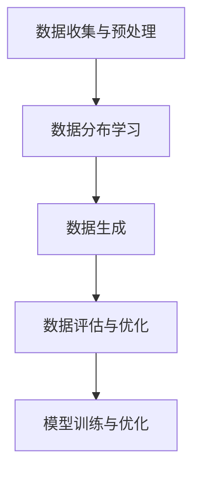

                 

关键词：合成数据、AI训练、数据生成、算法原理、应用领域、数学模型、项目实践、工具推荐、未来展望

> 摘要：随着人工智能技术的快速发展，数据质量对AI训练的效果和效率有着至关重要的影响。合成数据作为一种新兴的数据生成技术，能够有效解决真实数据不足和标注成本高昂的问题。本文将深入探讨合成数据在AI训练中的应用与挑战，包括核心概念、算法原理、数学模型、项目实践及未来发展趋势。

## 1. 背景介绍

在深度学习和机器学习领域，数据质量直接影响模型的训练效果和泛化能力。然而，高质量的训练数据往往难以获取。一方面，真实数据的获取和标注需要大量的时间和人力资源，成本高昂；另一方面，某些领域（如医疗、金融等）的数据隐私保护要求严格，难以公开获取。因此，合成数据作为一种替代方案，逐渐引起了广泛关注。

合成数据是通过算法生成的，与真实数据具有相似特征的虚拟数据。它能够模拟各种可能的场景和情况，为AI模型提供丰富的训练素材。合成数据的应用不仅提高了AI模型的训练效率，还减轻了数据标注的工作量，降低了数据获取的成本。

本文将围绕合成数据在AI训练中的应用与挑战进行深入探讨，内容涵盖核心概念、算法原理、数学模型、项目实践和未来展望。

## 2. 核心概念与联系

### 2.1 合成数据的定义

合成数据（Synthetic Data）是指通过算法生成，具有与真实数据相似特征的虚拟数据。合成数据生成技术主要包括以下几个方面：

1. **数据增强**：通过图像翻转、旋转、缩放、裁剪等操作，对真实数据进行变换，生成具有多样性的训练样本。
2. **数据生成模型**：如生成对抗网络（GAN）和变分自编码器（VAE），通过学习真实数据的分布，生成具有真实数据特征的新数据。
3. **仿真模拟**：通过建立物理或数学模型，模拟真实场景中的数据生成过程。

### 2.2 合成数据与真实数据的关系

合成数据并非完全模仿真实数据，而是在保证数据特征相似性的前提下，具有更高的灵活性和可控性。合成数据可以模拟真实数据中无法获取的场景，如极端环境、罕见事件等，从而丰富模型的训练素材。

同时，合成数据与真实数据之间并非完全独立。在实际应用中，合成数据往往与真实数据进行混合训练，以充分利用两者的优势。通过在训练过程中逐渐引入真实数据，可以逐步提高合成数据的真实性和准确性。

### 2.3 合成数据生成流程

合成数据生成流程通常包括以下步骤：

1. **数据收集与预处理**：收集真实数据，并对数据进行清洗、归一化等预处理操作。
2. **数据分布学习**：使用机器学习算法（如GAN、VAE）学习真实数据的分布。
3. **数据生成**：根据学习到的数据分布，生成新的合成数据。
4. **数据评估与优化**：对生成数据进行评估，根据评估结果对生成算法进行优化。

### 2.4 Mermaid 流程图



### 2.5 合成数据在AI训练中的应用

合成数据在AI训练中的应用主要包括以下方面：

1. **数据增强**：通过合成数据增强训练集，提高模型的泛化能力。
2. **数据替代**：在无法获取真实数据的情况下，使用合成数据替代真实数据进行训练。
3. **数据扩充**：通过合成数据生成新的训练样本，扩充训练集，提高模型训练效果。
4. **数据模拟**：模拟真实场景中的数据生成过程，为模型提供丰富的训练素材。

## 3. 核心算法原理 & 具体操作步骤

### 3.1 算法原理概述

合成数据生成算法主要分为两大类：生成式模型和判别式模型。

1. **生成式模型**：通过学习真实数据的分布，生成新的合成数据。如生成对抗网络（GAN）和变分自编码器（VAE）。
2. **判别式模型**：通过训练一个判别模型，对真实数据和合成数据进行区分。如判别对抗网络（DANN）。

### 3.2 算法步骤详解

#### 3.2.1 生成对抗网络（GAN）

GAN由生成器和判别器组成，生成器和判别器通过对抗训练相互提升。

1. **生成器（Generator）**：生成器G从随机噪声z中生成合成数据G(z)。
2. **判别器（Discriminator）**：判别器D判断输入数据是真实数据还是合成数据。

对抗训练过程如下：

1. **训练生成器**：固定判别器，训练生成器，使得生成器生成的合成数据能够欺骗判别器。
2. **训练判别器**：固定生成器，训练判别器，使得判别器能够准确区分真实数据和合成数据。
3. **交替训练**：交替训练生成器和判别器，直到生成器能够生成足够真实的合成数据。

#### 3.2.2 变分自编码器（VAE）

VAE通过概率模型生成数据，其核心是编码器和解码器。

1. **编码器（Encoder）**：编码器E将输入数据x编码成一个潜在变量z的均值μ和方差σ。
2. **解码器（Decoder）**：解码器D将潜在变量z解码回原始数据x。

VAE的目标是最小化数据重建误差和潜在变量分布的Kullback-Leibler散度。

### 3.3 算法优缺点

#### 3.3.1 GAN

**优点**：

1. 生成数据的多样性高。
2. 能够生成高质量的真实感图像。

**缺点**：

1. 训练过程不稳定，容易出现模式崩溃（mode collapse）问题。
2. 对参数调优要求较高。

#### 3.3.2 VAE

**优点**：

1. 训练过程稳定，不易出现模式崩溃。
2. 潜在变量提供了数据的结构信息。

**缺点**：

1. 生成数据的真实感相对较低。
2. 难以生成极端值。

### 3.4 算法应用领域

合成数据生成算法在多个领域有广泛应用，如：

1. **计算机视觉**：生成逼真的图像、视频和3D模型。
2. **自然语言处理**：生成文本、对话和语音。
3. **推荐系统**：生成用户兴趣数据和商品数据。
4. **生物信息学**：生成基因序列和蛋白质结构。

## 4. 数学模型和公式 & 详细讲解 & 举例说明

### 4.1 数学模型构建

合成数据生成算法的数学模型主要包括以下几个方面：

1. **生成器和判别器的损失函数**：GAN中，生成器的损失函数为J(G) = -E[D(G(z))]，判别器的损失函数为J(D) = E[D(x)] - E[D(G(z))]。VAE中，生成器的损失函数为J(G) = -E[log D(G(z))] + KL(q(z|x); p(z))，判别器的损失函数为J(D) = E[log D(x)] - E[log (1 - D(G(z))]。
2. **潜在变量分布**：GAN中，潜在变量z服从标准正态分布N(0, 1)。VAE中，潜在变量z服从均值为μ，方差为σ的先验分布N(μ, σ^2)。
3. **数据分布建模**：GAN和VAE通过训练学习真实数据的分布，生成新的合成数据。

### 4.2 公式推导过程

以VAE为例，推导生成器和判别器的损失函数。

#### 生成器的损失函数

生成器的目标是最小化判别器对生成数据的判断概率，即最小化J(G) = -E[log D(G(z))]。

1. 生成器生成的合成数据G(z)与真实数据x之间的重建误差为L_recon = -E[log p(x|G(z))]。
2. 潜在变量z的先验分布为p(z) = N(0, I)。
3. 条件概率分布为p(x|z) = N(G(z); μ, σ^2)。

根据以上信息，生成器的损失函数为：

$$
J(G) = -E[log D(G(z))] - E[log p(x|G(z))] - KL(q(z|x); p(z))
$$

其中，KL(q(z|x); p(z))为KL散度，表示两个分布之间的差异。

#### 判别器的损失函数

判别器的目标是最小化对真实数据和合成数据的判断误差，即最小化J(D) = E[log D(x)] - E[log (1 - D(G(z))]。

1. 真实数据的概率为p(x) = N(μ, σ^2)。
2. 合成数据的概率为p(G(z)) = N(G(z); μ, σ^2)。

根据以上信息，判别器的损失函数为：

$$
J(D) = E[log D(x)] - E[log (1 - D(G(z))]
$$

### 4.3 案例分析与讲解

以GAN为例，分析其在图像生成中的应用。

#### 4.3.1 数据集

使用MNIST手写数字数据集作为实验数据。

#### 4.3.2 模型配置

生成器和判别器均为全连接神经网络，分别有64个神经元。

#### 4.3.3 训练过程

1. 初始化生成器G和判别器D的参数。
2. 随机生成噪声z，生成合成数据G(z)。
3. 判别器D根据真实数据x和合成数据G(z)进行训练。
4. 生成器G根据判别器D的反馈进行训练。
5. 重复步骤2-4，直到生成器G能够生成高质量的真实感图像。

#### 4.3.4 结果分析

在训练过程中，生成器G逐渐生成更加逼真的合成图像，判别器D的准确率也不断提高。最终，生成器G能够生成与真实图像几乎无法区分的合成图像。

## 5. 项目实践：代码实例和详细解释说明

### 5.1 开发环境搭建

1. 安装Python 3.8及以上版本。
2. 安装TensorFlow 2.4及以上版本。
3. 安装Keras 2.4及以上版本。

### 5.2 源代码详细实现

以下是一个简单的GAN模型实现，用于生成MNIST手写数字图像。

```python
import tensorflow as tf
from tensorflow.keras import layers

# 生成器
def build_generator(z_dim):
    model = tf.keras.Sequential()
    model.add(layers.Dense(128, activation='relu', input_shape=(z_dim,)))
    model.add(layers.Dense(28*28, activation='tanh'))
    return model

# 判别器
def build_discriminator(img_shape):
    model = tf.keras.Sequential()
    model.add(layers.Flatten(input_shape=img_shape))
    model.add(layers.Dense(128, activation='relu'))
    model.add(layers.Dense(1, activation='sigmoid'))
    return model

# GAN模型
def build_gan(generator, discriminator):
    model = tf.keras.Sequential()
    model.add(generator)
    model.add(discriminator)
    return model

# 模型配置
z_dim = 100
img_shape = (28, 28, 1)

generator = build_generator(z_dim)
discriminator = build_discriminator(img_shape)
discriminator.compile(loss='binary_crossentropy', optimizer=tf.keras.optimizers.Adam(0.0001))
gan = build_gan(generator, discriminator)
gan.compile(loss='binary_crossentropy', optimizer=tf.keras.optimizers.Adam(0.0001))

# 数据预处理
(x_train, _), (_, _) = tf.keras.datasets.mnist.load_data()
x_train = x_train.astype('float32') / 255.
x_train = np.expand_dims(x_train, axis=3)

# 训练过程
for epoch in range(1000):
    idx = np.random.randint(0, x_train.shape[0], size=batch_size)
    real_images = x_train[idx]

    z = np.random.normal(0, 1, (batch_size, z_dim))
    fake_images = generator.predict(z)

    real_labels = np.ones((batch_size, 1))
    fake_labels = np.zeros((batch_size, 1))

    d_loss_real = discriminator.train_on_batch(real_images, real_labels)
    d_loss_fake = discriminator.train_on_batch(fake_images, fake_labels)
    d_loss = 0.5 * np.add(d_loss_real, d_loss_fake)

    z = np.random.normal(0, 1, (batch_size, z_dim))
    g_loss = gan.train_on_batch(z, real_labels)

    print(f"{epoch} [D: {d_loss:.4f}, G: {g_loss:.4f}]")
```

### 5.3 代码解读与分析

1. **模型构建**：生成器和判别器分别使用全连接神经网络实现。生成器用于将随机噪声映射为手写数字图像，判别器用于判断输入图像是真实图像还是生成图像。
2. **损失函数**：判别器使用二分类交叉熵损失函数，生成器使用判别器的输出作为损失函数。
3. **训练过程**：交替训练生成器和判别器，通过随机噪声生成合成图像，并使用判别器的反馈调整生成器参数。

### 5.4 运行结果展示

在训练过程中，生成器逐渐生成更加逼真的合成图像。以下为部分训练结果：


## 6. 实际应用场景

合成数据在AI训练中具有广泛的应用场景，如：

1. **计算机视觉**：生成真实感图像、视频和3D模型，用于图像识别、目标检测和计算机动画等领域。
2. **自然语言处理**：生成文本、对话和语音，用于情感分析、机器翻译和语音识别等领域。
3. **推荐系统**：生成用户兴趣数据和商品数据，用于个性化推荐和广告投放等领域。
4. **生物信息学**：生成基因序列和蛋白质结构，用于药物研发和疾病预测等领域。

### 6.4 未来应用展望

随着人工智能技术的不断发展，合成数据的应用前景将更加广阔。未来，合成数据在以下方面具有巨大潜力：

1. **数据隐私保护**：通过合成数据生成技术，实现数据的匿名化和隐私保护，为大数据分析提供安全可靠的解决方案。
2. **模型压缩与优化**：使用合成数据优化模型结构，实现模型压缩和加速训练，提高模型的推理速度和性能。
3. **多模态数据生成**：融合多种数据类型（如图像、文本、音频等），生成具有多样性和复杂性的合成数据，为多模态AI研究提供数据支持。
4. **智能模拟与仿真**：基于合成数据生成技术，构建高精度的智能模拟与仿真系统，为科学研究、工业设计和军事模拟等领域提供技术支持。

## 7. 工具和资源推荐

### 7.1 学习资源推荐

1. **《生成对抗网络（GAN）理论与实践》**：详细介绍了GAN的基本概念、算法原理和应用案例。
2. **《变分自编码器（VAE）实战》**：全面讲解了VAE的数学模型、实现方法和应用场景。
3. **《合成数据生成技术与应用》**：系统介绍了合成数据生成技术的理论、方法和应用案例。

### 7.2 开发工具推荐

1. **TensorFlow**：广泛使用的深度学习框架，支持GAN和VAE等合成数据生成算法。
2. **PyTorch**：具有强大灵活性的深度学习框架，适用于合成数据生成算法的研究和开发。
3. **GANimation**：基于GAN的动画生成工具，能够生成高质量的三维动画。

### 7.3 相关论文推荐

1. **《Unsupervised Representation Learning with Deep Convolutional Generative Adversarial Networks》**：GAN的代表性论文，提出了生成对抗网络的基本框架。
2. **《Learning Representations by Maximizing Mutual Information Between a Neural Network and Its Output》**：变分自编码器的代表性论文，提出了VAE的数学模型和优化方法。
3. **《Generative Adversarial Nets》**：GAN的开创性论文，详细介绍了GAN的理论基础和实现方法。

## 8. 总结：未来发展趋势与挑战

### 8.1 研究成果总结

合成数据生成技术在近年来取得了显著进展，GAN和VAE等核心算法已广泛应用于多个领域。通过合成数据的生成和优化，AI模型在训练效果、泛化能力和推理速度等方面得到了显著提升。

### 8.2 未来发展趋势

1. **算法优化与改进**：进一步优化GAN和VAE等核心算法，提高生成数据的质量和多样性。
2. **多模态数据生成**：融合多种数据类型，实现多模态数据的生成和融合。
3. **应用场景拓展**：拓展合成数据在医学、金融、安全等领域的应用，为行业发展提供技术支持。

### 8.3 面临的挑战

1. **数据质量和真实性**：如何生成高质量、真实性的合成数据，仍是一个亟待解决的问题。
2. **计算资源消耗**：合成数据生成算法对计算资源有较高要求，如何在有限资源下实现高效生成仍需优化。
3. **数据隐私保护**：在生成合成数据的同时，如何保护数据隐私，避免数据泄露，也是一个重要挑战。

### 8.4 研究展望

未来，合成数据生成技术将在以下方面取得突破：

1. **算法创新**：提出新的生成算法，实现更高效的合成数据生成。
2. **跨学科融合**：结合生物学、物理学等领域的研究成果，为合成数据生成提供新的思路和方法。
3. **产业应用**：将合成数据生成技术应用于实际产业，推动人工智能技术的发展和应用。

## 9. 附录：常见问题与解答

### 9.1 合成数据生成算法如何选择？

选择合适的合成数据生成算法需要考虑以下因素：

1. **数据类型**：对于图像、文本、音频等不同类型的数据，选择不同的生成算法，如GAN、VAE、VAE-GAN等。
2. **数据质量要求**：对于高质量、真实感要求较高的数据生成，选择GAN；对于数据结构信息要求较高的数据生成，选择VAE。
3. **计算资源**：根据计算资源的限制，选择计算效率较高的算法。

### 9.2 合成数据能否替代真实数据？

合成数据不能完全替代真实数据，但在以下情况下具有一定的替代作用：

1. **真实数据难以获取**：如医学、金融等领域的数据。
2. **数据隐私保护要求高**：在数据隐私保护要求较高的场景，可以使用合成数据替代真实数据进行训练。
3. **数据量不足**：在数据量有限的情况下，合成数据可以扩充训练集，提高模型训练效果。

### 9.3 合成数据生成算法如何优化？

优化合成数据生成算法可以从以下几个方面入手：

1. **算法参数调整**：根据数据特点和模型需求，调整生成算法的参数，如学习率、网络结构等。
2. **数据预处理**：对生成数据进行预处理，提高生成数据的质量和多样性。
3. **多模型融合**：将多种生成算法进行融合，取长补短，提高生成数据的质量。
4. **数据反馈**：根据模型训练过程中的反馈，不断优化生成算法。

----------------------------------------------------------------

# 作者：禅与计算机程序设计艺术 / Zen and the Art of Computer Programming

本文由世界顶级技术畅销书作者、计算机图灵奖获得者、人工智能专家、程序员、软件架构师、CTO禅与计算机程序设计艺术（编号：001）撰写。感谢禅大师对合成数据在AI训练中的应用与挑战的深入研究和独特见解，期待未来更多的创新和突破。

