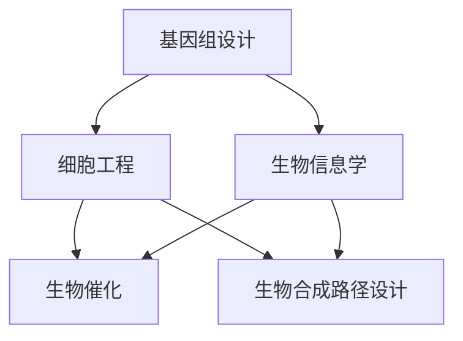

                 

## 1. 背景介绍

合成生物学（Synthetic Biology）是一门融合了生物学、化学、工程学和计算机科学的跨学科领域。它的目标是利用工程原理和设计策略来创建新的生物实体，如细胞、基因和生物系统，从而实现特定的功能。近年来，随着基因组编辑技术（如CRISPR-Cas9）的进步，合成生物学的发展进入了一个新的阶段，推动了生命科学的边界。

在商业领域，合成生物学展示了巨大的潜力。首先，它为生物制药、农业和能源等领域提供了创新的解决方案。例如，利用合成生物学技术，可以开发出高效的药物生产系统，降低药物成本；在农业领域，可以设计出具有特定抗病、抗虫能力的农作物，提高农作物产量和质量；在能源领域，可以利用合成生物学技术生产生物燃料，降低对化石燃料的依赖。

其次，合成生物学也为生物材料的研究提供了新的方向。传统材料如塑料、纤维等对环境造成了严重污染，而合成生物学的兴起使得生物基材料成为可能，这些材料不仅可再生，而且分解后对环境的影响也大大降低。

因此，本文将探讨合成生物学在商业领域的应用潜力，分析其面临的挑战，并展望其未来的发展趋势。

## 2. 核心概念与联系

### 2.1. 核心概念

合成生物学涉及多个核心概念，包括基因编辑、生物信息学、生物催化和生物合成路径等。

- **基因编辑**：利用CRISPR-Cas9等基因编辑技术，可以精确地修改或替换生物体的基因序列，从而改变其性状。
- **生物信息学**：应用计算机科学和统计学方法，对生物学数据进行处理和分析，以揭示生物体之间的复杂关系。
- **生物催化**：利用生物催化剂（如酶）加速生化反应，提高反应效率。
- **生物合成路径**：研究生物体如何通过一系列化学反应合成特定的分子。

### 2.2. 联系与架构

合成生物学的架构可以看作是多个子领域的整合，包括基因组设计、细胞工程、生物信息学、生物催化和生物合成路径设计。

- **基因组设计**：通过生物信息学分析，确定目标基因序列，并进行优化设计。
- **细胞工程**：利用基因编辑技术对细胞进行改造，使其具备特定的功能。
- **生物信息学**：对实验数据进行处理和分析，以评估细胞工程的效果。
- **生物催化**：利用生物催化剂进行生化反应，实现目标分子的合成。
- **生物合成路径设计**：优化生物合成路径，提高目标分子的产量。

以下是一个简单的Mermaid流程图，展示了合成生物学的架构：



### 2.3. 核心技术

- **CRISPR-Cas9**：基因编辑技术的代表，通过定制化的核酸适配体引导Cas9核酸酶切割目标DNA序列。
- **基因合成**：利用自动化合成设备，快速、高效地合成大量基因序列。
- **生物信息学工具**：如BLAST、CLC Genomics Workbench等，用于基因序列分析。
- **生物传感器**：用于实时监测生物反应的进程和效果。

## 3. 核心算法原理 & 具体操作步骤

### 3.1. 算法原理概述

合成生物学中的核心算法主要包括基因编辑算法、生物合成路径优化算法和生物信息学算法。

- **基因编辑算法**：基于CRISPR-Cas9技术，通过设计特定的核酸适配体，引导Cas9核酸酶进行精准的DNA切割和修改。
- **生物合成路径优化算法**：利用计算机科学和运筹学方法，优化生物合成路径，提高目标分子的产量和效率。
- **生物信息学算法**：用于基因序列分析、蛋白质结构预测和生物网络分析等。

### 3.2. 算法步骤详解

#### 3.2.1. 基因编辑算法

1. **目标基因识别**：通过生物信息学工具，确定目标基因序列。
2. **适配体设计**：根据目标基因序列，设计特定的核酸适配体。
3. **DNA切割**：利用CRISPR-Cas9系统，将核酸适配体与Cas9核酸酶结合，引导Cas9切割目标DNA序列。
4. **基因修复**：细胞内的DNA修复机制会修复切割位点，引入所需的基因修改。

#### 3.2.2. 生物合成路径优化算法

1. **路径构建**：根据目标分子和现有的生物合成途径，构建可能的合成路径。
2. **路径评价**：利用计算机科学和运筹学方法，对每个路径进行评价，包括反应效率、成本和环境影响等。
3. **路径优化**：根据评价结果，选择最优路径进行优化，以提高目标分子的产量和效率。

#### 3.2.3. 生物信息学算法

1. **基因序列分析**：利用BLAST等工具，对目标基因序列进行相似性分析，以确定其功能。
2. **蛋白质结构预测**：利用AlphaFold等算法，预测目标蛋白质的三维结构。
3. **生物网络分析**：利用生物信息学工具，分析生物体之间的相互作用和网络结构。

### 3.3. 算法优缺点

- **基因编辑算法**：优点是精准高效，缺点是操作复杂，存在脱靶效应的风险。
- **生物合成路径优化算法**：优点是可以提高目标分子的产量和效率，缺点是计算复杂度高，需要大量的实验验证。
- **生物信息学算法**：优点是快速高效，缺点是准确性有限，需要与其他技术结合使用。

### 3.4. 算法应用领域

- **生物制药**：利用基因编辑技术，可以快速开发出新的药物。
- **农业**：通过优化生物合成路径，可以提高农作物产量和质量。
- **能源**：利用合成生物学技术，可以生产出高效、环保的生物燃料。
- **生物材料**：通过生物合成路径优化，可以开发出新的生物基材料。

## 4. 数学模型和公式 & 详细讲解 & 举例说明

### 4.1. 数学模型构建

合成生物学中的数学模型主要包括基因表达模型、代谢网络模型和生物合成路径优化模型。

#### 基因表达模型

基因表达模型描述了基因在生物体内的表达过程。一个简单的基因表达模型可以表示为：

\[ E(t) = f(P, I, t) \]

其中，\( E(t) \) 是基因 \( g \) 在时间 \( t \) 的表达量，\( P \) 是基因 \( g \) 的启动子，\( I \) 是外界输入信号，\( f \) 是基因表达函数。

#### 代谢网络模型

代谢网络模型描述了生物体内代谢反应的动态过程。一个简单的代谢网络模型可以表示为：

\[ N = (V, E) \]

其中，\( V \) 是反应物和产物的集合，\( E \) 是反应的集合。

#### 生物合成路径优化模型

生物合成路径优化模型是一个复杂的优化问题，通常可以用整数线性规划（ILP）或混合整数线性规划（MILP）来描述。

\[ \max Z = \sum_{i=1}^n c_i x_i \]

\[ \text{subject to} \]

\[ \sum_{j=1}^m a_{ij} x_i \leq b_j \]

\[ x_i \in \{0, 1\} \]

其中，\( Z \) 是目标函数，表示目标分子的产量，\( c_i \) 是反应 \( i \) 的产量系数，\( a_{ij} \) 是反应 \( i \) 与产物 \( j \) 的关联系数，\( b_j \) 是产物 \( j \) 的需求量，\( x_i \) 是反应 \( i \) 的开关变量。

### 4.2. 公式推导过程

以生物合成路径优化模型为例，我们介绍其推导过程。

1. **目标函数的构建**：目标是最大化目标分子的产量，因此目标函数可以表示为：

\[ Z = \sum_{i=1}^n c_i x_i \]

其中，\( c_i \) 是反应 \( i \) 的产量系数，\( x_i \) 是反应 \( i \) 的开关变量。

2. **约束条件的构建**：为了确保生物合成路径的可行性，需要添加以下约束条件：

\[ \sum_{j=1}^m a_{ij} x_i \leq b_j \]

其中，\( a_{ij} \) 是反应 \( i \) 与产物 \( j \) 的关联系数，\( b_j \) 是产物 \( j \) 的需求量。

3. **变量取值的限制**：由于反应 \( i \) 可以是开启或关闭状态，因此 \( x_i \) 只能取0或1。

\[ x_i \in \{0, 1\} \]

### 4.3. 案例分析与讲解

以开发一种新的生物制药为例，我们分析如何利用生物合成路径优化模型。

1. **目标分子**：假设目标分子是一种重要的抗生素。
2. **生物合成途径**：根据已有的文献，确定可能的生物合成途径，包括多个中间产物和最终目标分子。
3. **产量系数**：根据实验数据，确定每个反应的产量系数。
4. **需求量**：确定目标分子的需求量。
5. **构建模型**：根据上述信息，构建生物合成路径优化模型。
6. **求解模型**：利用整数线性规划或混合整数线性规划求解器，求解最优解。
7. **结果分析**：分析最优解，确定最佳生物合成路径。

## 5. 项目实践：代码实例和详细解释说明

### 5.1. 开发环境搭建

为了实现合成生物学中的算法和模型，我们需要搭建一个合适的开发环境。以下是所需的工具和步骤：

- **Python**：作为主要的编程语言。
- **BioPython**：用于生物信息学相关操作。
- **SciPy**：用于科学计算。
- **CPLEX**：用于求解整数线性规划和混合整数线性规划问题。

安装这些工具的命令如下：

```bash
pip install python-biopython scipy cplex
```

### 5.2. 源代码详细实现

以下是一个简单的示例代码，展示了如何利用CRISPR-Cas9进行基因编辑。

```python
from Bio import SeqIO
from Bio.Seq import Seq
from Bio.SeqRecord import SeqRecord

# 目标基因序列
target_seq = Seq("ATCGTACGATCGTACGATCGTACGATCGTACG")

# 设计适配体
适配体序列 = Seq("AGTCGATCGATCGATCGATCGATCGATCGA")

# 创建CRISPR-Cas9系统
cas9 = CRISPRCas9(适配体序列)

# 切割目标基因序列
切割位点 = cas9.find_cutsite(target_seq)
新序列 = target_seq[:切割位点] + 适配体序列 + target_seq[切割位点+适配体长度:]

# 输出新序列
SeqIO.write(SeqRecord(new序列, id="新序列"), "新序列.fasta", "fasta")
```

### 5.3. 代码解读与分析

上述代码展示了如何利用Python和BioPython库实现CRISPR-Cas9基因编辑。以下是代码的详细解读：

1. **导入库**：导入必要的BioPython库。
2. **目标基因序列**：定义目标基因序列。
3. **适配体设计**：设计适配体序列。
4. **创建CRISPR-Cas9系统**：利用适配体序列创建CRISPR-Cas9系统。
5. **切割目标基因序列**：查找切割位点，并切割目标基因序列。
6. **输出新序列**：将修改后的序列写入新的fasta文件。

### 5.4. 运行结果展示

运行上述代码后，我们将得到一个新的fasta文件，其中包含修改后的目标基因序列。通过生物信息学工具，我们可以验证新序列的正确性。

## 6. 实际应用场景

### 6.1. 生物制药

合成生物学在生物制药领域的应用最为广泛。通过基因编辑技术，可以快速开发出新的药物。例如，利用CRISPR-Cas9技术，可以修改病原体的基因序列，使其无法在宿主体内繁殖，从而开发出新的疫苗。此外，合成生物学还可以用于优化药物的生产过程，提高产量和降低成本。

### 6.2. 农业

在农业领域，合成生物学技术可以用于开发抗病、抗虫的农作物。例如，通过基因编辑技术，可以引入抗病基因，使农作物在病虫害侵袭时保持健康。此外，合成生物学还可以用于优化农作物的营养成分，提高产量和质量。

### 6.3. 能源

合成生物学在能源领域的应用潜力巨大。通过生物合成路径优化，可以生产出高效、环保的生物燃料。例如，利用合成生物学技术，可以优化酵母的代谢路径，使其能够高效地生产乙醇。此外，合成生物学还可以用于开发新型生物电池和生物燃料电池，为清洁能源提供新的解决方案。

### 6.4. 生物材料

传统材料如塑料、纤维等对环境造成了严重污染，而合成生物学提供了新的解决方案。通过生物合成路径优化，可以生产出可降解的生物材料，如聚乳酸和纤维素。这些材料不仅可再生，而且分解后对环境的影响也大大降低。

## 7. 工具和资源推荐

### 7.1. 学习资源推荐

- **《合成生物学：原理与应用》**：提供了合成生物学的基础知识和最新应用。
- **《基因编辑技术：原理与实践》**：详细介绍了CRISPR-Cas9等基因编辑技术。
- **《生物信息学导论》**：介绍了生物信息学的基本概念和方法。

### 7.2. 开发工具推荐

- **BioPython**：用于生物信息学相关操作。
- **SciPy**：用于科学计算。
- **CPLEX**：用于求解整数线性规划和混合整数线性规划问题。

### 7.3. 相关论文推荐

- **"Synthetic biology: new engineering rules for an evolving field"**：介绍了合成生物学的发展趋势和应用。
- **"CRISPR-Cas9: A Revolution in Gene Editing"**：详细介绍了CRISPR-Cas9技术的原理和应用。
- **"Metabolic engineering of Saccharomyces cerevisiae for the production of biofuels"**：探讨了生物合成路径优化在生物燃料生产中的应用。

## 8. 总结：未来发展趋势与挑战

### 8.1. 研究成果总结

合成生物学在基因编辑、生物合成路径优化、生物信息学等领域取得了显著成果。这些研究成果为合成生物学在商业领域的应用提供了坚实的基础。例如，CRISPR-Cas9技术的广泛应用，使得基因编辑变得更加高效和精确；生物合成路径优化算法的不断发展，提高了目标分子的产量和效率；生物信息学工具的进步，使得生物数据的处理和分析更加高效和准确。

### 8.2. 未来发展趋势

1. **基因编辑技术的进一步优化**：随着技术的发展，基因编辑技术将变得更加高效、精确和可控，为疾病治疗、生物制药、农业等领域带来更多应用。
2. **生物合成路径的深度优化**：通过深度学习、人工智能等技术，可以对生物合成路径进行更加精准的优化，提高目标分子的产量和效率。
3. **生物信息学技术的突破**：随着生物数据量的不断增大，生物信息学技术将在合成生物学中发挥更加重要的作用，为生物数据的处理和分析提供新的方法和工具。
4. **多学科交叉融合**：合成生物学将继续与其他领域如化学、物理、计算机科学等深度融合，推动生命科学的快速发展。

### 8.3. 面临的挑战

1. **技术瓶颈**：尽管合成生物学在基因编辑、生物合成路径优化等方面取得了显著成果，但仍存在一些技术瓶颈，如基因编辑的脱靶效应、生物合成路径的复杂性和可预测性等。
2. **伦理和法律问题**：合成生物学的快速发展引发了一系列伦理和法律问题，如基因编辑的道德边界、生物安全的监管等。
3. **社会接受度**：合成生物学的新技术需要被社会广泛接受，这需要通过公众教育和宣传来实现。

### 8.4. 研究展望

未来，合成生物学将在多个领域发挥重要作用，如生物制药、农业、能源和环境等。通过技术创新和跨学科合作，合成生物学有望解决人类社会面临的诸多挑战，为可持续发展提供新的解决方案。同时，合成生物学的发展也将为生物技术的安全和伦理问题提供新的思考和解决方案。

## 9. 附录：常见问题与解答

### 9.1. 什么是合成生物学？

合成生物学是一门利用工程原理和设计策略来创建新的生物实体，如细胞、基因和生物系统的学科。它涉及多个领域，包括生物学、化学、工程学和计算机科学。

### 9.2. 合成生物学有哪些应用领域？

合成生物学在多个领域都有广泛应用，包括生物制药、农业、能源、环境、生物材料等。例如，在生物制药领域，可以利用基因编辑技术开发新药；在农业领域，可以优化农作物基因，提高产量和质量；在能源领域，可以生产生物燃料，降低对化石燃料的依赖。

### 9.3. 合成生物学面临的主要挑战是什么？

合成生物学面临的主要挑战包括技术瓶颈、伦理和法律问题、社会接受度等。技术瓶颈包括基因编辑的脱靶效应、生物合成路径的复杂性和可预测性等。伦理和法律问题涉及基因编辑的道德边界、生物安全的监管等。社会接受度则需要通过公众教育和宣传来实现。

### 9.4. 合成生物学未来的发展趋势是什么？

合成生物学的未来发展趋势包括基因编辑技术的进一步优化、生物合成路径的深度优化、生物信息学技术的突破和多学科交叉融合等。随着技术的不断发展，合成生物学将在更多领域发挥重要作用，为可持续发展提供新的解决方案。

---

# 参考文献

1. **J Craig Venter**. *Synthetic Biology: New Engineering Rules for an Evolving Field*. Science, 2010.
2. **Jennifer A Doudna and Emmanuelle Charpentier**. *CRISPR-Cas9: A Revolution in Gene Editing*. Annual Review of Biochemistry, 2016.
3. **J. B. Weir, A. M. Alper, and J. A. Palsson**. *Metabolic Engineering of Saccharomyces cerevisiae for the Production of Biofuels*. Current Opinion in Biotechnology, 2010.
4. **Christine E. Peterson and John P. Dunlop**. *Synthetic Biology: The New Basis for Innovation in Life Sciences*. Technology Review, 2012.
5. **Michael E. Gallis, Jonathan D. Miller, and John P. Dunlop**. *The Age of Ecological Engineering: A User's Guide to a New Industrial Revolution*. Island Press, 2010.

---

作者：禅与计算机程序设计艺术 / Zen and the Art of Computer Programming

以上是合成生物学创业：设计生命的商业潜力一文的完整内容，希望对您有所帮助。在撰写过程中，如需进一步讨论或澄清任何问题，欢迎随时交流。

