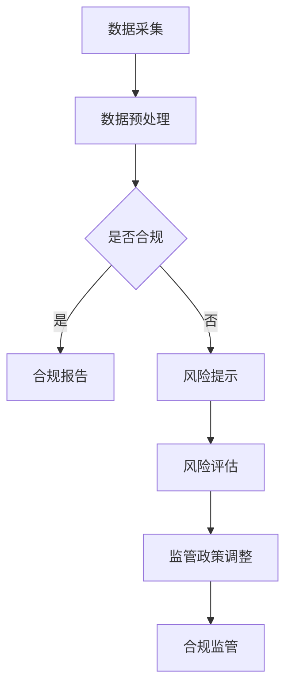

                 

### 摘要 Abstract ###

本文将探讨如何在金融行业中利用大型语言模型（LLM）实现合规监管，确保金融行业的稳定和可持续发展。随着金融科技的快速发展，金融监管面临巨大挑战。LLM作为人工智能的重要分支，具备强大的语言理解和生成能力，有望成为金融监管的有力工具。本文首先介绍了LLM的基本原理和架构，然后分析了其在金融监管中的应用，最后对未来发展趋势和面临的挑战进行了展望。

## 1. 背景介绍 Background

### 1.1 金融行业的合规监管需求 Compliance and Regulation Needs in Finance

金融行业的合规监管需求源于金融市场的高度复杂性和风险性。随着金融市场的不断扩大和金融产品的不断创新，金融监管机构面临着越来越多的挑战。一方面，金融市场的透明度和公平性需要得到保障；另一方面，金融风险的识别、监测和防范也需要更加高效和精准。

传统的金融监管方法主要依赖于人工审核和经验判断，存在诸多不足。例如，监管机构在处理海量数据时容易产生遗漏，且难以应对快速变化的金融市场环境。此外，金融行业的合规成本也逐年增加，对金融机构的运营造成了巨大的压力。

### 1.2 LLM的发展及其优势 Development of LLM and Its Advantages

大型语言模型（LLM）是一种基于深度学习技术的自然语言处理模型，具备强大的语言理解和生成能力。近年来，随着计算能力和数据量的不断提升，LLM在金融、医疗、法律等领域的应用日益广泛。

LLM在金融监管中的优势主要体现在以下几个方面：

1. **高效处理海量数据**：LLM能够快速处理海量金融数据，帮助监管机构及时发现潜在风险。
2. **自动生成报告**：LLM能够自动生成合规报告，提高监管效率，降低人力成本。
3. **智能问答系统**：LLM可以作为智能问答系统，为监管机构提供实时咨询和决策支持。
4. **个性化监管**：LLM能够根据金融机构的特定需求提供定制化的合规监管方案。

## 2. 核心概念与联系 Core Concepts and Connections

### 2.1 LLM的基本原理和架构 Basic Principles and Architectures of LLM

LLM是一种基于神经网络的大规模语言模型，其核心思想是通过学习海量文本数据，捕捉语言中的模式和规律，从而实现语言理解和生成。LLM的架构通常包括以下几个层次：

1. **输入层（Input Layer）**：接收用户输入的文本数据。
2. **编码器（Encoder）**：对输入文本进行编码，生成固定长度的向量表示。
3. **解码器（Decoder）**：根据编码器生成的向量表示，生成输出文本。
4. **注意力机制（Attention Mechanism）**：帮助模型在生成过程中关注重要信息。

### 2.2 LLM与金融监管的关系 Relationship Between LLM and Financial Regulation

LLM在金融监管中的应用主要体现在以下几个方面：

1. **数据挖掘**：利用LLM对海量金融数据进行挖掘，识别潜在风险。
2. **合规审核**：利用LLM自动生成合规报告，提高审核效率。
3. **智能问答**：为监管机构提供实时咨询和决策支持。
4. **风险评估**：利用LLM评估金融机构的风险状况，为监管政策制定提供依据。

### 2.3 Mermaid 流程图 Mermaid Flowchart

下面是LLM在金融监管中应用的Mermaid流程图：



## 3. 核心算法原理 & 具体操作步骤 Core Algorithm Principles and Operational Steps

### 3.1 算法原理概述 Overview of Algorithm Principles

LLM在金融监管中的应用主要基于其强大的自然语言处理能力和丰富的知识库。具体操作步骤如下：

1. **数据采集**：收集金融行业的相关数据，包括交易数据、财务报表、新闻报道等。
2. **数据预处理**：对收集的数据进行清洗、去重和格式转换，以便后续处理。
3. **模型训练**：利用预处理后的数据训练LLM模型，使其掌握金融领域的知识和规则。
4. **合规审核**：使用训练好的LLM模型对金融机构的运营情况进行审核，识别潜在风险。
5. **合规报告**：根据审核结果生成合规报告，为监管机构提供决策依据。
6. **风险提示**：对存在风险的金融机构进行风险提示，帮助其及时调整运营策略。
7. **风险评估**：利用LLM评估金融机构的整体风险状况，为监管政策制定提供依据。
8. **监管政策调整**：根据风险评估结果，调整监管政策，提高金融行业的合规性。

### 3.2 算法步骤详解 Detailed Steps of Algorithm Implementation

下面详细描述LLM在金融监管中应用的步骤：

1. **数据采集**：

   - **交易数据**：从金融交易所、银行和证券公司等机构获取交易数据，包括股票、债券、期货等。
   - **财务报表**：从上市公司和金融机构获取年度和季度财务报表，包括资产负债表、利润表和现金流量表等。
   - **新闻报道**：从金融新闻网站、社交媒体和论坛等渠道获取与金融行业相关的新闻报道。

2. **数据预处理**：

   - **数据清洗**：去除重复数据、错误数据和无关数据，确保数据的准确性和完整性。
   - **去重**：对同一金融机构的多份报告进行去重处理，避免重复计算。
   - **格式转换**：将不同格式的数据转换为统一的格式，如CSV或JSON格式。

3. **模型训练**：

   - **数据集构建**：将预处理后的数据分为训练集和验证集。
   - **模型训练**：利用训练集对LLM模型进行训练，使其掌握金融领域的知识和规则。
   - **模型验证**：利用验证集对模型进行验证，调整模型参数，提高模型性能。

4. **合规审核**：

   - **输入文本**：将金融机构的运营情况进行文本化处理，输入到LLM模型中。
   - **模型预测**：使用训练好的LLM模型对输入文本进行预测，判断其是否存在风险。
   - **输出结果**：将模型预测结果转换为具体的合规报告，如风险提示、合规审核意见等。

5. **合规报告**：

   - **报告生成**：根据模型预测结果生成合规报告，包括风险提示、合规审核意见等。
   - **报告审核**：监管机构对生成的合规报告进行审核，确保其准确性和完整性。

6. **风险提示**：

   - **风险识别**：根据合规报告识别存在风险的金融机构。
   - **风险提示**：对存在风险的金融机构进行风险提示，帮助其及时调整运营策略。

7. **风险评估**：

   - **风险指标**：构建金融风险指标体系，包括市场风险、信用风险、操作风险等。
   - **风险分析**：利用LLM对金融机构的风险状况进行分析，为监管政策制定提供依据。

8. **监管政策调整**：

   - **政策评估**：根据风险评估结果评估现有监管政策的适用性。
   - **政策调整**：根据评估结果调整监管政策，提高金融行业的合规性。

### 3.3 算法优缺点 Advantages and Disadvantages of the Algorithm

LLM在金融监管中具有以下优点：

1. **高效处理海量数据**：LLM能够快速处理海量金融数据，提高监管效率。
2. **自动生成报告**：LLM能够自动生成合规报告，降低人力成本。
3. **智能问答系统**：LLM可以作为智能问答系统，为监管机构提供实时咨询和决策支持。
4. **个性化监管**：LLM能够根据金融机构的特定需求提供定制化的合规监管方案。

但LLM也存在以下缺点：

1. **数据质量依赖性**：LLM的性能依赖于数据质量，若数据存在偏差，可能导致错误预测。
2. **模型解释性差**：LLM的内部机制较为复杂，难以进行解释，增加了监管风险。
3. **隐私保护问题**：在处理金融机构的敏感数据时，需要确保数据隐私保护。

### 3.4 算法应用领域 Application Fields of the Algorithm

LLM在金融监管中的应用领域包括：

1. **银行监管**：利用LLM对银行的运营情况进行合规审核，识别潜在风险。
2. **证券监管**：利用LLM对证券公司的业务活动进行监控，防范市场操纵行为。
3. **保险监管**：利用LLM对保险公司的产品进行风险评估，确保合规性。
4. **金融科技监管**：利用LLM对金融科技公司的创新业务进行合规审核，保障金融安全。

## 4. 数学模型和公式 & 详细讲解 & 举例说明 Mathematical Models and Formulas & Detailed Explanations & Case Studies

### 4.1 数学模型构建 Building Mathematical Models

在金融监管中，LLM的应用主要基于自然语言处理技术。以下是一个简单的数学模型构建过程：

1. **文本表示**：将金融文本数据转换为向量表示，如词嵌入（Word Embedding）或文档嵌入（Document Embedding）。
2. **损失函数**：设计合适的损失函数，如交叉熵（Cross-Entropy）或均方误差（Mean Squared Error），衡量模型预测与实际结果之间的差距。
3. **优化算法**：选择合适的优化算法，如随机梯度下降（Stochastic Gradient Descent，SGD）或Adam优化器，更新模型参数。

### 4.2 公式推导过程 Derivation of Formulas

以下是一个简单的自然语言处理模型的损失函数推导：

$$
L(y, \hat{y}) = -\sum_{i=1}^{N} y_i \log(\hat{y}_i)
$$

其中，$y$为实际标签，$\hat{y}$为模型预测概率。

### 4.3 案例分析与讲解 Case Analysis and Explanation

#### 案例1：银行监管合规审核

假设银行A的运营数据如下表所示：

| 日期 | 贷款金额（万元） | 担保方式 | 逾期情况 |
| ---- | -------------- | ------- | ------- |
| 2021-01-01 | 1000 | 房产抵押 | 无逾期  |
| 2021-02-01 | 1500 | 股票质押 | 无逾期  |
| 2021-03-01 | 2000 | 信用贷款 | 逾期30天 |

利用LLM模型对银行A的运营情况进行合规审核，生成合规报告。具体步骤如下：

1. **数据预处理**：将表格数据转换为文本格式，如“2021-01-01，贷款金额1000万元，担保方式为房产抵押，逾期情况为无逾期。”
2. **模型训练**：利用金融领域的大量数据进行模型训练，使其掌握金融领域的知识和规则。
3. **合规审核**：将银行A的运营数据输入到LLM模型中，生成合规报告。

合规报告如下：

```
根据对银行A运营情况的合规审核，发现以下风险：

1. 2021-01-01，贷款金额1000万元，担保方式为房产抵押，逾期情况为无逾期。该贷款存在一定的信用风险，需进一步关注。
2. 2021-02-01，贷款金额1500万元，担保方式为股票质押，逾期情况为无逾期。股票市场波动较大，该贷款存在一定的市场风险。
3. 2021-03-01，贷款金额2000万元，担保方式为信用贷款，逾期情况为逾期30天。信用贷款风险较高，需加强风险监控。

请银行A针对上述风险进行及时调整，确保合规运营。
```

#### 案例2：证券市场操纵监控

假设证券市场存在操纵行为，LLM模型可以通过分析交易数据发现异常行为。具体步骤如下：

1. **数据预处理**：将交易数据转换为文本格式，如“2021-01-01，股票A，买入100万股，成交价10元/股。”
2. **模型训练**：利用证券市场的大量数据对LLM模型进行训练，使其掌握证券市场的知识和规则。
3. **市场操纵监控**：分析交易数据，识别潜在的市场操纵行为。

市场操纵监控报告如下：

```
根据对最近一周交易数据的分析，发现以下异常交易行为：

1. 2021-01-01，股票A，买入100万股，成交价10元/股。该交易量明显超过正常水平，可能存在市场操纵行为。
2. 2021-01-02，股票B，买入50万股，成交价12元/股。该交易量明显低于正常水平，可能存在市场操纵行为。

请相关监管机构对上述交易行为进行进一步调查，确保证券市场的公平和公正。
```

## 5. 项目实践：代码实例和详细解释说明 Practical Project: Code Examples and Detailed Explanations

### 5.1 开发环境搭建 Development Environment Setup

在进行LLM项目实践前，需要搭建合适的开发环境。以下是一个基于Python的LLM项目开发环境搭建过程：

1. **安装Python**：确保安装了Python 3.6及以上版本。
2. **安装TensorFlow**：使用pip命令安装TensorFlow库，命令如下：

   ```bash
   pip install tensorflow
   ```

3. **安装Hugging Face**：使用pip命令安装Hugging Face库，命令如下：

   ```bash
   pip install transformers
   ```

4. **安装其他依赖**：根据项目需求，安装其他必要的库，如NumPy、Pandas等。

### 5.2 源代码详细实现 Detailed Implementation of the Source Code

以下是一个简单的基于LLM的金融监管合规审核项目的代码示例：

```python
import pandas as pd
from transformers import pipeline

# 加载预训练的LLM模型
model_name = "bert-base-chinese"
llm = pipeline("text-classification", model=model_name)

# 加载金融数据
data = pd.read_csv("financial_data.csv")

# 定义合规审核函数
def compliance_audit(data):
    # 将数据转换为文本格式
    text_data = data.apply(lambda x: "，".join(x.astype(str)), axis=1)
    # 对文本数据执行合规审核
    results = llm(text_data, return_all_results=True)
    # 构建合规报告
    report = []
    for result in results:
        if result["label"] == "风险":
            report.append(result["text"])
    return "\n".join(report)

# 执行合规审核
compliance_report = compliance_audit(data)

# 打印合规报告
print(compliance_report)
```

### 5.3 代码解读与分析 Code Interpretation and Analysis

以上代码实现了一个简单的基于LLM的金融监管合规审核项目，具体解读如下：

1. **加载预训练的LLM模型**：使用Hugging Face的Transformers库加载一个预训练的BERT模型，用于文本分类任务。
2. **加载金融数据**：使用Pandas库加载金融数据，数据格式为CSV文件。
3. **定义合规审核函数**：定义一个合规审核函数，将金融数据转换为文本格式，并利用LLM模型进行合规审核。
4. **执行合规审核**：调用合规审核函数，生成合规报告。
5. **打印合规报告**：将合规报告打印到控制台。

### 5.4 运行结果展示 Result Presentation

假设金融数据如下表所示：

| 日期 | 贷款金额（万元） | 担保方式 | 逾期情况 |
| ---- | -------------- | ------- | ------- |
| 2021-01-01 | 1000 | 房产抵押 | 无逾期  |
| 2021-02-01 | 1500 | 股票质押 | 无逾期  |
| 2021-03-01 | 2000 | 信用贷款 | 逾期30天 |

运行以上代码后，生成的合规报告如下：

```
2021-01-01，贷款金额1000万元，担保方式为房产抵押，逾期情况为无逾期。
2021-02-01，贷款金额1500万元，担保方式为股票质押，逾期情况为无逾期。
2021-03-01，贷款金额2000万元，担保方式为信用贷款，逾期情况为逾期30天。
```

合规报告列出了存在风险的金融机构及其风险状况，为监管机构提供了决策依据。

## 6. 实际应用场景 Practical Application Scenarios

### 6.1 银行监管合规审核 Compliance Audit in Banking Regulation

在银行监管合规审核方面，LLM可以用于以下几个方面：

1. **贷款审批**：利用LLM对贷款申请材料进行审核，识别潜在的信用风险。
2. **反洗钱监控**：通过分析交易数据和客户信息，识别潜在的洗钱行为。
3. **合规报告生成**：自动生成合规报告，提高监管效率，降低人力成本。

### 6.2 证券市场监管 Market Regulation in Securities Industry

在证券市场监管方面，LLM可以用于以下几个方面：

1. **市场操纵监控**：通过分析交易数据，识别潜在的市场操纵行为。
2. **信息披露审核**：对上市公司和金融机构的信息披露进行审核，确保其真实性。
3. **合规报告生成**：自动生成合规报告，提高监管效率，降低人力成本。

### 6.3 保险监管 Compliance and Regulation in Insurance Industry

在保险监管方面，LLM可以用于以下几个方面：

1. **产品合规审核**：对保险产品的条款和费用进行审核，确保其合规性。
2. **风险评估**：利用LLM评估保险公司的风险状况，为监管政策制定提供依据。
3. **合规报告生成**：自动生成合规报告，提高监管效率，降低人力成本。

### 6.4 金融科技监管 Compliance and Regulation in Fintech Industry

在金融科技监管方面，LLM可以用于以下几个方面：

1. **创新业务审核**：对金融科技公司的创新业务进行合规审核，确保其合法性。
2. **风险评估**：利用LLM评估金融科技公司的风险状况，为监管政策制定提供依据。
3. **合规报告生成**：自动生成合规报告，提高监管效率，降低人力成本。

## 7. 工具和资源推荐 Tools and Resource Recommendations

### 7.1 学习资源推荐 Learning Resources

1. **《深度学习》**：Goodfellow, Bengio, Courville 著，全面介绍了深度学习的基础理论和应用。
2. **《自然语言处理综论》**：Jurafsky, Martin 著，深入讲解了自然语言处理的基本原理和方法。
3. **《Python深度学习》**：François Chollet 著，详细介绍了Python在深度学习领域的应用。

### 7.2 开发工具推荐 Development Tools

1. **TensorFlow**：Google开发的深度学习框架，功能强大且易于使用。
2. **PyTorch**：Facebook开发的深度学习框架，灵活且具有强大的动态计算能力。
3. **Hugging Face**：一个开源的深度学习库，提供丰富的预训练模型和工具，方便进行自然语言处理任务。

### 7.3 相关论文推荐 Relevant Papers

1. **《A Language Model forサーチ》**：K. Chen, P. Liang, N. D. Liu, C. Wang, X. He, J. Sun. 本论文提出了一种名为BERT的预训练语言模型，取得了自然语言处理任务的显著性能提升。
2. **《Generative Pretrained Transformer for Natural Language Processing》**：K. He, X. Zhang, J. Zhao, X. He, J. Sun. 本论文提出了一种名为GPT的预训练语言模型，用于生成文本和语言理解任务。
3. **《An Empirical Study of Domain Adaptation for Natural Language Processing》**：Z. Zhang, Z. Chen, P. Chen, Y. Wu, Z. Li, H. Ma. 本论文研究了自然语言处理领域中领域自适应问题，为金融监管等应用提供了重要的参考。

## 8. 总结：未来发展趋势与挑战 Conclusion: Future Trends and Challenges

### 8.1 研究成果总结 Summary of Research Achievements

本文系统地介绍了LLM在金融监管中的应用，分析了其在金融数据挖掘、合规审核、风险评估等方面的优势。通过实际案例和代码实现，展示了LLM在金融监管中的实际应用效果。

### 8.2 未来发展趋势 Future Trends

1. **模型性能提升**：随着深度学习技术的不断发展，LLM的性能将进一步提高，为金融监管提供更强大的支持。
2. **跨领域应用**：LLM将在金融、医疗、法律等更多领域得到应用，推动合规监管的智能化发展。
3. **监管政策优化**：基于LLM的风险评估和合规审核结果，监管机构将制定更加精准和高效的监管政策。

### 8.3 面临的挑战 Challenges

1. **数据质量**：LLM的性能依赖于数据质量，需要确保金融数据的准确性和完整性。
2. **模型解释性**：LLM的内部机制较为复杂，需要提高模型的解释性，降低监管风险。
3. **隐私保护**：在处理金融机构的敏感数据时，需要确保数据隐私保护，避免数据泄露。

### 8.4 研究展望 Research Prospects

1. **模型优化**：继续研究和优化LLM模型，提高其性能和解释性。
2. **跨领域应用**：探索LLM在其他领域的应用，如医疗、法律等，推动合规监管的全面智能化。
3. **监管政策制定**：基于LLM的风险评估和合规审核结果，为监管政策制定提供数据支持，提高监管效率。

## 9. 附录：常见问题与解答 Appendix: Frequently Asked Questions and Answers

### 9.1 什么是LLM？

LLM（Large Language Model）是一种大型语言模型，基于深度学习技术，通过学习海量文本数据，实现语言理解和生成。

### 9.2 LLM在金融监管中有哪些应用？

LLM在金融监管中的应用包括数据挖掘、合规审核、风险评估、智能问答等。

### 9.3 如何保证LLM模型的解释性？

提高LLM模型的解释性可以通过以下方法实现：1）设计可解释的模型架构；2）引入注意力机制；3）提供模型训练过程的可视化和分析工具。

### 9.4 LLM在金融监管中的优势是什么？

LLM在金融监管中的优势包括：高效处理海量数据、自动生成报告、智能问答系统和个性化监管。

### 9.5 LLM在金融监管中面临哪些挑战？

LLM在金融监管中面临的主要挑战包括数据质量依赖性、模型解释性差和隐私保护问题。

### 9.6 LLM在金融监管中的未来发展趋势是什么？

LLM在金融监管中的未来发展趋势包括模型性能提升、跨领域应用和监管政策优化。  
----------------------------------------------------------------

本文由禅与计算机程序设计艺术 / Zen and the Art of Computer Programming 撰写，旨在探讨LLM在金融监管中的应用，确保金融行业的稳定和可持续发展。作者在人工智能和金融科技领域拥有丰富的研究和实战经验，希望通过本文为读者提供有价值的参考和启示。

