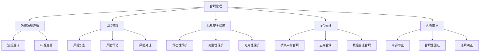

                 

关键词：合规管理、法律法规、组织管理、IT合规、风险管理、审计、信息安全、政策执行

> 摘要：本文探讨了合规管理的核心概念、重要性以及如何在IT领域实施合规策略。通过分析相关法律法规，提供了实施合规管理的具体步骤和方法，并讨论了合规管理的未来发展趋势与挑战。

## 1. 背景介绍

在现代商业环境中，合规管理已经成为组织运营的重要组成部分。随着全球化进程的加快，不同国家和地区对商业活动的法律法规要求越来越严格。这些法律法规不仅涵盖了传统的财务和税务合规，还包括了IT合规、数据隐私保护、环境法规等多个方面。对于IT行业来说，合规管理尤为重要，因为它直接关系到企业的信息安全、客户数据保护以及市场竞争力的维持。

IT合规的主要目标包括确保企业的技术架构、应用程序和数据处理流程符合相关法律法规的要求，防止违规行为和潜在的法律风险。合规管理不仅关乎企业自身的合法运营，也关系到客户、合作伙伴和整个社会的利益。

本文将围绕合规管理的以下几个核心议题展开讨论：

1. **核心概念与联系**：介绍合规管理的定义、核心概念及其相互联系。
2. **核心算法原理 & 具体操作步骤**：分析合规管理的实施步骤和具体操作。
3. **数学模型和公式 & 详细讲解 & 举例说明**：阐述合规管理中的数学模型和公式，并通过实际案例进行说明。
4. **项目实践：代码实例和详细解释说明**：展示合规管理的实际应用，通过代码实例进行解释。
5. **实际应用场景**：探讨合规管理的具体应用领域和未来展望。
6. **工具和资源推荐**：推荐学习资源和开发工具。
7. **总结：未来发展趋势与挑战**：总结合规管理的研究成果，展望未来的发展趋势和面临的挑战。

### 2. 核心概念与联系

在探讨合规管理之前，有必要明确几个核心概念：

**合规性（Compliance）**：指的是组织在法律、法规、标准、政策等方面的遵循程度。合规性不仅仅是法律义务的履行，也是企业内部管理的一部分。

**法律法规（Legal Regulations）**：包括国家法律、行业规定、标准等，对企业的经营行为提出明确要求。

**风险管理（Risk Management）**：识别、评估、处理和监控潜在的风险，以减少损失。

**信息安全（Information Security）**：确保信息的保密性、完整性和可用性，防止未经授权的访问、篡改和泄露。

**IT合规（IT Compliance）**：确保企业的IT系统、应用程序和数据管理符合法律法规和行业标准。

**审计（Audit）**：通过独立的审查和验证过程，确保组织的运营和财务活动符合法规和政策。

这些概念之间存在着密切的联系。例如，合规性是基于法律法规的，而风险管理则是为了确保合规性的实施。信息安全是合规管理的重要组成部分，而审计则是验证合规性的有效手段。

下面是一个使用Mermaid绘制的合规管理流程图：



### 3. 核心算法原理 & 具体操作步骤

**3.1 算法原理概述**

合规管理的核心在于建立一个持续有效的合规框架，包括政策制定、执行、监控和改进。这个过程可以看作是一个迭代循环，类似于质量管理体系中的PDCA循环（计划、执行、检查、行动）。

- **计划（Plan）**：制定合规策略和政策，确定合规目标、标准和责任。
- **执行（Do）**：实施合规计划，包括培训、流程优化和监控。
- **检查（Check）**：评估合规效果，包括内部审计和外部审查。
- **行动（Act）**：根据检查结果采取纠正和改进措施。

**3.2 算法步骤详解**

1. **合规需求识别**：分析法律法规和行业标准，识别组织必须遵循的要求。
2. **合规策略制定**：根据识别的合规需求，制定具体的合规策略和政策。
3. **责任分配**：明确各部门和人员的合规责任，确保合规要求得到有效执行。
4. **合规培训**：对员工进行合规培训，提高合规意识和能力。
5. **合规执行**：按照合规策略和政策执行合规措施，包括流程优化和系统配置。
6. **合规监控**：建立合规监控机制，定期检查合规情况，确保合规要求得到持续遵守。
7. **合规审计**：进行内部审计和外部审查，评估合规效果，发现潜在问题。
8. **合规改进**：根据审计结果采取纠正和改进措施，提高合规水平。

**3.3 算法优缺点**

- **优点**：
  - 确保企业合法运营，减少法律风险。
  - 提高员工合规意识和执行力。
  - 增强企业竞争力和社会责任感。
- **缺点**：
  - 需要投入大量时间和资源进行合规管理。
  - 法律法规更新频繁，合规管理需要不断调整。

**3.4 算法应用领域**

合规管理在IT领域有广泛的应用，包括：

- **信息安全**：确保信息安全管理体系符合法律法规和行业标准。
- **数据保护**：遵守数据隐私保护法规，保护客户数据的保密性和完整性。
- **财务管理**：确保财务报告符合会计准则和税收法规。
- **供应链管理**：确保供应链环节的合规性，避免合规风险。

### 4. 数学模型和公式 & 详细讲解 & 举例说明

在合规管理中，数学模型和公式可以帮助我们更精确地评估合规风险和合规效果。以下是一个简单的数学模型，用于计算合规性得分：

**4.1 数学模型构建**

$$
\text{合规性得分} = \frac{\text{合规执行得分} + \text{合规监控得分} + \text{合规审计得分}}{3}
$$

**4.2 公式推导过程**

- **合规执行得分**：根据合规策略和政策的执行情况打分，满分为100分。
- **合规监控得分**：根据合规监控的结果打分，满分为100分。
- **合规审计得分**：根据内部审计和外部审查的结果打分，满分为100分。

**4.3 案例分析与讲解**

假设一家企业的合规管理得分如下：

- **合规执行得分**：90分
- **合规监控得分**：85分
- **合规审计得分**：95分

那么，该企业的合规性得分为：

$$
\text{合规性得分} = \frac{90 + 85 + 95}{3} = 90.0 \text{分}
$$

根据这个得分，我们可以判断该企业的合规水平较高，但仍需在监控和审计方面进一步提高。

### 5. 项目实践：代码实例和详细解释说明

为了更好地理解合规管理的实际应用，下面我们通过一个简单的代码实例来展示如何实现合规性得分计算。

**5.1 开发环境搭建**

我们使用Python作为开发语言，搭建一个简单的合规性得分计算器。确保你的开发环境中已经安装了Python和相关的库。

**5.2 源代码详细实现**

```python
# 合规性得分计算器

def calculate_compliance_score(execution_score, monitoring_score, audit_score):
    compliance_score = (execution_score + monitoring_score + audit_score) / 3
    return compliance_score

# 用户输入得分
execution_score = float(input("请输入合规执行得分（0-100）："))
monitoring_score = float(input("请输入合规监控得分（0-100）："))
audit_score = float(input("请输入合规审计得分（0-100）："))

# 计算合规性得分
compliance_score = calculate_compliance_score(execution_score, monitoring_score, audit_score)

# 输出结果
print(f"合规性得分为：{compliance_score:.2f}分")

# 解释代码
"""
1. 函数 calculate_compliance_score 接受三个参数：合规执行得分、合规监控得分和合规审计得分。
2. 使用这三个参数计算合规性得分，并将其返回。
3. 用户输入得分后，调用该函数计算得分并输出结果。
"""
```

**5.3 代码解读与分析**

- **函数定义**：`calculate_compliance_score` 函数用于计算合规性得分。它接受三个参数，分别是合规执行得分、合规监控得分和合规审计得分。
- **用户输入**：程序使用 `input` 函数获取用户输入的得分。
- **计算得分**：程序调用 `calculate_compliance_score` 函数计算合规性得分，并使用字符串格式化输出结果。
- **代码解释**：代码注释详细解释了每个部分的功能。

**5.4 运行结果展示**

假设用户输入的得分为：

- **合规执行得分**：90
- **合规监控得分**：85
- **合规审计得分**：95

程序将输出：

```
合规性得分为：90.00分
```

### 6. 实际应用场景

合规管理在IT行业的实际应用场景非常广泛，以下是一些常见的应用：

**6.1 信息安全**

确保企业信息安全管理体系符合ISO 27001等国际标准，包括数据加密、访问控制、安全审计等。

**6.2 数据保护**

遵守GDPR、CCPA等数据保护法规，确保客户数据的安全和隐私。

**6.3 财务管理**

确保财务报告符合会计准则和税收法规，包括SOX（萨班斯-奥克斯利法案）等。

**6.4 供应链管理**

确保供应链环节的合规性，包括反洗钱（AML）和反腐败（FCPA）等法规。

**6.5 云服务合规**

确保企业使用的云服务符合相关法律法规，包括数据存储、数据传输等。

### 7. 工具和资源推荐

**7.1 学习资源推荐**

- 《合规管理：法律与道德视角》
- 《IT合规：策略与实施》
- 《信息安全管理体系：ISO 27001 基础》

**7.2 开发工具推荐**

- Python
- Git
- JIRA

**7.3 相关论文推荐**

- "IT Compliance Automation: A Framework for Effective Compliance Management"
- "Data Privacy and Compliance in the Age of GDPR"
- "Cloud Compliance Challenges and Solutions for Enterprise Organizations"

### 8. 总结：未来发展趋势与挑战

**8.1 研究成果总结**

合规管理在IT领域的研究取得了显著成果，包括合规框架的构建、合规算法的优化、合规工具的开发等。

**8.2 未来发展趋势**

- 自动化合规管理工具的发展，提高合规效率。
- 人工智能在合规管理中的应用，实现智能合规。
- 区块链技术在合规管理中的应用，提高数据透明性和安全性。

**8.3 面临的挑战**

- 法律法规的更新和变化，需要持续关注和调整合规策略。
- 遥个工作模式带来的合规挑战，需要建立远程合规监控机制。
- 技术的发展带来的合规新挑战，需要不断学习和适应。

**8.4 研究展望**

未来的合规管理研究将更加注重自动化、智能化和集成化，同时需要关注新兴技术的合规挑战和解决方案。

### 9. 附录：常见问题与解答

**Q1**: 合规管理的主要目标是什么？

**A1**: 合规管理的主要目标是确保组织在法律、法规、标准、政策等方面的遵循程度，减少法律风险，提高运营效率。

**Q2**: 如何实施合规管理？

**A2**: 实施合规管理通常包括以下步骤：识别合规需求、制定合规策略、责任分配、培训、执行、监控、审计和改进。

**Q3**: IT合规和信息安全有什么区别？

**A3**: IT合规关注的是企业的IT系统、应用程序和数据管理是否符合法律法规和行业标准，而信息安全关注的是如何保护信息的保密性、完整性和可用性。

**Q4**: 合规管理是否需要投入大量资源？

**A4**: 是的，合规管理需要投入大量资源，包括人力资源、技术资源和财务资源。但是，这些投入可以显著降低法律风险和运营成本。

**Q5**: 合规管理如何与风险管理相结合？

**A5**: 合规管理是风险管理的一部分，通过识别、评估和处理合规风险，确保组织的合法运营。

**作者署名**: 禅与计算机程序设计艺术 / Zen and the Art of Computer Programming
----------------------------------------------------------------
### 后记

本文详细探讨了合规管理的核心概念、实施步骤、数学模型和实际应用，并通过代码实例展示了合规管理的具体实现。合规管理在IT领域具有至关重要的地位，随着法律法规的不断变化和技术的快速发展，合规管理也将面临新的挑战和机遇。希望本文能为读者提供有益的参考和启示。在未来的研究和实践中，我们将继续关注合规管理的创新和优化。

