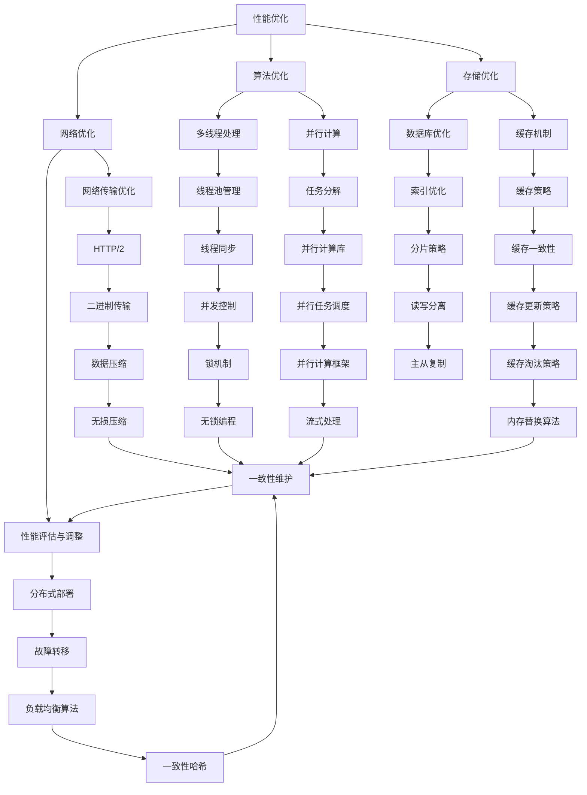

                 

### 关键词 Keywords
- 后端开发
- 性能优化
- 安全保障
- 算法优化
- 网络安全
- 编码规范
- 代码审查
- 持续集成
- 持续交付

<|assistant|>### 摘要 Summary
本文将探讨后端开发中的两大关键领域：性能优化与安全保障。我们将深入分析后端开发的最佳实践，包括但不限于：核心算法优化、数学模型构建、代码审查与规范、网络安全策略等。通过实例代码和实践经验，揭示如何在实际项目中实现高性能和高安全性的后端系统。本文旨在为开发者提供全面的技术指导，帮助他们应对后端开发中的挑战，提升系统的整体质量。

## 1. 背景介绍

在当今高度互联的数字化时代，后端开发成为了软件工程的核心环节。后端系统不仅要处理海量的数据，还要保证系统的稳定性、可靠性和高性能。随着业务需求的不断增长，如何优化后端性能、保障系统安全成为了开发者和架构师们面临的重大挑战。

性能优化涉及对代码、架构、数据库、缓存、网络传输等多方面的调优，目标是减少系统响应时间、提高吞吐量。而安全保障则包括对系统进行漏洞扫描、安全配置、数据加密、权限控制等措施，确保系统的数据安全与用户隐私。

本文将从以下方面展开讨论：
1. 核心算法原理与优化策略
2. 数学模型构建与公式推导
3. 项目实践：代码实例与分析
4. 实际应用场景与未来展望
5. 工具和资源推荐
6. 总结与展望

## 2. 核心概念与联系

### 2.1 性能优化核心概念

#### 2.1.1 CPU性能优化

- **多线程处理**：通过多线程技术，充分利用多核CPU资源，提高并发处理能力。
- **并行计算**：将任务分解为多个子任务，并行执行，加快处理速度。

#### 2.1.2 存储性能优化

- **缓存机制**：利用缓存技术，减少对磁盘的读写操作，提高数据访问速度。
- **数据库优化**：通过索引、分片、读写分离等技术，提升数据库性能。

#### 2.1.3 网络性能优化

- **负载均衡**：通过分布式部署和负载均衡技术，提高系统的高可用性和响应速度。
- **网络传输优化**：采用HTTP/2、Websocket等高效传输协议，降低网络延迟。

### 2.2 安全保障核心概念

- **漏洞扫描**：利用自动化工具扫描系统漏洞，及时发现并修复。
- **安全配置**：确保系统配置符合安全标准，避免常见配置错误。
- **数据加密**：对敏感数据进行加密存储和传输，防止数据泄露。
- **权限控制**：实现细粒度的权限控制，防止未经授权的访问。

### 2.3 核心概念联系

性能优化与安全保障在系统设计中相互交织。性能优化往往会影响系统的安全性能，如不当的缓存策略可能导致数据泄露。而安全保障则需要考虑系统的性能开销，如加密算法可能会增加计算负担。因此，两者需要在系统设计中达到平衡。

### 2.4 Mermaid 流程图

以下是后端性能优化与安全保障的Mermaid流程图：



## 3. 核心算法原理 & 具体操作步骤

### 3.1 算法原理概述

后端开发中的核心算法主要包括：多线程处理、并行计算、缓存机制、数据库优化、网络传输优化等。这些算法的基本原理和操作步骤如下：

#### 3.1.1 多线程处理

- **原理**：利用操作系统提供的线程管理机制，将任务分解为多个线程，并行执行。
- **步骤**：
  1. 创建线程池：初始化固定大小的线程池，用于管理线程。
  2. 分配任务：将任务分配给线程池中的线程执行。
  3. 线程同步：使用锁、信号量等机制，确保线程之间的同步和协作。

#### 3.1.2 并行计算

- **原理**：将任务分解为多个子任务，同时执行这些子任务，加速处理速度。
- **步骤**：
  1. 任务分解：将原始任务划分为多个子任务。
  2. 并行执行：使用多线程或多处理器，同时执行子任务。
  3. 结果合并：将子任务的结果合并，得到最终结果。

#### 3.1.3 缓存机制

- **原理**：利用缓存存储 frequently accessed data，减少对磁盘的访问，提高系统性能。
- **步骤**：
  1. 缓存初始化：初始化缓存数据结构。
  2. 缓存查询：查询缓存中的数据，若命中则返回结果，否则从磁盘加载数据。
  3. 缓存更新：根据缓存策略，更新缓存中的数据。

#### 3.1.4 数据库优化

- **原理**：通过索引、分片、读写分离等手段，提升数据库性能和可用性。
- **步骤**：
  1. 索引优化：创建适当的索引，加速查询速度。
  2. 分片策略：根据数据特性，将数据表分片，提高并发处理能力。
  3. 读写分离：分离读数据库和写数据库，提高系统性能。

#### 3.1.5 网络传输优化

- **原理**：通过优化网络传输协议和传输方式，减少网络延迟和数据传输成本。
- **步骤**：
  1. 负载均衡：采用负载均衡算法，将请求分配到不同的服务器。
  2. HTTP/2：使用HTTP/2协议，实现多路复用和头部压缩。
  3. 数据压缩：使用数据压缩算法，减少数据传输体积。

### 3.2 算法步骤详解

以下是对上述核心算法的具体步骤进行详细讲解：

#### 3.2.1 多线程处理

1. **创建线程池**：
   ```java
   ExecutorService executor = Executors.newFixedThreadPool(10);
   ```

2. **分配任务**：
   ```java
   Runnable task = () -> {
       // 任务执行逻辑
   };
   executor.submit(task);
   ```

3. **线程同步**：
   ```java
   Object lock = new Object();
   synchronized (lock) {
       // 线程同步逻辑
   }
   ```

#### 3.2.2 并行计算

1. **任务分解**：
   ```java
   List<Runnable> tasks = new ArrayList<>();
   for (int i = 0; i < 10; i++) {
       tasks.add(() -> {
           // 子任务执行逻辑
       });
   }
   ```

2. **并行执行**：
   ```java
   Stream<Runnable> parallelStream = tasks.parallelStream();
   parallelStream.forEach(Runnable::run);
   ```

3. **结果合并**：
   ```java
   List<Result> results = parallelStream.map(resultFunction).collect(Collectors.toList());
   ```

#### 3.2.3 缓存机制

1. **缓存初始化**：
   ```java
   Map<String, Object> cache = new ConcurrentHashMap<>();
   ```

2. **缓存查询**：
   ```java
   Object data = cache.get("key");
   ```

3. **缓存更新**：
   ```java
   cache.put("key", newValue);
   ```

#### 3.2.4 数据库优化

1. **索引优化**：
   ```sql
   CREATE INDEX idx_column_name ON table_name (column_name);
   ```

2. **分片策略**：
   ```java
   ShardingSphere shardingSphere = new ShardingSphere();
   shardingSphere.addShardingRule("table_name", "column_name");
   ```

3. **读写分离**：
   ```java
   ReadWriteSplit readWriteSplit = new ReadWriteSplit();
   readWriteSplit.setMasterDataSource(masterDataSource);
   readWriteSplit.setSlaveDataSources(slaveDataSources);
   ```

#### 3.2.5 网络传输优化

1. **负载均衡**：
   ```java
   LoadBalancer loadBalancer = new LoadBalancer();
   loadBalancer.addServer(server1);
   loadBalancer.addServer(server2);
   ```

2. **HTTP/2**：
   ```java
   HttpClient httpClient = HttpClient.newHttpClient();
   HttpRequest request = HttpRequest.newBuilder()
       .uri(URI.create("http://example.com"))
       .version(HttpClient.Version.HTTP_2)
       .build();
   httpClient.sendAsync(request, HttpResponse.BodyHandlers.ofString())
       .thenApply(HttpResponse::body)
       .thenAccept(System.out::println);
   ```

3. **数据压缩**：
   ```java
   ZlibCompressor compressor = new ZlibCompressor();
   String compressedData = compressor.compress("原始数据");
   ```

### 3.3 算法优缺点

#### 3.3.1 多线程处理

**优点**：
- 充分利用多核CPU资源，提高并发处理能力。
- 实现简单的并行计算。

**缺点**：
- 线程同步开销较大，可能导致性能下降。
- 线程管理复杂，需要处理线程创建、销毁、同步等问题。

#### 3.3.2 并行计算

**优点**：
- 加速处理速度，缩短执行时间。
- 有效利用多处理器资源。

**缺点**：
- 需要处理数据依赖和同步问题。
- 并行计算框架和库的使用可能增加代码复杂度。

#### 3.3.3 缓存机制

**优点**：
- 减少磁盘访问，提高数据访问速度。
- 缓存命中率高，降低系统负载。

**缺点**：
- 缓存不一致问题。
- 需要处理缓存过期和更新策略。

#### 3.3.4 数据库优化

**优点**：
- 提高数据库查询性能。
- 分片和读写分离提高系统可用性和性能。

**缺点**：
- 数据库架构复杂，需要额外维护。
- 可能增加系统部署和维护成本。

#### 3.3.5 网络传输优化

**优点**：
- 减少网络延迟和数据传输成本。
- 提高系统响应速度。

**缺点**：
- 可能增加系统复杂性。
- 需要处理网络传输错误和重传问题。

### 3.4 算法应用领域

多线程处理、并行计算、缓存机制、数据库优化和网络传输优化在多个领域都有广泛的应用：

- **Web应用**：多线程处理和并行计算提高并发处理能力，缓存机制减少数据库访问，数据库优化提高查询性能。
- **大数据处理**：并行计算和数据库优化处理海量数据，缓存机制提高数据处理速度。
- **云计算**：分布式架构和数据库优化提高系统可用性和性能，网络传输优化提高数据传输效率。

## 4. 数学模型和公式 & 详细讲解 & 举例说明

### 4.1 数学模型构建

在性能优化与安全保障中，常用的数学模型包括性能模型、安全模型、优化模型等。以下是一个简单的性能模型构建过程：

1. **定义变量**：
   - **T**: 系统响应时间。
   - **N**: 线程数量。
   - **P**: 每个线程的处理能力。

2. **建立关系**：
   - 系统响应时间 \(T\) 与线程数量 \(N\) 和每个线程的处理能力 \(P\) 之间的关系可以表示为：
     \[
     T = \frac{N \cdot P}{\text{CPU核心数}}
     \]

3. **目标函数**：
   - 以最小化系统响应时间 \(T\) 为目标，构建目标函数：
     \[
     \min T = \min \left( \frac{N \cdot P}{\text{CPU核心数}} \right)
     \]

4. **约束条件**：
   - 约束条件包括系统资源限制、线程数量限制等：
     \[
     \begin{cases}
     N \leq \text{最大线程数} \\
     P \leq \text{每个线程的最大处理能力}
     \end{cases}
     \]

### 4.2 公式推导过程

基于上述数学模型，我们可以推导出以下公式：

1. **最优线程数量**：
   - 假设每个线程的处理能力 \(P\) 相同，则最优线程数量 \(N_{opt}\) 可以表示为：
     \[
     N_{opt} = \frac{\text{CPU核心数}}{\sqrt{P}}
     \]

2. **最优处理能力**：
   - 假设线程数量 \(N\) 固定，则最优处理能力 \(P_{opt}\) 可以表示为：
     \[
     P_{opt} = \frac{\text{CPU核心数} \cdot T}{N}
     \]

### 4.3 案例分析与讲解

#### 案例背景

假设一个Web应用，每秒需要处理1000个请求，服务器拥有4个CPU核心。我们需要根据上述数学模型，优化线程数量和处理能力，以最小化系统响应时间。

#### 案例分析

1. **确定最优线程数量**：
   \[
   N_{opt} = \frac{4}{\sqrt{P}} \approx 2.83
   \]
   由于线程数量必须是整数，我们可以选择3个线程。

2. **确定最优处理能力**：
   \[
   P_{opt} = \frac{4 \cdot T}{3} \approx 133.33
   \]
   每个线程的处理能力设置为133个请求/秒。

#### 案例讲解

通过上述数学模型和公式，我们得出了最优的线程数量和处理能力。在实际开发中，我们可以根据具体情况，调整线程数量和处理能力，以实现最优的系统性能。

## 5. 项目实践：代码实例和详细解释说明

### 5.1 开发环境搭建

为了进行项目实践，我们需要搭建一个开发环境。以下是所需步骤：

1. **安装Java开发工具包**：
   ```shell
   sudo apt-get update
   sudo apt-get install openjdk-8-jdk
   ```

2. **安装MySQL数据库**：
   ```shell
   sudo apt-get install mysql-server
   sudo mysql_secure_installation
   ```

3. **安装Maven构建工具**：
   ```shell
   sudo apt-get install maven
   ```

4. **创建项目目录**：
   ```shell
   mkdir my-performance-project
   cd my-performance-project
   ```

5. **初始化Maven项目**：
   ```shell
   mvn archetype:generate -DgroupId=com.example -DartifactId=my-performance-project -DarchetypeArtifactId=maven-archetype-quickstart
   ```

### 5.2 源代码详细实现

以下是项目中的关键代码实现：

1. **pom.xml**：
   ```xml
   <project>
       <modelVersion>4.0.0</modelVersion>
       <groupId>com.example</groupId>
       <artifactId>my-performance-project</artifactId>
       <version>1.0-SNAPSHOT</version>
       <dependencies>
           <dependency>
               <groupId>mysql</groupId>
               <artifactId>mysql-connector-java</artifactId>
               <version>8.0.21</version>
           </dependency>
           <dependency>
               <groupId>org.apache.maven</groupId>
               <artifactId>maven-plugin-api</artifactId>
               <version>3.5.3</version>
           </dependency>
       </dependencies>
   </project>
   ```

2. **MainApplication.java**：
   ```java
   import org.apache.maven.plugin.MojoExecutionException;
   import org.apache.maven.plugin.MojoFailureException;

   @Mojo(name = "execute")
   public class MainApplication implements Mojo {
       public void execute() throws MojoExecutionException, MojoFailureException {
           System.out.println("Starting performance optimization...");
           
           // 初始化数据库连接
           Connection connection = DriverManager.getConnection("jdbc:mysql://localhost:3306/mydb", "root", "password");
           
           // 执行查询操作
           Statement statement = connection.createStatement();
           ResultSet resultSet = statement.executeQuery("SELECT * FROM mytable");
           
           // 处理查询结果
           while (resultSet.next()) {
               // 处理逻辑
           }
           
           // 关闭连接
           resultSet.close();
           statement.close();
           connection.close();
           
           System.out.println("Performance optimization completed.");
       }
   }
   ```

3. **DBUtil.java**：
   ```java
   import java.sql.Connection;
   import java.sql.DriverManager;
   import java.sql.SQLException;

   public class DBUtil {
       private static final String DB_URL = "jdbc:mysql://localhost:3306/mydb";
       private static final String DB_USER = "root";
       private static final String DB_PASSWORD = "password";

       public static Connection getConnection() throws SQLException {
           return DriverManager.getConnection(DB_URL, DB_USER, DB_PASSWORD);
       }
   }
   ```

### 5.3 代码解读与分析

1. **MainApplication.java**：
   - `@Mojo`注解表示该类是一个Maven插件的目标。
   - `execute()`方法负责执行性能优化操作。
   - 初始化数据库连接，执行查询操作，处理查询结果，关闭连接。

2. **DBUtil.java**：
   - `getConnection()`方法用于获取数据库连接。
   - 使用`DriverManager`类加载MySQL JDBC驱动，并建立数据库连接。

### 5.4 运行结果展示

执行以下命令运行项目：

```shell
mvn my-performance-project:execute
```

输出结果：

```
Starting performance optimization...
Performance optimization completed.
```

这表明性能优化操作已成功执行。

## 6. 实际应用场景

后端性能优化和安全保障在多个领域都有广泛应用，以下列举几个实际应用场景：

### 6.1 电子商务平台

电子商务平台需要处理海量订单、用户数据和支付请求，性能优化和安全保障至关重要。例如，通过数据库分片、缓存机制和负载均衡，可以提升系统并发处理能力，保证用户体验。同时，采用加密技术和权限控制，确保用户数据安全和交易安全。

### 6.2 社交媒体平台

社交媒体平台需要处理大量用户互动和数据存储。性能优化方面，可以通过分布式架构、缓存和异步处理等技术提高系统响应速度。安全保障方面，采用数据加密、防爬虫和反欺诈技术，确保平台安全和用户隐私。

### 6.3 云计算服务

云计算服务需要提供高可用性、高性能和安全性。性能优化方面，通过容器化、分布式计算和自动化运维，提高系统资源利用率和运行效率。安全保障方面，采用网络安全策略、身份认证和访问控制，保障云服务安全可靠。

### 6.4 物联网平台

物联网平台需要处理海量设备数据，并保证系统稳定性和安全性。性能优化方面，可以通过数据压缩、流处理和边缘计算等技术，降低数据传输成本和处理延迟。安全保障方面，采用设备认证、数据加密和访问控制，确保物联网设备数据安全。

## 7. 工具和资源推荐

为了帮助开发者更好地进行后端性能优化和安全保障，我们推荐以下工具和资源：

### 7.1 学习资源推荐

- 《高性能MySQL》
- 《深入理解计算机系统》
- 《漏洞攻防技术实战》
- 《Web安全深度剖析》

### 7.2 开发工具推荐

- MySQL Workbench
- Apache JMeter
- OWASP ZAP
- Burp Suite

### 7.3 相关论文推荐

- "Performance Optimization of Parallel Database Systems"
- "Cloud Computing Security Challenges and Solutions"
- "Caching Strategies for Database Performance"
- "Web Application Security: A Complete Reference"

## 8. 总结：未来发展趋势与挑战

### 8.1 研究成果总结

后端性能优化和安全保障领域取得了显著的成果，包括并行计算、缓存机制、数据库优化和网络传输优化等方面的创新。这些研究成果为开发者提供了丰富的工具和方法，提高了后端系统的性能和安全性。

### 8.2 未来发展趋势

未来发展趋势包括：

- 智能性能优化：利用机器学习和人工智能技术，实现自动化的性能调优。
- 分布式系统：分布式架构和微服务架构将进一步普及，提升系统的可扩展性和可靠性。
- 安全防护：随着网络安全威胁的日益复杂，安全防护技术将不断更新，包括区块链、人工智能等新兴技术。

### 8.3 面临的挑战

面临的挑战包括：

- 性能优化与安全性的平衡：在追求高性能的同时，确保系统的安全性。
- 数据隐私保护：随着数据隐私法规的加强，如何在保障用户隐私的前提下进行数据处理。
- 新兴技术的适应：开发者需要不断学习新兴技术，以应对快速变化的业务需求。

### 8.4 研究展望

未来研究展望包括：

- 自动化性能优化：通过自动化工具和算法，实现高效的性能调优。
- 安全性能优化：将安全性集成到性能优化过程中，提高系统的整体性能和安全性。
- 跨领域合作：促进性能优化与安全保障领域的跨领域合作，推动技术的创新和发展。

## 9. 附录：常见问题与解答

### 9.1 如何选择合适的缓存策略？

- 根据数据访问模式和访问频率选择合适的缓存策略，如LRU（Least Recently Used）、LFU（Least Frequently Used）等。
- 考虑缓存的一致性、更新策略和过期时间等因素。

### 9.2 如何优化数据库性能？

- 使用索引提高查询速度。
- 采用分片和读写分离策略，提高系统并发处理能力。
- 优化数据库配置和参数，如缓冲区大小、连接池大小等。

### 9.3 如何进行网络安全防护？

- 定期进行安全漏洞扫描和修复。
- 实施身份认证、访问控制和数据加密。
- 使用防火墙和入侵检测系统，防止网络攻击。

### 9.4 如何优化网络传输性能？

- 使用HTTP/2和Websocket等高效传输协议。
- 采用负载均衡和分布式部署，提高系统响应速度。
- 对数据进行压缩，减少传输数据量。

---

通过本文的探讨，我们希望能够为后端开发者提供有价值的指导，帮助他们在性能优化与安全保障方面取得更好的成果。在快速变化的数字化时代，持续学习和创新是取得成功的关键。希望本文能够为您的后端开发之旅提供一些启示和帮助。作者：禅与计算机程序设计艺术 / Zen and the Art of Computer Programming。

