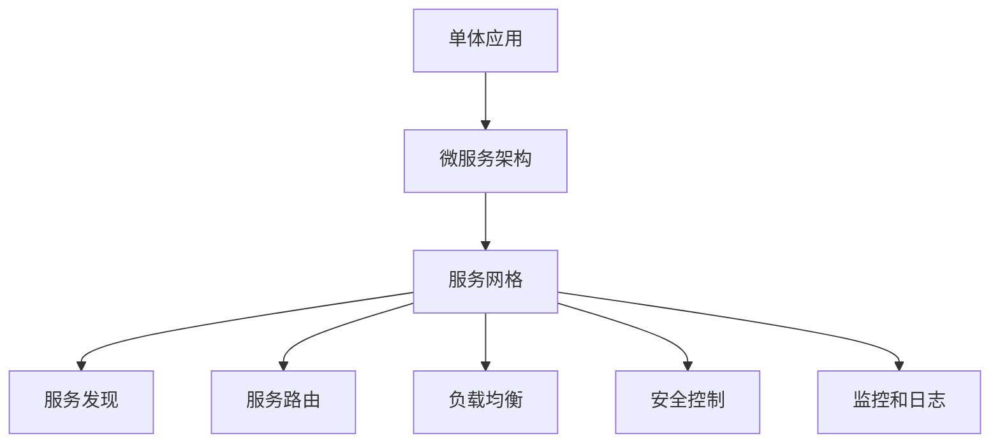

                 

关键词：后端架构、单体应用、服务网格、微服务、容器化、持续集成、持续交付

> 摘要：本文深入探讨了后端架构的演进过程，从传统的单体应用模式，到现代的微服务架构，以及服务网格（Service Mesh）的概念和技术。通过对这些技术概念和实现方式的详细分析，为读者提供了关于后端架构设计的新视角和实用指南。

## 1. 背景介绍

在软件开发的历史长河中，后端架构的设计经历了多次变革。传统的单体应用（Monolithic Application）是早期软件开发的主流模式。单体应用将所有的业务逻辑、数据库访问、前端交互等功能集成为一个单一的可执行程序。这种架构简单易懂，开发和维护相对容易。然而，随着互联网的快速发展，单体应用逐渐暴露出其局限性。

首先，单体应用的扩展性差。由于所有的功能都紧密耦合在一起，当系统需要增加新功能或进行性能优化时，需要对整个系统进行重构。其次，单体应用的部署和运维复杂。由于所有的功能模块都在同一个进程中运行，部署需要将整个系统打包，一旦出现问题，难以定位故障源。最后，单体应用在团队协作方面也存在挑战。由于代码库庞大，不同团队之间的协作效率低下。

为了解决这些问题，软件开发社区提出了微服务架构（Microservices Architecture）。微服务将应用程序拆分成一组小型、独立的服务，每个服务都专注于实现一个特定的业务功能。这些服务之间通过轻量级的通信协议（如HTTP/REST、gRPC）进行交互。微服务架构提供了一种更加灵活和可扩展的解决方案，可以更好地应对现代软件系统中的各种挑战。

然而，随着微服务架构的普及，服务管理和通信方面的问题也逐渐凸显出来。为了解决这些问题，服务网格（Service Mesh）的概念和技术应运而生。服务网格提供了一种全新的服务管理方式，使得服务之间的通信更加高效、安全且可靠。

## 2. 核心概念与联系

### 2.1. 单体应用与微服务

**单体应用**：将所有功能耦合在一起的单个可执行程序。

**微服务**：将应用程序拆分成一组小型、独立的服务，每个服务实现一个特定的业务功能。

### 2.2. 微服务架构的特点

**独立性**：每个服务独立开发、部署和扩展。

**解耦**：服务之间通过轻量级通信协议进行交互，降低耦合度。

**自治**：每个服务拥有自己的数据存储，可以独立进行数据管理和维护。

**分布式**：服务可以在不同的服务器上运行，提高系统的可用性和可扩展性。

### 2.3. 服务网格的概念

**服务网格**：一种基础设施层的技术，用于管理和通信微服务。

**主要功能**：
- **服务发现**：自动发现和注册服务，实现服务之间的透明通信。
- **服务路由**：根据路由策略，将请求路由到合适的服务实例。
- **负载均衡**：根据负载情况，将请求分配到不同的服务实例。
- **安全控制**：提供身份验证和访问控制机制，确保服务之间的安全通信。
- **监控和日志**：收集服务运行时的监控数据和日志信息，提供故障排查和性能优化支持。

### 2.4. 服务网格与微服务架构的联系

**服务网格**是**微服务架构**的一部分，用于解决服务管理和通信方面的问题。服务网格提供了**服务发现**、**服务路由**、**负载均衡**、**安全控制**和**监控和日志**等功能，使得微服务架构更加稳定、可靠和高效。

### 2.5. Mermaid 流程图



## 3. 核心算法原理 & 具体操作步骤

### 3.1. 算法原理概述

服务网格的核心算法包括服务发现、服务路由、负载均衡、安全控制和监控和日志等。以下是对这些算法原理的概述：

- **服务发现**：通过服务注册中心（如Consul、Zookeeper、Eureka等），将服务的地址信息进行注册和发现。当服务启动时，会向注册中心注册自己的地址，当服务停止时，会从注册中心注销自己的地址。客户端通过查询注册中心，获取到服务的地址信息，从而与服务进行通信。

- **服务路由**：根据路由策略，将请求路由到合适的服务实例。路由策略包括基于服务名称的路由、基于路径的路由、基于参数的路由等。通过设置路由规则，可以实现请求的精准分发。

- **负载均衡**：根据负载情况，将请求分配到不同的服务实例。常用的负载均衡算法包括轮询、随机、最小连接数、加权轮询等。通过负载均衡，可以避免服务实例的过载，提高系统的整体性能。

- **安全控制**：通过身份验证和访问控制，确保服务之间的安全通信。常见的身份验证机制包括基于令牌（如JWT）、基于密钥（如OAuth2）等。通过访问控制，可以限制服务实例的访问权限，防止未经授权的访问。

- **监控和日志**：收集服务运行时的监控数据和日志信息，提供故障排查和性能优化支持。通过监控和日志，可以实时了解服务的运行状态，及时发现和解决潜在问题。

### 3.2. 算法步骤详解

- **服务发现**：
  1. 服务启动时，向服务注册中心注册自己的地址信息。
  2. 服务运行时，定期向服务注册中心发送心跳信号，保持地址信息的有效性。
  3. 客户端通过查询服务注册中心，获取服务的地址信息。

- **服务路由**：
  1. 客户端发送请求到服务网格。
  2. 服务网格根据路由策略，将请求路由到合适的服务实例。
  3. 请求被转发到目标服务实例。

- **负载均衡**：
  1. 服务网格根据负载均衡算法，将请求分配到不同的服务实例。
  2. 当服务实例达到最大连接数时，请求会被分配到其他可用的服务实例。

- **安全控制**：
  1. 服务网格对请求进行身份验证和访问控制。
  2. 验证通过后，请求被转发到目标服务实例。

- **监控和日志**：
  1. 服务网格收集服务实例的监控数据和日志信息。
  2. 将监控数据和日志信息存储到监控系统和日志系统中。

### 3.3. 算法优缺点

- **服务发现**：
  - 优点：实现简单，服务启动和停止时可以自动注册和注销。
  - 缺点：服务实例的地址信息依赖于服务注册中心，如果服务注册中心出现问题，会导致服务发现失败。

- **服务路由**：
  - 优点：可以根据路由策略实现请求的精准分发。
  - 缺点：路由策略需要手动配置，维护成本较高。

- **负载均衡**：
  - 优点：可以避免服务实例的过载，提高系统的整体性能。
  - 缺点：负载均衡算法需要根据实际情况进行调整，否则可能无法达到预期的效果。

- **安全控制**：
  - 优点：确保服务之间的安全通信。
  - 缺点：身份验证和访问控制机制需要根据具体需求进行配置，否则可能影响服务的性能。

- **监控和日志**：
  - 优点：可以实时了解服务的运行状态，及时发现和解决潜在问题。
  - 缺点：监控和日志数据的存储和处理需要额外的资源，可能会增加系统的复杂度。

### 3.4. 算法应用领域

服务网格主要应用于微服务架构中，可以帮助解决服务管理和通信方面的问题。以下是一些常见的应用领域：

- **分布式系统**：服务网格可以帮助分布式系统中的服务实例进行管理和通信，提高系统的稳定性和可靠性。
- **容器化应用**：服务网格可以与容器化技术（如Docker、Kubernetes）集成，实现容器化应用的自动化部署和管理。
- **云原生应用**：服务网格是云原生应用（如Kubernetes）的重要组成部分，可以提高云原生应用的性能和安全性。
- **微服务架构**：服务网格是微服务架构的一部分，可以提供更加高效、可靠和安全的微服务通信。

## 4. 数学模型和公式 & 详细讲解 & 举例说明

### 4.1. 数学模型构建

在服务网格中，服务发现、服务路由、负载均衡等算法涉及到一些数学模型。以下是一个简单的数学模型构建示例：

- **服务发现模型**：
  假设有N个服务实例，每个服务实例的地址为\(A_i\)（\(i=1,2,...,N\)），服务注册中心为\(R\)。

  服务实例注册：\(A_i \to R\)

  服务实例注销：\(A_i \xleftarrow{\text{Heartbeat}} R\)

  客户端查询：\(R \to A_i\)

- **服务路由模型**：
  假设有M个路由策略，分别为\(P_1, P_2,..., P_M\)。

  路由策略：\(P_j \to S_j\)

  请求路由：\(C \to S_j\)

- **负载均衡模型**：
  假设有N个服务实例，每个服务实例的当前连接数为\(C_i\)（\(i=1,2,...,N\)）。

  负载均衡算法：\(L \to S_i\)

  其中，\(L\) 为负载均衡算法，\(S_i\) 为当前连接数最小的服务实例。

### 4.2. 公式推导过程

- **服务发现公式**：
  服务实例的注册和注销过程可以用概率论中的随机过程模型进行描述。假设服务实例的注册和注销是独立同分布的，每个服务实例的注册概率为\(p_r\)，注销概率为\(p_d\)。

  注册概率：\(P(A_i \to R) = p_r\)

  注销概率：\(P(A_i \xleftarrow{\text{Heartbeat}} R) = p_d\)

  服务实例的注册和注销过程可以用马尔可夫链模型进行描述，状态转移矩阵为\(P\)：

  \[
  P = \begin{bmatrix}
  p_r & p_d \\
  1 - p_r & 1 - p_d
  \end{bmatrix}
  \]

  服务实例的稳定状态概率可以用矩阵幂进行求解：

  \[
  P^n \to \begin{bmatrix}
  p_r^n & p_d^n \\
  1 - p_r^n & 1 - p_d^n
  \end{bmatrix}
  \]

  当\(n \to \infty\)时，服务实例的稳定状态概率为：

  \[
  \pi = \lim_{n \to \infty} P^n \to \begin{bmatrix}
  \frac{p_r}{p_r + p_d} & \frac{p_d}{p_r + p_d} \\
  \frac{1 - p_r}{p_r + p_d} & \frac{1 - p_d}{p_r + p_d}
  \end{bmatrix}
  \]

- **服务路由公式**：
  假设每个路由策略的权重为\(w_j\)（\(j=1,2,...,M\)），请求的路由概率为\(P_j\)。

  路由概率：\(P_j = \frac{w_j}{\sum_{j=1}^{M} w_j}\)

  请求的路由过程可以用概率分布模型进行描述。

- **负载均衡公式**：
  假设每个服务实例的当前连接数为\(C_i\)（\(i=1,2,...,N\)），负载均衡算法的选择概率为\(P_i\)。

  选择概率：\(P_i = \frac{C_j}{\sum_{j=1}^{N} C_j}\)

  请求的负载均衡过程可以用概率分布模型进行描述。

### 4.3. 案例分析与讲解

假设有3个服务实例，分别为\(A_1, A_2, A_3\)，当前连接数分别为10、20和30。根据负载均衡算法，请求会被分配到当前连接数最小的服务实例。具体步骤如下：

1. 计算每个服务实例的当前连接数占总连接数的比例：
   \[
   C_1 = 10, C_2 = 20, C_3 = 30 \\
   \sum_{i=1}^{3} C_i = 10 + 20 + 30 = 60 \\
   P_1 = \frac{C_1}{\sum_{i=1}^{3} C_i} = \frac{10}{60} = \frac{1}{6} \\
   P_2 = \frac{C_2}{\sum_{i=1}^{3} C_i} = \frac{20}{60} = \frac{1}{3} \\
   P_3 = \frac{C_3}{\sum_{i=1}^{3} C_i} = \frac{30}{60} = \frac{1}{2}
   \]

2. 根据负载均衡算法，选择当前连接数最小的服务实例：
   \[
   \min(C_1, C_2, C_3) = C_1 \\
   P_1 = \frac{1}{6} \\
   \]

3. 将请求分配到服务实例\(A_1\)：

   \[
   C_1' = C_1 + 1 = 11 \\
   \]

通过上述过程，可以实现请求的负载均衡分配。

## 5. 项目实践：代码实例和详细解释说明

### 5.1. 开发环境搭建

1. 安装Kubernetes集群：
   - 使用Minikube在本地搭建Kubernetes集群。
   - 使用Docker Desktop在本地搭建Kubernetes集群。

2. 安装Istio服务网格：
   - 从Istio官网下载Istio安装包。
   - 使用Kubernetes命令安装Istio。

3. 准备示例服务：
   - 准备一个简单的微服务应用，用于演示服务发现、服务路由、负载均衡等功能。

### 5.2. 源代码详细实现

以下是示例服务的源代码实现：

```go
package main

import (
    "encoding/json"
    "log"
    "net/http"
    "time"
)

type Response struct {
    Message string `json:"message"`
}

func handleRequest(w http.ResponseWriter, r *http.Request) {
    response := Response{Message: "Hello, World!"}
    jsonResponse, err := json.Marshal(response)
    if err != nil {
        http.Error(w, err.Error(), http.StatusInternalServerError)
        return
    }
    w.Header().Set("Content-Type", "application/json")
    w.Write(jsonResponse)
}

func main() {
    http.HandleFunc("/", handleRequest)
    server := &http.Server{
        Addr:    ":8080",
        Handler: nil,
    }
    log.Fatal(server.ListenAndServe())
}
```

### 5.3. 代码解读与分析

1. 代码结构：
   - 代码中定义了一个`Response`结构体，用于存储响应数据。
   - `handleRequest`函数处理HTTP请求，返回响应数据。
   - `main`函数启动HTTP服务。

2. 功能实现：
   - 服务启动时，会监听8080端口，接收HTTP请求。
   - 当接收到请求时，会调用`handleRequest`函数处理请求，返回固定的响应数据。

### 5.4. 运行结果展示

1. 启动服务：
   - 使用以下命令启动服务：

   ```
   go run main.go
   ```

2. 验证服务：
   - 在浏览器中访问`http://localhost:8080`，查看响应结果。

   ```json
   {
     "message": "Hello, World!"
   }
   ```

3. 验证服务网格功能：
   - 启动Istio代理，将服务注册到Istio服务网格中。
   - 使用Kubernetes命令查看服务状态。

   ```shell
   istioctl proxy-config cluster <service_name>
   ```

   - 查看服务实例的地址信息，验证服务发现功能。

## 6. 实际应用场景

服务网格在分布式系统、容器化应用、云原生应用等场景中有着广泛的应用。以下是一些实际应用场景：

1. **分布式系统**：
   - 服务网格可以帮助分布式系统中的服务实例进行管理和通信，提高系统的稳定性和可靠性。

2. **容器化应用**：
   - 服务网格可以与容器化技术（如Docker、Kubernetes）集成，实现容器化应用的自动化部署和管理。

3. **云原生应用**：
   - 服务网格是云原生应用（如Kubernetes）的重要组成部分，可以提高云原生应用的性能和安全性。

4. **微服务架构**：
   - 服务网格是微服务架构的一部分，可以提供更加高效、可靠和安全的微服务通信。

## 7. 工具和资源推荐

1. **学习资源推荐**：
   - 《微服务设计》
   - 《服务网格技术与应用》
   - 《Kubernetes实战》

2. **开发工具推荐**：
   - Docker
   - Kubernetes
   - Istio

3. **相关论文推荐**：
   - "Service Mesh: A Modern Approach to Service Architecture"
   - "Istio: A Platform for Managing a Service Mesh"
   - "Kubernetes Service Mesh: An Overview"

## 8. 总结：未来发展趋势与挑战

### 8.1. 研究成果总结

1. **服务网格**：服务网格在分布式系统、容器化应用、云原生应用等场景中具有广泛的应用前景，为微服务架构提供了高效、可靠和安全的通信解决方案。

2. **微服务架构**：微服务架构已经成为现代软件系统设计的主流模式，通过将应用程序拆分成小型、独立的服务，提高了系统的可扩展性和可维护性。

3. **容器化技术**：容器化技术（如Docker、Kubernetes）为微服务架构的部署和运维提供了便利，使得应用程序可以快速部署和横向扩展。

### 8.2. 未来发展趋势

1. **服务网格的普及**：随着微服务架构的普及，服务网格将成为分布式系统的重要组成部分，提供更加高效、可靠和安全的通信解决方案。

2. **智能化服务网格**：未来的服务网格将具备自我优化、自我修复、自我安全等功能，提高系统的智能化水平。

3. **跨云服务网格**：随着云计算的普及，跨云服务网格将成为一个重要的研究方向，实现不同云环境之间的服务通信和管理。

### 8.3. 面临的挑战

1. **性能优化**：服务网格的引入可能会带来一定的性能开销，如何优化服务网格的性能，减少对系统性能的影响，是一个重要的研究课题。

2. **安全性**：服务网格的安全性问题不容忽视，如何确保服务之间的安全通信，防止攻击和数据泄露，是未来的研究重点。

3. **运维复杂性**：服务网格的运维复杂性较高，如何简化运维流程，提高运维效率，是未来需要解决的问题。

### 8.4. 研究展望

1. **智能化服务网格**：未来的研究可以集中在智能化服务网格方面，通过引入机器学习和人工智能技术，实现服务网格的自我优化和自我修复。

2. **跨云服务网格**：未来的研究可以探索跨云服务网格的实现方案，实现不同云环境之间的无缝连接和管理。

3. **分布式系统优化**：未来的研究可以关注分布式系统的优化，提高系统的性能和可扩展性，为分布式系统提供更加高效、可靠的通信解决方案。

## 9. 附录：常见问题与解答

### 9.1. 什么是服务网格？

服务网格是一种基础设施层的技术，用于管理和通信微服务。它提供了一系列服务发现、服务路由、负载均衡、安全控制和监控和日志等功能，使得微服务架构更加稳定、可靠和高效。

### 9.2. 服务网格与微服务架构的关系是什么？

服务网格是微服务架构的一部分，用于解决服务管理和通信方面的问题。服务网格提供了一种全新的服务管理方式，使得微服务之间的通信更加高效、安全且可靠。

### 9.3. 服务网格的主要功能有哪些？

服务网格的主要功能包括服务发现、服务路由、负载均衡、安全控制和监控和日志等。通过这些功能，服务网格可以提高微服务架构的性能、稳定性和安全性。

### 9.4. 服务网格与Kubernetes的关系是什么？

服务网格可以与Kubernetes集成，为Kubernetes中的微服务提供高效、可靠和安全的通信解决方案。服务网格可以帮助Kubernetes实现服务管理、服务路由和监控等功能。

### 9.5. 服务网格与Docker的关系是什么？

服务网格可以与Docker集成，为Docker容器化应用提供高效、可靠和安全的通信解决方案。服务网格可以帮助Docker实现服务管理、服务路由和监控等功能。

### 9.6. 服务网格与Service Mesh的关系是什么？

服务网格（Service Mesh）是一种基础设施层的技术，用于管理和通信微服务。Service Mesh是一种更加通用的术语，用于描述服务网格的概念和技术。

### 9.7. 服务网格与Eureka的关系是什么？

Eureka是Netflix开源的服务注册中心，用于实现服务发现功能。服务网格可以与Eureka集成，实现服务实例的注册和发现。

### 9.8. 服务网格与Consul的关系是什么？

Consul是HashiCorp开源的服务注册中心和分布式协调系统，用于实现服务发现、服务路由、健康检查等功能。服务网格可以与Consul集成，实现服务管理、服务路由和监控等功能。

### 9.9. 服务网格与Zookeeper的关系是什么？

Zookeeper是Apache开源的分布式协调系统，用于实现服务注册、服务发现、配置管理等功能。服务网格可以与Zookeeper集成，实现服务管理、服务路由和监控等功能。

### 9.10. 服务网格与gRPC的关系是什么？

gRPC是Google开源的高性能远程过程调用（RPC）框架，用于实现服务之间的通信。服务网格可以与gRPC集成，提供更加高效、可靠和安全的通信解决方案。

## 作者署名

作者：禅与计算机程序设计艺术 / Zen and the Art of Computer Programming

----------------------------------------------------------------

