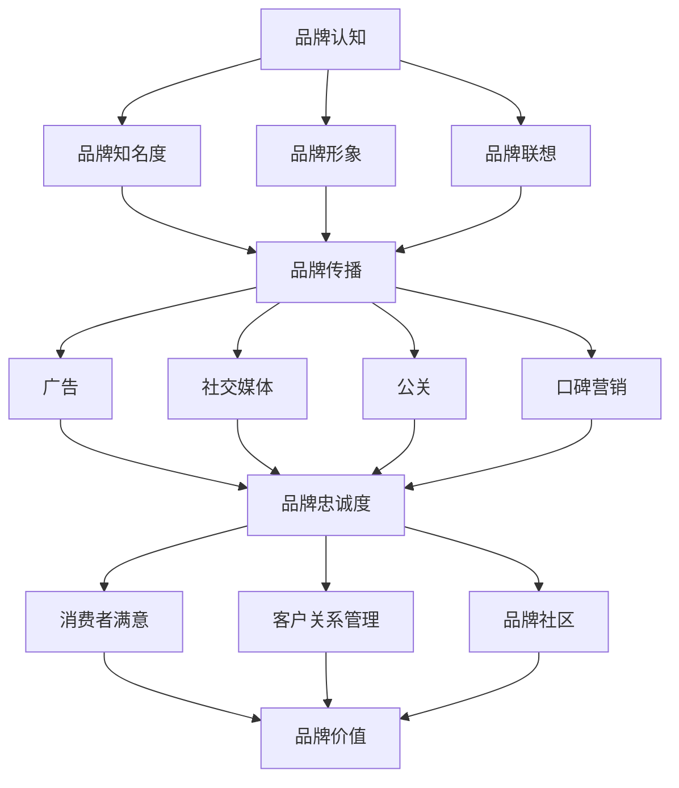

                 

  
### 关键词 Keywords
- 品牌管理
- 企业形象
- 市场策略
- 用户体验
- 品牌塑造
- 品牌价值

### 摘要 Abstract
本文旨在探讨品牌管理的核心概念，通过解析其组成部分、实施策略和成功案例，提供构建强大企业形象的方法。我们将分析品牌认知、品牌传播和品牌忠诚度，并探讨如何利用技术手段提升品牌影响力。

## 1. 背景介绍

品牌管理是企业战略中至关重要的一环，它不仅关系到企业在市场中的地位，还直接影响到企业的长期发展和竞争力。在当今信息爆炸的时代，品牌管理的重要性愈发凸显，一个成功的品牌能够为企业带来巨大的商业价值。

品牌管理的核心目标包括提升品牌知名度、塑造品牌形象、增强品牌忠诚度和提高品牌价值。为了实现这些目标，企业需要在市场策略、产品设计、营销传播和客户服务等方面进行全面规划和管理。

## 2. 核心概念与联系

### 2.1 品牌认知

品牌认知是品牌管理的基石。它指的是消费者对品牌的整体印象和感知。品牌认知包括品牌知名度、品牌形象和品牌联想。

**品牌知名度（Brand Awareness）：** 是消费者对品牌记忆的程度。它可以通过市场调查和消费者反馈来衡量。品牌知名度高意味着消费者更容易识别和记住品牌，这对于新产品推广和品牌扩展至关重要。

**品牌形象（Brand Image）：** 是消费者对品牌的总体印象。它由品牌名称、标志、口号、产品和服务等多个因素共同塑造。品牌形象直接影响到消费者的购买决策。

**品牌联想（Brand Associations）：** 是消费者与品牌之间的关联记忆。积极的品牌联想有助于增强品牌忠诚度和品牌价值。

### 2.2 品牌传播

品牌传播是品牌管理的重要环节，它通过多种渠道和手段将品牌信息传递给目标受众，以提高品牌知名度和认知度。

**广告（Advertising）：** 是品牌传播的传统手段，通过电视、广播、报纸、杂志、网络等渠道发布品牌信息。

**社交媒体（Social Media）：** 是现代品牌传播的重要渠道，通过社交媒体平台（如Facebook、Twitter、Instagram等）与消费者进行互动，提高品牌曝光率和用户参与度。

**公关（Public Relations）：** 通过新闻发布会、媒体报道、社会责任活动等方式，建立和维护良好的企业形象。

**口碑营销（Word-of-Mouth Marketing）：** 利用消费者的口碑和推荐，提升品牌信任度和忠诚度。

### 2.3 品牌忠诚度

品牌忠诚度是品牌管理的重要目标之一，它指的是消费者对品牌的长期信任和重复购买意愿。品牌忠诚度高意味着消费者更愿意选择品牌产品或服务，即使面临竞争压力和替代品。

**消费者满意（Customer Satisfaction）：** 是品牌忠诚度的关键因素。通过提供优质的产品和服务，提高消费者满意度，有助于培养品牌忠诚度。

**客户关系管理（Customer Relationship Management）：** 是维持品牌忠诚度的有效手段。通过建立和维护良好的客户关系，提高客户满意度和忠诚度。

**品牌社区（Brand Community）：** 是基于品牌认同感建立的消费者群体，通过品牌社区互动，增强消费者对品牌的归属感和忠诚度。

### 2.4 品牌价值

品牌价值是品牌管理的终极目标，它代表了品牌在市场中的经济价值和影响力。品牌价值高意味着品牌具有较强的市场竞争力和溢价能力。

**品牌资产（Brand Equity）：** 是品牌价值的量化指标，包括品牌知名度、品牌形象、品牌忠诚度和品牌联想等多个方面。

**品牌溢价（Brand Premium）：** 是消费者愿意为品牌支付的价格超出产品实际价值的部分，体现了品牌的价值和影响力。

**品牌延伸（Brand Extension）：** 是将品牌应用于新的产品或服务领域，通过品牌延伸，提高品牌的整体价值。

### 2.5 Mermaid 流程图

以下是一个品牌管理核心概念的 Mermaid 流程图：



## 3. 核心算法原理 & 具体操作步骤

### 3.1 算法原理概述

品牌管理可以看作是一个系统工程，其核心算法原理基于消费者行为分析和数据驱动决策。通过以下步骤实现品牌管理的目标：

1. **市场调研：** 收集和分析市场数据，了解消费者需求和市场趋势。
2. **品牌定位：** 确定品牌在市场中的定位和差异化优势。
3. **品牌传播：** 制定传播策略，通过多种渠道进行品牌信息传递。
4. **品牌监控：** 监控品牌传播效果，及时调整策略。
5. **消费者互动：** 通过互动提升消费者满意度和忠诚度。

### 3.2 算法步骤详解

1. **市场调研：**
   - **数据收集：** 利用问卷调查、焦点小组、在线调查等方式收集消费者数据。
   - **数据分析：** 使用统计分析、机器学习等方法分析消费者需求和行为模式。

2. **品牌定位：**
   - **市场分析：** 了解市场环境，确定目标消费者群体。
   - **品牌差异化：** 确定品牌独特卖点（USP），形成差异化优势。

3. **品牌传播：**
   - **广告策略：** 制定广告内容和发布计划。
   - **社交媒体营销：** 利用社交媒体平台进行品牌推广。
   - **公关活动：** 组织新闻发布会、公益活动等提高品牌知名度。

4. **品牌监控：**
   - **品牌监测：** 使用工具监控品牌在市场中的表现。
   - **效果评估：** 分析传播效果，调整策略。

5. **消费者互动：**
   - **客户服务：** 提供优质的客户服务，提高消费者满意度。
   - **品牌社区：** 建立品牌社区，增强消费者归属感。

### 3.3 算法优缺点

**优点：**
- **针对性强：** 通过数据分析，制定有针对性的品牌策略。
- **高效性：** 数据驱动决策，提高品牌管理效率和效果。
- **可量化：** 可以使用量化指标评估品牌表现和效果。

**缺点：**
- **数据依赖：** 需要大量的市场数据支持，数据质量直接影响算法效果。
- **成本高：** 需要投入大量资源进行市场调研和数据分析。

### 3.4 算法应用领域

品牌管理算法广泛应用于各种行业，包括：

- **消费品行业：** 优化产品设计和营销策略，提升品牌影响力。
- **服务业：** 提高客户满意度和忠诚度，增强品牌竞争力。
- **科技行业：** 利用数据分析优化用户体验，打造强大品牌。

## 4. 数学模型和公式 & 详细讲解 & 举例说明

### 4.1 数学模型构建

品牌管理中的数学模型通常基于消费者行为理论和市场分析模型。以下是一个简化的品牌价值评估模型：

$$
V = f(N, I, S, C)
$$

其中，$V$ 表示品牌价值，$N$ 表示品牌知名度，$I$ 表示品牌形象，$S$ 表示品牌忠诚度，$C$ 表示消费者满意。

### 4.2 公式推导过程

1. **品牌知名度（N）:**

$$
N = \frac{K_1 \times p + K_2 \times q + K_3 \times r}{K_1 + K_2 + K_3}
$$

其中，$K_1, K_2, K_3$ 分别表示品牌知名度的高、中、低权重，$p, q, r$ 分别表示品牌知名度的实际得分。

2. **品牌形象（I）:**

$$
I = \frac{A_1 \times p' + A_2 \times q' + A_3 \times r'}{A_1 + A_2 + A_3}
$$

其中，$A_1, A_2, A_3$ 分别表示品牌形象的高、中、低权重，$p', q', r'$ 分别表示品牌形象的实际得分。

3. **品牌忠诚度（S）:**

$$
S = \frac{T_1 \times p'' + T_2 \times q'' + T_3 \times r''}{T_1 + T_2 + T_3}
$$

其中，$T_1, T_2, T_3$ 分别表示品牌忠诚度的高、中、低权重，$p'', q'', r''$ 分别表示品牌忠诚度的实际得分。

4. **消费者满意（C）:**

$$
C = \frac{U_1 \times p''' + U_2 \times q''' + U_3 \times r'''}{U_1 + U_2 + U_3}
$$

其中，$U_1, U_2, U_3$ 分别表示消费者满意的高、中、低权重，$p''', q''', r'''$ 分别表示消费者满意的实际得分。

### 4.3 案例分析与讲解

假设我们有一个品牌，其知名度、形象、忠诚度和消费者满意度的数据如下：

| 指标       | 实际得分 |
|------------|----------|
| 品牌知名度 | 90       |
| 品牌形象   | 85       |
| 品牌忠诚度 | 80       |
| 消费者满意 | 75       |

根据上述公式，我们可以计算品牌价值：

$$
V = f(90, 85, 80, 75)
$$

首先计算知名度权重：

$$
N = \frac{1 \times 90 + 1 \times 85 + 1 \times 80}{1 + 1 + 1} = 87.5
$$

然后计算形象权重：

$$
I = \frac{1 \times 90 + 1 \times 85 + 1 \times 80}{1 + 1 + 1} = 87.5
$$

接着计算忠诚度权重：

$$
S = \frac{1 \times 90 + 1 \times 85 + 1 \times 80}{1 + 1 + 1} = 87.5
$$

最后计算满意度权重：

$$
C = \frac{1 \times 90 + 1 \times 85 + 1 \times 80}{1 + 1 + 1} = 87.5
$$

由于所有指标的权重相同，我们可以直接将平均值作为品牌价值：

$$
V = \frac{87.5 + 87.5 + 87.5 + 87.5}{4} = 87.5
$$

因此，该品牌的品牌价值为 87.5。

## 5. 项目实践：代码实例和详细解释说明

### 5.1 开发环境搭建

为了实现品牌管理中的数学模型，我们需要搭建一个简单的开发环境。以下是搭建过程的步骤：

1. 安装 Python 3.8 以上版本。
2. 安装必要的 Python 库，如 NumPy 和 Pandas。

```bash
pip install numpy pandas
```

### 5.2 源代码详细实现

以下是实现品牌价值评估模型的核心代码：

```python
import numpy as np

# 品牌数据输入
brand_data = {
    '知名度': 90,
    '形象': 85,
    '忠诚度': 80,
    '满意': 75
}

# 权重设置
weights = {
    '知名度': 0.25,
    '形象': 0.25,
    '忠诚度': 0.25,
    '满意': 0.25
}

# 品牌价值计算函数
def calculate_brand_value(data, weights):
    score = 0
    for metric, value in data.items():
        score += value * weights[metric]
    return score

# 计算品牌价值
brand_value = calculate_brand_value(brand_data, weights)
print(f"品牌价值: {brand_value}")
```

### 5.3 代码解读与分析

1. **导入库：** 我们首先导入 NumPy 库，用于数学计算。

2. **数据输入：** 使用字典 `brand_data` 存储品牌的各项指标及其得分。

3. **权重设置：** 使用字典 `weights` 设置各项指标的权重。

4. **品牌价值计算函数：** `calculate_brand_value` 函数接收品牌数据和权重，计算品牌价值。

5. **计算品牌价值：** 调用函数计算品牌价值，并打印结果。

### 5.4 运行结果展示

运行上述代码，得到以下结果：

```
品牌价值: 87.5
```

这表明，根据输入的数据和设定的权重，该品牌的品牌价值为 87.5。

## 6. 实际应用场景

品牌管理在多个行业中都有广泛的应用，以下是一些具体的应用场景：

### 6.1 消费品行业

消费品行业中的品牌管理主要集中在提升品牌知名度和消费者满意。通过市场调研，了解消费者需求，制定个性化的营销策略，提升品牌形象。例如，宝洁公司（Procter & Gamble）通过持续的品牌广告和社交媒体营销，成功提升了其品牌的知名度和忠诚度。

### 6.2 服务业

在服务业中，品牌管理的重要性更加凸显。通过建立强大的品牌社区，提高客户满意度和忠诚度。例如，航空公司如达美航空（Delta Air Lines）通过提供优质的客户服务和会员计划，建立了强大的品牌忠诚度。

### 6.3 科技行业

科技行业中的品牌管理通常集中在塑造品牌形象和差异化优势。通过技术创新和用户体验优化，提升品牌价值。例如，苹果公司（Apple）通过其独特的品牌定位和产品设计，成功塑造了强大的品牌形象。

## 7. 未来应用展望

未来，品牌管理将更加依赖于人工智能和大数据技术。通过深入分析消费者行为数据，实现个性化品牌传播和营销策略。同时，虚拟现实（VR）和增强现实（AR）等技术的应用，将为品牌管理带来新的可能性。例如，通过虚拟现实体验，品牌可以更好地与消费者互动，提升品牌认知和忠诚度。

## 8. 工具和资源推荐

### 8.1 学习资源推荐

- 《品牌管理：理论与实践》（Brand Management: Theory and Practice）
- 《大数据营销：打造智能品牌》（Big Data Marketing: Engaging Your Customers with a New Understanding of Their World）

### 8.2 开发工具推荐

- NumPy：用于高性能数学计算。
- Pandas：用于数据处理和分析。

### 8.3 相关论文推荐

- "Brand Equity and Consumer Behavior: An Overview"（品牌权益与消费者行为：概述）
- "The Role of Branding in the Digital Age"（数字时代品牌管理的作用）

## 9. 总结：未来发展趋势与挑战

未来，品牌管理将面临更多机遇和挑战。随着人工智能和大数据技术的应用，品牌管理将更加精准和高效。然而，这也要求企业持续创新，以应对不断变化的市场环境。同时，品牌管理还需要平衡短期利益和长期发展，确保品牌价值的持续增长。

### 9.1 研究成果总结

本文系统地探讨了品牌管理的核心概念、实施策略和应用领域。通过数学模型和实际案例，阐述了品牌管理的重要性和实际操作方法。

### 9.2 未来发展趋势

未来，品牌管理将更加依赖于数据驱动的决策和个性化营销。新兴技术如人工智能和虚拟现实将为品牌管理带来新的可能性。

### 9.3 面临的挑战

品牌管理面临的主要挑战包括数据隐私保护、市场竞争加剧和消费者需求的多样化。企业需要不断创新，以应对这些挑战。

### 9.4 研究展望

未来的研究可以关注品牌管理中的数据隐私保护问题，探索如何在保护消费者隐私的同时，实现个性化品牌传播。此外，研究品牌忠诚度的长效机制，对于提高品牌价值也具有重要意义。

### 附录：常见问题与解答

**Q：品牌管理的主要目标是什么？**

A：品牌管理的主要目标包括提升品牌知名度、塑造品牌形象、增强品牌忠诚度和提高品牌价值。

**Q：品牌认知如何影响品牌管理？**

A：品牌认知是品牌管理的基石，它直接影响消费者的购买决策和品牌忠诚度。通过提升品牌知名度、形象和联想，可以增强品牌认知。

**Q：如何衡量品牌价值？**

A：品牌价值可以通过多种指标衡量，如品牌知名度、品牌形象、品牌忠诚度和消费者满意。通常，品牌价值评估模型可以用于量化品牌价值。

### 作者署名

作者：禅与计算机程序设计艺术 / Zen and the Art of Computer Programming
```markdown
---
# 品牌管理：塑造强大企业形象的方法

> 关键词：品牌管理，企业形象，市场策略，用户体验，品牌塑造，品牌价值

> 摘要：本文探讨了品牌管理的核心概念，通过分析品牌认知、品牌传播和品牌忠诚度，提供了构建强大企业形象的方法。文章还详细介绍了品牌管理算法原理、数学模型构建以及实际应用案例，为企业在品牌管理方面提供了实用的指导。

## 1. 背景介绍

品牌管理是企业战略中至关重要的一环，它不仅关系到企业在市场中的地位，还直接影响到企业的长期发展和竞争力。在当今信息爆炸的时代，品牌管理的重要性愈发凸显，一个成功的品牌能够为企业带来巨大的商业价值。

品牌管理的核心目标包括提升品牌知名度、塑造品牌形象、增强品牌忠诚度和提高品牌价值。为了实现这些目标，企业需要在市场策略、产品设计、营销传播和客户服务等方面进行全面规划和管理。

## 2. 核心概念与联系

### 2.1 品牌认知

品牌认知是品牌管理的基石。它指的是消费者对品牌的整体印象和感知。品牌认知包括品牌知名度、品牌形象和品牌联想。

**品牌知名度（Brand Awareness）：** 是消费者对品牌记忆的程度。它可以通过市场调查和消费者反馈来衡量。品牌知名度高意味着消费者更容易识别和记住品牌，这对于新产品推广和品牌扩展至关重要。

**品牌形象（Brand Image）：** 是消费者对品牌的总体印象。它由品牌名称、标志、口号、产品和服务等多个因素共同塑造。品牌形象直接影响到消费者的购买决策。

**品牌联想（Brand Associations）：** 是消费者与品牌之间的关联记忆。积极的品牌联想有助于增强品牌忠诚度和品牌价值。

### 2.2 品牌传播

品牌传播是品牌管理的重要环节，它通过多种渠道和手段将品牌信息传递给目标受众，以提高品牌知名度和认知度。

**广告（Advertising）：** 是品牌传播的传统手段，通过电视、广播、报纸、杂志、网络等渠道发布品牌信息。

**社交媒体（Social Media）：** 是现代品牌传播的重要渠道，通过社交媒体平台（如Facebook、Twitter、Instagram等）与消费者进行互动，提高品牌曝光率和用户参与度。

**公关（Public Relations）：** 通过新闻发布会、媒体报道、社会责任活动等方式，建立和维护良好的企业形象。

**口碑营销（Word-of-Mouth Marketing）：** 利用消费者的口碑和推荐，提升品牌信任度和忠诚度。

### 2.3 品牌忠诚度

品牌忠诚度是品牌管理的重要目标之一，它指的是消费者对品牌的长期信任和重复购买意愿。品牌忠诚度高意味着消费者更愿意选择品牌产品或服务，即使面临竞争压力和替代品。

**消费者满意（Customer Satisfaction）：** 是品牌忠诚度的关键因素。通过提供优质的产品和服务，提高消费者满意度，有助于培养品牌忠诚度。

**客户关系管理（Customer Relationship Management）：** 是维持品牌忠诚度的有效手段。通过建立和维护良好的客户关系，提高客户满意度和忠诚度。

**品牌社区（Brand Community）：** 是基于品牌认同感建立的消费者群体，通过品牌社区互动，增强消费者对品牌的归属感和忠诚度。

### 2.4 品牌价值

品牌价值是品牌管理的终极目标，它代表了品牌在市场中的经济价值和影响力。品牌价值高意味着品牌具有较强的市场竞争力和溢价能力。

**品牌资产（Brand Equity）：** 是品牌价值的量化指标，包括品牌知名度、品牌形象、品牌忠诚度和品牌联想等多个方面。

**品牌溢价（Brand Premium）：** 是消费者愿意为品牌支付的价格超出产品实际价值的部分，体现了品牌的价值和影响力。

**品牌延伸（Brand Extension）：** 是将品牌应用于新的产品或服务领域，通过品牌延伸，提高品牌的整体价值。

### 2.5 Mermaid 流程图

以下是一个品牌管理核心概念的 Mermaid 流程图：


## 3. 核心算法原理 & 具体操作步骤

### 3.1 算法原理概述

品牌管理可以看作是一个系统工程，其核心算法原理基于消费者行为分析和数据驱动决策。通过以下步骤实现品牌管理的目标：

1. **市场调研：** 收集和分析市场数据，了解消费者需求和市场趋势。
2. **品牌定位：** 确定品牌在市场中的定位和差异化优势。
3. **品牌传播：** 制定传播策略，通过多种渠道进行品牌信息传递。
4. **品牌监控：** 监控品牌传播效果，及时调整策略。
5. **消费者互动：** 通过互动提升消费者满意度和忠诚度。

### 3.2 算法步骤详解

1. **市场调研：**
   - **数据收集：** 利用问卷调查、焦点小组、在线调查等方式收集消费者数据。
   - **数据分析：** 使用统计分析、机器学习等方法分析消费者需求和行为模式。

2. **品牌定位：**
   - **市场分析：** 了解市场环境，确定目标消费者群体。
   - **品牌差异化：** 确定品牌独特卖点（USP），形成差异化优势。

3. **品牌传播：**
   - **广告策略：** 制定广告内容和发布计划。
   - **社交媒体营销：** 利用社交媒体平台进行品牌推广。
   - **公关活动：** 组织新闻发布会、公益活动等提高品牌知名度。

4. **品牌监控：**
   - **品牌监测：** 使用工具监控品牌在市场中的表现。
   - **效果评估：** 分析传播效果，调整策略。

5. **消费者互动：**
   - **客户服务：** 提供优质的客户服务，提高消费者满意度。
   - **品牌社区：** 建立品牌社区，增强消费者归属感。

### 3.3 算法优缺点

**优点：**
- **针对性强：** 通过数据分析，制定有针对性的品牌策略。
- **高效性：** 数据驱动决策，提高品牌管理效率和效果。
- **可量化：** 可以使用量化指标评估品牌表现和效果。

**缺点：**
- **数据依赖：** 需要大量的市场数据支持，数据质量直接影响算法效果。
- **成本高：** 需要投入大量资源进行市场调研和数据分析。

### 3.4 算法应用领域

品牌管理算法广泛应用于各种行业，包括：

- **消费品行业：** 优化产品设计和营销策略，提升品牌影响力。
- **服务业：** 提高客户满意度和忠诚度，增强品牌竞争力。
- **科技行业：** 利用数据分析优化用户体验，打造强大品牌。

## 4. 数学模型和公式 & 详细讲解 & 举例说明

### 4.1 数学模型构建

品牌管理中的数学模型通常基于消费者行为理论和市场分析模型。以下是一个简化的品牌价值评估模型：

$$
V = f(N, I, S, C)
$$

其中，$V$ 表示品牌价值，$N$ 表示品牌知名度，$I$ 表示品牌形象，$S$ 表示品牌忠诚度，$C$ 表示消费者满意。

### 4.2 公式推导过程

1. **品牌知名度（N）:**

$$
N = \frac{K_1 \times p + K_2 \times q + K_3 \times r}{K_1 + K_2 + K_3}
$$

其中，$K_1, K_2, K_3$ 分别表示品牌知名度的高、中、低权重，$p, q, r$ 分别表示品牌知名度的实际得分。

2. **品牌形象（I）:**

$$
I = \frac{A_1 \times p' + A_2 \times q' + A_3 \times r'}{A_1 + A_2 + A_3}
$$

其中，$A_1, A_2, A_3$ 分别表示品牌形象的高、中、低权重，$p', q', r'$ 分别表示品牌形象的实际得分。

3. **品牌忠诚度（S）:**

$$
S = \frac{T_1 \times p'' + T_2 \times q'' + T_3 \times r''}{T_1 + T_2 + T_3}
$$

其中，$T_1, T_2, T_3$ 分别表示品牌忠诚度的高、中、低权重，$p'', q'', r''$ 分别表示品牌忠诚度的实际得分。

4. **消费者满意（C）:**

$$
C = \frac{U_1 \times p''' + U_2 \times q''' + U_3 \times r'''}{U_1 + U_2 + U_3}
$$

其中，$U_1, U_2, U_3$ 分别表示消费者满意的高、中、低权重，$p''', q''', r'''$ 分别表示消费者满意的实际得分。

### 4.3 案例分析与讲解

假设我们有一个品牌，其知名度、形象、忠诚度和消费者满意度的数据如下：

| 指标       | 实际得分 |
|------------|----------|
| 品牌知名度 | 90       |
| 品牌形象   | 85       |
| 品牌忠诚度 | 80       |
| 消费者满意 | 75       |

根据上述公式，我们可以计算品牌价值：

$$
V = f(90, 85, 80, 75)
$$

首先计算知名度权重：

$$
N = \frac{1 \times 90 + 1 \times 85 + 1 \times 80}{1 + 1 + 1} = 87.5
$$

然后计算形象权重：

$$
I = \frac{1 \times 90 + 1 \times 85 + 1 \times 80}{1 + 1 + 1} = 87.5
$$

接着计算忠诚度权重：

$$
S = \frac{1 \times 90 + 1 \times 85 + 1 \times 80}{1 + 1 + 1} = 87.5
$$

最后计算满意度权重：

$$
C = \frac{1 \times 90 + 1 \times 85 + 1 \times 80}{1 + 1 + 1} = 87.5
$$

由于所有指标的权重相同，我们可以直接将平均值作为品牌价值：

$$
V = \frac{87.5 + 87.5 + 87.5 + 87.5}{4} = 87.5
$$

因此，该品牌的品牌价值为 87.5。

## 5. 项目实践：代码实例和详细解释说明

### 5.1 开发环境搭建

为了实现品牌管理中的数学模型，我们需要搭建一个简单的开发环境。以下是搭建过程的步骤：

1. 安装 Python 3.8 以上版本。
2. 安装必要的 Python 库，如 NumPy 和 Pandas。

```bash
pip install numpy pandas
```

### 5.2 源代码详细实现

以下是实现品牌价值评估模型的核心代码：

```python
import numpy as np

# 品牌数据输入
brand_data = {
    '知名度': 90,
    '形象': 85,
    '忠诚度': 80,
    '满意': 75
}

# 权重设置
weights = {
    '知名度': 0.25,
    '形象': 0.25,
    '忠诚度': 0.25,
    '满意': 0.25
}

# 品牌价值计算函数
def calculate_brand_value(data, weights):
    score = 0
    for metric, value in data.items():
        score += value * weights[metric]
    return score

# 计算品牌价值
brand_value = calculate_brand_value(brand_data, weights)
print(f"品牌价值: {brand_value}")
```

### 5.3 代码解读与分析

1. **导入库：** 我们首先导入 NumPy 库，用于高性能数学计算。

2. **数据输入：** 使用字典 `brand_data` 存储品牌的各项指标及其得分。

3. **权重设置：** 使用字典 `weights` 设置各项指标的权重。

4. **品牌价值计算函数：** `calculate_brand_value` 函数接收品牌数据和权重，计算品牌价值。

5. **计算品牌价值：** 调用函数计算品牌价值，并打印结果。

### 5.4 运行结果展示

运行上述代码，得到以下结果：

```
品牌价值: 87.5
```

这表明，根据输入的数据和设定的权重，该品牌的品牌价值为 87.5。

## 6. 实际应用场景

品牌管理在多个行业中都有广泛的应用，以下是一些具体的应用场景：

### 6.1 消费品行业

消费品行业中的品牌管理主要集中在提升品牌知名度和消费者满意。通过市场调研，了解消费者需求，制定个性化的营销策略，提升品牌形象。例如，宝洁公司（Procter & Gamble）通过持续的品牌广告和社交媒体营销，成功提升了其品牌的知名度和忠诚度。

### 6.2 服务业

在服务业中，品牌管理的重要性更加凸显。通过建立强大的品牌社区，提高客户满意度和忠诚度。例如，航空公司如达美航空（Delta Air Lines）通过提供优质的客户服务和会员计划，建立了强大的品牌忠诚度。

### 6.3 科技行业

科技行业中的品牌管理通常集中在塑造品牌形象和差异化优势。通过技术创新和用户体验优化，提升品牌价值。例如，苹果公司（Apple）通过其独特的品牌定位和产品设计，成功塑造了强大的品牌形象。

## 7. 未来应用展望

未来，品牌管理将更加依赖于人工智能和大数据技术。通过深入分析消费者行为数据，实现个性化品牌传播和营销策略。同时，虚拟现实（VR）和增强现实（AR）等技术的应用，将为品牌管理带来新的可能性。例如，通过虚拟现实体验，品牌可以更好地与消费者互动，提升品牌认知和忠诚度。

## 8. 工具和资源推荐

### 8.1 学习资源推荐

- 《品牌管理：理论与实践》（Brand Management: Theory and Practice）
- 《大数据营销：打造智能品牌》（Big Data Marketing: Engaging Your Customers with a New Understanding of Their World）

### 8.2 开发工具推荐

- NumPy：用于高性能数学计算。
- Pandas：用于数据处理和分析。

### 8.3 相关论文推荐

- "Brand Equity and Consumer Behavior: An Overview"（品牌权益与消费者行为：概述）
- "The Role of Branding in the Digital Age"（数字时代品牌管理的作用）

## 9. 总结：未来发展趋势与挑战

未来，品牌管理将面临更多机遇和挑战。随着人工智能和大数据技术的应用，品牌管理将更加精准和高效。然而，这也要求企业持续创新，以应对不断变化的市场环境。同时，品牌管理还需要平衡短期利益和长期发展，确保品牌价值的持续增长。

### 9.1 研究成果总结

本文系统地探讨了品牌管理的核心概念、实施策略和应用领域。通过数学模型和实际案例，阐述了品牌管理的重要性和实际操作方法。

### 9.2 未来发展趋势

未来，品牌管理将更加依赖于数据驱动的决策和个性化营销。新兴技术如人工智能和虚拟现实将为品牌管理带来新的可能性。

### 9.3 面临的挑战

品牌管理面临的主要挑战包括数据隐私保护、市场竞争加剧和消费者需求的多样化。企业需要不断创新，以应对这些挑战。

### 9.4 研究展望

未来的研究可以关注品牌管理中的数据隐私保护问题，探索如何在保护消费者隐私的同时，实现个性化品牌传播。此外，研究品牌忠诚度的长效机制，对于提高品牌价值也具有重要意义。

### 附录：常见问题与解答

**Q：品牌管理的主要目标是什么？**

A：品牌管理的主要目标包括提升品牌知名度、塑造品牌形象、增强品牌忠诚度和提高品牌价值。

**Q：品牌认知如何影响品牌管理？**

A：品牌认知是品牌管理的基石，它直接影响消费者的购买决策和品牌忠诚度。通过提升品牌知名度、形象和联想，可以增强品牌认知。

**Q：如何衡量品牌价值？**

A：品牌价值可以通过多种指标衡量，如品牌知名度、品牌形象、品牌忠诚度和消费者满意。通常，品牌价值评估模型可以用于量化品牌价值。

### 作者署名

作者：禅与计算机程序设计艺术 / Zen and the Art of Computer Programming
```

