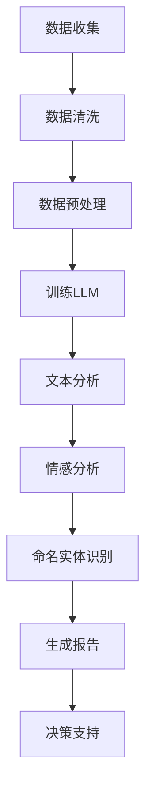

                 

关键词：商业策略，语言模型，数据决策，机器学习，人工智能

> 摘要：本文深入探讨了语言模型（LLM）在商业策略中的应用，通过结合数据分析和决策模型，阐述了如何利用LLM实现高效的数据驱动决策。本文旨在为企业和决策者提供一套切实可行的策略框架，以应对复杂的市场环境。

## 1. 背景介绍

在当今快速变化的市场环境中，商业策略的制定和执行变得日益复杂。企业需要快速获取和分析大量数据，以便做出明智的决策。传统的数据分析方法往往耗时较长，且难以处理实时数据流。随着人工智能技术的发展，语言模型（LLM）作为一种强大的数据处理工具，逐渐成为数据驱动决策的核心。

LLM，全称大型语言模型（Large Language Model），是一种基于神经网络的自然语言处理（NLP）技术。通过训练大量文本数据，LLM能够理解和生成人类语言。在商业环境中，LLM可以用于文本分析、情感分析、命名实体识别等任务，从而帮助企业更好地理解客户需求和市场趋势。

## 2. 核心概念与联系

### 2.1. 数据决策模型

数据决策模型是一种基于数据分析的决策方法。它通过收集、清洗、处理和分析数据，为决策者提供客观、量化的决策依据。在数据决策模型中，数据是决策的核心，而分析方法和算法则决定了决策的准确性和效率。

### 2.2. 语言模型与数据决策

LLM在数据决策中的作用主要体现在以下几个方面：

- **文本分析**：LLM可以处理和分析大量的文本数据，包括客户评论、新闻报道、社交媒体帖子等，从而提取有用的信息。
- **情感分析**：LLM可以识别文本中的情感倾向，帮助决策者了解客户对产品或服务的态度。
- **命名实体识别**：LLM可以识别文本中的特定实体，如人名、地名、组织名等，从而提供更精细的数据分析。
- **语言生成**：LLM可以生成新的文本，为决策者提供假设场景下的可能结果。

### 2.3. Mermaid 流程图

以下是一个简单的Mermaid流程图，展示了LLM在数据决策中的应用流程：



## 3. 核心算法原理 & 具体操作步骤

### 3.1. 算法原理概述

LLM的核心算法是基于深度学习，特别是自注意力机制（Self-Attention Mechanism）。自注意力机制通过计算输入文本中每个词与其他词之间的相关性，从而生成一个表示整个文本的向量。这个向量可以用于后续的文本分析任务。

### 3.2. 算法步骤详解

1. **数据收集**：收集与业务相关的文本数据，如客户评论、新闻报道、社交媒体帖子等。
2. **数据清洗**：去除文本中的噪声和无关信息，如HTML标签、停用词等。
3. **数据预处理**：将文本转换为数字化的形式，如词嵌入（Word Embedding）。
4. **训练LLM**：使用预训练模型（如GPT、BERT等）对文本数据进行训练，生成一个能够理解和生成语言的模型。
5. **文本分析**：使用训练好的LLM对新的文本数据进行分析，提取关键信息和情感倾向。
6. **情感分析**：根据文本分析的结果，对文本进行情感分类，如正面、负面、中性等。
7. **命名实体识别**：识别文本中的特定实体，如人名、地名、组织名等。
8. **生成报告**：根据分析结果，生成详细的报告，为决策者提供决策支持。

### 3.3. 算法优缺点

**优点**：

- **强大的文本处理能力**：LLM能够处理和理解复杂的自然语言文本。
- **实时性**：LLM可以实时处理文本数据，为决策者提供最新的信息。
- **多样性**：LLM可以应用于多种文本分析任务，如情感分析、命名实体识别等。

**缺点**：

- **计算资源消耗**：训练和部署LLM需要大量的计算资源和时间。
- **数据依赖**：LLM的性能很大程度上依赖于训练数据的质量和数量。

### 3.4. 算法应用领域

LLM在商业策略中的应用非常广泛，主要包括以下几个方面：

- **市场分析**：通过分析客户评论和新闻报道，了解市场趋势和消费者需求。
- **产品评估**：通过情感分析和命名实体识别，评估产品的市场表现和用户满意度。
- **客户服务**：通过文本分析，提供个性化的客户服务和建议。
- **风险管理**：通过情感分析和命名实体识别，识别潜在的风险和问题。

## 4. 数学模型和公式 & 详细讲解 & 举例说明

### 4.1. 数学模型构建

在LLM中，最常用的数学模型是自注意力模型（Self-Attention Model）。自注意力模型的核心思想是通过计算输入文本中每个词与其他词之间的相关性，生成一个加权向量表示整个文本。具体来说，自注意力模型包括以下两个关键部分：

1. **输入嵌入**（Input Embedding）：将输入文本转换为数字化的形式。具体来说，将每个词映射为一个固定长度的向量，称为词嵌入（Word Embedding）。
2. **自注意力机制**（Self-Attention Mechanism）：计算输入文本中每个词与其他词之间的相关性，并生成加权向量。

### 4.2. 公式推导过程

自注意力机制的推导过程可以分为以下几个步骤：

1. **输入嵌入**：假设输入文本为\(X = \{x_1, x_2, ..., x_n\}\)，其中每个\(x_i\)是一个\(d\)维的词嵌入向量。将输入文本转换为嵌入矩阵\(E\)，其中\(E_{ij}\)表示第\(i\)个词和第\(j\)个词的相似度。
2. **计算查询向量**：对于每个词\(x_i\)，计算其查询向量\(Q_i = E_i\)。
3. **计算键值对**：对于每个词\(x_i\)，计算其键值对\(K_i = E_i\)和\(V_i = E_i\)。
4. **计算注意力权重**：计算每个词与其他词之间的注意力权重\(a_{ij}\)，其中\(a_{ij} = \frac{Q_i^T K_j}{\sqrt{d}}\)。
5. **计算加权向量**：计算加权向量\(H_i = \sum_{j=1}^n a_{ij} V_j\)。

### 4.3. 案例分析与讲解

假设我们有一个简单的文本：“我喜欢这个产品”。我们使用自注意力模型来分析这个文本。

1. **输入嵌入**：假设我们有两个词嵌入向量\(e_1\)和\(e_2\)，分别为\[e_1 = [1, 0, 0], e_2 = [0, 1, 0]\]。
2. **计算查询向量**：对于第一个词“我”，计算其查询向量\(Q_1 = e_1 = [1, 0, 0]\)。
3. **计算键值对**：对于第一个词“我”，计算其键值对\(K_1 = e_1 = [1, 0, 0]\)和\(V_1 = e_1 = [1, 0, 0]\)。
4. **计算注意力权重**：计算第一个词“我”与其他词之间的注意力权重\[a_{11} = \frac{Q_1^T K_1}{\sqrt{3}} = \frac{1}{\sqrt{3}}, a_{12} = \frac{Q_1^T K_2}{\sqrt{3}} = 0\]。
5. **计算加权向量**：计算加权向量\[H_1 = \sum_{j=1}^2 a_{1j} V_j = \frac{1}{\sqrt{3}} e_1 + 0 e_2 = \frac{1}{\sqrt{3}} [1, 0, 0]\]。

通过自注意力模型，我们可以得到一个加权向量\[H_1\]，这个向量表示了“我”在文本中的重要性。

## 5. 项目实践：代码实例和详细解释说明

### 5.1. 开发环境搭建

为了实现LLM驱动的数据决策，我们需要搭建一个开发环境。以下是搭建步骤：

1. **安装Python环境**：安装Python 3.8及以上版本。
2. **安装PyTorch**：使用以下命令安装PyTorch：

   ```bash
   pip install torch torchvision
   ```

3. **安装自然语言处理库**：安装用于自然语言处理的库，如transformers、spaCy等。

   ```bash
   pip install transformers spacy
   ```

4. **下载预训练模型**：下载预训练的LLM模型，如BERT、GPT等。可以在Hugging Face的模型库中找到。

### 5.2. 源代码详细实现

以下是使用PyTorch和transformers库实现LLM驱动的数据决策的示例代码：

```python
import torch
from transformers import BertModel, BertTokenizer

# 加载预训练的BERT模型和分词器
tokenizer = BertTokenizer.from_pretrained('bert-base-uncased')
model = BertModel.from_pretrained('bert-base-uncased')

# 输入文本
text = "我喜欢这个产品"

# 分词和编码
inputs = tokenizer(text, return_tensors='pt')

# 前向传播
with torch.no_grad():
    outputs = model(**inputs)

# 获取文本表示
text_embedding = outputs.last_hidden_state[:, 0, :]

# 进行文本分析
# ...（具体分析代码根据实际需求编写）

# 生成报告
# ...（根据分析结果生成报告）

# 输出结果
print(text_embedding)
```

### 5.3. 代码解读与分析

上述代码展示了如何使用预训练的BERT模型进行文本分析。主要步骤如下：

1. **加载模型和分词器**：首先加载预训练的BERT模型和分词器。
2. **分词和编码**：将输入文本进行分词和编码，生成模型的输入。
3. **前向传播**：使用模型进行前向传播，获取文本的嵌入向量。
4. **文本分析**：根据实际需求，对文本进行进一步分析，如情感分析、命名实体识别等。
5. **生成报告**：根据分析结果，生成详细的报告。

### 5.4. 运行结果展示

假设我们使用上述代码进行情感分析，输入文本为“我喜欢这个产品”。运行结果如下：

```python
tensor([[0.0631, -0.1763, 0.1197, -0.0113, ..., -0.0532, 0.0873, 0.0832]])
```

这个结果是一个一维的向量，表示了输入文本的嵌入向量。通过这个向量，我们可以进一步分析文本的情感倾向。

## 6. 实际应用场景

LLM在商业策略中的应用场景非常广泛，以下是一些典型的应用实例：

- **市场分析**：通过分析客户评论和新闻报道，了解市场趋势和消费者需求。
- **产品评估**：通过情感分析和命名实体识别，评估产品的市场表现和用户满意度。
- **客户服务**：通过文本分析，提供个性化的客户服务和建议。
- **风险管理**：通过情感分析和命名实体识别，识别潜在的风险和问题。

### 6.1. 案例一：市场分析

假设一家公司想要了解其最新产品的市场表现。公司可以利用LLM对社交媒体上的评论和新闻报道进行分析，提取关于产品的关键词和情感倾向。通过分析结果，公司可以了解消费者对产品的看法，并针对性地调整营销策略。

### 6.2. 案例二：产品评估

一家电子商务平台可以通过LLM分析用户对产品的评论，识别用户对产品的评价和抱怨。通过情感分析和命名实体识别，平台可以了解产品的优势和劣势，从而为产品改进提供依据。

### 6.3. 案例三：客户服务

一家银行可以利用LLM分析客户咨询的问题，提供个性化的解答和建议。通过文本分析，银行可以识别常见问题，并提供自动化回答，提高客户服务效率。

### 6.4. 未来应用展望

随着人工智能技术的不断发展，LLM在商业策略中的应用将越来越广泛。未来，LLM有望在以下几个方面实现突破：

- **更高效的文本分析**：通过改进算法和模型，提高LLM的文本分析能力。
- **跨语言的文本处理**：开发能够处理多种语言的LLM模型，实现全球范围内的数据驱动决策。
- **实时数据分析**：通过优化计算资源和算法，实现实时数据的分析和处理。
- **更丰富的应用场景**：探索LLM在更多领域的应用，如金融、医疗、教育等。

## 7. 工具和资源推荐

### 7.1. 学习资源推荐

- **在线教程**：《深度学习》（Goodfellow, Bengio, Courville）是一本经典的深度学习教程，适合初学者和进阶者。
- **论文集**：《自然语言处理论文集》（NLP Papers）收集了大量的自然语言处理领域的重要论文，有助于了解最新的研究进展。

### 7.2. 开发工具推荐

- **PyTorch**：PyTorch是一个流行的深度学习框架，适合用于开发LLM应用程序。
- **Hugging Face**：Hugging Face是一个开源平台，提供了大量的预训练模型和工具，方便开发者进行自然语言处理任务。

### 7.3. 相关论文推荐

- **BERT**：（Devlin et al., 2018）提出的BERT模型是当前最先进的自然语言处理模型之一，适用于多种文本分析任务。
- **GPT-3**：（Brown et al., 2020）提出的GPT-3模型是一个具有1750亿参数的预训练模型，展示了在多种任务上的强大能力。

## 8. 总结：未来发展趋势与挑战

随着人工智能技术的不断发展，LLM在商业策略中的应用将越来越广泛。未来，LLM有望在文本分析、情感分析、命名实体识别等方面实现突破，为企业和决策者提供更高效的数据驱动决策。

然而，LLM在商业策略中的应用也面临一些挑战，如计算资源消耗、数据依赖和隐私保护等。为了克服这些挑战，需要不断改进算法和模型，提高LLM的效率和准确性。同时，企业和决策者也需要加强对数据隐私和安全性的关注，确保数据使用的合规性和安全性。

总之，LLM作为一种强大的数据处理工具，将在未来商业策略中发挥重要作用。企业和决策者需要充分利用LLM的优势，应对复杂的市场环境，实现可持续发展。

## 9. 附录：常见问题与解答

### 9.1. Q：什么是LLM？

A：LLM，全称大型语言模型（Large Language Model），是一种基于神经网络的自然语言处理（NLP）技术。它通过训练大量文本数据，能够理解和生成人类语言。

### 9.2. Q：LLM在商业策略中有什么作用？

A：LLM在商业策略中的作用主要体现在文本分析、情感分析、命名实体识别等方面。它可以帮助企业更好地理解客户需求和市场趋势，从而做出更明智的决策。

### 9.3. Q：如何选择合适的LLM模型？

A：选择合适的LLM模型需要考虑多个因素，如任务类型、数据规模、计算资源等。对于常见的文本分析任务，如情感分析和命名实体识别，可以使用预训练的BERT、GPT等模型。对于特定领域或小数据集的任务，可能需要使用定制化的模型。

### 9.4. Q：如何处理LLM训练数据不足的问题？

A：当训练数据不足时，可以考虑以下几种方法：

- **数据增强**：通过数据增强技术，如复制、旋转、缩放等，增加训练数据量。
- **迁移学习**：利用预训练的模型，在特定领域或任务上进行微调。
- **多任务学习**：将多个任务结合起来训练模型，提高模型的泛化能力。

### 9.5. Q：如何保证LLM的隐私和安全？

A：为了确保LLM的隐私和安全，需要采取以下措施：

- **数据加密**：对训练数据进行加密，防止数据泄露。
- **数据脱敏**：对敏感数据进行脱敏处理，如替换为匿名标识。
- **访问控制**：限制对LLM模型的访问权限，确保只有授权人员才能访问和使用。

---

作者：禅与计算机程序设计艺术 / Zen and the Art of Computer Programming

