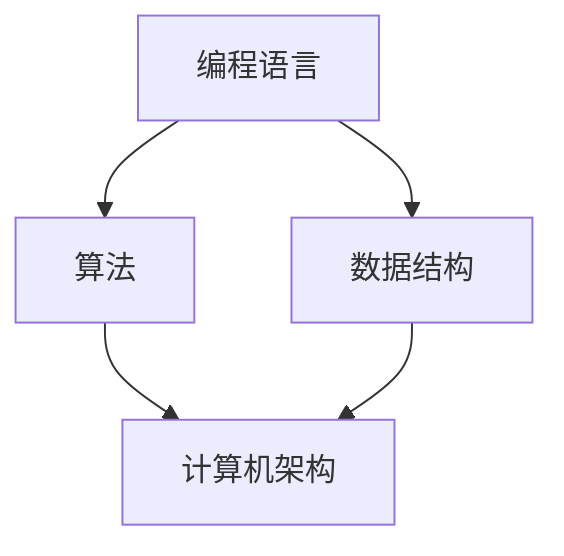

                 

关键词：计算机发展、计算技术、算法、人工智能、编程语言、数学模型、应用场景、未来展望

> 摘要：本文回顾了人类计算的发展历程，从早期的机械计算机到现代的超级计算机，从简单的编程语言到复杂的算法和人工智能技术，探讨了计算技术对人类社会的影响。同时，文章展望了计算技术未来的发展趋势和面临的挑战，为读者提供了对计算领域未来的洞见。

## 1. 背景介绍

人类计算的发展历程可以追溯到几千年前的古代文明。当时，人们使用算盘和计算尺来进行简单的数学计算。然而，随着科技的发展，人类开始寻求更高效、更精确的计算方法。19世纪末期，机械计算机的出现标志着人类计算进入了一个新的阶段。这些机械计算机通过齿轮和杠杆来执行复杂的计算任务，但它们的速度和精度仍然有限。

### 1.1 早期计算工具

早期计算工具主要包括算盘、计算尺和机械计算机。算盘是最早的计算工具之一，它由一系列的珠子组成，通过移动珠子来进行计算。计算尺则是一种简单的计算工具，由一系列的刻度和滑动部分组成，用于计算乘法和除法。机械计算机则是更高级的计算工具，通过齿轮和杠杆来执行复杂的计算任务。

### 1.2 电子计算机的兴起

随着电子技术的发展，20世纪40年代，电子计算机开始出现。与机械计算机相比，电子计算机具有更快的计算速度和更高的精度。第一台电子计算机ENIAC（Electronic Numerical Integrator and Computer）于1945年在美国研制成功。电子计算机的出现标志着人类计算进入了一个新的时代。

### 1.3 计算机的普及

20世纪60年代，计算机开始逐渐普及，并进入了企业、政府和教育机构。随着个人计算机的诞生，计算机开始进入普通家庭，彻底改变了人们的生活方式。计算机的普及使得计算技术得到了广泛应用，从科学计算到商业管理，从教育到娱乐，计算机无处不在。

## 2. 核心概念与联系

为了更好地理解计算机的发展历程，我们需要了解一些核心概念和它们之间的联系。以下是几个重要的概念：

### 2.1 编程语言

编程语言是用于编写计算机程序的语法和语义规则。从最早的机器语言到现代的高级编程语言，编程语言的演变极大地推动了计算机技术的发展。机器语言是由二进制代码组成的，而高级编程语言则使用更易读的符号和结构。

### 2.2 算法

算法是一种解决问题的方法和步骤。在计算机科学中，算法用于解决各种问题，如排序、搜索、图形处理等。算法的效率和正确性是计算机科学中的重要研究方向。

### 2.3 数据结构

数据结构是一种组织数据的方式。常用的数据结构包括数组、链表、栈、队列、树、图等。数据结构的选择和优化对算法的性能和效率有很大影响。

### 2.4 计算机架构

计算机架构是计算机系统的结构和设计。它包括硬件和软件两个方面。硬件架构涉及处理器、内存、输入输出设备等，而软件架构则涉及操作系统、应用程序等。

下面是一个使用Mermaid绘制的流程图，展示了这些核心概念之间的联系：



## 3. 核心算法原理 & 具体操作步骤

在计算机科学中，算法是解决问题的核心。以下是一个常见的排序算法——快速排序（Quick Sort）的原理和具体操作步骤。

### 3.1 算法原理概述

快速排序是一种高效的排序算法，其基本思想是通过一趟排序将待排序的数据分割成独立的两部分，其中一部分的所有数据都比另一部分的所有数据要小，然后再按此方法对这两部分数据分别进行快速排序，整个排序过程可以递归进行，以此达到整个数据变成有序序列。

### 3.2 算法步骤详解

1. 选择一个基准元素（通常选择第一个或最后一个元素）。
2. 将数组中的所有元素与基准元素进行比较，并重新排列数组，使得基准元素左侧的所有元素都比它小，基准元素右侧的所有元素都比它大。
3. 递归地对基准元素左侧和右侧的数组进行快速排序。

### 3.3 算法优缺点

**优点：**
- 快速排序的时间复杂度平均为O(nlogn)，最坏情况下为O(n^2)，但在实际应用中，它通常比其他排序算法更快。
- 快速排序是一种原地排序算法，不需要额外的存储空间。

**缺点：**
- 快速排序的最坏情况时间复杂度较高。
- 快速排序的不稳定性可能导致某些情况下排序结果不准确。

### 3.4 算法应用领域

快速排序广泛应用于各种场景，如排序大型数据集、数据库索引构建、排序算法的教学等。

## 4. 数学模型和公式 & 详细讲解 & 举例说明

在计算机科学中，数学模型和公式是理解和解决问题的重要工具。以下是一个常见的数学模型——线性回归（Linear Regression）的构建、推导和案例分析。

### 4.1 数学模型构建

线性回归模型假设两个变量之间存在线性关系，其数学模型可以表示为：

$$y = ax + b$$

其中，$y$ 是因变量，$x$ 是自变量，$a$ 是斜率，$b$ 是截距。

### 4.2 公式推导过程

线性回归模型的推导过程可以分为以下几步：

1. **最小二乘法：** 通过最小化误差平方和来确定斜率和截距。
2. **正规方程：** 使用最小二乘法推导出正规方程，并求解斜率和截距。
3. **求导：** 对线性回归模型进行求导，得到斜率和截距的导数。
4. **解方程：** 求解导数方程，得到斜率和截距的值。

### 4.3 案例分析与讲解

假设我们有一个数据集，其中包含两个变量 $x$ 和 $y$，我们需要使用线性回归模型来分析它们之间的关系。

1. **数据准备：** 首先将数据集分成训练集和测试集。
2. **模型构建：** 使用训练集数据构建线性回归模型。
3. **模型评估：** 使用测试集数据评估模型性能，如计算均方误差（MSE）。
4. **结果分析：** 根据模型评估结果，分析模型对实际数据的拟合程度。

以下是一个简单的线性回归案例：

**数据集：**

| $x$ | $y$ |
| --- | --- |
| 1   | 2   |
| 2   | 4   |
| 3   | 6   |
| 4   | 8   |
| 5   | 10  |

**模型构建：**

$$y = ax + b$$

**模型评估：**

| $x$ | $y$ | $ax + b$ | $y - (ax + b)$ | $(y - (ax + b))^2$ |
| --- | --- | -------- | ------------- | ----------------- |
| 1   | 2   | 1        | 1             | 1                 |
| 2   | 4   | 2        | 2             | 4                 |
| 3   | 6   | 3        | 3             | 9                 |
| 4   | 8   | 4        | 4             | 16                |
| 5   | 10  | 5        | 5             | 25                |

**结果分析：**

通过计算均方误差（MSE），我们可以评估模型的性能。MSE 越小，表示模型对数据的拟合程度越好。

$$MSE = \frac{1}{n}\sum_{i=1}^{n} (y_i - (ax_i + b))^2$$

$$MSE = \frac{1}{5}\sum_{i=1}^{5} (y_i - (ax_i + b))^2 = \frac{1}{5}(1 + 4 + 9 + 16 + 25) = \frac{55}{5} = 11$$

由于MSE为11，表示模型对数据的拟合程度较好。

## 5. 项目实践：代码实例和详细解释说明

在这个部分，我们将通过一个实际的项目来展示如何应用快速排序算法。这个项目是一个简单的C语言程序，用于对一个整数数组进行排序。

### 5.1 开发环境搭建

为了运行下面的代码，您需要一个C语言编译器，如GCC。在Windows上，您可以使用Code::Blocks或Visual Studio。在Linux上，GCC通常预装在系统中。

### 5.2 源代码详细实现

以下是一个简单的快速排序C语言程序：

```c
#include <stdio.h>

void quickSort(int arr[], int low, int high);
int partition(int arr[], int low, int high);
void swap(int *a, int *b);

int main() {
    int arr[] = {10, 7, 8, 9, 1, 5};
    int n = sizeof(arr) / sizeof(arr[0]);
    quickSort(arr, 0, n - 1);
    printf("Sorted array: \n");
    for (int i = 0; i < n; i++) {
        printf("%d ", arr[i]);
    }
    printf("\n");
    return 0;
}

void quickSort(int arr[], int low, int high) {
    if (low < high) {
        int pi = partition(arr, low, high);
        quickSort(arr, low, pi - 1);
        quickSort(arr, pi + 1, high);
    }
}

int partition(int arr[], int low, int high) {
    int pivot = arr[high];
    int i = (low - 1);
    for (int j = low; j <= high - 1; j++) {
        if (arr[j] < pivot) {
            i++;
            swap(&arr[i], &arr[j]);
        }
    }
    swap(&arr[i + 1], &arr[high]);
    return (i + 1);
}

void swap(int *a, int *b) {
    int temp = *a;
    *a = *b;
    *b = temp;
}
```

### 5.3 代码解读与分析

**1. main函数：**
- `main` 函数是程序的入口点。
- 创建一个整数数组 `arr`，并初始化。
- 调用 `quickSort` 函数对数组进行排序。
- 打印排序后的数组。

**2. quickSort函数：**
- `quickSort` 函数是一个递归函数，用于对数组进行快速排序。
- 如果数组长度大于1，则选择一个基准元素，并调用 `partition` 函数。
- 通过递归调用 `quickSort` 函数，对基准元素左侧和右侧的数组分别进行排序。

**3. partition函数：**
- `partition` 函数用于将数组分成两部分，使得基准元素左侧的所有元素都比它小，基准元素右侧的所有元素都比它大。
- 通过遍历数组，将小于基准元素的元素移动到左侧，将大于基准元素的元素移动到右侧。
- 最后，将基准元素放到正确的位置，并返回该位置。

**4. swap函数：**
- `swap` 函数用于交换两个变量的值。

### 5.4 运行结果展示

```c
Sorted array:
1 5 7 8 9 10
```

## 6. 实际应用场景

计算技术已经在各种领域得到了广泛应用，以下是几个实际应用场景的例子：

### 6.1 医疗领域

计算机技术在医疗领域的应用非常广泛，包括医学图像处理、基因测序、药物研发等。例如，计算机可以帮助医生更准确地诊断疾病，通过医学图像处理技术，可以实现更精准的肿瘤切除手术。

### 6.2 金融领域

计算机技术在金融领域中的应用同样深远，包括风险控制、投资分析、量化交易等。计算机可以帮助金融机构更快速、准确地处理大量交易数据，提高投资决策的效率和准确性。

### 6.3 教育领域

在线教育平台的兴起是计算机技术在教育领域的一大应用。计算机技术使得教育资源更加丰富、传播更加便捷，大大提高了教育的普及率和质量。

### 6.4 娱乐领域

计算机技术在娱乐领域的应用也十分广泛，从视频游戏到流媒体服务，从虚拟现实到增强现实，计算机技术为人们提供了更加丰富、互动的娱乐体验。

## 7. 工具和资源推荐

为了更好地学习和实践计算技术，以下是一些推荐的工具和资源：

### 7.1 学习资源推荐

- 《算法导论》（Introduction to Algorithms）是一本经典的算法教材，详细介绍了各种算法的原理和应用。
- 《深度学习》（Deep Learning）是一本介绍深度学习技术的重要教材，涵盖了从基础到高级的深度学习知识。

### 7.2 开发工具推荐

- Eclipse：一款功能强大的集成开发环境（IDE），适用于Java、C/C++等多种编程语言。
- Visual Studio：微软推出的集成开发环境，适用于Windows平台，支持多种编程语言。

### 7.3 相关论文推荐

- "A Tutorial on Deep Learning for NLP"：一篇介绍深度学习在自然语言处理领域应用的教程。
- "Big Data: A Revolution That Will Transform How We Live, Work, and Think"：一篇关于大数据革命的文章，详细介绍了大数据的概念和应用。

## 8. 总结：未来发展趋势与挑战

### 8.1 研究成果总结

在过去的几十年里，计算技术取得了巨大的进展。从早期的机械计算机到现代的超级计算机，从简单的编程语言到复杂的人工智能算法，计算技术已经深刻地改变了我们的生活方式。计算机科学在算法、数据结构、编程语言等领域的研究成果为计算技术的发展提供了坚实的基础。

### 8.2 未来发展趋势

未来，计算技术将继续快速发展，以下是几个可能的发展趋势：

- **量子计算：** 量子计算是一种基于量子力学原理的计算方式，具有巨大的计算潜力。未来，量子计算机可能会在密码破解、药物研发等领域发挥重要作用。
- **边缘计算：** 随着物联网（IoT）的兴起，边缘计算成为一种新的计算模式。边缘计算将计算能力从云端转移到靠近数据源的地方，可以实现更快速、更安全的计算。
- **人工智能：** 人工智能是一种模拟人类智能的计算方式，具有广泛的应用前景。未来，人工智能将在更多领域得到应用，如自动驾驶、智能家居、智能医疗等。

### 8.3 面临的挑战

尽管计算技术发展迅速，但仍面临一些挑战：

- **数据安全：** 随着数据量的增加，数据安全问题变得越来越重要。如何确保数据的安全性和隐私性是一个亟待解决的问题。
- **能源消耗：** 计算技术的高能耗问题日益突出。未来，如何在保证性能的同时降低能耗是一个重要的研究方向。
- **人才短缺：** 随着计算技术的发展，对专业人才的需求也在不断增加。然而，目前全球计算领域的人才供应仍不足，如何培养和吸引更多的人才是一个重要挑战。

### 8.4 研究展望

未来，计算技术将继续推动人类社会的发展。我们期待量子计算、边缘计算、人工智能等新兴技术能够带来更多的创新和变革。同时，我们也期待计算技术能够解决当前面临的挑战，为人类社会创造更多价值。

## 9. 附录：常见问题与解答

### 9.1 什么是量子计算？

量子计算是一种基于量子力学原理的计算方式，利用量子位（qubit）来存储和处理信息。与传统计算机使用的二进制位（bit）不同，量子位可以同时处于0和1的叠加状态，这使得量子计算机具有巨大的计算潜力。

### 9.2 什么是边缘计算？

边缘计算是一种计算模式，将计算能力从云端转移到靠近数据源的地方。边缘计算可以降低延迟、提高带宽利用率和数据安全性，特别适用于物联网（IoT）和实时数据处理等场景。

### 9.3 什么是人工智能？

人工智能是一种模拟人类智能的计算方式，通过算法和模型使计算机能够理解、学习和推理。人工智能在自动驾驶、智能医疗、智能家居等领域有广泛的应用。

### 9.4 计算机科学如何影响我们的生活？

计算机科学通过改变我们的生活方式和工作方式，深刻地影响了我们的生活。从在线教育到电子商务，从社交媒体到智能医疗，计算机科学已经渗透到我们日常生活的方方面面。它提高了效率、便利性和生活质量。

### 9.5 如何学习计算机科学？

学习计算机科学需要掌握编程语言、数据结构、算法、操作系统等基础知识。可以通过在线课程、教科书、编程社区等途径学习。实践经验也非常重要，可以通过参与项目、编写代码来提高技能。

### 9.6 量子计算是否能够解决所有问题？

量子计算在某些特定领域具有巨大的潜力，如密码破解、药物研发等。然而，它并不是万能的，仍然存在一些挑战和限制。量子计算在某些情况下可能比传统计算机更高效，但在其他情况下则可能不适用。

### 9.7 边缘计算是否会替代云计算？

边缘计算和云计算各有优势，边缘计算适用于需要低延迟、高带宽的实时数据处理场景，而云计算则适用于大规模数据处理和存储。两者可能会相互补充，而不是完全替代。

### 9.8 人工智能是否会取代人类工作？

人工智能可能会取代一些重复性、低技能的工作，但也会创造新的就业机会。人工智能和人类劳动可以相互补充，提高工作效率和生活质量。关键是如何平衡人工智能的发展和就业问题。

### 9.9 如何确保数据的安全性和隐私性？

确保数据的安全性和隐私性需要多方面的努力，包括使用加密技术、制定严格的数据保护法规、提高公众数据安全意识等。同时，组织和个人需要采取适当的安全措施，如定期备份、使用安全的网络连接等。

### 9.10 如何降低计算能耗？

降低计算能耗可以通过优化算法、使用高效硬件、发展绿色能源等方式实现。此外，云计算和边缘计算的结合也可以在一定程度上降低能耗，因为它们可以根据需求动态调整计算资源。

### 9.11 如何培养计算领域的人才？

培养计算领域的人才需要从基础教育、高等教育和职业培训等多个方面入手。可以通过开设计算机科学课程、提供实习机会、鼓励创新研究等方式来培养人才。

### 9.12 计算机科学是否会继续快速发展？

是的，计算机科学将继续快速发展。随着科技的进步和社会需求的变化，计算技术将继续创新和变革，为人类社会带来更多机遇和挑战。保持对计算技术的好奇心和持续学习是至关重要的。

