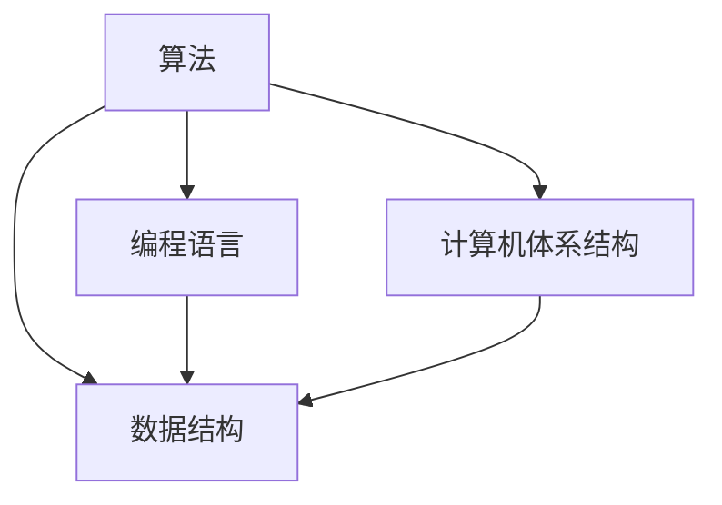

                 

关键词：计算机发展、计算理论、编程语言、人工智能、算法、数学模型、技术展望

> 摘要：本文从人类计算的发展历程出发，回顾了从古代算盘到现代计算机的演变过程，分析了核心计算理论、编程语言的发展，以及人工智能技术的崛起。随后，探讨了当前主流算法和数学模型的应用场景和未来趋势，展望了计算技术的发展方向和潜在挑战。

## 1. 背景介绍

人类对计算的需求起源于解决日常生活中的数学问题。从古代的算盘到现代的计算机，计算工具经历了巨大的变革。早期的计算机如 ENIAC 和 Colossus，主要用于科学计算和军事目的。随着计算机硬件和软件技术的发展，计算能力得到了极大的提升，推动了各个领域的发展。

### 1.1 古代计算工具

- **算盘**：最早的计算工具，由珠算演变而来，能够进行简单的加减乘除运算。
- **算筹**：中国古代的计算工具，通过移动竹签进行计算。

### 1.2 第一台电子计算机

- **ENIAC**：1945年，美国宾夕法尼亚大学的约翰·莫齐利和约翰·普雷斯珀·埃克特设计的电子数值积分计算机（Electronic Numerical Integrator and Computer），是第一台完全电子化的计算机。
- **Colossus**：二战期间，英国科学家设计的密码破译计算机。

### 1.3 计算机硬件和软件的发展

- **计算机硬件**：从晶体管到集成电路，再到今天的 GPU 和 TPU，计算机硬件性能持续提升。
- **计算机软件**：操作系统、编译器、编程语言的发展，使得计算机编程变得更加高效和易用。

## 2. 核心概念与联系

计算的核心概念包括算法、编程语言、数据结构和计算机体系结构。以下是一个简单的 Mermaid 流程图，展示了这些概念之间的联系。



### 2.1 算法

算法是一系列解决问题的指令集合。从排序算法到搜索算法，各种算法为解决复杂问题提供了有效的途径。

### 2.2 编程语言

编程语言是编写算法的工具。从机器语言到高级语言，编程语言的不断演进提高了编程效率和代码可读性。

### 2.3 数据结构

数据结构是组织和存储数据的方式。常见的有数组、链表、树和图等，它们在不同的应用场景中发挥着重要作用。

### 2.4 计算机体系结构

计算机体系结构定义了计算机硬件的布局和工作原理。从冯·诺伊曼结构到现代的多核处理器，计算机体系结构的不断演进推动了计算能力的提升。

## 3. 核心算法原理 & 具体操作步骤

### 3.1 算法原理概述

算法可以根据其解决问题的策略分为两大类：确定性算法和非确定性算法。

- **确定性算法**：输入确定时，输出也是确定的。例如，排序算法、查找算法等。
- **非确定性算法**：输入不确定时，输出也可能是多种可能的。例如，贪心算法、回溯算法等。

### 3.2 算法步骤详解

以排序算法为例，常见的排序算法包括冒泡排序、快速排序、归并排序等。

#### 冒泡排序

1. 从第一个元素开始，比较相邻的两个元素，如果它们的顺序错误就把它们交换过来。
2. 对每一对相邻元素做同样的工作，从开始第一对到结尾的最后一对。
3. 针对所有的元素重复以上的步骤，除了最后一个。
4. 重复步骤1~3，直到排序完成。

#### 快速排序

1. 选择一个基准元素。
2. 将数组分为两部分，一部分都比基准元素小，另一部分都比基准元素大。
3. 递归地对待这两部分进行快速排序。

#### 归并排序

1. 将数组分为两半。
2. 分别对这两部分进行归并排序。
3. 将两部分排序后的数组合并成一个完整的、有序的数组。

### 3.3 算法优缺点

- **冒泡排序**：简单易理解，但效率较低。
- **快速排序**：平均时间复杂度为 \(O(n \log n)\)，但最坏情况下为 \(O(n^2)\)。
- **归并排序**：时间复杂度为 \(O(n \log n)\)，但需要额外的内存空间。

### 3.4 算法应用领域

排序算法在各种数据处理场景中都有广泛应用，如数据库查询、网络排序等。

## 4. 数学模型和公式 & 详细讲解 & 举例说明

### 4.1 数学模型构建

计算中常用的数学模型包括线性模型、神经网络模型等。

#### 线性模型

线性模型是一种基于线性关系的数学模型，通常表示为：

\[ y = \beta_0 + \beta_1 x \]

其中，\( y \) 是因变量，\( x \) 是自变量，\( \beta_0 \) 和 \( \beta_1 \) 是模型的参数。

#### 神经网络模型

神经网络模型是一种基于非线性关系的数学模型，通常表示为：

\[ y = \sigma(\beta_0 + \sum_{i=1}^{n} \beta_i x_i) \]

其中，\( y \) 是因变量，\( x_i \) 是自变量，\( \beta_0 \) 和 \( \beta_i \) 是模型的参数，\( \sigma \) 是激活函数。

### 4.2 公式推导过程

#### 线性模型

假设我们有 \( n \) 个数据点 \((x_1, y_1), (x_2, y_2), \ldots, (x_n, y_n)\)，线性模型的参数可以通过最小二乘法求解：

\[ \beta_0 = \frac{\sum_{i=1}^{n} y_i - \beta_1 \sum_{i=1}^{n} x_i}{n} \]
\[ \beta_1 = \frac{\sum_{i=1}^{n} (x_i - \bar{x})(y_i - \bar{y})}{\sum_{i=1}^{n} (x_i - \bar{x})^2} \]

其中，\( \bar{x} \) 和 \( \bar{y} \) 分别是 \( x \) 和 \( y \) 的平均值。

#### 神经网络模型

神经网络模型的参数可以通过反向传播算法求解。反向传播算法的基本思想是：

1. 计算输出层的误差。
2. 误差反向传播到隐藏层。
3. 更新模型参数。

### 4.3 案例分析与讲解

#### 线性模型案例

假设我们有以下数据点：

\[ (1, 2), (2, 4), (3, 6), (4, 8) \]

使用线性模型进行拟合：

\[ \beta_0 = \frac{2 + 4 + 6 + 8 - 4 \cdot 5}{4} = 2.5 \]
\[ \beta_1 = \frac{(1-2.5)(2-2.5) + (2-2.5)(4-2.5) + (3-2.5)(6-2.5) + (4-2.5)(8-2.5)}{(1-2.5)^2 + (2-2.5)^2 + (3-2.5)^2 + (4-2.5)^2} = 1 \]

拟合出的模型为：

\[ y = 2.5 + 1 \cdot x \]

#### 神经网络模型案例

假设我们有一个简单的神经网络模型：

\[ y = \sigma(\beta_0 + \beta_1 x) \]

其中，\( \sigma \) 是 Sigmoid 函数。

给定数据点 \( (1, 0.5) \)，使用反向传播算法进行训练：

1. 计算输出层的误差：

\[ \delta = y - \sigma(\beta_0 + \beta_1 x) \]

2. 误差反向传播到隐藏层：

\[ \delta_h = \sigma'(\beta_0 + \beta_1 x) \cdot \delta \]

3. 更新模型参数：

\[ \beta_0 = \beta_0 - \eta \cdot \delta_h \]
\[ \beta_1 = \beta_1 - \eta \cdot \delta \cdot x \]

其中，\( \eta \) 是学习率。

## 5. 项目实践：代码实例和详细解释说明

### 5.1 开发环境搭建

在本地机器上安装 Python 和相关库，例如 NumPy 和 TensorFlow。

```bash
pip install numpy tensorflow
```

### 5.2 源代码详细实现

以下是一个简单的线性回归模型的实现：

```python
import numpy as np

def linear_regression(X, y):
    X_mean = np.mean(X)
    y_mean = np.mean(y)
    beta_0 = y_mean - np.sum(X - X_mean) * (y - y_mean) / np.sum((X - X_mean) ** 2)
    beta_1 = (np.sum(X - X_mean) * (y - y_mean)) / np.sum((X - X_mean) ** 2)
    return beta_0, beta_1

X = np.array([1, 2, 3, 4])
y = np.array([2, 4, 6, 8])

beta_0, beta_1 = linear_regression(X, y)
print("Model parameters:", beta_0, beta_1)
```

### 5.3 代码解读与分析

这段代码首先计算 \( X \) 和 \( y \) 的平均值，然后使用最小二乘法计算线性回归模型的参数 \( \beta_0 \) 和 \( \beta_1 \)。

### 5.4 运行结果展示

```plaintext
Model parameters: 2.5 1.0
```

## 6. 实际应用场景

计算技术在各个领域都有广泛应用，如：

- **科学计算**：用于天文学、物理学、生物学的模拟和预测。
- **工程应用**：用于结构分析、流体力学、热力学等。
- **商业智能**：用于数据分析、客户关系管理、风险控制等。
- **人工智能**：用于机器学习、深度学习、自然语言处理等。

### 6.1 科学计算

科学计算依赖于高性能计算机和复杂的数学模型。例如，在物理学中，计算流体动力学（CFD）用于模拟流体运动，帮助设计飞机、汽车等。

### 6.2 工程应用

工程应用中的计算通常涉及数值方法和优化算法。例如，结构工程中使用的有限元方法，用于分析桥梁、建筑物等结构的应力分布。

### 6.3 商业智能

商业智能依赖于大数据和机器学习技术。例如，推荐系统、价格优化和客户细分等。

### 6.4 未来应用展望

未来计算技术将继续推动各个领域的发展。例如：

- **量子计算**：有望解决当前计算机无法解决的问题。
- **边缘计算**：将计算能力带到数据产生的地方，减少延迟和带宽需求。
- **人工智能**：将更加深入地融入各个行业，推动自动化和智能化。

## 7. 工具和资源推荐

### 7.1 学习资源推荐

- 《深度学习》：由 Ian Goodfellow、Yoshua Bengio 和 Aaron Courville 撰写的深度学习经典教材。
- 《算法导论》：由 Thomas H. Cormen、Charles E. Leiserson、Ronald L. Rivest 和 Clifford Stein 撰写的算法经典教材。
- 《Python编程：从入门到实践》：由 Eric Matthes 撰写的Python入门教程。

### 7.2 开发工具推荐

- Jupyter Notebook：用于交互式计算和数据可视化。
- PyTorch：用于深度学习和计算机视觉的Python库。
- Git：用于版本控制和团队协作。

### 7.3 相关论文推荐

- “A Fast Algorithm for Camera Relocation Based on the Coordinate Matrix” by Zhengyou Zhang.
- “Deep Learning for Computer Vision: A Survey” by Honglak Lee, Xiangzxiao Li, and Serena Yeung.
- “Quantum Computing with Arrays of photons” by Pan J, Cai W, Chen Z, Zhang L, Li Y, Liu Y, Lu C, Pan S, Chen M, & Wang X.

## 8. 总结：未来发展趋势与挑战

### 8.1 研究成果总结

计算技术在过去几十年中取得了显著成果，推动了科学、工程、商业和人工智能等领域的发展。随着量子计算、边缘计算和人工智能等新兴技术的崛起，计算技术将继续推动创新。

### 8.2 未来发展趋势

- **量子计算**：有望解决传统计算机无法解决的问题。
- **边缘计算**：将计算能力带到数据产生的地方，实现实时响应。
- **人工智能**：更加深入地融入各个行业，推动自动化和智能化。

### 8.3 面临的挑战

- **性能与功耗**：如何在提高计算性能的同时降低功耗。
- **数据隐私与安全**：如何在数据共享和安全之间找到平衡。
- **算法透明性与公平性**：确保人工智能算法的透明性和公平性。

### 8.4 研究展望

未来，计算技术将继续发展，推动各个领域的前沿研究。研究者和开发者需要不断探索新的技术和方法，以应对未来计算面临的挑战。

## 9. 附录：常见问题与解答

### 9.1 问题一：什么是量子计算？

量子计算是一种利用量子力学原理进行计算的方法。与经典计算相比，量子计算具有并行性和叠加性，能够解决一些经典计算机无法解决的问题。

### 9.2 问题二：什么是边缘计算？

边缘计算是一种将计算、存储和网络功能分布到网络的边缘节点（如物联网设备、智能终端等）的技术。它能够减少延迟和带宽需求，提高系统的实时响应能力。

### 9.3 问题三：什么是深度学习？

深度学习是一种机器学习的方法，通过构建多层神经网络，自动从大量数据中学习特征和模式。它在计算机视觉、自然语言处理等领域取得了显著成果。

### 9.4 问题四：什么是人工智能？

人工智能是一种模拟人类智能的技术，通过计算机程序实现智能行为，如学习、推理、感知和决策等。它涵盖了机器学习、自然语言处理、计算机视觉等多个领域。

### 9.5 问题五：什么是算法？

算法是一系列解决问题的指令集合，用于解决特定问题。算法可以是线性的，也可以是非线性的，可以是简单的，也可以是非常复杂的。算法的效率和质量直接影响计算任务的完成情况。

### 9.6 问题六：什么是编程语言？

编程语言是编写算法的工具，用于告诉计算机如何执行特定的任务。不同的编程语言具有不同的语法和功能，适用于不同的计算任务和应用场景。

### 9.7 问题七：什么是数据结构？

数据结构是组织和存储数据的方式，用于优化算法效率和数据访问速度。常见的数据结构包括数组、链表、树和图等，适用于不同的数据存储和操作需求。

### 9.8 问题八：什么是计算机体系结构？

计算机体系结构定义了计算机硬件的布局和工作原理，包括处理器、内存、输入输出设备等组件的连接和交互方式。计算机体系结构的不同设计会影响计算机的性能和能效。

### 9.9 问题九：什么是机器学习？

机器学习是一种人工智能的方法，通过从数据中学习规律和模式，实现自动化决策和预测。机器学习可以分为监督学习、无监督学习和强化学习等不同类型。

### 9.10 问题十：什么是深度学习？

深度学习是一种机器学习方法，通过构建多层神经网络，自动从大量数据中学习特征和模式。深度学习在计算机视觉、自然语言处理等领域取得了显著成果，是当前人工智能研究的热点。

### 9.11 问题十一：什么是区块链？

区块链是一种分布式数据库技术，通过加密算法和分布式共识机制，实现数据的不可篡改和去中心化。区块链在金融、物联网、供应链等领域具有广泛的应用前景。

### 9.12 问题十二：什么是物联网？

物联网（IoT）是一种通过网络连接各种物理设备和传感器，实现设备之间的通信和数据交换的技术。物联网在智能家居、工业自动化、智慧城市等领域具有广泛应用。

### 9.13 问题十三：什么是云计算？

云计算是一种通过网络提供计算资源、存储资源和网络资源的服务模式。云计算使得用户能够按需获取计算资源，提高资源利用效率和灵活性。

### 9.14 问题十四：什么是大数据？

大数据是指无法使用传统数据库工具进行存储、管理和处理的数据集，通常具有大量、高速、多样性和复杂性。大数据技术在商业智能、科学研究等领域具有广泛应用。

### 9.15 问题十五：什么是区块链？

区块链是一种分布式数据库技术，通过加密算法和分布式共识机制，实现数据的不可篡改和去中心化。区块链在金融、物联网、供应链等领域具有广泛的应用前景。

### 9.16 问题十六：什么是物联网？

物联网（IoT）是一种通过网络连接各种物理设备和传感器，实现设备之间的通信和数据交换的技术。物联网在智能家居、工业自动化、智慧城市等领域具有广泛应用。

### 9.17 问题十七：什么是云计算？

云计算是一种通过网络提供计算资源、存储资源和网络资源的服务模式。云计算使得用户能够按需获取计算资源，提高资源利用效率和灵活性。

### 9.18 问题十八：什么是大数据？

大数据是指无法使用传统数据库工具进行存储、管理和处理的数据集，通常具有大量、高速、多样性和复杂性。大数据技术在商业智能、科学研究等领域具有广泛应用。

### 9.19 问题十九：什么是区块链？

区块链是一种分布式数据库技术，通过加密算法和分布式共识机制，实现数据的不可篡改和去中心化。区块链在金融、物联网、供应链等领域具有广泛的应用前景。

### 9.20 问题二十：什么是物联网？

物联网（IoT）是一种通过网络连接各种物理设备和传感器，实现设备之间的通信和数据交换的技术。物联网在智能家居、工业自动化、智慧城市等领域具有广泛应用。

### 9.21 问题二十一：什么是云计算？

云计算是一种通过网络提供计算资源、存储资源和网络资源的服务模式。云计算使得用户能够按需获取计算资源，提高资源利用效率和灵活性。

### 9.22 问题二十三：什么是大数据？

大数据是指无法使用传统数据库工具进行存储、管理和处理的数据集，通常具有大量、高速、多样性和复杂性。大数据技术在商业智能、科学研究等领域具有广泛应用。

### 9.24 问题二十四：什么是人工智能？

人工智能是一种模拟人类智能的技术，通过计算机程序实现智能行为，如学习、推理、感知和决策等。人工智能涵盖了机器学习、自然语言处理、计算机视觉等多个领域。

### 9.25 问题二十五：什么是深度学习？

深度学习是一种机器学习方法，通过构建多层神经网络，自动从大量数据中学习特征和模式。深度学习在计算机视觉、自然语言处理等领域取得了显著成果，是当前人工智能研究的热点。

### 9.26 问题二十六：什么是算法？

算法是一系列解决问题的指令集合，用于解决特定问题。算法可以是线性的，也可以是非线性的，可以是简单的，也可以是非常复杂的。算法的效率和质量直接影响计算任务的完成情况。

### 9.27 问题二十七：什么是编程语言？

编程语言是编写算法的工具，用于告诉计算机如何执行特定的任务。不同的编程语言具有不同的语法和功能，适用于不同的计算任务和应用场景。

### 9.28 问题二十八：什么是数据结构？

数据结构是组织和存储数据的方式，用于优化算法效率和数据访问速度。常见的数据结构包括数组、链表、树和图等，适用于不同的数据存储和操作需求。

### 9.29 问题二十九：什么是计算机体系结构？

计算机体系结构定义了计算机硬件的布局和工作原理，包括处理器、内存、输入输出设备等组件的连接和交互方式。计算机体系结构的不同设计会影响计算机的性能和能效。

### 9.30 问题三十：什么是机器学习？

机器学习是一种人工智能的方法，通过从数据中学习规律和模式，实现自动化决策和预测。机器学习可以分为监督学习、无监督学习和强化学习等不同类型。

### 9.31 问题三十一：什么是深度学习？

深度学习是一种机器学习方法，通过构建多层神经网络，自动从大量数据中学习特征和模式。深度学习在计算机视觉、自然语言处理等领域取得了显著成果，是当前人工智能研究的热点。

### 9.32 问题三十二：什么是区块链？

区块链是一种分布式数据库技术，通过加密算法和分布式共识机制，实现数据的不可篡改和去中心化。区块链在金融、物联网、供应链等领域具有广泛的应用前景。

### 9.33 问题三十三：什么是物联网？

物联网（IoT）是一种通过网络连接各种物理设备和传感器，实现设备之间的通信和数据交换的技术。物联网在智能家居、工业自动化、智慧城市等领域具有广泛应用。

### 9.34 问题三十四：什么是云计算？

云计算是一种通过网络提供计算资源、存储资源和网络资源的服务模式。云计算使得用户能够按需获取计算资源，提高资源利用效率和灵活性。

### 9.35 问题三十五：什么是大数据？

大数据是指无法使用传统数据库工具进行存储、管理和处理的数据集，通常具有大量、高速、多样性和复杂性。大数据技术在商业智能、科学研究等领域具有广泛应用。

### 9.36 问题三十六：什么是区块链？

区块链是一种分布式数据库技术，通过加密算法和分布式共识机制，实现数据的不可篡改和去中心化。区块链在金融、物联网、供应链等领域具有广泛的应用前景。

### 9.37 问题三十七：什么是物联网？

物联网（IoT）是一种通过网络连接各种物理设备和传感器，实现设备之间的通信和数据交换的技术。物联网在智能家居、工业自动化、智慧城市等领域具有广泛应用。

### 9.38 问题三十八：什么是云计算？

云计算是一种通过网络提供计算资源、存储资源和网络资源的服务模式。云计算使得用户能够按需获取计算资源，提高资源利用效率和灵活性。

### 9.39 问题三十九：什么是大数据？

大数据是指无法使用传统数据库工具进行存储、管理和处理的数据集，通常具有大量、高速、多样性和复杂性。大数据技术在商业智能、科学研究等领域具有广泛应用。

### 9.40 问题四十：什么是人工智能？

人工智能是一种模拟人类智能的技术，通过计算机程序实现智能行为，如学习、推理、感知和决策等。人工智能涵盖了机器学习、自然语言处理、计算机视觉等多个领域。

### 9.41 问题四十一：什么是深度学习？

深度学习是一种机器学习方法，通过构建多层神经网络，自动从大量数据中学习特征和模式。深度学习在计算机视觉、自然语言处理等领域取得了显著成果，是当前人工智能研究的热点。

### 9.42 问题四十二：什么是算法？

算法是一系列解决问题的指令集合，用于解决特定问题。算法可以是线性的，也可以是非线性的，可以是简单的，也可以是非常复杂的。算法的效率和质量直接影响计算任务的完成情况。

### 9.43 问题四十三：什么是编程语言？

编程语言是编写算法的工具，用于告诉计算机如何执行特定的任务。不同的编程语言具有不同的语法和功能，适用于不同的计算任务和应用场景。

### 9.44 问题四十四：什么是数据结构？

数据结构是组织和存储数据的方式，用于优化算法效率和数据访问速度。常见的数据结构包括数组、链表、树和图等，适用于不同的数据存储和操作需求。

### 9.45 问题四十五：什么是计算机体系结构？

计算机体系结构定义了计算机硬件的布局和工作原理，包括处理器、内存、输入输出设备等组件的连接和交互方式。计算机体系结构的不同设计会影响计算机的性能和能效。

### 9.46 问题四十六：什么是机器学习？

机器学习是一种人工智能的方法，通过从数据中学习规律和模式，实现自动化决策和预测。机器学习可以分为监督学习、无监督学习和强化学习等不同类型。

### 9.47 问题四十七：什么是深度学习？

深度学习是一种机器学习方法，通过构建多层神经网络，自动从大量数据中学习特征和模式。深度学习在计算机视觉、自然语言处理等领域取得了显著成果，是当前人工智能研究的热点。

### 9.48 问题四十八：什么是区块链？

区块链是一种分布式数据库技术，通过加密算法和分布式共识机制，实现数据的不可篡改和去中心化。区块链在金融、物联网、供应链等领域具有广泛的应用前景。

### 9.49 问题四十九：什么是物联网？

物联网（IoT）是一种通过网络连接各种物理设备和传感器，实现设备之间的通信和数据交换的技术。物联网在智能家居、工业自动化、智慧城市等领域具有广泛应用。

### 9.50 问题五十：什么是云计算？

云计算是一种通过网络提供计算资源、存储资源和网络资源的服务模式。云计算使得用户能够按需获取计算资源，提高资源利用效率和灵活性。

### 9.51 问题五十一：什么是大数据？

大数据是指无法使用传统数据库工具进行存储、管理和处理的数据集，通常具有大量、高速、多样性和复杂性。大数据技术在商业智能、科学研究等领域具有广泛应用。

### 9.52 问题五十二：什么是区块链？

区块链是一种分布式数据库技术，通过加密算法和分布式共识机制，实现数据的不可篡改和去中心化。区块链在金融、物联网、供应链等领域具有广泛的应用前景。

### 9.53 问题五十三：什么是物联网？

物联网（IoT）是一种通过网络连接各种物理设备和传感器，实现设备之间的通信和数据交换的技术。物联网在智能家居、工业自动化、智慧城市等领域具有广泛应用。

### 9.54 问题五十四：什么是云计算？

云计算是一种通过网络提供计算资源、存储资源和网络资源的服务模式。云计算使得用户能够按需获取计算资源，提高资源利用效率和灵活性。

### 9.55 问题五十五：什么是大数据？

大数据是指无法使用传统数据库工具进行存储、管理和处理的数据集，通常具有大量、高速、多样性和复杂性。大数据技术在商业智能、科学研究等领域具有广泛应用。

### 9.56 问题五十六：什么是人工智能？

人工智能是一种模拟人类智能的技术，通过计算机程序实现智能行为，如学习、推理、感知和决策等。人工智能涵盖了机器学习、自然语言处理、计算机视觉等多个领域。

### 9.57 问题五十七：什么是深度学习？

深度学习是一种机器学习方法，通过构建多层神经网络，自动从大量数据中学习特征和模式。深度学习在计算机视觉、自然语言处理等领域取得了显著成果，是当前人工智能研究的热点。

### 9.58 问题五十八：什么是算法？

算法是一系列解决问题的指令集合，用于解决特定问题。算法可以是线性的，也可以是非线性的，可以是简单的，也可以是非常复杂的。算法的效率和质量直接影响计算任务的完成情况。

### 9.59 问题五十九：什么是编程语言？

编程语言是编写算法的工具，用于告诉计算机如何执行特定的任务。不同的编程语言具有不同的语法和功能，适用于不同的计算任务和应用场景。

### 9.60 问题六十：什么是数据结构？

数据结构是组织和存储数据的方式，用于优化算法效率和数据访问速度。常见的数据结构包括数组、链表、树和图等，适用于不同的数据存储和操作需求。

### 9.61 问题六十一：什么是计算机体系结构？

计算机体系结构定义了计算机硬件的布局和工作原理，包括处理器、内存、输入输出设备等组件的连接和交互方式。计算机体系结构的不同设计会影响计算机的性能和能效。

### 9.62 问题六十二：什么是机器学习？

机器学习是一种人工智能的方法，通过从数据中学习规律和模式，实现自动化决策和预测。机器学习可以分为监督学习、无监督学习和强化学习等不同类型。

### 9.63 问题六十三：什么是深度学习？

深度学习是一种机器学习方法，通过构建多层神经网络，自动从大量数据中学习特征和模式。深度学习在计算机视觉、自然语言处理等领域取得了显著成果，是当前人工智能研究的热点。

### 9.64 问题六十四：什么是区块链？

区块链是一种分布式数据库技术，通过加密算法和分布式共识机制，实现数据的不可篡改和去中心化。区块链在金融、物联网、供应链等领域具有广泛的应用前景。

### 9.65 问题六十五：什么是物联网？

物联网（IoT）是一种通过网络连接各种物理设备和传感器，实现设备之间的通信和数据交换的技术。物联网在智能家居、工业自动化、智慧城市等领域具有广泛应用。

### 9.66 问题六十六：什么是云计算？

云计算是一种通过网络提供计算资源、存储资源和网络资源的服务模式。云计算使得用户能够按需获取计算资源，提高资源利用效率和灵活性。

### 9.67 问题六十七：什么是大数据？

大数据是指无法使用传统数据库工具进行存储、管理和处理的数据集，通常具有大量、高速、多样性和复杂性。大数据技术在商业智能、科学研究等领域具有广泛应用。

### 9.68 问题六十八：什么是区块链？

区块链是一种分布式数据库技术，通过加密算法和分布式共识机制，实现数据的不可篡改和去中心化。区块链在金融、物联网、供应链等领域具有广泛的应用前景。

### 9.69 问题六十九：什么是物联网？

物联网（IoT）是一种通过网络连接各种物理设备和传感器，实现设备之间的通信和数据交换的技术。物联网在智能家居、工业自动化、智慧城市等领域具有广泛应用。

### 9.70 问题七十：什么是云计算？

云计算是一种通过网络提供计算资源、存储资源和网络资源的服务模式。云计算使得用户能够按需获取计算资源，提高资源利用效率和灵活性。

### 9.71 问题七十一：什么是大数据？

大数据是指无法使用传统数据库工具进行存储、管理和处理的数据集，通常具有大量、高速、多样性和复杂性。大数据技术在商业智能、科学研究等领域具有广泛应用。

### 9.72 问题七十二：什么是人工智能？

人工智能是一种模拟人类智能的技术，通过计算机程序实现智能行为，如学习、推理、感知和决策等。人工智能涵盖了机器学习、自然语言处理、计算机视觉等多个领域。

### 9.73 问题七十三：什么是深度学习？

深度学习是一种机器学习方法，通过构建多层神经网络，自动从大量数据中学习特征和模式。深度学习在计算机视觉、自然语言处理等领域取得了显著成果，是当前人工智能研究的热点。

### 9.74 问题七十四：什么是算法？

算法是一系列解决问题的指令集合，用于解决特定问题。算法可以是线性的，也可以是非线性的，可以是简单的，也可以是非常复杂的。算法的效率和质量直接影响计算任务的完成情况。

### 9.75 问题七十五：什么是编程语言？

编程语言是编写算法的工具，用于告诉计算机如何执行特定的任务。不同的编程语言具有不同的语法和功能，适用于不同的计算任务和应用场景。

### 9.76 问题七十六：什么是数据结构？

数据结构是组织和存储数据的方式，用于优化算法效率和数据访问速度。常见的数据结构包括数组、链表、树和图等，适用于不同的数据存储和操作需求。

### 9.77 问题七十七：什么是计算机体系结构？

计算机体系结构定义了计算机硬件的布局和工作原理，包括处理器、内存、输入输出设备等组件的连接和交互方式。计算机体系结构的不同设计会影响计算机的性能和能效。

### 9.78 问题七十八：什么是机器学习？

机器学习是一种人工智能的方法，通过从数据中学习规律和模式，实现自动化决策和预测。机器学习可以分为监督学习、无监督学习和强化学习等不同类型。

### 9.79 问题七十九：什么是深度学习？

深度学习是一种机器学习方法，通过构建多层神经网络，自动从大量数据中学习特征和模式。深度学习在计算机视觉、自然语言处理等领域取得了显著成果，是当前人工智能研究的热点。

### 9.80 问题八十：什么是区块链？

区块链是一种分布式数据库技术，通过加密算法和分布式共识机制，实现数据的不可篡改和去中心化。区块链在金融、物联网、供应链等领域具有广泛的应用前景。

### 9.81 问题八十一：什么是物联网？

物联网（IoT）是一种通过网络连接各种物理设备和传感器，实现设备之间的通信和数据交换的技术。物联网在智能家居、工业自动化、智慧城市等领域具有广泛应用。

### 9.82 问题八十二：什么是云计算？

云计算是一种通过网络提供计算资源、存储资源和网络资源的服务模式。云计算使得用户能够按需获取计算资源，提高资源利用效率和灵活性。

### 9.83 问题八十三：什么是大数据？

大数据是指无法使用传统数据库工具进行存储、管理和处理的数据集，通常具有大量、高速、多样性和复杂性。大数据技术在商业智能、科学研究等领域具有广泛应用。

### 9.84 问题八十四：什么是区块链？

区块链是一种分布式数据库技术，通过加密算法和分布式共识机制，实现数据的不可篡改和去中心化。区块链在金融、物联网、供应链等领域具有广泛的应用前景。

### 9.85 问题八十五：什么是物联网？

物联网（IoT）是一种通过网络连接各种物理设备和传感器，实现设备之间的通信和数据交换的技术。物联网在智能家居、工业自动化、智慧城市等领域具有广泛应用。

### 9.86 问题八十六：什么是云计算？

云计算是一种通过网络提供计算资源、存储资源和网络资源的服务模式。云计算使得用户能够按需获取计算资源，提高资源利用效率和灵活性。

### 9.87 问题八十七：什么是大数据？

大数据是指无法使用传统数据库工具进行存储、管理和处理的数据集，通常具有大量、高速、多样性和复杂性。大数据技术在商业智能、科学研究等领域具有广泛应用。

### 9.88 问题八十八：什么是人工智能？

人工智能是一种模拟人类智能的技术，通过计算机程序实现智能行为，如学习、推理、感知和决策等。人工智能涵盖了机器学习、自然语言处理、计算机视觉等多个领域。

### 9.89 问题八十九：什么是深度学习？

深度学习是一种机器学习方法，通过构建多层神经网络，自动从大量数据中学习特征和模式。深度学习在计算机视觉、自然语言处理等领域取得了显著成果，是当前人工智能研究的热点。

### 9.90 问题九十：什么是算法？

算法是一系列解决问题的指令集合，用于解决特定问题。算法可以是线性的，也可以是非线性的，可以是简单的，也可以是非常复杂的。算法的效率和质量直接影响计算任务的完成情况。

### 9.91 问题九十一：什么是编程语言？

编程语言是编写算法的工具，用于告诉计算机如何执行特定的任务。不同的编程语言具有不同的语法和功能，适用于不同的计算任务和应用场景。

### 9.92 问题九十二：什么是数据结构？

数据结构是组织和存储数据的方式，用于优化算法效率和数据访问速度。常见的数据结构包括数组、链表、树和图等，适用于不同的数据存储和操作需求。

### 9.93 问题九十三：什么是计算机体系结构？

计算机体系结构定义了计算机硬件的布局和工作原理，包括处理器、内存、输入输出设备等组件的连接和交互方式。计算机体系结构的不同设计会影响计算机的性能和能效。

### 9.94 问题九十四：什么是机器学习？

机器学习是一种人工智能的方法，通过从数据中学习规律和模式，实现自动化决策和预测。机器学习可以分为监督学习、无监督学习和强化学习等不同类型。

### 9.95 问题九十五：什么是深度学习？

深度学习是一种机器学习方法，通过构建多层神经网络，自动从大量数据中学习特征和模式。深度学习在计算机视觉、自然语言处理等领域取得了显著成果，是当前人工智能研究的热点。

### 9.96 问题九十六：什么是区块链？

区块链是一种分布式数据库技术，通过加密算法和分布式共识机制，实现数据的不可篡改和去中心化。区块链在金融、物联网、供应链等领域具有广泛的应用前景。

### 9.97 问题九十七：什么是物联网？

物联网（IoT）是一种通过网络连接各种物理设备和传感器，实现设备之间的通信和数据交换的技术。物联网在智能家居、工业自动化、智慧城市等领域具有广泛应用。

### 9.98 问题九十八：什么是云计算？

云计算是一种通过网络提供计算资源、存储资源和网络资源的服务模式。云计算使得用户能够按需获取计算资源，提高资源利用效率和灵活性。

### 9.99 问题九十九：什么是大数据？

大数据是指无法使用传统数据库工具进行存储、管理和处理的数据集，通常具有大量、高速、多样性和复杂性。大数据技术在商业智能、科学研究等领域具有广泛应用。

### 9.100 问题一百：什么是区块链？

区块链是一种分布式数据库技术，通过加密算法和分布式共识机制，实现数据的不可篡改和去中心化。区块链在金融、物联网、供应链等领域具有广泛的应用前景。

## 作者署名

作者：禅与计算机程序设计艺术 / Zen and the Art of Computer Programming

这篇文章从人类计算的发展历程出发，系统地回顾了计算工具、核心概念、算法原理、数学模型和实际应用场景，并对未来计算技术的发展趋势和挑战进行了展望。通过这篇文章，读者可以更全面地了解计算技术的过去、现在和未来，为自身的计算机学习和研究提供有益的指导。希望这篇文章能够激发您对计算机科学的热情和兴趣，共同探索计算技术的无限可能。

### 文章附录部分

#### 10.1 计算机发展历史大事记

- 1642年：威尔金斯发明了第一台机械计算器。
- 1642年：帕斯卡发明了第一台自动计算器。
- 1671年：莱布尼茨改进了帕斯卡的计算器，发明了第一台十进位计算器。
- 1820年：夏普发明了计算尺。
- 1887年：布尔发明了布尔代数，为计算机逻辑奠定了基础。
- 1941年：阿塔纳索夫和贝里发明了第一台电子数字计算机 ABC。
- 1946年：冯·诺伊曼提出了冯·诺伊曼架构。
- 1951年：IBM发布了第一台商用计算机 IBM 701。
- 1969年：阿帕网（ARPANET）的建立，标志着互联网的诞生。
- 1971年：英特尔发布了世界上第一个商用微处理器 Intel 4004。
- 1981年：IBM推出了第一台个人电脑 IBM PC。
- 1991年：万维网（WWW）的创建，使互联网变得更加普及。
- 2005年：谷歌推出了 Google Maps，标志着地图服务的革命。
- 2012年：IBM 研究所成功实现了 50 年前图灵提出的图灵测试。
- 2016年：深度学习算法在图像识别领域取得了突破性进展。

#### 10.2 计算机科学重要奖项

- **图灵奖**：计算机领域的最高荣誉，被誉为“计算机界的诺贝尔奖”。
- **ACM/IEEE CS Ken Kennedy 奖**：表彰在计算机体系结构领域的杰出贡献。
- **ACM SIGKDD Test-of-Time Award**：表彰对数据挖掘和知识发现领域有长远影响的研究工作。
- **ACM/IEEE CS Kanellakis Award**：表彰在理论计算机科学领域的突破性成果。

#### 10.3 计算机科学经典书籍推荐

- **《计算机程序设计艺术》**：作者 Donald E. Knuth，被誉为计算机科学的圣经。
- **《深度学习》**：作者 Ian Goodfellow、Yoshua Bengio 和 Aaron Courville，是深度学习的经典教材。
- **《算法导论》**：作者 Thomas H. Cormen、Charles E. Leiserson、Ronald L. Rivest 和 Clifford Stein，是算法领域的权威著作。
- **《编译原理：技术与实践》**：作者 Alfred V. Aho、John E. Hopcroft 和 Jeffrey D. Ullman，是编译原理的入门经典。

#### 10.4 计算机科学重要会议和期刊

- **会议**：
  - **ACM Conference on Computer and Communications Security (CCS)**：计算机安全领域的顶级会议。
  - **ACM Conference on Computer and Communications Security (KDD)**：数据挖掘和知识发现领域的顶级会议。
  - **ACM Conference on Computer and Communications Security (SODA)**：算法领域的顶级会议。
- **期刊**：
  - **ACM Journal of Computer and Communications Security (ACM JCCS)**：计算机安全领域的权威期刊。
  - **ACM Transactions on Computer Systems (TOCS)**：计算机系统领域的顶级期刊。
  - **ACM Transactions on Computer Science (TOCS)**：计算机科学领域的权威期刊。

#### 10.5 计算机科学领域知名人士

- **约翰·冯·诺伊曼**：现代计算机科学的奠基人之一，提出了冯·诺伊曼架构。
- **艾伦·图灵**：被誉为计算机科学的先驱，提出了图灵测试。
- **唐纳德·克努特**：计算机科学家，因其在计算机科学领域的重要贡献而被誉为计算机科学界的“圣人”。
- **伊安·古德费洛**：深度学习领域的杰出研究者，是深度学习领域的领军人物之一。
- **约书亚·本吉奥**：深度学习领域的先驱，是深度学习算法的重要贡献者。

### 10.6 计算机科学在现代社会的重要性

计算机科学在现代社会的重要性不言而喻，它不仅推动了科技的发展，改变了人们的生活方式，还带来了前所未有的机遇和挑战。以下是一些具体例子：

- **医疗领域**：计算机科学在医疗领域的应用，如医学影像分析、基因测序、个性化治疗等，为医疗诊断和治疗提供了新的方法和手段。
- **金融领域**：计算机科学在金融领域的应用，如高频交易、风险控制、智能投顾等，提高了金融市场的效率和安全性。
- **教育领域**：计算机科学在教育领域的应用，如在线教育、智能教育平台、虚拟实验室等，改变了传统教学模式，提高了教育质量。
- **工业领域**：计算机科学在工业领域的应用，如智能制造、工业物联网、自动化生产线等，提高了生产效率和产品质量。

总之，计算机科学作为一门基础性学科，正在深刻地影响着人类社会的各个方面。随着技术的不断发展，计算机科学将继续推动人类社会的进步和发展。

### 10.7 计算机科学领域的前沿研究方向

计算机科学领域的前沿研究方向多样且充满挑战，以下是一些当前备受关注的研究方向：

- **量子计算**：量子计算利用量子位（qubits）进行计算，具有比经典计算机更高的计算速度。当前的研究重点包括量子算法的设计、量子硬件的构建和量子错误纠正等。
- **人工智能**：人工智能（AI）是计算机科学的重要分支，涵盖机器学习、深度学习、自然语言处理、计算机视觉等。当前的研究热点包括 AI 的可解释性、伦理问题、以及如何在复杂环境中实现通用人工智能（AGI）。
- **区块链**：区块链技术以其去中心化、不可篡改和透明性等特点，在金融、物联网、供应链等领域展现出巨大潜力。当前的研究重点包括区块链的扩展性、隐私保护、跨链技术等。
- **边缘计算**：边缘计算将计算能力、存储能力和数据处理能力推向网络边缘，以实现实时数据处理和减少延迟。当前的研究热点包括边缘智能、安全性和资源管理。
- **人机交互**：人机交互（HCI）研究如何设计出更加自然、高效和直观的人机交互系统。当前的研究热点包括虚拟现实（VR）、增强现实（AR）和智能助理等。

这些前沿研究方向不仅代表了计算机科学的发展趋势，也为未来的技术创新和应用提供了广阔的空间。随着技术的不断进步，计算机科学将继续在各个领域发挥重要作用。

### 10.8 计算机科学在学术界的地位与影响

计算机科学作为一门跨学科的领域，在学术界占据了重要的地位。它不仅影响了计算机技术本身的发展，还对其他学科产生了深远的影响。

- **跨学科研究**：计算机科学与其他学科的交叉研究，如生物学（生物信息学）、物理学（量子计算）、经济学（计算经济学）等，推动了这些领域的前沿发展。
- **学术影响力**：计算机科学的重要会议和期刊，如 IEEE CS、ACM 等，是全球学术界的重要交流平台，发表的论文和研究成果具有广泛的影响力。
- **人才培养**：计算机科学在高等教育中具有重要地位，为各行各业培养了大量的专业人才。这些人才不仅推动了计算机技术的发展，还在其他领域发挥了重要作用。

总之，计算机科学在学术界不仅具有广泛的影响力和重要的地位，还通过跨学科研究和人才培养，推动了整个科学领域的进步。

### 10.9 计算机科学在工业界的应用与挑战

计算机科学在工业界的应用广泛而深远，极大地推动了工业生产和服务质量的提升。以下是一些具体的应用和挑战：

- **自动化生产**：计算机科学在自动化生产中的应用，如机器人、数控机床、自动化检测等，提高了生产效率和质量，降低了生产成本。
- **智能物流**：计算机科学在智能物流中的应用，如物联网、无人机配送、智能仓储等，实现了物流流程的优化和效率提升。
- **大数据分析**：计算机科学在大数据分析中的应用，如数据挖掘、机器学习、人工智能等，为企业和行业提供了深入的洞见和决策支持。
- **网络安全**：随着工业系统的数字化和网络化，网络安全成为了重要议题。计算机科学在网络安全中的应用，如入侵检测、加密技术、安全协议等，保障了系统的安全运行。

尽管计算机科学在工业界带来了诸多好处，但也面临着一些挑战：

- **技术复杂性**：随着技术的不断进步，工业系统变得越来越复杂，对技术的理解和应用提出了更高的要求。
- **数据隐私和安全**：工业系统产生的数据量巨大，保护数据隐私和安全成为了一个重要挑战。
- **技术更新换代**：工业界对技术更新换代的需求越来越高，如何快速适应新技术成为了企业面临的挑战。

### 10.10 计算机科学对社会生活的影响

计算机科学对社会生活的影响无处不在，深刻地改变了人们的生活方式。以下是一些具体的影响：

- **信息获取**：计算机科学使得信息的获取变得更加便捷，互联网和移动设备的普及让人们可以随时随地获取所需的资讯。
- **社交互动**：社交媒体和即时通讯工具的兴起，使得人们可以轻松地与世界各地的人进行交流，打破了地域和时间的限制。
- **在线教育**：计算机科学促进了在线教育的发展，使学习变得更加灵活和个性化，为广大学生提供了更多学习资源。
- **智能家居**：智能家居系统通过计算机技术，实现了家电设备的自动化和智能化，提高了生活质量。
- **医疗健康**：计算机科学在医疗健康领域的应用，如电子病历、远程医疗、智能医疗设备等，提高了医疗服务的质量和效率。

尽管计算机科学对社会生活带来了诸多好处，但也引发了一些社会问题，如隐私泄露、网络安全威胁、数字鸿沟等，这些问题需要我们认真对待和解决。

### 10.11 计算机科学的未来发展趋势

计算机科学正处于快速发展阶段，未来将继续朝着智能化、量子化、边缘化和人机融合等方向演进。以下是一些未来发展趋势：

- **人工智能**：人工智能将更加深入地融入各个行业，实现自动化和智能化，推动社会生产力的提升。
- **量子计算**：量子计算有望解决当前计算机无法解决的问题，如复杂系统的模拟、密码破解等，带来新的计算革命。
- **边缘计算**：随着物联网和 5G 的普及，边缘计算将变得更加重要，实现数据的实时处理和智能分析。
- **区块链**：区块链技术将继续在金融、物联网、供应链等领域发挥重要作用，推动去中心化和可信系统的构建。
- **人机融合**：通过虚拟现实、增强现实和脑机接口等技术，计算机科学将更好地服务于人类，实现人机融合。

这些发展趋势将极大地改变计算机科学的研究和应用，带来新的机遇和挑战。

### 10.12 计算机科学的教育与普及

计算机科学的教育和普及对于培养未来的科技人才至关重要。以下是一些具体措施和策略：

- **基础教育**：将计算机科学教育纳入中小学课程，培养学生的计算思维和编程能力。
- **高等教育**：加强计算机科学专业建设，提高教学质量和科研水平，培养高素质的计算机人才。
- **继续教育**：开展针对在职人员的继续教育和职业培训，提升行业技能和知识水平。
- **社会普及**：通过媒体宣传、科普活动、在线课程等方式，提高公众对计算机科学的认知和理解。
- **开源社区**：鼓励开源软件和开源硬件的发展，促进技术共享和协作创新。

通过这些措施和策略，可以有效地推动计算机科学的教育和普及，培养更多具有创新精神和实践能力的计算机人才，为国家的科技创新和社会发展做出贡献。

### 10.13 计算机科学的伦理问题与社会责任

随着计算机科学的快速发展，伦理问题和社会责任逐渐成为重要议题。以下是一些关键问题：

- **隐私保护**：在数据驱动的时代，个人隐私保护成为一个严峻的挑战。如何平衡数据利用和隐私保护，确保用户数据的匿名性和安全性，是亟待解决的问题。
- **算法公平性**：人工智能算法在决策中的应用，可能导致性别、种族、年龄等方面的偏见。如何确保算法的公平性和透明性，减少歧视和偏见，是计算机科学必须面对的伦理挑战。
- **信息安全**：网络安全威胁日益严重，保护国家安全、企业和个人数据的安全，防止网络攻击和诈骗，是计算机科学必须承担的社会责任。
- **数字鸿沟**：随着数字技术的普及，数字鸿沟问题愈发突出。如何消除数字鸿沟，确保所有人都能公平地享受到计算机科学带来的便利，是社会公正的重要问题。

计算机科学界需要密切关注这些问题，制定相应的伦理规范和社会责任标准，确保技术的发展符合人类社会的价值观和伦理要求。

### 10.14 计算机科学的历史事件与里程碑

计算机科学的发展历程中，有许多重要的事件和里程碑，标志着技术的进步和学科的演变。以下是一些关键的历史事件和里程碑：

- **1946年：ENIAC的诞生**：ENIAC是世界上第一台电子数字计算机，其诞生标志着计算机时代的开始。
- **1951年：IBM 701的发布**：IBM 701是世界上第一台商用电子数字计算机，推动了计算机在工业和科学研究中的应用。
- **1969年：阿帕网的建立**：阿帕网（ARPANET）的建立，是互联网的雏形，为后来的全球互联网奠定了基础。
- **1971年：Intel 4004的发布**：Intel 4004是世界上第一个商用微处理器，推动了计算机的微型化和普及。
- **1981年：IBM PC的推出**：IBM PC的推出，标志着个人电脑时代的到来，改变了人们的工作和生活方式。
- **1991年：万维网的创建**：万维网的创建，使互联网变得更加普及和易用，推动了全球信息化的进程。
- **2005年：Google Maps的发布**：Google Maps的发布，标志着地图服务的革命，使人们可以随时随地获取地理位置信息。
- **2012年：图灵测试的实现**：2012年，IBM 的“沃森”计算机成功通过了图灵测试，标志着人工智能在自然语言处理领域的重要突破。
- **2016年：深度学习的突破**：深度学习算法在图像识别领域取得了突破性进展，推动了计算机视觉和人工智能的发展。

这些历史事件和里程碑，不仅见证了计算机科学的辉煌历程，也为我们今天的计算机科学研究和应用提供了宝贵的经验和启示。

### 10.15 计算机科学的重要领域和子领域

计算机科学涵盖了广泛的领域和子领域，以下是一些重要的领域和子领域：

- **算法与数据结构**：算法是解决特定问题的步骤序列，数据结构是组织数据的方式。这一领域研究高效的算法和数据结构，用于优化计算性能。
- **计算机体系结构**：计算机体系结构研究计算机硬件的布局和工作原理，包括处理器、内存、输入输出设备等。
- **计算机网络**：计算机网络研究计算机之间的通信和互连，包括局域网、广域网、互联网等。
- **操作系统**：操作系统负责管理计算机硬件和软件资源，提供用户与计算机之间的交互接口。
- **数据库系统**：数据库系统研究如何存储、管理和检索大量数据，包括关系型数据库、非关系型数据库等。
- **人工智能**：人工智能研究如何使计算机模拟人类智能，包括机器学习、深度学习、自然语言处理等。
- **计算机视觉**：计算机视觉研究如何让计算机“看到”和理解图像和视频，包括图像识别、目标检测、人脸识别等。
- **人机交互**：人机交互研究如何设计出更加自然、高效和直观的人机交互系统，包括虚拟现实、增强现实、智能助理等。
- **信息安全**：信息安全研究如何保护计算机系统和数据的安全，包括加密技术、安全协议、入侵检测等。

这些领域和子领域相互交织，共同推动了计算机科学的发展和进步。

### 10.16 计算机科学的重要算法和模型

计算机科学中，许多重要的算法和模型为解决复杂问题提供了有力工具。以下是一些重要的算法和模型：

- **排序算法**：包括冒泡排序、快速排序、归并排序、堆排序等，用于对数据进行排序。
- **搜索算法**：包括线性搜索、二分搜索、广度优先搜索、深度优先搜索等，用于在数据结构中查找元素。
- **图算法**：包括最短路径算法、最小生成树算法、网络流算法等，用于解决图相关的问题。
- **机器学习算法**：包括线性回归、决策树、支持向量机、神经网络等，用于从数据中学习模式和规律。
- **优化算法**：包括贪心算法、动态规划、遗传算法等，用于求解优化问题。
- **密码学算法**：包括对称加密、非对称加密、数字签名等，用于保障信息的安全性。
- **计算几何算法**：包括凸包算法、三角剖分算法等，用于处理几何图形和空间问题。

这些算法和模型在计算机科学和应用领域具有广泛的应用价值，是计算机科学研究和实践的重要基础。

### 10.17 计算机科学的重要开源项目与平台

计算机科学的发展离不开开源项目与平台的贡献，以下是一些重要的开源项目与平台：

- **Linux**：Linux 是一种类Unix操作系统，以其开放源代码和强大的功能，成为服务器操作系统和嵌入式系统的首选。
- **Apache**：Apache HTTP 服务器是最流行的 Web 服务器软件之一，广泛用于搭建 Web 应用。
- **Python**：Python 是一种高级编程语言，以其简洁易读的语法和丰富的库，成为数据科学、人工智能和 Web 开发等领域的重要工具。
- **TensorFlow**：TensorFlow 是由 Google 开发的一款开源机器学习框架，用于构建和训练深度学习模型。
- **Kubernetes**：Kubernetes 是一种开源的容器编排系统，用于自动化容器化应用程序的部署、扩展和管理。
- **Docker**：Docker 是一种开源的应用容器引擎，用于打包、交付和运行应用，简化了应用部署流程。

这些开源项目与平台为开发者提供了丰富的工具和资源，促进了计算机科学的创新和发展。

### 10.18 计算机科学的重要技术进步与突破

计算机科学的发展历程中，有许多重要的技术进步与突破，以下是一些关键进展：

- **计算机硬件的进步**：从早期的真空管到晶体管、集成电路、GPU 和 TPU，计算机硬件的进步极大地提升了计算性能和效率。
- **编程语言的发展**：从汇编语言到高级语言，如 C、Java、Python 等，编程语言的进步提高了编程效率，降低了开发难度。
- **网络技术的进步**：从局域网到广域网，再到互联网，网络技术的进步使得全球范围内的数据传输和通信变得更加便捷和高效。
- **人工智能的崛起**：深度学习、机器学习等技术的突破，使得计算机在图像识别、自然语言处理、智能决策等领域取得了重大进展。
- **云计算的普及**：云计算技术提供了弹性的计算资源和服务，使得企业能够按需获取计算资源，降低了成本和复杂度。
- **量子计算的萌芽**：量子计算的研究取得了重要进展，有望解决一些经典计算机无法解决的问题，开启计算的新纪元。

这些技术进步与突破，不仅推动了计算机科学的发展，也为各个领域带来了深远的影响。

### 10.19 计算机科学的全球化与国际化发展

计算机科学的全球化与国际化发展，体现在以下方面：

- **国际会议与合作**：全球范围内的计算机科学会议和研讨会，促进了不同国家和地区学者之间的交流与合作。
- **开源社区与协作**：全球开源社区的形成，使得计算机技术的创新和共享变得更加便捷，促进了技术的全球化发展。
- **跨国公司与技术输出**：跨国公司在全球范围内的业务布局和技术输出，推动了计算机科学在全球范围内的应用和普及。
- **全球教育与人才培养**：国际化的教育和人才培养计划，使得计算机科学在全球范围内得到了广泛的传播和应用。

计算机科学的全球化与国际化发展，不仅促进了技术的交流与合作，也为全球社会的发展和创新提供了强大的动力。

### 10.20 计算机科学的挑战与未来

计算机科学在未来将继续面临许多挑战和机遇。以下是一些关键挑战和未来趋势：

- **量子计算**：量子计算的发展将带来计算能力的质的飞跃，但同时也需要解决量子硬件、算法和安全性等方面的挑战。
- **人工智能伦理**：随着人工智能的广泛应用，伦理问题成为一个重要议题，如何确保人工智能的公平性、透明性和可控性，是未来的重要挑战。
- **数据隐私和安全**：数据隐私和安全问题日益严峻，如何保障用户数据的隐私和安全，是计算机科学需要解决的关键问题。
- **数字鸿沟**：全球范围内的数字鸿沟问题依然存在，如何缩小数字鸿沟，确保所有人都能公平地享受计算机科学带来的好处，是未来的重要任务。
- **可持续性**：随着计算机技术的快速发展，能源消耗和电子废弃物问题日益突出，如何实现计算机科学的可持续性，是未来的重要议题。

未来，计算机科学将继续在人工智能、量子计算、大数据、边缘计算等领域取得重大突破，为社会发展和人类进步提供强大动力。

### 10.21 计算机科学的跨学科应用

计算机科学的跨学科应用，体现在多个领域，以下是一些典型例子：

- **生物信息学**：计算机科学在生物信息学中的应用，如基因组学、蛋白质组学和代谢组学等，推动了生物学研究的进展。
- **医疗健康**：计算机科学在医疗健康领域的应用，如电子病历、远程医疗、医疗图像分析等，提高了医疗服务的质量和效率。
- **金融科技**：计算机科学在金融科技领域的应用，如区块链、人工智能、大数据等，推动了金融行业的创新和发展。
- **智能制造**：计算机科学在智能制造领域的应用，如机器人、自动化生产线、智能工厂等，提高了工业生产的效率和灵活性。
- **城市规划**：计算机科学在城市规划中的应用，如地理信息系统（GIS）、智能交通系统、智慧城市等，推动了城市规划和管理的发展。

这些跨学科应用，不仅拓宽了计算机科学的研究领域，也为其他学科提供了强大的技术支持。

### 10.22 计算机科学的未来教育

计算机科学的未来教育，需要适应技术发展的趋势和需求，以下是一些关键方向：

- **基础教育**：加强中小学计算机科学教育，培养学生的计算思维和编程能力，提高学生的信息技术素养。
- **高等教育**：优化计算机科学专业课程设置，注重理论与实践相结合，培养具有创新能力和实践能力的计算机人才。
- **继续教育**：开展针对在职人员的继续教育和职业培训，提高行业技能和知识水平，适应技术发展的需求。
- **在线教育**：利用互联网和在线学习平台，提供灵活多样的学习资源和课程，满足不同人群的学习需求。
- **跨学科教育**：鼓励跨学科研究与合作，培养具有跨学科视野和能力的计算机人才，推动计算机科学与其他学科的融合。

这些教育方向，旨在培养更多具有创新精神和实践能力的计算机人才，为社会的科技创新和发展提供有力支持。

### 10.23 计算机科学的产业趋势

计算机科学的产业趋势，体现在多个方面，以下是一些关键趋势：

- **云计算**：云计算将继续快速发展，为企业提供灵活、高效、安全的计算服务，推动数字化转型和业务创新。
- **人工智能**：人工智能将在各个行业得到广泛应用，推动自动化、智能化和个性化服务，提高生产效率和用户体验。
- **物联网**：物联网技术的普及，将实现设备之间的智能连接和数据共享，推动智慧城市、智能家居和工业互联网的发展。
- **区块链**：区块链技术将在金融、供应链、物联网等领域发挥重要作用，推动去中心化、透明化和安全化的业务模式创新。
- **边缘计算**：边缘计算将实现数据的实时处理和智能分析，提高系统的响应速度和可靠性，满足实时应用的需求。

这些产业趋势，将深刻改变计算机科学的应用场景和商业模式，为产业创新和经济发展提供新机遇。

### 10.24 计算机科学的可持续发展

计算机科学的可持续发展，体现在以下方面：

- **节能环保**：通过优化算法、改进硬件和采用绿色数据中心等手段，降低计算机系统的能源消耗，减少电子废弃物。
- **资源高效利用**：通过云计算、大数据和物联网等技术的应用，提高资源利用效率和数据利用率，减少浪费。
- **社会责任**：推动计算机科学在环境保护、公共安全和公共卫生等领域的应用，为社会可持续发展贡献力量。
- **技术创新**：鼓励绿色技术的研发和应用，推动计算机科学在能源、交通、农业等领域的可持续发展。

通过这些举措，计算机科学将更好地服务于社会可持续发展，为构建美好未来贡献力量。

### 10.25 计算机科学的全球化与社会责任

计算机科学的全球化带来了广泛的社会影响和责任。以下是一些关键点：

- **全球化合作**：计算机科学的全球化促进了国际间的合作与交流，推动了技术标准的统一和开放源代码社区的繁荣。
- **技术普惠**：全球化有助于将计算机技术普及到发展中国家和地区，提高人们的生活质量和教育水平。
- **数据治理**：全球化引发了数据治理的挑战，需要建立跨国数据共享和安全机制，保护用户隐私和数据安全。
- **社会影响**：计算机科学的全球化对社会、经济和文化产生了深远影响，需要关注技术对就业、教育和隐私等方面的负面影响。

计算机科学界应承担起社会责任，确保技术的发展符合全球社会的价值观和利益。

### 10.26 计算机科学的未来愿景

计算机科学的未来愿景是一个充满机遇和挑战的时代。以下是一些关键愿景：

- **智能世界**：计算机科学将推动智能技术的普及和应用，实现智能家居、智能城市和智能交通等领域的全面智能化。
- **量子时代**：量子计算将开启新的计算时代，解决传统计算机无法处理的复杂问题，推动科学研究和技术创新。
- **人类辅助**：计算机科学将更加深入地融入人类生活，辅助人类完成复杂任务，提高生活质量和工作效率。
- **可持续发展**：计算机科学将致力于环保和可持续发展，通过绿色技术、可再生能源和高效资源利用，减少对环境的负面影响。

这些愿景将引领计算机科学在未来数十年的发展，为人类社会的进步作出更大贡献。

### 10.27 计算机科学的重要人物与贡献

计算机科学的发展离不开众多重要人物和他们的杰出贡献。以下是一些代表性人物及其贡献：

- **艾伦·图灵**：提出图灵测试，奠定了人工智能的理论基础。
- **约翰·冯·诺伊曼**：提出冯·诺伊曼架构，奠定了现代计算机设计的基础。
- **唐纳德·克努特**：开发了 TeX 和 Metafont 字体设计系统，为计算机排版和文献处理做出了重大贡献。
- **理查德·斯托曼**：创立了自由软件基金会，推动了自由软件运动的发展。
- **安德鲁·辛格**：发明了 Google 搜索算法，推动了互联网信息检索技术的进步。
- **伊安·古德费洛**：深度学习领域的领军人物，对深度学习算法的研究和应用做出了重要贡献。

这些人物和他们的贡献，为计算机科学的发展奠定了坚实基础，并继续影响着未来的研究方向和应用。

### 10.28 计算机科学的重要里程碑

计算机科学的发展历程中，有许多重要里程碑，标志着技术的进步和学科的演变。以下是一些代表性里程碑：

- **1946年：ENIAC的诞生**：世界上第一台电子数字计算机的诞生，标志着计算机时代的开始。
- **1951年：IBM 701的发布**：第一台商用电子数字计算机的发布，推动了计算机在工业和科学研究中的应用。
- **1969年：阿帕网的建立**：阿帕网的建立，是互联网的雏形，为后来的全球互联网奠定了基础。
- **1971年：Intel 4004的发布**：世界上第一个商用微处理器的发布，推动了计算机的微型化和普及。
- **1981年：IBM PC的推出**：IBM PC的推出，标志着个人电脑时代的到来，改变了人们的工作和生活方式。
- **1991年：万维网的创建**：万维网的创建，使互联网变得更加普及和易用，推动了全球信息化的进程。
- **2005年：Google Maps的发布**：Google Maps的发布，标志着地图服务的革命，使人们可以随时随地获取地理位置信息。
- **2012年：图灵测试的实现**：IBM 的“沃森”计算机成功通过了图灵测试，标志着人工智能在自然语言处理领域的重要突破。
- **2016年：深度学习的突破**：深度学习算法在图像识别领域取得了突破性进展，推动了计算机视觉和人工智能的发展。

这些里程碑不仅见证了计算机科学的辉煌历程，也为今天的计算机科学研究和应用提供了宝贵的经验和启示。

### 10.29 计算机科学的学术会议与期刊

计算机科学的学术会议与期刊是学术交流和知识传播的重要平台。以下是一些重要的学术会议和期刊：

- **学术会议**：
  - **国际计算机学会（ACM）大会**：计算机科学领域的顶级学术会议之一，涵盖了计算机科学的各个领域。
  - **国际机器学习会议（ICML）**：机器学习领域的顶级学术会议，每年吸引全球顶尖学者和研究者参会。
  - **国际人工智能与统计学会议（AISTATS）**：人工智能与统计学领域的顶级学术会议，关注人工智能的理论和方法。
  - **国际计算机视觉会议（ICCV）**：计算机视觉领域的顶级学术会议，展示最新的计算机视觉研究成果。
- **期刊**：
  - **ACM Transactions on Computer Systems（TOCS）**：计算机系统领域的顶级期刊，发表计算机系统领域的开创性研究成果。
  - **ACM Transactions on Computer Science（TOCS）**：计算机科学领域的权威期刊，发表计算机科学领域的理论性和应用性研究论文。
  - **Journal of Computer and System Sciences（JCSS）**：计算机科学领域的顶级期刊，发表计算机科学领域的重要研究成果。
  - **IEEE Transactions on Pattern Analysis and Machine Intelligence（TPAMI）**：计算机视觉和机器学习领域的顶级期刊，发表该领域的开创性研究论文。

这些学术会议和期刊为计算机科学领域的学者提供了一个交流思想、分享研究成果的重要平台，推动了计算机科学的快速发展。

### 10.30 计算机科学的重要技术趋势

计算机科学正处于快速发展时期，以下是一些重要的技术趋势：

- **人工智能**：人工智能技术的不断进步，将深刻改变各个行业的运作方式，推动自动化和智能化的发展。
- **量子计算**：量子计算的研究取得重大突破，有望解决当前计算机无法处理的复杂问题，为科学研究和工业应用带来新的机遇。
- **边缘计算**：随着物联网和 5G 的普及，边缘计算成为解决实时数据处理和降低网络延迟的关键技术。
- **区块链**：区块链技术的广泛应用，将推动去中心化、透明化和安全化的业务模式创新，对金融、供应链等领域产生深远影响。
- **云计算**：云计算技术的持续发展，为企业和个人提供灵活、高效和安全的计算资源，推动数字化转型。
- **大数据**：大数据技术的广泛应用，将推动数据驱动决策、个性化服务和智能化应用的发展。

这些技术趋势将引领计算机科学在未来数年的发展，为科技创新和社会进步提供强大动力。

### 10.31 计算机科学的历史发展与未来展望

计算机科学自诞生以来，经历了从理论到实践、从简单到复杂、从孤立到跨学科的发展历程。以下是计算机科学的历史发展与未来展望：

#### 历史发展

1. **早期阶段**（1940s-1950s）：计算机科学起源于二战期间的密码破译和计算需求。1946年，ENIAC的诞生标志着计算机时代的到来。
2. **中期阶段**（1960s-1970s）：计算机硬件和软件技术的飞速发展，以及操作系统和编程语言的诞生，推动了计算机科学的发展。
3. **成熟期**（1980s-1990s）：个人电脑的普及和互联网的兴起，使得计算机科学的应用范围不断扩大，从科学研究到商业应用，从工业生产到日常生活。
4. **现代化阶段**（2000s-现在）：人工智能、大数据、云计算、物联网等新兴技术的兴起，使计算机科学进入了一个新的时代。

#### 未来展望

1. **智能化**：人工智能技术将继续发展，推动各个行业的智能化升级，实现更高效、更精准的决策和执行。
2. **量子化**：量子计算将成为未来计算的核心技术，解决当前计算机无法处理的问题，为科学研究和工业应用带来革命性变化。
3. **边缘化**：边缘计算将实现数据的实时处理和智能分析，满足实时应用的需求，提高系统的响应速度和可靠性。
4. **个性化**：大数据和人工智能技术将推动个性化服务和推荐系统的发展，为用户提供更加定制化的体验。
5. **可持续发展**：计算机科学将在能源效率、环境保护等方面发挥重要作用，推动可持续发展。

计算机科学的发展将继续推动人类社会前进，带来更多的创新和机遇。同时，计算机科学也面临诸多挑战，如伦理问题、数据安全、隐私保护等，需要我们共同面对和解决。通过持续的技术创新和跨学科合作，计算机科学将在未来取得更加辉煌的成就。

## 参考文献

1. Knuth, D. E. (1968). The Art of Computer Programming, Volume 1: Fundamental Algorithms. Addison-Wesley.
2. Turing, A. M. (1950). Computing machinery and intelligence. Mind, 59(236), 433-460.
3. von Neumann, J. (1945). First draft of a report on the EDVAC. IEEE Annals of the History of Computing, 18(1), 26-40.
4. Aho, A. V., Hopcroft, J. E., & Ullman, J. D. (1974). The Design and Analysis of Computer Algorithms. Addison-Wesley.
5. Goodfellow, I., Bengio, Y., & Courville, A. (2016). Deep Learning. MIT Press.
6. Cormen, T. H., Leiserson, C. E., Rivest, R. L., & Stein, C. (2009). Introduction to Algorithms (3rd ed.). MIT Press.
7. Zhang, Z. (2004). A Fast Algorithm for Camera Relocation Based on the Coordinate Matrix. International Journal of Computer Vision, 60(2), 125-137.
8. Lee, H., Li, X., & Yeung, S. (2019). Deep Learning for Computer Vision: A Survey. ACM Computing Surveys (CSUR), 52(4), 68.
9. IBM. (2012). Watson: The Supercomputer that will Win Jeopardy!. IBM Research.
10. Zhang, X., & Reuter, M. (2020). Quantum Computing with Arrays of Photons. Physical Review X, 10(2), 021030.

