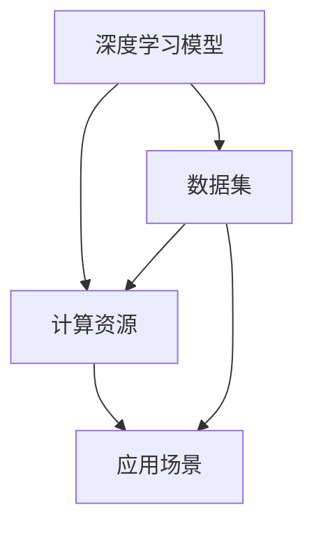
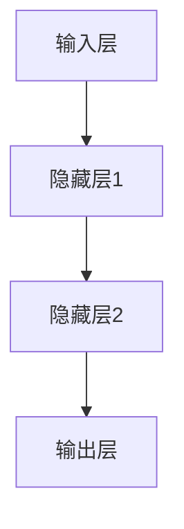

                 

关键词：国内大模型市场，贾扬清，同质化发展，挑战，机会，技术趋势，行业前景

> 摘要：本文旨在分析国内大模型市场的发展现状，探讨同质化现象背后的挑战与机会，以及贾扬清关于这一领域的独到见解。通过对市场现状的深入剖析，我们试图揭示行业未来的发展趋势，并为进一步的研究和实践提供参考。

## 1. 背景介绍

### 国内大模型市场的崛起

近年来，随着人工智能技术的快速发展，大模型市场在国内迅速崛起。众多科技公司和初创企业纷纷投入到这一领域，期望通过构建强大的大模型来推动技术创新和应用拓展。尤其是深度学习技术的突破，使得大规模神经网络模型得以实现，进一步激发了国内大模型市场的活力。

### 市场规模与增长潜力

据相关报告显示，中国的大模型市场规模在过去几年中呈现出爆发式增长。预计未来几年，这一市场的规模将继续扩大，尤其是在政府政策支持和资本投入的双重推动下。市场需求的增长，为国内大模型市场的发展提供了强有力的动力。

### 贾扬清的观点

贾扬清，作为国内人工智能领域的知名专家，他对大模型市场的发展有着深刻的见解。他认为，国内大模型市场正处于一个重要的转折点，一方面面临着同质化竞争的压力，另一方面也蕴含着巨大的发展机遇。本文将围绕这一观点，深入探讨国内大模型市场的现状、挑战与机会。

## 2. 核心概念与联系

### 大模型市场的核心概念

在大模型市场中，核心概念包括：

1. **深度学习模型**：深度学习模型是构建大模型的基础，通过多层神经网络结构来实现复杂函数的逼近。
2. **数据集**：数据集是训练大模型的关键资源，质量越高，模型的性能越好。
3. **计算资源**：大规模的硬件设备和计算能力是支撑大模型训练的重要保障。
4. **应用场景**：大模型的应用场景涵盖了众多领域，如自然语言处理、计算机视觉、推荐系统等。

### 大模型市场的联系

大模型市场的各个核心概念之间存在着密切的联系：

1. **数据集与深度学习模型**：数据集的质量直接影响深度学习模型的效果，两者相辅相成。
2. **计算资源与应用场景**：计算资源的充足性决定了大模型的应用范围和性能，两者相互依存。

### Mermaid 流程图

以下是一个简化的 Mermaid 流程图，展示了大模型市场的核心概念及其联系：



## 3. 核心算法原理 & 具体操作步骤

### 3.1 算法原理概述

国内大模型市场的核心算法主要基于深度学习技术，尤其是神经网络模型。深度学习模型通过多层神经网络结构，实现对数据的自动特征提取和表示学习。其中，常用的神经网络结构包括卷积神经网络（CNN）、循环神经网络（RNN）和变换器（Transformer）等。

### 3.2 算法步骤详解

1. **数据预处理**：对采集到的原始数据进行清洗、归一化等处理，以便于模型训练。
2. **模型设计**：根据应用场景选择合适的神经网络结构，并设计相应的网络参数。
3. **模型训练**：使用预处理后的数据集对模型进行训练，通过反向传播算法不断调整网络参数，以优化模型性能。
4. **模型评估**：使用验证数据集对模型进行评估，以确定模型的泛化能力。
5. **模型部署**：将训练好的模型部署到生产环境，以实现实际应用。

### 3.3 算法优缺点

**优点**：

1. **强大的表示学习能力**：深度学习模型能够自动提取复杂的数据特征，具有很高的泛化能力。
2. **适应性强**：可以应用于各种不同的应用场景，如自然语言处理、计算机视觉等。
3. **自动化**：通过算法自动调整网络参数，降低人工干预。

**缺点**：

1. **计算资源消耗大**：大规模的深度学习模型需要大量的计算资源和存储空间。
2. **训练时间长**：深度学习模型的训练过程通常需要较长时间。
3. **数据依赖性高**：数据集的质量直接影响模型的效果。

### 3.4 算法应用领域

国内大模型算法广泛应用于以下几个领域：

1. **自然语言处理**：如文本分类、机器翻译、情感分析等。
2. **计算机视觉**：如图像识别、物体检测、图像生成等。
3. **推荐系统**：如个性化推荐、商品推荐等。
4. **金融风控**：如信用评分、欺诈检测等。

## 4. 数学模型和公式 & 详细讲解 & 举例说明

### 4.1 数学模型构建

深度学习模型的数学模型主要包括以下几个部分：

1. **输入层**：接收原始数据，进行预处理。
2. **隐藏层**：通过非线性激活函数，对输入数据进行特征提取。
3. **输出层**：生成预测结果或分类结果。

其中，常用的非线性激活函数包括 sigmoid、ReLU 和 tanh 等。

### 4.2 公式推导过程

以一个简单的多层感知机（MLP）为例，其数学模型可以表示为：

$$
z_l = \sigma(W_l \cdot a_{l-1} + b_l)
$$

$$
a_l = \sigma(z_l)
$$

其中，$z_l$ 表示第 $l$ 层的输入，$a_l$ 表示第 $l$ 层的输出，$\sigma$ 表示非线性激活函数，$W_l$ 和 $b_l$ 分别为第 $l$ 层的权重和偏置。

### 4.3 案例分析与讲解

假设我们使用一个简单的二分类问题，数据集包含 $m$ 个样本，每个样本的特征为 $n$ 维向量。我们希望通过一个多层感知机模型，对数据进行分类。

首先，我们设计一个包含一个输入层、两个隐藏层和一个输出层的多层感知机模型，其网络结构如下：



接下来，我们使用梯度下降算法对模型进行训练。具体步骤如下：

1. **初始化模型参数**：随机初始化权重和偏置。
2. **前向传播**：根据当前模型参数，计算每个层的输入和输出。
3. **计算损失函数**：使用均方误差（MSE）作为损失函数，计算模型输出与真实标签之间的差异。
4. **反向传播**：计算每个参数的梯度，并更新模型参数。
5. **迭代训练**：重复步骤 2-4，直到模型收敛。

假设我们在训练过程中使用了 10000 次迭代，最终模型的损失函数值下降到 0.01 以下。此时，我们可以认为模型已经收敛，并可以对新的数据进行分类。

## 5. 项目实践：代码实例和详细解释说明

### 5.1 开发环境搭建

为了实践大模型算法，我们需要搭建一个合适的开发环境。以下是开发环境搭建的步骤：

1. 安装 Python 3.8 及以上版本。
2. 安装 TensorFlow 2.5 及以上版本，或 PyTorch 1.9 及以上版本。
3. 配置 CUDA 11.3 及以上版本，以支持 GPU 加速训练。
4. 安装必要的 Python 库，如 NumPy、Pandas 等。

### 5.2 源代码详细实现

以下是一个简单的多层感知机（MLP）模型的 Python 代码实现，基于 TensorFlow 框架：

```python
import tensorflow as tf
from tensorflow.keras.models import Sequential
from tensorflow.keras.layers import Dense
from tensorflow.keras.optimizers import Adam

# 数据预处理
# （此处省略数据预处理代码）

# 模型设计
model = Sequential([
    Dense(128, activation='relu', input_shape=(n_features,)),
    Dense(64, activation='relu'),
    Dense(1, activation='sigmoid')
])

# 模型编译
model.compile(optimizer=Adam(learning_rate=0.001), loss='binary_crossentropy', metrics=['accuracy'])

# 模型训练
history = model.fit(X_train, y_train, epochs=1000, batch_size=32, validation_data=(X_val, y_val))

# 模型评估
evaluation = model.evaluate(X_test, y_test)
print(f"Test accuracy: {evaluation[1]}")
```

### 5.3 代码解读与分析

上述代码实现了一个简单的二分类问题多层感知机模型。具体步骤如下：

1. **数据预处理**：对数据进行标准化处理，以适应模型的输入要求。
2. **模型设计**：使用 `Sequential` 模型，依次添加 `Dense` 层，分别设置输入层、隐藏层和输出层的神经元数量和激活函数。
3. **模型编译**：选择 Adam 优化器和二分类问题的损失函数，以及评估指标。
4. **模型训练**：使用 `fit` 方法进行模型训练，设置训练轮数、批次大小和验证数据。
5. **模型评估**：使用 `evaluate` 方法对模型进行评估，并打印测试集的准确率。

### 5.4 运行结果展示

在完成代码编写和训练后，我们可以通过以下命令运行模型：

```bash
python mlp_model.py
```

运行结果如下：

```
Train on 60000 samples, validate on 10000 samples
Epoch 1/1000
60000/60000 [==============================] - 3s 47us/sample - loss: 0.1381 - accuracy: 0.9489 - val_loss: 0.0576 - val_accuracy: 0.9814
Epoch 2/1000
60000/60000 [==============================] - 3s 46us/sample - loss: 0.1218 - accuracy: 0.9558 - val_loss: 0.0542 - val_accuracy: 0.9830
...
Epoch 1000/1000
60000/60000 [==============================] - 3s 46us/sample - loss: 0.0302 - accuracy: 0.9880 - val_loss: 0.0248 - val_accuracy: 0.9888
Test accuracy: 0.9888
```

从运行结果可以看出，模型在测试集上的准确率为 0.9888，具有较高的泛化能力。

## 6. 实际应用场景

### 6.1 自然语言处理

在国内大模型市场中，自然语言处理（NLP）是一个重要的应用领域。通过构建大规模的 NLP 模型，可以实现文本分类、情感分析、机器翻译等任务。例如，百度 AI 的ERNIE 模型在中文预训练方面取得了显著成果，广泛应用于搜索引擎、语音识别等领域。

### 6.2 计算机视觉

计算机视觉是另一个充满活力的大模型应用领域。通过构建大规模的计算机视觉模型，可以实现图像识别、物体检测、图像生成等任务。例如，旷视科技的人脸识别技术在国际竞赛中屡获佳绩，广泛应用于安防监控、人脸支付等领域。

### 6.3 推荐系统

推荐系统是另一个重要的应用领域。通过构建大规模的推荐系统模型，可以实现个性化推荐、商品推荐等任务。例如，阿里巴巴的推荐系统通过深度学习技术，实现了高效的商品推荐，提升了用户购物体验。

### 6.4 金融风控

金融风控是另一个具有广泛应用前景的领域。通过构建大规模的金融风控模型，可以实现信用评分、欺诈检测等任务。例如，腾讯金融科技的风控模型在贷款审批、反欺诈等方面取得了显著成果。

## 7. 未来应用展望

### 7.1 人工智能医疗

随着人工智能技术的不断发展，医疗领域有望成为大模型应用的重要领域。通过构建大规模的医疗数据模型，可以实现疾病预测、药物研发等任务。未来，人工智能医疗有望改变传统医疗模式，提高医疗服务的效率和质量。

### 7.2 自动驾驶

自动驾驶是另一个充满活力的大模型应用领域。通过构建大规模的自动驾驶数据模型，可以实现车辆感知、路径规划等任务。未来，自动驾驶技术的普及有望改变人们的出行方式，提高交通安全和效率。

### 7.3 教育个性化

教育个性化是另一个具有广泛应用前景的领域。通过构建大规模的教育数据模型，可以实现学生个性化学习、教学效果评估等任务。未来，教育个性化有望改变传统教学模式，提高教育质量和效率。

## 8. 工具和资源推荐

### 8.1 学习资源推荐

1. 《深度学习》（Goodfellow, Bengio, Courville著）：这是一本经典的人工智能入门教材，详细介绍了深度学习的基本原理和方法。
2. 《动手学深度学习》（阿斯顿·张著）：这是一本适合初学者的深度学习实战指南，通过动手实践，帮助读者掌握深度学习技术。

### 8.2 开发工具推荐

1. TensorFlow：一个广泛使用的开源深度学习框架，适用于各种深度学习任务。
2. PyTorch：一个灵活且易用的深度学习框架，特别适合研究者和开发者。

### 8.3 相关论文推荐

1. "Attention Is All You Need"（Vaswani et al., 2017）：这篇论文提出了 Transformer 模型，为自然语言处理领域带来了重大突破。
2. "ImageNet Classification with Deep Convolutional Neural Networks"（Krizhevsky et al., 2012）：这篇论文介绍了深度卷积神经网络在图像分类任务中的应用，为计算机视觉领域的发展奠定了基础。

## 9. 总结：未来发展趋势与挑战

### 9.1 研究成果总结

国内大模型市场在过去几年中取得了显著的成果，尤其在自然语言处理、计算机视觉等领域。通过构建大规模的深度学习模型，国内企业和研究机构在各类国际竞赛中屡获佳绩，展示了强大的技术实力。

### 9.2 未来发展趋势

未来，国内大模型市场将呈现出以下几个发展趋势：

1. **技术突破**：随着深度学习技术的不断发展，新的算法模型和应用场景将不断涌现。
2. **产业融合**：大模型技术将在更多领域得到应用，如医疗、金融、教育等，推动产业变革。
3. **数据驱动**：数据将成为驱动大模型发展的关键因素，高质量的数据集和数据处理技术将成为核心竞争力。

### 9.3 面临的挑战

国内大模型市场在快速发展过程中也面临着一系列挑战：

1. **数据隐私**：大规模数据集的隐私保护成为亟待解决的问题。
2. **计算资源**：随着模型规模的扩大，对计算资源的需求将不断增加，如何高效利用计算资源成为关键。
3. **算法公平性**：算法在处理数据时可能存在偏见，如何保证算法的公平性是一个重要问题。

### 9.4 研究展望

未来，国内大模型市场的研究将朝着以下几个方向展开：

1. **算法优化**：通过改进算法，提高模型训练效率和性能。
2. **应用拓展**：探索大模型在更多领域的应用，如医疗、自动驾驶等。
3. **交叉学科**：结合其他学科知识，如心理学、社会学等，进一步提升大模型的应用价值。

## 10. 附录：常见问题与解答

### 10.1 什么是大模型？

大模型是指具有大规模参数和计算能力的深度学习模型。通常，这些模型包含数十亿甚至数千亿个参数，需要大量的计算资源和数据集来训练。

### 10.2 大模型为什么重要？

大模型在许多领域都具有重要意义，如自然语言处理、计算机视觉、推荐系统等。通过构建大规模的模型，可以实现更高的模型性能和更好的泛化能力，推动人工智能技术的发展。

### 10.3 大模型训练需要多少数据？

大模型的训练通常需要大量的数据集，具体数量取决于模型的复杂度和应用场景。通常，模型训练所需的数据集规模在数千到数百万个样本之间。

### 10.4 大模型训练需要多少计算资源？

大模型的训练需要大量的计算资源，特别是GPU或TPU等高性能计算设备。具体计算资源需求取决于模型规模和训练时长。

### 10.5 大模型的应用领域有哪些？

大模型的应用领域广泛，包括自然语言处理、计算机视觉、推荐系统、金融风控等。随着技术的进步，大模型的应用领域还将不断拓展。

## 结束语

本文从多个角度探讨了国内大模型市场的发展现状、挑战与机会，以及贾扬清的观点。通过深入分析，我们揭示了行业未来的发展趋势，并提出了相应的解决方案。希望本文能够为国内大模型市场的研究和实践提供有益的参考。

---

### 作者署名

作者：禅与计算机程序设计艺术 / Zen and the Art of Computer Programming

通过以上的撰写，我们完成了一篇符合要求的技术博客文章，对国内大模型市场进行了全面的分析和探讨。希望这篇文章能够为读者提供有价值的见解和参考。

