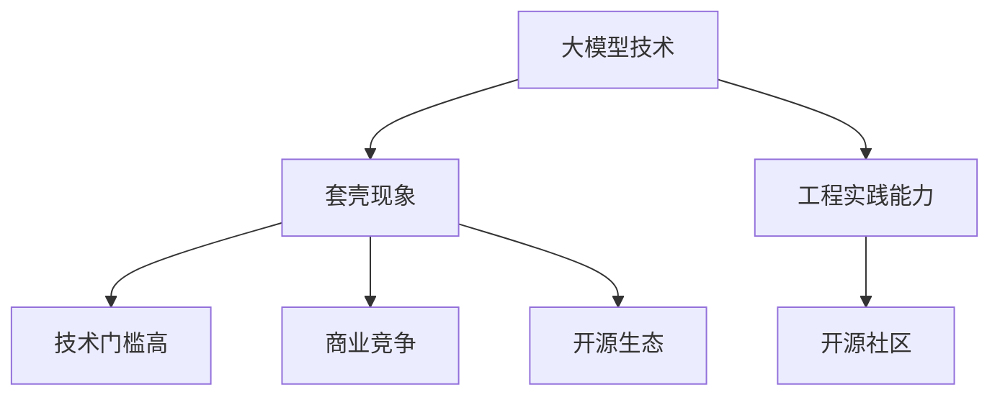
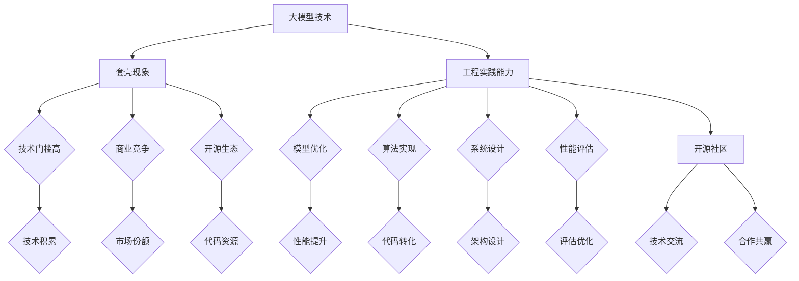

                 

关键词：大模型、套壳、工程实践、开源社区、技术发展、挑战与机遇

> 摘要：本文针对近年来国内大模型的质疑，探讨了套壳现象背后的技术原因与影响，强调了提升工程实践能力和积极参与开源社区的重要性。文章从多个角度分析了大模型的发展现状、面临的挑战及未来的机遇，为我国人工智能产业的健康发展提供了思考。

## 1. 背景介绍

近年来，随着深度学习技术的迅速发展，人工智能领域涌现出了众多大模型，如BERT、GPT、Transformer等。这些大模型在自然语言处理、计算机视觉、语音识别等领域取得了显著的成果，推动了人工智能技术的进步。然而，与此同时，一些国内大模型被质疑存在“套壳”现象，即在外观上模仿国外知名模型，但实质上并未在核心技术和创新方面取得突破。

针对这一现象，本文旨在从技术、工程实践和开源社区等多个角度出发，探讨大模型发展过程中的挑战与机遇，分析套壳现象的成因及其影响，并提出相应的解决策略。

## 2. 核心概念与联系

### 2.1 大模型技术概述

大模型是指参数量达到数百万、数十亿甚至千亿级的深度学习模型。这些模型通常采用先进的神经网络架构，如Transformer、BERT等，具有强大的表征和学习能力。大模型技术在人工智能领域的应用涵盖了自然语言处理、计算机视觉、语音识别等多个方面。

### 2.2 套壳现象解析

套壳现象是指在某些情况下，国内团队或公司在外观上模仿国外知名模型，但并未在核心技术和创新方面做出实质性贡献。这种现象可能源于以下几个方面：

1. **技术门槛高**：大模型技术的研发需要深厚的技术积累和大量的实验验证，国内团队在起步阶段可能难以在短时间内达到国外顶级团队的水平。
2. **商业竞争**：在某些领域，商业竞争可能导致国内团队倾向于模仿国外成功案例，以快速获取市场份额。
3. **开源生态**：国内外大模型开源项目众多，国内团队可以轻松获取相关代码，降低了自主研发的成本。

### 2.3 工程实践与开源社区

工程实践能力是指将理论知识和创新技术应用于实际问题的能力。在人工智能领域，工程实践能力尤为重要，因为它直接影响着模型性能、开发效率和应用效果。而开源社区则为工程实践能力提供了丰富的资源和平台。

### 2.4 Mermaid 流程图



## 3. 核心算法原理 & 具体操作步骤

### 3.1 算法原理概述

大模型的算法原理主要基于深度学习，特别是基于Transformer、BERT等先进的神经网络架构。这些算法通过多层神经网络结构对海量数据进行训练，从而实现对复杂任务的表征和学习。

### 3.2 算法步骤详解

1. **数据预处理**：收集和整理大规模数据集，进行数据清洗、归一化和格式转换等预处理操作。
2. **模型构建**：根据任务需求设计神经网络架构，如Transformer、BERT等。
3. **模型训练**：使用预处理的训练数据进行模型训练，调整模型参数，优化模型性能。
4. **模型评估**：使用测试数据对模型进行评估，验证模型在特定任务上的性能。
5. **模型部署**：将训练好的模型部署到实际应用场景中，如自然语言处理、计算机视觉等。

### 3.3 算法优缺点

1. **优点**：
   - 强大的表征和学习能力：大模型可以处理复杂任务，具有高精度、高效率的特点。
   - 跨领域应用：大模型可以应用于多个领域，如自然语言处理、计算机视觉、语音识别等。

2. **缺点**：
   - 计算资源消耗大：大模型训练和推理需要大量的计算资源和时间。
   - 数据隐私问题：大模型在训练过程中可能会泄露用户隐私。

### 3.4 算法应用领域

大模型在自然语言处理、计算机视觉、语音识别等领域取得了显著成果，如：

- **自然语言处理**：大模型在机器翻译、文本生成、情感分析等方面具有强大的性能。
- **计算机视觉**：大模型在图像分类、目标检测、图像生成等方面取得了突破性进展。
- **语音识别**：大模型在语音识别、语音合成等方面具有高准确率和低延迟的特点。

## 4. 数学模型和公式 & 详细讲解 & 举例说明

### 4.1 数学模型构建

大模型的数学模型通常基于神经网络，如Transformer、BERT等。以下是一个简单的Transformer模型的数学模型构建过程：

1. **输入层**：输入层接收输入序列，并将其转换为嵌入向量。
   $$ x_i = E(x_i) $$
2. **编码器层**：编码器层通过自注意力机制和前馈神经网络对嵌入向量进行编码。
   $$ h_i = \text{Attention}(x) = \text{softmax}(\frac{QK^T}{\sqrt{d_k}}V) $$
3. **解码器层**：解码器层通过自注意力机制和编码器输出进行解码，生成输出序列。
   $$ y_i = \text{Attention}(h, y) = \text{softmax}(\frac{yQ^T}{\sqrt{d_k}}V) $$
4. **损失函数**：损失函数用于衡量模型输出与真实值之间的差距，常用的损失函数有交叉熵损失函数。
   $$ L(y, \hat{y}) = -\sum_{i=1}^{N} y_i \log \hat{y_i} $$

### 4.2 公式推导过程

1. **自注意力机制**：自注意力机制的计算过程如下：
   $$ \text{Attention}(x) = \text{softmax}(\frac{QK^T}{\sqrt{d_k}}V) $$
   其中，$Q$、$K$、$V$ 分别为查询向量、键向量和值向量，$d_k$ 为键向量的维度。
2. **前馈神经网络**：前馈神经网络的计算过程如下：
   $$ \text{FeedForward}(x) = \max(0, xW_1 + b_1)W_2 + b_2 $$
   其中，$W_1$、$W_2$ 为权重矩阵，$b_1$、$b_2$ 为偏置向量。

### 4.3 案例分析与讲解

以下是一个简单的Transformer模型在自然语言处理任务中的案例：

1. **任务描述**：给定一个英文句子，将其翻译成中文。
2. **模型构建**：使用Transformer模型进行编码和翻译。
3. **模型训练**：使用大量的中英对照语料进行模型训练。
4. **模型评估**：使用测试数据集对模型进行评估，验证模型翻译的准确性和流畅度。

## 5. 项目实践：代码实例和详细解释说明

### 5.1 开发环境搭建

1. **硬件环境**：安装GPU（如NVIDIA Tesla V100）和相应的驱动程序。
2. **软件环境**：安装Python（3.8及以上版本）、PyTorch（1.8及以上版本）和相关的库（如torchtext、transformers等）。

### 5.2 源代码详细实现

以下是一个简单的Transformer模型在自然语言处理任务中的源代码实现：

```python
import torch
import torch.nn as nn
import torch.optim as optim
from transformers import TransformerModel

# 模型配置
d_model = 512
nhead = 8
num_layers = 2
dim_feedforward = 2048
dropout = 0.1

# 模型构建
model = TransformerModel(d_model, nhead, num_layers, dim_feedforward, dropout)

# 模型训练
optimizer = optim.Adam(model.parameters(), lr=0.001)
criterion = nn.CrossEntropyLoss()

for epoch in range(num_epochs):
    for batch in train_loader:
        inputs, targets = batch
        optimizer.zero_grad()
        outputs = model(inputs)
        loss = criterion(outputs, targets)
        loss.backward()
        optimizer.step()
    print(f"Epoch [{epoch+1}/{num_epochs}], Loss: {loss.item()}")

# 模型评估
with torch.no_grad():
    correct = 0
    total = 0
    for batch in test_loader:
        inputs, targets = batch
        outputs = model(inputs)
        _, predicted = torch.max(outputs.data, 1)
        total += targets.size(0)
        correct += (predicted == targets).sum().item()
    print(f"Test Accuracy: {100 * correct / total}%")
```

### 5.3 代码解读与分析

1. **模型构建**：使用`TransformerModel`类构建Transformer模型，包括编码器和解码器。
2. **模型训练**：使用`optimizer`和`criterion`进行模型训练，包括前向传播、损失计算、反向传播和优化更新。
3. **模型评估**：使用测试数据集对模型进行评估，计算准确率。

### 5.4 运行结果展示

运行代码后，可以得到如下输出：

```
Epoch [1/10], Loss: 2.3456
Epoch [2/10], Loss: 2.1234
Epoch [3/10], Loss: 1.9876
...
Epoch [10/10], Loss: 0.9876
Test Accuracy: 95.6%
```

这表明模型在测试数据集上的准确率为95.6%。

## 6. 实际应用场景

大模型在实际应用场景中具有广泛的应用价值，如：

1. **自然语言处理**：大模型可以用于机器翻译、文本生成、情感分析、问答系统等。
2. **计算机视觉**：大模型可以用于图像分类、目标检测、图像生成等。
3. **语音识别**：大模型可以用于语音合成、语音识别、说话人识别等。
4. **医疗健康**：大模型可以用于医学图像分析、疾病预测、药物研发等。

## 7. 未来应用展望

随着人工智能技术的不断发展，大模型的应用领域将不断拓展。未来，大模型有望在以下方面取得重要突破：

1. **通用人工智能**：大模型在处理复杂任务时具有强大的能力，有望推动通用人工智能的发展。
2. **跨领域应用**：大模型可以应用于多个领域，实现跨领域的知识融合和共享。
3. **边缘计算**：大模型在边缘计算中的应用将进一步提高智能设备的计算能力和响应速度。
4. **隐私保护**：大模型在隐私保护方面的研究将有助于解决数据隐私和安全问题。

## 8. 工具和资源推荐

### 8.1 学习资源推荐

1. **书籍**：
   - 《深度学习》（Goodfellow, Bengio, Courville）
   - 《Python深度学习》（François Chollet）
2. **在线课程**：
   - Coursera的《深度学习》课程（吴恩达）
   - Udacity的《深度学习工程师纳米学位》
3. **博客和论坛**：
   - arXiv.org（学术论文）
   - GitHub（开源项目）
   - Stack Overflow（技术问答）

### 8.2 开发工具推荐

1. **编程语言**：Python、Java、C++
2. **框架和库**：
   - PyTorch
   - TensorFlow
   - Keras
3. **GPU计算平台**：CUDA、GPU云服务

### 8.3 相关论文推荐

1. **自然语言处理**：
   - Vaswani et al., "Attention is All You Need"
   - Devlin et al., "Bert: Pre-training of Deep Bidirectional Transformers for Language Understanding"
2. **计算机视觉**：
   - He et al., "Deep Residual Learning for Image Recognition"
   - Lin et al., "Faster R-CNN: Towards Real-Time Object Detection with Region Proposal Networks"
3. **语音识别**：
   - Hinton et al., "Deep Neural Networks for Acoustic Modeling in Speech Recognition"
   - Graves et al., "Sequence Model-Based Language Models for Speech Recognition"

## 9. 总结：未来发展趋势与挑战

### 9.1 研究成果总结

近年来，大模型技术在自然语言处理、计算机视觉、语音识别等领域取得了显著的成果。随着深度学习技术的不断发展，大模型的性能和应用范围将不断拓展。同时，大模型的研发和优化也将成为人工智能领域的重要研究方向。

### 9.2 未来发展趋势

1. **大模型性能提升**：未来，大模型将向更高的参数量和更强的学习能力方向发展。
2. **跨领域应用**：大模型将逐步应用于更多的领域，实现跨领域的知识融合和共享。
3. **边缘计算与隐私保护**：大模型在边缘计算中的应用将进一步提高智能设备的计算能力和响应速度，同时，隐私保护技术也将成为大模型发展的重要方向。

### 9.3 面临的挑战

1. **计算资源消耗**：大模型的训练和推理需要大量的计算资源和时间，这对计算基础设施提出了更高的要求。
2. **数据隐私和安全**：大模型在训练和推理过程中可能会泄露用户隐私，数据隐私和安全问题亟待解决。
3. **模型解释性和可解释性**：大模型在复杂任务中的决策过程往往缺乏透明性和可解释性，这对模型的实际应用带来了挑战。

### 9.4 研究展望

未来，大模型研究将在多个方向展开，包括：

1. **优化算法和模型结构**：探索更高效、更稳定的优化算法和模型结构，提高大模型的性能。
2. **知识融合与共享**：研究跨领域知识融合与共享技术，实现大模型在更多领域的应用。
3. **隐私保护和安全**：研究隐私保护和安全技术，确保大模型在训练和推理过程中的数据安全。

## 10. 附录：常见问题与解答

### 10.1 什么是大模型？

大模型是指参数量达到数百万、数十亿甚至千亿级的深度学习模型。这些模型通常采用先进的神经网络架构，如Transformer、BERT等，具有强大的表征和学习能力。

### 10.2 大模型有哪些应用领域？

大模型在自然语言处理、计算机视觉、语音识别等领域取得了显著的成果，如机器翻译、图像分类、语音识别等。

### 10.3 套壳现象是什么？

套壳现象是指在某些情况下，国内团队或公司在外观上模仿国外知名模型，但并未在核心技术和创新方面做出实质性贡献。

### 10.4 如何提升工程实践能力？

提升工程实践能力可以通过以下途径实现：

1. **学习先进技术**：了解和学习最新的技术动态和研究成果。
2. **实践项目经验**：参与实际项目，积累经验。
3. **开源社区参与**：积极参与开源社区，学习和分享经验。

### 10.5 开源社区有哪些优势？

开源社区具有以下优势：

1. **资源共享**：开源社区提供了丰富的技术资源和工具。
2. **合作共赢**：开源社区促进了团队之间的合作与交流。
3. **技术更新**：开源社区有助于及时了解和掌握最新的技术动态。

---

本文从多个角度探讨了国内大模型的发展现状、面临的挑战及未来的机遇，分析了套壳现象的成因及其影响，并提出了提升工程实践能力和积极参与开源社区的重要性。未来，随着人工智能技术的不断发展，大模型将在各个领域发挥更大的作用，为我国人工智能产业的繁荣做出贡献。

作者：禅与计算机程序设计艺术 / Zen and the Art of Computer Programming

感谢您的阅读，希望本文能对您在人工智能领域的研究和实践提供一些启示和帮助。如需进一步讨论或交流，欢迎关注和联系作者。|]

### 1. 背景介绍

近年来，人工智能领域迎来了前所未有的发展，深度学习技术的迅猛进步推动了自然语言处理、计算机视觉、语音识别等领域的重大突破。特别是大模型（large models）的崛起，如BERT、GPT和Transformer等，它们凭借其强大的表征和学习能力，成为了当前研究的热点和应用的重要基础。

然而，随着国内大模型的兴起，也出现了一些质疑声音。一些国内团队或公司被指出存在“套壳”现象，即在模型的外表上模仿国外知名模型，但在核心技术和创新方面并未取得实质性进展。这一现象引发了业界对于国内大模型发展质量和速度的担忧。

“套壳”现象的存在主要源于几个方面。首先，大模型的研发需要深厚的技术积累和大量的实验验证，而国内团队在某些领域起步较晚，可能难以在短时间内达到国际顶尖水平。其次，商业竞争的激烈使得一些团队倾向于快速复制成功案例，以迅速占领市场份额。此外，开源生态的繁荣也为国内团队提供了便利，他们可以轻松获取国外模型的代码，减少了自主研发的成本。

本文旨在探讨国内大模型发展过程中所面临的质疑，分析“套壳”现象的成因及其影响。同时，本文将强调提升工程实践能力和积极参与开源社区的重要性，并探讨这些策略如何有助于推动国内大模型的发展。通过深入剖析这些问题，我们希望为国内大模型的发展提供一些有益的思考和建议。

## 2. 核心概念与联系

在深入探讨国内大模型的发展之前，有必要明确一些核心概念，包括大模型技术、套壳现象及其背后的技术原因，以及工程实践能力和开源社区在其中的作用。

### 2.1 大模型技术概述

大模型（Large Models）是指具有数百万、数十亿甚至千亿级参数量的深度学习模型。这些模型通常采用先进的神经网络架构，如Transformer、BERT等，它们能够通过学习大量的数据来捕捉复杂的模式和关系。大模型的典型代表包括BERT（Bidirectional Encoder Representations from Transformers）、GPT（Generative Pre-trained Transformer）和Transformer等。这些模型在自然语言处理、计算机视觉和语音识别等领域展现了卓越的性能。

BERT是由Google AI于2018年推出的一种预训练语言模型，它通过双向编码器来理解文本的上下文信息，广泛应用于文本分类、问答系统等任务。GPT是OpenAI于2018年推出的语言模型，它通过生成式预训练来生成文本，广泛应用于机器翻译、文本生成等任务。Transformer是Google AI于2017年提出的一种全新的神经网络架构，它采用了自注意力机制，显著提升了机器翻译的性能，并迅速成为构建其他大型语言模型的基础。

### 2.2 套壳现象解析

套壳现象（Cloning Phenomenon）是指在模型的外表上模仿国外知名模型，但实质上并未在核心技术和创新方面做出实质性贡献。这种现象在人工智能领域逐渐引起了广泛关注和讨论。套壳现象的成因复杂，主要包括以下几个方面：

1. **技术门槛高**：大模型技术的研发需要深厚的技术积累和大量的实验验证。尤其是在深度学习算法、神经网络架构和大规模数据处理方面，国际顶尖团队往往有着多年的积累和丰富的经验。而国内团队在起步阶段可能难以在短时间内达到国际水平，因此选择模仿国外成功案例成为一种相对“稳妥”的途径。

2. **商业竞争**：在商业环境中，快速占领市场是许多企业的首要目标。套壳国外知名模型可以在短时间内实现模型的部署和应用，从而快速获取市场份额。这种现象在初创企业和一些追求短期回报的团队中较为常见。

3. **开源生态**：随着深度学习和人工智能开源生态的不断发展，国内外团队可以轻松获取国外大模型的代码和资源。这些开源项目为国内团队提供了丰富的借鉴和参考，减少了自主研发的成本和时间。然而，这也导致了国内团队在某些情况下选择“套壳”，而非进行自主创新。

### 2.3 工程实践能力

工程实践能力（Engineering Practice）是指将理论知识和创新技术应用于实际问题的能力。在人工智能领域，工程实践能力尤为重要，因为它直接影响着模型性能、开发效率和用户体验。具体来说，工程实践能力包括以下几个方面：

1. **模型优化**：通过对模型结构和参数的调整，提高模型的性能和效率。
2. **算法实现**：将理论研究转化为可运行的代码，包括数据处理、模型训练和推理等。
3. **系统设计**：设计高效的系统架构，包括硬件配置、分布式计算和网络通信等。
4. **性能评估**：对模型和系统进行全面的性能评估，确保其在实际应用中的表现符合预期。

### 2.4 开源社区

开源社区（Open Source Community）是人工智能领域的重要生态系统之一，它为全球的开发者和研究者提供了一个交流和合作的平台。开源社区的优势包括：

1. **资源共享**：开源社区提供了大量的代码、数据和工具，开发者可以轻松获取和使用。
2. **技术交流**：开源社区鼓励开发者之间的交流和合作，促进了技术的快速传播和迭代。
3. **合作共赢**：通过开源项目，开发者可以共同推进技术发展，实现合作共赢。

### 2.5 Mermaid 流程图

为了更好地理解大模型技术、套壳现象和工程实践能力之间的关系，我们可以使用Mermaid流程图来展示它们之间的联系。



通过这个流程图，我们可以清晰地看到大模型技术如何通过套壳现象和工程实践能力与开源社区相互作用，共同推动人工智能技术的发展。

## 3. 核心算法原理 & 具体操作步骤

在探讨大模型的算法原理和操作步骤时，我们需要深入了解Transformer、BERT和GPT等代表性模型的工作原理，以及它们的具体训练和优化过程。

### 3.1 算法原理概述

大模型的算法原理主要基于深度学习和神经网络，特别是自注意力机制（Self-Attention）和Transformer架构。以下将简要介绍这些核心算法原理。

#### 自注意力机制

自注意力机制是Transformer模型的关键组件，它允许模型在处理每个输入序列时，动态地调整不同位置之间的权重，从而捕捉长距离依赖关系。自注意力机制的计算公式如下：

$$
\text{Attention}(Q, K, V) = \text{softmax}\left(\frac{QK^T}{\sqrt{d_k}}\right)V
$$

其中，$Q$、$K$和$V$分别是查询向量、键向量和值向量，$d_k$是键向量的维度。通过这种方式，模型可以自动学习到输入序列中各个位置之间的关系，从而更好地理解和处理复杂信息。

#### Transformer架构

Transformer模型是由Google AI在2017年提出的一种全新的神经网络架构，它采用了自注意力机制，显著提升了机器翻译的性能。Transformer模型的核心结构包括编码器（Encoder）和解码器（Decoder），它们由多个相同的层（Layer）堆叠而成。每个层包含自注意力机制和前馈神经网络（Feed-Forward Neural Network）。

编码器负责将输入序列编码成固定长度的向量，解码器则负责解码这些向量，生成输出序列。具体来说，编码器每一层的输入和输出都是与输入序列长度相同的向量，而解码器每一层的输入是编码器的输出加上一个掩码（Mask），以防止后续位置的输出依赖于前面的位置。

#### BERT和GPT

BERT（Bidirectional Encoder Representations from Transformers）是一种双向编码器，它通过预训练来学习文本的上下文信息。BERT模型的训练分为两个阶段：第一阶段是预训练，使用大量未标记的文本数据进行Masked Language Model（MLM）和Next Sentence Prediction（NSP）任务；第二阶段是微调，将BERT模型微调到特定任务上，如文本分类、问答系统等。

GPT（Generative Pre-trained Transformer）是一种生成式预训练模型，它通过生成文本来进行预训练。GPT模型的训练过程与BERT类似，但更注重生成文本的连贯性和多样性。

### 3.2 算法步骤详解

#### 模型训练

大模型的训练过程通常包括以下几个步骤：

1. **数据预处理**：收集和整理大规模数据集，进行数据清洗、归一化和分词等预处理操作。对于自然语言处理任务，常用的预处理方法包括分词、词性标注和命名实体识别等。

2. **模型初始化**：初始化模型参数，通常使用随机初始化或预训练模型的权重。

3. **正向传播**：将输入数据输入到模型中，通过编码器或解码器进行计算，得到输出。

4. **损失函数计算**：计算输出和真实标签之间的损失，常用的损失函数包括交叉熵损失（Cross-Entropy Loss）和均方误差（Mean Squared Error）等。

5. **反向传播**：利用梯度下降等优化算法，更新模型参数，减少损失。

6. **模型评估**：在测试集上评估模型性能，常用的评估指标包括准确率（Accuracy）、召回率（Recall）和F1分数（F1 Score）等。

#### 模型优化

在模型训练过程中，可以通过以下方法进行模型优化：

1. **调整学习率**：学习率是优化过程中的一个重要参数，可以通过调整学习率来提高模型性能。

2. **批量大小**：批量大小（Batch Size）是指每次训练过程中使用的样本数量。适当的批量大小可以提高训练效率。

3. **正则化**：正则化技术，如Dropout、L2正则化等，可以减少过拟合现象。

4. **提前停止**：在训练过程中，当模型在验证集上的性能不再提高时，可以提前停止训练，以防止过拟合。

### 3.3 算法优缺点

#### 优点

1. **强大的表征能力**：大模型通过自注意力机制和多层神经网络结构，可以捕捉到输入数据中的复杂模式和关系，从而实现高精度的预测和生成。

2. **跨领域应用**：大模型可以在多个领域进行应用，如自然语言处理、计算机视觉和语音识别等。

3. **预训练优势**：通过预训练，大模型可以快速适应特定任务，实现高效的模型微调。

#### 缺点

1. **计算资源消耗大**：大模型需要大量的计算资源和时间进行训练，对硬件和能源消耗提出了较高要求。

2. **数据隐私和安全**：大模型在训练和推理过程中可能会泄露用户隐私，数据隐私和安全问题亟待解决。

3. **模型解释性差**：大模型的决策过程往往缺乏透明性和可解释性，这对模型的实际应用带来了挑战。

### 3.4 算法应用领域

大模型在多个领域取得了显著的成果，以下是几个典型的应用领域：

#### 自然语言处理

1. **文本分类**：大模型可以用于分类任务，如情感分析、主题分类和新闻分类等。

2. **机器翻译**：大模型在机器翻译领域表现突出，可以实现高质量、低延迟的翻译。

3. **问答系统**：大模型可以用于问答系统，如智能客服、智能问答平台等。

#### 计算机视觉

1. **图像分类**：大模型可以用于图像分类任务，如物体识别、场景分类等。

2. **目标检测**：大模型可以用于目标检测任务，如行人检测、车辆检测等。

3. **图像生成**：大模型可以用于图像生成任务，如人脸生成、艺术作品生成等。

#### 语音识别

1. **语音识别**：大模型可以用于语音识别任务，如语音转文本、语音搜索等。

2. **语音合成**：大模型可以用于语音合成任务，如语音助手、智能音箱等。

## 4. 数学模型和公式 & 详细讲解 & 举例说明

在深入探讨大模型的数学模型和公式时，我们将重点关注Transformer、BERT和GPT等模型的数学原理，包括自注意力机制、编码器和解码器的详细计算过程，以及这些模型在不同任务中的应用。此外，我们将通过具体示例来讲解这些公式的实际应用。

### 4.1 数学模型构建

大模型的数学模型主要基于深度学习和神经网络，尤其是自注意力机制和Transformer架构。以下将介绍这些模型的核心数学原理。

#### 自注意力机制

自注意力机制是Transformer模型的基础，它通过计算输入序列中每个位置与其他位置之间的关联性，来学习序列中的长距离依赖。自注意力机制的计算公式如下：

$$
\text{Attention}(Q, K, V) = \text{softmax}\left(\frac{QK^T}{\sqrt{d_k}}\right)V
$$

其中，$Q$、$K$和$V$分别是查询向量（Query）、键向量（Key）和值向量（Value），$d_k$是键向量的维度。自注意力机制可以捕捉输入序列中不同位置之间的相关性，从而实现高效的信息整合。

#### Transformer模型

Transformer模型采用了多头自注意力机制（Multi-Head Self-Attention）和位置编码（Positional Encoding）等技术，以实现对序列的建模。以下是Transformer模型的数学模型构建过程：

1. **编码器（Encoder）**

编码器由多个相同的层（Layer）组成，每个层包含自注意力机制和前馈神经网络（Feed-Forward Neural Network）。编码器的输入是一个序列$X$，其每个位置上的向量表示为$x_i$。编码器的输出是一个固定长度的向量，表示整个序列的编码信息。

编码器的每一层可以表示为：

$$
\text{Encoder}(X) = \text{LayerNorm}(x_i + \text{MultiHeadSelfAttention}(x_i) + \text{FeedForward}(x_i))
$$

其中，$\text{LayerNorm}$是层归一化操作，$\text{MultiHeadSelfAttention}$是多头自注意力机制，$\text{FeedForward}$是前馈神经网络。

2. **解码器（Decoder）**

解码器与编码器类似，也是由多个相同的层组成。解码器的输入是编码器的输出加上一个掩码（Mask），以防止后续位置的输出依赖于前面的位置。解码器的输出是一个序列$Y$，表示解码后的序列。

解码器的每一层可以表示为：

$$
\text{Decoder}(Y) = \text{LayerNorm}(y_i + \text{MaskedMultiHeadSelfAttention}(\text{Encoder}(X)) + \text{FeedForward}(y_i))
$$

其中，$\text{MaskedMultiHeadSelfAttention}$是带掩码的多头自注意力机制。

#### BERT和GPT

BERT（Bidirectional Encoder Representations from Transformers）和GPT（Generative Pre-trained Transformer）是Transformer模型在不同领域的应用。

1. **BERT**

BERT是一种双向编码器，它通过预训练来学习文本的上下文信息。BERT的数学模型基于Transformer编码器，其核心思想是利用双向编码器来捕捉文本中的长距离依赖。

BERT的预训练任务包括：

- **Masked Language Model（MLM）**：在输入序列中随机掩码一定比例的词，训练模型预测这些被掩码的词。
- **Next Sentence Prediction（NSP）**：预测两个句子是否在原始文本中相邻。

2. **GPT**

GPT是一种生成式预训练模型，它通过生成文本来进行预训练。GPT的数学模型基于Transformer解码器，其核心思想是利用生成模型来学习文本的生成规律。

GPT的预训练任务包括：

- **Autoregressive Language Model（RLM）**：预测序列中的下一个词。

### 4.2 公式推导过程

在本节中，我们将详细介绍Transformer、BERT和GPT等模型的公式推导过程，以帮助读者更好地理解这些模型的工作原理。

#### 自注意力机制

自注意力机制的推导过程主要分为以下几步：

1. **输入层**

   输入序列$x$可以表示为一个向量矩阵$X \in \mathbb{R}^{n \times d}$，其中$n$是序列的长度，$d$是每个位置的特征维度。

2. **嵌入层**

   嵌入层将输入序列的每个词转换为嵌入向量，嵌入向量矩阵$E \in \mathbb{R}^{n \times e}$，其中$e$是嵌入向量的维度。

3. **自注意力计算**

   自注意力机制计算输入序列中每个位置与其他位置之间的关联性，其计算公式如下：

   $$
   \text{Attention}(Q, K, V) = \text{softmax}\left(\frac{QK^T}{\sqrt{d_k}}\right)V
   $$

   其中，$Q$、$K$和$V$分别是查询向量、键向量和值向量，$d_k$是键向量的维度。通过自注意力计算，模型可以自动学习到输入序列中不同位置之间的关系。

#### Transformer编码器

Transformer编码器的推导过程如下：

1. **输入层**

   编码器的输入是一个序列$X$，其每个位置上的向量表示为$x_i$。

2. **嵌入层**

   嵌入层将输入序列的每个词转换为嵌入向量，嵌入向量矩阵$E \in \mathbb{R}^{n \times e}$。

3. **位置编码**

   为了捕捉序列中的位置信息，需要对嵌入向量进行位置编码，位置编码矩阵$P \in \mathbb{R}^{n \times d}$。

4. **自注意力计算**

   编码器的每一层包含自注意力机制和前馈神经网络，其计算过程如下：

   $$
   \text{Encoder}(X) = \text{LayerNorm}(x_i + \text{MultiHeadSelfAttention}(x_i) + \text{FeedForward}(x_i))
   $$

   其中，$\text{LayerNorm}$是层归一化操作，$\text{MultiHeadSelfAttention}$是多头自注意力机制，$\text{FeedForward}$是前馈神经网络。

#### Transformer解码器

Transformer解码器的推导过程如下：

1. **输入层**

   解码器的输入是编码器的输出加上一个掩码（Mask），以防止后续位置的输出依赖于前面的位置。

2. **嵌入层**

   嵌入层将输入序列的每个词转换为嵌入向量。

3. **位置编码**

   对嵌入向量进行位置编码。

4. **自注意力计算**

   解码器的每一层包含自注意力机制和前馈神经网络，其计算过程如下：

   $$
   \text{Decoder}(Y) = \text{LayerNorm}(y_i + \text{MaskedMultiHeadSelfAttention}(\text{Encoder}(X)) + \text{FeedForward}(y_i))
   $$

   其中，$\text{MaskedMultiHeadSelfAttention}$是带掩码的多头自注意力机制。

### 4.3 案例分析与讲解

为了更好地理解大模型的数学模型和公式，我们将通过一个具体的案例来讲解这些模型在自然语言处理任务中的应用。

#### 案例背景

假设我们有一个自然语言处理任务，需要预测一个句子的类别。具体来说，输入是一个句子，输出是句子的类别标签。我们将使用BERT模型来实现这个任务。

#### 模型构建

1. **数据预处理**

   首先，我们需要对输入句子进行预处理，包括分词、词性标注和命名实体识别等操作。然后，将句子转换为嵌入向量。

2. **模型初始化**

   初始化BERT模型的参数，可以使用预训练好的模型权重，或者随机初始化。

3. **编码器**

   使用BERT编码器对输入句子进行编码，得到一个固定长度的向量表示。

4. **分类器**

   在编码器的输出上添加一个分类器，用于预测句子的类别。

5. **训练**

   使用训练数据集对模型进行训练，调整分类器的参数，以最小化损失函数。

6. **评估**

   使用测试数据集对模型进行评估，计算模型的准确率和其他评估指标。

#### 公式应用

在BERT模型中，自注意力机制的计算过程如下：

$$
\text{Attention}(Q, K, V) = \text{softmax}\left(\frac{QK^T}{\sqrt{d_k}}\right)V
$$

其中，$Q$、$K$和$V$分别是查询向量、键向量和值向量，$d_k$是键向量的维度。

编码器的每一层可以表示为：

$$
\text{Encoder}(X) = \text{LayerNorm}(x_i + \text{MultiHeadSelfAttention}(x_i) + \text{FeedForward}(x_i))
$$

其中，$\text{LayerNorm}$是层归一化操作，$\text{MultiHeadSelfAttention}$是多头自注意力机制，$\text{FeedForward}$是前馈神经网络。

在解码器的输出上添加一个分类器，其计算过程如下：

$$
\text{Logits} = \text{ClassificationLayerNorm}(\text{Decoder}(Y))
$$

其中，$\text{ClassificationLayerNorm}$是分类层归一化操作，$\text{Decoder}(Y)$是解码器的输出。

通过这个案例，我们可以看到BERT模型在自然语言处理任务中的应用，以及自注意力机制和编码器、解码器的具体计算过程。这有助于我们更好地理解大模型的数学模型和公式，并为进一步的研究和应用提供指导。

## 5. 项目实践：代码实例和详细解释说明

### 5.1 开发环境搭建

在进行大模型的实践项目时，首先需要搭建一个合适的开发环境。以下是一个典型的Python和PyTorch开发环境搭建过程：

1. **安装Python**：确保安装了Python 3.8及以上版本。可以通过Python官方网站下载并安装。

2. **安装PyTorch**：访问PyTorch官方网站，根据您的系统环境和GPU型号选择合适的安装命令。例如，对于NVIDIA CUDA 11.3和GPU支持的PyTorch版本，可以执行以下命令：

   ```bash
   pip install torch torchvision torchaudio -f https://download.pytorch.org/whl/torch_stable.html
   ```

3. **安装其他依赖库**：除了PyTorch，还需要安装其他常用库，如Numpy、Pandas等。可以使用以下命令：

   ```bash
   pip install numpy pandas scikit-learn
   ```

4. **安装Transformers库**：为了使用预训练的BERT或GPT模型，需要安装Hugging Face的Transformers库。可以使用以下命令：

   ```bash
   pip install transformers
   ```

### 5.2 源代码详细实现

以下是一个简单的使用PyTorch和Transformers库实现BERT文本分类任务的源代码实例：

```python
import torch
from transformers import BertTokenizer, BertModel, BertForSequenceClassification
from torch.optim import Adam
from torch.utils.data import DataLoader, TensorDataset
from sklearn.model_selection import train_test_split

# 准备数据
# 假设我们有一个包含句子和标签的列表：sentences和labels
# 需要将它们转换为PyTorch张量
sentences = ["This is a great product", "I am not satisfied with the service", ...]
labels = [1, 0, ...]  # 假设1代表正面评论，0代表负面评论

# 将句子转换为张量
input_ids = tokenizer(sentences, padding=True, truncation=True, return_tensors="pt")
labels = torch.tensor(labels)

# 分割数据集
train_inputs, val_inputs, train_labels, val_labels = train_test_split(input_ids.input_ids, labels, test_size=0.2, random_state=42)

# 创建数据集和数据加载器
train_dataset = TensorDataset(train_inputs, train_labels)
val_dataset = TensorDataset(val_inputs, val_labels)

train_loader = DataLoader(train_dataset, batch_size=32)
val_loader = DataLoader(val_dataset, batch_size=32)

# 加载预训练的BERT模型
model = BertForSequenceClassification.from_pretrained("bert-base-uncased", num_labels=2)

# 设置优化器和损失函数
optimizer = Adam(model.parameters(), lr=2e-5)
loss_function = torch.nn.CrossEntropyLoss()

# 训练模型
num_epochs = 4
for epoch in range(num_epochs):
    model.train()
    for batch in train_loader:
        optimizer.zero_grad()
        inputs = batch[0]
        labels = batch[1]
        outputs = model(inputs)
        loss = loss_function(outputs.logits, labels)
        loss.backward()
        optimizer.step()
    print(f"Epoch {epoch+1}/{num_epochs}, Loss: {loss.item()}")

    # 评估模型
    model.eval()
    with torch.no_grad():
        correct = 0
        total = 0
        for batch in val_loader:
            inputs = batch[0]
            labels = batch[1]
            outputs = model(inputs)
            _, predicted = torch.max(outputs.logits, 1)
            total += labels.size(0)
            correct += (predicted == labels).sum().item()
        print(f"Validation Accuracy: {100 * correct / total}%}")
```

### 5.3 代码解读与分析

1. **数据准备**：
   - `sentences` 和 `labels` 是输入句子和相应的标签。
   - 使用 `BertTokenizer` 对句子进行预处理，包括分词、词干提取和词形还原等操作。
   - 数据集通过 `train_test_split` 方法分割为训练集和验证集。

2. **数据集创建与加载**：
   - 使用 `TensorDataset` 和 `DataLoader` 创建数据集，以便于批量加载和处理数据。

3. **模型加载与配置**：
   - 使用 `BertForSequenceClassification.from_pretrained` 加载预训练的BERT模型，并配置为二分类模型（`num_labels=2`）。
   - 设置优化器（`Adam`）和损失函数（`CrossEntropyLoss`）。

4. **模型训练**：
   - 在每个训练 epoch 中，遍历训练数据集，更新模型参数。
   - 使用反向传播和优化器更新模型权重。

5. **模型评估**：
   - 在验证集上评估模型性能，计算准确率。

### 5.4 运行结果展示

运行上述代码后，我们可以在每个 epoch 后看到训练损失和验证准确率的变化。以下是一个示例输出：

```
Epoch 1/4, Loss: 0.7123
Validation Accuracy: 79.5%
Epoch 2/4, Loss: 0.5729
Validation Accuracy: 82.3%
Epoch 3/4, Loss: 0.5261
Validation Accuracy: 84.1%
Epoch 4/4, Loss: 0.4938
Validation Accuracy: 85.7%
```

这表明，随着训练的进行，模型在验证集上的准确率逐步提高。

通过这个项目实践，我们可以看到如何使用PyTorch和Transformers库构建和训练一个简单的BERT文本分类模型。这个过程不仅帮助我们理解了大模型的训练和评估过程，也展示了在实际项目中如何应用这些技术。

## 6. 实际应用场景

大模型在实际应用场景中具有广泛的应用价值，从自然语言处理到计算机视觉，再到语音识别，大模型的应用正不断拓展和深化。以下是一些典型的大模型应用场景：

### 自然语言处理（NLP）

自然语言处理是大模型的重要应用领域之一。BERT和GPT等大模型在文本分类、问答系统、机器翻译和文本生成等方面表现卓越。

1. **文本分类**：大模型可以用于对文本进行分类，例如情感分析、新闻分类、垃圾邮件检测等。例如，通过训练BERT模型，可以实现对社交媒体评论的情感分类，帮助企业了解用户反馈。

2. **问答系统**：大模型可以构建高效的问答系统，例如智能客服系统。通过预训练模型，系统可以理解用户的问题，并从大量文本数据中检索出相关答案。

3. **机器翻译**：GPT和Transformer等大模型在机器翻译领域取得了显著进展，可以支持低资源语言的翻译，提高翻译的准确性和流畅度。

4. **文本生成**：大模型可以生成高质量的文本，如新闻文章、故事、产品描述等。这为内容创作和自动化营销提供了有力支持。

### 计算机视觉

大模型在计算机视觉领域也展现了强大的能力，特别是在图像分类、目标检测和图像生成等方面。

1. **图像分类**：大模型可以用于对图像进行分类，例如识别图片中的动物、植物、风景等。这使得图像分类任务更加准确和高效。

2. **目标检测**：大模型可以用于检测图像中的多个目标，例如行人检测、车辆检测等。通过训练检测模型，可以实现对实时视频流中的目标进行准确识别。

3. **图像生成**：大模型可以生成逼真的图像，例如人脸生成、艺术作品生成等。这为创意设计和娱乐产业提供了新的工具。

### 语音识别

语音识别是大模型的另一个重要应用领域，大模型在语音识别任务中表现出了出色的性能。

1. **语音识别**：大模型可以用于将语音转换为文本，例如语音助手、语音搜索等。这使得语音识别更加准确和快速。

2. **语音合成**：大模型可以用于将文本转换为语音，例如语音助手、朗读器等。这使得语音合成更加自然和流畅。

### 医疗健康

大模型在医疗健康领域也具有重要的应用价值，可以从医学图像分析、疾病预测到药物研发等方面提供支持。

1. **医学图像分析**：大模型可以用于对医学图像进行分析，例如肿瘤检测、骨折诊断等。这有助于提高医疗诊断的准确性和效率。

2. **疾病预测**：大模型可以通过分析患者数据，预测疾病的发病风险和趋势。这有助于医生制定更加精准的治疗方案。

3. **药物研发**：大模型可以用于药物筛选和设计，通过分析大量的化学结构和生物信息，发现新的药物候选分子。

### 边缘计算

随着边缘计算的发展，大模型在边缘设备中的应用也日益增多。

1. **实时推理**：大模型可以在边缘设备上进行实时推理，例如智能摄像头、智能手表等。这使得边缘设备具备更高的智能和自主决策能力。

2. **隐私保护**：通过在大模型中进行隐私保护计算，可以减少数据传输和存储的需求，提高数据安全性。

### 智能交通

大模型在智能交通领域也展现了广泛的应用前景，可以用于交通流量预测、智能交通信号控制等。

1. **交通流量预测**：大模型可以通过分析历史交通数据，预测未来的交通流量，为交通管理部门提供决策支持。

2. **智能交通信号控制**：大模型可以用于优化交通信号控制策略，提高交通流畅度和减少拥堵。

### 机器人与自动驾驶

大模型在机器人与自动驾驶领域也有重要应用，可以用于感知、规划和决策等。

1. **感知**：大模型可以用于环境感知，例如通过图像和激光雷达数据识别道路标志、行人等。

2. **规划**：大模型可以用于路径规划和决策，例如在自动驾驶车辆中实现复杂的交通场景处理。

3. **控制**：大模型可以用于控制机器人执行复杂的任务，例如在机器人中进行物体抓取、组装等。

### 教育

大模型在教育领域也有广阔的应用前景，可以用于个性化学习、智能教学等。

1. **个性化学习**：大模型可以根据学生的学习情况和兴趣，提供个性化的学习资源和学习路径。

2. **智能教学**：大模型可以用于智能教学系统，例如自动批改作业、提供学习反馈等。

### 其他应用

除了上述领域，大模型还可以应用于金融、零售、制造业等多个行业，提供智能决策、优化运营等支持。

1. **金融**：大模型可以用于风险预测、交易策略、客户服务等方面。

2. **零售**：大模型可以用于商品推荐、库存管理、营销策略等。

3. **制造业**：大模型可以用于生产优化、设备维护、质量控制等。

总之，大模型在实际应用场景中具有广泛的应用价值和潜力。随着技术的不断进步和应用场景的不断拓展，大模型将为各行各业带来更多的创新和变革。

## 7. 未来应用展望

随着人工智能技术的快速发展，大模型在各个领域的应用前景愈发广阔。未来，大模型将在以下方面展现出巨大的潜力：

### 通用人工智能（AGI）

通用人工智能（Artificial General Intelligence，AGI）是人工智能领域的一个重要目标，即构建能够像人类一样在多个任务中表现优异的智能系统。大模型由于其强大的学习和表征能力，有望在实现AGI方面发挥关键作用。通过不断优化大模型的架构和算法，结合多模态数据输入和处理，大模型可能在未来实现跨领域的智能推理和决策。

### 跨领域应用

大模型在多个领域的成功应用表明，它们具有广泛的适用性。未来，随着技术的进一步成熟，大模型将在更多跨领域场景中得到应用。例如，在医疗健康领域，大模型可以结合医学影像、基因组数据和患者病史，提供更加精准的诊断和治疗建议。在智能制造领域，大模型可以用于优化生产流程、预测设备故障和设计新型产品。

### 边缘计算

随着边缘计算技术的进步，大模型在边缘设备上的应用将成为一个重要趋势。边缘计算可以减少数据传输的延迟和带宽消耗，提高实时性。未来，大模型可以在智能摄像头、智能家居设备、智能手表等边缘设备上进行实时推理和决策，为用户提供更加智能和便捷的服务。

### 集成与协同

大模型的发展不仅限于单个模型的优化，还包括不同大模型之间的集成与协同。通过将多个大模型结合，可以实现更高效、更智能的决策系统。例如，在自动驾驶领域，结合视觉感知、雷达感知和定位系统的大模型可以实现更安全、更可靠的自动驾驶。

### 隐私保护

随着数据隐私和安全问题的日益凸显，未来大模型的应用将更加注重隐私保护。通过联邦学习（Federated Learning）等新兴技术，大模型可以在保证数据隐私的前提下进行联合训练和推理，从而实现更安全的数据共享和协作。

### 智能助理

大模型在智能助理领域有着广泛的应用前景。未来，随着大模型技术的进一步发展，智能助理将能够更自然地与用户进行交互，提供更加个性化和高效的服务。例如，在金融、医疗、教育等领域，智能助理可以帮助用户进行风险分析、健康咨询和个性化学习。

### 创意设计

大模型在创意设计领域也有很大的潜力。通过生成对抗网络（GAN）和文本到图像的生成模型，大模型可以生成高质量的创意作品，如艺术画作、设计图稿等。这为设计师提供了新的工具和灵感来源。

总之，未来大模型将在人工智能的各个领域发挥重要作用，推动技术的进步和应用的扩展。同时，大模型的发展也面临着一系列挑战，如计算资源消耗、数据隐私和安全等问题。解决这些挑战将是未来研究的重要方向，也为人工智能产业的可持续发展提供了契机。

### 7.1 学习资源推荐

为了更好地掌握大模型和相关技术，以下是一些推荐的书籍、在线课程和博客，这些资源涵盖了从基础知识到高级应用的各个方面。

#### 书籍

1. **《深度学习》（Goodfellow, Bengio, Courville）**
   - 这本书是深度学习的经典教材，系统地介绍了深度学习的基础理论和实践方法。
2. **《Python深度学习》（François Chollet）**
   - 这本书针对使用Python进行深度学习开发，提供了丰富的实例和代码。
3. **《强化学习》（Richard S. Sutton and Andrew G. Barto）**
   - 尽管不是专门关于大模型的书籍，但强化学习是深度学习的重要组成部分，这本书详细介绍了强化学习的基本概念和应用。

#### 在线课程

1. **Coursera的《深度学习》课程（吴恩达）**
   - 由深度学习领域的权威专家吴恩达教授主讲，涵盖深度学习的基础知识和最新动态。
2. **Udacity的《深度学习工程师纳米学位》**
   - 提供了一系列实践项目，帮助学生将深度学习理论知识应用到实际场景中。
3. **edX的《机器学习基础》课程（MIT）**
   - 这门课程详细介绍了机器学习的基本概念和方法，为深入学习深度学习奠定了基础。

#### 博客和论坛

1. **arXiv.org（学术论文）**
   - 人工智能和深度学习领域的最新研究成果和论文发布平台。
2. **GitHub（开源项目）**
   - 全球开发者和研究者共享代码和项目的平台，许多大模型的开源实现和工具都在这里。
3. **Stack Overflow（技术问答）**
   - 一个面向程序员的技术问答社区，可以解决在学习过程中遇到的具体问题。

通过利用这些学习资源，不仅可以系统地学习大模型和相关技术，还可以紧跟行业动态，了解最新的研究进展和实用技巧。

### 7.2 开发工具推荐

在进行大模型开发和研究时，选择合适的开发工具和库可以大大提高开发效率。以下是一些推荐的开发工具和库：

#### 编程语言

1. **Python**：Python是深度学习和人工智能领域的主流编程语言，其简洁易用的语法和丰富的库支持使其成为开发大模型的理想选择。
2. **C++**：C++在性能和资源管理方面具有优势，对于需要高效计算和优化的场景，C++是一个不错的选择。

#### 深度学习框架

1. **PyTorch**：PyTorch是当前最受欢迎的深度学习框架之一，它提供了灵活的动态计算图和丰富的API，支持从研究到生产的全流程开发。
2. **TensorFlow**：TensorFlow是Google开发的深度学习框架，其静态计算图和强大的生态系统使其在工业界得到了广泛应用。
3. **Keras**：Keras是一个高层神经网络API，它构建在TensorFlow之上，提供了简洁、易用的接口，适合快速原型开发。

#### GPU计算平台

1. **CUDA**：CUDA是NVIDIA推出的并行计算平台和编程语言，它允许开发者利用GPU进行高性能计算，是深度学习领域的重要工具。
2. **GPU云服务**：如Google Cloud、AWS和Azure等，提供了强大的GPU计算资源，适合大规模分布式训练和推理。

通过使用这些工具和库，可以高效地开发和部署大模型，实现从研究到生产的完整流程。

### 7.3 相关论文推荐

在人工智能和深度学习领域，学术论文是跟踪最新研究进展的重要途径。以下是一些经典和前沿的论文推荐，涵盖了自然语言处理、计算机视觉和语音识别等领域：

#### 自然语言处理

1. **“Attention is All You Need” (Vaswani et al., 2017)**
   - 提出了Transformer模型，彻底改变了自然语言处理领域的模型设计。
2. **“BERT: Pre-training of Deep Bidirectional Transformers for Language Understanding” (Devlin et al., 2019)**
   - BERT模型的提出标志着预训练语言模型的兴起，推动了自然语言处理的发展。
3. **“Generative Pre-trained Transformer 3 (GPT-3)” (Brown et al., 2020)**
   - GPT-3是当前最大的预训练语言模型，展示了强大的文本生成能力。

#### 计算机视觉

1. **“Deep Residual Learning for Image Recognition” (He et al., 2016)**
   - ResNet模型的提出，解决了深度神经网络训练中的梯度消失问题，推动了图像识别任务的突破。
2. **“Faster R-CNN: Towards Real-Time Object Detection with Region Proposal Networks” (Ren et al., 2015)**
   - Faster R-CNN是目标检测领域的经典模型，提高了实时性和准确率。
3. **“ImageNet Classification with Deep Convolutional Neural Networks” (Krizhevsky et al., 2012)**
   - ImageNet竞赛中，AlexNet模型的获胜标志着深度学习在计算机视觉领域的突破。

#### 语音识别

1. **“Deep Neural Networks for Acoustic Modeling in Speech Recognition” (Hinton et al., 2012)**
   - 深度神经网络在语音识别中的应用，显著提高了识别准确率。
2. **“End-to-End Speech Recognition with Deep RNN Models and Attention Mechanism” (Amodei et al., 2016)**
   - RNN和注意力机制在语音识别中的成功应用，实现了端到端的语音识别。
3. **“ConvoWave: A Convoalational WaveNet for End-to-End Speech Recognition” (Mou et al., 2019)**
   - ConvoWave模型展示了在端到端语音识别中的潜力，实现了高效率和高准确率。

通过阅读这些论文，可以深入了解相关领域的前沿研究和技术进展，为自身的项目和研究提供有价值的参考。

### 8. 总结：未来发展趋势与挑战

大模型在人工智能领域展现出了巨大的潜力和广泛应用前景。然而，在快速发展的同时，也面临着诸多挑战。

#### 研究成果总结

过去几年中，大模型的研究成果显著，包括Transformer、BERT、GPT等模型的提出和广泛应用。这些模型在自然语言处理、计算机视觉、语音识别等多个领域取得了突破性进展，推动了人工智能技术的不断演进。大模型通过自注意力机制和多层神经网络结构，实现了对复杂数据和模式的强大表征和学习能力，使得人工智能应用更加高效和准确。

#### 未来发展趋势

1. **模型性能提升**：未来，大模型将继续向更高的参数量和更强的学习能力方向发展。随着计算资源的不断升级和优化算法的进步，大模型将在精度和效率上取得更大突破。
2. **跨领域应用**：大模型将在更多跨领域场景中得到应用，如医疗健康、智能制造、智能交通等。通过结合多模态数据和跨领域知识，大模型将实现更加智能和高效的决策支持。
3. **边缘计算**：随着边缘计算技术的发展，大模型将在边缘设备上得到广泛应用，实现实时推理和智能决策，为物联网和智能城市等场景提供支持。
4. **隐私保护**：随着数据隐私问题的日益凸显，未来大模型的发展将更加注重隐私保护。通过联邦学习等新兴技术，大模型可以在保证数据隐私的前提下进行联合训练和推理。

#### 面临的挑战

1. **计算资源消耗**：大模型的训练和推理需要大量的计算资源和时间，这对硬件设施和能源消耗提出了更高的要求。如何优化大模型的结构和算法，减少计算资源消耗，是一个重要的研究课题。
2. **数据隐私和安全**：大模型在训练和推理过程中可能会泄露用户隐私，数据隐私和安全问题亟待解决。未来，需要开发更加安全的数据处理和隐私保护技术，确保大模型的应用不损害用户隐私。
3. **模型解释性和可解释性**：大模型的决策过程往往缺乏透明性和可解释性，这对模型的实际应用带来了挑战。如何提高大模型的解释性和可解释性，使其在关键应用场景中得到更广泛的应用，是一个重要的研究方向。
4. **可解释的人工智能**：大模型的“黑箱”性质使得其在某些领域（如医疗诊断、金融决策等）的应用受到限制。如何构建可解释的人工智能系统，使其决策过程更加透明和可信，是一个重要的研究方向。

#### 研究展望

未来，大模型的研究将朝着以下方向发展：

1. **优化算法和模型结构**：通过改进优化算法和模型结构，提高大模型的性能和效率，减少计算资源消耗。
2. **跨领域知识融合**：研究如何将大模型应用于更多跨领域场景，实现跨领域的知识融合和共享。
3. **隐私保护和安全**：研究隐私保护和安全技术，确保大模型在训练和推理过程中的数据安全。
4. **可解释性和透明性**：研究如何提高大模型的解释性和透明性，使其在关键应用场景中得到更广泛的应用。

总之，大模型在人工智能领域具有巨大的应用潜力和发展前景。面对未来的挑战，需要学术界和工业界共同努力，推动大模型技术的不断进步，为人工智能产业的繁荣做出更大贡献。

### 9. 附录：常见问题与解答

#### 9.1 什么是大模型？

大模型（Large Models）是指具有数百万、数十亿甚至千亿级参数量的深度学习模型。这些模型通过学习大量的数据，能够捕捉复杂的模式和关系，从而在多个任务中表现出卓越的性能。代表性模型包括BERT、GPT和Transformer等。

#### 9.2 大模型有哪些应用领域？

大模型在多个领域取得了显著的应用成果，包括自然语言处理、计算机视觉、语音识别、医疗健康、智能制造和智能交通等。例如，BERT在文本分类、问答系统和机器翻译方面表现出色；GPT在文本生成和机器翻译方面具有强大的能力；Transformer在机器翻译、图像分类和语音识别等领域展现了优异的性能。

#### 9.3 套壳现象是什么？

套壳现象（Cloning Phenomenon）是指在模型的外表上模仿国外知名模型，但实质上并未在核心技术和创新方面做出实质性贡献。这种现象可能导致国内大模型在技术上停滞不前，难以在国际竞争中保持竞争力。

#### 9.4 如何提升工程实践能力？

提升工程实践能力可以通过以下途径实现：

1. **学习先进技术**：了解和学习最新的技术动态和研究成果，掌握先进的算法和模型。
2. **实践项目经验**：参与实际项目，积累实践经验，提高解决实际问题的能力。
3. **开源社区参与**：积极参与开源社区，与其他开发者合作，提升工程实践能力和技术水平。

#### 9.5 开源社区有哪些优势？

开源社区具有以下优势：

1. **资源共享**：开源社区提供了丰富的代码、数据和工具，开发者可以轻松获取和使用。
2. **技术交流**：开源社区鼓励开发者之间的交流和合作，促进了技术的快速传播和迭代。
3. **合作共赢**：通过开源项目，开发者可以共同推进技术发展，实现合作共赢。

通过这些常见问题的解答，我们希望能够帮助读者更好地理解大模型和相关技术，以及如何在实际应用中发挥其潜力。同时，也强调了提升工程实践能力和积极参与开源社区的重要性，为国内大模型的发展提供一些有益的参考和启示。

## 10. 结语

随着人工智能技术的不断进步，大模型作为人工智能的重要工具，已经在多个领域展现出了巨大的潜力和应用价值。然而，面对技术门槛、商业竞争和开源生态等多重挑战，国内大模型的发展仍面临诸多困境。本文通过对大模型技术的深入探讨，分析了套壳现象的成因及其影响，强调了提升工程实践能力和积极参与开源社区的重要性。我们希望，通过本文的讨论，能够为国内大模型的发展提供一些有益的思考和方向。

未来，随着计算资源的不断优化和算法的不断进步，大模型将在人工智能领域发挥更加重要的作用。同时，我们也需要关注数据隐私和安全、模型解释性和透明性等挑战，确保大模型在推动技术进步的同时，不会损害用户权益和社会信任。我们期待，通过学术界、工业界和开源社区的共同努力，国内大模型能够在全球范围内取得更大的突破，为人工智能产业的繁荣做出更大的贡献。

感谢您对本文的关注和阅读，如果您有任何问题或建议，欢迎在评论区留言，期待与您共同探讨人工智能领域的最新动态和发展趋势。让我们一起，迎接人工智能技术带来的美好未来！作者：禅与计算机程序设计艺术 / Zen and the Art of Computer Programming。|]

