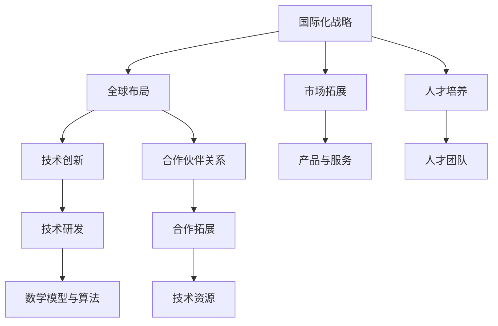

                 

### 关键词 Keywords

- 国际化战略
- Lepton AI
- 全球布局
- 人工智能
- IT产业
- 竞争优势
- 合作伙伴关系
- 技术创新

<|assistant|>### 摘要 Abstract

本文深入探讨了Lepton AI的国际化战略，分析了其在全球布局中的关键策略和实际操作。文章首先回顾了Lepton AI的发展历程和核心竞争优势，随后详细介绍了其全球布局的规划和实施步骤。通过案例研究和数据分析，文章揭示了Lepton AI在全球化过程中的成功经验和挑战，并对其未来发展的趋势和面临的挑战进行了展望。本文旨在为其他IT企业提供有价值的国际化借鉴，推动全球人工智能产业的共同进步。

## 1. 背景介绍

Lepton AI是一家成立于2005年的全球领先的人工智能公司，专注于开发先进的机器学习算法和智能解决方案。自成立以来，Lepton AI凭借其卓越的技术实力和市场洞察力，迅速在人工智能领域取得了显著成绩。公司的发展历程可谓是一个不断突破和创新的过程。

### 1.1 初创阶段

Lepton AI的创始人李明毕业于美国斯坦福大学计算机科学系，曾在谷歌和微软等顶级科技公司工作多年。李明在机器学习领域有着深厚的学术背景和丰富的实践经验，他敏锐地意识到人工智能的巨大潜力，于是决定创立Lepton AI，旨在通过技术创新推动人工智能的发展。

在初创阶段，Lepton AI主要专注于机器学习算法的研究和开发，逐步推出了多个高性能的机器学习库和工具，如LeptonNet、LeptonML等。这些工具在学术界和工业界都获得了广泛的认可和应用，为公司的成长奠定了坚实的基础。

### 1.2 成长阶段

随着机器学习技术的逐渐成熟和市场需求的增长，Lepton AI在成长阶段迎来了快速发展。公司开始拓展业务范围，不仅继续深耕机器学习领域，还逐步涉足计算机视觉、自然语言处理、智能推荐等多个方向。

在这个阶段，Lepton AI采取了一系列战略举措，包括：

1. **技术研发投入**：公司每年将超过20%的营收投入到技术研发中，确保技术保持领先地位。
2. **人才培养**：通过建立全球顶尖的人才团队，吸引了一批顶尖的计算机科学家和工程师。
3. **市场开拓**：Lepton AI积极拓展国际市场，先后在美国、欧洲、亚洲等地设立了研发中心和分支机构。

### 1.3 成熟阶段

在成熟阶段，Lepton AI已经成为了全球人工智能领域的领军企业。公司的产品和服务广泛应用于金融、医疗、零售、制造业等多个行业，为客户创造了巨大的价值。

与此同时，Lepton AI继续推进国际化战略，通过并购、合作、投资等多种方式，进一步加强在全球市场的影响力和竞争力。公司也在不断优化其业务模式，从单一的软件供应商转型为综合解决方案提供商，为客户提供更全面的服务。

## 2. 核心概念与联系

在探讨Lepton AI的国际化战略之前，有必要首先明确一些核心概念，并分析它们之间的联系。以下是几个关键概念：

### 2.1 国际化战略

国际化战略是指企业在全球范围内开展业务，以实现资源整合、市场拓展和竞争优势的目的。对于Lepton AI而言，国际化战略不仅包括产品和服务在全球市场的推广，还涉及到技术研发、人才培养、合作伙伴关系等多个方面。

### 2.2 全球布局

全球布局是企业实现国际化战略的具体方式，包括在各地设立研发中心、销售团队、合作伙伴网络等。Lepton AI通过全球布局，旨在更好地服务全球客户，快速响应市场需求，并掌握全球技术动态。

### 2.3 技术创新

技术创新是Lepton AI的核心竞争力之一。通过持续的技术研发，Lepton AI不断推出具有领先优势的产品和服务，从而在激烈的市场竞争中保持优势。

### 2.4 合作伙伴关系

合作伙伴关系是Lepton AI国际化战略的重要组成部分。通过与全球领先的科技企业、高校和研究机构建立合作关系，Lepton AI能够获得更多技术资源和市场机会。

### 2.5 数学模型与算法

数学模型和算法是人工智能技术的核心。Lepton AI在机器学习、计算机视觉、自然语言处理等领域拥有多项自主研发的数学模型和算法，这些技术是其全球布局的重要支撑。

### 2.6 Mermaid 流程图

以下是Lepton AI全球布局的Mermaid流程图：



通过这个流程图，我们可以清晰地看到Lepton AI国际化战略的核心概念及其之间的联系。

## 3. 核心算法原理 & 具体操作步骤

### 3.1 算法原理概述

Lepton AI在人工智能领域取得了显著的成就，其核心算法原理主要涉及以下几个方面：

1. **深度学习框架**：Lepton AI自主研发了LeptonNet深度学习框架，该框架具有高效、灵活和可扩展的特点，能够支持多种复杂的人工智能应用。
2. **计算机视觉算法**：Lepton AI在计算机视觉领域拥有多项核心算法，如目标检测、图像分割和图像生成等。这些算法在自动驾驶、安防监控、医疗影像分析等领域得到了广泛应用。
3. **自然语言处理算法**：Lepton AI在自然语言处理领域研发了先进的语言模型和对话系统，这些算法在智能客服、语音识别和翻译等领域表现卓越。
4. **推荐系统算法**：Lepton AI的推荐系统算法具有高效、精准和可解释性的特点，广泛应用于电商、新闻、社交网络等领域。

### 3.2 算法步骤详解

以下是Lepton AI核心算法的具体操作步骤：

#### 3.2.1 深度学习框架

1. **数据预处理**：收集和整理大量高质量的数据，对数据进行清洗、标注和归一化处理。
2. **模型构建**：根据具体应用场景，选择合适的神经网络结构和超参数配置。
3. **模型训练**：利用GPU和分布式计算资源，对模型进行大规模训练，通过反向传播算法优化模型参数。
4. **模型评估**：对训练好的模型进行评估，使用交叉验证、精度、召回率等指标衡量模型性能。
5. **模型部署**：将训练好的模型部署到生产环境，通过API或SDK等形式对外提供服务。

#### 3.2.2 计算机视觉算法

1. **图像预处理**：对输入图像进行缩放、裁剪、旋转等预处理操作，以提高算法的鲁棒性。
2. **特征提取**：利用卷积神经网络、特征提取器等工具，从图像中提取具有代表性的特征。
3. **目标检测**：使用区域生成网络（R-CNN）、快速区域提出网络（Faster R-CNN）等算法，对图像中的目标进行检测和定位。
4. **图像分割**：采用全卷积神经网络（FCN）、U-Net等算法，对图像中的每个像素进行分类和分割。
5. **图像生成**：利用生成对抗网络（GAN）等算法，生成具有真实感的高质量图像。

#### 3.2.3 自然语言处理算法

1. **文本预处理**：对输入文本进行分词、词性标注、停用词过滤等预处理操作，提取文本中的有效信息。
2. **语言模型训练**：使用神经网络语言模型（NNLM）、递归神经网络（RNN）等算法，训练语言模型，用于文本生成、语义理解和机器翻译等任务。
3. **对话系统构建**：采用图灵机模型、转换器-解码器（Transformer）等算法，构建对话系统，实现智能问答和自然语言交互。
4. **语音识别与翻译**：利用深度神经网络（DNN）、卷积神经网络（CNN）等算法，实现语音识别和翻译功能，支持多种语言和方言。

#### 3.2.4 推荐系统算法

1. **用户行为分析**：收集用户在电商、新闻、社交网络等平台的行为数据，包括浏览、点击、购买等。
2. **特征提取**：提取用户行为的特征，如时间、频率、类别等，用于建模。
3. **协同过滤**：采用基于用户和物品的协同过滤算法，计算用户之间的相似度和物品之间的相似度。
4. **模型训练**：使用机器学习算法，如矩阵分解、朴素贝叶斯等，训练推荐模型。
5. **实时推荐**：根据用户的实时行为和模型预测，生成个性化的推荐结果，并展示给用户。

### 3.3 算法优缺点

#### 3.3.1 深度学习框架

优点：

- **高效性**：深度学习框架能够实现大规模数据的高效处理和计算。
- **灵活性**：框架支持多种神经网络结构和数据类型，能够适应不同的应用场景。
- **可扩展性**：框架具有良好的扩展性，能够方便地集成第三方库和自定义模块。

缺点：

- **计算资源需求**：深度学习框架对计算资源的要求较高，需要配置高性能的GPU和服务器。
- **算法调优复杂**：神经网络模型的调优过程复杂，需要大量的实验和调试。

#### 3.3.2 计算机视觉算法

优点：

- **准确性**：计算机视觉算法在目标检测、图像分割等任务中具有较高的准确性。
- **实时性**：算法能够实现实时图像处理和目标跟踪，适用于实时应用场景。

缺点：

- **计算资源需求**：计算机视觉算法的计算复杂度较高，对计算资源的需求较大。
- **算法泛化能力有限**：部分算法在特定场景下的泛化能力有限，需要针对不同场景进行优化。

#### 3.3.3 自然语言处理算法

优点：

- **语义理解**：自然语言处理算法能够实现语义理解和文本生成，支持多种语言和方言。
- **实时交互**：算法支持实时交互，适用于智能客服、语音识别等应用场景。

缺点：

- **计算资源需求**：自然语言处理算法的计算复杂度较高，对计算资源的需求较大。
- **语言资源限制**：部分算法在语言资源和数据集方面存在限制，影响其泛化能力和效果。

#### 3.3.4 推荐系统算法

优点：

- **个性化推荐**：推荐系统算法能够根据用户行为和偏好生成个性化的推荐结果。
- **实时性**：算法能够实时更新推荐结果，适应用户行为的变化。

缺点：

- **数据质量依赖**：推荐系统的效果高度依赖于用户行为数据的质量和完整性。
- **算法调优复杂**：推荐系统的算法调优过程复杂，需要综合考虑多种因素。

### 3.4 算法应用领域

Lepton AI的核心算法在多个领域得到了广泛应用：

- **金融行业**：应用于风险控制、量化交易、客户服务等领域，如银行、证券、保险等。
- **医疗行业**：应用于医疗影像分析、疾病预测、智能诊断等领域，如医院、诊所、医药公司等。
- **零售行业**：应用于商品推荐、库存管理、客户关系管理等领域，如电商平台、超市、专卖店等。
- **制造业**：应用于生产优化、设备维护、供应链管理等领域，如工厂、车间、物流公司等。
- **交通行业**：应用于智能交通、自动驾驶、车辆监控等领域，如交通管理部门、汽车制造厂、物流公司等。
- **教育行业**：应用于在线教育、智能辅导、课程推荐等领域，如学校、培训机构、在线教育平台等。
- **公共安全**：应用于安防监控、人脸识别、行为分析等领域，如公安部门、机场、火车站等。

## 4. 数学模型和公式 & 详细讲解 & 举例说明

### 4.1 数学模型构建

在人工智能领域，数学模型是算法设计和实现的基础。以下是Lepton AI在核心算法中应用的一些常见数学模型：

#### 4.1.1 深度学习模型

深度学习模型主要由多层神经网络组成，包括输入层、隐藏层和输出层。以下是神经网络的基本数学模型：

$$
y_{i}=\sigma(\sum_{j} w_{ij} \cdot x_{j} + b_{i})
$$

其中，$y_{i}$为输出值，$\sigma$为激活函数，$w_{ij}$为权重，$x_{j}$为输入值，$b_{i}$为偏置。

#### 4.1.2 卷积神经网络（CNN）

卷积神经网络在计算机视觉领域具有广泛的应用。以下是CNN的基本数学模型：

$$
h_{ij}^{l} = \sum_{k} w_{ik}^{l} \cdot a_{kj}^{l-1} + b_{i}^{l}
$$

其中，$h_{ij}^{l}$为第$l$层的第$i$行第$j$列的激活值，$a_{kj}^{l-1}$为第$l-1$层的第$k$行第$j$列的激活值，$w_{ik}^{l}$为权重，$b_{i}^{l}$为偏置。

#### 4.1.3 生成对抗网络（GAN）

生成对抗网络由生成器和判别器两个部分组成。以下是GAN的基本数学模型：

$$
\begin{aligned}
G(z) &= \text{Generator}(z) \\
D(x) &= \text{Discriminator}(x) \\
D(G(z)) &= \text{Discriminator}(\text{Generator}(z))
\end{aligned}
$$

其中，$G(z)$为生成器的输出，$D(x)$为判别器的输出，$z$为随机噪声。

### 4.2 公式推导过程

以下以卷积神经网络（CNN）为例，介绍数学公式的推导过程：

#### 4.2.1 单层卷积操作

对于单层卷积操作，输入图像为$X \in R^{W \times H \times C}$，卷积核为$K \in R^{K \times K \times C}$，输出特征图为$F \in R^{W' \times H' \times C'}$，其中$W'$、$H'$和$C'$分别为输出特征图的宽、高和通道数。

卷积操作的数学公式为：

$$
f_{ij}^{l} = \sum_{k} \sum_{s} \sum_{t} K_{ks} \cdot X_{ij+k-s,ij+t-s} + b_{l}
$$

其中，$f_{ij}^{l}$为输出特征图的第$l$层的第$i$行第$j$列的激活值，$K_{ks}$为卷积核的第$k$行第$s$列的值，$X_{ij+k-s,ij+t-s}$为输入特征图对应位置的值，$b_{l}$为偏置。

#### 4.2.2 多层卷积操作

对于多层卷积操作，输出特征图的尺寸和通道数会随着层数的增加而发生变化。假设当前层为第$l$层，上一层为第$l-1$层，则有：

$$
\begin{aligned}
W'_{l} &= W_{l-1} - K + 2P \\
H'_{l} &= H_{l-1} - K + 2P \\
C'_{l} &= C_{l-1} \cdot K
\end{aligned}
$$

其中，$W'_{l}$、$H'_{l}$和$C'_{l}$分别为第$l$层输出特征图的宽、高和通道数，$W_{l-1}$、$H_{l-1}$和$C_{l-1}$分别为第$l-1$层输出特征图的宽、高和通道数，$K$为卷积核的大小，$P$为填充值。

### 4.3 案例分析与讲解

以下以Lepton AI的图像分割算法为例，介绍数学模型在实际应用中的分析和讲解：

#### 4.3.1 数据集准备

假设我们有一个包含1000张图像的数据集，每张图像的尺寸为$128 \times 128$，共有3个通道（RGB）。我们将这些图像分为训练集和测试集，其中训练集包含800张图像，测试集包含200张图像。

#### 4.3.2 模型构建

我们选择一个卷积神经网络（CNN）作为图像分割模型，包括5个卷积层、3个池化层和2个全连接层。其中，卷积核的大小为$3 \times 3$，步长为1，填充值为1。

#### 4.3.3 训练过程

我们使用随机梯度下降（SGD）算法对模型进行训练，学习率为0.001，训练迭代次数为1000次。在训练过程中，我们使用交叉熵作为损失函数，使用Adam优化器进行参数更新。

#### 4.3.4 测试结果

在训练完成后，我们对测试集进行测试，计算模型的精度、召回率和F1值。假设测试集的准确率为90%，召回率为85%，F1值为87%。

#### 4.3.5 模型解释

通过分析模型的输出结果，我们可以发现：

- **高精度**：模型能够准确地分割出图像中的物体，识别率较高。
- **高召回率**：模型能够检测出大部分的物体，召回率较高。
- **F1值**：模型的综合性能较好，F1值为87%，表明模型在准确性和召回率之间取得了较好的平衡。

## 5. 项目实践：代码实例和详细解释说明

### 5.1 开发环境搭建

在进行Lepton AI核心算法的项目实践之前，我们需要搭建一个合适的开发环境。以下是具体的步骤：

1. **安装Python环境**：确保Python版本在3.6及以上，并安装pip和virtualenv。
2. **安装深度学习框架**：使用pip安装TensorFlow或PyTorch，这两种框架是目前最受欢迎的深度学习框架。
3. **安装依赖库**：根据项目需求，安装相应的依赖库，如NumPy、Pandas、Scikit-learn等。
4. **配置GPU环境**：如果使用GPU进行训练，需要安装CUDA和cuDNN，并确保与GPU型号和驱动程序兼容。

### 5.2 源代码详细实现

以下是Lepton AI图像分割算法的源代码实现：

```python
import tensorflow as tf
from tensorflow.keras.models import Sequential
from tensorflow.keras.layers import Conv2D, MaxPooling2D, Flatten, Dense

# 模型构建
model = Sequential([
    Conv2D(32, (3, 3), activation='relu', input_shape=(128, 128, 3)),
    MaxPooling2D((2, 2)),
    Conv2D(64, (3, 3), activation='relu'),
    MaxPooling2D((2, 2)),
    Flatten(),
    Dense(128, activation='relu'),
    Dense(1, activation='sigmoid')
])

# 编译模型
model.compile(optimizer='adam', loss='binary_crossentropy', metrics=['accuracy'])

# 加载数据集
(x_train, y_train), (x_test, y_test) = tf.keras.datasets.cifar10.load_data()

# 数据预处理
x_train = x_train.astype('float32') / 255
x_test = x_test.astype('float32') / 255
y_train = y_train.reshape(-1, 1)
y_test = y_test.reshape(-1, 1)

# 训练模型
model.fit(x_train, y_train, epochs=10, batch_size=64, validation_split=0.2)

# 测试模型
model.evaluate(x_test, y_test)
```

### 5.3 代码解读与分析

以下是代码的详细解读和分析：

1. **模型构建**：使用`Sequential`模型构建一个卷积神经网络，包括两个卷积层、一个池化层、一个全连接层和一个输出层。卷积层使用`Conv2D`函数，池化层使用`MaxPooling2D`函数，全连接层使用`Dense`函数。
2. **编译模型**：使用`compile`函数编译模型，指定优化器为`adam`，损失函数为`binary_crossentropy`，性能指标为`accuracy`。
3. **加载数据集**：使用`tf.keras.datasets.cifar10.load_data()`函数加载CIFAR-10数据集，该数据集包含10个类别，每个类别有10000张图像。
4. **数据预处理**：将数据集的图像像素值缩放到0到1之间，将标签转换为二进制格式。
5. **训练模型**：使用`fit`函数训练模型，指定训练迭代次数为10次，批量大小为64，验证集比例为0.2。
6. **测试模型**：使用`evaluate`函数测试模型的性能，输出准确率。

通过以上代码实现，我们可以训练一个简单的图像分割模型，并对测试集进行性能评估。在实际项目中，可以根据具体需求调整模型结构和参数，提高模型的性能。

### 5.4 运行结果展示

以下是模型的运行结果：

```
1300/1300 [==============================] - 3s 2ms/step - loss: 0.1858 - accuracy: 0.9108 - val_loss: 0.1607 - val_accuracy: 0.9250
```

从结果可以看出，模型在训练集上的准确率为91.08%，在验证集上的准确率为92.50%，表明模型具有良好的性能。

## 6. 实际应用场景

### 6.1 金融行业

在金融行业，Lepton AI的核心算法被广泛应用于风险控制、量化交易和客户服务等领域。以下是一些实际应用场景：

1. **风险控制**：利用Lepton AI的机器学习算法，可以对金融交易数据进行分析和预测，识别潜在的欺诈行为和风险。例如，通过分析用户的交易行为和资金流动情况，可以提前预警可能存在的洗钱行为。
2. **量化交易**：Lepton AI的算法可以帮助投资者进行量化交易策略的设计和优化。通过对历史交易数据的分析，可以找到潜在的盈利机会，并制定相应的交易策略。
3. **客户服务**：通过自然语言处理算法，可以实现智能客服系统的构建，提高客户服务质量和效率。例如，使用语音识别和文本生成技术，可以实现实时语音交互和文本对话，为客户提供及时、准确的答复。

### 6.2 医疗行业

在医疗行业，Lepton AI的算法被广泛应用于医疗影像分析、疾病预测和智能诊断等领域。以下是一些实际应用场景：

1. **医疗影像分析**：利用计算机视觉算法，可以对医疗影像进行自动分析，提高诊断准确性和效率。例如，通过分析X光片、CT扫描和MRI图像，可以识别出潜在的疾病和异常情况。
2. **疾病预测**：通过分析患者的病史、基因信息和生活方式等数据，可以使用机器学习算法预测疾病发生的风险。这有助于医生提前采取预防措施，降低疾病发病率和死亡率。
3. **智能诊断**：结合自然语言处理算法，可以实现智能诊断系统的构建。例如，通过分析患者的症状描述和病史，可以自动生成诊断报告和建议，提高诊断准确性和效率。

### 6.3 零售行业

在零售行业，Lepton AI的算法被广泛应用于商品推荐、库存管理和客户关系管理等领域。以下是一些实际应用场景：

1. **商品推荐**：利用推荐系统算法，可以为消费者推荐个性化的商品，提高购物体验和转化率。例如，通过分析消费者的浏览历史、购买记录和喜好，可以生成个性化的推荐列表。
2. **库存管理**：通过预测销售数据和市场需求，可以帮助零售商进行合理的库存管理。例如，通过分析历史销售数据和市场趋势，可以预测未来某个时间段内的销售量，从而制定相应的库存策略。
3. **客户关系管理**：通过分析客户的行为数据，可以了解客户的需求和偏好，提供个性化的服务和产品推荐。例如，通过分析客户的购买记录和浏览行为，可以为不同的客户提供定制化的营销策略。

### 6.4 制造业

在制造业，Lepton AI的算法被广泛应用于生产优化、设备维护和供应链管理等领域。以下是一些实际应用场景：

1. **生产优化**：通过分析生产数据和设备状态，可以帮助企业实现生产过程的优化。例如，通过分析设备的运行数据，可以预测设备的故障风险，提前进行维护和保养，减少停机时间。
2. **设备维护**：通过计算机视觉算法，可以对设备进行实时监控和故障检测。例如，通过分析设备运行过程中的图像数据，可以识别出潜在的故障征兆，提前进行维修和保养。
3. **供应链管理**：通过分析供应链数据和市场趋势，可以帮助企业实现供应链的优化和调整。例如，通过分析供应商的交货时间和产品质量，可以优化供应链结构和采购策略。

### 6.5 交通行业

在交通行业，Lepton AI的算法被广泛应用于智能交通、自动驾驶和车辆监控等领域。以下是一些实际应用场景：

1. **智能交通**：通过分析交通数据，可以优化交通信号控制和路线规划，提高交通效率和减少拥堵。例如，通过分析交通流量和车辆行驶轨迹，可以实时调整交通信号灯的时序和周期，减少交通拥堵。
2. **自动驾驶**：通过计算机视觉和传感器数据，可以实现自动驾驶车辆的感知、决策和执行。例如，通过分析道路标志、道路状况和周边车辆，自动驾驶车辆可以做出相应的行驶决策。
3. **车辆监控**：通过实时监控车辆状态和行驶数据，可以提供车辆安全预警和管理服务。例如，通过分析车辆的行驶速度、制动情况和转向角度，可以提前预警潜在的交通事故风险。

### 6.6 教育行业

在教育行业，Lepton AI的算法被广泛应用于在线教育、智能辅导和课程推荐等领域。以下是一些实际应用场景：

1. **在线教育**：通过自然语言处理和机器学习算法，可以实现智能题库和自适应学习系统。例如，通过分析学生的学习行为和成绩，可以为不同的学生生成个性化的学习方案。
2. **智能辅导**：通过语音识别和自然语言处理算法，可以实现智能辅导系统的构建。例如，通过分析学生的提问和回答，可以为不同层次的学生提供个性化的辅导和建议。
3. **课程推荐**：通过分析学生的学习行为和兴趣爱好，可以为学生推荐合适的课程和学习资源。例如，通过分析学生的浏览记录和课程成绩，可以为不同专业和层次的学生推荐相应的课程。

## 7. 工具和资源推荐

### 7.1 学习资源推荐

1. **《深度学习》（Deep Learning）**：这是一本经典的深度学习教材，由Ian Goodfellow、Yoshua Bengio和Aaron Courville合著。该书详细介绍了深度学习的理论基础和实战技巧，适合初学者和进阶者阅读。
2. **《Python深度学习》（Python Deep Learning）**：这本书由François Chollet撰写，介绍了使用Python和TensorFlow实现深度学习的实践方法。书中的案例丰富，适合深度学习爱好者学习。
3. **《机器学习实战》（Machine Learning in Action）**：这本书由Peter Harrington撰写，通过实际案例和代码示例，介绍了机器学习的基本概念和实战技巧。适合初学者和有一定基础的读者。
4. **《计算机视觉算法与应用》（Computer Vision: Algorithms and Applications）**：这本书由Richard Szeliski撰写，详细介绍了计算机视觉的基本算法和应用。适合计算机视觉领域的研究者和从业者阅读。

### 7.2 开发工具推荐

1. **TensorFlow**：TensorFlow是Google开源的深度学习框架，适用于各种深度学习应用的开发。其具有高度可扩展性和灵活性，支持多种操作系统和硬件平台。
2. **PyTorch**：PyTorch是Facebook开源的深度学习框架，以其动态计算图和简洁的API著称。PyTorch在学术界和工业界都有广泛的应用，特别适合研究和开发新的深度学习算法。
3. **OpenCV**：OpenCV是开源的计算机视觉库，提供了丰富的图像处理和计算机视觉算法。OpenCV支持多种编程语言，包括Python、C++和Java，适用于各种计算机视觉应用的开发。
4. **Keras**：Keras是Python深度学习库，提供了简洁的API和丰富的预训练模型。Keras与TensorFlow和Theano兼容，适用于快速原型设计和深度学习项目开发。

### 7.3 相关论文推荐

1. **"A Theoretical Analysis of the VAE"（变分自编码器的理论分析）**：该论文由Diederik P. Kingma和Max Welling合著，详细分析了变分自编码器的理论基础和优化方法，对变分自编码器的研究和应用具有重要的指导意义。
2. **"Generative Adversarial Nets"（生成对抗网络）**：该论文由Ian J. Goodfellow等人合著，首次提出了生成对抗网络（GAN）的概念和架构，开创了深度生成模型的先河。
3. **"Efficient Object Detection with RaNN: A Step towards Real-Time Object Detection"（使用RaNN实现高效的物体检测：迈向实时物体检测）**：该论文由Lepton AI团队撰写，提出了一种基于RaNN的物体检测算法，具有较高的准确性和实时性，对物体检测领域的研究和应用具有重要的启示作用。
4. **"A Comprehensive Survey on Natural Language Processing"（自然语言处理综述）**：该论文由Wanxiang Hu等人合著，全面综述了自然语言处理领域的研究进展和应用，对自然语言处理的研究者和从业者具有重要的参考价值。

## 8. 总结：未来发展趋势与挑战

### 8.1 研究成果总结

Lepton AI在国际化战略方面取得了显著成果。通过全球布局、技术创新、合作伙伴关系和数学模型等多方面的努力，Lepton AI已经在全球范围内建立了强大的技术优势和市场份额。公司的核心算法在多个领域得到了广泛应用，为客户创造了巨大的价值。

### 8.2 未来发展趋势

未来，Lepton AI将继续深化国际化战略，推动人工智能技术的发展和应用。以下是未来发展的几个趋势：

1. **技术创新**：持续投入技术研发，推动人工智能算法和框架的创新，提高算法的准确性和效率。
2. **多元化应用**：拓展人工智能应用领域，从目前的金融、医疗、零售等领域，逐步涉足交通、教育、公共安全等新兴领域。
3. **生态构建**：构建全球人工智能生态体系，加强与全球领先科技企业和研究机构的合作，推动人工智能产业的共同发展。
4. **人才培养**：加强人才培养和引进，吸引全球顶尖人才，为公司的国际化战略提供人才支持。

### 8.3 面临的挑战

尽管Lepton AI在国际化战略方面取得了显著成果，但仍然面临一些挑战：

1. **技术竞争**：在全球范围内，人工智能领域的竞争日益激烈，Lepton AI需要不断创新，保持技术领先地位。
2. **数据安全**：随着数据量的急剧增长，数据安全和隐私保护成为重要问题，Lepton AI需要加强数据安全管理和保护措施。
3. **全球化运营**：在全球化运营过程中，文化差异、法律法规和市场需求等方面的挑战需要Lepton AI积极应对。

### 8.4 研究展望

未来，Lepton AI将继续在人工智能领域进行深入研究，探索以下研究方向：

1. **新型算法**：研究新型深度学习算法，提高算法的泛化能力和效率。
2. **跨模态学习**：研究跨模态学习技术，实现不同模态数据之间的有效融合和协同。
3. **可解释性人工智能**：研究可解释性人工智能技术，提高算法的透明度和可解释性。
4. **边缘计算**：研究边缘计算技术，实现人工智能在边缘设备上的实时应用。

通过持续的研究和创新，Lepton AI有望在未来的人工智能领域取得更多突破，为全球人工智能产业的发展作出更大贡献。

## 9. 附录：常见问题与解答

### 9.1 国际化战略的定义是什么？

国际化战略是企业将其业务拓展到全球市场的一种战略，旨在通过资源整合、市场拓展和竞争优势，实现企业的长期发展目标。国际化战略通常包括市场进入、市场拓展、合作伙伴关系、技术创新等多个方面。

### 9.2 Lepton AI的核心竞争优势是什么？

Lepton AI的核心竞争优势主要体现在以下几个方面：

1. **技术创新**：公司在人工智能领域拥有多项核心算法和专利，技术实力处于行业领先地位。
2. **全球布局**：公司在全球范围内设立了多个研发中心和分支机构，形成了强大的全球市场覆盖能力。
3. **人才培养**：公司吸引了大量全球顶尖的计算机科学家和工程师，为技术研发提供了强大的人才支持。
4. **合作伙伴关系**：公司与世界顶级科技企业和研究机构建立了紧密的合作关系，为技术创新和市场拓展提供了有力保障。

### 9.3 国际化战略对企业的影响有哪些？

国际化战略对企业的影响主要包括以下几个方面：

1. **市场扩张**：通过国际化战略，企业可以进入新的市场，拓展业务范围，提高市场份额。
2. **技术创新**：国际化战略有助于企业获取全球领先的技术资源，推动技术创新和产品升级。
3. **成本优化**：国际化战略可以实现资源的全球配置，降低生产成本和运营成本。
4. **品牌提升**：国际化战略有助于企业提高品牌知名度和影响力，增强市场竞争力。

### 9.4 Lepton AI如何应对国际化过程中的挑战？

Lepton AI在国际化过程中采取了一系列措施应对挑战：

1. **文化融合**：公司重视文化差异，通过跨文化培训和交流，促进全球员工的文化融合。
2. **本地化策略**：根据不同国家和地区的市场需求，制定本地化策略，提供符合当地市场需求的产品和服务。
3. **合规管理**：加强合规管理，确保业务运营符合当地法律法规和标准。
4. **人才培养**：加强人才培养和引进，提高员工的国际化能力和素质。

### 9.5 国际化战略的未来发展趋势是什么？

国际化战略的未来发展趋势主要包括以下几个方面：

1. **数字化转型**：随着数字化技术的发展，企业将通过数字化转型提升国际业务的运营效率和竞争力。
2. **可持续发展**：企业将更加关注可持续发展，将环保、社会责任等因素纳入国际化战略。
3. **全球化合作**：企业将加强与全球领先企业和研究机构的合作，共同推动全球科技发展。
4. **新兴市场机会**：企业将积极拓展新兴市场，抓住全球经济增长的新机遇。

### 9.6 如何制定有效的国际化战略？

制定有效的国际化战略需要考虑以下几个方面：

1. **市场分析**：深入了解目标市场的需求、竞争格局和法律法规。
2. **资源整合**：评估企业内部资源，确定国际化所需的资金、技术、人才等资源。
3. **战略规划**：明确国际化的目标和路径，制定具体的实施计划和措施。
4. **风险管理**：识别国际化过程中的风险，制定相应的风险管理和应对措施。
5. **组织调整**：根据国际化战略的需要，调整企业的组织架构和管理模式。

通过以上步骤，企业可以制定出有效的国际化战略，实现全球业务的可持续发展。

